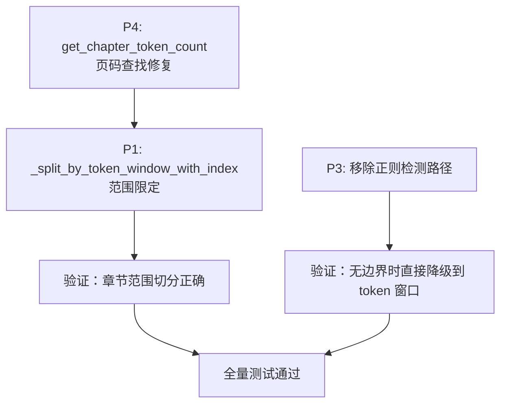

# 修复计划：chunk_pipeline 质量审计问题（2026-03-13）

## 问题来源

基于 2026-03-13 质量审计，发现 chunk_pipeline 相关实现中 3 个需修复的问题。

---

## 问题清单

| 编号 | 严重度 | 文件 | 问题描述 | 类别 |
| --- | --- | --- | --- | --- |
| P1 | 🔴 高 | `chunker.py` | `_split_by_token_window_with_index` 遍历全文档而非章节范围 | 功能性 bug |
| P3 | 🟡 中 | `chunker.py` | 移除 `_split_by_subheadings` 正则检测降级路径，直接降级到 token 窗口 | 简化重构 |
| P4 | 🟡 中 | `token_indexer.py` | `get_chapter_token_count` 页码到索引映射假设脆弱 | 潜在 bug |

---

## P1：`_split_by_token_window_with_index` 遍历全文档

### 问题定位

`core/data/chunker.py` → `_split_by_token_window_with_index()` 函数

```python
def _split_by_token_window_with_index(
    text: str,
    chapter_path: list[str],
    page_range: tuple[int, int],
    *,
    max_tokens: int,
    overlap_tokens: int,
    token_index: PageTokenIndex,
) -> list[Chunk]:
    chunks: list[Chunk] = []
    start = 0  # ← 问题：从全文档第 0 个 token 开始

    while start < token_index.total_tokens:  # ← 问题：遍历到全文档末尾
```

### 问题分析

- 函数接收 `page_range` 参数，表示当前章节在文档中的页码范围
- 但实际循环从 `start = 0` 开始，一路切到 `token_index.total_tokens`
- 调用场景是「对某个超长章节做 token 窗口兜底」，应该只处理该章节范围内的 token
- 后果：切出的 chunks 包含其他章节的内容，页码范围错乱

### 修复方案

1. 根据 `page_range` 从 `token_index.page_boundaries` 中定位该章节的 token 起止范围
2. 将循环限制在该范围内

```python
def _split_by_token_window_with_index(
    text: str,
    chapter_path: list[str],
    page_range: tuple[int, int],
    *,
    max_tokens: int,
    overlap_tokens: int,
    token_index: PageTokenIndex,
) -> list[Chunk]:
    # 1. 定位章节在 token 池中的起止位置
    chapter_start_token = None
    chapter_end_token = None

    for page_num, token_start in token_index.page_boundaries:
        if page_num == page_range[0] and chapter_start_token is None:
            chapter_start_token = token_start
        if page_num == page_range[1]:
            # 找到下一页的 start 作为 end
            page_idx = next(
                i for i, (pn, _) in enumerate(token_index.page_boundaries)
                if pn == page_range[1]
            )
            if page_idx + 1 < len(token_index.page_boundaries):
                chapter_end_token = token_index.page_boundaries[page_idx + 1][1]
            else:
                chapter_end_token = token_index.total_tokens

    if chapter_start_token is None or chapter_end_token is None:
        # 降级：使用无 index 的简单滑动窗口
        return _split_by_token_window_fallback(text, chapter_path, page_range,
                                                max_tokens=max_tokens,
                                                overlap_tokens=overlap_tokens)

    # 2. 在章节 token 范围内滑动窗口
    chunks: list[Chunk] = []
    start = chapter_start_token

    while start < chapter_end_token:
        window_length = min(max_tokens, chapter_end_token - start)
        window_text, actual_tokens, window_page_range = slice_window_from_index(
            index=token_index, start=start, length=window_length,
        )
        # ... 构建 Chunk（与当前逻辑一致）
        start += max_tokens - overlap_tokens
```

### 测试用例

```python
class TestSplitByTokenWindowWithIndex:
    """验证 _split_by_token_window_with_index 只处理章节范围。"""

    def test_only_covers_chapter_pages(self):
        """切分结果的页码范围应在章节 page_range 内。

        fixture：3 章文档（各约 1000 tokens），对第 2 章调用。
        预期：所有 chunk 的 page_range 在第 2 章范围内。
        """
        ...

    def test_does_not_include_other_chapter_content(self):
        """切分结果不应包含其他章节的文本。

        fixture：3 章文档，每章有唯一标记文本。
        预期：第 2 章的 chunks 不含第 1/3 章标记。
        """
        ...

    def test_token_count_matches_chapter_total(self):
        """所有 chunk 的去重 token 总数应等于章节 token 数。"""
        ...
```

---

## P3：移除 `_split_by_subheadings` 正则检测降级路径

### 问题定位

`core/data/chunker.py` → `_split_by_subheadings()` 正则检测分支（`sub_boundaries` 为 None 时）

### 问题分析

`_split_by_subheadings()` 在 `sub_boundaries` 为 None 时，会用正则表达式在章节文本中搜索 Markdown 标题来拆分。此路径存在两个问题：

1. 所有拆分出的子节继承父章节的整体 `page_range`，元数据不精确
2. 正则检测本身不可靠——如果 Markdown 中没有 `##` 标题，正则找不到任何子标题，同样要降级

### 修复方案

**直接移除正则检测路径（路径 B）**。当 `sub_boundaries` 为 None 时，`_split_by_subheadings()` 直接返回空列表（或原文不拆），调用方发现拆分无效后自动降级到 `_split_by_token_window` 做纯 token 窗口切分。

**理由：**

- token 窗口切分配合 `token_index` 可以产出精确的 `page_range`，比正则路径的粗粒度 page_range 更好
- 减少一条不可靠的代码路径，降低维护复杂度
- 文本结构识别交给下游 LLM 在摘要阶段处理

```python
def _split_by_subheadings(
    text: str,
    chapter_path: list[str],
    page_range: tuple[int, int],
    sub_boundaries: list[ChapterBoundary] | None,
    ...,
) -> list[Chunk]:
    # 路径 A：有预检测边界，按边界拆分（保留）
    if sub_boundaries is not None:
        # ... 现有逻辑不变
        ...

    # 路径 B 已移除：直接返回空列表，触发调用方降级到 token 窗口
    return []
```

### 测试用例

```python
def test_no_sub_boundaries_returns_empty(self):
    """无预检测边界时应返回空列表，触发调用方降级。"""
    result = _split_by_subheadings(
        text=long_chapter_text,
        chapter_path=["Chapter 3"],
        page_range=(5, 20),
        sub_boundaries=None,
        ...,
    )
    assert result == []

def test_caller_falls_back_to_token_window(self):
    """调用方在 _split_by_subheadings 返回空时应降级到 token 窗口。"""
    ...
```

---

## P4：`get_chapter_token_count` 页码映射假设脆弱（防御性修复）

### 问题定位

`core/data/token_indexer.py` → `get_chapter_token_count()` 第 ~160 行

```python
# 找到结束页的 token 边界
for page_num, token_start in index.page_boundaries:
    if page_num == end_page:
        page_idx = end_page - 1  # ← 假设页码从 1 开始连续递增
        if page_idx + 1 < len(index.page_boundaries):
            end_token = index.page_boundaries[page_idx + 1][1]  # ← 用 0-based 索引访问
        else:
            end_token = index.total_tokens
        break
```

### 问题分析

`page_idx = end_page - 1` 假设第 N 页在 `page_boundaries` 数组的第 N-1 个位置。

**当前该假设是稳定的：**

- `chunk_pipeline.py` 调用 `parse_pdf_bytes(content)` 不传 `pages` 参数，pymupdf4llm 处理全部页面
- pymupdf4llm 对每一页（含空白页）都返回 chunk，不会跳页
- 因此 `page_boundaries` 始终为 `[(1, 0), (2, x), (3, y), ...]`，第 N 页确实在第 N-1 位

**但该假设是脆弱的：**

- `parse_pdf` 的 API 签名明确支持 `pages` 参数（选择性解析）
- 如果未来有人传了 `pages=[0, 5, 10]`，页码变为 1, 6, 11，`end_page - 1` 映射就会断裂
- 同文件的 `find_page_at_token` 使用了正确的二分查找，不依赖连续页码假设，且逻辑健壮
- `get_chapter_token_count` 明明在 for 循环中已经找到了正确的位置，却没有使用，反而用了一个额外的假设来计算索引

### 修复方案

改为与 `find_page_at_token` 一致的查找方式，消除对页码连续性的依赖。改动极小，成本低，作为防御性修复。

```python
def get_chapter_token_count(
    index: PageTokenIndex,
    start_page: int,
    end_page: int,
) -> int:
    # 找到起始页的 token 边界（线性查找，不依赖页码连续性）
    start_token = None
    end_token = None

    for i, (page_num, token_start) in enumerate(index.page_boundaries):
        if page_num == start_page and start_token is None:
            start_token = token_start
        if page_num == end_page:
            # 用实际遍历位置 i 找下一页，而非 end_page - 1
            if i + 1 < len(index.page_boundaries):
                end_token = index.page_boundaries[i + 1][1]
            else:
                end_token = index.total_tokens
            break

    if start_token is None or end_token is None:
        return 0

    return end_token - start_token
```

关键变化：用 `enumerate` 遍历找到实际位置 `i`，用 `i + 1` 取下一页，而非 `end_page - 1`。与 `find_page_at_token` 的思路保持一致。

### 测试用例

```python
class TestGetChapterTokenCount:
    def test_consecutive_pages(self):
        """页码连续时应正确计算 token 数（回归测试）。

        fixture：page_boundaries = [(1, 0), (2, 100), (3, 200)]
        查询 start_page=2, end_page=2
        预期：200 - 100 = 100
        """
        ...

    def test_non_consecutive_pages(self):
        """页码不连续时应正确计算 token 数（防御性验证）。

        fixture：page_boundaries = [(1, 0), (3, 100), (6, 200)]
        查询 start_page=3, end_page=3
        预期：200 - 100 = 100
        旧代码会用 page_idx = 3 - 1 = 2，取 page_boundaries[3]，越界或错位
        """
        ...

    def test_last_page(self):
        """最后一页应使用 total_tokens 作为结束位置。"""
        ...
```

---

## 执行顺序



### 推荐顺序

1. **P4** → P1 的前置（P1 修复需要正确的 token 范围计算，依赖 P4 的页码查找）
2. **P1** → 最关键的功能性 bug
3. **P3** → 移除正则路径，独立可并发

---

## Git 准备

```bash
git checkout master && git pull
git checkout -b fix/chunk-pipeline-audit-fixes
```

---

## 验证清单

- [ ]  `_split_by_token_window_with_index` 只在章节 token 范围内切分
- [ ]  `get_chapter_token_count` 不再依赖页码连续性假设
- [ ]  `_split_by_subheadings` 正则检测路径已移除，无边界时直接降级到 token 窗口
- [ ]  全量测试通过：`pytest tests/ -v`
- [ ]  类型检查通过：`basedpyright core/data/`