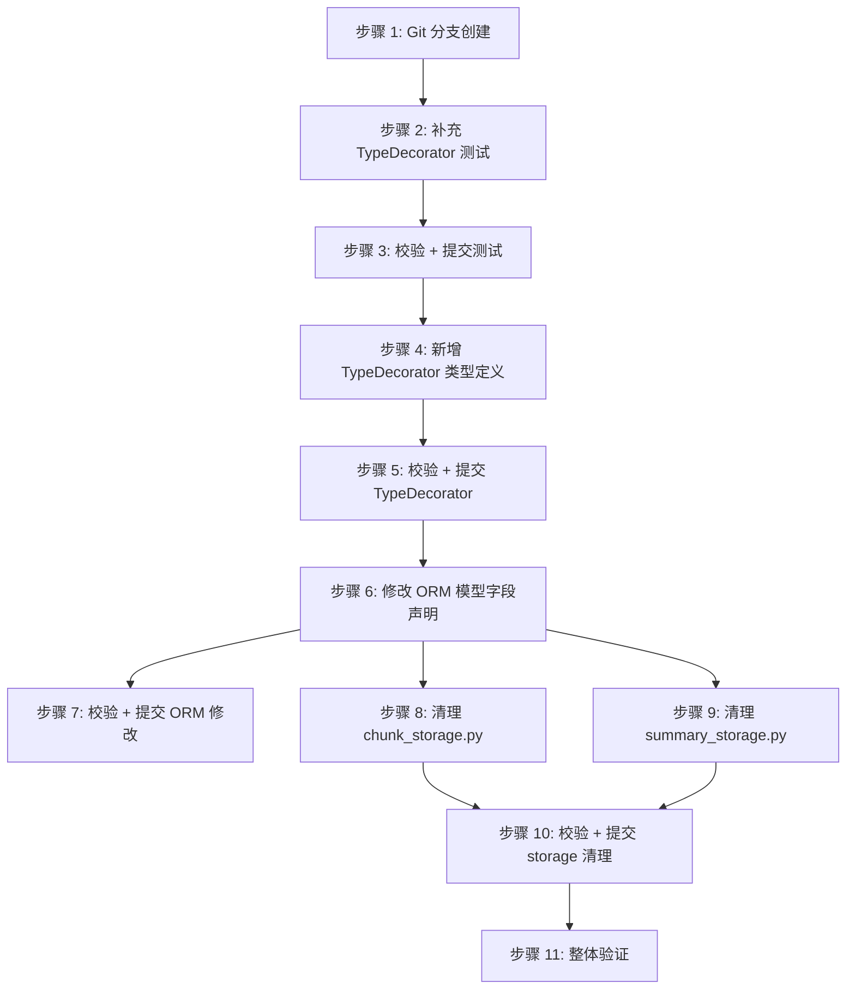

# 执行计划：ORM JSON 字段 TypeDecorator 重构

任务时间段: 2026年3月6日 16:37 (GMT+8)
任务进度: 0/1 (0%)
最后编辑时间: 2026年3月6日 16:37
父任务: 计划本地解析PDF以及使用三方模型API来完成总结 (https://www.notion.so/PDF-API-3126e81bcc0280038816cf17821e797e?pvs=21)
状态: 执行中
ID: 48
同级任务已完成: No

## 重构目标

将项目中所有 ORM 模型的 JSON 序列化/反序列化逻辑从业务代码（`chunk_storage.py`、`summary_storage.py`）迁移到 SQLAlchemy `TypeDecorator` 中，使 ORM 字段声明类型与实际运行时类型一致，消除手动 `json.dumps` / `json.loads` 调用。

---

## 重构评估报告

### 当前结构概览

**ORM 模型文件**：`core/db/models.py`

**业务存储文件**：`core/data/chunk_storage.py`、`core/data/summary_storage.py`

**领域模型文件**：`core/data/models.py`（dataclass）、`core/data/summary_models.py`（Pydantic BaseModel）

当前所有 JSON 字段在 ORM 层声明为 `Mapped[str]` 或 `Mapped[str | None]`，实际类型为 `list[str]`、`list[ChunkMeta]`、`list[KeyDataItem]`、`ChunkSummaryOutput` 等。序列化/反序列化散落在两个 storage 文件中，手动调用 `json.dumps` / `json.loads`。

### 问题清单

| 编号 | ORM 模型 | 字段名 | 当前声明类型 | 实际语义类型 | 涉及 storage 文件 |
| --- | --- | --- | --- | --- | --- |
| F1 | ChunkMetaRecord | chapter_path | Mapped[str | None] | list[str] | None | chunk_[storage.py](http://storage.py) |
| F2 | ChunkMetaRecord | contained_chapters | Mapped[str | None] | list[ChunkMeta] | None | chunk_[storage.py](http://storage.py) |
| F3 | ChunkSummaryRecord | chapter_path | Mapped[str] | list[str] | summary_[storage.py](http://storage.py) |
| F4 | ChunkSummaryRecord | key_points | Mapped[str] | list[str] | summary_[storage.py](http://storage.py) |
| F5 | ChunkSummaryRecord | key_data | Mapped[str | None] | list[KeyDataItem] | None | summary_[storage.py](http://storage.py) |
| F6 | ChapterSummaryRecord | chapter_path | Mapped[str] | list[str] | summary_[storage.py](http://storage.py) |
| F7 | ChapterSummaryRecord | summary_json | Mapped[str] | ChunkSummaryOutput | summary_[storage.py](http://storage.py) |
| F8 | DocumentSummaryRecord | all_key_points | Mapped[str] | list[str] | summary_[storage.py](http://storage.py) |
| F9 | DocumentSummaryRecord | all_key_data | Mapped[str | None] | list[KeyDataItem] | None | summary_[storage.py](http://storage.py) |

### 需要新增的 TypeDecorator

| TypeDecorator 名称 | Python 类型 | 序列化策略 | 覆盖字段 |
| --- | --- | --- | --- |
| JsonStringList | list[str] | json.dumps / json.loads | F1, F3, F4, F6, F8 |
| JsonChunkMetaList | list[ChunkMeta] | dataclass dict ↔ ChunkMeta 构造 | F2 |
| JsonKeyDataItemList | list[KeyDataItem] | Pydantic model_dump / model_validate | F5, F9 |
| JsonPydanticModel[ChunkSummaryOutput] | ChunkSummaryOutput | Pydantic model_dump / model_validate | F7 |

### 影响范围与风险评估

**直接修改文件（4 个）**：

- `core/db/models.py` — 新增 TypeDecorator 类，修改 9 个字段声明
- `core/data/chunk_storage.py` — 删除 `import json`，移除手动序列化/反序列化代码
- `core/data/summary_storage.py` — 删除 `import json`（json 相关），移除手动序列化/反序列化代码
- 新增 `core/db/types.py`（或放入 `core/db/models.py`，视风格偏好）

**间接影响**：

- 现有测试中如果直接访问 ORM 字段并断言字符串值，需改为断言反序列化后的对象
- SQLite 中存储格式不变（仍是 JSON TEXT），**数据库兼容**，无需迁移

**风险**：

- 低风险 — TypeDecorator 在 ORM 绑定参数和结果值时自动触发，不影响 SQL 层
- `ChunkMeta` 的 `page_range` 是 `tuple[int, int]`，JSON 反序列化后为 `list`，需要在 `process_result_value` 中显式转 `tuple`

---

## 前置条件

- Python 3.13 + SQLAlchemy 2.0 + aiosqlite
- `core/data/models.py` 中的 `ChunkMeta`（frozen dataclass）
- `core/data/summary_models.py` 中的 `KeyDataItem`、`ChunkSummaryOutput`（Pydantic BaseModel）
- 现有测试套件通过

---

## Git 准备

```bash
git checkout main && git pull origin main
git checkout -b refactor/orm-json-type-decorators
```

---

## 测试补充

重构前需补充以下测试，确保行为守恒基准线：

1. **TypeDecorator 单元测试**（新文件 `tests/test_db_types.py`）：
    - `JsonStringList`：`process_bind_param` / `process_result_value` 的正常值、None、空列表
    - `JsonChunkMetaList`：含 `page_range` tuple 的 round-trip 验证
    - `JsonKeyDataItemList`：含嵌套 `PeriodInfo` 的 round-trip 验证
    - `JsonPydanticModel`：`ChunkSummaryOutput` 的完整 round-trip
2. **storage round-trip 测试增强**（如已有 `tests/test_chunk_storage.py`、`tests/test_summary_storage.py`）：
    - 确认 save → load 后 `contained_chapters` 是 `list[ChunkMeta]` 而非字符串
    - 确认 save → load 后 `key_data` 是 `list[KeyDataItem]` 而非字典列表
    - 确认 save → load 后 `summary_json` 是 `ChunkSummaryOutput` 实例

---

## 重构步骤

### 步骤 1 — Git 分支创建

- **操作类型**：Git 操作
- **重构手法**：N/A
- **目标文件**：N/A
- **描述**：从 main 拉取最新代码并创建重构分支 `refactor/orm-json-type-decorators`
- **命令**：

```bash
git checkout main && git pull origin main
git checkout -b refactor/orm-json-type-decorators
```

- `depends_on: none`

### 步骤 2 — 补充 TypeDecorator 单元测试

- **操作类型**：测试补充
- **重构手法**：N/A
- **目标文件**：`tests/test_db_types.py`（新建）
- **描述**：为 4 个 TypeDecorator（`JsonStringList`、`JsonChunkMetaList`、`JsonKeyDataItemList`、`JsonPydanticModel`）编写单元测试，覆盖正常值、None、空列表、嵌套对象的 `process_bind_param` → `process_result_value` round-trip
- **验证**：测试暂时标记为预期失败（TypeDecorator 尚未实现），或跳过
- `depends_on: [1]`

### 步骤 3 — 校验 + 提交测试

- **操作类型**：校验 + Git 操作
- **重构手法**：N/A
- **目标文件**：N/A
- **描述**：运行现有测试确认无回归，提交新测试文件
- **命令**：

```bash
python -m pytest tests/ -x -q
git add tests/test_db_types.py
git commit -m "test: add unit tests for ORM JSON TypeDecorators"
```

- `depends_on: [2]`

### 步骤 4 — 新增 TypeDecorator 类型定义

- **操作类型**：重构操作
- **重构手法**：引入参数对象（Introduce Type Abstraction）
- **目标文件**：`core/db/types.py`（新建）
- **描述**：创建 `core/db/types.py`，定义 4 个 TypeDecorator：
    - `JsonStringList`：`impl = Text`，`cache_ok = True`，`process_bind_param` 做 `json.dumps(value, ensure_ascii=False)`，`process_result_value` 做 `json.loads(value)`
    - `JsonChunkMetaList`：序列化时将每个 `ChunkMeta` 转为 dict（`title`/`level`/`page_range`），反序列化时构造 `ChunkMeta` 并将 `page_range` 从 list 转为 tuple
    - `JsonKeyDataItemList`：序列化用 `model_dump()`，反序列化用 `KeyDataItem.model_validate()`
    - `JsonPydanticModel`：泛型或具体实现，序列化用 `model_dump()`，反序列化用 `ChunkSummaryOutput.model_validate()`
    - 所有类型均处理 `None` → `None` 透传
- `depends_on: [3]`

### 步骤 5 — 校验 TypeDecorator 测试通过 + 提交

- **操作类型**：校验 + Git 操作
- **重构手法**：N/A
- **目标文件**：N/A
- **描述**：运行 TypeDecorator 单元测试确认全部通过，运行全量测试确认无回归
- **命令**：

```bash
python -m pytest tests/test_db_types.py -x -v
python -m pytest tests/ -x -q
git add core/db/types.py
git commit -m "refactor: introduce TypeDecorator - add JSON TypeDecorators for ORM fields"
```

- `depends_on: [4]`

### 步骤 6 — 修改 ORM 模型字段声明

- **操作类型**：重构操作
- **重构手法**：类型替换（Replace Type）
- **目标文件**：`core/db/models.py`
- **描述**：将 `core/db/models.py` 中 9 个字段的列类型从 `Text` 替换为对应的 TypeDecorator，`Mapped` 泛型参数从 `str` 改为实际语义类型。具体映射：
    - `ChunkMetaRecord.chapter_path`：`Mapped[list[str] | None] = mapped_column(JsonStringList)`
    - `ChunkMetaRecord.contained_chapters`：`Mapped[list[ChunkMeta] | None] = mapped_column(JsonChunkMetaList)`
    - `ChunkSummaryRecord.chapter_path`：`Mapped[list[str]] = mapped_column(JsonStringList, nullable=False)`
    - `ChunkSummaryRecord.key_points`：`Mapped[list[str]] = mapped_column(JsonStringList, nullable=False)`
    - `ChunkSummaryRecord.key_data`：`Mapped[list[KeyDataItem] | None] = mapped_column(JsonKeyDataItemList)`
    - `ChapterSummaryRecord.chapter_path`：`Mapped[list[str]] = mapped_column(JsonStringList, nullable=False)`
    - `ChapterSummaryRecord.summary_json`：`Mapped[ChunkSummaryOutput] = mapped_column(JsonPydanticModel, nullable=False)`
    - `DocumentSummaryRecord.all_key_points`：`Mapped[list[str]] = mapped_column(JsonStringList, nullable=False)`
    - `DocumentSummaryRecord.all_key_data`：`Mapped[list[KeyDataItem] | None] = mapped_column(JsonKeyDataItemList)`
    - 添加相应的 import 语句
- `depends_on: [5]`

### 步骤 7 — 校验 + 提交 ORM 模型修改

- **操作类型**：校验 + Git 操作
- **重构手法**：N/A
- **描述**：运行全量测试确认无回归（此时 storage 文件仍有手动序列化代码，但不应冲突——双重序列化会导致测试失败，如失败说明需要同步清理 storage）
- **命令**：

```bash
python -m pytest tests/ -x -q
git add core/db/models.py
git commit -m "refactor: replace type - change ORM JSON fields to TypeDecorator types"
```

- `depends_on: [6]`

<aside>
⚠️

**注意**：步骤 6 修改 ORM 字段类型后，如果 storage 文件仍在做 `json.dumps` 再赋值给字段，TypeDecorator 会对已经是字符串的值再做一次 `json.dumps`，导致双重编码。因此步骤 6 和步骤 8 在实际执行时可能需要 **合并为一个原子操作**，或先改 storage 再改 ORM。执行模型应根据测试反馈灵活调整顺序。

</aside>

### 步骤 8 — 清理 chunk_[storage.py](http://storage.py) 的手动序列化代码

- **操作类型**：重构操作
- **重构手法**：内联函数 / 移除冗余代码（Remove Dead Code）
- **目标文件**：`core/data/chunk_storage.py`
- **描述**：
    - `save_chunks` 函数中：将 `chapter_path=json.dumps(...)` 改为 `chapter_path=chunk.chapter_path`（直接传 `list[str]`）；将 `contained_chapters=json.dumps([c.__dict__ ...])` 改为 `contained_chapters=chunk.contained_chapters or None`（直接传 `list[ChunkMeta]`）
    - `load_chunks` 函数中：将 `json.loads(row.chapter_path)` 改为 `row.chapter_path or []`（已经是 `list[str]`）；将手动构造 `ChunkMeta` 的循环改为 `row.contained_chapters or []`（已经是 `list[ChunkMeta]`）
    - 移除 `import json`
- `depends_on: [6]`（与步骤 7 的提交可合并）

### 步骤 9 — 清理 summary_[storage.py](http://storage.py) 的手动序列化代码

- **操作类型**：重构操作
- **重构手法**：内联函数 / 移除冗余代码（Remove Dead Code）
- **目标文件**：`core/data/summary_storage.py`
- **描述**：
    - `save_chunk_summary`：移除 `key_points_json`、`chapter_path_json`、`key_data_json` 的 `json.dumps` 中间变量，直接赋值 `summary.key_points`、`summary.chapter_path`、`summary.key_data or None`
    - `save_chapter_summary`：移除 `summary_json = json.dumps(chapter.summary.model_dump(), ...)`，直接赋值 `summary_json=chapter.summary`；移除 `chapter_path` 的 `json.dumps`
    - `save_document_summary`：移除 `all_key_points_json`、`all_key_data_json` 的 `json.dumps` 中间变量，直接赋值原始对象
    - `load_document_summary`：移除 `json.loads(record.all_key_points)` 和 `[KeyDataItem(**item) for item in json.loads(...)]`，直接使用 `record.all_key_points` 和 `record.all_key_data`
    - 移除 `import json`
- `depends_on: [6]`（与步骤 8 **可并发**，操作不同文件）

### 步骤 10 — 校验 storage 清理 + 提交

- **操作类型**：校验 + Git 操作
- **重构手法**：N/A
- **描述**：运行全量测试确认 save → load round-trip 正常，无双重编码问题
- **命令**：

```bash
python -m pytest tests/ -x -q
git add core/data/chunk_storage.py core/data/summary_storage.py
git commit -m "refactor: remove dead code - eliminate manual JSON serialization in storage modules"
```

- `depends_on: [8, 9]`

### 步骤 11 — 整体验证

- **操作类型**：校验
- **重构手法**：N/A
- **描述**：全量测试 + 类型检查 + linter，确认无回归
- **命令**：

```bash
python -m pytest tests/ -x -q
python -m basedpyright core/
python -m ruff check core/
```

- 通过后进行最终 commit（如有未提交变更）
- `depends_on: [10]`

---

## 并发执行策略



**可并发步骤**：步骤 8 和步骤 9 操作不同文件，可分配给不同 sub-agent 并行执行。

---

## 接口变更说明

### ORM 字段类型变更

以下 ORM 模型的字段类型发生变更，所有直接读写这些字段的代码需要适配：

- 写入时：不再需要手动 `json.dumps`，直接赋值 Python 对象
- 读取时：不再需要手动 `json.loads`，字段值已经是 Python 对象

### 受影响的调用方

- `core/data/chunk_storage.py`：`save_chunks`、`load_chunks`（步骤 8 处理）
- `core/data/summary_storage.py`：`save_chunk_summary`、`save_chapter_summary`、`save_document_summary`、`load_document_summary`（步骤 9 处理）
- 测试文件中如有直接构造 ORM Record 并设置字符串值的代码，需改为设置对象值

---

## 验证清单

- [ ]  所有 TypeDecorator 单元测试通过
- [ ]  `chunk_storage.py` 的 save → load round-trip 测试通过
- [ ]  `summary_storage.py` 的 save → load round-trip 测试通过
- [ ]  全量 `pytest` 通过，零失败
- [ ]  `basedpyright` 类型检查通过
- [ ]  `ruff check` 无新增警告
- [ ]  SQLite 存储格式不变（JSON TEXT），无需数据迁移

---

## 重构决策说明

### 为什么选择 TypeDecorator

- **单一职责**：序列化逻辑内聚在类型定义中，storage 文件只关心业务逻辑
- **类型安全**：`Mapped[list[ChunkMeta]]` 让 basedpyright 能正确推断，消除类型断层
- **零数据迁移**：SQLite 中仍是 JSON TEXT，新旧代码对同一数据库完全兼容
- **可测试性**：TypeDecorator 的 `process_bind_param` / `process_result_value` 可独立单测

### 为什么不用 Pydantic 校验层

- `ChunkMeta` 是 frozen dataclass，结构简单且固定，不需要额外校验
- 数据只通过 ORM 进出，TypeDecorator 在边界上做转换已经足够
- 对于 Pydantic 模型（`KeyDataItem`、`ChunkSummaryOutput`），在 TypeDecorator 内部调用 `model_validate` 即可获得校验能力

### Trade-off

- **增加了 ORM 层对领域模型的依赖**：`core/db/types.py` 需要 import `ChunkMeta`、`KeyDataItem`、`ChunkSummaryOutput`。这是合理的，因为 ORM 层本就是领域模型的持久化表达
- **TypeDecorator 的 `cache_ok = True`**：所有自定义类型均标记为可缓存，因为它们不持有可变状态