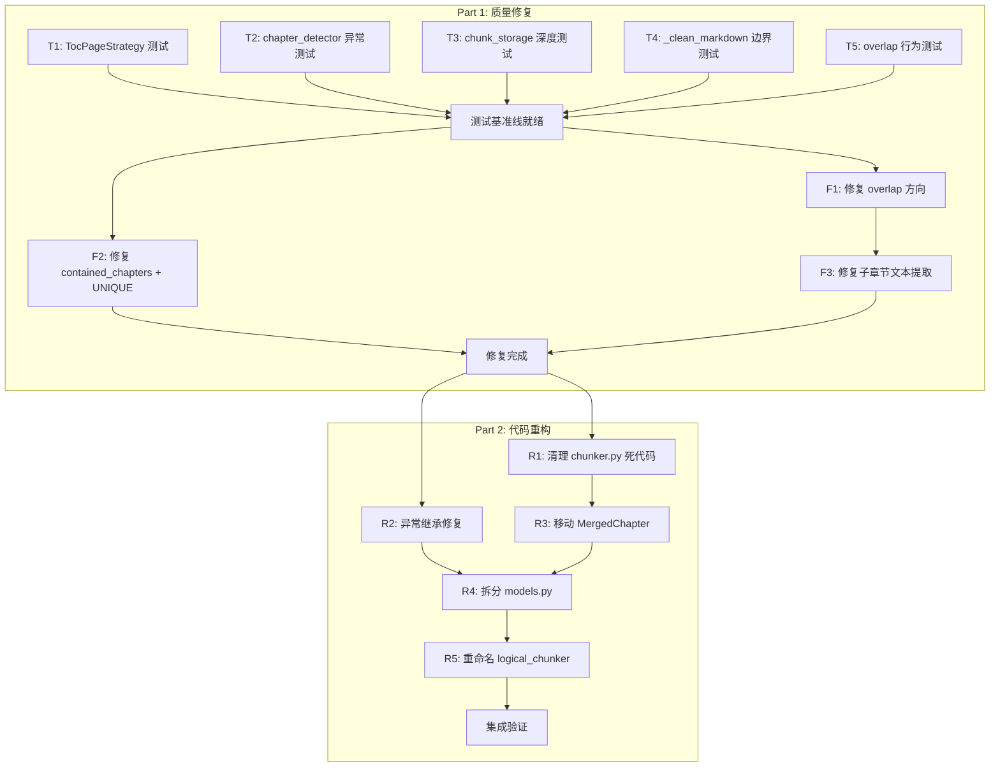

# 执行计划：Step 2 代码修复与重构

## 审计验证结论

已通过 GitHub API 逐一验证审计报告（15 个问题），**全部确认属实**。

### 验证摘要

| **问题**                                                      | **验证状态** | **代码定位**                                                                                                                                |
| ------------------------------------------------------------- | ------------ | ------------------------------------------------------------------------------------------------------------------------------------------- |
| 问题 6：overlap 取首部而非尾部                                | ✅ 确认       | `chunker.py` → `_split_by_token_window()` overlap 逻辑调用 `truncate_to_tokens(prev_text, overlap_tokens)`，取 `tokens[:max_tokens]` 即首部 |
| 问题 7：contained_chapters 持久化丢失                         | ✅ 确认       | `chunk_storage.py` → `chunk_meta` 表 schema 无 `contained_chapters` 列，save/load 均未处理                                                  |
| 问题 8：子章节文本用段落索引代替页码                          | ✅ 确认       | `chunker.py` → `_split_by_subheadings()` 用 `text.split("\n\n")` 得到段落数组，却用页码偏移索引                                             |
| 问题 2：TocPageStrategy 零测试覆盖                            | ✅ 确认       | `test_chapter_detector.py` 无 TestTocPageStrategy 类                                                                                        |
| 问题 1：dead code in `_merge_same_page_boundaries()`          | ✅ 确认       | `return result` 后残留整段旧实现，返回类型从 `MergedChapter` 变为 `ChapterBoundary`                                                         |
| 问题 9：UNIQUE 约束语义错误                                   | ✅ 确认       | `UNIQUE(stock_code, report_date, page_start, page_end)` 对同页码多子块会冲突                                                                |
| 问题 10：`_get_encoder` 死导入                                | ✅ 确认       | `chunker.py` 顶部导入但未使用                                                                                                               |
| 问题 11：`dataclasses` 导入位于文件中部                       | ✅ 确认       | 位于 `build_chunks()` 函数之后、`MergedChapter` 类之前                                                                                      |
| 问题 12：[models.py](http://models.py) 职责过载               | ✅ 确认       | Pydantic + dataclass + 异常 + 别名混合                                                                                                      |
| 问题 13：异常不继承 DataLifeError                             | ✅ 确认       | `class ChunkingError(Exception)` 绕过项目基类                                                                                               |
| 问题 14：MergedChapter 定义在 [chunker.py](http://chunker.py) | ✅ 确认       | 定义在 `build_chunks()` 和 `_merge_same_page_boundaries()` 之间                                                                             |
| 问题 15：logical_[chunker.py](http://chunker.py) 命名易混淆   | ✅ 确认       | 编排入口与分块引擎命名不清晰                                                                                                                |
| 问题 3/4/5：测试边界/深度不足                                 | ✅ 确认       | chapter_detector 异常路径、chunk_storage 覆盖写入、_clean_markdown 边界                                                                     |

---

## 前置条件

- `master` 分支最新代码
- Python 环境已安装：`pymupdf`、`tiktoken`、`aiosqlite`、`logfire`、`pytest`、`pytest-asyncio`
- 所有现有测试通过（`pytest tests/`）

---

# Part 1：质量修复（Mode B）

<aside>
🔧

**质量修复路径**：

```
确认问题 → 写测试暴露问题（Red）→ 修复代码（Green）→ 确认无回归 → 提交
```

</aside>

## 1.1 修复目标

修复 Step 2（人工逻辑分块策略）代码中的 **3 个功能性 bug**（问题 6、7、8）和 **1 个 schema 缺陷**（问题 9），补充关键模块的测试覆盖（问题 2、3、4、5），确保 Step 3 摘要管线可正确消费 ChunkList。

## 1.2 问题来源

基于质量审计报告，待修复清单：

| **问题**                                 | **类别**     | **严重程度** | **处理意向**      |
| ---------------------------------------- | ------------ | ------------ | ----------------- |
| 问题 6：overlap 取首部而非尾部           | 功能性 bug   | 🔴 高         | 修复              |
| 问题 7：contained_chapters 持久化丢失    | 数据丢失 bug | 🔴 高         | 修复              |
| 问题 8：子章节文本提取用段落索引代替页码 | 逻辑 bug     | 🔴 高         | 修复              |
| 问题 9：UNIQUE 约束语义错误              | schema 缺陷  | 🟡 中         | 随问题 7 一并修复 |
| 问题 2：TocPageStrategy 零测试覆盖       | 测试缺口     | 🔴 高         | 补充测试          |
| 问题 3：chapter_detector 异常路径缺失    | 测试缺口     | 🟡 中         | 补充测试          |
| 问题 4：chunk_storage 测试不够深入       | 测试缺口     | 🟡 中         | 补充测试          |
| 问题 5：_clean_markdown 缺少边界测试     | 测试缺口     | 🟡 低         | 补充测试          |

## 1.3 Git 准备

```bash
git checkout master
git pull origin master
git checkout -b fix/step2-quality-fixes
```

## 1.4 测试编写（Red 阶段）

<aside>
🛡️

**铁律**：每个修复项必须先有测试暴露问题。没有失败测试证明问题存在，就不修复。

</aside>

### 步骤 T1：补充 TocPageStrategy 独立测试（问题 2）

- **目标文件**：`tests/test_chapter_detector.py`
- **新增测试类**：`TestTocPageStrategy`
- **覆盖场景**：
    - 正常目录页（含页码列表）→ 返回正确章节边界
    - 目录页页码偏移（目录页自身页码 vs 内容页码）→ 验证偏移计算
    - 格式异常的目录页（缺少页码、非标准分隔符）→ 返回 None 降级
    - 多级目录页 → 验证 level 推断
- **depends_on**: none
- **验证**：`pytest tests/test_chapter_detector.py -v` 全部通过
- **提交**：`test: add independent tests for TocPageStrategy`

### 步骤 T2：补充 chapter_detector 异常路径测试（问题 3）

- **目标文件**：`tests/test_chapter_detector.py`
- **新增场景**（在 `TestBookmarkStrategy` 和 `TestDetectChapters` 中扩展）：
    - 书签页码越界（指向不存在的页面）
    - 单页文档
    - 空文档（0 页）
    - 书签标题与实际页面文本不匹配
- **depends_on**: none
- **验证**：`pytest tests/test_chapter_detector.py -v` 全部通过
- **提交**：`test: add boundary and exception tests for chapter_detector`

### 步骤 T3：补充 chunk_storage 深度测试（问题 4）

- **目标文件**：`tests/test_chunk_storage.py`
- **新增场景**：
    - 覆盖写入（同一 stock_code + report_date 保存两次）→ 验证幂等性，第二次写入覆盖第一次
    - `chapter_path` 列表的序列化/反序列化 round-trip
    - DB 文件不存在时 `load_chunks` 的行为 → 预期返回 None 或抛异常
    - 构造包含 `contained_chapters` 的 `Chunk` → 验证当前丢失行为（标记 `@pytest.mark.xfail`，为后续修复提供回归基准）
- **depends_on**: none
- **验证**：`pytest tests/test_chunk_storage.py -v` 全部通过
- **提交**：`test: add overwrite, serialization, and edge case tests for chunk_storage`

### 步骤 T4：补充 _clean_markdown 边界测试（问题 5）

- **目标文件**：`tests/test_pdf_parser.py`
- **新增场景**：
    - 带前后空格的数字行 → 应被移除
    - 多位数页码（如   `123`  ）→ 应被移除
    - 数字行夹在正文段落之间（如财务表格中的独立数字）→ 验证是否误删
    - 空字符串输入
- **depends_on**: none
- **验证**：`pytest tests/test_pdf_parser.py -v` 全部通过
- **提交**：`test: add boundary tests for _clean_markdown`

### 步骤 T5：补充 overlap 行为测试（问题 6 Red）

- **目标文件**：`tests/test_chunker.py`
- **新增场景**：
    - 构造超长文本 → 触发 `_split_by_token_window` → 验证第二个 chunk 的 overlap 文本来自前一个 chunk 的 **尾部**（当前测试会失败，标记为 `@pytest.mark.xfail`，修复后移除标记）
- **depends_on**: none
- **验证**：`pytest tests/test_chunker.py -v`（overlap 测试预期 xfail）
- **提交**：`test: add overlap direction verification test (xfail before fix)`

<aside>
⚡

**并发执行**：T1、T2、T3、T4、T5 操作不同测试文件/类，可通过 sub-agent 并行执行。

</aside>

## 1.5 修复步骤（Green 阶段）

### 步骤 F1：修复 overlap 方向（问题 6）

- **问题类别**：功能性 bug
- **目标文件**：`core/data/token_counter.py`、`core/data/chunker.py`
- **描述**：在 `token_counter.py` 中新增 `truncate_tail_tokens(text, max_tokens)` 函数，取文本 **尾部** N 个 token（即 `tokens[-max_tokens:]`）。在 `chunker.py` 的 `_split_by_token_window()` 中，将 overlap 获取逻辑从 `truncate_to_tokens(prev_text, overlap_tokens)` 改为调用 `truncate_tail_tokens(prev_text, overlap_tokens)`。
- **depends_on**: T5
- **验证**：`pytest tests/test_chunker.py tests/test_token_counter.py -v` 全部通过，移除 T5 中 overlap 测试的 xfail 标记
- **提交**：`fix: overlap direction - take tail tokens instead of head`

### 步骤 F2：修复 contained_chapters 持久化 + UNIQUE 约束（问题 7 + 9）

- **问题类别**：数据丢失 bug + schema 缺陷
- **目标文件**：`core/data/chunk_storage.py`
- **描述**：
    1. 在 `chunk_meta` 表中新增 `contained_chapters TEXT` 列
    2. `save_chunks()` 中将 `chunk.contained_chapters` 序列化为 JSON 字符串写入该列（每个 `ChunkMeta` 序列化为 `{title, level, page_range}` 对象）
    3. `load_chunks()` 中从该列反序列化恢复为 `list[ChunkMeta]`，赋给 Chunk 的 `contained_chapters` 属性
    4. 移除 UNIQUE 约束（不再设置新约束），依赖现有的 DELETE + INSERT 逻辑保证幂等性
- **depends_on**: T3
- **验证**：`pytest tests/test_chunk_storage.py -v` 全部通过，更新 T3 中 contained_chapters round-trip 测试从 xfail 改为正常断言
- **提交**：`fix: persist contained_chapters and fix UNIQUE constraint`

### 步骤 F3：修复子章节文本提取逻辑（问题 8）

- **问题类别**：逻辑 bug
- **目标文件**：`core/data/chunker.py`
- **描述**：修改 `_split_by_subheadings()` 的预检测边界分支。当使用 `sub_boundaries` 时，不再将拼接后的 `text` 按 `\n\n` split 再用页码索引访问段落数组。改为：新增 `parsed: ParsedDocument | None = None` 参数，当 `sub_boundaries` 非空时，直接调用 `_extract_chapter_text(parsed, boundary)` 从原始页面数据中提取每个子边界范围的文本。相应地更新 `build_chunks()` 中调用 `_split_by_subheadings()` 的地方，传入 `parsed` 参数。
- **depends_on**: F1（F1 和 F3 都修改 `chunker.py`，必须串行）
- **验证**：`pytest tests/test_chunker.py -v` 全部通过
- **提交**：`fix: subheading split to use page data instead of paragraph index`

<aside>
⚡

**并发策略**：F1 和 F2 操作不同文件，可并发。F3 与 F1 都修改 `chunker.py`，**必须串行**（F1 先完成后再执行 F3）。

</aside>

## 1.6 旧测试修改说明

当前无需修改旧测试。所有修复项仅修正错误行为，旧测试未断言这些错误行为的输出。

## 1.7 修复验证清单

- [ ]  所有测试通过：`pytest tests/ -v`
- [ ]  overlap 测试确认取尾部 token（xfail 标记已移除）
- [ ]  contained_chapters save → load round-trip 验证（xfail 标记已移除）
- [ ]  子章节文本提取使用原始页面数据而非段落数组
- [ ]  已移除 UNIQUE 约束，幂等性由 DELETE + INSERT 保证

## 1.8 修复决策说明

### 问题 6 的修复方案

新增 `truncate_tail_tokens()` 而非修改 `truncate_to_tokens()` 的签名（如加 `from_end=True`），原因：

- `truncate_to_tokens()` 在其他场景（硬截断、段落截断）中取首部是正确行为
- 新增独立函数职责更清晰，避免影响现有调用方

### 问题 8 的修复方案

选择传入 `ParsedDocument` 而非尝试修复段落索引映射，原因：

- 页面文本内部的 `\n\n` 数量不确定，无法可靠地从拼接后文本反向定位页面边界
- `_extract_chapter_text()` 已经实现了从 `ParsedDocument` 按页码范围提取文本的逻辑，可直接复用
- Trade-off：增加了 `_split_by_subheadings()` 的参数，但该函数为私有函数，影响可控

### 问题 7 + 9 合并修复

将 contained_chapters 持久化和 UNIQUE 约束修复合并为一步，原因：

- 两者都修改 `chunk_storage.py` 的 schema
- 需重建表（SQLite 不支持 ALTER CONSTRAINT），合并减少一次 schema 变更

---

# Part 2：代码重构（Mode A）

<aside>
🔄

**重构黄金路径**：

```
评估现状 → 补充测试 → 小步重构 → 验证行为 → 提交
```

</aside>

## 2.1 重构目标

在 Part 1 Bug 修复全部完成的基础上，清理死代码、修复架构异味、改善模块组织，提升 Step 2 代码的可维护性和可扩展性，为 Step 3 接入做好准备。

## 2.2 Git 准备

<aside>
💡

Part 2 在 Part 1 的分支上继续，或基于 Part 1 合并后的 master 创建新分支：

</aside>

```bash
# 方式 A：在 fix/step2-quality-fixes 分支上继续
git checkout fix/step2-quality-fixes

# 方式 B：Part 1 已合并后
git checkout master && git pull origin master
git checkout -b refactor/step2-code-cleanup
```

## 2.3 重构评估报告

### 问题清单

| **问题**                                                      | **严重程度** | **重构手法** |
| ------------------------------------------------------------- | ------------ | ------------ |
| 问题 1：`_merge_same_page_boundaries()` 死代码                | 🟡 中         | 删除死代码   |
| 问题 10：`_get_encoder` 死导入                                | 🟢 低         | 移除死导入   |
| 问题 11：`dataclasses` 导入位于文件中部                       | 🟢 低         | 移动导入     |
| 问题 13：异常不继承 DataLifeError                             | 🟡 中         | 修改继承关系 |
| 问题 14：MergedChapter 定义在 [chunker.py](http://chunker.py) | 🟢 低         | 移动类       |
| 问题 12：[models.py](http://models.py) 职责过载               | 🟡 中         | 提取模块     |
| 问题 15：logical_[chunker.py](http://chunker.py) 命名易混淆   | 🟢 低         | 重命名模块   |

### 影响范围

- **直接修改**：`chunker.py`、`models.py`、`logical_chunker.py`、`token_counter.py`
- **间接影响**（导入路径变更）：`test_chunker.py`、`test_chunk_storage.py`、`test_chapter_detector.py`、所有引用 `logical_chunker` 和 `models` 的模块

## 2.4 测试补充

<aside>
🛡️

**铁律**：Part 1 的测试补充（T1-T5）已建立基准线。Part 2 重构前无需额外补充测试，所有重构步骤必须确保 Part 1 补充的测试和原有测试持续通过。

</aside>

## 2.5 重构步骤

### 步骤 R1：清理 [chunker.py](http://chunker.py) 死代码与导入问题（问题 1、10、11）

- **重构手法**：删除死代码 + 移除死导入 + 移动导入
- **目标文件**：`core/data/chunker.py`
- **描述**：
    1. 删除 `_merge_same_page_boundaries()` 中 `return result` 之后的所有死代码（旧版返回 `list[ChapterBoundary]` 的实现）
    2. 从导入语句中移除 `_get_encoder`
    3. 将 `from dataclasses import dataclass` 移动到文件顶部导入区域
- **depends_on**: Part 1 全部完成
- **验证**：`pytest tests/test_chunker.py -v` 全部通过
- **提交**：`refactor: cleanup - remove dead code, unused import, fix import order in chunker.py`

### 步骤 R2：修复异常继承体系（问题 13）

- **重构手法**：修改继承关系
- **目标文件**：`core/data/models.py`
- **描述**：将 `ChunkingError` 的基类从 `Exception` 改为 `DataLifeError`（从 `core.exceptions` 导入）。保留 `ChunkingError` 的子类 `EmptyDocumentError`、`ChapterDetectionError`、`StorageError` 的继承关系不变（它们仍继承 `ChunkingError`，间接继承 `DataLifeError`）。确保 `ChunkingError.__init__` 的签名与 `DataLifeError.__init__` 兼容（接受 `message` 和可选 `cause` 参数）。
- **depends_on**: none（与 R1 操作不同文件，可并发）
- **验证**：`pytest tests/ -v` 全部通过
- **提交**：`refactor: make ChunkingError inherit from DataLifeError`

### 步骤 R3：移动 MergedChapter 到 [models.py](http://models.py)（问题 14）

- **重构手法**：移动类
- **目标文件**：`core/data/models.py`、`core/data/chunker.py`
- **描述**：将 `MergedChapter` dataclass 定义从 `chunker.py` 移至 `models.py`。在 `chunker.py` 中添加 `from core.data.models import MergedChapter` 导入。
- **depends_on**: R1（[chunker.py](http://chunker.py) 清理完成后再移动，避免冲突）
- **验证**：`pytest tests/test_chunker.py -v` 全部通过
- **提交**：`refactor: move MergedChapter to models.py`

### 步骤 R4：拆分 [models.py](http://models.py)（问题 12）

- **重构手法**：提取模块
- **目标文件**：`core/data/models.py` → `core/data/api_models.py` + `core/data/exceptions.py`
- **描述**：
    1. 将 Pydantic 外部 API 模型（`StockItem`、`StockListResponse`、`AnnouncementItem`、`AnnouncementsResponse`）提取到 `core/data/api_models.py`
    2. 将异常类（`ChunkingError` 及其子类）提取到 `core/data/exceptions.py`
    3. `models.py` 保留内部领域 dataclass 和类型别名（`ChunkType`、`ChapterBoundary`、`ChunkMeta`、`Chunk`、`ChunkList`、`PageChunk`、`PDFParseResult`、`MergedChapter`、`ParsedPage`、`ParsedDocument`）
    4. 更新所有引用这些类的导入路径（搜索 `from core.data.models import` 定位所有调用方）
- **depends_on**: R2, R3（异常继承修复和 MergedChapter 移动完成后再拆分）
- **验证**：`pytest tests/ -v` 全部通过
- **提交**：`refactor: extract api_models.py and exceptions.py from models.py`

### 步骤 R5：重命名 logical_[chunker.py](http://chunker.py)（问题 15）

- **重构手法**：重命名模块
- **目标文件**：`core/data/logical_chunker.py` → `core/data/chunk_pipeline.py`
- **描述**：将 `logical_chunker.py` 重命名为 `chunk_pipeline.py`，更新所有引用该模块的导入路径。保持内部函数签名和行为不变。
- **depends_on**: R4（[models.py](http://models.py) 拆分完成后再重命名，避免多文件同时变动引发混乱）
- **验证**：`pytest tests/ -v` 全部通过
- **提交**：`refactor: rename logical_chunker.py to chunk_pipeline.py`

<aside>
⚡

**并发策略**：

- R1 和 R2 操作不同文件，可并发
- R3 依赖 R1（同一文件 [chunker.py](http://chunker.py)）
- R4 依赖 R2 + R3
- R5 依赖 R4
</aside>

## 2.6 接口变更说明

| **变更**                                                              | **影响范围**                       | **迁移方式**                              |
| --------------------------------------------------------------------- | ---------------------------------- | ----------------------------------------- |
| `ChunkingError` 基类变更                                              | 所有 `except ChunkingError` 调用方 | 向上兼容，`except DataLifeError` 也能捕获 |
| 模块路径变更（`api_models.py`、`exceptions.py`、`chunk_pipeline.py`） | 所有引用旧路径的 import            | 更新 import 语句                          |

## 2.7 验证清单

- [ ]  所有测试通过：`pytest tests/ -v`
- [ ]  类型检查通过（如有）：`basedpyright core/data/`
- [ ]  `ChunkingError` 可被 `except DataLifeError` 捕获
- [ ]  `from core.data.chunk_pipeline import chunk_document` 正常工作
- [ ]  `from core.data.api_models import StockItem` 正常工作
- [ ]  `from core.data.exceptions import ChunkingError` 正常工作
- [ ]  无死代码、死导入残留

## 2.8 重构决策说明

### 执行顺序的考量

- **清理优先于结构调整**：先清理死代码（R1），再做类移动（R3），最后拆分模块（R4），避免在脏代码基础上做结构变更
- [**chunker.py](http://chunker.py) 变更串行**：R1 → R3 按顺序执行，避免同一文件并发修改产生冲突

### 问题 12 拆分粒度

选择拆分为 3 个文件而非更细粒度，原因：

- 当前 Step 2 的模型数量有限，过度拆分反而增加导入复杂度
- 按「外部 API / 内部领域 / 异常」三类划分，边界清晰且与项目现有 `core/exceptions.py` 对齐

---

# 总体依赖关系图



---

# 并发执行总览

```jsx
阶段 0（并发）：测试补充
    ├─ Sub-agent A：T1 TocPageStrategy 测试
    ├─ Sub-agent B：T2 异常路径测试
    ├─ Sub-agent C：T3 chunk_storage 深度测试
    ├─ Sub-agent D：T4 _clean_markdown 边界测试
    └─ Sub-agent E：T5 overlap 行为测试
    → git commit × 5

阶段 1（并发）：Bug 修复
    ├─ Sub-agent A：F1 overlap 方向修复（chunker.py + token_counter.py）
    └─ Sub-agent B：F2 contained_chapters + UNIQUE（chunk_storage.py）
    → git commit × 2

阶段 2（串行）：chunker.py 后续修复
    F3 子章节文本提取 → commit

阶段 3（并发）：代码重构
    ├─ Sub-agent A：R1 清理 chunker.py 死代码
    └─ Sub-agent B：R2 异常继承修复
    → git commit × 2

阶段 4（串行）：架构调整
    R3 MergedChapter 移动 → commit
    R4 models.py 拆分 → commit
    R5 logical_chunker 重命名 → commit

阶段 5（串行）：集成验证
    pytest tests/ -v → 全量通过
```