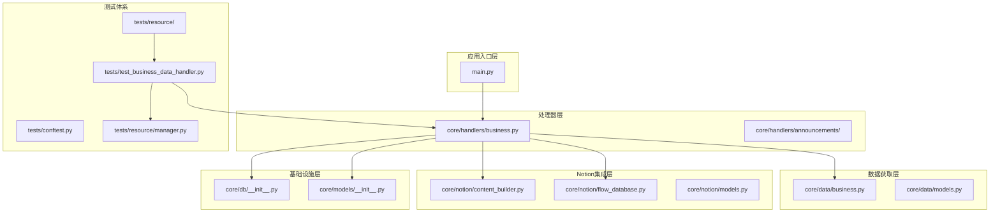
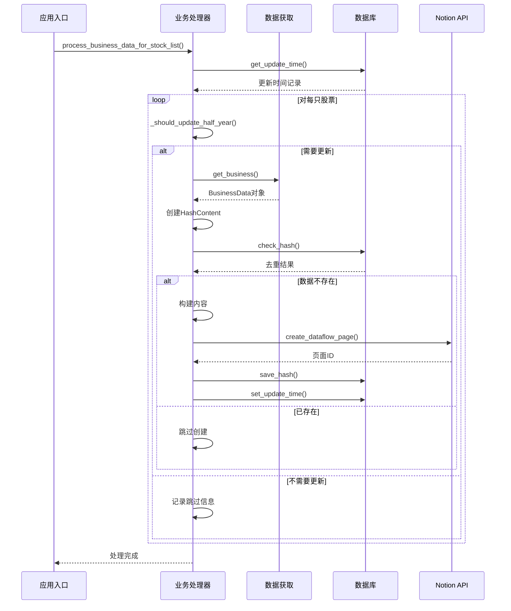
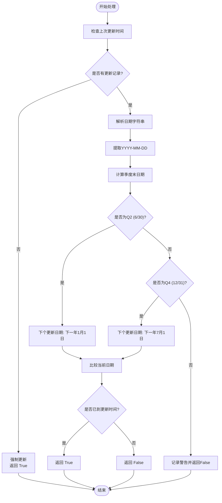
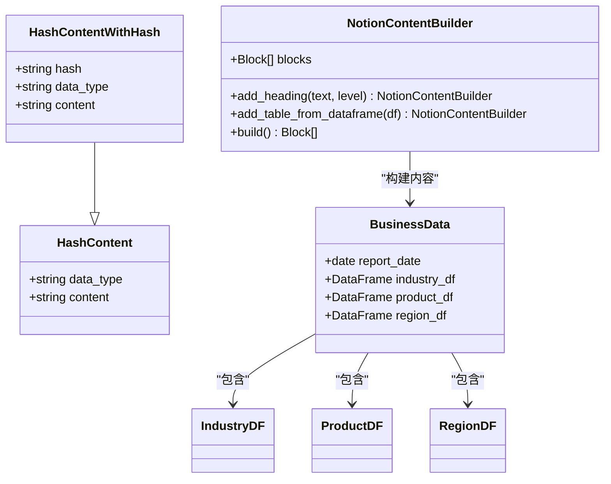
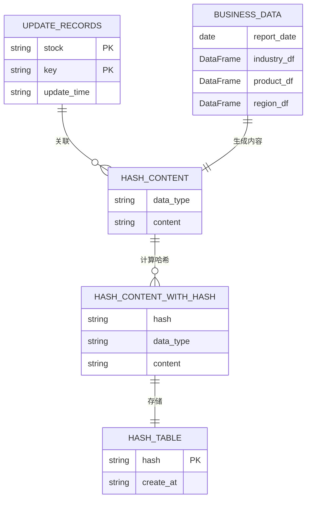
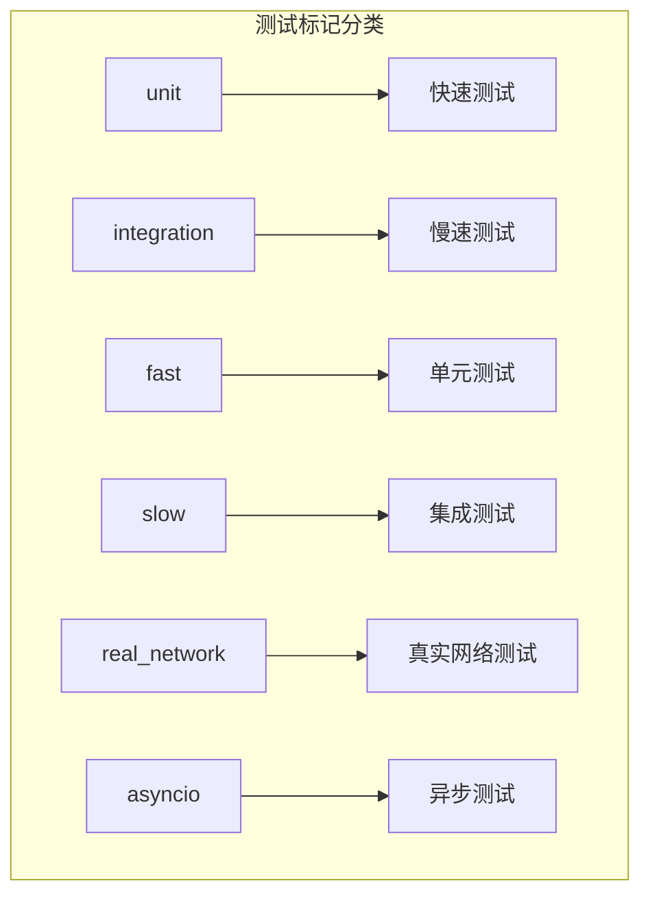
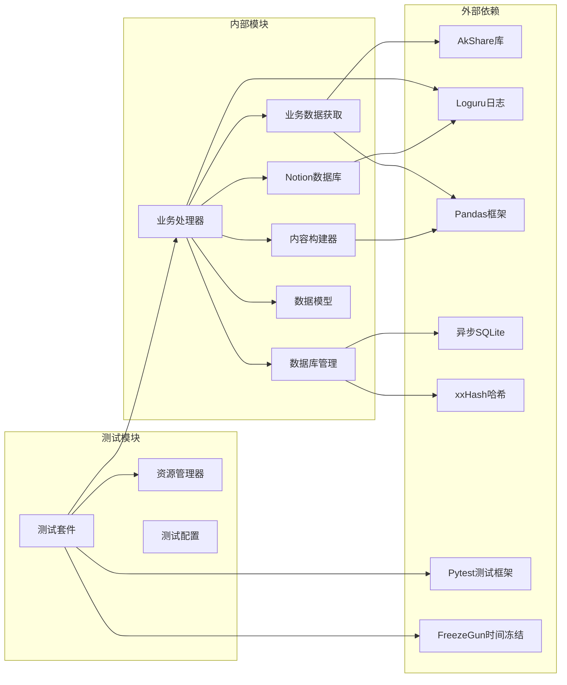

# 业务数据处理器

<cite>
**本文档引用的文件**
- [business.py](file://core/handlers/business.py)
- [business.py](file://core/data/business.py)
- [content_builder.py](file://core/notion/content_builder.py)
- [flow_database.py](file://core/notion/flow_database.py)
- [__init__.py](file://core/db/__init__.py)
- [main.py](file://main.py)
- [test_business_data_handler.py](file://tests/test_business_data_handler.py)
- [conftest.py](file://tests/conftest.py)
- [manager.py](file://tests/resource/manager.py)
- [pytest.ini](file://pytest.ini)
</cite>

## 更新摘要
**变更内容**
- Business Data Handler从core/business_data_handler.py重命名为core/handlers/business.py，采用新的模块化架构
- 新增完整的测试套件，包含600+行详细测试用例
- 新增单元测试、集成测试、异步测试和真实网络测试分类
- 新增测试资源配置和静态资源管理系统
- 新增测试标记系统和测试环境配置
- 增强了业务数据处理功能的可靠性与测试覆盖
- 增加了半年度更新逻辑、改进的错误处理和更好的类型安全

## 目录
1. [简介](#简介)
2. [项目结构](#项目结构)
3. [核心组件](#核心组件)
4. [架构概览](#架构概览)
5. [详细组件分析](#详细组件分析)
6. [测试体系](#测试体系)
7. [依赖关系分析](#依赖关系分析)
8. [性能考虑](#性能考虑)
9. [故障排除指南](#故障排除指南)
10. [结论](#结论)

## 简介

业务数据处理器（Business Data Handler）是Notion项目中的核心模块，专门负责处理和同步上市公司主营业务构成数据。该系统能够自动获取最新的业务数据，去重处理，然后将结构化的内容创建为Notion数据流页面，实现了从数据获取到知识管理的完整自动化流程。

该处理器支持按半年度更新机制，确保数据的新鲜度，同时通过哈希去重技术避免重复创建相同内容的页面。系统采用异步编程模式，提高了数据处理效率和响应性。

**更新** Business Data Handler现已迁移到新的模块化架构中，文件位置从core/business_data_handler.py重命名为core/handlers/business.py。系统新增了智能的半年度更新策略，基于季度末日期判断是否需要更新，显著减少了不必要的API调用。同时增强了错误处理机制和类型安全性，提供了更好的开发体验和运行时稳定性。

## 项目结构

项目采用模块化设计，主要分为以下几个核心层次：

**图表来源**
- [main.py](file://main.py#L24-L42)
- [business.py](file://core/handlers/business.py#L19-L101)
- [business.py](file://core/data/business.py#L43-L93)
- [test_business_data_handler.py](file://tests/test_business_data_handler.py#L1-L636)

**章节来源**
- [main.py](file://main.py#L1-L46)
- [business.py](file://core/handlers/business.py#L1-L143)
- [test_business_data_handler.py](file://tests/test_business_data_handler.py#L1-L636)

## 核心组件

### 业务数据处理器主函数

`process_business_data_for_stock_list` 是整个系统的入口函数，负责协调整个数据处理流程：

- **批量处理**：支持同时处理多个股票的业务数据
- **智能更新检测**：基于半年度策略判断是否需要更新
- **去重机制**：使用哈希算法确保不重复创建相同内容
- **页面创建**：将结构化数据转换为Notion页面

### 业务数据获取模块

`get_business` 函数负责从外部API获取实时业务数据：

- **数据源集成**：使用AkShare库获取上市公司主营业务构成
- **数据清洗**：自动识别并分离行业、产品、地区三个维度的数据
- **时间处理**：提取最新报告日期作为数据时效性标识

### 内容构建器

`NotionContentBuilder` 提供了灵活的内容构建能力：

- **表格生成**：自动将DataFrame转换为Notion表格
- **标题层级**：支持1-3级标题的层次化组织
- **富文本支持**：提供丰富的文本格式化选项

**章节来源**
- [business.py](file://core/handlers/business.py#L19-L101)
- [business.py](file://core/data/business.py#L43-L93)
- [content_builder.py](file://core/notion/content_builder.py#L31-L115)

## 架构概览

业务数据处理器采用分层架构设计，确保了良好的可维护性和扩展性：

**图表来源**
- [business.py](file://core/handlers/business.py#L38-L101)
- [__init__.py](file://core/db/__init__.py#L163-L225)
- [flow_database.py](file://core/notion/flow_database.py#L49-L112)

## 详细组件分析

### 半年更新策略实现

系统采用智能的半年度更新策略，确保数据及时性的同时避免过度频繁的API调用：

**图表来源**
- [business.py](file://core/handlers/business.py#L103-L142)

### 数据去重机制

系统使用xxHash算法实现高效的数据去重：

**图表来源**
- [business.py](file://core/handlers/business.py#L57-L60)
- [business.py](file://core/data/business.py#L25-L41)
- [content_builder.py](file://core/notion/content_builder.py#L31-L115)

### 数据模型设计

系统采用清晰的数据模型层次结构：

**图表来源**
- [__init__.py](file://core/db/__init__.py#L82-L98)
- [business.py](file://core/data/business.py#L25-L41)
- [business.py](file://core/handlers/business.py#L57-L60)

**章节来源**
- [__init__.py](file://core/db/__init__.py#L82-L98)
- [business.py](file://core/data/business.py#L25-L41)

## 测试体系

**更新** 系统现在配备了完整的测试体系，包含600+行详细测试用例，确保业务数据处理功能的可靠性与稳定性。

### 测试套件概述

测试套件采用分层设计，包含以下测试类别：

- **单元测试**：测试单个函数，使用mock模拟外部依赖
- **集成测试**：测试完整流程，使用真实调用和真实环境
- **异步测试**：专门测试异步函数和协程
- **真实网络测试**：使用真实网络环境和真实API

### 测试标记系统

测试套件使用pytest标记系统进行分类管理：

**图表来源**
- [pytest.ini](file://pytest.ini#L4-L9)

### 测试资源配置

测试系统包含完整的配置和资源管理：

- **测试环境配置**：通过`.dev.env`文件配置测试环境变量
- **内存数据库**：使用内存数据库替代真实数据库进行测试
- **静态资源管理**：提供统一的静态资源加载和保存机制
- **测试夹具**：提供可复用的测试数据和配置

### 测试用例覆盖范围

测试套件覆盖了业务数据处理器的所有关键功能：

#### 半年更新策略测试
- 测试None值处理
- 测试Q2更新策略
- 测试Q4更新策略
- 测试无效日期处理

#### 主函数流程测试
- 测试空股票列表处理
- 测试不需要更新的情况
- 测试数据已存在的情况
- 测试成功创建页面的情况
- 测试创建失败的情况
- 测试API调用异常的情况

#### 集成测试
- **真实网络测试**：使用真实环境配置执行完整流程
- **环境验证**：验证Notion API凭据和数据库配置

**章节来源**
- [test_business_data_handler.py](file://tests/test_business_data_handler.py#L1-L636)
- [conftest.py](file://tests/conftest.py#L1-L60)
- [manager.py](file://tests/resource/manager.py#L1-L330)
- [pytest.ini](file://pytest.ini#L1-L10)

## 依赖关系分析

系统采用松耦合的设计，各模块间通过明确定义的接口进行交互：

**图表来源**
- [business.py](file://core/handlers/business.py#L1-L16)
- [business.py](file://core/data/business.py#L5-L11)
- [__init__.py](file://core/db/__init__.py#L1-L9)
- [test_business_data_handler.py](file://tests/test_business_data_handler.py#L8-L16)

**章节来源**
- [business.py](file://core/handlers/business.py#L1-L16)
- [business.py](file://core/data/business.py#L5-L11)
- [__init__.py](file://core/db/__init__.py#L1-L9)
- [test_business_data_handler.py](file://tests/test_business_data_handler.py#L1-L636)

## 性能考虑

### 异步处理优化

系统全面采用异步编程模式，显著提升了并发处理能力：

- **异步数据获取**：使用`asyncio.to_thread()`处理阻塞的API调用
- **批量数据库操作**：支持批量哈希计算和存储
- **并行任务调度**：利用`asyncio.gather()`并行处理多个任务

### 缓存策略

- **内存缓存**：使用Python字典缓存股票池信息
- **数据库缓存**：持久化存储更新时间和哈希值
- **API响应缓存**：避免重复调用相同的API端点
- **测试资源缓存**：静态资源管理器提供内存缓存机制

### 内存管理

- **流式处理**：对大型数据集采用分批处理策略
- **及时释放**：使用上下文管理器确保资源正确释放
- **垃圾回收**：合理控制对象生命周期

## 故障排除指南

### 常见问题及解决方案

**问题1：API调用失败**
- 检查网络连接和API可用性
- 验证AkShare库版本兼容性
- 查看日志文件获取详细错误信息

**问题2：数据库连接异常**
- 确认数据库文件权限
- 检查磁盘空间是否充足
- 验证数据库文件完整性

**问题3：Notion页面创建失败**
- 检查Notion API密钥配置
- 验证目标数据库ID有效性
- 确认网络连接稳定

**问题4：测试失败**
- 检查测试环境变量配置
- 验证静态资源文件完整性
- 确认测试数据库连接状态

**章节来源**
- [business.py](file://core/handlers/business.py#L34-L101)
- [__init__.py](file://core/db/__init__.py#L80-L100)
- [test_business_data_handler.py](file://tests/test_business_data_handler.py#L590-L636)

### 调试技巧

1. **启用详细日志**：使用`logger.enable()`开启详细调试信息
2. **单元测试**：运行测试套件验证功能正确性
3. **数据验证**：检查中间数据的完整性和一致性
4. **性能监控**：监控内存使用和处理时间
5. **测试隔离**：使用独立的内存数据库进行测试

## 结论

业务数据处理器是一个设计精良、功能完整的自动化数据处理系统。它成功地解决了以下关键问题：

- **自动化程度高**：从数据获取到页面创建的全流程自动化
- **数据质量保证**：通过去重机制确保数据唯一性
- **更新策略智能**：基于业务逻辑的合理更新频率控制
- **扩展性强**：模块化设计便于功能扩展和维护
- **测试覆盖完善**：600+行测试用例确保功能可靠性

**更新** 通过迁移到新的模块化架构和引入半年度更新策略，系统在保持原有功能的基础上，进一步提升了性能和可维护性。新增的完整测试套件显著增强了系统的可靠性与维护性，为业务数据处理功能提供了坚实的质量保障。

该系统为投资研究和企业分析提供了可靠的数据基础设施，通过将分散的业务数据整合到统一的知识管理平台，大大提升了数据的可用性和价值。未来可以在数据可视化、实时监控等方面进一步增强功能。