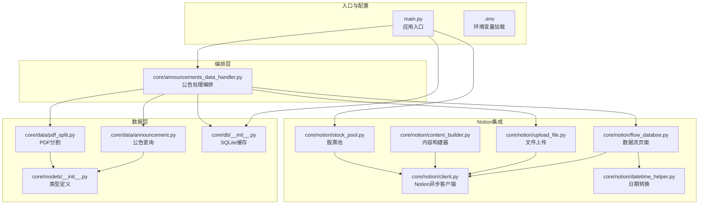
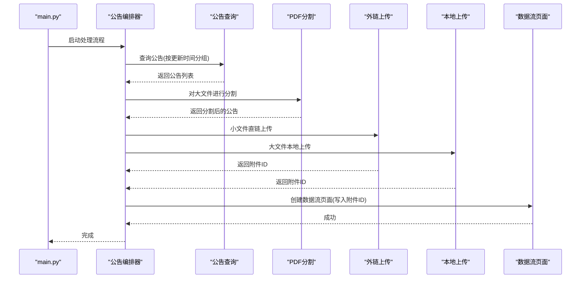
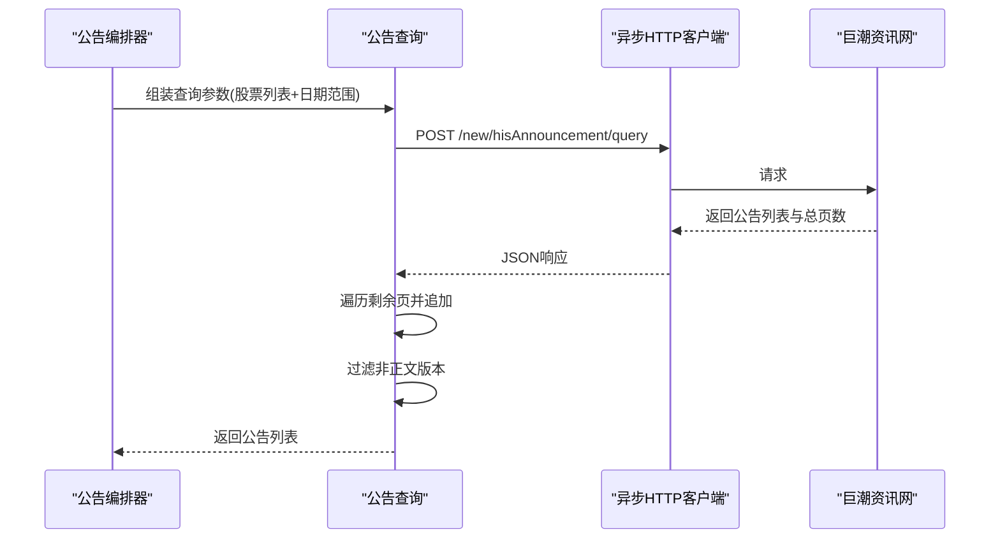
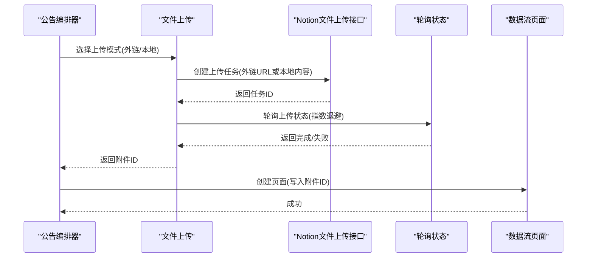
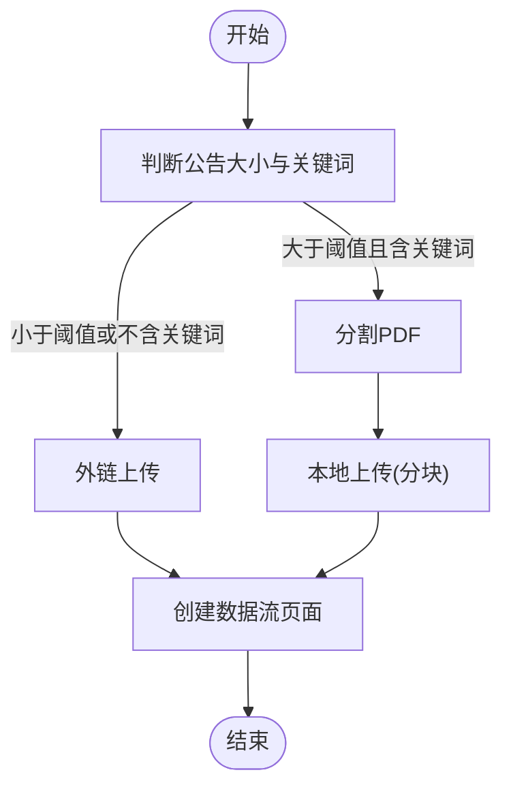
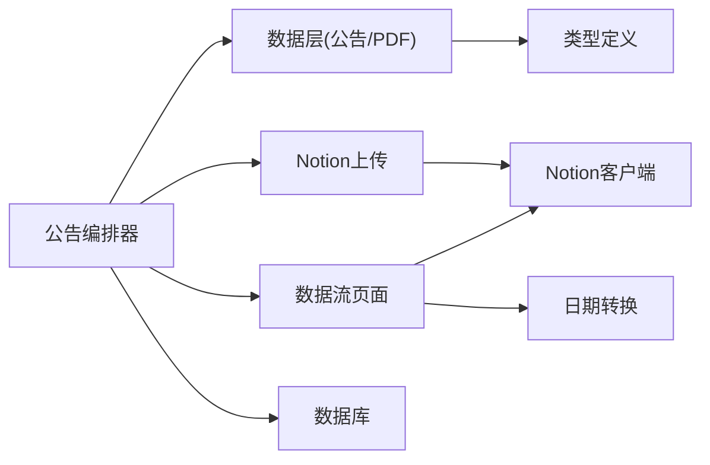

# 外部服务集成

<cite>
**本文引用的文件**
- [main.py](file://main.py)
- [pyproject.toml](file://pyproject.toml)
- [core/data/announcement.py](file://core/data/announcement.py)
- [core/data/pdf_split.py](file://core/data/pdf_split.py)
- [core/db/__init__.py](file://core/db/__init__.py)
- [core/models/__init__.py](file://core/models/__init__.py)
- [core/notion/client.py](file://core/notion/client.py)
- [core/notion/content_builder.py](file://core/notion/content_builder.py)
- [core/notion/datetime_helper.py](file://core/notion/datetime_helper.py)
- [core/notion/flow_databse.py](file://core/notion/flow_databse.py)
- [core/notion/stock_pool.py](file://core/notion/stock_pool.py)
- [core/notion/upload_file.py](file://core/notion/upload_file.py)
- [core/announcements_data_handler.py](file://core/announcements_data_handler.py)
- [tests/test_announcements_data_handler.py](file://tests/test_announcements_data_handler.py)
- [tests/test_integration.py](file://tests/test_integration.py)
- [tests/conftest.py](file://tests/conftest.py)
</cite>

## 目录
1. [简介](#简介)
2. [项目结构](#项目结构)
3. [核心组件](#核心组件)
4. [架构总览](#架构总览)
5. [详细组件分析](#详细组件分析)
6. [依赖分析](#依赖分析)
7. [性能考量](#性能考量)
8. [故障排查指南](#故障排查指南)
9. [结论](#结论)
10. [附录](#附录)

## 简介
本文件面向“股票公告自动化系统”的外部服务集成，聚焦两大外部API：
- 巨潮资讯网公告查询API（HTTP REST）
- Notion API（基于官方异步SDK）

文档将从系统架构、数据流、处理逻辑、错误处理、安全与速率限制、客户端实现与性能优化等方面进行说明，并提供常见用例、迁移与兼容性建议。

## 项目结构
系统采用分层与功能域划分：
- 核心数据层：负责从巨潮资讯网抓取公告、PDF分割与去重
- Notion集成层：负责构建页面内容、上传文件、创建数据流页面
- 业务编排层：协调各模块，组织并发与批处理
- 数据持久化：本地SQLite缓存更新时间与哈希去重
- 测试与配置：pytest配置、环境变量加载、集成测试

图表来源
- [main.py](file://main.py#L1-L40)
- [core/announcements_data_handler.py](file://core/announcements_data_handler.py#L1-L116)
- [core/data/announcement.py](file://core/data/announcement.py#L1-L141)
- [core/data/pdf_split.py](file://core/data/pdf_split.py#L1-L128)
- [core/db/__init__.py](file://core/db/__init__.py#L1-L218)
- [core/models/__init__.py](file://core/models/__init__.py#L1-L8)
- [core/notion/client.py](file://core/notion/client.py#L1-L6)
- [core/notion/content_builder.py](file://core/notion/content_builder.py#L1-L103)
- [core/notion/datetime_helper.py](file://core/notion/datetime_helper.py#L1-L39)
- [core/notion/flow_databse.py](file://core/notion/flow_databse.py#L1-L67)
- [core/notion/stock_pool.py](file://core/notion/stock_pool.py#L1-L52)
- [core/notion/upload_file.py](file://core/notion/upload_file.py#L1-L180)

章节来源
- [main.py](file://main.py#L1-L40)
- [pyproject.toml](file://pyproject.toml#L1-L21)

## 核心组件
- 巨潮资讯网公告查询：通过POST请求查询公告列表，支持分页与条件筛选，返回公告元信息并构造本地模型对象。
- PDF分割：对大文件公告进行分块切割，便于Notion文件上传限制下的合规上传。
- Notion文件上传：支持外链直传与本地内容上传两种模式，内置轮询与指数退避重试。
- Notion页面创建：在数据流数据库中创建页面，写入标题、日期、来源接口、数据类型、关联股票、附件与原文链接等属性。
- 股票池获取：从Notion数据源查询股票池，返回股票ID与代码。
- 编排器：根据更新时间分组批量查询公告，区分小文件直链上传与大文件本地分割上传，最后创建数据流页面。
- 数据持久化：维护SQLite表记录更新时间与哈希去重。

章节来源
- [core/data/announcement.py](file://core/data/announcement.py#L36-L112)
- [core/data/pdf_split.py](file://core/data/pdf_split.py#L15-L73)
- [core/notion/upload_file.py](file://core/notion/upload_file.py#L28-L61)
- [core/notion/flow_databse.py](file://core/notion/flow_databse.py#L25-L67)
- [core/notion/stock_pool.py](file://core/notion/stock_pool.py#L23-L51)
- [core/announcements_data_handler.py](file://core/announcements_data_handler.py#L21-L116)
- [core/db/__init__.py](file://core/db/__init__.py#L62-L215)

## 架构总览
系统通过异步协程串联外部API与内部模块，形成“查询-分割-上传-建页”的闭环。

图表来源
- [main.py](file://main.py#L20-L36)
- [core/announcements_data_handler.py](file://core/announcements_data_handler.py#L21-L116)
- [core/data/announcement.py](file://core/data/announcement.py#L36-L112)
- [core/data/pdf_split.py](file://core/data/pdf_split.py#L15-L73)
- [core/notion/upload_file.py](file://core/notion/upload_file.py#L28-L61)
- [core/notion/flow_databse.py](file://core/notion/flow_databse.py#L25-L67)

## 详细组件分析

### 巨潮资讯网公告查询API
- 协议与端点
  - 方法：POST
  - URL：http://www.cninfo.com.cn/new/hisAnnouncement/query
  - 请求参数：pageNum、pageSize、column、tabName、stock、seDate等
  - 响应：包含公告数组与总页数，后续按总页数循环追加
- 认证与安全
  - 未发现显式鉴权头或签名机制，需遵守网站爬取规范与robots.txt
- 速率限制
  - 未发现明确限速头；实现中通过分页遍历，建议结合业务需求控制并发与间隔
- 错误处理
  - 对摘要/英文版/图文版等非正文版本进行过滤
  - 异常统一由上层捕获并记录日志
- 性能优化
  - 使用异步HTTP客户端
  - 对股票列表进行分组聚合，减少请求次数
  - 使用LRU缓存缓存股票映射

图表来源
- [core/data/announcement.py](file://core/data/announcement.py#L36-L112)

章节来源
- [core/data/announcement.py](file://core/data/announcement.py#L36-L112)

### Notion API集成
- 客户端初始化
  - 通过环境变量读取令牌，初始化异步客户端
- 文件上传
  - 支持外链直传与本地内容上传两种模式
  - 内部上传：下载后直接上传；外链上传：直接使用URL
  - 轮询上传状态，指数退避重试，最多10次
- 页面创建
  - 在数据流数据库中创建页面，写入标题、日期、来源接口、数据类型、关联股票、附件与原文链接
- 内容构建
  - 提供标题、段落、表格、分隔线、Callout等块的构建器

图表来源
- [core/notion/upload_file.py](file://core/notion/upload_file.py#L28-L61)
- [core/notion/upload_file.py](file://core/notion/upload_file.py#L124-L150)
- [core/notion/upload_file.py](file://core/notion/upload_file.py#L153-L176)
- [core/notion/flow_databse.py](file://core/notion/flow_databse.py#L25-L67)

章节来源
- [core/notion/client.py](file://core/notion/client.py#L1-L6)
- [core/notion/upload_file.py](file://core/notion/upload_file.py#L28-L61)
- [core/notion/upload_file.py](file://core/notion/upload_file.py#L124-L176)
- [core/notion/flow_databse.py](file://core/notion/flow_databse.py#L25-L67)
- [core/notion/content_builder.py](file://core/notion/content_builder.py#L1-L103)

### PDF分割与上传策略
- 分割策略
  - 大于阈值的公告进行分块，避免单文件过大导致上传失败
  - 分块大小与重叠页数可配置，保证阅读连贯性
- 上传策略
  - 小于阈值或不含关键词的公告直接外链上传
  - 大于阈值且含关键词的公告先分割再本地上传
- 并发与去重
  - 并发执行上传任务，使用gather聚合结果
  - 通过哈希去重避免重复处理

图表来源
- [core/announcements_data_handler.py](file://core/announcements_data_handler.py#L66-L93)
- [core/data/pdf_split.py](file://core/data/pdf_split.py#L15-L73)
- [core/notion/upload_file.py](file://core/notion/upload_file.py#L28-L61)

章节来源
- [core/announcements_data_handler.py](file://core/announcements_data_handler.py#L21-L116)
- [core/data/pdf_split.py](file://core/data/pdf_split.py#L15-L73)

### 数据库与类型
- 数据库
  - 初始化两张表：更新记录表与哈希表
  - 提供获取/设置更新时间、哈希校验与保存能力
- 类型
  - 定义NotionDate新类型，约束日期/时间字符串格式

章节来源
- [core/db/__init__.py](file://core/db/__init__.py#L62-L215)
- [core/models/__init__.py](file://core/models/__init__.py#L1-L8)

## 依赖分析
- 模块耦合
  - 编排器依赖数据层、上传层与页面层，耦合度适中
  - 数据层与Notion层通过编排器解耦，便于替换与扩展
- 外部依赖
  - 巨潮资讯网：HTTP REST
  - Notion：官方异步SDK
  - SQLite：本地缓存
- 循环依赖
  - 未见循环导入；各模块职责清晰

图表来源
- [core/announcements_data_handler.py](file://core/announcements_data_handler.py#L1-L116)
- [core/data/announcement.py](file://core/data/announcement.py#L1-L141)
- [core/data/pdf_split.py](file://core/data/pdf_split.py#L1-L128)
- [core/db/__init__.py](file://core/db/__init__.py#L1-L218)
- [core/models/__init__.py](file://core/models/__init__.py#L1-L8)
- [core/notion/upload_file.py](file://core/notion/upload_file.py#L1-L180)
- [core/notion/flow_databse.py](file://core/notion/flow_databse.py#L1-L67)
- [core/notion/client.py](file://core/notion/client.py#L1-L6)
- [core/notion/datetime_helper.py](file://core/notion/datetime_helper.py#L1-L39)

## 性能考量
- 并发与批处理
  - 使用异步HTTP客户端与并发gather，提升I/O密集型吞吐
  - 对股票按更新时间分组，合并查询请求
- 上传优化
  - 外链直传优先，减少本地I/O与内存占用
  - 分块上传避免单文件过大
- 重试与退避
  - 文件上传轮询采用指数退避，平衡成功率与资源消耗
- 缓存与去重
  - LRU缓存股票映射，减少网络请求
  - 哈希去重避免重复处理

章节来源
- [core/data/announcement.py](file://core/data/announcement.py#L79-L92)
- [core/announcements_data_handler.py](file://core/announcements_data_handler.py#L40-L62)
- [core/notion/upload_file.py](file://core/notion/upload_file.py#L153-L176)
- [core/db/__init__.py](file://core/db/__init__.py#L97-L128)

## 故障排查指南
- 常见问题
  - 网络异常：巨潮资讯网请求失败或响应异常
  - Notion上传失败：外链不可达、文件过大、导入失败
  - 页面创建失败：属性映射错误或数据库异常
- 日志与监控
  - 关键路径均记录DEBUG/ERROR级别日志，便于定位
- 重试与降级
  - 文件上传采用指数退避重试；若超时标记为失败
  - PDF分割失败时保留原公告，避免整体流程中断
- 单元与集成测试
  - 通过pytest与mock验证流程关键节点行为

章节来源
- [core/data/announcement.py](file://core/data/announcement.py#L95-L112)
- [core/notion/upload_file.py](file://core/notion/upload_file.py#L153-L176)
- [core/notion/flow_databse.py](file://core/notion/flow_databse.py#L59-L67)
- [tests/test_announcements_data_handler.py](file://tests/test_announcements_data_handler.py#L1-L367)
- [tests/test_integration.py](file://tests/test_integration.py#L1-L276)

## 结论
系统通过清晰的模块划分与异步并发，实现了从巨潮资讯网抓取公告、PDF分割、Notion文件上传与页面创建的完整自动化流程。对外部API的集成遵循REST与异步SDK约定，具备良好的可维护性与扩展性。建议在生产环境中结合业务流量与外部API限速策略，进一步优化并发与重试参数。

## 附录

### API定义与使用说明

- 巨潮资讯网公告查询API
  - 方法：POST
  - URL：http://www.cninfo.com.cn/new/hisAnnouncement/query
  - 请求参数要点：pageNum、pageSize、column、tabName、stock（多支股票拼接）、seDate（日期范围）
  - 响应要点：返回公告数组与总页数，需遍历剩余页
  - 过滤规则：排除摘要/英文版/图文版等非正文版本
  - 认证与安全：未发现鉴权头；建议遵守网站爬取规范
  - 速率限制：未发现明确限速头；建议控制并发与间隔
  - 错误处理：异常统一记录日志，上层捕获
  - 性能优化：异步HTTP、分组聚合、LRU缓存

- Notion文件上传API
  - 模式一：外链直传
    - 请求：创建上传任务(外链URL)
    - 轮询：指数退避重试，最多10次
    - 结果：返回附件ID或错误
  - 模式二：本地内容上传
    - 请求：下载后直接上传
    - 轮询：同上
    - 结果：返回附件ID或错误
  - 认证与安全：通过环境变量读取令牌初始化异步客户端
  - 速率限制：未发现明确限速头；建议控制并发与重试间隔
  - 错误处理：失败时记录错误并返回失败状态
  - 性能优化：并发上传、分块上传、轮询退避

- Notion页面创建API
  - 请求：在数据流数据库创建页面，写入标题、日期、来源接口、数据类型、关联股票、附件与原文链接
  - 认证与安全：依赖Notion客户端初始化
  - 错误处理：异常记录日志并上抛

章节来源
- [core/data/announcement.py](file://core/data/announcement.py#L57-L112)
- [core/notion/upload_file.py](file://core/notion/upload_file.py#L124-L176)
- [core/notion/flow_databse.py](file://core/notion/flow_databse.py#L25-L67)
- [core/notion/client.py](file://core/notion/client.py#L1-L6)

### 客户端实现与最佳实践
- 客户端实现
  - 使用异步HTTP客户端发起请求
  - 使用异步SDK与Notion交互
  - 使用SQLite缓存与哈希去重
- 最佳实践
  - 控制并发与请求间隔，避免触发外部限速
  - 对大文件进行分块上传，提高成功率
  - 使用轮询与指数退避，平衡性能与可靠性
  - 记录详细日志，便于问题定位
  - 对异常进行分类处理与降级

章节来源
- [core/announcements_data_handler.py](file://core/announcements_data_handler.py#L40-L93)
- [core/notion/upload_file.py](file://core/notion/upload_file.py#L153-L176)
- [core/db/__init__.py](file://core/db/__init__.py#L97-L128)

### 已弃用功能与迁移指南
- 当前代码未发现明显弃用功能
- 若未来API变更，建议：
  - 通过配置中心或环境变量切换URL与参数
  - 保持接口签名与错误码兼容过渡期
  - 逐步替换旧实现，配合灰度发布

[本节为通用指导，无需特定文件引用]

### 使用限制与合规建议
- 巨潮资讯网
  - 遵守网站爬取规范与robots.txt
  - 控制请求频率，避免对服务器造成压力
- Notion
  - 严格管理令牌权限，最小授权原则
  - 避免滥用上传与页面创建接口
  - 关注平台API变更通知

[本节为通用指导，无需特定文件引用]