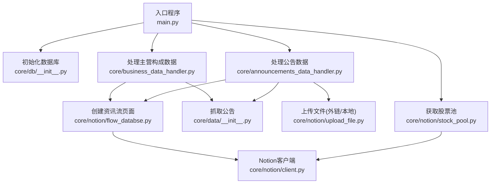
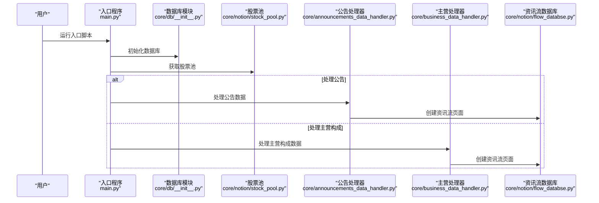
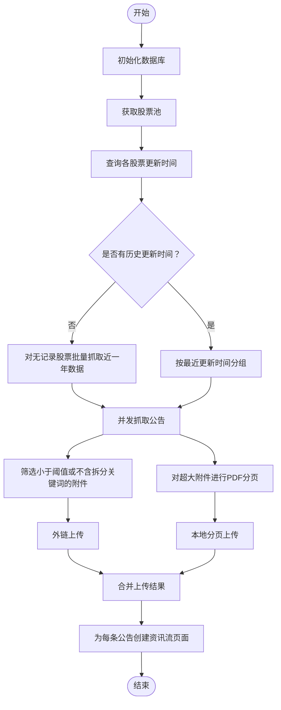
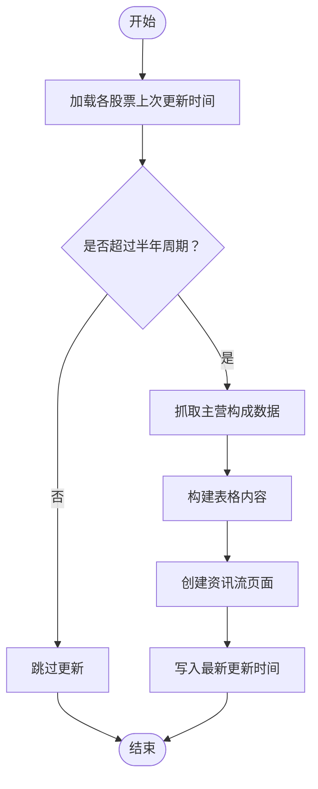
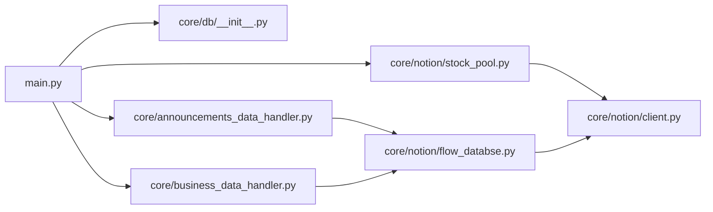

# 快速开始

<cite>
**本文引用的文件**
- [main.py](file://main.py)
- [pyproject.toml](file://pyproject.toml)
- [tests/conftest.py](file://tests/conftest.py)
- [core/db/__init__.py](file://core/db/__init__.py)
- [core/data/__init__.py](file://core/data/__init__.py)
- [core/announcements_data_handler.py](file://core/announcements_data_handler.py)
- [core/business_data_handler.py](file://core/business_data_handler.py)
- [core/notion/client.py](file://core/notion/client.py)
- [core/notion/stock_pool.py](file://core/notion/stock_pool.py)
- [core/notion/flow_databse.py](file://core/notion/flow_databse.py)
- [tests/test_integration.py](file://tests/test_integration.py)
</cite>

## 目录
1. [简介](#简介)
2. [项目结构](#项目结构)
3. [核心组件](#核心组件)
4. [架构总览](#架构总览)
5. [详细组件分析](#详细组件分析)
6. [依赖分析](#依赖分析)
7. [性能注意事项](#性能注意事项)
8. [故障排除指南](#故障排除指南)
9. [结论](#结论)
10. [附录](#附录)

## 简介
本指南面向首次部署“股票公告自动化系统”的用户，目标是在30分钟内完成环境准备、依赖安装、环境变量配置与首次运行。系统支持：
- 从巨潮资讯网抓取上市公司公告
- 自动识别超大附件并进行PDF分页
- 将公告与原文链接、附件上传至 Notion，并在“资讯流数据库”中创建数据流页面
- 通过股票池数据库动态获取关注股票列表

## 项目结构
系统采用模块化组织，核心路径如下：
- 核心业务：core/announcements_data_handler.py、core/business_data_handler.py
- 数据层：core/data/*（公告、主营构成、PDF分页）
- 数据库：core/db/__init__.py（SQLite异步封装、去重哈希、更新时间记录）
- Notion 集成：core/notion/*（客户端、股票池、资讯流数据库、内容构建、文件上传）
- 入口程序：main.py
- 测试与配置：tests/conftest.py、pyproject.toml

图表来源
- [main.py](file://main.py#L20-L39)
- [core/db/__init__.py](file://core/db/__init__.py#L62-L94)
- [core/notion/stock_pool.py](file://core/notion/stock_pool.py#L23-L51)
- [core/announcements_data_handler.py](file://core/announcements_data_handler.py#L21-L115)
- [core/business_data_handler.py](file://core/business_data_handler.py#L17-L67)
- [core/notion/flow_databse.py](file://core/notion/flow_databse.py#L25-L66)
- [core/notion/client.py](file://core/notion/client.py#L1-L5)

章节来源
- [main.py](file://main.py#L1-L40)
- [core/db/__init__.py](file://core/db/__init__.py#L1-L218)
- [core/notion/stock_pool.py](file://core/notion/stock_pool.py#L1-L52)
- [core/announcements_data_handler.py](file://core/announcements_data_handler.py#L1-L116)
- [core/business_data_handler.py](file://core/business_data_handler.py#L1-L108)
- [core/notion/flow_databse.py](file://core/notion/flow_databse.py#L1-L67)
- [core/notion/client.py](file://core/notion/client.py#L1-L6)

## 核心组件
- 数据库模块：负责初始化 SQLite 表、记录更新时间、计算并校验数据哈希，避免重复处理
- 公告处理器：批量抓取公告、根据大小与关键词决定外链上传或本地分页上传，最终创建资讯流页面
- 主营构成处理器：按半年周期判断是否需要更新，生成表格内容并创建页面
- Notion 集成：通过环境变量读取 Token、股票池 ID、资讯流数据库 ID；封装异步客户端与页面创建

章节来源
- [core/db/__init__.py](file://core/db/__init__.py#L62-L217)
- [core/announcements_data_handler.py](file://core/announcements_data_handler.py#L21-L115)
- [core/business_data_handler.py](file://core/business_data_handler.py#L17-L107)
- [core/notion/flow_databse.py](file://core/notion/flow_databse.py#L25-L66)
- [core/notion/client.py](file://core/notion/client.py#L1-L5)

## 架构总览
系统运行流程概览：

图表来源
- [main.py](file://main.py#L20-L39)
- [core/db/__init__.py](file://core/db/__init__.py#L62-L94)
- [core/notion/stock_pool.py](file://core/notion/stock_pool.py#L23-L51)
- [core/announcements_data_handler.py](file://core/announcements_data_handler.py#L21-L115)
- [core/business_data_handler.py](file://core/business_data_handler.py#L17-L67)
- [core/notion/flow_databse.py](file://core/notion/flow_databse.py#L25-L66)

## 详细组件分析

### 环境准备与依赖安装
- Python 版本：建议使用 Python 3.10+（与异步特性兼容）
- 依赖管理：使用 pytest 配置与测试框架，可通过 pip 安装所需包
- 项目测试配置：pytest 已在配置文件中声明，便于后续运行单元/集成测试

安装与运行命令（示例，请以实际依赖为准）：
- 安装依赖：pip install -r requirements.txt（如存在）
- 运行入口：python main.py
- 运行测试：pytest tests/ -v

章节来源
- [pyproject.toml](file://pyproject.toml#L1-L21)
- [main.py](file://main.py#L1-L40)

### 环境变量配置
系统通过环境变量读取以下关键参数：
- NOTION_TOKEN：Notion 集成所需的 API 密钥
- STOCK_POOL：股票池数据库 ID（用于读取关注股票列表）
- FLOW_DATABASE：资讯流数据库 ID（用于创建数据流页面）

配置步骤：
1) 在 Notion 中创建“股票池”数据库，包含“股票代码”字段
2) 在 Notion 中创建“资讯流数据库”，并准备数据类型映射（如“公告披露”、“主营构成”等）
3) 生成并复制 Notion 的 Integration Token，设置 NOTION_TOKEN
4) 复制“股票池”数据库 ID，设置 STOCK_POOL
5) 复制“资讯流数据库” ID，设置 FLOW_DATABASE
6) 如需使用临时数据库进行测试，可设置 DB_PATH 指向本地 .db 文件

章节来源
- [core/notion/client.py](file://core/notion/client.py#L1-L5)
- [core/notion/stock_pool.py](file://core/notion/stock_pool.py#L32-L33)
- [core/notion/flow_databse.py](file://core/notion/flow_databse.py#L21-L22)
- [tests/conftest.py](file://tests/conftest.py#L28-L38)

### 首次运行步骤
1) 准备环境变量（见上节）
2) 初始化数据库：入口会自动创建表结构
3) 获取股票池：从 Notion 读取股票列表
4) 处理公告数据：抓取公告、上传附件、创建资讯流页面
5) 可选：处理主营构成数据（按半年周期触发）

验证步骤：
- 查看控制台日志确认各阶段执行
- 在 Notion 中检查“资讯流数据库”是否新增页面
- 检查数据库文件是否存在并包含 update_records/hash 表

章节来源
- [main.py](file://main.py#L20-L39)
- [core/db/__init__.py](file://core/db/__init__.py#L62-L94)
- [core/notion/stock_pool.py](file://core/notion/stock_pool.py#L23-L51)
- [core/announcements_data_handler.py](file://core/announcements_data_handler.py#L21-L115)
- [core/notion/flow_databse.py](file://core/notion/flow_databse.py#L25-L66)

### 公告处理流程（算法与数据流）

图表来源
- [core/announcements_data_handler.py](file://core/announcements_data_handler.py#L21-L115)
- [core/data/__init__.py](file://core/data/__init__.py#L1-L5)
- [core/notion/flow_databse.py](file://core/notion/flow_databse.py#L25-L66)

章节来源
- [core/announcements_data_handler.py](file://core/announcements_data_handler.py#L1-L116)

### 主营构成处理流程（周期性更新）

图表来源
- [core/business_data_handler.py](file://core/business_data_handler.py#L17-L107)
- [core/notion/flow_databse.py](file://core/notion/flow_databse.py#L25-L66)

章节来源
- [core/business_data_handler.py](file://core/business_data_handler.py#L1-L108)

## 依赖分析
- 模块耦合
  - main.py 仅负责编排：初始化数据库、获取股票池、调度公告/主营处理
  - 公告/主营处理器依赖数据层与 Notion 层，彼此独立
  - 数据层依赖数据库模块，提供去重与更新时间管理
- 外部依赖
  - Notion 异步客户端：通过环境变量注入 Token
  - SQLite：异步连接与事务管理
  - pytest：测试与配置

图表来源
- [main.py](file://main.py#L12-L35)
- [core/db/__init__.py](file://core/db/__init__.py#L1-L218)
- [core/notion/stock_pool.py](file://core/notion/stock_pool.py#L1-L52)
- [core/announcements_data_handler.py](file://core/announcements_data_handler.py#L1-L116)
- [core/business_data_handler.py](file://core/business_data_handler.py#L1-L108)
- [core/notion/flow_databse.py](file://core/notion/flow_databse.py#L1-L67)
- [core/notion/client.py](file://core/notion/client.py#L1-L6)

章节来源
- [main.py](file://main.py#L1-L40)
- [core/db/__init__.py](file://core/db/__init__.py#L1-L218)
- [core/notion/stock_pool.py](file://core/notion/stock_pool.py#L1-L52)
- [core/announcements_data_handler.py](file://core/announcements_data_handler.py#L1-L116)
- [core/business_data_handler.py](file://core/business_data_handler.py#L1-L108)
- [core/notion/flow_databse.py](file://core/notion/flow_databse.py#L1-L67)
- [core/notion/client.py](file://core/notion/client.py#L1-L6)

## 性能注意事项
- 并发抓取：公告抓取与页面创建均使用 asyncio.gather 并发执行，提升吞吐
- 批量查询：按最近更新时间分组，减少巨潮资讯网接口调用次数
- 附件策略：小附件直链上传，大附件分页后本地上传，兼顾速度与合规
- 哈希去重：对抓取数据计算哈希，避免重复入库与重复创建页面

章节来源
- [core/announcements_data_handler.py](file://core/announcements_data_handler.py#L40-L62)
- [core/db/__init__.py](file://core/db/__init__.py#L97-L128)

## 故障排除指南
常见问题与解决思路：
- 环境变量未生效
  - 确认 .env 或系统环境变量中已设置 NOTION_TOKEN、STOCK_POOL、FLOW_DATABASE
  - 入口与测试均已加载 dotenv，可在本地运行前检查加载顺序
- 数据库文件无法创建或权限不足
  - 检查 DB_PATH 指向的目录权限，或使用默认路径
  - 初次运行会自动建表，若失败请查看日志并重试
- Notion 页面创建失败
  - 确认 FLOW_DATABASE 与数据类型映射一致
  - 检查 Integration 权限是否授予对应数据库
- 公告抓取为空
  - 检查股票池是否正确返回股票代码
  - 若为首次运行，系统会默认抓取近一年数据；请确认网络与接口可用
- 半年周期未触发主营构成更新
  - 确认上次更新时间为季度末，且当前已超过下一个更新时间点

章节来源
- [tests/conftest.py](file://tests/conftest.py#L10-L11)
- [core/notion/flow_databse.py](file://core/notion/flow_databse.py#L21-L22)
- [core/notion/stock_pool.py](file://core/notion/stock_pool.py#L32-L33)
- [core/business_data_handler.py](file://core/business_data_handler.py#L70-L107)
- [tests/test_integration.py](file://tests/test_integration.py#L249-L270)

## 结论
按照本指南完成环境准备、依赖安装与环境变量配置后，系统可在约 30 分钟内完成首次运行。建议先以公告处理为主流程验证，再逐步启用主营构成处理与定时调度。

## 附录

### 环境变量清单
- NOTION_TOKEN：Notion Integration 的 API 密钥
- STOCK_POOL：股票池数据库 ID
- FLOW_DATABASE：资讯流数据库 ID
- DB_PATH：可选，自定义 SQLite 数据库存储路径

章节来源
- [core/notion/client.py](file://core/notion/client.py#L1-L5)
- [core/notion/stock_pool.py](file://core/notion/stock_pool.py#L32-L33)
- [core/notion/flow_databse.py](file://core/notion/flow_databse.py#L21-L22)
- [tests/conftest.py](file://tests/conftest.py#L28-L38)