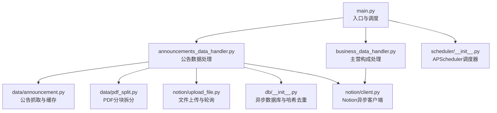
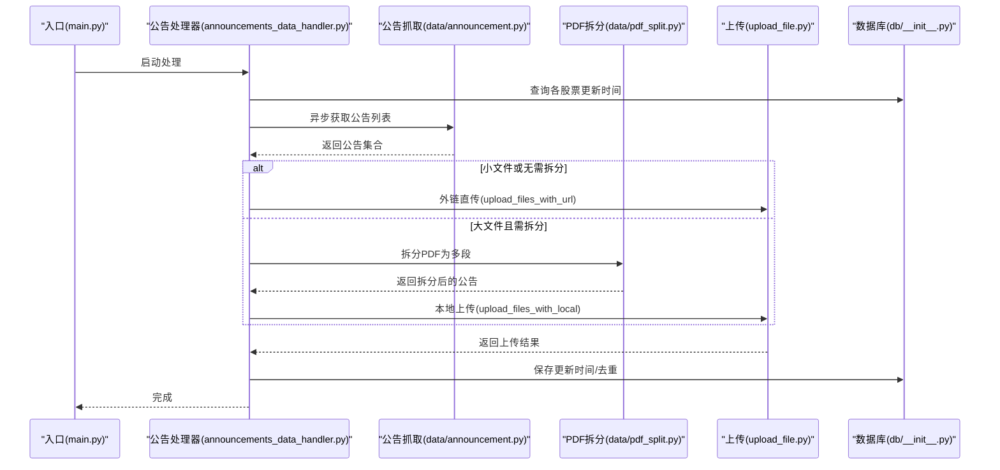
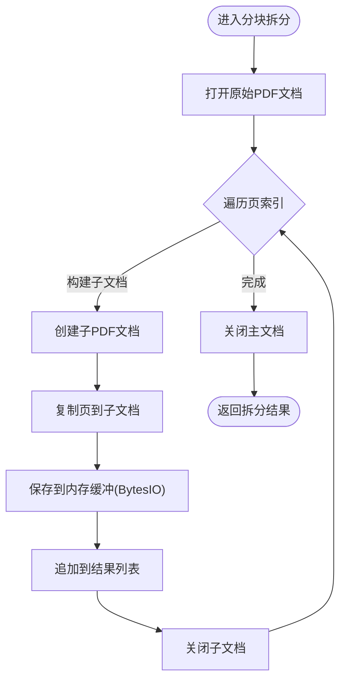
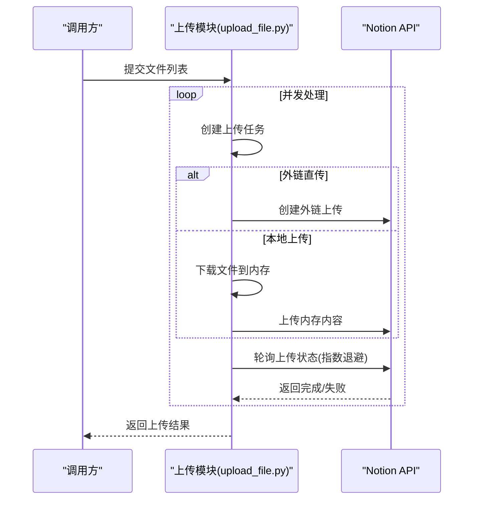
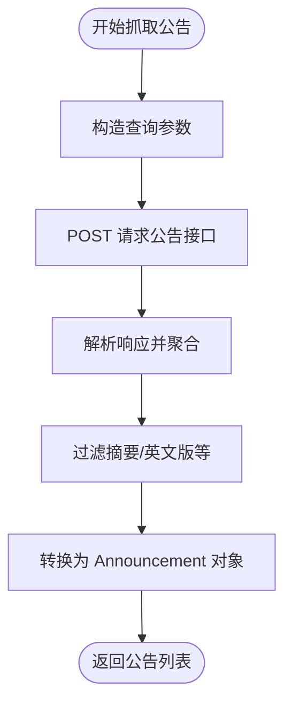
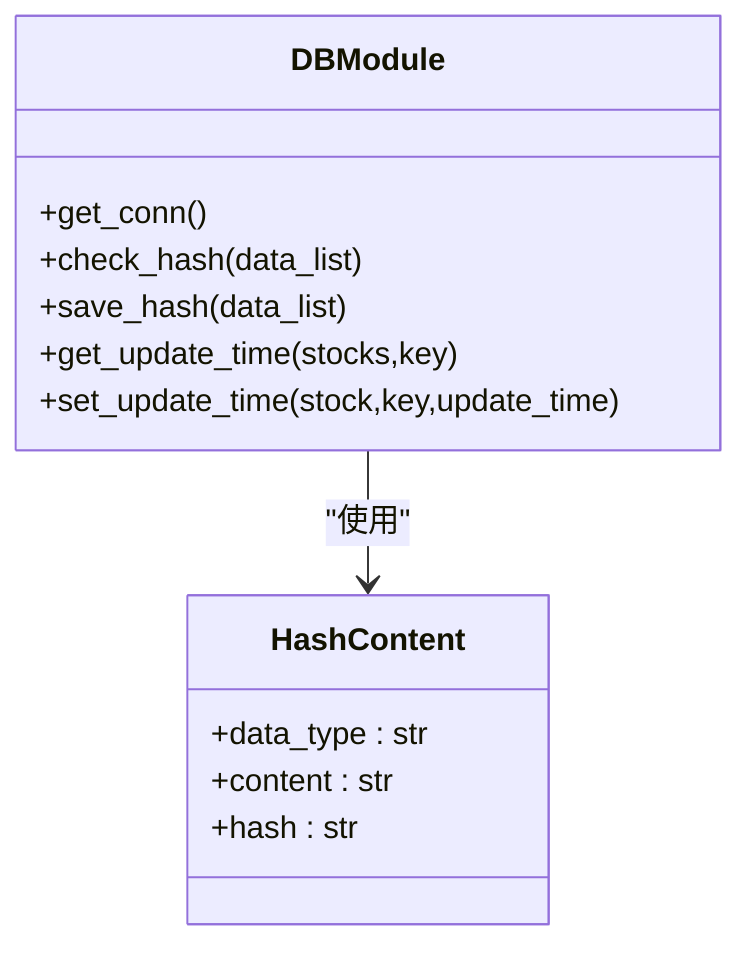
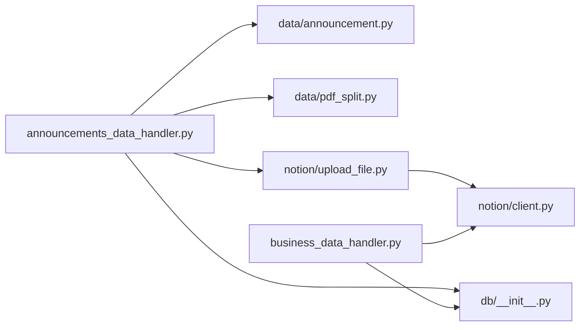

# 内存管理优化

<cite>
**本文引用的文件**
- [main.py](file://main.py)
- [core/announcements_data_handler.py](file://core/announcements_data_handler.py)
- [core/business_data_handler.py](file://core/business_data_handler.py)
- [core/data/announcement.py](file://core/data/announcement.py)
- [core/data/pdf_split.py](file://core/data/pdf_split.py)
- [core/notion/upload_file.py](file://core/notion/upload_file.py)
- [core/db/__init__.py](file://core/db/__init__.py)
- [core/models/__init__.py](file://core/models/__init__.py)
- [core/notion/client.py](file://core/notion/client.py)
- [core/scheduler/__init__.py](file://core/scheduler/__init__.py)
</cite>

## 目录
1. [引言](#引言)
2. [项目结构](#项目结构)
3. [核心组件](#核心组件)
4. [架构总览](#架构总览)
5. [详细组件分析](#详细组件分析)
6. [依赖关系分析](#依赖关系分析)
7. [性能考量与内存优化策略](#性能考量与内存优化策略)
8. [故障排查指南](#故障排查指南)
9. [结论](#结论)
10. [附录](#附录)

## 引言
本指南聚焦于股票公告自动化系统在处理PDF大文件时的内存管理优化，围绕以下目标展开：
- PDF大文件处理的内存优化策略：分块读取、流式处理、内存映射与临时文件管理
- 对象生命周期管理与垃圾回收优化：避免长生命周期持有导致的内存膨胀
- 大量数据处理时的内存峰值控制：并发与批处理的平衡
- 内存使用监控、性能分析与工具使用建议
- 生产环境内存配置与资源限制设置

## 项目结构
系统采用模块化设计，围绕“数据抓取—PDF拆分—上传—页面创建”的主流程组织代码。与内存优化密切相关的关键模块如下：
- 数据抓取层：异步HTTP客户端，减少阻塞与连接占用
- PDF处理层：基于pymupdf的分块拆分与内存缓冲
- 上传层：异步上传与轮询，结合内存缓冲与外链直传
- 数据库层：轻量SQLite，异步上下文管理，避免连接泄漏
- Notion客户端：异步SDK，统一认证与API调用

图表来源
- [main.py](file://main.py#L20-L39)
- [core/announcements_data_handler.py](file://core/announcements_data_handler.py#L21-L115)
- [core/business_data_handler.py](file://core/business_data_handler.py#L17-L67)
- [core/data/announcement.py](file://core/data/announcement.py#L36-L112)
- [core/data/pdf_split.py](file://core/data/pdf_split.py#L15-L127)
- [core/notion/upload_file.py](file://core/notion/upload_file.py#L28-L176)
- [core/db/__init__.py](file://core/db/__init__.py#L28-L215)
- [core/notion/client.py](file://core/notion/client.py#L1-L6)
- [core/scheduler/__init__.py](file://core/scheduler/__init__.py#L1-L7)

章节来源
- [main.py](file://main.py#L1-L40)
- [core/announcements_data_handler.py](file://core/announcements_data_handler.py#L1-L116)
- [core/business_data_handler.py](file://core/business_data_handler.py#L1-L108)
- [core/data/announcement.py](file://core/data/announcement.py#L1-L141)
- [core/data/pdf_split.py](file://core/data/pdf_split.py#L1-L128)
- [core/notion/upload_file.py](file://core/notion/upload_file.py#L1-L180)
- [core/db/__init__.py](file://core/db/__init__.py#L1-L218)
- [core/models/__init__.py](file://core/models/__init__.py#L1-L8)
- [core/notion/client.py](file://core/notion/client.py#L1-L6)
- [core/scheduler/__init__.py](file://core/scheduler/__init__.py#L1-L7)

## 核心组件
- 公告抓取与缓存：异步HTTP请求，使用LRU缓存减少重复网络开销；对返回的公告集合进行过滤与转换，避免不必要的对象创建。
- PDF分块拆分：基于页数阈值与重叠窗口，将大PDF拆分为多个小PDF，使用内存缓冲（BytesIO）保存中间产物，及时关闭文档句柄释放底层资源。
- 文件上传：支持本地内容上传与外链直传两种模式，均采用异步并发与轮询机制；对外链直传使用Notion的外链模式，避免下载整文件到内存。
- 数据库与去重：异步SQLite连接管理，使用上下文管理器确保事务提交与回滚，避免连接泄漏；基于xxhash对数据内容计算哈希，实现高效去重。
- Notion客户端：统一的异步SDK初始化，集中管理认证与API调用。

章节来源
- [core/data/announcement.py](file://core/data/announcement.py#L36-L141)
- [core/data/pdf_split.py](file://core/data/pdf_split.py#L15-L127)
- [core/notion/upload_file.py](file://core/notion/upload_file.py#L28-L176)
- [core/db/__init__.py](file://core/db/__init__.py#L28-L215)
- [core/notion/client.py](file://core/notion/client.py#L1-L6)

## 架构总览
系统整体流程：入口启动后，拉取股票池，异步抓取公告列表，根据大小与关键词决定是否拆分，随后并发上传至Notion并创建数据流页面。数据库负责维护更新时间与去重。

图表来源
- [main.py](file://main.py#L20-L39)
- [core/announcements_data_handler.py](file://core/announcements_data_handler.py#L21-L115)
- [core/data/announcement.py](file://core/data/announcement.py#L36-L112)
- [core/data/pdf_split.py](file://core/data/pdf_split.py#L15-L127)
- [core/notion/upload_file.py](file://core/notion/upload_file.py#L28-L176)
- [core/db/__init__.py](file://core/db/__init__.py#L153-L215)

## 详细组件分析

### 组件A：PDF分块拆分与内存缓冲
- 分块策略：基于固定块大小与重叠窗口，避免跨页断裂；拆分后为每个子PDF生成独立的内存缓冲，便于后续上传。
- 资源释放：每次拆分后显式关闭pymupdf文档对象，防止底层资源泄露；BytesIO在使用后由上层及时消费并丢弃。
- 关键路径参考
  - [split_pdf 函数](file://core/data/pdf_split.py#L15-L73)
  - [_split_pdf_content 实现](file://core/data/pdf_split.py#L92-L127)

图表来源
- [core/data/pdf_split.py](file://core/data/pdf_split.py#L92-L127)

章节来源
- [core/data/pdf_split.py](file://core/data/pdf_split.py#L15-L127)

### 组件B：异步上传与轮询（本地与外链）
- 本地上传：下载后直接构造内存缓冲并上传，适合拆分后的PDF片段；并发收集结果。
- 外链直传：使用Notion外链模式，避免下载到本地内存，显著降低峰值内存。
- 轮询机制：指数退避等待上传完成，避免频繁轮询造成CPU与网络压力。
- 关键路径参考
  - [upload_files_with_local](file://core/notion/upload_file.py#L28-L37)
  - [upload_files_with_url](file://core/notion/upload_file.py#L40-L61)
  - [_upload_internal_and_wait](file://core/notion/upload_file.py#L64-L96)
  - [_upload_external_and_wait](file://core/notion/upload_file.py#L124-L150)
  - [_poll_upload_status](file://core/notion/upload_file.py#L153-L176)

图表来源
- [core/notion/upload_file.py](file://core/notion/upload_file.py#L28-L176)

章节来源
- [core/notion/upload_file.py](file://core/notion/upload_file.py#L28-L176)

### 组件C：公告抓取与缓存
- 异步HTTP请求：减少I/O阻塞，提高吞吐。
- LRU缓存：对静态数据（如股票映射）进行缓存，避免重复网络请求。
- 关键路径参考
  - [get_announcements](file://core/data/announcement.py#L36-L112)
  - [_get_stock_json 缓存](file://core/data/announcement.py#L115-L141)

图表来源
- [core/data/announcement.py](file://core/data/announcement.py#L36-L112)

章节来源
- [core/data/announcement.py](file://core/data/announcement.py#L36-L141)

### 组件D：数据库与去重（异步上下文管理）
- 异步上下文管理器：确保事务提交/回滚与连接关闭，避免连接泄漏。
- 哈希去重：对数据内容计算哈希，查询与写入分离，减少重复数据入库。
- 关键路径参考
  - [get_conn 上下文管理](file://core/db/__init__.py#L28-L51)
  - [check_hash 去重](file://core/db/__init__.py#L97-L128)
  - [save_hash 批量保存](file://core/db/__init__.py#L131-L151)

图表来源
- [core/db/__init__.py](file://core/db/__init__.py#L19-L215)

章节来源
- [core/db/__init__.py](file://core/db/__init__.py#L1-L218)

### 组件E：入口与调度
- 入口：加载环境变量，初始化数据库，拉取股票池，启动公告处理流程。
- 调度：APScheduler提供异步调度器，可在生产环境中配置定时任务。
- 关键路径参考
  - [main](file://main.py#L20-L39)
  - [scheduler](file://core/scheduler/__init__.py#L1-L7)

章节来源
- [main.py](file://main.py#L1-L40)
- [core/scheduler/__init__.py](file://core/scheduler/__init__.py#L1-L7)

## 依赖关系分析
- 模块耦合：公告处理器依赖数据抓取、PDF拆分、上传模块与数据库；上传模块依赖Notion客户端与HTTPX；数据库模块提供通用连接与事务管理。
- 外部依赖：pymupdf用于PDF处理，httpx用于HTTP请求，aiosqlite用于异步数据库访问，notion-client用于Notion API交互。
- 循环依赖：当前结构未见循环导入，模块职责清晰。

图表来源
- [core/announcements_data_handler.py](file://core/announcements_data_handler.py#L7-L16)
- [core/business_data_handler.py](file://core/business_data_handler.py#L4-L12)
- [core/data/announcement.py](file://core/data/announcement.py#L7-L8)
- [core/data/pdf_split.py](file://core/data/pdf_split.py#L4-L7)
- [core/notion/upload_file.py](file://core/notion/upload_file.py#L6-L9)
- [core/db/__init__.py](file://core/db/__init__.py#L7-L10)
- [core/notion/client.py](file://core/notion/client.py#L3-L5)

章节来源
- [core/announcements_data_handler.py](file://core/announcements_data_handler.py#L1-L116)
- [core/business_data_handler.py](file://core/business_data_handler.py#L1-L108)
- [core/data/announcement.py](file://core/data/announcement.py#L1-L141)
- [core/data/pdf_split.py](file://core/data/pdf_split.py#L1-L128)
- [core/notion/upload_file.py](file://core/notion/upload_file.py#L1-L180)
- [core/db/__init__.py](file://core/db/__init__.py#L1-L218)
- [core/notion/client.py](file://core/notion/client.py#L1-L6)

## 性能考量与内存优化策略

### PDF大文件处理的内存优化
- 分块读取与重叠窗口
  - 通过固定块大小与重叠窗口，避免单次加载过多页导致内存峰值过高；重叠窗口保证跨页内容完整性。
  - 参考：[CHUNK_SIZE/REP_SIZE 与分块逻辑](file://core/data/pdf_split.py#L11-L12), [分块实现](file://core/data/pdf_split.py#L105-L125)
- 流式处理
  - 使用BytesIO作为内存缓冲，边拆分边写入，避免一次性将整个PDF加载到内存；拆分完成后及时消费并丢弃缓冲。
  - 参考：[内存缓冲与保存](file://core/data/pdf_split.py#L117-L121)
- 文档句柄管理
  - 每次拆分后显式关闭pymupdf文档对象，防止底层资源泄露；主文档在拆分结束后关闭。
  - 参考：[关闭文档](file://core/data/pdf_split.py#L88-L89), [关闭子文档](file://core/data/pdf_split.py#L124-L125)
- 外链直传优先
  - 对于超大文件，优先采用Notion外链直传模式，避免下载到本地内存，显著降低峰值内存。
  - 参考：[外链直传](file://core/notion/upload_file.py#L124-L150)

### 对象生命周期管理与垃圾回收优化
- 异步上下文管理
  - 数据库连接使用异步上下文管理器，确保事务提交/回滚与连接关闭，避免连接泄漏导致的隐性内存增长。
  - 参考：[get_conn](file://core/db/__init__.py#L28-L51)
- LRU缓存
  - 对静态数据（如股票映射）使用LRU缓存，减少重复网络请求与对象创建，降低GC压力。
  - 参考：[LRU缓存](file://core/data/announcement.py#L115-L141)
- 显式释放
  - 在PDF拆分与上传流程中，确保中间对象（如BytesIO、pymupdf文档）在使用后及时释放，避免长生命周期持有。
  - 参考：[拆分后关闭文档](file://core/data/pdf_split.py#L124-L125), [上传后及时丢弃缓冲](file://core/notion/upload_file.py#L117-L121)

### 大量数据处理时的内存峰值控制
- 并发与批处理平衡
  - 通过并发任务（asyncio.gather）提升吞吐，但需控制并发度，避免同时打开过多PDF文档或上传任务导致内存峰值过高。
  - 参考：[并发上传](file://core/notion/upload_file.py#L30-L37), [并发抓取](file://core/announcements_data_handler.py#L62-L63)
- 条件拆分与阈值控制
  - 基于文件大小与关键词决定是否拆分，避免对小文件进行不必要的拆分；合理设置拆分阈值，平衡内存与并发。
  - 参考：[拆分条件](file://core/announcements_data_handler.py#L66-L87)

### 临时文件管理与内存泄漏预防
- 临时文件
  - 当前实现主要使用内存缓冲（BytesIO），未使用磁盘临时文件；若未来扩展到磁盘方案，需确保在使用后删除并及时回收。
- 泄漏预防
  - 确保所有pymupdf文档对象在使用后关闭；HTTP客户端在with语句中使用；数据库连接在上下文管理器中管理。
  - 参考：[HTTP客户端with用法](file://core/data/announcement.py#L79-L80), [数据库上下文管理](file://core/db/__init__.py#L28-L51)

### 内存使用监控、性能分析与工具使用
- 监控建议
  - 使用进程级内存监控工具观察峰值与趋势；在关键路径（PDF拆分、上传）前后记录内存快照，定位异常增长。
- 性能分析
  - 使用异步性能分析工具（如cProfile异步支持或py-spy）定位热点；关注I/O密集场景下的并发与锁竞争。
- 工具推荐
  - 内存分析：tracemalloc、memory_profiler
  - 异步分析：py-spy、uvloop（如适用）
  - 日志与指标：结构化日志记录关键步骤耗时与内存变化

### 生产环境内存配置与资源限制
- Python运行时
  - 设置合理的线程与进程数量，避免过多并发导致内存压力；在容器环境中设置内存限制与OOM保护。
- 依赖库
  - httpx与pymupdf的默认行为通常较为友好，但在高并发场景下仍需结合实际负载调整连接池与缓冲大小。
- 数据库
  - SQLite在高并发写入时建议使用合适的WAL模式与事务批量提交，减少锁争用。
- Notion API
  - 控制并发上传任务数量，避免触发限流；利用外链直传降低本地内存占用。

## 故障排查指南
- PDF拆分失败
  - 现象：拆分过程抛出异常，原始公告被保留。
  - 排查：检查网络下载、PDF页数统计与分块逻辑；确认pymupdf文档对象在异常分支也正确关闭。
  - 参考：[异常处理与回退](file://core/data/pdf_split.py#L68-L72), [关闭文档](file://core/data/pdf_split.py#L88-L89), [关闭子文档](file://core/data/pdf_split.py#L124-L125)
- 上传失败或超时
  - 现象：轮询超时或上传失败。
  - 排查：检查Notion外链有效性、网络连通性与轮询间隔；必要时增加最大尝试次数或调整退避策略。
  - 参考：[轮询与退避](file://core/notion/upload_file.py#L153-L176)
- 数据库连接问题
  - 现象：事务未提交或连接泄漏。
  - 排查：确认上下文管理器使用与异常处理；检查连接池配置与并发写入策略。
  - 参考：[上下文管理器](file://core/db/__init__.py#L28-L51)
- 内存峰值过高
  - 现象：长时间运行后内存持续增长。
  - 排查：检查是否存在长生命周期对象、未关闭的pymupdf文档、未释放的BytesIO；优化并发度与缓冲大小。
  - 参考：[缓冲与关闭](file://core/data/pdf_split.py#L117-L121), [关闭子文档](file://core/data/pdf_split.py#L124-L125)

章节来源
- [core/data/pdf_split.py](file://core/data/pdf_split.py#L68-L72)
- [core/notion/upload_file.py](file://core/notion/upload_file.py#L153-L176)
- [core/db/__init__.py](file://core/db/__init__.py#L28-L51)

## 结论
通过分块读取、流式处理与外链直传等策略，系统在处理PDF大文件时有效控制了内存峰值；配合异步上下文管理、LRU缓存与显式资源释放，进一步降低了GC压力与泄漏风险。建议在生产环境中结合监控与性能分析工具，持续优化并发度与缓冲策略，并设置合理的资源限制以保障稳定性。

## 附录
- 关键配置与阈值
  - PDF分块大小与重叠窗口：参考 [CHUNK_SIZE/REP_SIZE](file://core/data/pdf_split.py#L11-L12)
  - 上传批次与覆盖大小：参考 [BATCH_SIZE/COVER_SIZE](file://core/notion/upload_file.py#L13-L14)
  - 文件大小阈值：参考 [拆分条件](file://core/announcements_data_handler.py#L66-L87)
- 相关实现路径
  - [公告抓取与缓存](file://core/data/announcement.py#L36-L141)
  - [PDF拆分](file://core/data/pdf_split.py#L15-L127)
  - [上传与轮询](file://core/notion/upload_file.py#L28-L176)
  - [数据库上下文管理](file://core/db/__init__.py#L28-L51)
  - [入口与调度](file://main.py#L20-L39), [scheduler](file://core/scheduler/__init__.py#L1-L7)