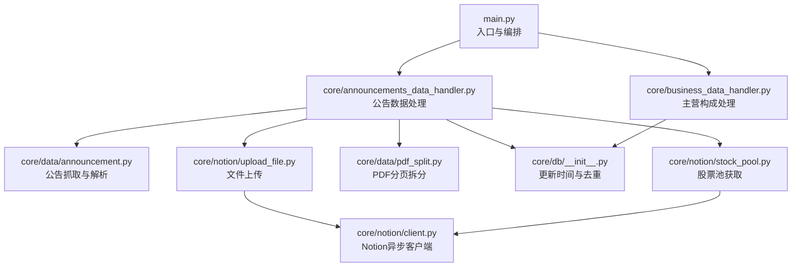
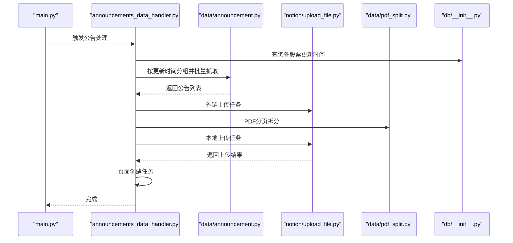
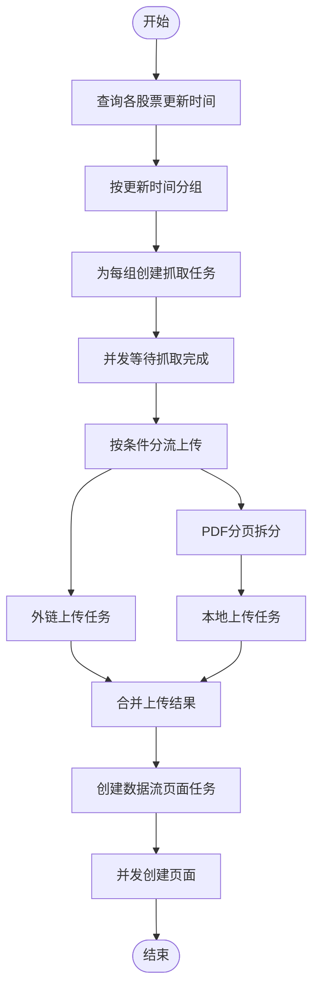
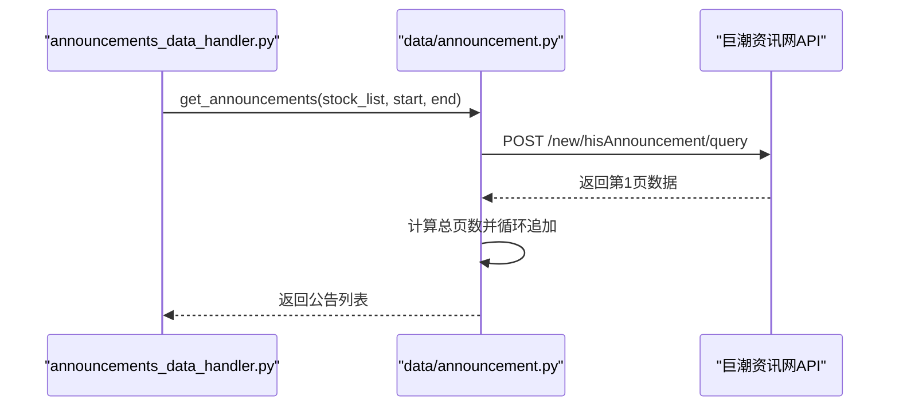
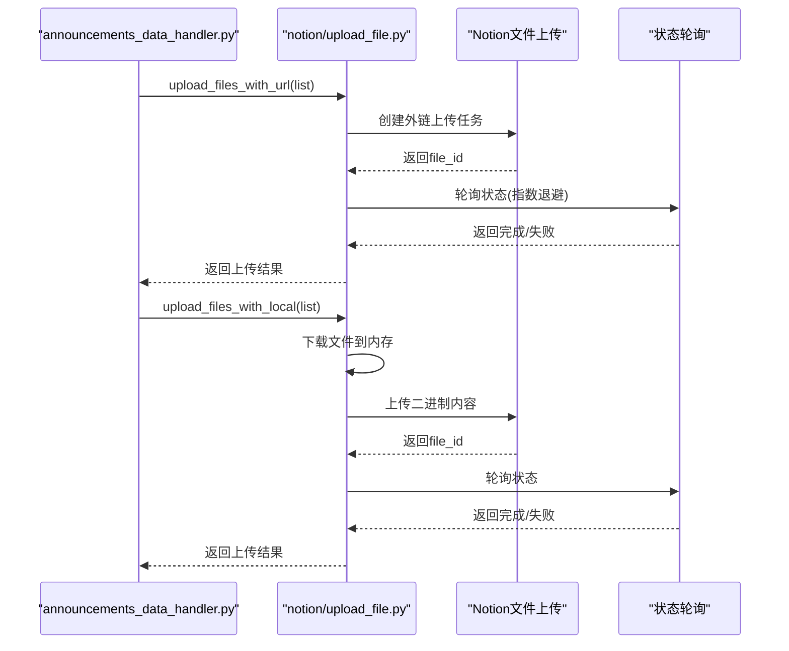
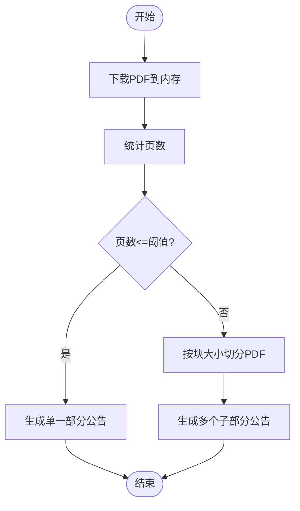
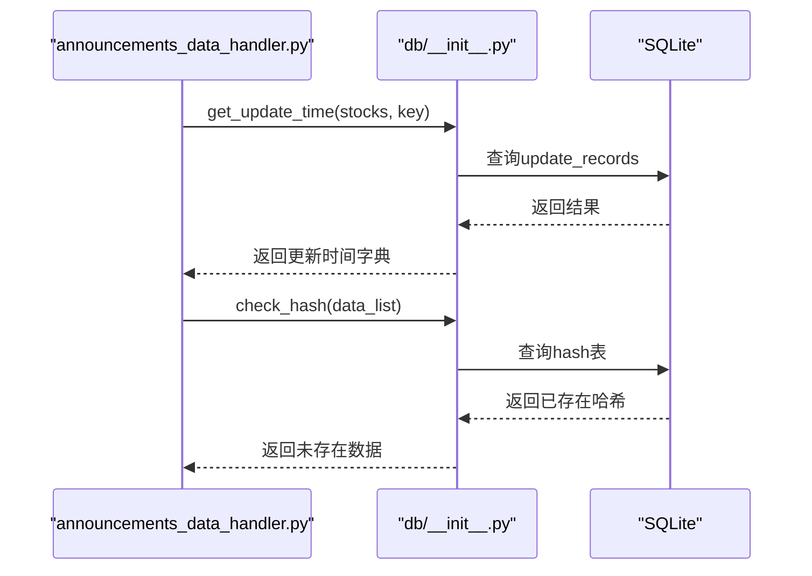
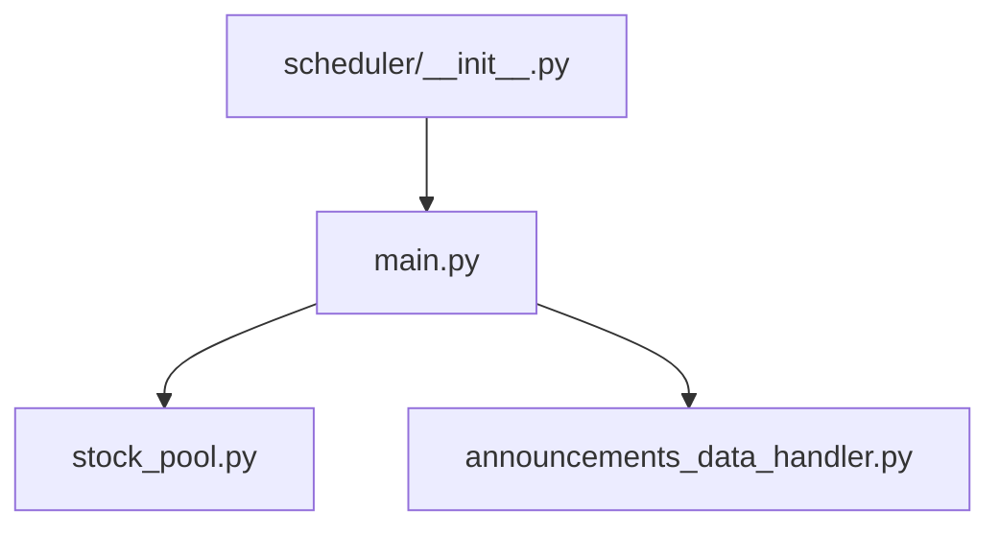
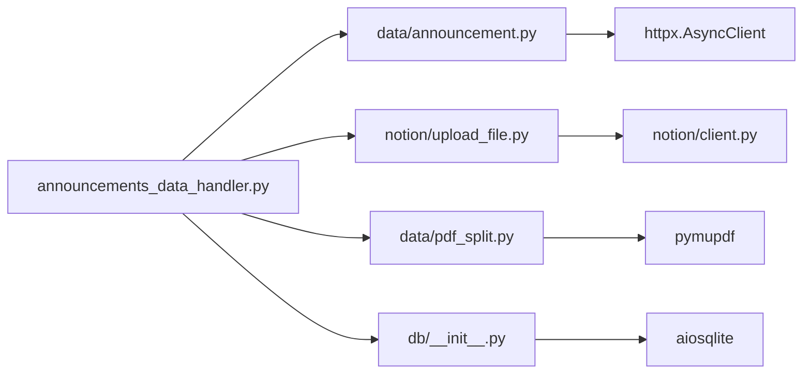

# 并发处理优化

<cite>
**本文引用的文件**
- [main.py](file://main.py)
- [announcements_data_handler.py](file://core/announcements_data_handler.py)
- [business_data_handler.py](file://core/business_data_handler.py)
- [announcement.py](file://core/data/announcement.py)
- [upload_file.py](file://core/notion/upload_file.py)
- [pdf_split.py](file://core/data/pdf_split.py)
- [db/__init__.py](file://core/db/__init__.py)
- [stock_pool.py](file://core/notion/stock_pool.py)
- [client.py](file://core/notion/client.py)
- [__init__.py](file://core/scheduler/__init__.py)
</cite>

## 目录
1. [简介](#简介)
2. [项目结构](#项目结构)
3. [核心组件](#核心组件)
4. [架构总览](#架构总览)
5. [详细组件分析](#详细组件分析)
6. [依赖关系分析](#依赖关系分析)
7. [性能考量](#性能考量)
8. [故障排查指南](#故障排查指南)
9. [结论](#结论)

## 简介
本指南聚焦于股票公告自动化系统的并发处理优化，围绕异步编程模式、任务调度与并发控制展开，系统性阐述如何通过 asyncio.create_task() 与 asyncio.gather() 实现高效并行执行；如何按更新时间对任务进行分组以减少 API 调用次数；如何在上传与分页拆分环节实现批量与并发优化；以及如何规避资源竞争、控制并发数、管理超时与实现错误恢复。同时给出 CPU 密集型与 IO 密集型任务分离策略，帮助读者在保证稳定性的同时提升吞吐。

## 项目结构
系统采用“入口驱动 + 数据层 + Notion 集成 + 数据库”分层组织，入口负责初始化与编排，数据层负责抓取与预处理，Notion 层负责上传与页面创建，数据库层负责去重与更新时间记录。

图表来源
- [main.py](file://main.py#L20-L39)
- [announcements_data_handler.py](file://core/announcements_data_handler.py#L21-L116)
- [business_data_handler.py](file://core/business_data_handler.py#L17-L67)
- [announcement.py](file://core/data/announcement.py#L36-L112)
- [upload_file.py](file://core/notion/upload_file.py#L28-L61)
- [pdf_split.py](file://core/data/pdf_split.py#L15-L73)
- [db/__init__.py](file://core/db/__init__.py#L153-L215)
- [stock_pool.py](file://core/notion/stock_pool.py#L23-L51)
- [client.py](file://core/notion/client.py#L3-L5)

章节来源
- [main.py](file://main.py#L20-L39)
- [announcements_data_handler.py](file://core/announcements_data_handler.py#L21-L116)
- [business_data_handler.py](file://core/business_data_handler.py#L17-L67)
- [announcement.py](file://core/data/announcement.py#L36-L112)
- [upload_file.py](file://core/notion/upload_file.py#L28-L61)
- [pdf_split.py](file://core/data/pdf_split.py#L15-L73)
- [db/__init__.py](file://core/db/__init__.py#L153-L215)
- [stock_pool.py](file://core/notion/stock_pool.py#L23-L51)
- [client.py](file://core/notion/client.py#L3-L5)

## 核心组件
- 入口与编排：初始化数据库、拉取股票池、触发公告处理流程。
- 公告数据处理器：按更新时间分组、批量抓取、条件分流上传、页面创建。
- 数据抓取层：基于 httpx.AsyncClient 的异步请求，支持分页迭代。
- 上传层：本地下载与外链直传两条路径，统一使用 asyncio.gather 并发聚合。
- PDF 分页拆分：CPU 密集型任务，按页数切分并生成多个子任务。
- 数据库层：维护更新时间与去重哈希，保障幂等与一致性。
- Notion 客户端：基于 AsyncClient 的异步 SDK。

章节来源
- [main.py](file://main.py#L20-L39)
- [announcements_data_handler.py](file://core/announcements_data_handler.py#L21-L116)
- [announcement.py](file://core/data/announcement.py#L36-L112)
- [upload_file.py](file://core/notion/upload_file.py#L28-L61)
- [pdf_split.py](file://core/data/pdf_split.py#L15-L73)
- [db/__init__.py](file://core/db/__init__.py#L153-L215)
- [client.py](file://core/notion/client.py#L3-L5)

## 架构总览
系统采用“分组 + 并行 + 聚合”的流水线式并发模型：
- 分组：依据更新时间对股票进行分组，减少重复 API 调用。
- 并行：使用 asyncio.create_task() 创建任务，用 asyncio.gather() 聚合等待。
- 聚合：将不同阶段的结果合并，统一推进到后续步骤。
- 资源控制：通过批量大小、轮询间隔与指数退避控制资源占用与服务端压力。

图表来源
- [main.py](file://main.py#L20-L39)
- [announcements_data_handler.py](file://core/announcements_data_handler.py#L21-L116)
- [announcement.py](file://core/data/announcement.py#L36-L112)
- [upload_file.py](file://core/notion/upload_file.py#L28-L61)
- [pdf_split.py](file://core/data/pdf_split.py#L15-L73)
- [db/__init__.py](file://core/db/__init__.py#L153-L215)

## 详细组件分析

### 组件一：公告数据处理（并发分组与批量抓取）
- 任务分组策略：按“最后更新时间”对股票进行分组，相同更新时间的股票合并为一次批量查询，显著降低 API 调用次数。
- 并行执行：使用 asyncio.create_task() 为每个分组创建抓取任务，再用 asyncio.gather() 聚合等待，统一收集结果。
- 条件分流：根据公告大小与标题关键词决定上传路径（外链直传或本地下载后上传）。
- 页面创建：为每条公告创建页面任务，同样使用 asyncio.gather() 并发推进。

图表来源
- [announcements_data_handler.py](file://core/announcements_data_handler.py#L21-L116)
- [db/__init__.py](file://core/db/__init__.py#L153-L185)

章节来源
- [announcements_data_handler.py](file://core/announcements_data_handler.py#L21-L116)
- [db/__init__.py](file://core/db/__init__.py#L153-L185)

### 组件二：公告抓取（异步HTTP与分页）
- 异步客户端：使用 httpx.AsyncClient 发送 POST 请求，支持分页迭代，动态拼装 pageNum。
- 结果过滤：剔除摘要、英文版、图文版等非目标公告，确保数据质量。
- 缓存优化：对股票映射进行缓存，避免重复网络请求。

图表来源
- [announcement.py](file://core/data/announcement.py#L36-L112)

章节来源
- [announcement.py](file://core/data/announcement.py#L36-L112)

### 组件三：文件上传（外链直传与本地上传）
- 外链直传：直接调用 Notion 文件上传接口，轮询状态直至完成。
- 本地上传：先下载文件到内存，再上传；上传后同样轮询状态。
- 并发聚合：对同一批次的文件使用 asyncio.gather() 并发等待，提高吞吐。
- 轮询与超时：指数退避策略（1,2,4,8,16），超过最大尝试次数判定超时。

图表来源
- [upload_file.py](file://core/notion/upload_file.py#L28-L61)
- [upload_file.py](file://core/notion/upload_file.py#L124-L150)
- [upload_file.py](file://core/notion/upload_file.py#L153-L176)

章节来源
- [upload_file.py](file://core/notion/upload_file.py#L28-L61)
- [upload_file.py](file://core/notion/upload_file.py#L124-L150)
- [upload_file.py](file://core/notion/upload_file.py#L153-L176)

### 组件四：PDF分页拆分（CPU密集型任务）
- 任务特征：读取 PDF、统计页数、按固定块大小切分，生成多个子任务。
- 并发策略：拆分后得到多个子任务，可在后续上传阶段再次并发执行。
- 错误处理：若拆分失败，保留原公告，避免中断整体流程。

图表来源
- [pdf_split.py](file://core/data/pdf_split.py#L15-L73)

章节来源
- [pdf_split.py](file://core/data/pdf_split.py#L15-L73)

### 组件五：数据库与去重（更新时间与哈希）
- 更新时间：按股票与键维护更新时间，用于分组与增量抓取。
- 去重：计算内容哈希，查询与保存哈希，避免重复入库。
- 并发注意：数据库操作通过异步上下文管理器与连接池化，避免阻塞事件循环。

图表来源
- [db/__init__.py](file://core/db/__init__.py#L153-L185)
- [db/__init__.py](file://core/db/__init__.py#L97-L128)

章节来源
- [db/__init__.py](file://core/db/__init__.py#L153-L185)
- [db/__init__.py](file://core/db/__init__.py#L97-L128)

### 组件六：调度与入口
- 入口：初始化数据库与股票池，触发公告处理。
- 调度：内置 APScheduler 异步调度器，可用于定时任务编排。

图表来源
- [main.py](file://main.py#L20-L39)
- [stock_pool.py](file://core/notion/stock_pool.py#L23-L51)
- [__init__.py](file://core/scheduler/__init__.py#L1-L7)

章节来源
- [main.py](file://main.py#L20-L39)
- [stock_pool.py](file://core/notion/stock_pool.py#L23-L51)
- [__init__.py](file://core/scheduler/__init__.py#L1-L7)

## 依赖关系分析
- 组件耦合：公告处理模块对数据抓取、上传、PDF拆分与数据库均有依赖，但通过异步接口解耦。
- 并发耦合点：HTTP 客户端、Notion 文件上传、PDF 拆分均可能成为瓶颈，需通过并发与批量化缓解。
- 循环依赖：未发现循环导入；模块间通过函数调用与异步协程交互。

图表来源
- [announcements_data_handler.py](file://core/announcements_data_handler.py#L7-L16)
- [announcement.py](file://core/data/announcement.py#L79-L81)
- [upload_file.py](file://core/notion/upload_file.py#L6-L7)
- [pdf_split.py](file://core/data/pdf_split.py#L4-L5)
- [db/__init__.py](file://core/db/__init__.py#L7)

章节来源
- [announcements_data_handler.py](file://core/announcements_data_handler.py#L7-L16)
- [announcement.py](file://core/data/announcement.py#L79-L81)
- [upload_file.py](file://core/notion/upload_file.py#L6-L7)
- [pdf_split.py](file://core/data/pdf_split.py#L4-L5)
- [db/__init__.py](file://core/db/__init__.py#L7)

## 性能考量
- 并发与批量化
  - 抓取阶段：按更新时间分组，合并多只股票查询，减少接口调用次数。
  - 上传阶段：对同一批次文件使用 asyncio.gather() 并发等待，提升吞吐。
  - PDF 拆分：拆分为多个子任务，可在后续上传阶段再次并发执行。
- 并发数控制
  - 建议在上传阶段引入信号量或限速器，限制同时进行的上传任务数量，避免触发 Notion 或网络限流。
  - 对于 PDF 拆分，建议按 CPU 核心数或可用内存设定并发上限，避免 OOM。
- 超时与重试
  - 轮询采用指数退避，超过最大尝试次数即判定超时，避免长时间占用事件循环。
  - 对网络请求可增加超时配置与重试策略，结合指数退避。
- 资源竞争避免
  - 数据库操作使用异步上下文管理器，确保事务提交/回滚与连接释放。
  - 文件下载与上传使用独立的 httpx.AsyncClient 实例，避免共享状态引发竞态。
- CPU 与 IO 分离
  - IO 密集型：HTTP 请求、文件下载、Notion 上传、数据库查询。
  - CPU 密集型：PDF 拆分、哈希计算。建议将 CPU 密集型任务放入进程池（如 concurrent.futures.ProcessPoolExecutor）以避免阻塞事件循环。

## 故障排查指南
- 上传失败
  - 现象：状态轮询最终失败或超时。
  - 排查：检查外链有效性、文件大小限制、Notion 导入队列状态；查看错误日志中的具体错误信息。
  - 处理：对失败任务单独重试，必要时切换为本地上传路径。
- PDF 拆分异常
  - 现象：拆分失败保留原公告。
  - 排查：确认 PDF 内容可读、页数统计正确、内存充足。
  - 处理：缩小块大小或降低并发，避免内存压力。
- 数据库锁与事务
  - 现象：并发写入导致锁等待或事务冲突。
  - 排查：检查事务边界与提交/回滚逻辑。
  - 处理：减少单次批量写入规模，或在高并发场景下引入重试与退避。
- 超时与限流
  - 现象：请求超时或被服务端限流。
  - 排查：检查请求头、超时配置与重试策略。
  - 处理：增加超时时间、降低并发、启用指数退避与熔断。

章节来源
- [upload_file.py](file://core/notion/upload_file.py#L153-L176)
- [pdf_split.py](file://core/data/pdf_split.py#L68-L73)
- [db/__init__.py](file://core/db/__init__.py#L28-L51)

## 结论
本系统通过“按更新时间分组 + 并行抓取 + 条件分流上传 + 页面创建”的流水线并发模型，在保证稳定性的同时显著提升了吞吐。建议在现有基础上进一步引入并发数控制、超时与重试策略、CPU 与 IO 任务分离（尤其是 PDF 拆分与哈希计算），并在生产环境中配合调度器实现定时与弹性扩缩容，从而获得更稳健的性能表现。