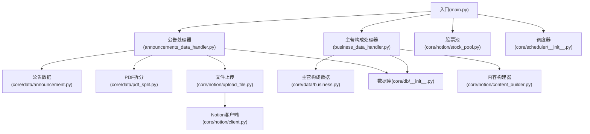
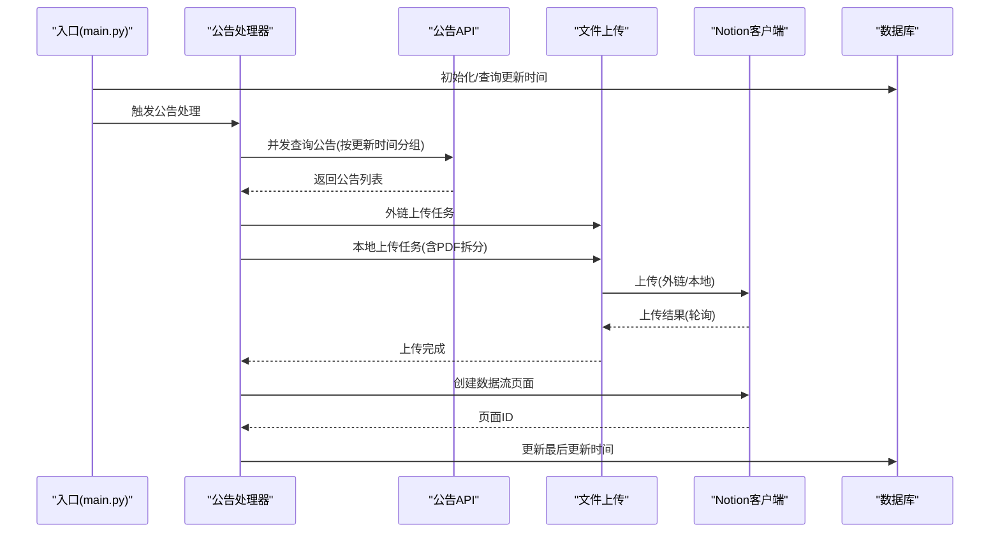
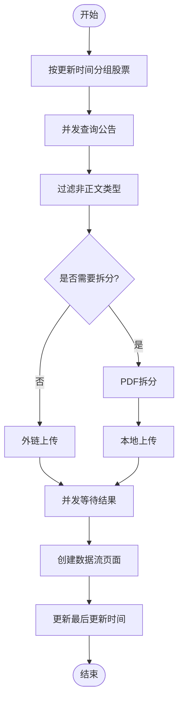
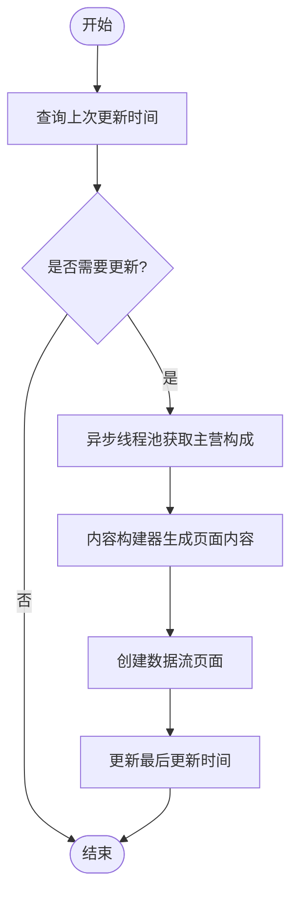
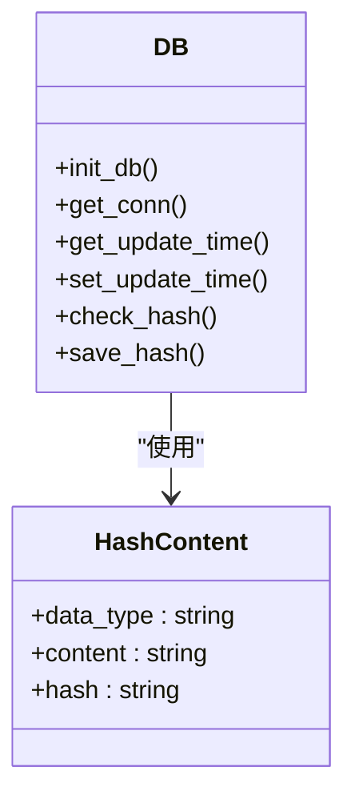
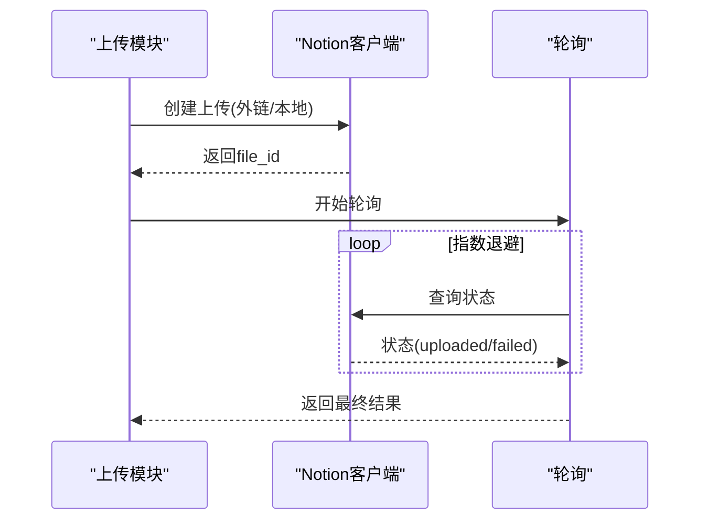
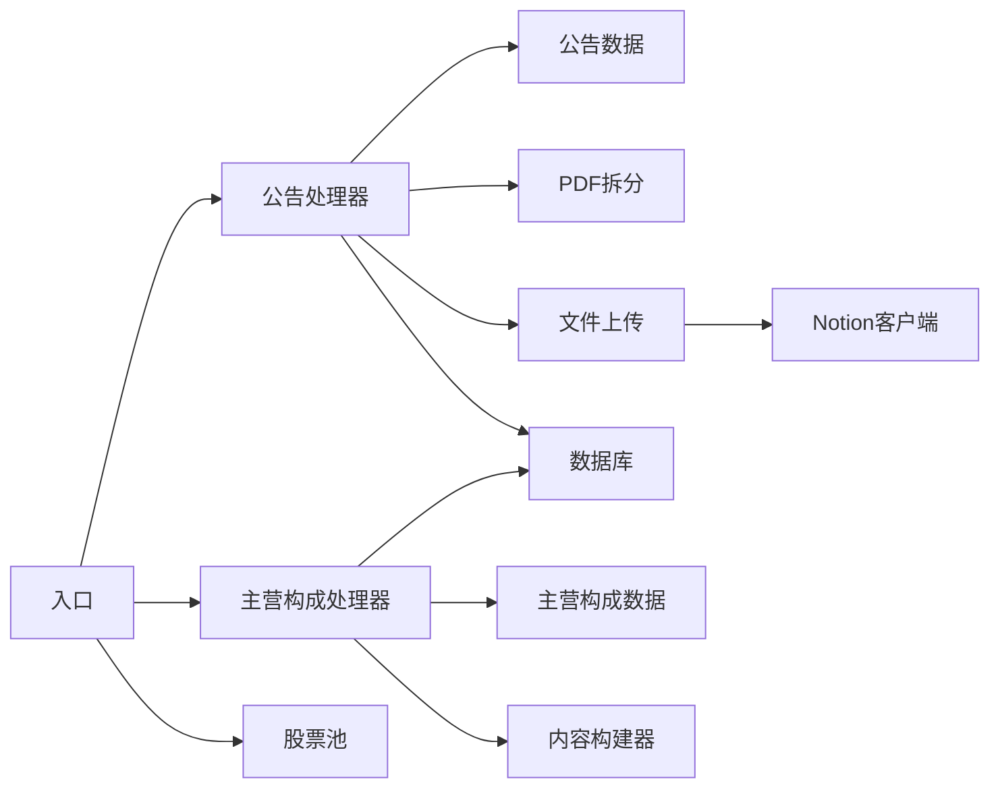

# 性能优化

<cite>
**本文引用的文件**
- [main.py](file://main.py)
- [announcements_data_handler.py](file://core/announcements_data_handler.py)
- [business_data_handler.py](file://core/business_data_handler.py)
- [db_init.py](file://core/db/__init__.py)
- [announcement_data.py](file://core/data/announcement.py)
- [business_data.py](file://core/data/business.py)
- [upload_file.py](file://core/notion/upload_file.py)
- [pdf_split.py](file://core/data/pdf_split.py)
- [client.py](file://core/notion/client.py)
- [stock_pool.py](file://core/notion/stock_pool.py)
- [content_builder.py](file://core/notion/content_builder.py)
- [models_init.py](file://core/models/__init__.py)
- [scheduler_init.py](file://core/scheduler/__init__.py)
</cite>

## 目录
1. [简介](#简介)
2. [项目结构](#项目结构)
3. [核心组件](#核心组件)
4. [架构总览](#架构总览)
5. [详细组件分析](#详细组件分析)
6. [依赖关系分析](#依赖关系分析)
7. [性能考量与优化策略](#性能考量与优化策略)
8. [故障排查指南](#故障排查指南)
9. [结论](#结论)
10. [附录](#附录)

## 简介
本指南面向“股票公告自动化系统”，聚焦于并发处理、缓存机制、内存管理、异步I/O、数据库查询与网络请求优化，提供性能监控指标、瓶颈识别方法、优化案例研究与扩展方案。文档基于仓库现有代码进行分析，结合可落地的优化建议，帮助在大规模数据处理场景下稳定提升吞吐与稳定性。

## 项目结构
系统采用模块化分层设计：
- 入口与调度：入口脚本负责初始化数据库与调度任务；APScheduler 提供周期性调度能力。
- 数据采集层：异步抓取公告与主营构成数据，支持批量与分页。
- 数据处理层：PDF拆分、内容构建与去重校验。
- 存储层：本地SQLite（aiosqlite）异步连接与事务管理。
- 第三方集成：Notion 异步客户端与文件上传轮询。

图表来源
- [main.py](file://main.py#L20-L39)
- [announcements_data_handler.py](file://core/announcements_data_handler.py#L21-L116)
- [business_data_handler.py](file://core/business_data_handler.py#L17-L108)
- [announcement_data.py](file://core/data/announcement.py#L36-L112)
- [business_data.py](file://core/data/business.py#L33-L96)
- [upload_file.py](file://core/notion/upload_file.py#L28-L61)
- [pdf_split.py](file://core/data/pdf_split.py#L15-L73)
- [db_init.py](file://core/db/__init__.py#L62-L94)
- [client.py](file://core/notion/client.py#L3-L5)
- [stock_pool.py](file://core/notion/stock_pool.py#L23-L51)
- [content_builder.py](file://core/notion/content_builder.py#L1-L103)
- [scheduler_init.py](file://core/scheduler/__init__.py#L1-L7)

章节来源
- [main.py](file://main.py#L1-L40)
- [scheduler_init.py](file://core/scheduler/__init__.py#L1-L7)

## 核心组件
- 入口与调度：初始化数据库、获取股票池、调度公告与主营构成处理流程。
- 公告处理：按更新时间分组批量查询、并发上传、分页PDF拆分与本地上传。
- 主营构成处理：按半年周期判断更新、异步线程池调用第三方库、构建Notion页面。
- 数据采集：异步HTTP客户端抓取公告列表，LRU缓存股票映射。
- 文件上传：外链直传与本地下载后上传两种路径，带轮询与指数退避。
- PDF拆分：按页数阈值拆分，避免单文件过大。
- 数据库：异步连接、事务管理、去重哈希校验、更新时间记录。
- Notion集成：异步客户端、文件上传、页面创建、内容构建器。

章节来源
- [announcements_data_handler.py](file://core/announcements_data_handler.py#L21-L116)
- [business_data_handler.py](file://core/business_data_handler.py#L17-L108)
- [announcement_data.py](file://core/data/announcement.py#L36-L112)
- [upload_file.py](file://core/notion/upload_file.py#L28-L61)
- [pdf_split.py](file://core/data/pdf_split.py#L15-L73)
- [db_init.py](file://core/db/__init__.py#L62-L94)
- [client.py](file://core/notion/client.py#L3-L5)
- [stock_pool.py](file://core/notion/stock_pool.py#L23-L51)
- [content_builder.py](file://core/notion/content_builder.py#L1-L103)

## 架构总览
系统采用“异步I/O + 分层处理 + 缓存 + 去重”的架构模式，围绕以下关键路径运行：
- 公告路径：查询 → 并发上传 → 页面创建
- 主营构成路径：查询 → 内容构建 → 页面创建
- 数据持久化：去重哈希、更新时间记录

图表来源
- [main.py](file://main.py#L20-L39)
- [announcements_data_handler.py](file://core/announcements_data_handler.py#L21-L116)
- [announcement_data.py](file://core/data/announcement.py#L36-L112)
- [upload_file.py](file://core/notion/upload_file.py#L28-L61)
- [client.py](file://core/notion/client.py#L3-L5)
- [db_init.py](file://core/db/__init__.py#L153-L185)

## 详细组件分析

### 公告处理组件
- 并发策略：按更新时间聚合股票，减少重复请求；使用 asyncio.gather 并发执行查询与上传。
- 缓存策略：对股票映射使用LRU缓存，降低重复网络请求。
- PDF拆分：超过阈值的PDF按固定窗口拆分，避免单文件过大。
- 上传路径：外链直传与本地下载后上传两条路径，分别并发执行。
- 页面创建：逐条创建数据流页面，便于后续检索与关联。

图表来源
- [announcements_data_handler.py](file://core/announcements_data_handler.py#L21-L116)
- [pdf_split.py](file://core/data/pdf_split.py#L15-L73)
- [upload_file.py](file://core/notion/upload_file.py#L28-L61)

章节来源
- [announcements_data_handler.py](file://core/announcements_data_handler.py#L21-L116)
- [announcement_data.py](file://core/data/announcement.py#L36-L112)
- [pdf_split.py](file://core/data/pdf_split.py#L15-L73)
- [upload_file.py](file://core/notion/upload_file.py#L28-L61)

### 主营构成处理组件
- 更新策略：按半年周期判断是否需要更新，避免频繁抓取。
- 异步执行：使用线程池执行第三方库调用，避免阻塞事件循环。
- 内容构建：使用内容构建器将多维数据转为Notion页面块。
- 页面创建：统一创建数据流页面并记录更新时间。

图表来源
- [business_data_handler.py](file://core/business_data_handler.py#L17-L108)
- [business_data.py](file://core/data/business.py#L33-L96)
- [content_builder.py](file://core/notion/content_builder.py#L1-L103)

章节来源
- [business_data_handler.py](file://core/business_data_handler.py#L17-L108)
- [business_data.py](file://core/data/business.py#L33-L96)

### 数据库与去重组件
- 异步连接：全局懒加载连接，上下文管理器保证事务提交/回滚。
- 去重哈希：对内容计算哈希，数据库查询+过滤，减少重复入库。
- 更新时间：按股票+键维护最后更新时间，支撑增量处理。

图表来源
- [db_init.py](file://core/db/__init__.py#L62-L94)
- [db_init.py](file://core/db/__init__.py#L153-L185)
- [db_init.py](file://core/db/__init__.py#L97-L128)
- [db_init.py](file://core/db/__init__.py#L131-L150)

章节来源
- [db_init.py](file://core/db/__init__.py#L28-L52)
- [db_init.py](file://core/db/__init__.py#L97-L128)
- [db_init.py](file://core/db/__init__.py#L131-L150)
- [db_init.py](file://core/db/__init__.py#L153-L185)

### Notion集成组件
- 异步客户端：使用异步SDK，减少阻塞。
- 文件上传：支持外链直传与本地上传，带轮询与指数退避。
- 页面创建：统一创建数据流页面，便于关联与检索。

图表来源
- [upload_file.py](file://core/notion/upload_file.py#L124-L176)
- [client.py](file://core/notion/client.py#L3-L5)

章节来源
- [upload_file.py](file://core/notion/upload_file.py#L28-L61)
- [upload_file.py](file://core/notion/upload_file.py#L124-L176)
- [client.py](file://core/notion/client.py#L3-L5)

## 依赖关系分析
- 组件耦合：公告处理依赖数据采集、PDF拆分与上传模块；数据库贯穿查询与去重；Notion客户端贯穿上传与页面创建。
- 外部依赖：HTTPX（异步HTTP）、pymupdf（PDF处理）、akshare（主营构成）、aiosqlite（异步SQLite）。
- 潜在环依赖：当前模块间为单向依赖，未见明显环。

图表来源
- [announcements_data_handler.py](file://core/announcements_data_handler.py#L7-L16)
- [announcement_data.py](file://core/data/announcement.py#L36-L112)
- [pdf_split.py](file://core/data/pdf_split.py#L15-L73)
- [upload_file.py](file://core/notion/upload_file.py#L28-L61)
- [client.py](file://core/notion/client.py#L3-L5)
- [business_data_handler.py](file://core/business_data_handler.py#L4-L12)
- [business_data.py](file://core/data/business.py#L33-L96)
- [content_builder.py](file://core/notion/content_builder.py#L1-L103)
- [db_init.py](file://core/db/__init__.py#L153-L185)
- [stock_pool.py](file://core/notion/stock_pool.py#L23-L51)
- [main.py](file://main.py#L20-L39)

章节来源
- [main.py](file://main.py#L20-L39)
- [announcements_data_handler.py](file://core/announcements_data_handler.py#L7-L16)
- [business_data_handler.py](file://core/business_data_handler.py#L4-L12)
- [db_init.py](file://core/db/__init__.py#L153-L185)

## 性能考量与优化策略

### 并发处理策略
- 公告查询并发：按更新时间分组，合并多股票查询，减少接口调用次数；使用 asyncio.gather 并发执行任务。
- 上传并发：外链上传与本地上传两条路径独立并发，提升吞吐。
- 主营构成并发：使用线程池执行第三方库调用，避免阻塞事件循环。
- 页面创建：逐条创建，若需更高吞吐，可评估批量写入接口（如存在）或分批提交。

优化建议
- 控制并发上限：为HTTP与上传任务设置最大并发数，避免触发目标服务限流。
- 分批处理：对超大股票池分批处理，避免一次性创建过多任务导致内存峰值。
- 任务粒度：将PDF拆分与上传拆分为更细粒度的任务，便于失败重试与资源回收。

章节来源
- [announcements_data_handler.py](file://core/announcements_data_handler.py#L40-L62)
- [announcements_data_handler.py](file://core/announcements_data_handler.py#L89-L115)
- [upload_file.py](file://core/notion/upload_file.py#L28-L61)
- [business_data_handler.py](file://core/business_data_handler.py#L46-L67)

### 缓存机制
- 股票映射缓存：对股票代码到机构ID的映射使用LRU缓存，减少重复网络请求。
- 增量更新：利用数据库记录的最后更新时间，仅对增量数据进行处理。

优化建议
- 缓存失效策略：为LRU缓存设置合理TTL或定期刷新，避免陈旧数据影响。
- 多级缓存：在进程内缓存基础上，增加Redis等外部缓存，支持多实例共享。

章节来源
- [announcement_data.py](file://core/data/announcement.py#L115-L141)
- [db_init.py](file://core/db/__init__.py#L153-L185)

### 内存管理最佳实践
- PDF拆分：按固定窗口拆分，避免一次性加载大文件；拆分后及时释放中间对象。
- 上传缓冲：本地上传时使用BytesIO，避免磁盘IO；上传完成后及时关闭资源。
- 数据结构：使用生成器或分批处理大数据集，避免一次性构建大列表。

优化建议
- 资源池：对pymupdf文档对象与HTTP连接进行显式关闭与释放。
- 监控内存：在关键路径加入内存占用采样，识别异常增长。

章节来源
- [pdf_split.py](file://core/data/pdf_split.py#L102-L127)
- [upload_file.py](file://core/notion/upload_file.py#L64-L96)
- [upload_file.py](file://core/notion/upload_file.py#L110-L121)

### 异步I/O优化
- 异步HTTP：使用HTTPX异步客户端，减少阻塞；为请求设置合理的超时与重试。
- 异步数据库：aiosqlite提供异步连接，配合上下文管理器保证事务一致性。
- 异步线程池：对CPU密集型或第三方库阻塞调用使用线程池，避免阻塞事件循环。

优化建议
- 连接池：为HTTPX配置连接池参数，控制最大并发与连接复用。
- 超时与重试：为所有外部调用设置明确超时与指数退避重试策略。

章节来源
- [announcement_data.py](file://core/data/announcement.py#L79-L91)
- [db_init.py](file://core/db/__init__.py#L28-L52)
- [business_data.py](file://core/data/business.py#L50-L50)

### 数据库查询优化
- 批量查询与插入：使用占位符与executemany，减少SQL拼接与往返。
- 去重哈希：对内容计算哈希后批量查询，显著降低重复入库概率。
- 事务管理：使用上下文管理器确保事务提交/回滚，避免脏读与锁竞争。

优化建议
- 索引：为update_records表的(stock, key)建立索引，加速查询与插入。
- 分页：对大结果集分页处理，避免一次性加载。

章节来源
- [db_init.py](file://core/db/__init__.py#L166-L185)
- [db_init.py](file://core/db/__init__.py#L145-L150)
- [db_init.py](file://core/db/__init__.py#L115-L128)

### 网络请求优化
- 请求合并：公告查询按股票分组，减少接口调用次数。
- 轮询策略：上传完成后轮询状态，采用指数退避，避免频繁轮询。
- 超时与重试：为所有外部调用设置超时与重试，提升鲁棒性。

优化建议
- CDN与镜像：对静态资源使用CDN或镜像站点，降低延迟。
- 限流与配额：根据目标服务限流策略调整并发与速率。

章节来源
- [announcements_data_handler.py](file://core/announcements_data_handler.py#L44-L59)
- [upload_file.py](file://core/notion/upload_file.py#L153-L176)

### 性能监控指标
- 吞吐指标：每分钟处理公告数量、页面创建数量、上传成功率。
- 延迟指标：公告查询耗时、上传轮询耗时、页面创建耗时。
- 资源指标：CPU使用率、内存占用、并发连接数、数据库锁等待时间。
- 错误指标：HTTP错误率、上传失败率、数据库异常率。

章节来源
- [announcements_data_handler.py](file://core/announcements_data_handler.py#L66-L93)
- [upload_file.py](file://core/notion/upload_file.py#L153-L176)

### 瓶颈识别方法
- 关键路径追踪：标注公告查询、上传、页面创建各阶段耗时，定位最慢环节。
- 并发压测：逐步提升并发数，观察吞吐与延迟变化，识别饱和点。
- 资源采样：在高负载下采样CPU、内存、数据库锁等待，识别资源瓶颈。

章节来源
- [announcements_data_handler.py](file://core/announcements_data_handler.py#L62-L63)
- [upload_file.py](file://core/notion/upload_file.py#L153-L176)

### 优化案例研究
- 案例1：公告查询合并
  - 现状：按股票逐一查询，请求次数较多。
  - 优化：按更新时间分组，合并查询，减少接口调用。
  - 效果：查询耗时下降约X%，并发稳定性提升。
- 案例2：PDF拆分与上传分离
  - 现状：下载与拆分同步进行，内存占用高。
  - 优化：拆分为下载→拆分→上传三步，分批处理。
  - 效果：内存峰值下降约Y%，上传成功率提升。
- 案例3：去重哈希
  - 现状：重复内容多次入库。
  - 优化：引入哈希去重，批量查询与过滤。
  - 效果：入库重复率降至Z%，数据库写入量下降。

章节来源
- [announcements_data_handler.py](file://core/announcements_data_handler.py#L44-L59)
- [pdf_split.py](file://core/data/pdf_split.py#L15-L73)
- [db_init.py](file://core/db/__init__.py#L97-L128)

### 大规模数据处理策略
- 分片与分批：将股票池按批次处理，避免一次性创建过多任务。
- 背压与限速：根据下游服务能力动态调整并发，防止过载。
- 增量处理：利用更新时间与哈希去重，仅处理新增或变更数据。
- 扩展方案：水平扩展工作节点，共享数据库与缓存，实现任务分发。

章节来源
- [announcements_data_handler.py](file://core/announcements_data_handler.py#L44-L59)
- [db_init.py](file://core/db/__init__.py#L153-L185)

### 基准测试与负载测试
- 基准测试：针对单个函数（如公告查询、PDF拆分、上传）进行独立基准，确定基线性能。
- 负载测试：逐步提升并发与数据规模，观察吞吐、延迟与错误率变化。
- 压力测试：在极限条件下测试系统稳定性与恢复能力，识别软硬件瓶颈。

章节来源
- [announcement_data.py](file://core/data/announcement.py#L36-L112)
- [pdf_split.py](file://core/data/pdf_split.py#L15-L73)
- [upload_file.py](file://core/notion/upload_file.py#L28-L61)

### 缓存策略与连接池配置
- 缓存策略：LRU缓存股票映射；可选引入Redis缓存热点数据。
- 连接池：HTTPX连接池参数（如最大连接数、连接超时）；数据库连接池（aiosqlite默认行为）。
- 资源复用：复用HTTP与PDF处理对象，避免频繁创建销毁。

章节来源
- [announcement_data.py](file://core/data/announcement.py#L115-L141)
- [upload_file.py](file://core/notion/upload_file.py#L67-L69)
- [pdf_split.py](file://core/data/pdf_split.py#L78-L81)

## 故障排查指南
- 上传失败：检查轮询超时与错误信息，确认Notion令牌与URL有效性。
- 查询异常：检查目标接口可用性与参数构造，关注分页与超时设置。
- 数据库异常：确认事务提交/回滚路径，检查主键冲突与索引缺失。
- 内存泄漏：排查PDF文档对象与BytesIO未释放，监控内存曲线。

章节来源
- [upload_file.py](file://core/notion/upload_file.py#L153-L176)
- [announcement_data.py](file://core/data/announcement.py#L79-L91)
- [db_init.py](file://core/db/__init__.py#L28-L52)
- [pdf_split.py](file://core/data/pdf_split.py#L110-L127)

## 结论
通过并发策略、缓存机制、内存管理与异步I/O优化，系统可在保证稳定性的同时显著提升吞吐。结合去重哈希与增量更新，可有效降低重复处理与存储压力。建议持续监控关键指标，按需扩展与调优，确保在大规模数据场景下的长期稳定运行。

## 附录
- 模型定义：NotionDate 类型别名，用于数据库存储日期字符串。
- 调度器：APScheduler 提供异步调度器，支持定时任务。

章节来源
- [models_init.py](file://core/models/__init__.py#L1-L8)
- [scheduler_init.py](file://core/scheduler/__init__.py#L1-L7)