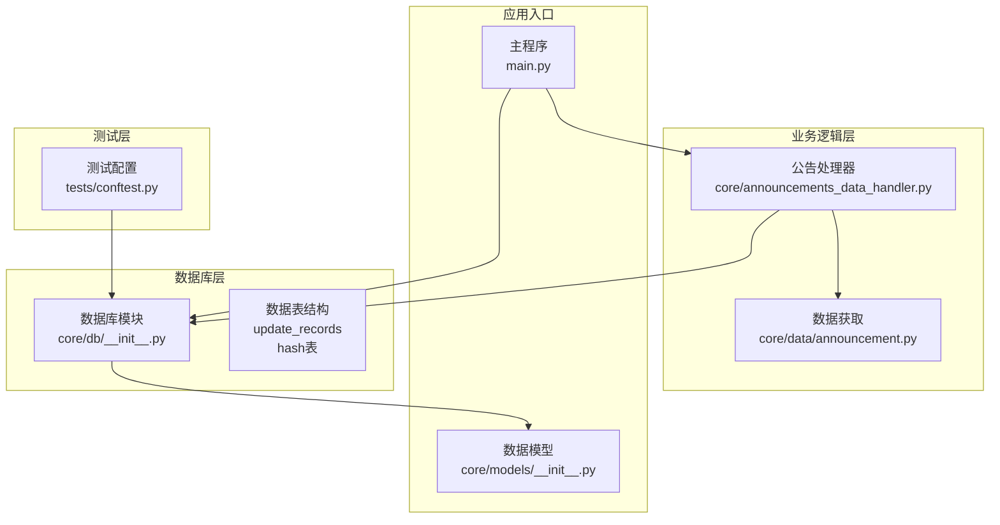
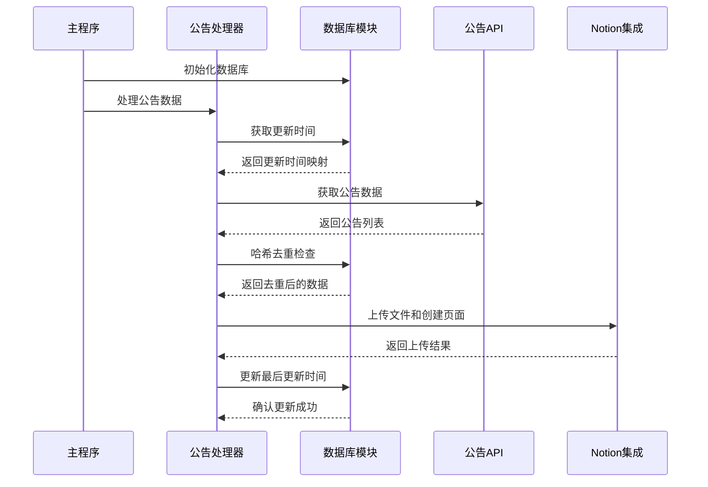
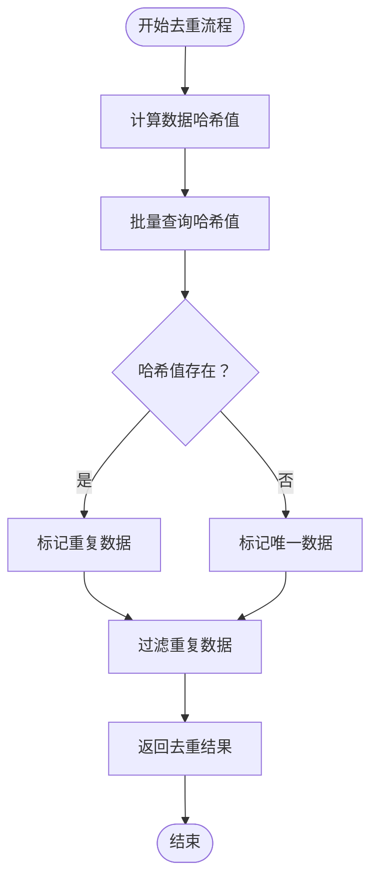
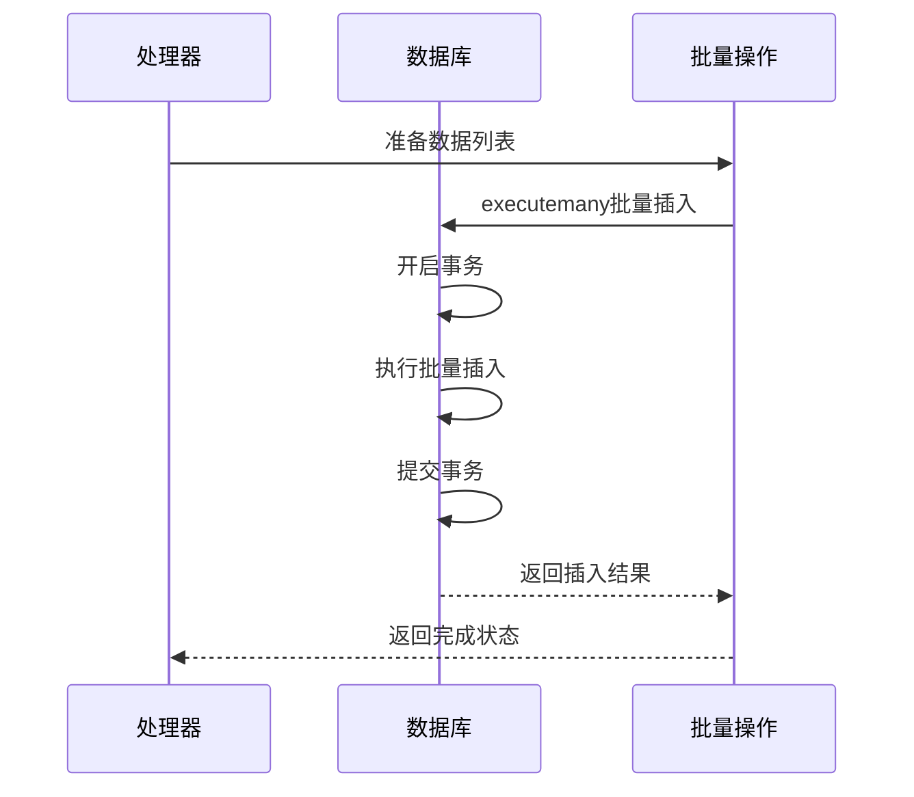
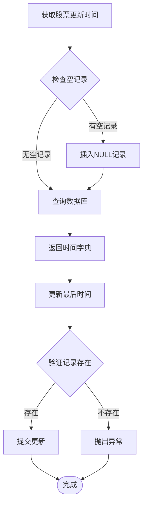
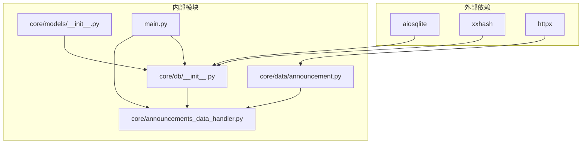

# 数据库查询优化

<cite>
**本文档引用的文件**
- [core/db/__init__.py](file://core/db/__init__.py)
- [core/models/__init__.py](file://core/models/__init__.py)
- [core/data/announcement.py](file://core/data/announcement.py)
- [core/announcements_data_handler.py](file://core/announcements_data_handler.py)
- [main.py](file://main.py)
- [tests/conftest.py](file://tests/conftest.py)
</cite>

## 目录
1. [简介](#简介)
2. [项目结构](#项目结构)
3. [核心组件](#核心组件)
4. [架构概览](#架构概览)
5. [详细组件分析](#详细组件分析)
6. [依赖关系分析](#依赖关系分析)
7. [性能考虑](#性能考虑)
8. [故障排除指南](#故障排除指南)
9. [结论](#结论)

## 简介

本指南针对股票公告自动化系统中的SQLite数据库查询优化进行全面分析。该系统采用异步编程模型，使用aiosqlite库处理数据库操作，通过哈希索引实现数据去重，通过批量插入优化提升性能。本文档详细说明了SQLite查询性能优化、索引设计、事务管理策略、批量插入优化、查询计划分析、慢查询识别方法，以及数据库连接池配置、并发访问控制和锁优化等关键技术。

## 项目结构

该系统采用模块化架构，数据库相关功能集中在core/db模块中，主要包含以下组件：



**图表来源**
- [core/db/__init__.py](file://core/db/__init__.py#L1-L218)
- [core/announcements_data_handler.py](file://core/announcements_data_handler.py#L1-L116)
- [core/data/announcement.py](file://core/data/announcement.py#L1-L141)
- [main.py](file://main.py#L1-L40)

**章节来源**
- [core/db/__init__.py](file://core/db/__init__.py#L1-L218)
- [main.py](file://main.py#L1-L40)

## 核心组件

### 数据库连接管理

系统使用异步上下文管理器管理数据库连接，确保连接的生命周期得到正确管理：

- **连接池机制**：全局单例连接，避免频繁创建连接的开销
- **事务管理**：自动提交和回滚，确保数据一致性
- **异常处理**：捕获异常时自动回滚事务

### 数据去重机制

系统采用哈希索引实现高效的数据去重：

- **哈希计算**：使用xxhash算法计算数据内容的哈希值
- **索引设计**：hash表的hash字段作为主键，提供O(1)查找性能
- **批量处理**：支持批量哈希计算和查询

### 更新时间跟踪

系统维护股票公告的更新时间，实现增量同步：

- **复合主键**：(stock, key)确保每只股票每种数据类型的唯一性
- **智能初始化**：为空记录插入NULL值，便于后续更新
- **时间范围查询**：支持按时间范围获取公告数据

**章节来源**
- [core/db/__init__.py](file://core/db/__init__.py#L28-L217)
- [core/models/__init__.py](file://core/models/__init__.py#L1-L8)

## 架构概览

系统采用分层架构，数据库层提供数据持久化服务，业务层处理具体的业务逻辑：



**图表来源**
- [main.py](file://main.py#L20-L36)
- [core/announcements_data_handler.py](file://core/announcements_data_handler.py#L21-L116)
- [core/db/__init__.py](file://core/db/__init__.py#L153-L215)

## 详细组件分析

### 数据库连接管理器

数据库连接管理器是整个系统的核心组件，负责连接的生命周期管理和事务控制：

```mermaid
classDiagram
class DatabaseManager {
-db : Connection
-db_path : str
+get_conn() AsyncContextManager
+init_db() void
-_get_db() Connection
}
class HashContent {
+data_type : str
+content : str
+hash : str
}
class KEYS {
<<literal>>
"business"
"announcements"
}
DatabaseManager --> HashContent : uses
DatabaseManager --> KEYS : uses
```

**图表来源**
- [core/db/__init__.py](file://core/db/__init__.py#L28-L59)
- [core/db/__init__.py](file://core/db/__init__.py#L19-L23)
- [core/db/__init__.py](file://core/db/__init__.py#L15-L16)

#### 连接管理策略

系统采用单例模式管理数据库连接，避免频繁创建连接的开销：

- **延迟初始化**：首次使用时才创建连接
- **全局共享**：所有操作共享同一个连接实例
- **自动清理**：程序退出时自动关闭连接

#### 事务管理机制

系统实现了完善的事务管理机制：

- **自动提交**：正常情况下自动提交事务
- **异常回滚**：发生异常时自动回滚事务
- **上下文管理**：确保资源正确释放

**章节来源**
- [core/db/__init__.py](file://core/db/__init__.py#L28-L59)

### 哈希去重算法

系统实现了高效的哈希去重算法，通过哈希索引实现O(1)级别的查找性能：



**图表来源**
- [core/db/__init__.py](file://core/db/__init__.py#L97-L128)

#### 哈希计算优化

- **内容标准化**：使用JSON序列化并排序键值，确保相同内容产生相同哈希
- **编码处理**：使用UTF-8编码确保跨平台一致性
- **算法选择**：采用xxhash算法，提供高性能的哈希计算

#### 批量查询优化

- **IN子句优化**：动态生成IN子句，支持批量查询
- **占位符管理**：根据数据量动态生成占位符
- **集合转换**：将查询结果转换为集合，提高查找效率

**章节来源**
- [core/db/__init__.py](file://core/db/__init__.py#L97-L128)

### 批量插入优化

系统实现了高效的批量插入机制，通过executemany方法提升插入性能：



**图表来源**
- [core/db/__init__.py](file://core/db/__init__.py#L145-L150)

#### 批量操作策略

- **executemany方法**：使用SQLite原生批量插入支持
- **事务封装**：将多个插入操作封装在一个事务中
- **数据预处理**：在Python层面预处理数据，减少数据库往返

#### 性能优化技巧

- **参数绑定**：使用参数绑定防止SQL注入
- **批量大小**：根据数据量调整批量大小
- **内存管理**：及时释放中间数据，避免内存泄漏

**章节来源**
- [core/db/__init__.py](file://core/db/__init__.py#L131-L150)

### 更新时间管理

系统实现了智能的更新时间管理机制，支持增量同步：



**图表来源**
- [core/db/__init__.py](file://core/db/__init__.py#L153-L215)

#### 时间跟踪策略

- **智能初始化**：为空记录插入NULL值，便于后续更新
- **类型安全**：使用NotionDate类型确保时间格式一致性
- **错误处理**：严格验证记录存在性，防止业务逻辑错误

#### 增量同步机制

- **分组处理**：按最后更新时间分组，优化查询性能
- **时间范围限制**：避免查询过大的时间范围
- **缓存利用**：利用数据库索引加速查询

**章节来源**
- [core/db/__init__.py](file://core/db/__init__.py#L153-L215)
- [core/models/__init__.py](file://core/models/__init__.py#L1-L8)

## 依赖关系分析

系统各组件之间的依赖关系清晰明确，遵循单一职责原则：



**图表来源**
- [core/db/__init__.py](file://core/db/__init__.py#L1-L10)
- [core/data/announcement.py](file://core/data/announcement.py#L1-L8)
- [core/announcements_data_handler.py](file://core/announcements_data_handler.py#L1-L16)

### 外部依赖分析

- **aiosqlite**：提供异步SQLite数据库访问能力
- **xxhash**：提供高性能的哈希计算算法
- **httpx**：提供异步HTTP客户端功能

### 内部模块耦合

- **低耦合设计**：各模块职责明确，相互独立
- **接口清晰**：模块间通过明确定义的接口交互
- **数据流向**：数据从API层流向处理器，最终到达数据库

**章节来源**
- [core/db/__init__.py](file://core/db/__init__.py#L1-L10)
- [core/data/announcement.py](file://core/data/announcement.py#L1-L8)

## 性能考虑

### SQLite查询优化策略

#### 索引设计优化

基于系统现有的表结构，建议的索引优化方案：

1. **复合索引优化**
   - `update_records`表：`(key, stock)`复合索引，支持按键值快速查找特定股票
   - `hash`表：当前已使用主键索引，性能良好

2. **查询条件优化**
   - 利用现有主键索引进行精确匹配
   - 避免在WHERE子句中对索引列进行函数操作

#### 批量操作优化

- **executemany使用**：系统已正确使用executemany进行批量插入
- **事务管理**：将多个操作封装在单个事务中
- **参数绑定**：使用参数绑定防止SQL注入和提升性能

#### 内存管理优化

- **生成器模式**：对于大量数据处理，考虑使用生成器减少内存占用
- **分批处理**：大数据集分批处理，避免内存溢出

### 并发访问控制

#### 锁优化策略

- **读写分离**：查询操作和写入操作分离，减少锁竞争
- **短事务原则**：保持事务尽可能短，减少锁持有时间
- **死锁预防**：统一事务执行顺序，避免循环等待

#### 连接池配置

虽然系统使用单例连接，但可以考虑以下优化：

- **连接复用**：当前实现已实现连接复用
- **超时设置**：为连接设置合理的超时时间
- **健康检查**：定期检查连接可用性

### 缓存策略

#### 查询缓存

- **哈希缓存**：系统已实现基于哈希的去重缓存
- **时间缓存**：更新时间查询结果可以缓存
- **配置缓存**：股票代码映射可以缓存

#### 应用层缓存

- **LRU缓存**：使用functools.lru_cache装饰器缓存API响应
- **内存缓存**：对于频繁访问的数据使用内存缓存

### 性能监控

#### 慢查询识别

- **查询时间统计**：记录关键查询的执行时间
- **批量操作监控**：监控批量插入和查询的性能
- **内存使用监控**：监控内存使用情况，避免泄漏

#### 性能指标

- **QPS统计**：查询每秒处理量
- **响应时间**：平均响应时间和95分位响应时间
- **连接利用率**：数据库连接使用效率

## 故障排除指南

### 常见问题诊断

#### 连接问题

- **连接超时**：检查网络连接和数据库文件权限
- **连接池耗尽**：检查是否有未正确关闭的连接
- **文件锁定**：检查是否有其他进程正在使用数据库文件

#### 性能问题

- **查询缓慢**：使用EXPLAIN QUERY PLAN分析查询计划
- **内存泄漏**：检查是否有未释放的大对象
- **磁盘空间不足**：监控数据库文件大小

#### 数据一致性问题

- **事务回滚**：检查异常处理逻辑
- **并发冲突**：检查锁机制和事务隔离级别
- **数据重复**：验证哈希算法和去重逻辑

### 调试技巧

#### 日志记录

- **关键操作日志**：记录数据库连接、查询、事务等关键操作
- **性能指标日志**：记录查询执行时间、内存使用等指标
- **错误日志**：详细记录异常信息和堆栈跟踪

#### 调试工具

- **SQLite命令行工具**：使用sqlite3命令行工具进行数据库调试
- **性能分析工具**：使用cProfile等工具分析性能瓶颈
- **内存分析工具**：使用memory_profiler等工具分析内存使用

**章节来源**
- [core/db/__init__.py](file://core/db/__init__.py#L28-L51)

## 结论

该股票公告自动化系统在数据库设计方面体现了良好的工程实践，特别是在数据去重、事务管理和批量操作方面。系统采用的哈希索引设计和异步数据库访问模式为高并发场景提供了良好的基础。

### 主要优势

1. **高效的去重机制**：基于哈希索引的去重算法提供了O(1)级别的查找性能
2. **完善的事务管理**：异步上下文管理器确保了事务的完整性和一致性
3. **优化的批量操作**：使用executemany方法提升了批量插入性能
4. **智能的时间管理**：支持增量同步，减少了不必要的数据处理

### 改进建议

1. **索引优化**：考虑为update_records表添加复合索引以优化查询性能
2. **连接池扩展**：在高并发场景下考虑实现真正的连接池
3. **性能监控**：增加更详细的性能监控和日志记录
4. **缓存策略**：实施更全面的缓存策略以提升整体性能

该系统为股票公告自动化提供了坚实的技术基础，通过进一步的优化可以在高并发场景下获得更好的性能表现。