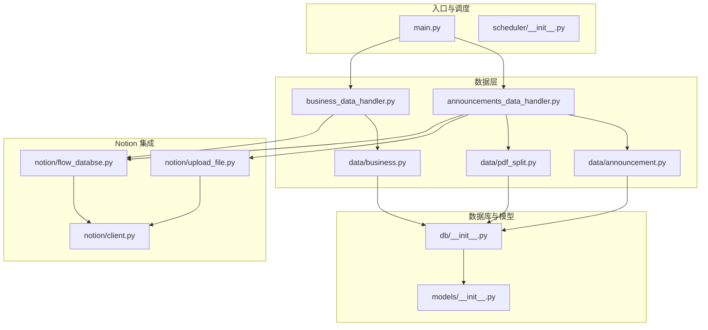
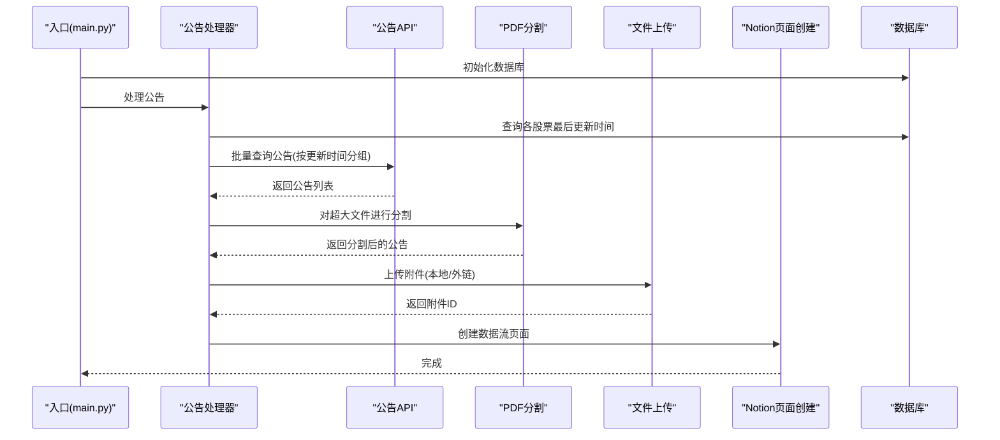
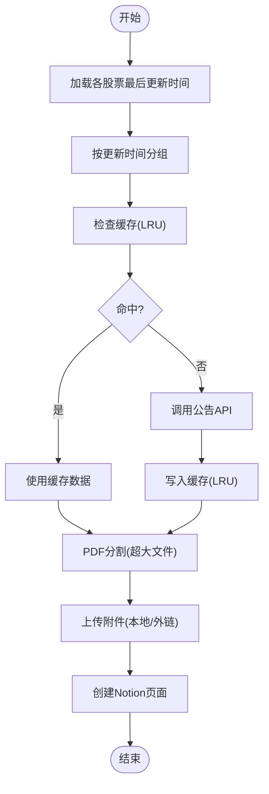
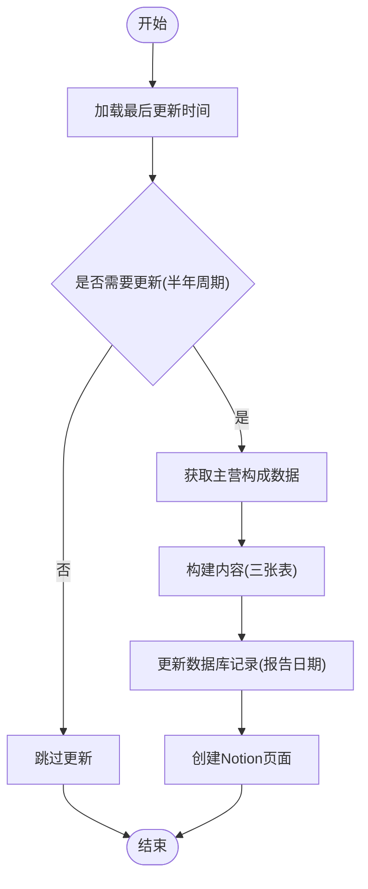
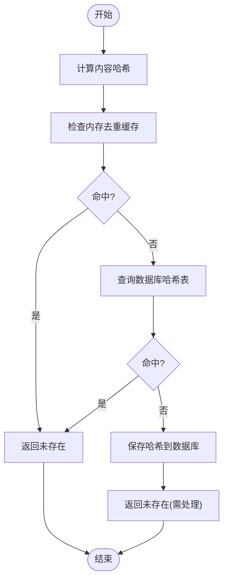
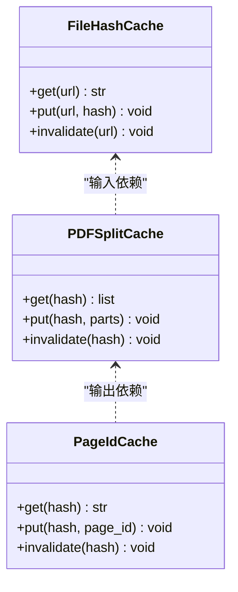
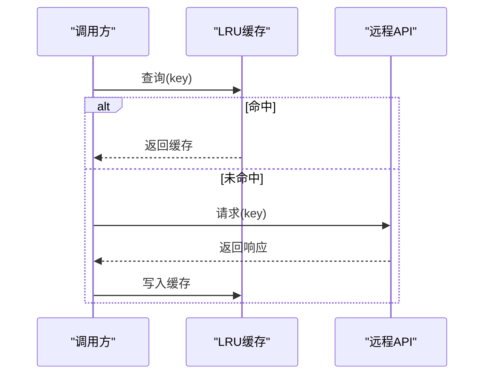
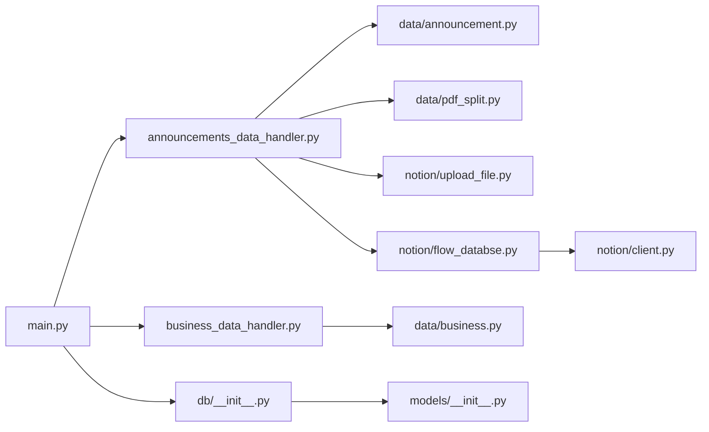

# 缓存机制优化

<cite>
**本文引用的文件**
- [main.py](file://main.py)
- [announcements_data_handler.py](file://core/announcements_data_handler.py)
- [business_data_handler.py](file://core/business_data_handler.py)
- [announcement.py](file://core/data/announcement.py)
- [pdf_split.py](file://core/data/pdf_split.py)
- [upload_file.py](file://core/notion/upload_file.py)
- [flow_databse.py](file://core/notion/flow_databse.py)
- [client.py](file://core/notion/client.py)
- [db_init.py](file://core/db/__init__.py)
- [models_init.py](file://core/models/__init__.py)
- [scheduler_init.py](file://core/scheduler/__init__.py)
</cite>

## 目录
1. [简介](#简介)
2. [项目结构](#项目结构)
3. [核心组件](#核心组件)
4. [架构总览](#架构总览)
5. [详细组件分析](#详细组件分析)
6. [依赖关系分析](#依赖关系分析)
7. [性能考量](#性能考量)
8. [故障排查指南](#故障排查指南)
9. [结论](#结论)
10. [附录](#附录)

## 简介
本指南面向“股票公告自动化系统”的缓存机制优化，聚焦以下目标：
- 异步 LRU 缓存的使用与落地建议
- 数据库查询缓存与去重（基于哈希）
- API 响应缓存策略（公告与主营构成）
- 缓存键设计、过期策略与一致性保障
- 文件哈希缓存、PDF 分割结果缓存、Notion 页面 ID 缓存的实现思路
- 缓存命中率优化、内存使用控制与失效处理
- 分布式缓存考虑与缓存监控指标

系统当前已具备数据库层的哈希去重能力与部分异步调用，但尚未实现显式的应用级缓存（如 LRU）。本文在不改变现有架构的前提下，给出可落地的优化建议。

## 项目结构
系统采用模块化分层组织，核心路径如下：
- 核心入口与调度：main.py、scheduler/__init__.py
- 数据获取与处理：core/data/*（公告、PDF 分割、主营构成）、core/announcements_data_handler.py、core/business_data_handler.py
- 数据库与模型：core/db/__init__.py、core/models/__init__.py
- Notion 集成：core/notion/*（客户端、上传、页面创建）

**图表来源**
- [main.py](file://main.py#L20-L36)
- [announcements_data_handler.py](file://core/announcements_data_handler.py#L21-L116)
- [business_data_handler.py](file://core/business_data_handler.py#L17-L68)
- [announcement.py](file://core/data/announcement.py#L36-L141)
- [pdf_split.py](file://core/data/pdf_split.py#L15-L128)
- [upload_file.py](file://core/notion/upload_file.py#L28-L180)
- [flow_databse.py](file://core/notion/flow_databse.py#L25-L67)
- [client.py](file://core/notion/client.py#L1-L6)
- [db_init.py](file://core/db/__init__.py#L62-L217)
- [models_init.py](file://core/models/__init__.py#L1-L8)
- [scheduler_init.py](file://core/scheduler/__init__.py#L1-L7)

**章节来源**
- [main.py](file://main.py#L1-L40)
- [scheduler_init.py](file://core/scheduler/__init__.py#L1-L7)

## 核心组件
- 异步公告抓取与分组：按最后更新时间对股票分组，减少重复请求，提升批量查询效率。
- PDF 分割：对大文件进行分块处理，便于后续上传与索引。
- Notion 上传与页面创建：支持本地内容与外链两种上传模式，页面创建统一走数据流数据库。
- 数据库哈希去重：对数据内容计算哈希，避免重复入库与重复处理。
- 模型与类型：统一 Notion 日期类型，便于跨模块传递。

**章节来源**
- [announcements_data_handler.py](file://core/announcements_data_handler.py#L21-L116)
- [pdf_split.py](file://core/data/pdf_split.py#L15-L128)
- [upload_file.py](file://core/notion/upload_file.py#L28-L180)
- [flow_databse.py](file://core/notion/flow_databse.py#L25-L67)
- [db_init.py](file://core/db/__init__.py#L97-L217)
- [models_init.py](file://core/models/__init__.py#L1-L8)

## 架构总览
系统运行流程概览：
- 入口初始化数据库与股票池
- 公告处理：按更新时间分组批量查询，过滤与拆分，上传附件，创建页面
- 主营构成处理：按半年周期判断是否更新，构建内容并创建页面
- 数据库：维护更新时间与哈希去重表

**图表来源**
- [main.py](file://main.py#L20-L36)
- [announcements_data_handler.py](file://core/announcements_data_handler.py#L21-L116)
- [announcement.py](file://core/data/announcement.py#L36-L112)
- [pdf_split.py](file://core/data/pdf_split.py#L15-L73)
- [upload_file.py](file://core/notion/upload_file.py#L28-L150)
- [flow_databse.py](file://core/notion/flow_databse.py#L25-L67)
- [db_init.py](file://core/db/__init__.py#L153-L217)

## 详细组件分析

### 组件A：公告数据处理与缓存策略
- 现状
  - 按最后更新时间对股票进行分组，减少重复查询
  - 对超大文件进行 PDF 分割
  - 支持外链与本地上传两种模式
- 缓存优化建议
  - LRU 缓存键设计：以“股票代码+起止日期”为键，避免重复拉取同一时间段的数据
  - 过期策略：按天或按周失效，结合业务更新频率设定
  - 一致性：与数据库更新时间联动，若数据库记录未变化则命中缓存；若变化则刷新
  - 命中率优化：批量查询时优先命中缓存，再对缺失部分发起请求
  - 内存控制：限制 LRU 容量，淘汰最久未使用的键
  - 失效处理：缓存失效时并发拉取，避免阻塞主流程

**图表来源**
- [announcements_data_handler.py](file://core/announcements_data_handler.py#L21-L116)
- [announcement.py](file://core/data/announcement.py#L36-L112)
- [pdf_split.py](file://core/data/pdf_split.py#L15-L73)
- [upload_file.py](file://core/notion/upload_file.py#L28-L150)
- [flow_databse.py](file://core/notion/flow_databse.py#L25-L67)

**章节来源**
- [announcements_data_handler.py](file://core/announcements_data_handler.py#L21-L116)
- [announcement.py](file://core/data/announcement.py#L36-L112)

### 组件B：主营构成数据处理与缓存策略
- 现状
  - 按半年周期判断是否需要更新
  - 从第三方接口获取数据，构建三张表格内容
- 缓存优化建议
  - 缓存键设计：以“股票代码+报告日期”为键，避免重复拉取相同报表
  - 过期策略：仅在季度末更新后有效，其他时间可长期缓存
  - 一致性：与数据库记录的报告日期一致，若未变化则命中缓存
  - 命中率优化：批量处理时优先命中缓存，缺失部分再请求
  - 内存控制：按股票维度限制缓存容量
  - 失效处理：到期或手动清理

**图表来源**
- [business_data_handler.py](file://core/business_data_handler.py#L17-L108)
- [business.py](file://core/data/business.py#L33-L96)
- [flow_databse.py](file://core/notion/flow_databse.py#L25-L67)
- [db_init.py](file://core/db/__init__.py#L153-L217)

**章节来源**
- [business_data_handler.py](file://core/business_data_handler.py#L17-L108)
- [business.py](file://core/data/business.py#L33-L96)

### 组件C：数据库哈希去重与缓存协同
- 现状
  - 提供哈希计算、查询与保存接口
  - 用于过滤重复数据，避免重复入库与重复处理
- 缓存协同建议
  - 将“内容哈希 → 是否存在”的映射放入内存缓存，加速去重判断
  - 结合 LRU 控制内存占用，定期清理冷数据
  - 与业务缓存配合：当内容未变时，既命中业务缓存又命中去重缓存

**图表来源**
- [db_init.py](file://core/db/__init__.py#L97-L151)

**章节来源**
- [db_init.py](file://core/db/__init__.py#L97-L151)

### 组件D：文件哈希缓存、PDF 分割结果缓存与 Notion 页面 ID 缓存
- 文件哈希缓存
  - 目标：避免重复下载与重复处理相同内容的 PDF
  - 建议：以“URL → 文件哈希”为键，结合 LRU 控制内存
  - 失效：按 URL 变更或强制刷新策略
- PDF 分割结果缓存
  - 目标：避免重复分割相同 PDF
  - 建议：以“文件哈希 → 分割结果”为键，缓存分割后的子文件元信息
  - 失效：与文件哈希一致
- Notion 页面 ID 缓存
  - 目标：避免重复创建相同内容的页面
  - 建议：以“内容哈希 → 页面ID”为键，缓存创建结果
  - 失效：内容变更或手动清理

**图表来源**
- [upload_file.py](file://core/notion/upload_file.py#L64-L150)
- [pdf_split.py](file://core/data/pdf_split.py#L15-L73)
- [db_init.py](file://core/db/__init__.py#L97-L151)

**章节来源**
- [upload_file.py](file://core/notion/upload_file.py#L64-L150)
- [pdf_split.py](file://core/data/pdf_split.py#L15-L73)

### 组件E：API 响应缓存策略
- 公告 API
  - 缓存键：股票列表+起止日期
  - 过期：按日或按周
  - 一致性：与数据库更新时间联动
- 主营构成 API
  - 缓存键：股票代码+报告日期
  - 过期：仅在季度末有效
  - 一致性：与报告日期一致

**图表来源**
- [announcement.py](file://core/data/announcement.py#L36-L112)
- [business.py](file://core/data/business.py#L33-L96)

**章节来源**
- [announcement.py](file://core/data/announcement.py#L36-L112)
- [business.py](file://core/data/business.py#L33-L96)

## 依赖关系分析
- 模块耦合
  - 入口依赖数据库初始化与股票池获取
  - 公告处理依赖公告 API、PDF 分割、上传与页面创建
  - 主营构成处理依赖业务 API 与页面创建
  - 数据库提供哈希去重与更新时间管理
- 外部依赖
  - Notion 异步客户端
  - HTTP 客户端（异步/同步）
  - PDF 处理库
  - SQLite（异步）

**图表来源**
- [main.py](file://main.py#L20-L36)
- [announcements_data_handler.py](file://core/announcements_data_handler.py#L21-L116)
- [business_data_handler.py](file://core/business_data_handler.py#L17-L68)
- [announcement.py](file://core/data/announcement.py#L36-L112)
- [pdf_split.py](file://core/data/pdf_split.py#L15-L73)
- [upload_file.py](file://core/notion/upload_file.py#L28-L150)
- [flow_databse.py](file://core/notion/flow_databse.py#L25-L67)
- [client.py](file://core/notion/client.py#L1-L6)
- [db_init.py](file://core/db/__init__.py#L62-L217)
- [models_init.py](file://core/models/__init__.py#L1-L8)

**章节来源**
- [main.py](file://main.py#L20-L36)
- [db_init.py](file://core/db/__init__.py#L62-L217)

## 性能考量
- 缓存命中率优化
  - 合理分组与批量化：公告按更新时间分组，减少重复请求
  - 内容去重：利用哈希去重，避免重复处理
  - 预热策略：启动时预热热点键（如近期热门股票）
- 内存使用控制
  - LRU 容量限制：根据可用内存设定上限
  - 分层缓存：热点数据驻留内存，冷数据落盘或淘汰
- 失效处理
  - 时间驱动：定时清理过期键
  - 事件驱动：内容变更触发失效
- 并发与限流
  - 并发拉取：命中缓存时快速返回，未命中时并发请求
  - 限流策略：对第三方 API 设置速率限制，避免封禁

## 故障排查指南
- 缓存未命中
  - 检查缓存键是否正确（时间范围、股票列表）
  - 核对过期策略是否过短
- 重复处理
  - 检查哈希计算是否稳定（排序、编码）
  - 核对数据库哈希表是否正确写入
- 上传失败
  - 查看轮询状态与错误信息
  - 检查 Notion Token 与网络连通性
- 页面创建失败
  - 校验属性映射与数据类型
  - 检查数据库更新时间是否正确

**章节来源**
- [upload_file.py](file://core/notion/upload_file.py#L153-L177)
- [flow_databse.py](file://core/notion/flow_databse.py#L59-L67)
- [db_init.py](file://core/db/__init__.py#L188-L217)

## 结论
本系统已在数据库层面实现了哈希去重与更新时间管理，具备良好的基础。通过引入应用级 LRU 缓存、文件哈希缓存、PDF 分割结果缓存与页面 ID 缓存，并完善过期与一致性策略，可在不破坏现有架构的前提下显著提升吞吐与稳定性。建议优先实现公告与主营构成的 LRU 缓存，再逐步扩展到文件与页面缓存，持续监控命中率与内存占用，动态调整策略。

## 附录
- 缓存监控指标建议
  - 命中率：缓存命中次数 / 总请求次数
  - 命中延迟：缓存命中耗时分布
  - 内存使用：缓存条目数量、内存占用
  - 失效率：主动/被动失效占比
  - 第三方 API 调用统计：成功率、平均耗时、错误类型
- 分布式缓存考虑
  - 使用集中式缓存（如 Redis）替代进程内 LRU
  - 采用一致性哈希与副本策略，提升可用性
  - 引入缓存预热与灰度发布机制