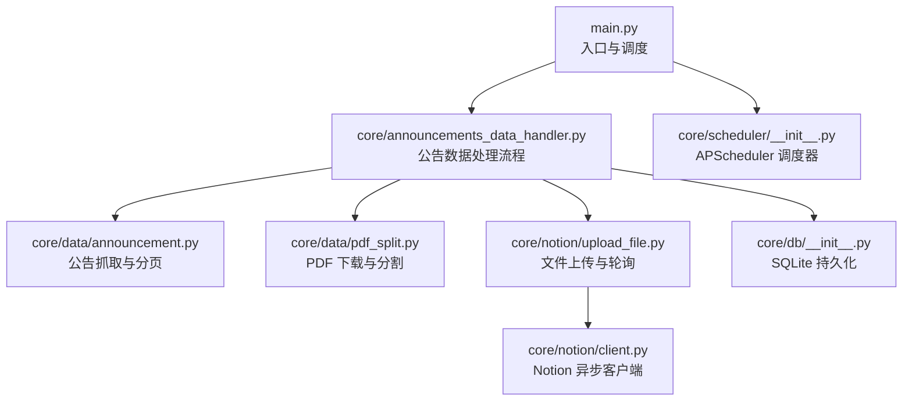
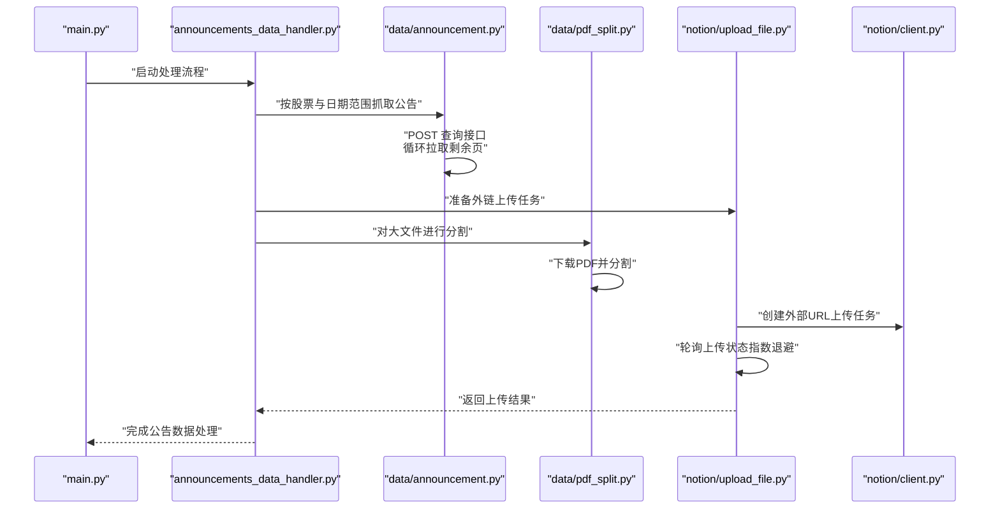
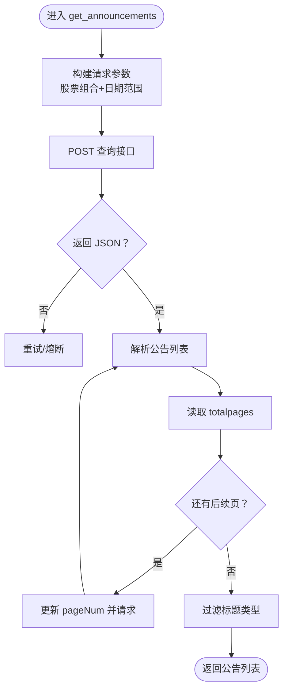
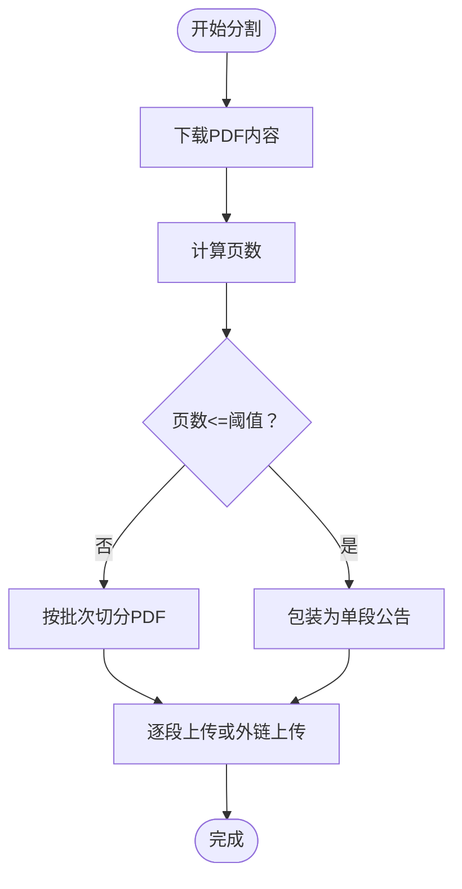
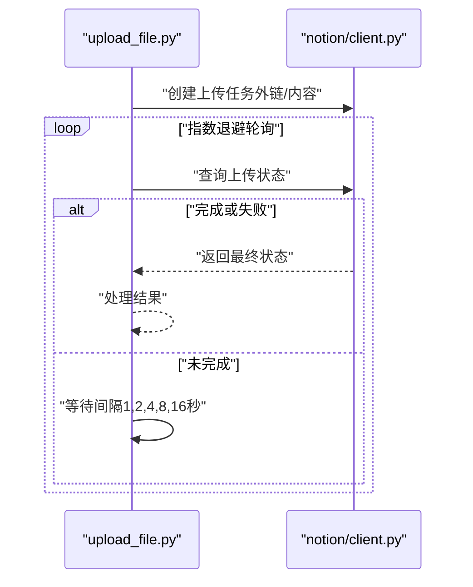
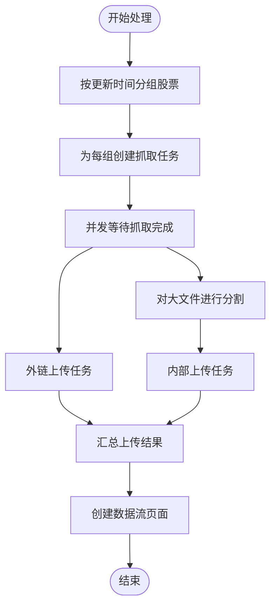
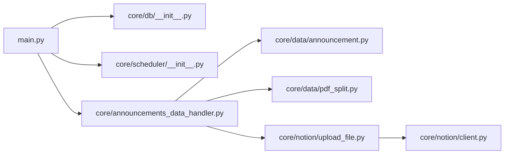

# 网络请求优化

<cite>
**本文引用的文件**
- [main.py](file://main.py)
- [core/data/announcement.py](file://core/data/announcement.py)
- [core/data/pdf_split.py](file://core/data/pdf_split.py)
- [core/announcements_data_handler.py](file://core/announcements_data_handler.py)
- [core/notion/upload_file.py](file://core/notion/upload_file.py)
- [core/notion/client.py](file://core/notion/client.py)
- [core/db/__init__.py](file://core/db/__init__.py)
- [core/scheduler/__init__.py](file://core/scheduler/__init__.py)
</cite>

## 目录
1. [简介](#简介)
2. [项目结构](#项目结构)
3. [核心组件](#核心组件)
4. [架构总览](#架构总览)
5. [详细组件分析](#详细组件分析)
6. [依赖关系分析](#依赖关系分析)
7. [性能考量](#性能考量)
8. [故障排查指南](#故障排查指南)
9. [结论](#结论)
10. [附录](#附录)

## 简介
本指南面向“股票公告自动化系统”的网络请求优化，聚焦以下方面：
- HTTP 客户端配置与连接池管理
- 请求超时与重试策略
- API 限流与断线重连
- 请求批量化、压缩传输与 DNS 缓存
- 网络监控指标、延迟分析与带宽优化
- 代理配置、SSL/TLS 优化与网络安全

系统当前主要通过异步 HTTP 客户端发起对外部公告接口与 PDF 下载的请求，并将文件上传至 Notion。优化目标是在保证稳定性的同时提升吞吐与资源利用率。

## 项目结构
系统采用按功能模块划分的层次化组织：
- 核心数据层：公告抓取、PDF 分割、数据库持久化
- Notion 集成层：异步客户端、文件上传与轮询
- 调度与入口：主程序、调度器

图表来源
- [main.py](file://main.py#L1-L40)
- [core/announcements_data_handler.py](file://core/announcements_data_handler.py#L1-L116)
- [core/data/announcement.py](file://core/data/announcement.py#L1-L141)
- [core/data/pdf_split.py](file://core/data/pdf_split.py#L1-L128)
- [core/notion/upload_file.py](file://core/notion/upload_file.py#L1-L180)
- [core/notion/client.py](file://core/notion/client.py#L1-L6)
- [core/db/__init__.py](file://core/db/__init__.py#L1-L218)
- [core/scheduler/__init__.py](file://core/scheduler/__init__.py#L1-L7)

章节来源
- [main.py](file://main.py#L1-L40)
- [core/announcements_data_handler.py](file://core/announcements_data_handler.py#L1-L116)
- [core/data/announcement.py](file://core/data/announcement.py#L1-L141)
- [core/data/pdf_split.py](file://core/data/pdf_split.py#L1-L128)
- [core/notion/upload_file.py](file://core/notion/upload_file.py#L1-L180)
- [core/notion/client.py](file://core/notion/client.py#L1-L6)
- [core/db/__init__.py](file://core/db/__init__.py#L1-L218)
- [core/scheduler/__init__.py](file://core/scheduler/__init__.py#L1-L7)

## 核心组件
- 异步 HTTP 客户端与连接池
  - 公告抓取与股票映射：使用异步客户端发起 POST 请求，按总页数循环拉取。
  - PDF 下载与分割：使用同步/异步客户端下载大文件并本地分割。
  - Notion 文件上传：外部 URL 直链上传与内部直传两种路径，均依赖 Notion 异步客户端。
- 并发与批量化
  - 公告抓取按日期聚合，减少重复请求。
  - 文件上传采用并发 gather，提高吞吐。
- 轮询与重试
  - Notion 文件导入状态轮询，指数退避等待，避免频繁轮询导致的额外压力。
- 数据持久化
  - SQLite 存储更新时间与去重哈希，支撑增量更新与幂等性。

章节来源
- [core/data/announcement.py](file://core/data/announcement.py#L36-L112)
- [core/data/pdf_split.py](file://core/data/pdf_split.py#L76-L81)
- [core/notion/upload_file.py](file://core/notion/upload_file.py#L28-L61)
- [core/notion/upload_file.py](file://core/notion/upload_file.py#L153-L176)
- [core/db/__init__.py](file://core/db/__init__.py#L153-L215)

## 架构总览
系统网络交互的关键路径如下：

图表来源
- [main.py](file://main.py#L20-L35)
- [core/announcements_data_handler.py](file://core/announcements_data_handler.py#L21-L115)
- [core/data/announcement.py](file://core/data/announcement.py#L36-L112)
- [core/data/pdf_split.py](file://core/data/pdf_split.py#L15-L73)
- [core/notion/upload_file.py](file://core/notion/upload_file.py#L40-L61)
- [core/notion/client.py](file://core/notion/client.py#L1-L6)

## 详细组件分析

### 组件一：公告抓取与分页（HTTP 客户端配置）
- 关键点
  - 使用异步客户端发起 POST 请求，携带股票组合与日期范围参数。
  - 依据 totalpages 字段循环拉取后续页，避免一次性全量拉取。
  - 对返回标题进行过滤，剔除摘要/英文版/图文版等非正文类型。
- 优化建议
  - 连接池：复用同一 AsyncClient 实例，减少 TCP/TLS 握手开销；若需全局复用，可在模块级创建并注入。
  - 超时：为 post/get 设置 connect_timeout/read_timeout，避免阻塞影响整体吞吐。
  - 重试：对 5xx 或网络瞬断错误进行有限次数重试，指数退避。
  - 限流：根据接口响应头或速率限制策略，控制并发与速率。
  - 压缩：启用 gzip/deflate 透明压缩，降低带宽占用。
  - DNS：开启系统级 DNS 缓存或使用第三方库（如 dnspython）预热热点域名。
  - 代理：通过环境变量或 httpx 配置代理，便于内网与合规审计。
  - SSL/TLS：固定证书校验策略，禁用不安全套件，启用 OCSP Stapling。
  - 监控：记录请求耗时、重试次数、错误码分布，辅助容量规划。

图表来源
- [core/data/announcement.py](file://core/data/announcement.py#L36-L112)

章节来源
- [core/data/announcement.py](file://core/data/announcement.py#L36-L112)

### 组件二：PDF 下载与分割（带宽与压缩）
- 关键点
  - 下载 PDF 时使用同步/异步客户端，注意内存占用与超时设置。
  - 本地分割为多段 PDF，便于后续上传至 Notion。
- 优化建议
  - 流式下载：对大文件采用分块读取，避免一次性加载至内存。
  - 压缩：在上传前对 PDF 进行压缩（如降分辨率、去除冗余元数据），减少体积。
  - 并发：对不同公告的下载与分割任务并发执行，但需限制最大并发以保护本地磁盘与 CPU。
  - 代理/SSL：与公告抓取一致，统一代理与 TLS 配置。
  - 监控：统计下载耗时、分块数量、压缩比，评估优化效果。

图表来源
- [core/data/pdf_split.py](file://core/data/pdf_split.py#L15-L73)
- [core/data/pdf_split.py](file://core/data/pdf_split.py#L76-L81)
- [core/data/pdf_split.py](file://core/data/pdf_split.py#L92-L127)

章节来源
- [core/data/pdf_split.py](file://core/data/pdf_split.py#L15-L73)
- [core/data/pdf_split.py](file://core/data/pdf_split.py#L76-L81)
- [core/data/pdf_split.py](file://core/data/pdf_split.py#L92-L127)

### 组件三：文件上传与轮询（重试与断线重连）
- 关键点
  - 外链上传：创建上传任务后轮询状态，指数退避等待。
  - 内容上传：先下载再上传，适合本地小文件。
  - 轮询上限：达到最大尝试次数仍未完成则判定失败。
- 优化建议
  - 重试策略：对外部服务调用增加幂等键，避免重复上传。
  - 断线重连：在网络异常时自动重试，指数退避上限合理设置。
  - 并发控制：限制同时进行的上传任务数量，避免触发 Notion 限流。
  - 代理/SSL：统一代理与 TLS 配置，确保跨网络稳定。
  - 监控：记录轮询耗时、失败原因、重试次数，持续优化退避参数。

图表来源
- [core/notion/upload_file.py](file://core/notion/upload_file.py#L124-L176)
- [core/notion/client.py](file://core/notion/client.py#L1-L6)

章节来源
- [core/notion/upload_file.py](file://core/notion/upload_file.py#L28-L61)
- [core/notion/upload_file.py](file://core/notion/upload_file.py#L124-L176)
- [core/notion/client.py](file://core/notion/client.py#L1-L6)

### 组件四：并发与批量化（吞吐与资源）
- 关键点
  - 公告抓取按更新时间分组，减少重复请求。
  - 文件上传采用 asyncio.gather 并发执行，显著提升吞吐。
- 优化建议
  - 批量化：将多个股票或文件打包为批次，减少请求次数。
  - 资源配额：为不同阶段设置并发上限，避免 CPU/内存/网络拥塞。
  - 调度：结合 APScheduler 控制运行频率，避免高峰时段集中请求。

图表来源
- [core/announcements_data_handler.py](file://core/announcements_data_handler.py#L21-L115)

章节来源
- [core/announcements_data_handler.py](file://core/announcements_data_handler.py#L21-L115)

## 依赖关系分析
- 模块耦合
  - 主程序依赖数据库初始化与股票池获取。
  - 公告处理模块依赖数据抓取、PDF 分割与 Notion 上传。
  - Notion 上传模块依赖 Notion 异步客户端。
- 外部依赖
  - httpx：异步/同步 HTTP 客户端。
  - pymupdf：PDF 解析与分割。
  - aiosqlite：异步 SQLite 访问。
  - APScheduler：异步调度器。

图表来源
- [main.py](file://main.py#L1-L40)
- [core/announcements_data_handler.py](file://core/announcements_data_handler.py#L1-L116)
- [core/data/announcement.py](file://core/data/announcement.py#L1-L141)
- [core/data/pdf_split.py](file://core/data/pdf_split.py#L1-L128)
- [core/notion/upload_file.py](file://core/notion/upload_file.py#L1-L180)
- [core/notion/client.py](file://core/notion/client.py#L1-L6)
- [core/db/__init__.py](file://core/db/__init__.py#L1-L218)
- [core/scheduler/__init__.py](file://core/scheduler/__init__.py#L1-L7)

章节来源
- [main.py](file://main.py#L1-L40)
- [core/announcements_data_handler.py](file://core/announcements_data_handler.py#L1-L116)
- [core/data/announcement.py](file://core/data/announcement.py#L1-L141)
- [core/data/pdf_split.py](file://core/data/pdf_split.py#L1-L128)
- [core/notion/upload_file.py](file://core/notion/upload_file.py#L1-L180)
- [core/notion/client.py](file://core/notion/client.py#L1-L6)
- [core/db/__init__.py](file://core/db/__init__.py#L1-L218)
- [core/scheduler/__init__.py](file://core/scheduler/__init__.py#L1-L7)

## 性能考量
- 连接池与并发
  - 建议在模块级创建 AsyncClient 实例并复用，设置合理的连接池大小与空闲超时。
  - 对不同外部服务（公告接口、PDF 下载、Notion 上传）分别配置独立连接池，避免相互影响。
- 超时与重试
  - 为连接与读写设置明确超时，避免长时间阻塞。
  - 对 5xx/网络瞬断进行有限次数重试，指数退避，避免雪崩效应。
- 限流与断线重连
  - 根据外部 API 的速率限制调整并发与速率，必要时引入令牌桶/漏桶算法。
  - 对网络抖动敏感的阶段（轮询）增加断线重连与幂等保障。
- 压缩与 DNS
  - 启用 gzip/deflate 透明压缩，降低带宽占用。
  - 开启系统级 DNS 缓存或使用第三方库预热热点域名，缩短解析延迟。
- 代理与 SSL/TLS
  - 通过环境变量或 httpx 配置代理，满足内网与合规要求。
  - 固定 TLS 版本与套件，禁用不安全选项，启用 OCSP Stapling 提升握手效率。
- 监控与指标
  - 记录请求耗时、重试次数、错误码分布、并发度、队列长度。
  - 结合延迟分析（P50/P95/P99）与带宽使用率，动态调整并发与批大小。

## 故障排查指南
- 常见问题
  - 请求超时：检查网络状况、代理配置与超时参数；适当增大超时并增加重试。
  - 上传失败：查看 Notion 返回的状态与错误信息，确认文件大小与格式限制。
  - 轮询超时：调整最大尝试次数与退避上限，避免过早放弃。
  - DNS 解析失败：检查 DNS 配置与缓存，必要时更换上游 DNS。
- 排查步骤
  - 启用详细日志，定位失败阶段与错误码。
  - 使用监控指标识别瓶颈（CPU/内存/网络/磁盘）。
  - 对热点接口与文件进行压测，验证优化效果。
- 参考实现位置
  - 轮询与错误处理：参见文件上传模块的轮询与状态判断逻辑。
  - 数据持久化与去重：参见数据库模块的哈希检查与保存逻辑。

章节来源
- [core/notion/upload_file.py](file://core/notion/upload_file.py#L153-L176)
- [core/db/__init__.py](file://core/db/__init__.py#L97-L151)

## 结论
通过对公告抓取、PDF 下载/分割、文件上传与轮询等关键环节的网络优化，系统可在保证稳定性的同时显著提升吞吐与资源利用率。建议优先实施连接池复用、超时与重试、指数退避轮询、DNS 缓存与压缩传输，并建立完善的监控体系以持续迭代优化。

## 附录
- 相关实现位置
  - 公告抓取与分页：参见公告数据模块。
  - PDF 下载与分割：参见 PDF 分割模块。
  - 文件上传与轮询：参见 Notion 上传模块。
  - 数据持久化与去重：参见数据库模块。
  - 调度与入口：参见主程序与调度器模块。

章节来源
- [core/data/announcement.py](file://core/data/announcement.py#L36-L112)
- [core/data/pdf_split.py](file://core/data/pdf_split.py#L15-L73)
- [core/notion/upload_file.py](file://core/notion/upload_file.py#L28-L61)
- [core/db/__init__.py](file://core/db/__init__.py#L153-L215)
- [main.py](file://main.py#L20-L35)
- [core/scheduler/__init__.py](file://core/scheduler/__init__.py#L1-L7)