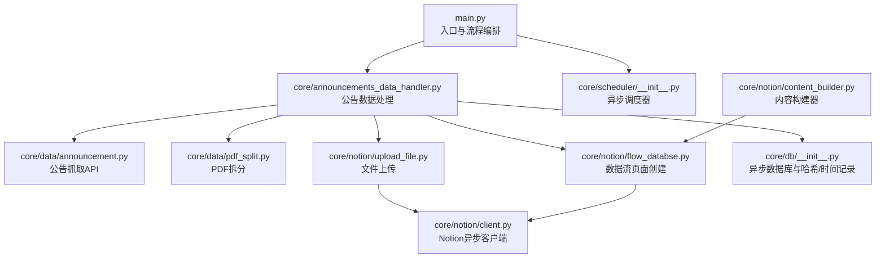
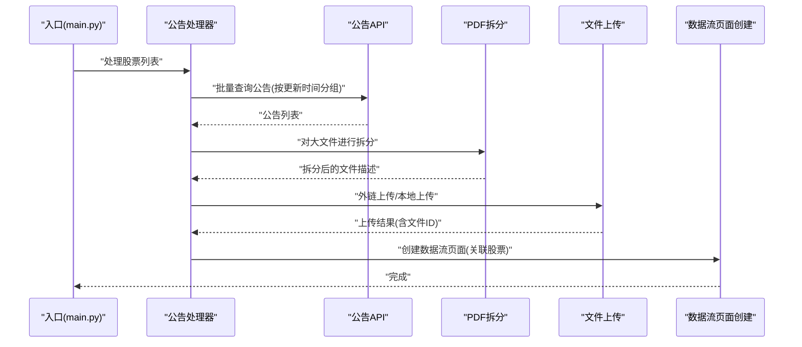
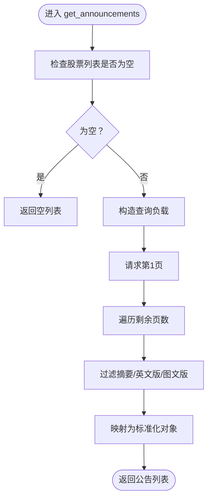
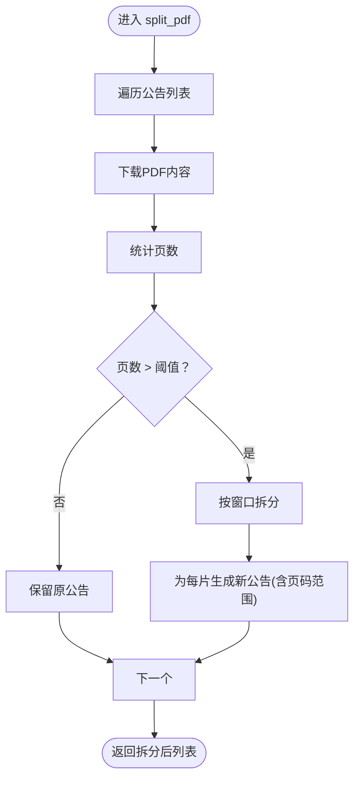
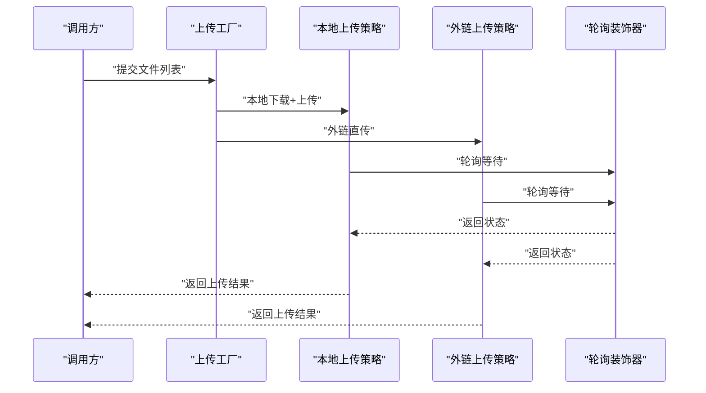
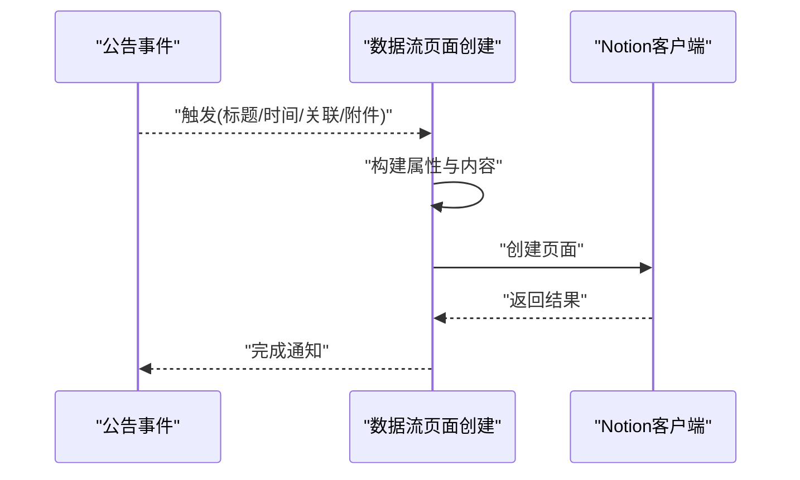
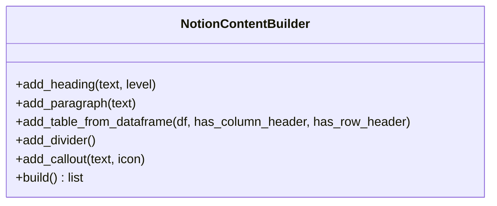
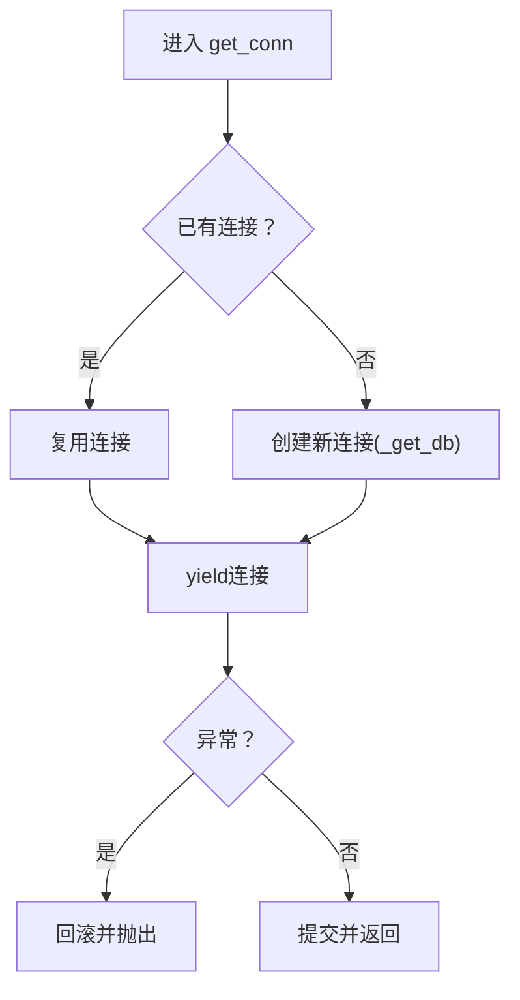
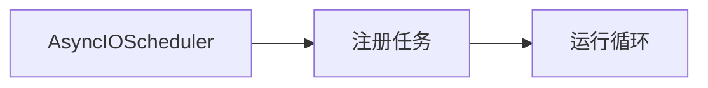
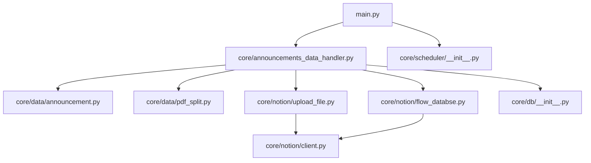

# API设计模式

<cite>
**本文引用的文件**
- [main.py](file://main.py)
- [announcements_data_handler.py](file://core/announcements_data_handler.py)
- [announcement.py](file://core/data/announcement.py)
- [pdf_split.py](file://core/data/pdf_split.py)
- [business.py](file://core/data/business.py)
- [client.py](file://core/notion/client.py)
- [content_builder.py](file://core/notion/content_builder.py)
- [flow_databse.py](file://core/notion/flow_databse.py)
- [upload_file.py](file://core/notion/upload_file.py)
- [__init__.py（数据库模块）](file://core/db/__init__.py)
- [__init__.py（调度器）](file://core/scheduler/__init__.py)
- [__init__.py（模型）](file://core/models/__init__.py)
</cite>

## 目录
1. [引言](#引言)
2. [项目结构](#项目结构)
3. [核心组件](#核心组件)
4. [架构总览](#架构总览)
5. [详细组件分析](#详细组件分析)
6. [依赖分析](#依赖分析)
7. [性能考量](#性能考量)
8. [故障排查指南](#故障排查指南)
9. [结论](#结论)
10. [附录](#附录)

## 引言
本指南面向“股票公告自动化系统”的API设计与实现，聚焦以下主题：
- 设计模式与架构原则：工厂模式、策略模式、观察者模式、装饰器模式在系统中的应用与映射。
- API接口设计规范：参数校验、返回值标准化、错误处理一致性。
- 异步API设计：并发处理、任务调度、资源管理。
- 数据模型设计：实体关系建模、字段约束、数据完整性保障。
- API版本管理与迁移：向后兼容策略与废弃API的迁移路径。
- 性能优化：基于现有实现的模式化建议与最佳实践。

## 项目结构
系统采用按功能域划分的层次化组织：
- 核心入口负责初始化数据库、获取股票池并驱动数据处理流程。
- 数据层封装对外接口（公告、业务数据）与本地PDF拆分能力。
- Notion集成层负责客户端、内容构建器、文件上传与数据流页面创建。
- 数据库层提供异步连接管理、去重哈希、更新时间记录。
- 调度层提供异步APScheduler调度器。

图表来源
- [main.py](file://main.py#L20-L39)
- [announcements_data_handler.py](file://core/announcements_data_handler.py#L21-L116)
- [announcement.py](file://core/data/announcement.py#L36-L112)
- [pdf_split.py](file://core/data/pdf_split.py#L15-L73)
- [upload_file.py](file://core/notion/upload_file.py#L28-L61)
- [flow_databse.py](file://core/notion/flow_databse.py#L25-L67)
- [client.py](file://core/notion/client.py#L1-L6)
- [__init__.py（数据库模块）](file://core/db/__init__.py#L62-L217)
- [__init__.py（调度器）](file://core/scheduler/__init__.py#L1-L8)
- [content_builder.py](file://core/notion/content_builder.py#L1-L103)

章节来源
- [main.py](file://main.py#L1-L40)
- [announcements_data_handler.py](file://core/announcements_data_handler.py#L1-L116)
- [__init__.py（数据库模块）](file://core/db/__init__.py#L1-L218)
- [__init__.py（调度器）](file://core/scheduler/__init__.py#L1-L8)

## 核心组件
- 公告抓取API：提供异步获取公告列表的能力，支持分页与过滤。
- PDF拆分工具：对大文件进行分片，便于后续上传限制。
- 文件上传服务：支持外链直传与本地下载后上传两种模式，内置轮询与指数退避。
- 数据流页面创建：将公告转化为Notion页面，建立与股票的关系。
- 内容构建器：以链式调用方式构建页面内容块。
- 异步数据库：提供连接上下文、去重哈希、更新时间记录。
- 异步调度器：基于APScheduler的异步调度器。

章节来源
- [announcement.py](file://core/data/announcement.py#L36-L112)
- [pdf_split.py](file://core/data/pdf_split.py#L15-L73)
- [upload_file.py](file://core/notion/upload_file.py#L28-L61)
- [flow_databse.py](file://core/notion/flow_databse.py#L25-L67)
- [content_builder.py](file://core/notion/content_builder.py#L1-L103)
- [__init__.py（数据库模块）](file://core/db/__init__.py#L62-L217)
- [__init__.py（调度器）](file://core/scheduler/__init__.py#L1-L8)

## 架构总览
系统采用“数据抓取—预处理—上传—页面创建”的流水线式异步架构。入口模块负责编排，数据处理模块负责并发聚合，Notion集成模块负责持久化与展示。

图表来源
- [main.py](file://main.py#L20-L39)
- [announcements_data_handler.py](file://core/announcements_data_handler.py#L21-L116)
- [announcement.py](file://core/data/announcement.py#L36-L112)
- [pdf_split.py](file://core/data/pdf_split.py#L15-L73)
- [upload_file.py](file://core/notion/upload_file.py#L28-L61)
- [flow_databse.py](file://core/notion/flow_databse.py#L25-L67)

## 详细组件分析

### 组件A：公告抓取API（策略模式映射）
- 角色：策略接口的实现者之一，负责从巨潮资讯网抓取公告列表。
- 设计要点：
  - 异步HTTP客户端，支持分页遍历。
  - 输入参数：股票列表、起止日期；输出：标准化公告对象列表。
  - 过滤策略：剔除摘要/英文版/图文版等非正文类型。
- 可扩展性：可通过替换实现或注入不同过滤器实现“策略切换”。

图表来源
- [announcement.py](file://core/data/announcement.py#L36-L112)

章节来源
- [announcement.py](file://core/data/announcement.py#L36-L112)

### 组件B：PDF拆分工具（策略模式映射）
- 角色：策略实现者之一，负责对大PDF进行分片。
- 设计要点：
  - 基于页数阈值决定是否拆分。
  - 拆分算法：固定窗口大小与重叠页数，生成带页码范围的新标题。
  - 异常兜底：拆分失败时保留原公告，避免中断流程。

图表来源
- [pdf_split.py](file://core/data/pdf_split.py#L15-L73)

章节来源
- [pdf_split.py](file://core/data/pdf_split.py#L15-L73)

### 组件C：文件上传服务（工厂/策略/装饰器模式映射）
- 工厂：根据URL类型选择上传策略（外链直传 vs 本地下载后上传）。
- 策略：两种上传策略并行执行，统一返回结构。
- 装饰器：轮询等待与指数退避（装饰重试行为）。
- 设计要点：
  - 并发任务聚合，统一日志统计。
  - 成功/失败状态与错误信息标准化返回。

图表来源
- [upload_file.py](file://core/notion/upload_file.py#L28-L61)
- [upload_file.py](file://core/notion/upload_file.py#L124-L150)
- [upload_file.py](file://core/notion/upload_file.py#L153-L177)

章节来源
- [upload_file.py](file://core/notion/upload_file.py#L28-L61)
- [upload_file.py](file://core/notion/upload_file.py#L124-L150)
- [upload_file.py](file://core/notion/upload_file.py#L153-L177)

### 组件D：数据流页面创建（观察者模式映射）
- 角色：观察者，接收公告事件，创建Notion页面。
- 设计要点：
  - 观察目标：公告抓取与上传完成事件。
  - 观察动作：构建属性、写入数据库、创建页面。
  - 错误处理：捕获异常并记录日志，不阻断主流程。

图表来源
- [flow_databse.py](file://core/notion/flow_databse.py#L25-L67)
- [client.py](file://core/notion/client.py#L1-L6)

章节来源
- [flow_databse.py](file://core/notion/flow_databse.py#L25-L67)
- [client.py](file://core/notion/client.py#L1-L6)

### 组件E：内容构建器（建造者/装饰器模式映射）
- 建造者：链式调用构建页面内容块，支持标题、段落、表格、分隔线、Callout。
- 装饰器：在构建完成后一次性返回最终内容数组。

图表来源
- [content_builder.py](file://core/notion/content_builder.py#L1-L103)

章节来源
- [content_builder.py](file://core/notion/content_builder.py#L1-L103)

### 组件F：异步数据库（工厂/策略/观察者模式映射）
- 工厂：异步连接上下文管理器，统一事务提交/回滚。
- 策略：哈希去重策略（xxHash + 数据快照）。
- 观察者：更新时间记录，用于增量拉取与幂等控制。

图表来源
- [__init__.py（数据库模块）](file://core/db/__init__.py#L28-L52)

章节来源
- [__init__.py（数据库模块）](file://core/db/__init__.py#L62-L217)

### 组件G：异步调度器（策略/观察者模式映射）
- 策略：基于APScheduler的异步调度策略，统一时区与时钟。
- 观察者：可注册定时任务观察系统状态变化。

图表来源
- [__init__.py（调度器）](file://core/scheduler/__init__.py#L1-L8)

章节来源
- [__init__.py（调度器）](file://core/scheduler/__init__.py#L1-L8)

## 依赖分析
- 模块耦合：
  - 入口模块依赖数据处理模块与数据库模块。
  - 数据处理模块依赖公告API、PDF拆分、文件上传与数据流页面创建。
  - Notion集成模块依赖异步客户端。
  - 数据库模块提供通用的异步连接与哈希/时间记录能力。
- 外部依赖：
  - HTTP客户端、PDF处理库、Notion SDK、APScheduler、SQLite异步驱动。

图表来源
- [main.py](file://main.py#L20-L39)
- [announcements_data_handler.py](file://core/announcements_data_handler.py#L1-L16)
- [announcement.py](file://core/data/announcement.py#L1-L10)
- [pdf_split.py](file://core/data/pdf_split.py#L1-L12)
- [upload_file.py](file://core/notion/upload_file.py#L1-L11)
- [flow_databse.py](file://core/notion/flow_databse.py#L1-L12)
- [client.py](file://core/notion/client.py#L1-L6)
- [__init__.py（数据库模块）](file://core/db/__init__.py#L1-L13)
- [__init__.py（调度器）](file://core/scheduler/__init__.py#L1-L8)

章节来源
- [main.py](file://main.py#L1-L40)
- [announcements_data_handler.py](file://core/announcements_data_handler.py#L1-L16)
- [__init__.py（数据库模块）](file://core/db/__init__.py#L1-L218)

## 性能考量
- 并发与批量化：
  - 公告抓取按“最近更新时间”分组，减少重复请求。
  - 使用异步gather并发执行多个任务，提升吞吐。
- 资源管理：
  - 异步上下文管理器确保数据库连接正确提交/回滚。
  - 文件上传采用轮询与指数退避，避免频繁重试。
- 增量与去重：
  - 哈希去重策略避免重复处理相同内容。
  - 更新时间记录用于增量拉取，降低全量扫描成本。
- I/O优化：
  - PDF拆分采用内存缓冲与页级窗口，平衡内存占用与网络I/O。

章节来源
- [announcements_data_handler.py](file://core/announcements_data_handler.py#L40-L62)
- [__init__.py（数据库模块）](file://core/db/__init__.py#L97-L128)
- [upload_file.py](file://core/notion/upload_file.py#L153-L177)
- [pdf_split.py](file://core/data/pdf_split.py#L15-L73)

## 故障排查指南
- 日志与错误处理：
  - 各模块广泛使用日志记录关键步骤与异常。
  - 页面创建与上传均捕获异常并记录，避免中断主流程。
- 常见问题定位：
  - 公告抓取：检查输入参数（股票列表、日期范围）、接口响应与过滤条件。
  - PDF拆分：确认网络可达性与PDF内容有效性。
  - 文件上传：关注轮询超时与Notion导入状态。
  - 数据库：检查连接上下文与事务提交/回滚逻辑。
- 建议：
  - 在关键节点增加断言与参数校验。
  - 对外部依赖增加超时与重试上限配置。

章节来源
- [flow_databse.py](file://core/notion/flow_databse.py#L65-L67)
- [upload_file.py](file://core/notion/upload_file.py#L153-L177)
- [__init__.py（数据库模块）](file://core/db/__init__.py#L28-L52)

## 结论
本系统通过异步与模块化设计，实现了从公告抓取到页面创建的完整流水线。在设计模式层面，策略、工厂、观察者与装饰器模式自然融入各组件职责，提升了可扩展性与可维护性。建议在后续迭代中进一步完善API参数校验、返回值标准化与错误码体系，明确版本管理与废弃策略，以增强系统的稳定性与演进能力。

## 附录

### API设计规范（建议）
- 参数验证：
  - 必填参数校验（如股票列表、日期范围）。
  - 类型与边界校验（日期格式、页数阈值）。
- 返回值标准化：
  - 统一结构（如包含状态码、消息、数据体）。
  - 对于上传/创建等异步操作，返回任务ID与查询地址。
- 错误处理一致性：
  - 明确错误码与语义，统一异常捕获与日志记录。
  - 对外部依赖失败提供可恢复策略（重试/降级）。

### 异步API设计要点
- 并发处理：使用异步gather聚合任务，合理设置并发上限。
- 任务调度：利用异步调度器定期执行周期性任务。
- 资源管理：使用上下文管理器与连接池，避免泄漏。

### 数据模型设计原则
- 实体关系建模：公告、股票、附件、页面之间的关系清晰。
- 字段约束：日期、字符串长度、数值范围等约束。
- 数据完整性：哈希去重、更新时间记录、事务控制。

### API版本管理与迁移
- 版本策略：语义化版本号，路径或头部携带版本信息。
- 向后兼容：新增字段默认可选，变更字段提供过渡期。
- 废弃策略：提前发布废弃声明，提供迁移指南与替代方案。