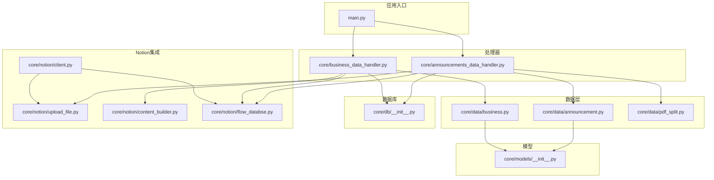
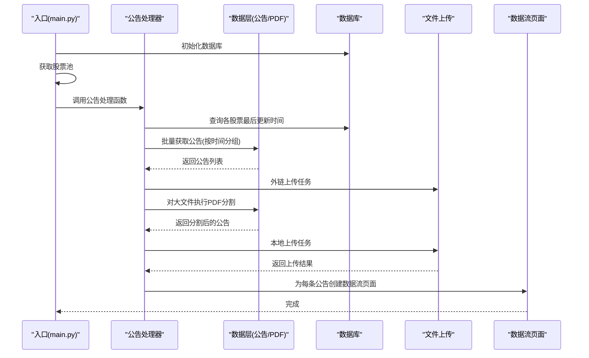
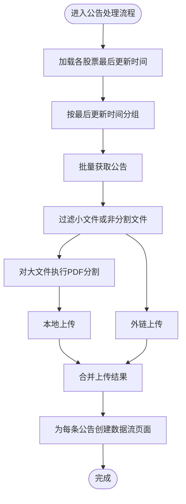
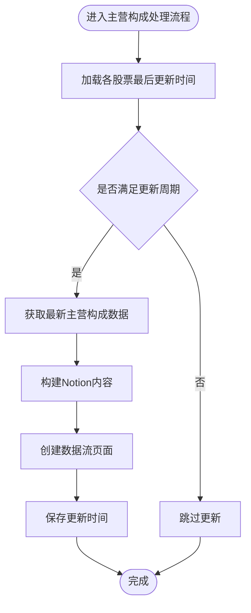
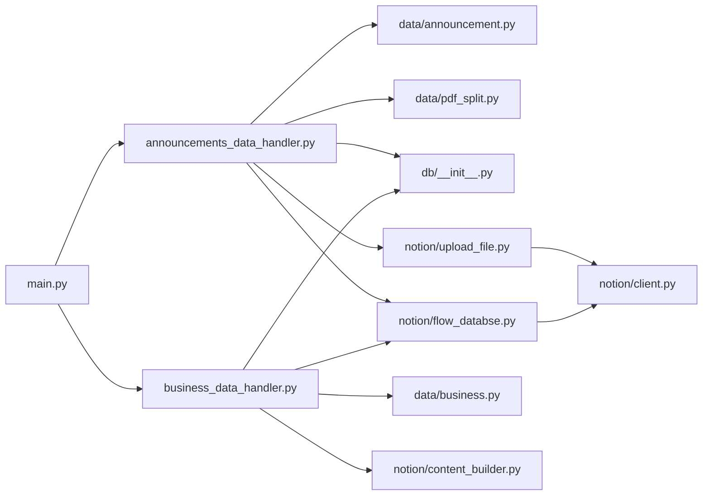

# 功能扩展开发

<cite>
**本文档引用的文件**
- [main.py](file://main.py)
- [announcements_data_handler.py](file://core/announcements_data_handler.py)
- [business_data_handler.py](file://core/business_data_handler.py)
- [announcement.py](file://core/data/announcement.py)
- [business.py](file://core/data/business.py)
- [pdf_split.py](file://core/data/pdf_split.py)
- [__init__.py](file://core/db/__init__.py)
- [client.py](file://core/notion/client.py)
- [upload_file.py](file://core/notion/upload_file.py)
- [content_builder.py](file://core/notion/content_builder.py)
- [flow_databse.py](file://core/notion/flow_databse.py)
- [__init__.py](file://core/models/__init__.py)
</cite>

## 目录
1. [简介](#简介)
2. [项目结构](#项目结构)
3. [核心组件](#核心组件)
4. [架构概览](#架构概览)
5. [详细组件分析](#详细组件分析)
6. [依赖关系分析](#依赖关系分析)
7. [性能考量](#性能考量)
8. [故障排除指南](#故障排除指南)
9. [结论](#结论)
10. [附录](#附录)

## 简介
本指南面向希望在现有股票公告自动化系统上进行功能扩展的开发者。系统采用异步架构，围绕“数据采集-处理-上传-页面创建”的流水线工作，支持公告数据与主营构成数据的自动化处理，并通过 Notion 数据流数据库进行统一呈现。本文档重点阐述如何在现有架构基础上添加新功能模块，包括新的数据源集成、自定义处理逻辑与业务规则扩展，明确系统的核心扩展点与接口规范，并提供可操作的扩展步骤与最佳实践。

## 项目结构
系统采用分层模块化组织，核心目录与职责如下：
- core/data：数据模型与数据源接口（公告、主营构成、PDF分割）
- core/db：本地数据库（SQLite）封装与哈希去重
- core/notion：Notion 客户端、文件上传、内容构建器、数据流页面创建
- core/scheduler：调度器入口（当前为空，便于后续扩展）
- tests：单元测试与集成测试（部分文件存在差异，建议统一命名）

图表来源
- [main.py](file://main.py#L20-L39)
- [announcements_data_handler.py](file://core/announcements_data_handler.py#L1-L116)
- [business_data_handler.py](file://core/business_data_handler.py#L1-L108)
- [announcement.py](file://core/data/announcement.py#L1-L141)
- [business.py](file://core/data/business.py#L1-L96)
- [pdf_split.py](file://core/data/pdf_split.py#L1-L128)
- [__init__.py](file://core/db/__init__.py#L1-L218)
- [client.py](file://core/notion/client.py#L1-L6)
- [upload_file.py](file://core/notion/upload_file.py#L1-L180)
- [content_builder.py](file://core/notion/content_builder.py#L1-L103)
- [flow_databse.py](file://core/notion/flow_databse.py#L1-L67)
- [__init__.py](file://core/models/__init__.py#L1-L8)

章节来源
- [main.py](file://main.py#L1-L40)
- [announcements_data_handler.py](file://core/announcements_data_handler.py#L1-L116)
- [business_data_handler.py](file://core/business_data_handler.py#L1-L108)

## 核心组件
- 数据采集与模型
  - 公告模型与接口：提供公告数据结构与查询接口，支持分页与过滤。
  - 主营业务数据模型与接口：提供主营构成数据结构与查询接口。
  - PDF 分割工具：对大文件进行分页切割，便于上传与展示。
- 处理器
  - 公告处理器：负责批量获取公告、按时间分组、文件上传（外链与本地）、创建 Notion 页面。
  - 主营业务处理器：负责周期性检查与更新、内容构建、页面创建与更新时间记录。
- 数据库与去重
  - 本地数据库封装：提供异步连接、初始化、更新时间查询与设置、哈希去重。
- Notion 集成
  - 客户端：基于 Notion Async Client。
  - 文件上传：支持外链直传与本地内容上传，具备轮询与重试机制。
  - 内容构建器：将表格与文本等结构化内容转换为 Notion Block。
  - 数据流页面创建：根据配置映射数据类型，创建页面并填充属性与子块。

章节来源
- [announcement.py](file://core/data/announcement.py#L12-L112)
- [business.py](file://core/data/business.py#L16-L95)
- [pdf_split.py](file://core/data/pdf_split.py#L15-L73)
- [announcements_data_handler.py](file://core/announcements_data_handler.py#L21-L115)
- [business_data_handler.py](file://core/business_data_handler.py#L17-L67)
- [__init__.py](file://core/db/__init__.py#L62-L215)
- [client.py](file://core/notion/client.py#L1-L6)
- [upload_file.py](file://core/notion/upload_file.py#L28-L176)
- [content_builder.py](file://core/notion/content_builder.py#L1-L103)
- [flow_databse.py](file://core/notion/flow_databse.py#L25-L66)

## 架构概览
系统采用“异步并发 + 分层职责”的架构设计：
- 入口模块负责初始化数据库与获取股票池，随后调用相应处理器。
- 处理器负责数据聚合、条件判断、文件处理与上传、页面创建。
- 数据层提供数据模型与接口，支持扩展新的数据源。
- 数据库层提供去重与更新时间控制，保证幂等与增量更新。
- Notion 层提供统一的页面创建与内容渲染能力。

图表来源
- [main.py](file://main.py#L20-L39)
- [announcements_data_handler.py](file://core/announcements_data_handler.py#L21-L115)
- [upload_file.py](file://core/notion/upload_file.py#L28-L176)
- [flow_databse.py](file://core/notion/flow_databse.py#L25-L66)

## 详细组件分析

### 公告处理流程扩展点
- 扩展目标
  - 新增公告数据源：在数据层新增接口与模型，适配新来源的数据结构。
  - 自定义处理逻辑：在处理器中增加条件分支或策略选择，以适配不同来源的公告特性。
  - 业务规则扩展：在上传与页面创建阶段增加过滤、重写或映射规则。
- 关键扩展点
  - 数据获取：在数据层新增 get_announcements 的变体或包装器，以适配新数据源。
  - 文件处理：在 PDF 分割策略中增加新的阈值或算法，或引入新的文件类型处理。
  - 上传策略：在文件上传模块中增加新的上传模式或重试策略。
  - 页面创建：在数据流页面创建中增加新的数据类型映射或属性填充逻辑。

图表来源
- [announcements_data_handler.py](file://core/announcements_data_handler.py#L21-L115)
- [pdf_split.py](file://core/data/pdf_split.py#L15-L73)
- [upload_file.py](file://core/notion/upload_file.py#L28-L176)
- [flow_databse.py](file://core/notion/flow_databse.py#L25-L66)

章节来源
- [announcements_data_handler.py](file://core/announcements_data_handler.py#L18-L115)
- [pdf_split.py](file://core/data/pdf_split.py#L15-L73)
- [upload_file.py](file://core/notion/upload_file.py#L28-L176)
- [flow_databse.py](file://core/notion/flow_databse.py#L25-L66)

### 主营业务处理流程扩展点
- 扩展目标
  - 新增数据源：在数据层新增 get_business 的变体，适配新的财务数据接口。
  - 自定义内容构建：在内容构建器中增加新的表格或块类型，以适配新字段。
  - 业务规则扩展：在更新时间判断中增加新的周期或条件。
- 关键扩展点
  - 数据获取：在数据层新增 get_business 的变体或包装器。
  - 内容构建：在内容构建器中增加新的 add_* 方法或表格列映射。
  - 更新策略：在处理器中增加新的 _should_update_* 规则或周期判断。

图表来源
- [business_data_handler.py](file://core/business_data_handler.py#L17-L67)
- [business.py](file://core/data/business.py#L33-L95)
- [content_builder.py](file://core/notion/content_builder.py#L1-L103)
- [flow_databse.py](file://core/notion/flow_databse.py#L25-L66)

章节来源
- [business_data_handler.py](file://core/business_data_handler.py#L17-L107)
- [business.py](file://core/data/business.py#L33-L95)
- [content_builder.py](file://core/notion/content_builder.py#L1-L103)

### 数据模型与接口规范
- 公告模型
  - 字段：id、stock、title、size、url、published_date。
  - 用途：承载公告数据，供处理器与上传模块使用。
- 主营业务数据模型
  - 字段：report_date、industry_df、product_df、region_df。
  - 用途：承载分行业、分产品、分地区的主营构成数据。
- 文件上传模型
  - 字段：url、title；扩展：file_id、successed、error。
  - 用途：承载上传任务与结果，便于统一处理。
- 接口规范
  - 数据获取接口：返回结构化数据，遵循命名元组约定。
  - 上传接口：支持外链直传与本地内容上传，返回统一结构。
  - 页面创建接口：接收标题、发布时间、来源接口、数据类型、关联关系、附件与正文内容。

章节来源
- [announcement.py](file://core/data/announcement.py#L12-L34)
- [business.py](file://core/data/business.py#L16-L31)
- [upload_file.py](file://core/notion/upload_file.py#L17-L26)
- [flow_databse.py](file://core/notion/flow_databse.py#L25-L66)

### 扩展现有函数：process_announcements_data_for_stock_list
- 目标：在不破坏现有流程的前提下，增加新的数据源、自定义处理逻辑与业务规则。
- 扩展步骤
  1) 新增数据源接口
     - 在数据层新增 get_announcements 的变体或包装器，返回与 Announcement 结构一致的数据。
     - 示例路径参考：[新增数据源接口](file://core/data/announcement.py#L36-L112)
  2) 新增文件处理策略
     - 在 PDF 分割模块中增加新的阈值或算法，或引入新的文件类型处理。
     - 示例路径参考：[PDF 分割策略](file://core/data/pdf_split.py#L15-L73)
  3) 新增上传策略
     - 在文件上传模块中增加新的上传模式或重试策略。
     - 示例路径参考：[文件上传策略](file://core/notion/upload_file.py#L28-L176)
  4) 新增业务规则
     - 在处理器中增加条件分支或策略选择，以适配不同来源的公告特性。
     - 示例路径参考：[公告处理流程](file://core/announcements_data_handler.py#L21-L115)
  5) 新增数据模型
     - 在 models 中新增类型别名或结构，确保类型安全与一致性。
     - 示例路径参考：[模型定义](file://core/models/__init__.py#L1-L8)
  6) 数据库与去重
     - 如需去重，使用数据库模块提供的哈希去重能力。
     - 示例路径参考：[__init__.py](file://core/db/__init__.py#L97-L128)

章节来源
- [announcements_data_handler.py](file://core/announcements_data_handler.py#L21-L115)
- [pdf_split.py](file://core/data/pdf_split.py#L15-L73)
- [upload_file.py](file://core/notion/upload_file.py#L28-L176)
- [__init__.py](file://core/db/__init__.py#L97-L128)
- [__init__.py](file://core/models/__init__.py#L1-L8)

### 设计原则与最佳实践
- 单一职责：每个模块专注于单一职责，避免跨层耦合。
- 开闭原则：对扩展开放，对修改封闭；通过接口与策略模式实现扩展。
- 异步优先：充分利用异步并发提升吞吐，减少 IO 等待。
- 幂等与去重：利用哈希去重与更新时间控制，保证重复运行的安全性。
- 可观测性：在关键节点记录日志，便于问题定位与性能分析。
- 向后兼容：新增功能尽量保持接口不变或提供默认行为，避免破坏既有流程。

## 依赖关系分析
系统模块间依赖清晰，数据层、处理器、数据库与 Notion 层职责分明，通过明确的接口进行交互。

图表来源
- [main.py](file://main.py#L20-L39)
- [announcements_data_handler.py](file://core/announcements_data_handler.py#L1-L116)
- [business_data_handler.py](file://core/business_data_handler.py#L1-L108)
- [announcement.py](file://core/data/announcement.py#L1-L141)
- [business.py](file://core/data/business.py#L1-L96)
- [pdf_split.py](file://core/data/pdf_split.py#L1-L128)
- [__init__.py](file://core/db/__init__.py#L1-L218)
- [upload_file.py](file://core/notion/upload_file.py#L1-L180)
- [content_builder.py](file://core/notion/content_builder.py#L1-L103)
- [flow_databse.py](file://core/notion/flow_databse.py#L1-L67)
- [client.py](file://core/notion/client.py#L1-L6)

章节来源
- [main.py](file://main.py#L20-L39)
- [announcements_data_handler.py](file://core/announcements_data_handler.py#L1-L116)
- [business_data_handler.py](file://core/business_data_handler.py#L1-L108)

## 性能考量
- 异步并发：处理器通过 asyncio.gather 并发执行任务，显著提升吞吐。
- 分批上传：文件上传模块支持批量上传与分页上传，减少网络开销。
- 缓存与去重：数据层与数据库层结合，减少重复请求与重复入库。
- 轮询与重试：文件上传模块采用指数退避轮询，提高成功率与稳定性。
- 时间分组：公告处理器按最后更新时间分组，减少重复查询与网络请求。

## 故障排除指南
- 数据库初始化失败
  - 检查数据库路径与权限，确认初始化函数已执行。
  - 参考路径：[__init__.py](file://core/db/__init__.py#L62-L94)
- 文件上传失败
  - 查看上传模块日志，确认外链可用性与 Notion Token 配置。
  - 参考路径：[upload_file.py](file://core/notion/upload_file.py#L124-L176)
- 页面创建失败
  - 检查数据类型映射与必需属性，确认 Notion 数据库 ID 配置。
  - 参考路径：[flow_databse.py](file://core/notion/flow_databse.py#L25-L66)
- 公告处理异常
  - 检查公告接口返回与过滤逻辑，确认时间范围与分组策略。
  - 参考路径：[announcements_data_handler.py](file://core/announcements_data_handler.py#L21-L115)

章节来源
- [__init__.py](file://core/db/__init__.py#L62-L94)
- [upload_file.py](file://core/notion/upload_file.py#L124-L176)
- [flow_databse.py](file://core/notion/flow_databse.py#L25-L66)
- [announcements_data_handler.py](file://core/announcements_data_handler.py#L21-L115)

## 结论
通过明确的扩展点与接口规范，系统能够在不破坏现有流程的前提下，平滑地集成新的数据源、自定义处理逻辑与业务规则。建议在扩展时遵循单一职责、开闭原则与异步优先的设计原则，并充分利用数据库去重与上传模块的重试机制，确保系统的稳定性与可维护性。

## 附录
- 版本管理策略
  - 语义化版本：小版本用于新增功能，补丁版本用于修复与优化。
  - 向后兼容：新增功能提供默认行为，避免破坏既有流程。
  - 测试覆盖：新增功能需配套单元测试与集成测试，确保质量。
- 环境变量
  - NOTION_TOKEN：Notion API 密钥。
  - FLOW_DATABASE：数据流数据库 ID。
- 依赖安装
  - 建议使用虚拟环境安装依赖，确保版本一致性。