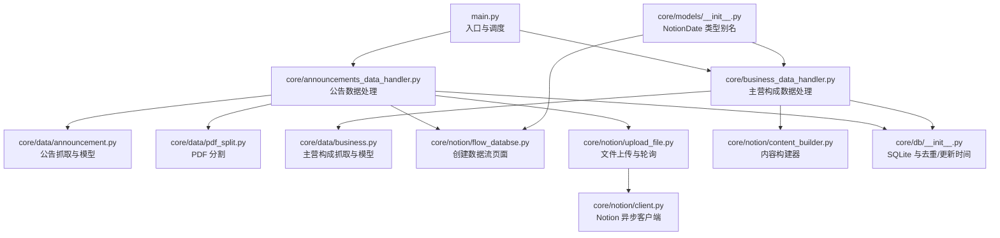
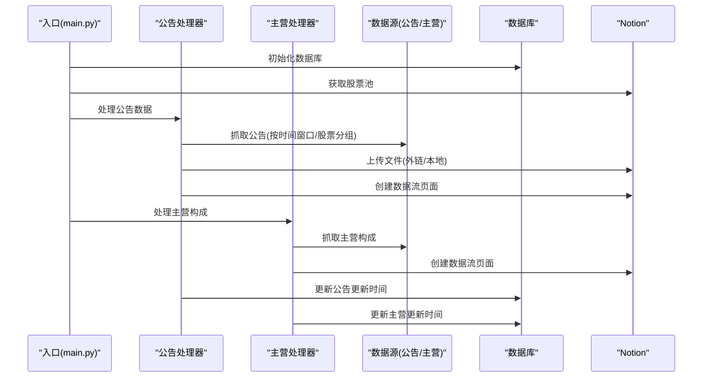
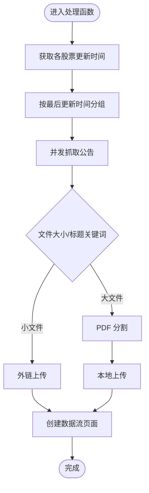
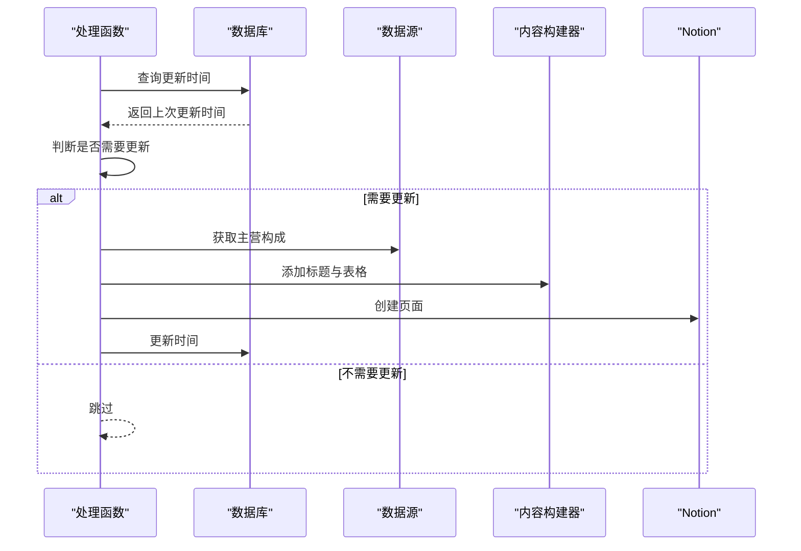
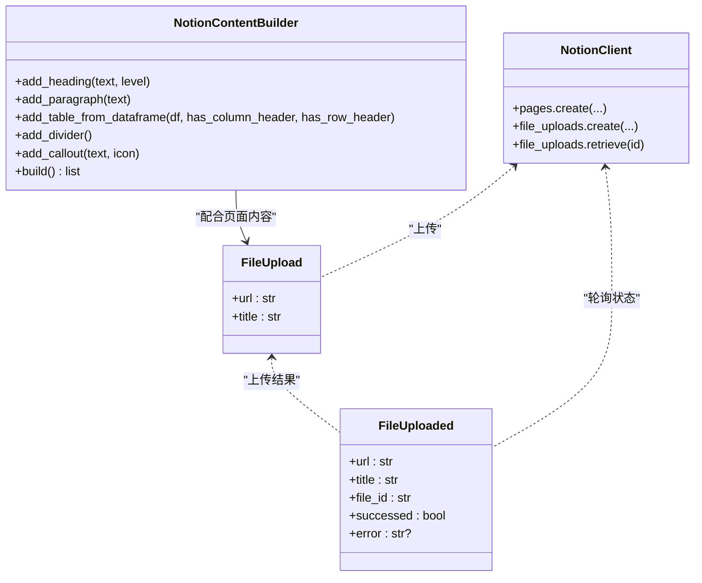
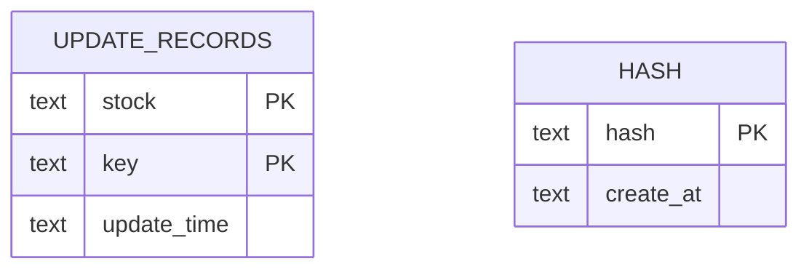
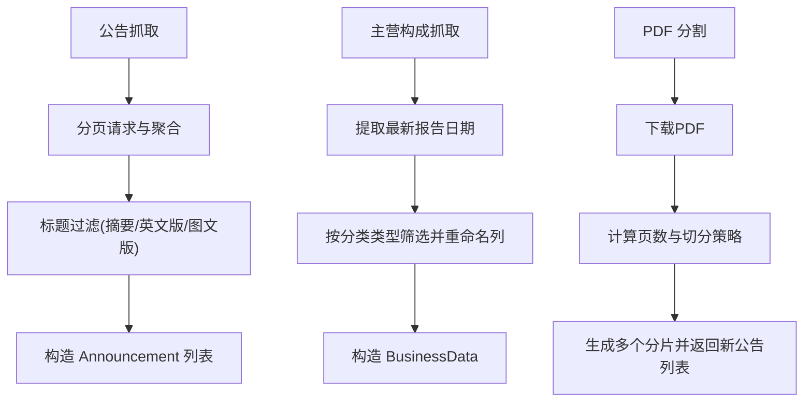
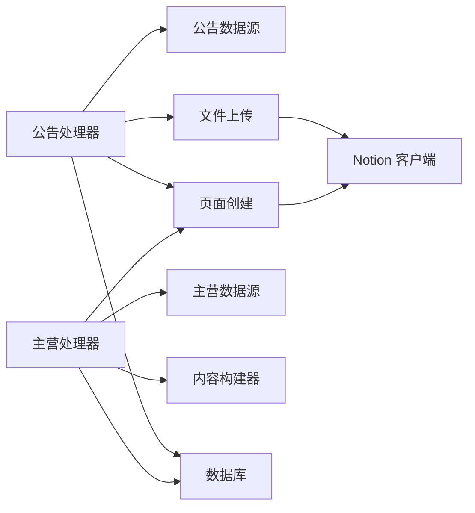

# 扩展开发指南

<cite>
**本文引用的文件**
- [main.py](file://main.py)
- [announcements_data_handler.py](file://core/announcements_data_handler.py)
- [business_data_handler.py](file://core/business_data_handler.py)
- [announcement.py](file://core/data/announcement.py)
- [business.py](file://core/data/business.py)
- [pdf_split.py](file://core/data/pdf_split.py)
- [client.py](file://core/notion/client.py)
- [content_builder.py](file://core/notion/content_builder.py)
- [flow_databse.py](file://core/notion/flow_databse.py)
- [upload_file.py](file://core/notion/upload_file.py)
- [__init__.py](file://core/db/__init__.py)
- [__init__.py](file://core/models/__init__.py)
</cite>

## 目录
1. [简介](#简介)
2. [项目结构](#项目结构)
3. [核心组件](#核心组件)
4. [架构总览](#架构总览)
5. [详细组件分析](#详细组件分析)
6. [依赖关系分析](#依赖关系分析)
7. [性能考量](#性能考量)
8. [故障排除指南](#故障排除指南)
9. [结论](#结论)
10. [附录](#附录)

## 简介
本指南面向希望为股票公告自动化系统进行扩展开发的工程师，目标是帮助你：
- 添加新功能与数据源
- 集成第三方服务
- 开发自定义插件与扩展点
- 理解系统的扩展点、钩子机制与插件架构
- 实施新数据源的接入流程
- 开发自定义文件处理策略
- 扩展 Notion 数据库字段
- 提供代码模板、最佳实践与设计模式
- 保障向后兼容性、版本管理与 API 稳定性
- 规范贡献流程、代码评审与发布流程

## 项目结构
系统采用模块化分层组织，核心职责划分如下：
- 核心入口：负责初始化数据库、拉取股票池、调度各数据处理器
- 数据层：封装不同数据源的抓取与转换逻辑（公告、主营构成、PDF 分割）
- Notion 集成层：封装 Notion 客户端、页面创建、文件上传与轮询
- 数据库层：维护更新时间与去重哈希表
- 模型层：统一 Notion 日期类型别名

图表来源
- [main.py](file://main.py#L20-L39)
- [announcements_data_handler.py](file://core/announcements_data_handler.py#L21-L116)
- [business_data_handler.py](file://core/business_data_handler.py#L17-L108)
- [announcement.py](file://core/data/announcement.py#L36-L112)
- [business.py](file://core/data/business.py#L33-L95)
- [pdf_split.py](file://core/data/pdf_split.py#L15-L73)
- [flow_databse.py](file://core/notion/flow_databse.py#L25-L67)
- [upload_file.py](file://core/notion/upload_file.py#L28-L179)
- [content_builder.py](file://core/notion/content_builder.py#L1-L103)
- [client.py](file://core/notion/client.py#L1-L6)
- [__init__.py](file://core/db/__init__.py#L62-L217)
- [__init__.py](file://core/models/__init__.py#L1-L8)

章节来源
- [main.py](file://main.py#L1-L40)
- [__init__.py](file://core/db/__init__.py#L1-L218)
- [__init__.py](file://core/models/__init__.py#L1-L8)

## 核心组件
- 入口与调度：初始化数据库，获取股票池，调度公告与主营构成处理流程
- 公告数据处理器：按股票与时间窗口批量抓取公告，区分外链与本地上传，PDF 分割与分页
- 主营构成处理器：按半年周期判断是否更新，使用内容构建器生成页面
- 数据源适配层：公告与主营构成的数据抓取与清洗
- Notion 集成层：页面创建、文件上传、轮询与状态管理
- 数据库层：更新时间记录、去重哈希表
- 模型层：NotionDate 类型别名

章节来源
- [main.py](file://main.py#L20-L39)
- [announcements_data_handler.py](file://core/announcements_data_handler.py#L21-L116)
- [business_data_handler.py](file://core/business_data_handler.py#L17-L108)
- [announcement.py](file://core/data/announcement.py#L36-L112)
- [business.py](file://core/data/business.py#L33-L95)
- [flow_databse.py](file://core/notion/flow_databse.py#L25-L67)
- [upload_file.py](file://core/notion/upload_file.py#L28-L179)
- [__init__.py](file://core/db/__init__.py#L62-L217)
- [__init__.py](file://core/models/__init__.py#L1-L8)

## 架构总览
系统采用“数据源 → 处理器 → Notion 页面”的流水线式架构，异步并发提升吞吐，数据库记录更新时间与去重。

图表来源
- [main.py](file://main.py#L20-L39)
- [announcements_data_handler.py](file://core/announcements_data_handler.py#L21-L116)
- [business_data_handler.py](file://core/business_data_handler.py#L17-L108)
- [flow_databse.py](file://core/notion/flow_databse.py#L25-L67)
- [upload_file.py](file://core/notion/upload_file.py#L28-L179)
- [__init__.py](file://core/db/__init__.py#L153-L217)

## 详细组件分析

### 组件A：公告数据处理器
职责与流程要点：
- 按股票与时间窗口分组抓取公告，减少接口调用次数
- 区分小文件与大文件：小文件走外链上传；大文件按关键词触发 PDF 分割
- 并发上传与页面创建，提升吞吐
- 使用数据库记录更新时间，支持增量更新

图表来源
- [announcements_data_handler.py](file://core/announcements_data_handler.py#L21-L116)
- [pdf_split.py](file://core/data/pdf_split.py#L15-L73)
- [upload_file.py](file://core/notion/upload_file.py#L28-L179)
- [flow_databse.py](file://core/notion/flow_databse.py#L25-L67)

章节来源
- [announcements_data_handler.py](file://core/announcements_data_handler.py#L21-L116)
- [pdf_split.py](file://core/data/pdf_split.py#L15-L73)
- [upload_file.py](file://core/notion/upload_file.py#L28-L179)
- [flow_databse.py](file://core/notion/flow_databse.py#L25-L67)

### 组件B：主营构成处理器
职责与流程要点：
- 按半年周期判断是否需要更新
- 使用内容构建器生成三张表格（行业/产品/地区）
- 创建数据流页面并更新数据库中的更新时间

图表来源
- [business_data_handler.py](file://core/business_data_handler.py#L17-L108)
- [content_builder.py](file://core/notion/content_builder.py#L1-L103)
- [flow_databse.py](file://core/notion/flow_databse.py#L25-L67)
- [__init__.py](file://core/db/__init__.py#L153-L217)

章节来源
- [business_data_handler.py](file://core/business_data_handler.py#L17-L108)
- [content_builder.py](file://core/notion/content_builder.py#L1-L103)
- [flow_databse.py](file://core/notion/flow_databse.py#L25-L67)
- [__init__.py](file://core/db/__init__.py#L153-L217)

### 组件C：Notion 集成层
- 客户端：基于异步 SDK 初始化
- 页面创建：根据数据类型映射 select 值，支持附件与正文块
- 文件上传：支持外链与本地上传，带轮询与指数退避重试
- 内容构建器：提供标题、段落、表格、分隔线、Callout 等构建方法

图表来源
- [content_builder.py](file://core/notion/content_builder.py#L1-L103)
- [upload_file.py](file://core/notion/upload_file.py#L17-L179)
- [client.py](file://core/notion/client.py#L1-L6)
- [flow_databse.py](file://core/notion/flow_databse.py#L25-L67)

章节来源
- [content_builder.py](file://core/notion/content_builder.py#L1-L103)
- [upload_file.py](file://core/notion/upload_file.py#L17-L179)
- [client.py](file://core/notion/client.py#L1-L6)
- [flow_databse.py](file://core/notion/flow_databse.py#L25-L67)

### 组件D：数据库层
- 初始化：创建 update_records 与 hash 两张表
- 更新时间：按股票+键查询与更新
- 去重：计算内容哈希，避免重复导入
- 事务：异步上下文管理器确保提交/回滚

图表来源
- [__init__.py](file://core/db/__init__.py#L77-L93)
- [__init__.py](file://core/db/__init__.py#L153-L217)
- [__init__.py](file://core/db/__init__.py#L97-L151)

章节来源
- [__init__.py](file://core/db/__init__.py#L62-L217)

### 组件E：数据源适配层
- 公告：封装巨潮资讯网接口，支持分页与过滤
- 主营构成：封装第三方库接口，提取行业/产品/地区三类报表
- PDF 分割：按页数与重叠策略切分，支持本地上传

图表来源
- [announcement.py](file://core/data/announcement.py#L36-L112)
- [business.py](file://core/data/business.py#L33-L95)
- [pdf_split.py](file://core/data/pdf_split.py#L15-L73)

章节来源
- [announcement.py](file://core/data/announcement.py#L36-L112)
- [business.py](file://core/data/business.py#L33-L95)
- [pdf_split.py](file://core/data/pdf_split.py#L15-L73)

## 依赖关系分析
- 模块耦合：处理器依赖数据源与 Notion 客户端；数据库提供更新时间与去重能力
- 外部依赖：HTTP 客户端、PDF 处理库、Notion 异步 SDK、第三方数据源
- 可能的循环依赖：当前结构清晰，未发现循环导入

图表来源
- [announcements_data_handler.py](file://core/announcements_data_handler.py#L7-L16)
- [business_data_handler.py](file://core/business_data_handler.py#L4-L12)
- [upload_file.py](file://core/notion/upload_file.py#L1-L10)
- [flow_databse.py](file://core/notion/flow_databse.py#L1-L12)
- [client.py](file://core/notion/client.py#L1-L6)
- [__init__.py](file://core/db/__init__.py#L1-L218)

章节来源
- [announcements_data_handler.py](file://core/announcements_data_handler.py#L7-L16)
- [business_data_handler.py](file://core/business_data_handler.py#L4-L12)
- [upload_file.py](file://core/notion/upload_file.py#L1-L10)
- [flow_databse.py](file://core/notion/flow_databse.py#L1-L12)
- [client.py](file://core/notion/client.py#L1-L6)
- [__init__.py](file://core/db/__init__.py#L1-L218)

## 性能考量
- 并发与批处理：公告抓取与文件上传均采用并发，显著提升吞吐
- 增量更新：通过数据库记录更新时间，避免重复抓取
- 去重：基于内容哈希，防止重复导入
- 轮询与退避：文件上传采用指数退避，平衡 Notion 导入队列压力
- PDF 分割：合理设置分片大小与重叠页，兼顾上传成功率与检索体验

[本节为通用指导，无需列出章节来源]

## 故障排除指南
- Notion 页面创建失败：检查数据类型映射、数据库环境变量、页面属性完整性
- 文件上传失败：查看轮询状态与错误信息，确认 URL 可达性与 Notion 导入队列
- 公告抓取异常：检查接口返回与分页逻辑，确认过滤条件与时间窗口
- 数据库事务问题：确保使用异步上下文管理器，避免未提交或未回滚

章节来源
- [flow_databse.py](file://core/notion/flow_databse.py#L59-L67)
- [upload_file.py](file://core/notion/upload_file.py#L153-L176)
- [announcement.py](file://core/data/announcement.py#L79-L112)
- [__init__.py](file://core/db/__init__.py#L28-L52)

## 结论
本系统通过清晰的模块边界与异步并发设计，实现了从数据源到 Notion 页面的高效自动化。扩展开发应遵循以下原则：
- 明确扩展点与接口契约
- 保持向后兼容与 API 稳定性
- 优先使用并发与去重策略
- 严格遵循贡献流程与评审标准

[本节为总结，无需列出章节来源]

## 附录

### A. 新数据源集成步骤
- 定义数据模型：参考现有命名元组与数据类
- 实现抓取函数：封装请求、分页与过滤逻辑
- 注册到处理器：在相应处理器中调用抓取函数
- 集成 Notion：使用内容构建器或页面创建接口
- 更新数据库：记录更新时间，必要时加入去重逻辑
- 编写测试：覆盖正常路径与异常路径

章节来源
- [announcement.py](file://core/data/announcement.py#L12-L34)
- [business.py](file://core/data/business.py#L16-L31)
- [flow_databse.py](file://core/notion/flow_databse.py#L25-L67)
- [__init__.py](file://core/db/__init__.py#L153-L217)

### B. 自定义文件处理策略
- 外链上传：适合小文件，直接创建外链
- 本地上传：适合大文件，结合 PDF 分割策略
- 轮询与重试：指数退避，避免频繁重试
- 分片策略：根据页面限制与重叠页策略调整

章节来源
- [upload_file.py](file://core/notion/upload_file.py#L28-L179)
- [pdf_split.py](file://core/data/pdf_split.py#L15-L73)

### C. Notion 数据库字段扩展
- 数据类型映射：在页面创建处增加映射项
- 页面属性：标题、发布时间、来源接口、数据类型、关联股票、附件、原文链接、正文块
- 内容块：使用内容构建器添加表格、标题、段落等

章节来源
- [flow_databse.py](file://core/notion/flow_databse.py#L14-L67)
- [content_builder.py](file://core/notion/content_builder.py#L1-L103)

### D. 代码模板与最佳实践
- 处理器模板：参考现有处理器的并发抓取与页面创建模式
- 数据源模板：封装请求、分页、过滤与模型转换
- 插件接口：定义统一的抓取与导入接口，便于替换与扩展
- 日志与错误：统一日志级别与错误处理，便于排障

章节来源
- [announcements_data_handler.py](file://core/announcements_data_handler.py#L21-L116)
- [business_data_handler.py](file://core/business_data_handler.py#L17-L108)
- [announcement.py](file://core/data/announcement.py#L36-L112)
- [upload_file.py](file://core/notion/upload_file.py#L153-L176)

### E. 向后兼容性与版本管理
- API 稳定性：保持函数签名与返回结构稳定
- 版本标记：通过模块版本或配置项管理
- 迁移策略：提供平滑迁移方案与降级路径
- 测试覆盖：确保回归测试与集成测试完备

[本节为通用指导，无需列出章节来源]

### F. 贡献流程、评审与发布
- 提交规范：功能分支、清晰提交信息、最小变更集
- 代码评审：关注扩展点设计、性能影响、错误处理与测试
- 测试要求：单元测试、集成测试与手动验证
- 发布流程：版本标签、变更日志与部署验证

[本节为通用指导，无需列出章节来源]