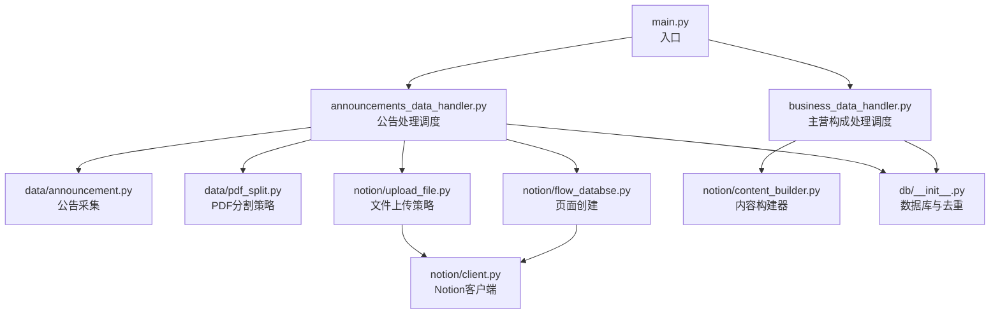
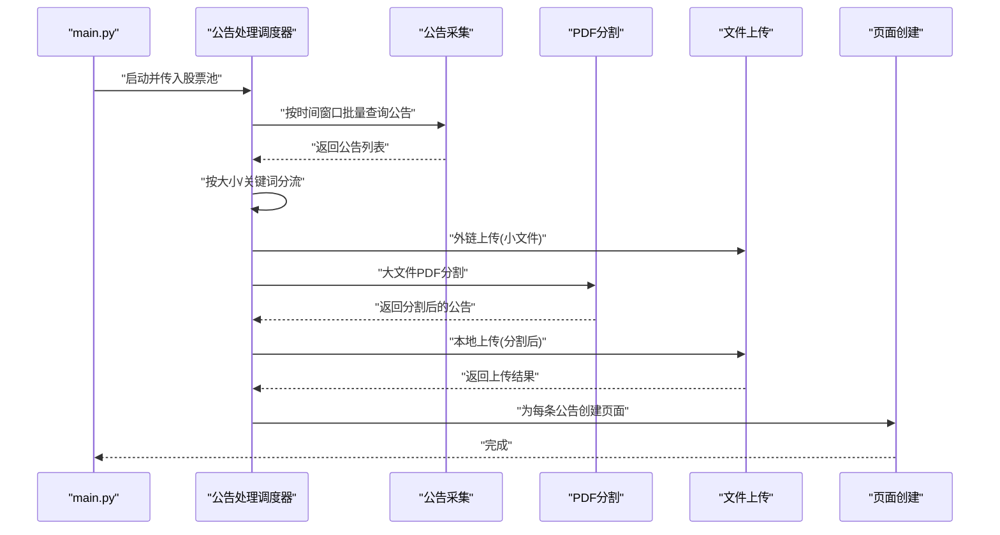
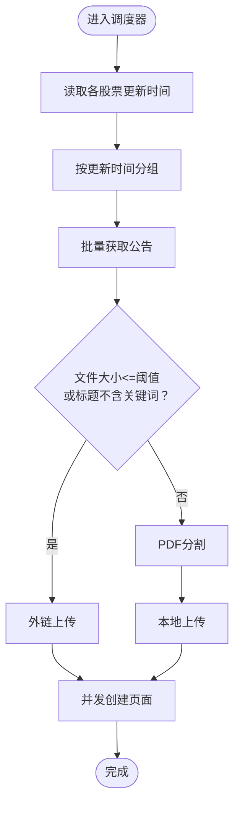
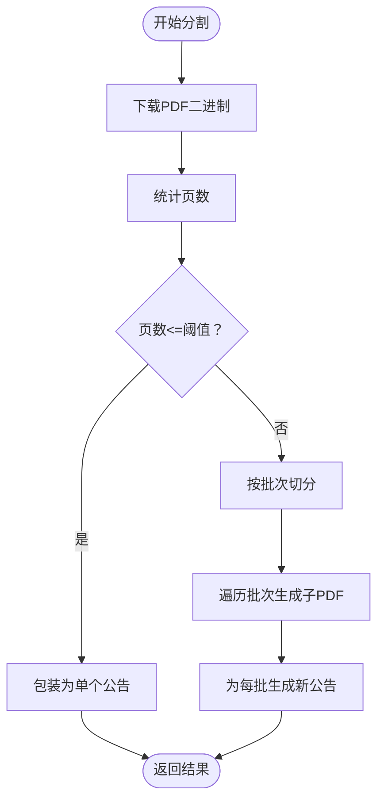
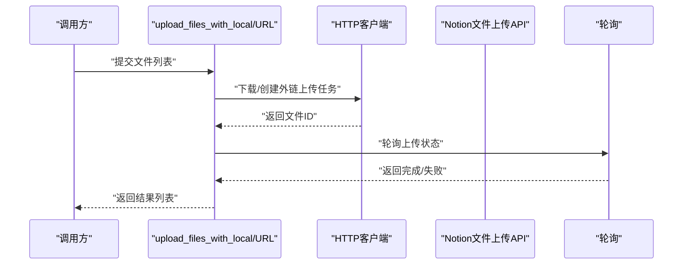
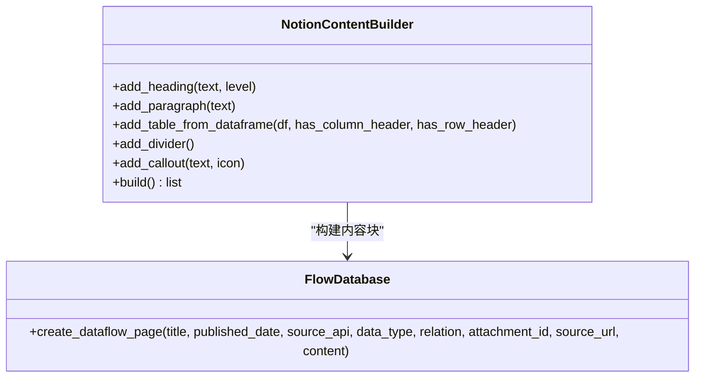
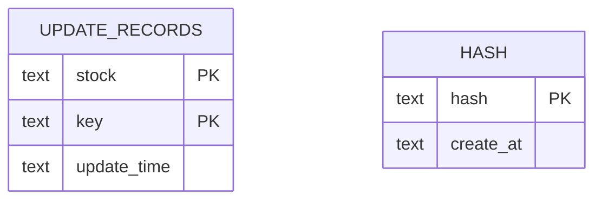
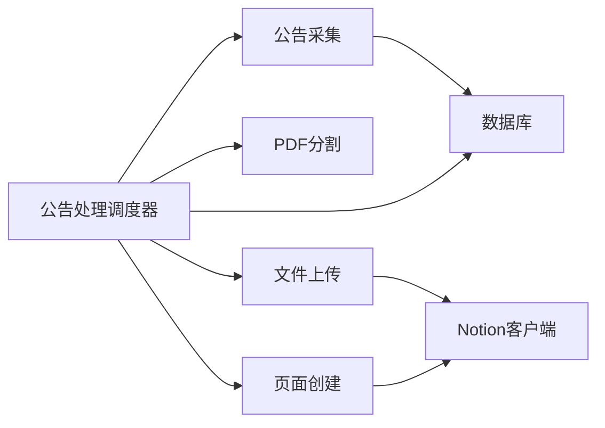

# 插件开发框架

<cite>
**本文引用的文件**
- [main.py](file://main.py)
- [announcements_data_handler.py](file://core/announcements_data_handler.py)
- [business_data_handler.py](file://core/business_data_handler.py)
- [pdf_split.py](file://core/data/pdf_split.py)
- [announcement.py](file://core/data/announcement.py)
- [upload_file.py](file://core/notion/upload_file.py)
- [flow_databse.py](file://core/notion/flow_databse.py)
- [content_builder.py](file://core/notion/content_builder.py)
- [client.py](file://core/notion/client.py)
- [__init__.py (数据库)](file://core/db/__init__.py)
- [__init__.py (模型)](file://core/models/__init__.py)
</cite>

## 目录
1. [简介](#简介)
2. [项目结构](#项目结构)
3. [核心组件](#核心组件)
4. [架构总览](#架构总览)
5. [详细组件分析](#详细组件分析)
6. [依赖关系分析](#依赖关系分析)
7. [性能考量](#性能考量)
8. [故障排查指南](#故障排查指南)
9. [结论](#结论)
10. [附录](#附录)

## 简介
本指南面向希望为股票公告自动化系统开发“插件”的开发者，目标是提供一套可扩展、可维护的插件开发框架。系统当前采用策略模式与异步并发处理相结合的方式，围绕“数据采集—文件处理—上传—页面创建”主流程组织模块。本文将基于现有代码，给出插件接口定义、生命周期管理、动态加载机制、配置与依赖注入、错误隔离、最佳实践、性能优化与调试技巧，并覆盖插件打包、分发与版本管理的完整流程。

## 项目结构
系统采用按功能域划分的目录结构，核心模块如下：
- core/data：数据模型与数据采集策略（公告、PDF分割）
- core/notion：Notion集成（上传、页面创建、内容构建）
- core/db：本地SQLite持久化与去重
- core/models：类型别名与通用类型
- 核心调度入口：main.py

图表来源
- [main.py](file://main.py#L20-L39)
- [announcements_data_handler.py](file://core/announcements_data_handler.py#L21-L115)
- [business_data_handler.py](file://core/business_data_handler.py#L17-L67)
- [announcement.py](file://core/data/announcement.py#L36-L112)
- [pdf_split.py](file://core/data/pdf_split.py#L15-L73)
- [upload_file.py](file://core/notion/upload_file.py#L28-L61)
- [flow_databse.py](file://core/notion/flow_databse.py#L25-L66)
- [content_builder.py](file://core/notion/content_builder.py#L1-L102)
- [client.py](file://core/notion/client.py#L1-L5)
- [__init__.py (数据库)](file://core/db/__init__.py#L62-L94)

章节来源
- [main.py](file://main.py#L1-L40)
- [announcements_data_handler.py](file://core/announcements_data_handler.py#L1-L116)
- [business_data_handler.py](file://core/business_data_handler.py#L1-L108)

## 核心组件
- 数据采集层
  - 公告采集：异步HTTP请求，聚合分页结果，过滤非正文类型，构造Announcement对象。
  - 主营构成采集：按半年周期判断是否需要更新，构建Notion内容块。
- 文件处理层
  - PDF分割：根据页数阈值决定整份或分片上传；分片策略支持重叠页避免跨页断档。
- 上传与页面层
  - 本地/外链上传：统一异步上传接口，带轮询与错误收集；页面创建：属性映射与内容块写入。
- 存储与去重层
  - SQLite记录更新时间；基于xxhash的重复数据检测与去重。

章节来源
- [announcement.py](file://core/data/announcement.py#L36-L112)
- [business_data_handler.py](file://core/business_data_handler.py#L17-L67)
- [pdf_split.py](file://core/data/pdf_split.py#L15-L73)
- [upload_file.py](file://core/notion/upload_file.py#L28-L61)
- [flow_databse.py](file://core/notion/flow_databse.py#L25-L66)
- [__init__.py (数据库)](file://core/db/__init__.py#L97-L128)

## 架构总览
系统采用“策略+编排”的架构：
- 策略模式：PDF分割、文件上传（本地/URL）、公告采集等均以函数/模块形式提供可替换实现。
- 编排器：公告处理调度器负责时间窗口分组、并发任务编排、条件分流（大文件走分割，小文件直链）。
- 异步并发：大量I/O操作通过asyncio.gather并行执行，提升吞吐。
- 错误隔离：单条公告/文件失败不影响整体流程，日志与返回结构记录失败原因。

图表来源
- [main.py](file://main.py#L20-L39)
- [announcements_data_handler.py](file://core/announcements_data_handler.py#L21-L115)
- [upload_file.py](file://core/notion/upload_file.py#L28-L61)
- [pdf_split.py](file://core/data/pdf_split.py#L15-L73)
- [flow_databse.py](file://core/notion/flow_databse.py#L25-L66)

## 详细组件分析

### 组件A：公告处理调度器（策略编排）
职责
- 计算各股票的更新时间窗口，按时间分组批量查询，减少API调用次数。
- 根据公告大小与标题关键词分流：小文件直链上传；大文件PDF分割后再上传。
- 并发创建Notion页面，汇总上传结果。

关键流程
- 时间窗口分组与批量查询
- 条件分流与并发任务创建
- 并发等待与结果汇总

图表来源
- [announcements_data_handler.py](file://core/announcements_data_handler.py#L21-L115)

章节来源
- [announcements_data_handler.py](file://core/announcements_data_handler.py#L21-L115)

### 组件B：PDF分割策略（策略模式）
职责
- 将大PDF按固定页数切分为多个子PDF，支持重叠页避免跨页断档。
- 为每个子PDF生成新的Announcement对象，保留原公告的股票、时间等元信息。

复杂度与性能
- 时间复杂度：O(n)页扫描 + O(m)次子PDF保存，m为切片数量。
- 空间复杂度：O(m)内存缓冲，受CHUNK_SIZE与REP_SIZE控制。

图表来源
- [pdf_split.py](file://core/data/pdf_split.py#L15-L73)

章节来源
- [pdf_split.py](file://core/data/pdf_split.py#L15-L73)

### 组件C：文件上传策略（策略模式）
职责
- 提供两类上传策略：外链直传与本地下载后上传。
- 统一返回结构，包含上传状态、文件ID与错误信息。
- 内置轮询与指数退避，提升上传成功率。

图表来源
- [upload_file.py](file://core/notion/upload_file.py#L28-L61)
- [upload_file.py](file://core/notion/upload_file.py#L124-L150)

章节来源
- [upload_file.py](file://core/notion/upload_file.py#L28-L61)
- [upload_file.py](file://core/notion/upload_file.py#L124-L150)

### 组件D：页面创建与内容构建
职责
- 将采集/处理后的数据写入Notion数据流数据库，支持标题、日期、来源接口、数据类型、关联股票、附件与正文内容。
- 内容构建器支持标题、段落、表格、分隔线、Callout等块类型。

图表来源
- [content_builder.py](file://core/notion/content_builder.py#L1-L102)
- [flow_databse.py](file://core/notion/flow_databse.py#L25-L66)

章节来源
- [content_builder.py](file://core/notion/content_builder.py#L1-L102)
- [flow_databse.py](file://core/notion/flow_databse.py#L25-L66)

### 组件E：数据库与去重
职责
- 初始化SQLite表结构，提供异步连接上下文管理。
- 记录各股票的数据更新时间，支持批量查询与设置。
- 基于xxhash对数据内容计算哈希，实现去重。

图表来源
- [__init__.py (数据库)](file://core/db/__init__.py#L77-L93)
- [__init__.py (数据库)](file://core/db/__init__.py#L153-L185)

章节来源
- [__init__.py (数据库)](file://core/db/__init__.py#L62-L94)
- [__init__.py (数据库)](file://core/db/__init__.py#L97-L128)
- [__init__.py (数据库)](file://core/db/__init__.py#L153-L185)
- [__init__.py (数据库)](file://core/db/__init__.py#L188-L215)

## 依赖关系分析
- 模块耦合
  - 调度器依赖数据采集、PDF分割、上传与页面创建模块。
  - 上传模块依赖Notion客户端；页面创建依赖类型映射与日期转换。
  - 数据采集与业务处理依赖数据库模块进行更新时间管理。
- 外部依赖
  - httpx、aiohttp风格的异步HTTP客户端
  - pymupdf用于PDF处理
  - notion_client用于Notion API交互
  - aiosqlite用于异步SQLite访问

图表来源
- [announcements_data_handler.py](file://core/announcements_data_handler.py#L7-L16)
- [upload_file.py](file://core/notion/upload_file.py#L1-L11)
- [flow_databse.py](file://core/notion/flow_databse.py#L1-L12)
- [client.py](file://core/notion/client.py#L1-L5)
- [__init__.py (数据库)](file://core/db/__init__.py#L1-L10)

章节来源
- [announcements_data_handler.py](file://core/announcements_data_handler.py#L7-L16)
- [upload_file.py](file://core/notion/upload_file.py#L1-L11)
- [flow_databse.py](file://core/notion/flow_databse.py#L1-L12)
- [client.py](file://core/notion/client.py#L1-L5)
- [__init__.py (数据库)](file://core/db/__init__.py#L1-L10)

## 性能考量
- 并发与批量化
  - 批量查询公告：按更新时间分组，减少API调用次数。
  - 并发上传与页面创建：使用asyncio.gather提升吞吐。
- I/O优化
  - PDF分割采用内存缓冲（BytesIO），避免磁盘IO。
  - 上传轮询采用指数退避，平衡Notion服务压力与响应速度。
- 存储与去重
  - 使用xxhash快速计算内容哈希，配合SQLite批量插入，降低重复数据处理成本。
- 策略参数
  - CHUNK_SIZE/REP_SIZE/BATCH_SIZE等参数直接影响性能与稳定性，需结合实际网络与Notion配额调整。

章节来源
- [announcements_data_handler.py](file://core/announcements_data_handler.py#L40-L62)
- [pdf_split.py](file://core/data/pdf_split.py#L11-L12)
- [upload_file.py](file://core/notion/upload_file.py#L13-L14)
- [__init__.py (数据库)](file://core/db/__init__.py#L97-L128)

## 故障排查指南
- 日志与错误收集
  - 上传失败：记录文件标题与错误详情，便于定位问题。
  - 页面创建失败：捕获异常并输出错误信息。
  - PDF分割异常：记录失败公告标题并保留原始公告，避免中断流程。
- 常见问题
  - Notion上传轮询超时：检查轮询间隔与最大尝试次数配置。
  - 外链不可访问：确认公告URL有效性与CDN可达性。
  - 数据库连接异常：检查SQLite路径与权限。
- 调试技巧
  - 开启DEBUG日志级别，观察各阶段耗时与状态。
  - 逐步缩小问题范围：先验证数据采集，再验证上传，最后验证页面创建。
  - 单元测试：针对PDF分割与上传策略编写独立测试用例。

章节来源
- [upload_file.py](file://core/notion/upload_file.py#L153-L176)
- [flow_databse.py](file://core/notion/flow_databse.py#L65-L66)
- [pdf_split.py](file://core/data/pdf_split.py#L68-L72)

## 结论
本系统通过策略模式与异步编排实现了高内聚、低耦合的插件化架构。开发者可在不修改核心调度器的前提下，替换或扩展数据采集、文件处理与上传策略，满足不同业务场景需求。建议在后续版本中引入插件注册中心、配置中心与插件生命周期钩子，进一步增强可扩展性与可观测性。

## 附录

### 插件开发模板与规范
- 插件接口定义
  - 文件处理插件：接收原始公告列表，返回处理后的公告列表（可包含新增分片）。
  - 上传插件：接收文件信息列表，返回上传结果列表（包含状态、文件ID、错误信息）。
  - 数据转换插件：接收原始数据，返回结构化数据或内容块。
  - 通知插件：接收事件与结果，触发通知动作（邮件、消息队列等）。
- 生命周期管理
  - 初始化：加载配置、建立连接、预热缓存。
  - 执行：处理单批次数据，返回结果。
  - 销毁：释放资源、清理临时文件。
- 动态加载机制
  - 插件发现：扫描插件目录，导入模块并实例化。
  - 注册：将插件注册到调度器的策略表中，按名称或类型选择。
  - 卸载：在运行时可禁用或卸载插件，不影响其他插件。
- 配置管理
  - 环境变量：NOTION_TOKEN、FLOW_DATABASE等。
  - 插件配置：通过配置文件或环境变量传递插件参数（如PDF切分阈值、上传超时等）。
- 依赖注入
  - 将HTTP客户端、数据库连接、Notion客户端等作为依赖注入到插件构造函数中，便于测试与替换。
- 错误隔离
  - 每个插件独立try-catch，记录错误并返回结构化结果，避免影响其他插件。
- 最佳实践
  - 明确插件职责边界，单一职责原则。
  - 使用异步与并发，充分利用I/O并行能力。
  - 严格输入校验与输出归一化，保证与其他插件兼容。
  - 编写单元测试与集成测试，覆盖正常与异常路径。
- 性能优化建议
  - 合理设置批大小与并发度，避免触发第三方限流。
  - 使用内存缓冲与增量处理，减少磁盘IO。
  - 采用指数退避与重试策略，提高稳定性。
- 调试技巧
  - 为每个插件提供调试开关与详细日志。
  - 使用Mock替换真实依赖，快速定位问题。
  - 通过采样与指标监控插件性能。
- 打包、分发与版本管理
  - 打包：遵循PEP 566，提供pyproject.toml与README，声明依赖。
  - 分发：上传至私有PyPI或Git仓库，提供安装指引。
  - 版本管理：语义化版本，变更日志清晰描述破坏性变更与修复。
  - 兼容性：提供插件接口版本号，向后兼容策略与弃用计划。