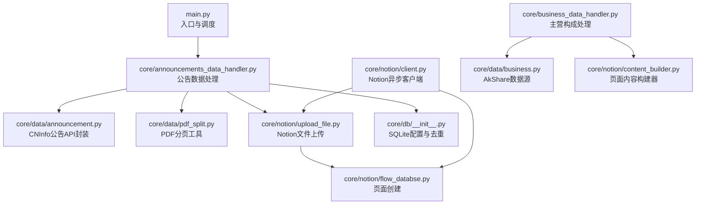
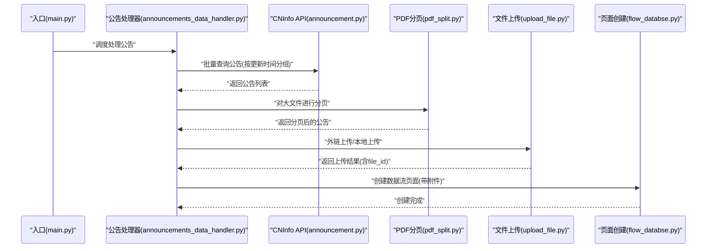
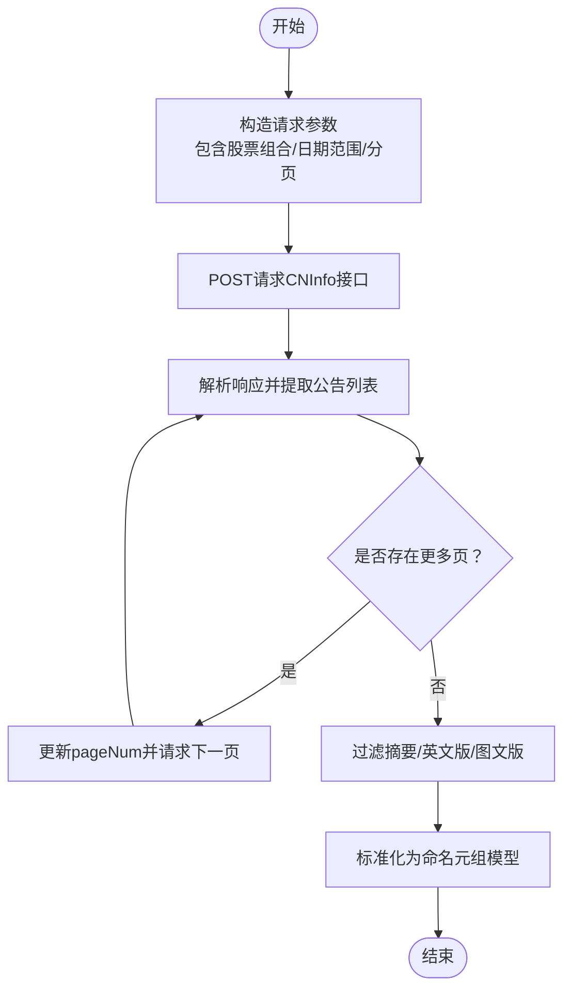
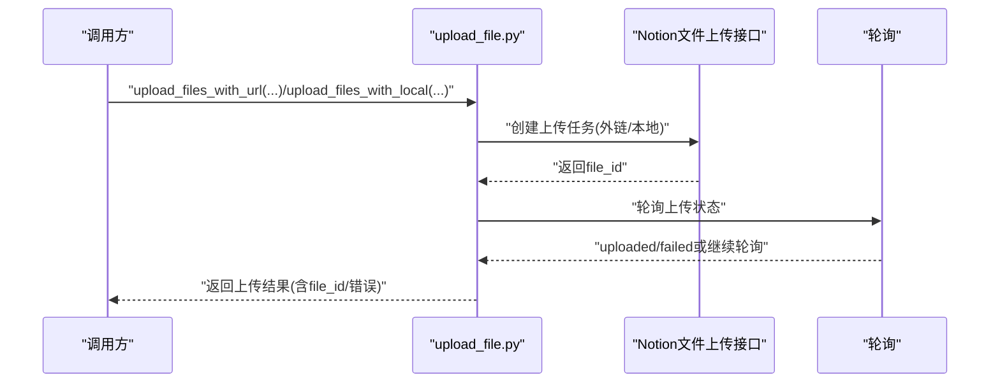
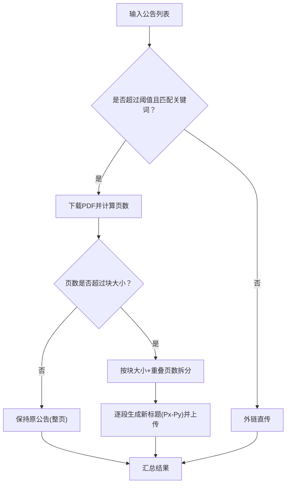
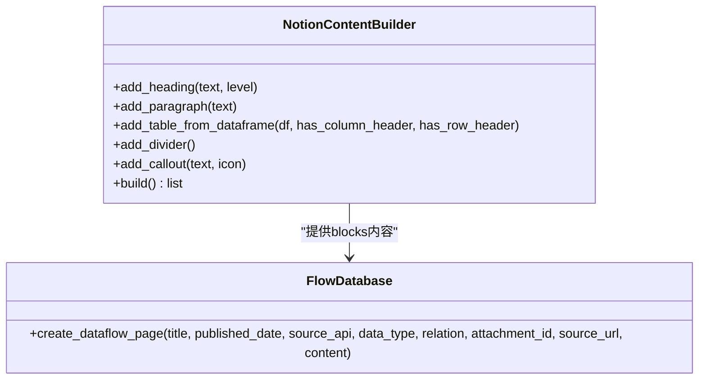
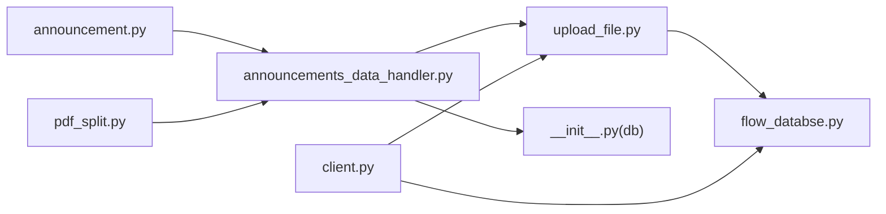

# 第三方服务集成

<cite>
**本文引用的文件**
- [main.py](file://main.py)
- [client.py](file://core/notion/client.py)
- [upload_file.py](file://core/notion/upload_file.py)
- [announcements_data_handler.py](file://core/announcements_data_handler.py)
- [announcement.py](file://core/data/announcement.py)
- [pdf_split.py](file://core/data/pdf_split.py)
- [flow_databse.py](file://core/notion/flow_databse.py)
- [content_builder.py](file://core/notion/content_builder.py)
- [business_data_handler.py](file://core/business_data_handler.py)
- [business.py](file://core/data/business.py)
- [__init__.py](file://core/db/__init__.py)
- [__init__.py](file://core/models/__init__.py)
</cite>

## 目录
1. [简介](#简介)
2. [项目结构](#项目结构)
3. [核心组件](#核心组件)
4. [架构总览](#架构总览)
5. [详细组件分析](#详细组件分析)
6. [依赖关系分析](#依赖关系分析)
7. [性能考量](#性能考量)
8. [故障排查指南](#故障排查指南)
9. [结论](#结论)
10. [附录](#附录)

## 简介
本指南面向“股票公告自动化系统”的第三方服务集成开发，目标是帮助开发者快速、安全地接入新的外部API与服务（如CNInfo公告API、Notion文件上传与页面创建），并建立统一的客户端封装、认证机制、错误处理与轮询策略。文档还覆盖文件上传服务的扩展（外链上传与本地上传策略选择）、Notion数据库字段扩展与页面模板定制、配置管理、速率限制与故障转移策略，并提供完整的集成示例与测试方法。

## 项目结构
系统采用模块化分层设计：
- 核心入口负责初始化数据库与调度任务
- 数据层负责从外部API抓取数据（如CNInfo公告）
- Notion层负责文件上传与页面创建
- 数据处理层负责业务流程编排与并发控制
- 数据库存储更新时间与去重哈希

图表来源
- [main.py](file://main.py#L20-L40)
- [announcements_data_handler.py](file://core/announcements_data_handler.py#L21-L116)
- [announcement.py](file://core/data/announcement.py#L36-L112)
- [pdf_split.py](file://core/data/pdf_split.py#L15-L73)
- [upload_file.py](file://core/notion/upload_file.py#L28-L179)
- [flow_databse.py](file://core/notion/flow_databse.py#L25-L67)
- [client.py](file://core/notion/client.py#L1-L6)
- [business_data_handler.py](file://core/business_data_handler.py#L17-L68)
- [business.py](file://core/data/business.py#L33-L96)
- [content_builder.py](file://core/notion/content_builder.py#L1-L103)
- [__init__.py](file://core/db/__init__.py#L62-L94)

章节来源
- [main.py](file://main.py#L1-L40)
- [__init__.py](file://core/db/__init__.py#L62-L94)

## 核心组件
- CNInfo公告API封装：负责批量查询公告、分页拉取、过滤摘要/英文版/图文版等非全文版本，并构造标准数据模型
- Notion文件上传：支持外链直传与本地下载后上传两种模式，内置轮询与指数退避重试
- 页面创建：根据数据类型映射选择字段，写入标题、日期、来源接口、关联股票、附件与正文内容
- 数据处理编排：按股票与更新时间分组，合并请求，减少调用次数；对大文件进行PDF分页
- 数据库存储：维护各数据源的最后更新时间，基于哈希去重

章节来源
- [announcement.py](file://core/data/announcement.py#L36-L112)
- [upload_file.py](file://core/notion/upload_file.py#L28-L179)
- [flow_databse.py](file://core/notion/flow_databse.py#L25-L67)
- [announcements_data_handler.py](file://core/announcements_data_handler.py#L21-L116)
- [__init__.py](file://core/db/__init__.py#L153-L215)

## 架构总览
系统工作流分为“数据采集—文件处理—页面创建”三层，采用异步并发提升吞吐量，并通过数据库记录更新时间与去重哈希保障幂等性。

图表来源
- [main.py](file://main.py#L20-L40)
- [announcements_data_handler.py](file://core/announcements_data_handler.py#L21-L116)
- [announcement.py](file://core/data/announcement.py#L36-L112)
- [pdf_split.py](file://core/data/pdf_split.py#L15-L73)
- [upload_file.py](file://core/notion/upload_file.py#L28-L179)
- [flow_databse.py](file://core/notion/flow_databse.py#L25-L67)

## 详细组件分析

### 组件A：CNInfo公告API集成模式
- 目标：封装CNInfo历史公告查询接口，支持多股票合并查询、分页拉取、标题过滤与URL拼接
- 关键点
  - 请求参数构造：包含板块、股票组合、日期区间、分页等
  - 分页策略：读取总页数并循环请求后续页
  - 结果清洗：剔除摘要/英文版/图文版等非全文版本
  - 数据标准化：转换为统一的命名元组模型，便于上层处理
- 并发与批量化：在处理器中按更新时间聚合股票，减少重复请求

图表来源
- [announcement.py](file://core/data/announcement.py#L36-L112)

章节来源
- [announcement.py](file://core/data/announcement.py#L36-L112)
- [announcements_data_handler.py](file://core/announcements_data_handler.py#L40-L63)

### 组件B：Notion文件上传与页面创建
- 目标：实现外链直传与本地下载后上传两种策略，统一轮询上传状态，创建数据流页面
- 关键点
  - 外链上传：直接创建external_url模式的上传任务，轮询状态直至完成或失败
  - 本地上传：下载文件到内存，拆分为固定页数的子PDF，逐段上传
  - 轮询策略：指数退避（1,2,4,8,16秒），最多尝试若干次
  - 页面创建：根据数据类型映射字段，写入标题、日期、来源接口、关联股票、附件与正文
- 错误处理：捕获上传失败与轮询超时，记录错误并标记失败状态

图表来源
- [upload_file.py](file://core/notion/upload_file.py#L40-L179)
- [flow_databse.py](file://core/notion/flow_databse.py#L25-L67)

章节来源
- [upload_file.py](file://core/notion/upload_file.py#L28-L179)
- [flow_databse.py](file://core/notion/flow_databse.py#L25-L67)

### 组件C：PDF分页与文件上传策略选择
- 目标：对超大PDF进行分页，保证单文件大小与页数限制内
- 关键点
  - 分页策略：固定块大小与重叠页数，避免跨页断裂
  - 本地上传：下载后拆分，逐段上传并生成带页码范围的新标题
  - 策略选择：根据公告大小与关键词决定走外链直传还是本地分页上传
- 并发：外链与本地上传分别并发执行，最后汇总结果

图表来源
- [announcements_data_handler.py](file://core/announcements_data_handler.py#L66-L93)
- [pdf_split.py](file://core/data/pdf_split.py#L15-L73)
- [upload_file.py](file://core/notion/upload_file.py#L28-L179)

章节来源
- [announcements_data_handler.py](file://core/announcements_data_handler.py#L66-L93)
- [pdf_split.py](file://core/data/pdf_split.py#L15-L73)

### 组件D：数据流页面创建与内容构建
- 目标：将结构化数据渲染为Notion页面，支持标题、日期、来源接口、数据类型、关联股票、附件与正文
- 关键点
  - 类型映射：数据类型到Notion select字段的映射
  - 内容构建：通过内容构建器将表格/标题/分隔线等组合为blocks
  - 并发创建：批量创建页面，提升吞吐

图表来源
- [content_builder.py](file://core/notion/content_builder.py#L1-L103)
- [flow_databse.py](file://core/notion/flow_databse.py#L25-L67)

章节来源
- [content_builder.py](file://core/notion/content_builder.py#L1-L103)
- [flow_databse.py](file://core/notion/flow_databse.py#L25-L67)

### 组件E：配置管理、速率限制与故障转移
- 配置管理
  - Notion Token：通过环境变量注入异步客户端
  - 数据库路径：SQLite数据库路径在模块内固定
  - 数据流数据库ID：通过环境变量注入页面创建
- 速率限制
  - 外链上传与本地上传均采用并发策略，但内部轮询使用指数退避，避免频繁轮询导致限流
- 故障转移
  - 上传失败或轮询超时会记录错误并标记失败，不影响其他并发任务
  - 页面创建异常被捕获并记录，保证流程继续

章节来源
- [client.py](file://core/notion/client.py#L1-L6)
- [flow_databse.py](file://core/notion/flow_databse.py#L22-L67)
- [upload_file.py](file://core/notion/upload_file.py#L153-L176)

## 依赖关系分析
- 模块耦合
  - 数据层与Notion层通过统一的数据模型与接口解耦
  - 处理器层负责编排与并发，降低对具体API的直接依赖
- 外部依赖
  - CNInfo：HTTP接口，需关注网络稳定性与分页策略
  - Notion：异步SDK，注意轮询与权限
  - AkShare：主营构成数据源，注意同步转异步的线程池使用

图表来源
- [announcement.py](file://core/data/announcement.py#L36-L112)
- [announcements_data_handler.py](file://core/announcements_data_handler.py#L21-L116)
- [pdf_split.py](file://core/data/pdf_split.py#L15-L73)
- [upload_file.py](file://core/notion/upload_file.py#L28-L179)
- [flow_databse.py](file://core/notion/flow_databse.py#L25-L67)
- [client.py](file://core/notion/client.py#L1-L6)
- [__init__.py](file://core/db/__init__.py#L62-L94)

## 性能考量
- 并发与批量化
  - 按更新时间聚合股票，减少CNInfo接口调用次数
  - 并发上传外链与本地分页文件，提升吞吐
- 轮询与退避
  - 上传轮询采用指数退避，避免频繁轮询
- 存储与去重
  - 使用哈希去重与更新时间记录，避免重复处理
- I/O优化
  - PDF分页在内存中进行，减少磁盘I/O

章节来源
- [announcements_data_handler.py](file://core/announcements_data_handler.py#L40-L63)
- [upload_file.py](file://core/notion/upload_file.py#L153-L176)
- [__init__.py](file://core/db/__init__.py#L97-L128)

## 故障排查指南
- 常见问题
  - Notion上传失败：检查Token与数据库ID是否正确，查看轮询返回的错误信息
  - CNInfo接口异常：确认股票代码映射与日期范围，检查分页逻辑
  - PDF分页失败：确认网络可达与PDF可读性，查看异常日志
- 日志与调试
  - 使用DEBUG级别日志定位问题
  - 页面创建异常会被捕获并记录，便于排查

章节来源
- [upload_file.py](file://core/notion/upload_file.py#L153-L176)
- [flow_databse.py](file://core/notion/flow_databse.py#L65-L67)
- [announcement.py](file://core/data/announcement.py#L53-L55)

## 结论
本系统通过清晰的模块划分与异步并发策略，实现了从外部API抓取、文件上传到页面创建的完整闭环。针对第三方服务集成，建议遵循统一的客户端封装、认证注入、错误处理与轮询策略，并结合数据库的去重与更新时间记录，确保系统的稳定性与可维护性。

## 附录

### A. 新API集成模板与最佳实践
- 模板步骤
  - 在数据层新增API封装模块，定义请求参数、分页与结果清洗逻辑
  - 在处理器中新增编排函数，负责按更新时间聚合与并发调度
  - 在Notion层复用文件上传与页面创建组件，保持一致的错误处理与日志
  - 在数据库层维护该API的更新时间与去重哈希
- 最佳实践
  - 统一使用异步HTTP客户端，避免阻塞
  - 对大文件采用分页策略，确保单文件大小与页数限制
  - 轮询与重试采用指数退避，避免触发限流
  - 使用环境变量集中管理密钥与配置

章节来源
- [announcement.py](file://core/data/announcement.py#L36-L112)
- [announcements_data_handler.py](file://core/announcements_data_handler.py#L21-L116)
- [upload_file.py](file://core/notion/upload_file.py#L28-L179)
- [flow_databse.py](file://core/notion/flow_databse.py#L25-L67)
- [__init__.py](file://core/db/__init__.py#L153-L215)

### B. 文件上传服务扩展指南
- 外链上传
  - 适用场景：文件较小、URL稳定、无需本地下载
  - 实现要点：直接创建external_url上传任务，轮询状态
- 本地上传
  - 适用场景：大文件、需要分页、或URL不稳定
  - 实现要点：下载到内存，按块大小拆分，逐段上传
- 策略选择机制
  - 基于文件大小与标题关键词判断，优先外链直传，超限再本地分页

章节来源
- [announcements_data_handler.py](file://core/announcements_data_handler.py#L66-L93)
- [upload_file.py](file://core/notion/upload_file.py#L40-L179)
- [pdf_split.py](file://core/data/pdf_split.py#L15-L73)

### C. Notion API扩展方法
- 新增数据库字段
  - 在页面创建处增加属性映射，确保字段存在且类型匹配
- 自定义页面模板
  - 使用内容构建器添加标题、表格、分隔线等blocks，形成统一模板
- 数据流扩展
  - 在处理器中扩展数据类型映射，确保select字段可用

章节来源
- [flow_databse.py](file://core/notion/flow_databse.py#L14-L20)
- [flow_databse.py](file://core/notion/flow_databse.py#L48-L64)
- [content_builder.py](file://core/notion/content_builder.py#L1-L103)

### D. 配置管理与环境变量
- Notion Token：注入异步客户端
- 数据流数据库ID：注入页面创建
- 数据库路径：模块内固定，便于部署

章节来源
- [client.py](file://core/notion/client.py#L1-L6)
- [flow_databse.py](file://core/notion/flow_databse.py#L22-L22)
- [__init__.py](file://core/db/__init__.py#L12-L13)

### E. 完整集成示例与测试方法
- 集成示例
  - 新增数据源：在数据层实现API封装，在处理器中编排并发，在Notion层复用上传与页面创建
  - 配置注入：通过环境变量注入密钥与数据库ID
- 测试方法
  - 单元测试：针对API封装、PDF分页、上传轮询与页面创建的关键函数编写测试
  - 集成测试：模拟真实数据流，验证从抓取到页面创建的端到端流程
  - 回归测试：对去重与更新时间记录进行回归，确保幂等性

章节来源
- [announcements_data_handler.py](file://core/announcements_data_handler.py#L21-L116)
- [upload_file.py](file://core/notion/upload_file.py#L28-L179)
- [flow_databse.py](file://core/notion/flow_databse.py#L25-L67)
- [__init__.py](file://core/db/__init__.py#L97-L128)