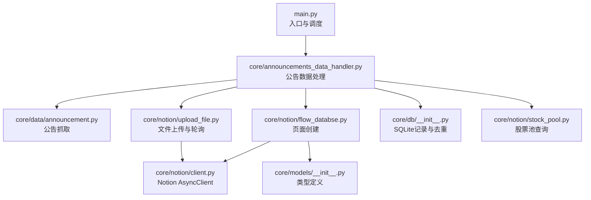
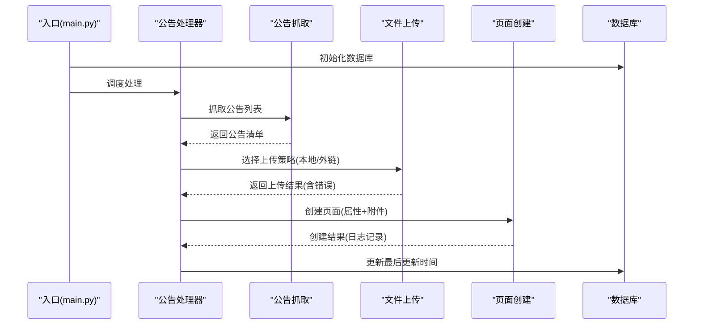
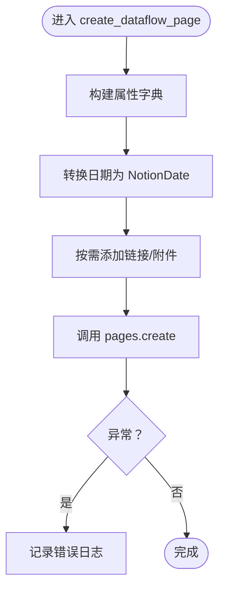
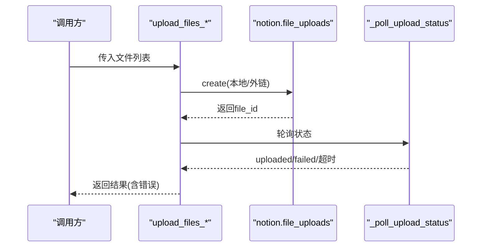
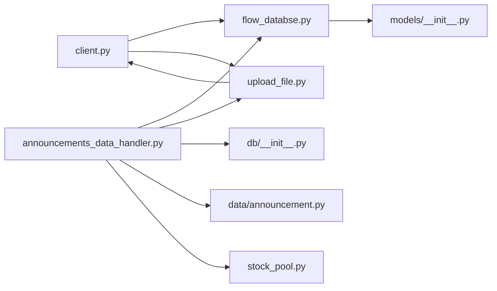

# Notion API错误

<cite>
**本文引用的文件**
- [main.py](file://main.py)
- [core/notion/client.py](file://core/notion/client.py)
- [core/notion/flow_databse.py](file://core/notion/flow_databse.py)
- [core/notion/upload_file.py](file://core/notion/upload_file.py)
- [core/notion/stock_pool.py](file://core/notion/stock_pool.py)
- [core/data/announcement.py](file://core/data/announcement.py)
- [core/db/__init__.py](file://core/db/__init__.py)
- [core/models/__init__.py](file://core/models/__init__.py)
- [core/announcements_data_handler.py](file://core/announcements_data_handler.py)
</cite>

## 目录
1. [简介](#简介)
2. [项目结构](#项目结构)
3. [核心组件](#核心组件)
4. [架构总览](#架构总览)
5. [详细组件分析](#详细组件分析)
6. [依赖关系分析](#依赖关系分析)
7. [性能考量](#性能考量)
8. [故障排除指南](#故障排除指南)
9. [结论](#结论)
10. [附录](#附录)

## 简介
本指南聚焦于股票公告自动化系统中与 Notion API 相关的常见错误与排障流程，覆盖认证失败、权限不足、API 限制、页面创建失败、数据库写入错误、文件上传异常、响应超时、网络中断、服务器错误、API 版本兼容性、字段类型不匹配与数据格式错误等问题。文档提供可落地的诊断步骤、重试与恢复策略，并给出关键错误代码与状态码参考及调试技巧。

## 项目结构
系统采用模块化设计，围绕“数据抓取 → 内容构建 → Notion 页面与文件上传 → 数据库记录”闭环运行。入口脚本负责加载环境变量、初始化数据库与调度主流程；Notion 客户端负责异步调用 Notion API；数据层负责公告抓取与 PDF 分割；数据库层负责去重与更新时间记录；上传模块负责文件上传与轮询状态。

图表来源
- [main.py](file://main.py#L20-L39)
- [core/announcements_data_handler.py](file://core/announcements_data_handler.py#L21-L116)
- [core/data/announcement.py](file://core/data/announcement.py#L36-L112)
- [core/notion/upload_file.py](file://core/notion/upload_file.py#L28-L61)
- [core/notion/flow_databse.py](file://core/notion/flow_databse.py#L25-L67)
- [core/notion/client.py](file://core/notion/client.py#L1-L6)
- [core/db/__init__.py](file://core/db/__init__.py#L62-L94)
- [core/notion/stock_pool.py](file://core/notion/stock_pool.py#L23-L51)
- [core/models/__init__.py](file://core/models/__init__.py#L1-L8)

章节来源
- [main.py](file://main.py#L1-L40)
- [core/announcements_data_handler.py](file://core/announcements_data_handler.py#L1-L116)

## 核心组件
- Notion 客户端：通过环境变量注入令牌，创建异步客户端实例，供页面与文件上传模块使用。
- 页面创建：在资讯流数据库中创建页面，填充标题、日期、来源接口、数据类型、关联股票、附件与正文内容。
- 文件上传：支持本地内容与外链两种模式，内置轮询与指数退避重试，返回上传结果与错误信息。
- 股票池：从 Notion 数据源查询股票池，提取股票 ID 与代码。
- 公告抓取：从巨潮资讯网抓取公告列表，支持分页与过滤。
- 数据库：初始化 SQLite 表、记录去重哈希、读取与更新最后更新时间。

章节来源
- [core/notion/client.py](file://core/notion/client.py#L1-L6)
- [core/notion/flow_databse.py](file://core/notion/flow_databse.py#L25-L67)
- [core/notion/upload_file.py](file://core/notion/upload_file.py#L28-L179)
- [core/notion/stock_pool.py](file://core/notion/stock_pool.py#L23-L51)
- [core/data/announcement.py](file://core/data/announcement.py#L36-L141)
- [core/db/__init__.py](file://core/db/__init__.py#L62-L217)

## 架构总览
系统整体流程：入口脚本初始化数据库与股票池，抓取公告，根据大小与关键词决定上传策略，上传完成后创建 Notion 页面并记录数据库。

图表来源
- [main.py](file://main.py#L20-L39)
- [core/announcements_data_handler.py](file://core/announcements_data_handler.py#L21-L116)
- [core/data/announcement.py](file://core/data/announcement.py#L36-L112)
- [core/notion/upload_file.py](file://core/notion/upload_file.py#L28-L61)
- [core/notion/flow_databse.py](file://core/notion/flow_databse.py#L25-L67)
- [core/db/__init__.py](file://core/db/__init__.py#L188-L217)

## 详细组件分析

### 组件A：Notion 客户端与认证
- 角色：提供异步 Notion 客户端实例，依赖环境变量注入令牌。
- 关键点：若环境变量缺失，客户端初始化即失败；建议在部署前校验环境变量。
- 故障风险：认证失败、权限不足、API 限制触发。

章节来源
- [core/notion/client.py](file://core/notion/client.py#L1-L6)

### 组件B：页面创建（资讯流数据库）
- 角色：在指定数据库中创建页面，填充标题、日期、来源接口、数据类型、关联股票、附件与正文。
- 关键点：属性映射、日期转换、附件字段、异常捕获与日志记录。
- 故障风险：属性类型不匹配、权限不足、API 限制、父级数据源无效。

图表来源
- [core/notion/flow_databse.py](file://core/notion/flow_databse.py#L25-L67)
- [core/notion/datetime_helper.py](file://core/notion/datetime_helper.py#L12-L38)
- [core/models/__init__.py](file://core/models/__init__.py#L1-L8)

章节来源
- [core/notion/flow_databse.py](file://core/notion/flow_databse.py#L25-L67)
- [core/notion/datetime_helper.py](file://core/notion/datetime_helper.py#L12-L38)
- [core/models/__init__.py](file://core/models/__init__.py#L1-L8)

### 组件C：文件上传与轮询
- 角色：支持本地内容与外链两种上传模式，内部进行 PDF 分片与并发上传，统一轮询状态并返回结果。
- 关键点：指数退避等待、最大尝试次数、状态判断、错误信息提取。
- 故障风险：网络中断、服务器错误、导入失败、轮询超时。

图表来源
- [core/notion/upload_file.py](file://core/notion/upload_file.py#L28-L61)
- [core/notion/upload_file.py](file://core/notion/upload_file.py#L124-L150)
- [core/notion/upload_file.py](file://core/notion/upload_file.py#L153-L179)

章节来源
- [core/notion/upload_file.py](file://core/notion/upload_file.py#L28-L179)

### 组件D：股票池查询
- 角色：从 Notion 数据源查询股票池，解析股票 ID 与代码。
- 关键点：环境变量、数据源 ID、异常捕获与日志记录。
- 故障风险：权限不足、数据源 ID 无效、网络中断。

章节来源
- [core/notion/stock_pool.py](file://core/notion/stock_pool.py#L23-L51)

### 组件E：公告抓取
- 角色：从巨潮资讯网抓取公告列表，支持分页与过滤。
- 关键点：请求参数构造、分页遍历、结果清洗。
- 故障风险：接口不可达、返回格式异常、解析失败。

章节来源
- [core/data/announcement.py](file://core/data/announcement.py#L36-L141)

### 组件F：数据库记录与去重
- 角色：初始化表结构、计算哈希、查询与保存哈希、读取与更新最后更新时间。
- 关键点：事务管理、占位符拼接、去重逻辑。
- 故障风险：连接异常、SQL 错误、并发冲突。

章节来源
- [core/db/__init__.py](file://core/db/__init__.py#L62-L217)

## 依赖关系分析
- Notion 客户端由各模块共享使用，避免重复初始化。
- 页面创建依赖日期转换与模型类型定义。
- 文件上传依赖 Notion 客户端与轮询逻辑。
- 公告处理器串联抓取、上传与页面创建，并与数据库交互。

图表来源
- [core/notion/client.py](file://core/notion/client.py#L1-L6)
- [core/notion/flow_databse.py](file://core/notion/flow_databse.py#L1-L67)
- [core/notion/upload_file.py](file://core/notion/upload_file.py#L1-L180)
- [core/models/__init__.py](file://core/models/__init__.py#L1-L8)
- [core/announcements_data_handler.py](file://core/announcements_data_handler.py#L1-L116)
- [core/db/__init__.py](file://core/db/__init__.py#L1-L218)
- [core/data/announcement.py](file://core/data/announcement.py#L1-L141)
- [core/notion/stock_pool.py](file://core/notion/stock_pool.py#L1-L52)

## 性能考量
- 并发上传：文件上传模块使用并发 gather，提升吞吐量。
- 指数退避：轮询等待采用指数增长间隔，平衡服务器压力与响应速度。
- 分页抓取：公告抓取按总页数循环，避免遗漏。
- 去重与增量：数据库哈希去重减少重复上传与页面创建。

章节来源
- [core/notion/upload_file.py](file://core/notion/upload_file.py#L28-L61)
- [core/notion/upload_file.py](file://core/notion/upload_file.py#L153-L179)
- [core/data/announcement.py](file://core/data/announcement.py#L85-L93)
- [core/db/__init__.py](file://core/db/__init__.py#L97-L128)

## 故障排除指南

### 一、认证失败（API 认证失败）
- 可能原因
  - 环境变量未配置或值为空。
  - 令牌过期或权限受限。
- 诊断步骤
  - 检查环境变量是否加载：入口脚本加载 dotenv，确认 .env 是否存在且包含令牌。
  - 手动验证客户端初始化是否成功。
- 解决方案
  - 重新生成并配置正确的令牌。
  - 确保令牌具有访问目标数据库与文件上传的权限。
  - 在部署环境中校验环境变量注入。

章节来源
- [core/notion/client.py](file://core/notion/client.py#L1-L6)
- [main.py](file://main.py#L4-L6)

### 二、权限不足（API 权限不足）
- 可能原因
  - 令牌缺少页面创建或文件上传权限。
  - 目标数据库或数据源未授权给集成。
- 诊断步骤
  - 查看页面创建与文件上传的日志错误信息。
  - 确认 Notion 集成在数据库与数据源中的权限范围。
- 解决方案
  - 在 Notion 中重新授权集成，授予页面创建与文件上传权限。
  - 确认父级数据源 ID 有效且可访问。

章节来源
- [core/notion/flow_databse.py](file://core/notion/flow_databse.py#L59-L67)
- [core/notion/upload_file.py](file://core/notion/upload_file.py#L124-L150)
- [core/notion/stock_pool.py](file://core/notion/stock_pool.py#L33-L51)

### 三、API 限制（速率限制/配额限制）
- 可能表现
  - 请求被拒绝、返回超时或限流错误。
- 诊断步骤
  - 观察轮询等待与重试行为，确认是否因等待时间过长导致整体延迟。
  - 检查指数退避与最大尝试次数是否生效。
- 解决方案
  - 优化并发度，减少同时请求数。
  - 在业务侧增加节流策略，避免短时高峰。
  - 结合数据库去重，减少重复上传与页面创建。

章节来源
- [core/notion/upload_file.py](file://core/notion/upload_file.py#L153-L179)

### 四、页面创建失败（页面创建失败）
- 可能原因
  - 属性类型不匹配（如日期、选择、关系字段）。
  - 父级数据源 ID 无效。
  - 权限不足。
- 诊断步骤
  - 检查属性映射与类型转换逻辑。
  - 核对数据类型映射与 Notion 数据库列定义。
  - 查看日志中的错误详情。
- 解决方案
  - 对齐属性类型与 Notion 数据库字段类型。
  - 确认父级数据源 ID 与数据库一致。
  - 修正数据类型映射或调整数据库结构。

章节来源
- [core/notion/flow_databse.py](file://core/notion/flow_databse.py#L48-L67)
- [core/notion/datetime_helper.py](file://core/notion/datetime_helper.py#L12-L38)
- [core/models/__init__.py](file://core/models/__init__.py#L1-L8)

### 五、数据库写入错误（数据库写入错误）
- 可能原因
  - 连接异常、事务回滚、SQL 语法或约束错误。
  - 并发写入导致锁冲突。
- 诊断步骤
  - 检查数据库初始化与表结构是否存在。
  - 观察事务管理与异常回滚逻辑。
  - 核查占位符拼接与参数绑定。
- 解决方案
  - 确保数据库路径与文件权限正确。
  - 优化并发写入策略，必要时加锁或队列化。
  - 修复 SQL 语句与参数绑定。

章节来源
- [core/db/__init__.py](file://core/db/__init__.py#L62-L94)
- [core/db/__init__.py](file://core/db/__init__.py#L28-L52)
- [core/db/__init__.py](file://core/db/__init__.py#L166-L185)

### 六、文件上传异常（文件上传异常）
- 可能原因
  - 外链不可访问、下载失败。
  - Notion 导入失败、轮询超时。
  - 本地内容过大或格式不支持。
- 诊断步骤
  - 检查外链可达性与响应状态。
  - 查看轮询返回的状态与错误信息。
  - 确认分片策略与缓冲区大小。
- 解决方案
  - 对外链增加重试与超时控制。
  - 针对导入失败的文件单独处理或转人工。
  - 控制单次上传大小与分片策略。

章节来源
- [core/notion/upload_file.py](file://core/notion/upload_file.py#L64-L97)
- [core/notion/upload_file.py](file://core/notion/upload_file.py#L124-L150)
- [core/notion/upload_file.py](file://core/notion/upload_file.py#L153-L179)

### 七、API 响应超时（API 响应超时）
- 可能原因
  - 网络不稳定、服务器繁忙。
  - 轮询等待时间过长。
- 诊断步骤
  - 观察轮询间隔与最大尝试次数。
  - 检查网络连通性与代理设置。
- 解决方案
  - 调整轮询间隔与最大尝试次数。
  - 增加重试与熔断策略。
  - 在上游接口增加缓存与降级。

章节来源
- [core/notion/upload_file.py](file://core/notion/upload_file.py#L153-L179)

### 八、网络中断（网络中断）
- 可能原因
  - 外链下载失败、HTTP 请求异常。
- 诊断步骤
  - 捕获并记录异常类型与状态码。
  - 区分 DNS、连接、读取超时等不同阶段。
- 解决方案
  - 对外链请求增加指数退避与重试。
  - 对本地内容上传增加断点续传或分片重试。

章节来源
- [core/notion/upload_file.py](file://core/notion/upload_file.py#L67-L70)
- [core/data/announcement.py](file://core/data/announcement.py#L79-L81)

### 九、服务器错误（服务器错误）
- 可能原因
  - 第三方接口返回错误、Notion 服务异常。
- 诊断步骤
  - 记录 HTTP 状态码与响应体。
  - 区分客户端错误与服务端错误。
- 解决方案
  - 对可恢复的 5xx 错误进行重试。
  - 对 4xx 错误检查参数与权限。

章节来源
- [core/data/announcement.py](file://core/data/announcement.py#L79-L81)
- [core/notion/upload_file.py](file://core/notion/upload_file.py#L124-L150)

### 十、API 版本兼容性问题（API 版本兼容性问题）
- 可能原因
  - SDK 版本与 Notion API 不匹配。
- 诊断步骤
  - 检查 SDK 文档与变更日志。
  - 对比调用方法签名与返回结构。
- 解决方案
  - 升级 SDK 至兼容版本。
  - 在调用处做向后兼容处理。

章节来源
- [core/notion/client.py](file://core/notion/client.py#L1-L6)

### 十一、字段类型不匹配（字段类型不匹配）
- 可能原因
  - 属性映射与数据库列定义不符。
- 诊断步骤
  - 对照数据库列类型与构建属性的值类型。
  - 检查日期转换与枚举映射。
- 解决方案
  - 修正属性映射与类型转换逻辑。
  - 在构建阶段进行类型校验。

章节来源
- [core/notion/flow_databse.py](file://core/notion/flow_databse.py#L48-L54)
- [core/notion/datetime_helper.py](file://core/notion/datetime_helper.py#L12-L25)
- [core/models/__init__.py](file://core/models/__init__.py#L1-L8)

### 十二、数据格式错误（数据格式错误）
- 可能原因
  - JSON 结构不符合预期、字段缺失。
- 诊断步骤
  - 打印原始响应与解析后的结构。
  - 校验必填字段与嵌套层级。
- 解决方案
  - 在解析前进行结构校验。
  - 对缺失字段提供默认值或报错。

章节来源
- [core/data/announcement.py](file://core/data/announcement.py#L79-L112)

### 十三、API 限流处理、重试机制与错误恢复
- 实现要点
  - 文件上传：指数退避轮询，最多尝试固定次数，超时返回失败。
  - 公告抓取：对外部接口增加重试与超时控制。
  - 页面创建：捕获异常并记录日志，不影响其他任务。
- 建议
  - 在业务层增加熔断与隔离，避免雪崩。
  - 对关键路径增加可观测性与告警。

章节来源
- [core/notion/upload_file.py](file://core/notion/upload_file.py#L153-L179)
- [core/data/announcement.py](file://core/data/announcement.py#L79-L81)
- [core/notion/flow_databse.py](file://core/notion/flow_databse.py#L65-L67)

### 十四、API 错误代码与状态码参考
- Notion API
  - 文件上传状态：uploaded、failed、轮询超时。
  - 页面创建：权限不足、属性类型不匹配、父级无效。
- 第三方接口（公告抓取）
  - HTTP 状态码：200 成功、4xx/5xx 错误。
- 建议
  - 将常见错误映射为统一的错误码与消息，便于监控与告警。

章节来源
- [core/notion/upload_file.py](file://core/notion/upload_file.py#L153-L179)
- [core/notion/flow_databse.py](file://core/notion/flow_databse.py#L59-L67)
- [core/data/announcement.py](file://core/data/announcement.py#L79-L81)

### 十五、调试技巧
- 开启 DEBUG 日志级别，观察详细调用链。
- 对关键调用增加上下文信息（如文件名、页面 ID、股票代码）。
- 使用最小化复现样例，逐步缩小问题范围。
- 对外链与第三方接口增加超时与重试包装。

章节来源
- [main.py](file://main.py#L15-L17)
- [core/notion/upload_file.py](file://core/notion/upload_file.py#L64-L97)
- [core/notion/flow_databse.py](file://core/notion/flow_databse.py#L35-L37)

## 结论
本指南基于现有代码梳理了 Notion API 在股票公告自动化系统中的关键错误场景与排障路径。通过明确的诊断步骤、重试与恢复策略、以及统一的错误码映射，可显著提升系统的稳定性与可维护性。建议在生产环境中进一步增强可观测性与告警能力，并持续关注 SDK 与 API 的版本兼容性。

## 附录
- 关键文件路径与职责
  - [main.py](file://main.py#L20-L39)：入口与调度
  - [core/notion/client.py](file://core/notion/client.py#L1-L6)：Notion 客户端
  - [core/notion/flow_databse.py](file://core/notion/flow_databse.py#L25-L67)：页面创建
  - [core/notion/upload_file.py](file://core/notion/upload_file.py#L28-L179)：文件上传与轮询
  - [core/notion/stock_pool.py](file://core/notion/stock_pool.py#L23-L51)：股票池查询
  - [core/data/announcement.py](file://core/data/announcement.py#L36-L141)：公告抓取
  - [core/db/__init__.py](file://core/db/__init__.py#L62-L217)：数据库记录与去重
  - [core/models/__init__.py](file://core/models/__init__.py#L1-L8)：类型定义