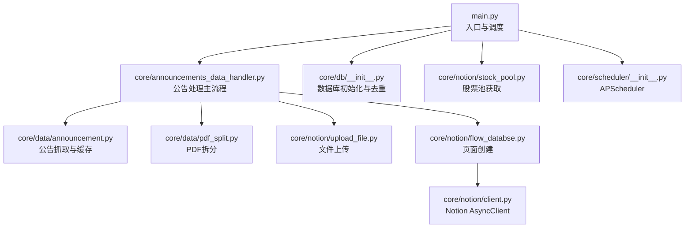
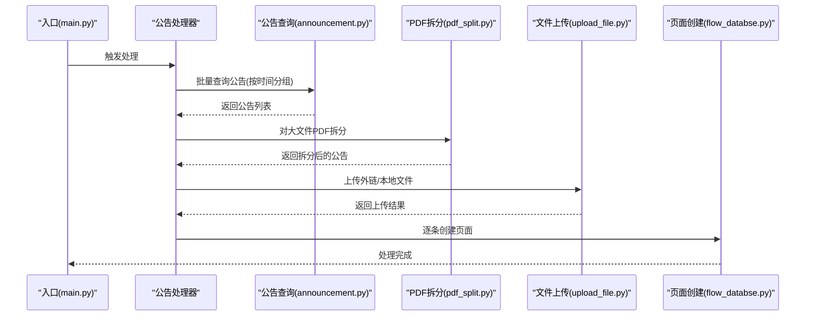
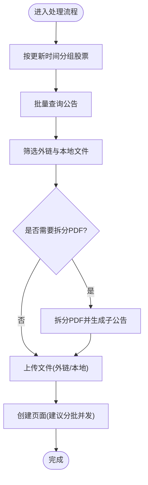
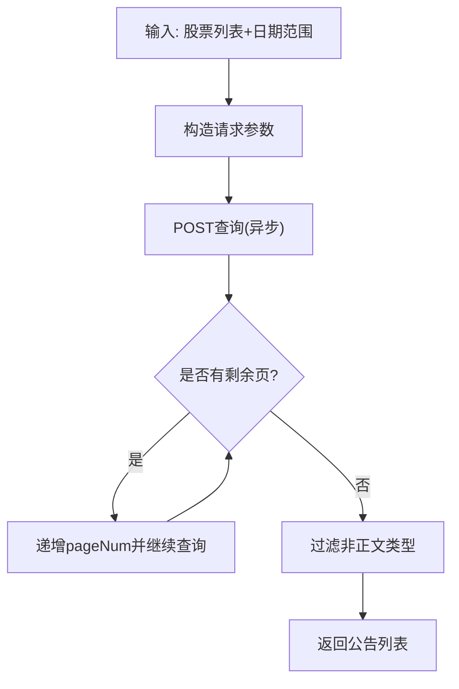
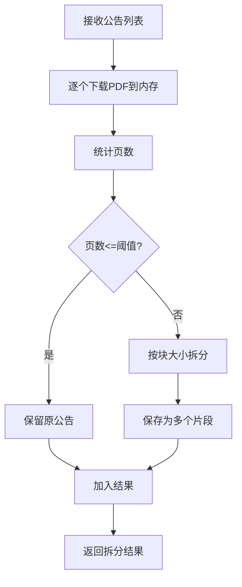
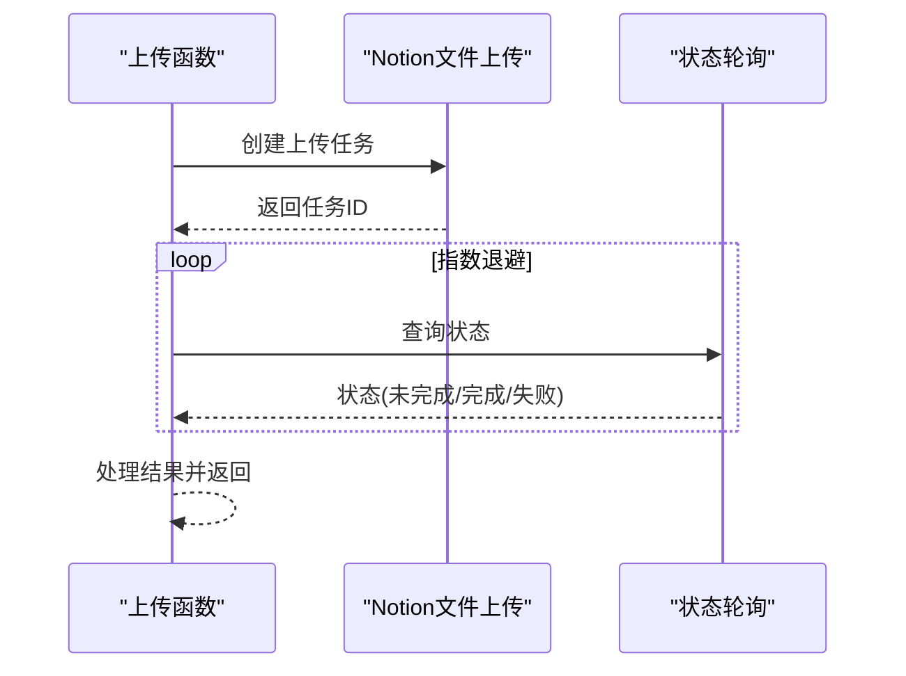
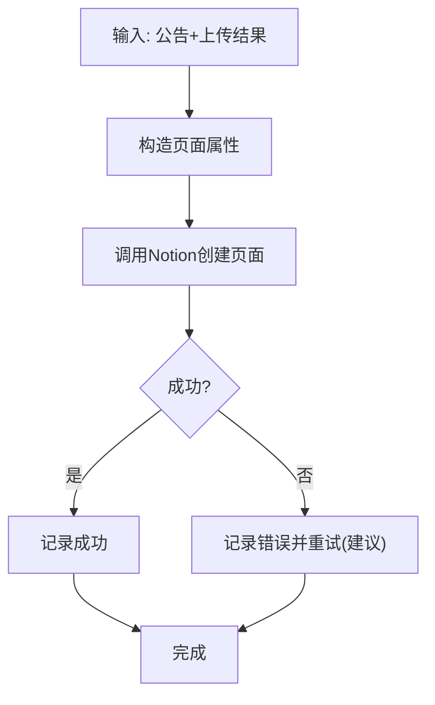
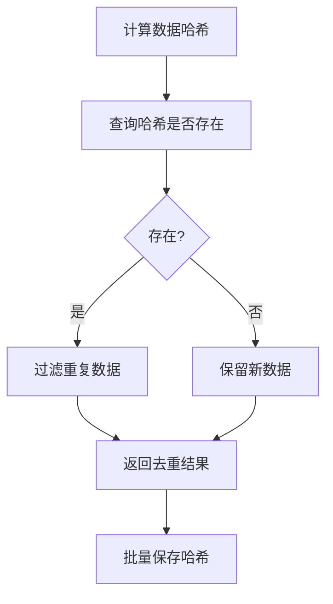
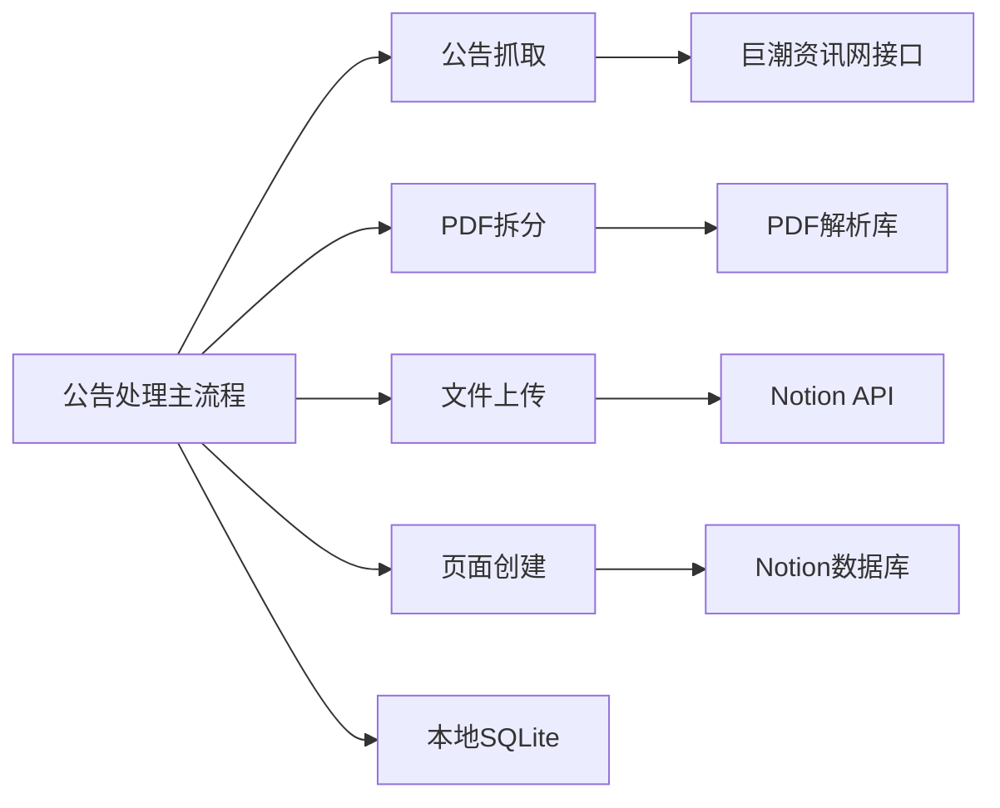

# 性能问题

<cite>
**本文引用的文件**
- [main.py](file://main.py)
- [announcements_data_handler.py](file://core/announcements_data_handler.py)
- [announcement.py](file://core/data/announcement.py)
- [pdf_split.py](file://core/data/pdf_split.py)
- [upload_file.py](file://core/notion/upload_file.py)
- [flow_databse.py](file://core/notion/flow_databse.py)
- [client.py](file://core/notion/client.py)
- [stock_pool.py](file://core/notion/stock_pool.py)
- [__init__.py（数据库）](file://core/db/__init__.py)
- [__init__.py（调度器）](file://core/scheduler/__init__.py)
- [models/__init__.py](file://core/models/__init__.py)
</cite>

## 目录
1. [简介](#简介)
2. [项目结构](#项目结构)
3. [核心组件](#核心组件)
4. [架构总览](#架构总览)
5. [详细组件分析](#详细组件分析)
6. [依赖关系分析](#依赖关系分析)
7. [性能考量](#性能考量)
8. [故障排除指南](#故障排除指南)
9. [结论](#结论)
10. [附录](#附录)

## 简介
本指南聚焦于股票公告自动化系统在异步处理、并发任务、资源竞争、内存使用、CPU与I/O瓶颈等方面的性能问题与排障方法。通过对核心模块的调用流程、数据结构、异步并发模式与外部依赖（HTTP、PDF处理、Notion API）的深入分析，给出可落地的诊断步骤、优化策略与最佳实践。

## 项目结构
系统采用按功能域分层的组织方式：
- 入口与调度：入口脚本负责初始化数据库与获取股票池，随后触发公告数据处理流程；调度器提供周期性任务能力。
- 数据获取与处理：公告抓取、PDF拆分、文件上传、页面创建等。
- 数据持久化：本地SQLite（aiosqlite）用于去重与增量时间记录。
- 外部集成：巨潮资讯网接口、Notion API、PDF解析库。

图表来源
- [main.py](file://main.py#L20-L39)
- [announcements_data_handler.py](file://core/announcements_data_handler.py#L21-L116)
- [announcement.py](file://core/data/announcement.py#L36-L112)
- [pdf_split.py](file://core/data/pdf_split.py#L15-L73)
- [upload_file.py](file://core/notion/upload_file.py#L28-L61)
- [flow_databse.py](file://core/notion/flow_databse.py#L25-L67)
- [client.py](file://core/notion/client.py#L3-L5)
- [stock_pool.py](file://core/notion/stock_pool.py#L23-L51)
- [__init__.py（数据库）](file://core/db/__init__.py#L62-L94)
- [__init__.py（调度器）](file://core/scheduler/__init__.py#L1-L7)

章节来源
- [main.py](file://main.py#L1-L40)
- [__init__.py（数据库）](file://core/db/__init__.py#L1-L218)
- [__init__.py（调度器）](file://core/scheduler/__init__.py#L1-L7)

## 核心组件
- 入口与调度：初始化数据库、获取股票池、触发公告处理流程。
- 公告处理主流程：按股票与更新时间分组，批量抓取公告，区分外链与本地PDF，拆分大文件，上传并创建Notion页面。
- 数据获取：巨潮资讯网接口，支持分页与过滤。
- PDF拆分：基于页数阈值拆分，避免单文件过大。
- 文件上传：支持外链直传与本地下载后上传两种模式，带轮询状态。
- 页面创建：向Notion数据流数据库写入页面。
- 数据库：维护增量时间与哈希去重。
- 调度器：APScheduler提供异步调度能力。

章节来源
- [main.py](file://main.py#L20-L39)
- [announcements_data_handler.py](file://core/announcements_data_handler.py#L21-L116)
- [announcement.py](file://core/data/announcement.py#L36-L112)
- [pdf_split.py](file://core/data/pdf_split.py#L15-L73)
- [upload_file.py](file://core/notion/upload_file.py#L28-L61)
- [flow_databse.py](file://core/notion/flow_databse.py#L25-L67)
- [__init__.py（数据库）](file://core/db/__init__.py#L62-L94)
- [__init__.py（调度器）](file://core/scheduler/__init__.py#L1-L7)

## 架构总览
系统采用“抓取-拆分-上传-建页”的流水线式异步处理，关键路径如下：

图表来源
- [main.py](file://main.py#L20-L39)
- [announcements_data_handler.py](file://core/announcements_data_handler.py#L21-L116)
- [announcement.py](file://core/data/announcement.py#L36-L112)
- [pdf_split.py](file://core/data/pdf_split.py#L15-L73)
- [upload_file.py](file://core/notion/upload_file.py#L28-L61)
- [flow_databse.py](file://core/notion/flow_databse.py#L25-L67)

## 详细组件分析

### 组件A：公告处理主流程（异步与并发）
- 并发策略
  - 使用任务分组与批量查询，减少API调用次数。
  - 对外链与本地文件分别创建上传任务，使用并发聚合等待。
  - 页面创建阶段逐条构建任务，但可通过批处理优化。
- 潜在瓶颈
  - 页面创建阶段存在大量独立任务，可能引发事件循环压力与上下文切换开销。
  - 上传阶段的轮询等待为同步阻塞风格，虽在协程内但会占用事件循环时间片。
- 优化建议
  - 将页面创建改为分批并发，控制最大并发数。
  - 将轮询改为非阻塞等待或使用限速令牌桶控制Notion上传速率。
  - 对拆分后的文件进行去重与缓存，避免重复下载与拆分。

图表来源
- [announcements_data_handler.py](file://core/announcements_data_handler.py#L21-L116)
- [pdf_split.py](file://core/data/pdf_split.py#L15-L73)
- [upload_file.py](file://core/notion/upload_file.py#L28-L61)
- [flow_databse.py](file://core/notion/flow_databse.py#L25-L67)

章节来源
- [announcements_data_handler.py](file://core/announcements_data_handler.py#L21-L116)

### 组件B：公告抓取（HTTP与分页）
- 实现要点
  - 使用异步HTTP客户端发起POST请求，按返回的总页数循环抓取。
  - 对返回结果进行过滤，剔除摘要/英文版/图文版等非正文类型。
  - 使用LRU缓存缓存股票映射，减少重复查询。
- 性能关注点
  - 分页循环为顺序等待，若总页数较多，整体耗时线性增长。
  - 缓存装饰器为异步函数，需注意缓存键与并发一致性。
- 优化建议
  - 对不同日期窗口的查询结果进行缓存，避免重复抓取。
  - 控制并发抓取数量，结合限速策略防止接口限流。
  - 将过滤逻辑前置到服务端（若可行）以减少无效数据传输。

图表来源
- [announcement.py](file://core/data/announcement.py#L36-L112)

章节来源
- [announcement.py](file://core/data/announcement.py#L36-L112)

### 组件C：PDF拆分（CPU与内存）
- 实现要点
  - 下载PDF到内存，统计页数，超过阈值则拆分为多个片段。
  - 使用PDF库在内存中拼接与保存，最终返回多个片段对象。
- 性能关注点
  - 大文件拆分会产生大量BytesIO与临时PDF对象，内存峰值较高。
  - 拆分算法为顺序遍历，页数越多，CPU与内存压力越大。
- 优化建议
  - 限制单次拆分的并发数，避免内存峰值叠加。
  - 对拆分后的片段进行及时释放与显式清理。
  - 考虑磁盘临时文件策略，降低内存占用。

图表来源
- [pdf_split.py](file://core/data/pdf_split.py#L15-L73)

章节来源
- [pdf_split.py](file://core/data/pdf_split.py#L15-L73)

### 组件D：文件上传（I/O与网络）
- 实现要点
  - 支持外链直传与本地下载后上传两种模式。
  - 上传后轮询状态，指数退避等待完成。
- 性能关注点
  - 轮询等待为同步阻塞风格，占用事件循环时间片。
  - 大文件上传受网络带宽与Notion导入速度影响。
- 优化建议
  - 将轮询改为非阻塞等待，或使用队列与后台任务处理。
  - 对上传任务进行限速与并发配额控制。
  - 对外链文件优先直传，减少本地下载与内存拷贝。

图表来源
- [upload_file.py](file://core/notion/upload_file.py#L124-L176)

章节来源
- [upload_file.py](file://core/notion/upload_file.py#L28-L61)
- [upload_file.py](file://core/notion/upload_file.py#L124-L176)

### 组件E：页面创建（数据库与API）
- 实现要点
  - 将公告属性映射为Notion页面属性，创建页面。
  - 记录日志便于追踪失败原因。
- 性能关注点
  - 页面创建为独立任务，若数量巨大，事件循环压力显著。
- 优化建议
  - 分批并发创建页面，控制最大并发数。
  - 对失败重试与幂等处理，避免重复创建。

图表来源
- [flow_databse.py](file://core/notion/flow_databse.py#L25-L67)

章节来源
- [flow_databse.py](file://core/notion/flow_databse.py#L25-L67)

### 组件F：数据库与去重（本地存储）
- 实现要点
  - 初始化两张表：更新记录表与哈希表。
  - 提供哈希去重与增量时间读写。
- 性能关注点
  - 批量插入与查询需注意SQL占位符长度与事务边界。
- 优化建议
  - 对高频查询建立索引（如哈希表主键）。
  - 批量写入时控制批次大小，避免单事务过大。

图表来源
- [__init__.py（数据库）](file://core/db/__init__.py#L97-L151)

章节来源
- [__init__.py（数据库）](file://core/db/__init__.py#L62-L94)
- [__init__.py（数据库）](file://core/db/__init__.py#L97-L151)

## 依赖关系分析
- 组件耦合
  - 公告处理主流程依赖数据抓取、PDF拆分、文件上传与页面创建模块。
  - 数据抓取依赖HTTP客户端与外部接口。
  - PDF拆分依赖PDF解析库与HTTP下载。
  - 文件上传依赖Notion SDK与轮询机制。
  - 页面创建依赖Notion SDK与数据库时间记录。
- 外部依赖
  - 巨潮资讯网接口：高并发与分页查询。
  - Notion API：速率限制与导入状态轮询。
  - PDF解析库：CPU与内存密集型操作。

图表来源
- [announcements_data_handler.py](file://core/announcements_data_handler.py#L21-L116)
- [announcement.py](file://core/data/announcement.py#L36-L112)
- [pdf_split.py](file://core/data/pdf_split.py#L15-L73)
- [upload_file.py](file://core/notion/upload_file.py#L28-L61)
- [flow_databse.py](file://core/notion/flow_databse.py#L25-L67)
- [__init__.py（数据库）](file://core/db/__init__.py#L62-L94)

## 性能考量
- 异步处理效率低
  - 症状：事件循环被阻塞、任务堆积、吞吐量下降。
  - 原因：轮询等待、过多独立任务、未控制并发。
  - 解决：限制并发、使用非阻塞等待、分批处理。
- 并发任务过多
  - 症状：CPU与内存飙升、上下文切换频繁。
  - 原因：页面创建与上传任务未限速。
  - 解决：引入信号量/限速器，分批并发。
- 资源竞争
  - 症状：数据库锁冲突、文件句柄耗尽。
  - 原因：未复用连接、未及时释放资源。
  - 解决：连接池化、及时关闭资源、事务边界合理。
- 内存使用过高
  - 症状：峰值内存超限、GC频繁、OOM风险。
  - 原因：大文件PDF在内存中拆分、临时对象未释放。
  - 解决：限制并发、磁盘临时文件、显式清理。
- CPU密集型任务慢
  - 症状：CPU占用率高、处理时间长。
  - 原因：PDF拆分与解析在主线程。
  - 解决：进程池或专用子进程、减少内存拷贝。
- I/O等待与网络延迟
  - 症状：上传/抓取慢、超时频繁。
  - 原因：未限速、未做指数退避与重试。
  - 解决：限速、退避重试、连接复用。

## 故障排除指南

### 一、异步处理效率低
- 诊断
  - 观察事件循环中任务数量与等待时间，确认是否存在大量独立任务。
  - 检查轮询等待是否阻塞事件循环。
- 排障
  - 将页面创建改为分批并发，设置最大并发数。
  - 将轮询改为非阻塞等待或后台队列处理。
  - 使用限速器控制Notion上传速率，避免超限。

章节来源
- [announcements_data_handler.py](file://core/announcements_data_handler.py#L96-L115)
- [upload_file.py](file://core/notion/upload_file.py#L153-L176)

### 二、并发任务过多与资源竞争
- 诊断
  - 监控数据库事务与锁等待，排查更新记录表写入冲突。
  - 检查HTTP与PDF库资源释放情况。
- 排障
  - 使用连接池与事务边界控制，避免长时间持有连接。
  - 对PDF拆分与HTTP下载增加超时与重试。
  - 限制并发任务数，使用信号量或队列。

章节来源
- [__init__.py（数据库）](file://core/db/__init__.py#L28-L52)
- [pdf_split.py](file://core/data/pdf_split.py#L76-L81)

### 三、内存使用过高
- 诊断
  - 监控内存峰值，定位在PDF拆分与下载阶段。
  - 检查临时对象是否及时释放。
- 排障
  - 限制单次拆分并发，必要时使用磁盘临时文件。
  - 显式关闭PDF文档与BytesIO缓冲区。
  - 对大文件采用流式处理与分块上传。

章节来源
- [pdf_split.py](file://core/data/pdf_split.py#L102-L127)
- [upload_file.py](file://core/notion/upload_file.py#L109-L121)

### 四、CPU密集型任务慢
- 诊断
  - CPU占用集中在PDF拆分与解析阶段。
- 排障
  - 将CPU密集任务放入进程池或专用子进程。
  - 减少不必要的内存拷贝与对象创建。

章节来源
- [pdf_split.py](file://core/data/pdf_split.py#L102-L127)

### 五、I/O等待与网络延迟
- 诊断
  - 抓取与上传阶段出现超时与重试。
- 排障
  - 对Notion上传使用指数退避与最大重试次数。
  - 对巨潮资讯网接口设置合理的超时与重试策略。
  - 复用HTTP连接，减少握手开销。

章节来源
- [upload_file.py](file://core/notion/upload_file.py#L153-L176)
- [announcement.py](file://core/data/announcement.py#L79-L81)

### 六、任务调度与批处理策略
- 诊断
  - 任务过于频繁导致系统抖动。
- 排障
  - 使用调度器按天/小时调度，合并多次抓取。
  - 对页面创建与上传采用分批策略，控制批次大小。

章节来源
- [__init__.py（调度器）](file://core/scheduler/__init__.py#L1-L7)
- [announcements_data_handler.py](file://core/announcements_data_handler.py#L44-L59)

### 七、资源池配置与最佳实践
- 数据库
  - 使用连接池与事务边界控制，避免长时间持有连接。
  - 对高频查询建立索引，优化去重查询。
- HTTP
  - 复用AsyncClient，设置超时与重试。
- PDF
  - 控制拆分块大小，限制并发，必要时使用磁盘临时文件。

章节来源
- [__init__.py（数据库）](file://core/db/__init__.py#L28-L52)
- [announcement.py](file://core/data/announcement.py#L79-L81)
- [pdf_split.py](file://core/data/pdf_split.py#L11-L12)

### 八、性能监控与瓶颈识别
- 工具建议
  - 使用异步性能分析器（如uvloop、aiohttp debug）观察事件循环。
  - 使用系统监控（CPU、内存、I/O）与Python内存分析器（tracemalloc、memory_profiler）。
  - 记录关键路径日志（抓取、拆分、上传、建页）耗时。
- 指标建议
  - 吞吐量（条/秒）、P95/P99延迟、并发数、内存峰值、GC频率。
  - Notion上传成功率与失败原因分布。

章节来源
- [flow_databse.py](file://core/notion/flow_databse.py#L35-L37)
- [upload_file.py](file://core/notion/upload_file.py#L34-L37)

### 九、优化案例与系统调优
- 案例1：页面创建分批并发
  - 将逐条创建改为每批固定数量并发，控制事件循环压力。
- 案例2：上传轮询非阻塞化
  - 使用队列与后台任务处理轮询，避免阻塞事件循环。
- 案例3：PDF拆分限速与磁盘缓存
  - 限制并发与块大小，必要时将中间PDF写入磁盘临时文件。
- 案例4：数据库批处理
  - 批量插入哈希与更新记录，减少事务次数。

章节来源
- [announcements_data_handler.py](file://core/announcements_data_handler.py#L96-L115)
- [upload_file.py](file://core/notion/upload_file.py#L153-L176)
- [pdf_split.py](file://core/data/pdf_split.py#L11-L12)
- [__init__.py（数据库）](file://core/db/__init__.py#L145-L151)

## 结论
本系统在异步并发、I/O与CPU密集型处理方面存在明显的性能瓶颈。通过分批并发、限速与资源池化、轮询非阻塞化、PDF拆分优化与数据库批处理等手段，可显著提升吞吐量与稳定性。建议在生产环境中引入完善的监控与告警体系，持续跟踪关键指标并迭代优化。

## 附录
- 环境变量与配置
  - Notion Token、股票池数据源ID、数据流数据库ID等。
- 日志级别
  - 建议在生产环境调整为INFO或WARNING，避免DEBUG日志带来的额外开销。
- 版本与依赖
  - 异步HTTP客户端、PDF解析库、APScheduler等版本升级可能带来性能差异。