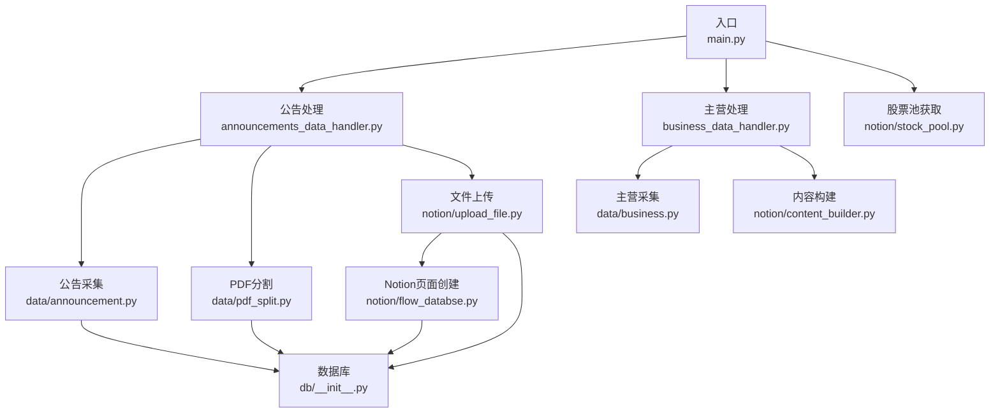
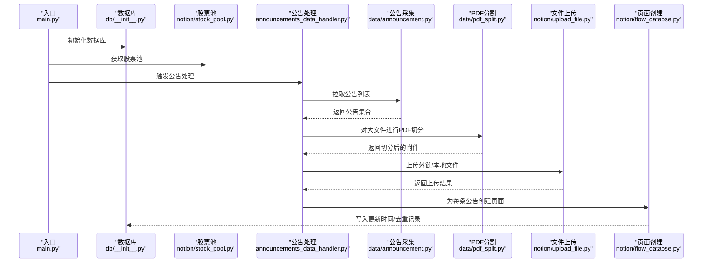
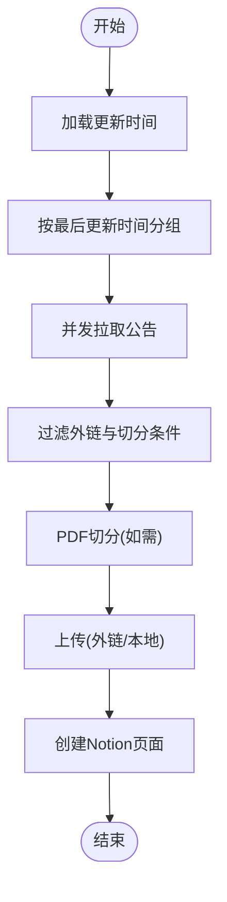
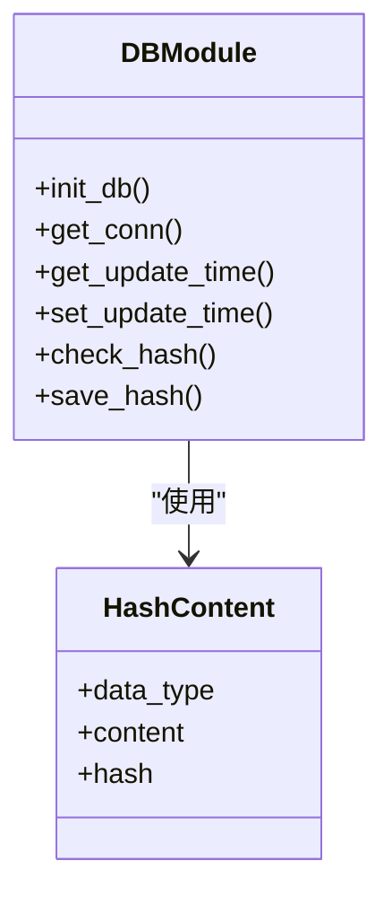
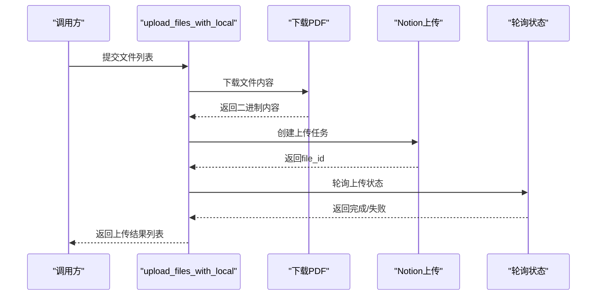
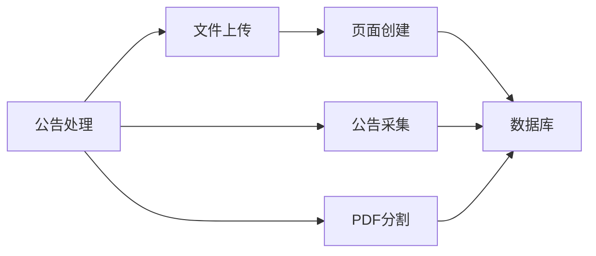

# 故障排除指南

<cite>
**本文引用的文件**
- [main.py](file://main.py)
- [announcements_data_handler.py](file://core/announcements_data_handler.py)
- [business_data_handler.py](file://core/business_data_handler.py)
- [db_init.py](file://core/db/__init__.py)
- [announcement_api.py](file://core/data/announcement.py)
- [pdf_split.py](file://core/data/pdf_split.py)
- [upload_file.py](file://core/notion/upload_file.py)
- [flow_databse.py](file://core/notion/flow_databse.py)
- [stock_pool.py](file://core/notion/stock_pool.py)
- [datetime_helper.py](file://core/notion/datetime_helper.py)
- [business_api.py](file://core/data/business.py)
- [content_builder.py](file://core/notion/content_builder.py)
</cite>

## 目录
1. [简介](#简介)
2. [项目结构](#项目结构)
3. [核心组件](#核心组件)
4. [架构总览](#架构总览)
5. [详细组件分析](#详细组件分析)
6. [依赖关系分析](#依赖关系分析)
7. [性能注意事项](#性能注意事项)
8. [故障排除指南](#故障排除指南)
9. [结论](#结论)
10. [附录](#附录)

## 简介
本指南面向“股票公告自动化系统”的运维与开发人员，聚焦于常见故障类型、根因分析与解决方案，覆盖网络连接问题、API 调用失败、数据库连接异常、文件处理错误、日志分析与调试、性能与资源问题、错误代码参考、自动恢复机制及紧急处置流程。文档基于仓库现有代码进行分析，提供可落地的问题定位策略与修复建议。

## 项目结构
系统采用模块化设计，围绕“数据采集—数据处理—文件上传—页面创建”主流程组织代码，主要模块如下：
- 入口与调度：main.py
- 公告数据处理：core/announcements_data_handler.py
- 主营业务数据处理：core/business_data_handler.py
- 数据采集层：core/data/announcement.py、core/data/business.py、core/data/pdf_split.py
- Notion 集成：core/notion/stock_pool.py、core/notion/upload_file.py、core/notion/flow_databse.py、core/notion/content_builder.py、core/notion/datetime_helper.py
- 数据库：core/db/__init__.py（aiosqlite）

图表来源
- [main.py](file://main.py#L20-L39)
- [announcements_data_handler.py](file://core/announcements_data_handler.py#L21-L116)
- [business_data_handler.py](file://core/business_data_handler.py#L17-L108)
- [announcement_api.py](file://core/data/announcement.py#L36-L112)
- [pdf_split.py](file://core/data/pdf_split.py#L15-L73)
- [upload_file.py](file://core/notion/upload_file.py#L28-L61)
- [flow_databse.py](file://core/notion/flow_databse.py#L25-L67)
- [stock_pool.py](file://core/notion/stock_pool.py#L23-L51)
- [db_init.py](file://core/db/__init__.py#L62-L94)

章节来源
- [main.py](file://main.py#L1-L40)
- [announcements_data_handler.py](file://core/announcements_data_handler.py#L1-L116)
- [business_data_handler.py](file://core/business_data_handler.py#L1-L108)
- [db_init.py](file://core/db/__init__.py#L1-L218)

## 核心组件
- 入口与调度：初始化数据库、拉取股票池、触发公告与主营数据处理流程。
- 数据采集：
  - 公告：异步调用巨潮资讯接口，分页拉取并清洗标题。
  - 主营：通过第三方库异步抓取并结构化为多维数据。
  - PDF：下载并按页数切分，便于 Notion 导入限制。
- 文件上传与页面创建：支持外链直传与本地下载后上传两种模式，轮询上传状态，失败重试与超时处理；创建资讯流页面并写入数据库。
- 数据库：维护更新时间与去重哈希表，提供事务安全的上下文管理。

章节来源
- [main.py](file://main.py#L20-L39)
- [announcement_api.py](file://core/data/announcement.py#L36-L112)
- [business_api.py](file://core/data/business.py#L33-L95)
- [pdf_split.py](file://core/data/pdf_split.py#L15-L73)
- [upload_file.py](file://core/notion/upload_file.py#L28-L61)
- [flow_databse.py](file://core/notion/flow_databse.py#L25-L67)
- [db_init.py](file://core/db/__init__.py#L62-L215)

## 架构总览
系统运行时序概览如下：

图表来源
- [main.py](file://main.py#L20-L39)
- [db_init.py](file://core/db/__init__.py#L62-L94)
- [stock_pool.py](file://core/notion/stock_pool.py#L23-L51)
- [announcements_data_handler.py](file://core/announcements_data_handler.py#L21-L116)
- [announcement_api.py](file://core/data/announcement.py#L36-L112)
- [pdf_split.py](file://core/data/pdf_split.py#L15-L73)
- [upload_file.py](file://core/notion/upload_file.py#L28-L61)
- [flow_databse.py](file://core/notion/flow_databse.py#L25-L67)

## 详细组件分析

### 组件A：公告数据处理流程
- 关键职责：按股票池与更新时间分组并发拉取公告、过滤与切分、上传并创建页面。
- 并发模型：使用 asyncio.gather 并行执行多个任务，提升吞吐。
- 错误点：
  - 接口返回空列表或异常导致后续任务失败。
  - PDF 切分异常回退为原公告，避免中断。
  - 上传失败记录错误但不影响其他任务继续执行。

图表来源
- [announcements_data_handler.py](file://core/announcements_data_handler.py#L21-L116)
- [pdf_split.py](file://core/data/pdf_split.py#L15-L73)
- [upload_file.py](file://core/notion/upload_file.py#L28-L61)
- [flow_databse.py](file://core/notion/flow_databse.py#L25-L67)

章节来源
- [announcements_data_handler.py](file://core/announcements_data_handler.py#L1-L116)

### 组件B：数据库与去重
- 职责：初始化表结构、维护更新时间、计算并校验哈希、批量写入。
- 事务与回滚：通过上下文管理器保证异常时回滚，避免脏数据。
- 去重策略：对内容序列化后计算哈希，数据库存在即过滤。

图表来源
- [db_init.py](file://core/db/__init__.py#L62-L215)

章节来源
- [db_init.py](file://core/db/__init__.py#L1-L218)

### 组件C：文件上传与轮询
- 支持外链直传与本地下载后上传两种模式。
- 轮询策略：指数退避（1,2,4,8,16 秒），最多尝试若干次，超时标记失败。
- 结果聚合：并发等待所有任务完成，统计成功/失败数量。

图表来源
- [upload_file.py](file://core/notion/upload_file.py#L28-L61)
- [upload_file.py](file://core/notion/upload_file.py#L153-L176)

章节来源
- [upload_file.py](file://core/notion/upload_file.py#L1-L180)

### 组件D：页面创建与类型映射
- 将公告/主营等数据写入 Notion 资讯流数据库，属性包含标题、时间、来源接口、数据类型、关联股票、附件与原文链接。
- 类型映射：通过配置项将“数据类型”映射为 Notion select id，便于筛选与展示。

章节来源
- [flow_databse.py](file://core/notion/flow_databse.py#L14-L20)
- [flow_databse.py](file://core/notion/flow_databse.py#L25-L67)

## 依赖关系分析
- 组件耦合：
  - 公告处理依赖数据采集、PDF分割、文件上传与页面创建。
  - 文件上传依赖 Notion SDK 客户端与轮询接口。
  - 页面创建依赖数据库写入（更新时间与哈希）。
- 外部依赖：
  - 网络：HTTP/HTTPS 请求（巨潮资讯、PDF 下载、Notion API）。
  - 存储：本地 SQLite（aiosqlite）。
  - 工具库：pymupdf（PDF 处理）、httpx（HTTP 客户端）、xxhash（哈希）。

图表来源
- [announcements_data_handler.py](file://core/announcements_data_handler.py#L21-L116)
- [announcement_api.py](file://core/data/announcement.py#L36-L112)
- [pdf_split.py](file://core/data/pdf_split.py#L15-L73)
- [upload_file.py](file://core/notion/upload_file.py#L28-L61)
- [flow_databse.py](file://core/notion/flow_databse.py#L25-L67)
- [db_init.py](file://core/db/__init__.py#L62-L94)

## 性能注意事项
- 并发与批量化：
  - 公告采集按最后更新时间分组，减少重复请求。
  - 文件上传使用 asyncio.gather 并发执行，提高吞吐。
- I/O 优化：
  - PDF 切分采用内存缓冲（BytesIO），避免磁盘 IO。
  - 轮询间隔指数退避，平衡成功率与资源占用。
- 数据库：
  - 事务上下文管理器确保一致性，批量写入减少往返。
- 时间与日期：
  - 使用时区统一转换，避免跨时区引发的逻辑偏差。

章节来源
- [announcements_data_handler.py](file://core/announcements_data_handler.py#L40-L62)
- [upload_file.py](file://core/notion/upload_file.py#L153-L176)
- [pdf_split.py](file://core/data/pdf_split.py#L110-L121)
- [db_init.py](file://core/db/__init__.py#L28-L52)
- [datetime_helper.py](file://core/notion/datetime_helper.py#L12-L25)

## 故障排除指南

### 一、网络连接问题
- 现象特征
  - 请求超时、连接拒绝、DNS 解析失败、SSL/TLS 握手异常。
- 常见根因
  - 代理/防火墙阻断、目标服务不可达、证书链问题、速率限制。
- 诊断方法
  - 使用命令行工具验证连通性与延迟（如 curl/wget/ping）。
  - 检查系统代理与企业防火墙策略。
  - 验证目标域名解析与证书有效性。
- 解决方案
  - 配置系统/应用代理，允许访问目标域名。
  - 升级证书信任链或使用受信 CA。
  - 限速重试，增加超时阈值，必要时切换网络出口。
- 自动恢复
  - 重试与指数退避（见文件上传轮询策略）。
  - 对于公告采集，分页与分组可降低单次失败影响。

章节来源
- [announcement_api.py](file://core/data/announcement.py#L79-L81)
- [upload_file.py](file://core/notion/upload_file.py#L153-L176)

### 二、API 调用失败
- 现象特征
  - HTTP 状态码异常（如 4xx/5xx）、响应体为空、字段缺失。
- 常见根因
  - 接口变更、参数格式错误、鉴权失效、配额限制。
- 诊断方法
  - 打印请求 URL、参数与响应状态码/正文。
  - 校验参数拼装（如股票代码映射、日期范围）。
  - 检查环境变量与密钥配置。
- 解决方案
  - 修正参数格式与必填字段。
  - 重新申请/刷新鉴权凭据。
  - 降低并发或增加延时以规避限流。
- 自动恢复
  - 对外链上传失败的任务单独重试。
  - 公告采集分页重试与失败记录。

章节来源
- [announcement_api.py](file://core/data/announcement.py#L57-L77)
- [announcement_api.py](file://core/data/announcement.py#L88-L92)
- [stock_pool.py](file://core/notion/stock_pool.py#L33-L38)

### 三、数据库连接异常
- 现象特征
  - 连接失败、事务无法提交/回滚、表不存在、锁等待超时。
- 常见根因
  - 数据库文件损坏、权限不足、并发写入冲突。
- 诊断方法
  - 检查数据库路径与文件权限。
  - 查看是否存在并发事务未释放。
  - 使用 SQLite 工具检查表结构与完整性。
- 解决方案
  - 修复文件权限与路径。
  - 重启进程释放连接句柄。
  - 重建表结构（init_db）。
- 自动恢复
  - 事务上下文管理器自动回滚异常分支。
  - 重试失败的写入操作。

章节来源
- [db_init.py](file://core/db/__init__.py#L62-L94)
- [db_init.py](file://core/db/__init__.py#L28-L52)
- [db_init.py](file://core/db/__init__.py#L188-L215)

### 四、文件处理错误
- 现象特征
  - PDF 下载失败、页数解析异常、切分后大小异常、上传状态长期 pending。
- 常见根因
  - PDF 链接失效、文件损坏、页数过多导致切分策略异常。
- 诊断方法
  - 打印文件名与 URL，验证可访问性。
  - 检查 PDF 页数与内容长度，确认切分边界。
  - 观察轮询状态与错误码。
- 解决方案
  - 替换失效链接或改用本地下载后上传。
  - 调整切分参数（块大小、重叠页）。
  - 对失败文件单独重试或降级为原文件。
- 自动恢复
  - PDF 切分异常时保留原公告，避免中断。
  - 上传失败记录错误并继续处理其他文件。

章节来源
- [pdf_split.py](file://core/data/pdf_split.py#L76-L81)
- [pdf_split.py](file://core/data/pdf_split.py#L110-L121)
- [upload_file.py](file://core/notion/upload_file.py#L153-L176)

### 五、日志分析技巧与调试工具
- 日志级别与位置
  - DEBUG/INFO/WARNING/ERROR：贯穿各模块，便于定位阶段与失败原因。
  - 关键日志点：公告采集、PDF 下载/切分、文件上传、页面创建、数据库读写。
- 日志模式识别
  - 成功/失败计数：上传完成统计、页面创建失败记录。
  - 错误关键字：轮询超时、未知错误、创建页面失败。
- 调试工具
  - 使用 Python 调试器逐步执行关键函数。
  - 临时开启更细粒度日志（如 DEBUG）观察中间态。
  - 对外链与本地上传分别构造最小复现样本。

章节来源
- [main.py](file://main.py#L15-L17)
- [upload_file.py](file://core/notion/upload_file.py#L34-L36)
- [upload_file.py](file://core/notion/upload_file.py#L85-L90)
- [flow_databse.py](file://core/notion/flow_databse.py#L65-L67)

### 六、性能问题识别与优化
- 识别信号
  - CPU/内存持续升高、I/O 等待时间长、任务堆积。
- 优化方向
  - 减少不必要的并发，合理设置批次大小。
  - 缓存热点数据（如股票映射）。
  - 优化数据库写入（批量、索引、事务粒度）。
- 资源监控
  - 监控进程内存与线程数，避免泄漏。
  - 控制 PDF 切分内存峰值，必要时分批处理。

章节来源
- [announcements_data_handler.py](file://core/announcements_data_handler.py#L40-L62)
- [pdf_split.py](file://core/data/pdf_split.py#L110-L121)
- [db_init.py](file://core/db/__init__.py#L145-L150)

### 七、内存泄漏检测与资源耗尽处理
- 检测手段
  - 使用内存分析工具（如 tracemalloc/内存采样）定位泄漏对象。
  - 关注大对象生命周期（PDF 文档、BytesIO、数据库连接）。
- 防护措施
  - 明确关闭 PDF 文档与 BytesIO。
  - 使用上下文管理器确保连接释放。
  - 控制并发规模，避免同时打开大量文件或连接。
- 应急处理
  - 立即终止异常进程，释放系统资源。
  - 降低并发与批次，观察资源回落。

章节来源
- [pdf_split.py](file://core/data/pdf_split.py#L86-L88)
- [pdf_split.py](file://core/data/pdf_split.py#L124-L127)
- [db_init.py](file://core/db/__init__.py#L28-L52)

### 八、错误代码参考与自动恢复机制
- 错误代码参考
  - 上传轮询超时：轮询达到最大尝试次数仍未完成。
  - 未知错误：上传任务返回的错误信息为空或非预期。
  - 创建页面失败：Notion API 返回异常或参数不合法。
- 自动恢复机制
  - 文件上传：失败记录错误并继续处理其他任务；可对失败任务单独重试。
  - 公告采集：分页与分组并发，单次失败不影响整体进度。
  - PDF 切分：异常时保留原公告，避免中断。

章节来源
- [upload_file.py](file://core/notion/upload_file.py#L175-L176)
- [upload_file.py](file://core/notion/upload_file.py#L142-L147)
- [flow_databse.py](file://core/notion/flow_databse.py#L65-L67)
- [pdf_split.py](file://core/data/pdf_split.py#L68-L72)

### 九、紧急情况处理流程与系统恢复步骤
- 紧急处理流程
  - 立即停止新增任务，释放资源。
  - 检查网络连通性与目标服务可用性。
  - 校验数据库文件完整性与权限。
  - 逐项重试失败任务，记录失败原因。
- 系统恢复步骤
  - 修复网络/鉴权/权限问题。
  - 重建数据库表结构（init_db）。
  - 重启服务，观察日志恢复正常。
  - 回放失败队列，补齐遗漏数据。

章节来源
- [db_init.py](file://core/db/__init__.py#L62-L94)
- [main.py](file://main.py#L20-L39)

## 结论
本指南从系统架构、关键组件与数据流出发，梳理了网络、API、数据库与文件处理四类常见故障的诊断与修复路径，并提供了日志分析、性能优化、资源防护与自动恢复策略。建议在生产环境中结合监控与告警体系，持续迭代故障预案与恢复流程，确保系统稳定运行。

## 附录
- 关键日志位置参考
  - 公告采集：采集开始、分页循环、结果统计。
  - PDF 处理：下载、页数统计、切分、异常回退。
  - 文件上传：外链/本地上传、轮询状态、成功/失败统计。
  - 页面创建：属性组装、创建调用、失败记录。
- 建议的最小复现步骤
  - 单独运行公告采集函数，打印参数与响应。
  - 使用小样本 PDF 执行切分，观察页数与输出。
  - 仅运行上传函数，分别测试外链与本地模式。
  - 仅运行页面创建函数，替换最小属性集验证。