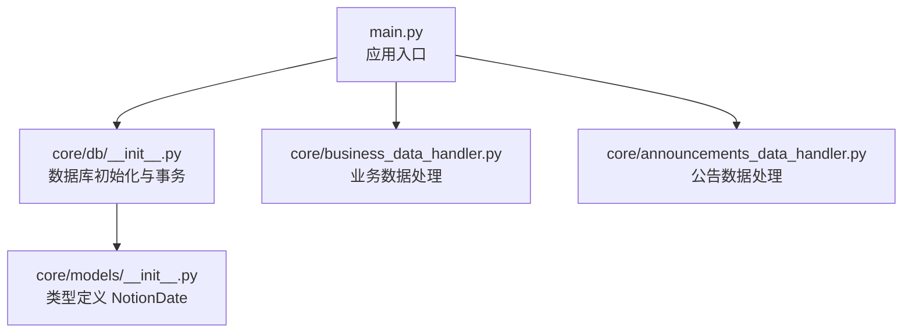
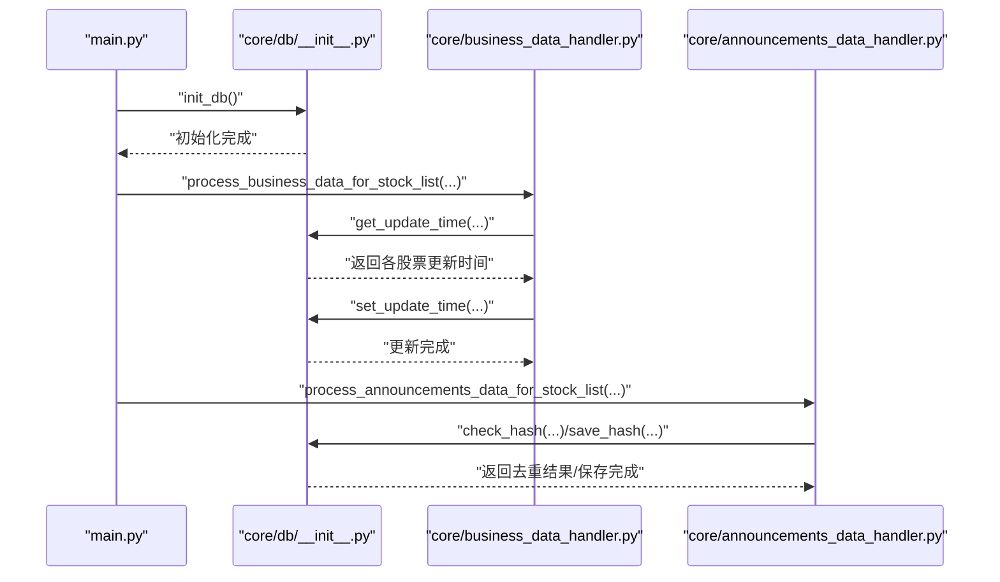
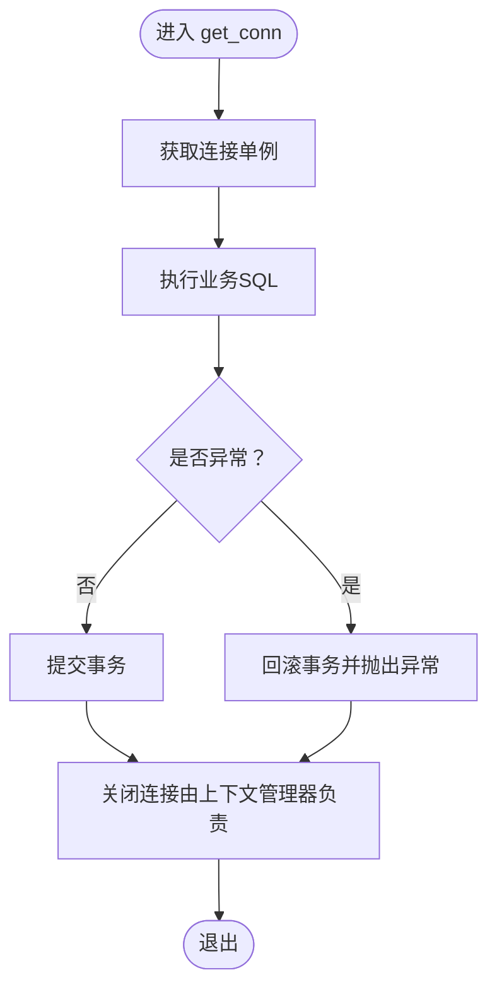
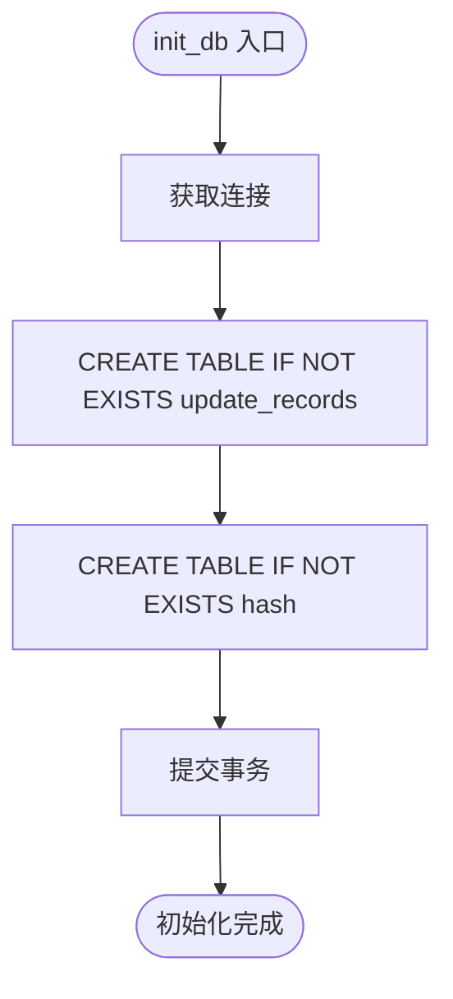
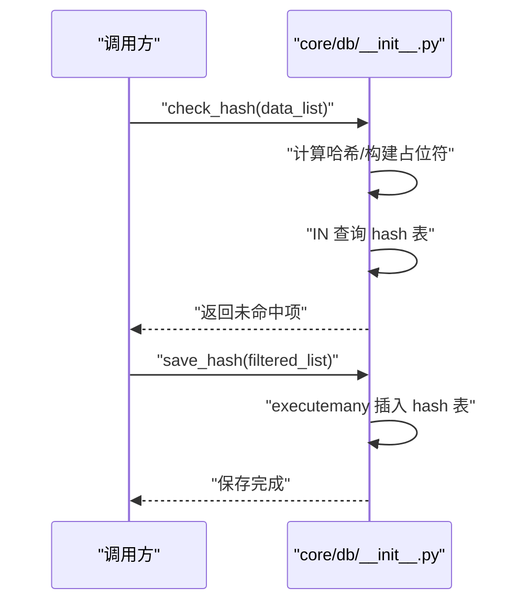
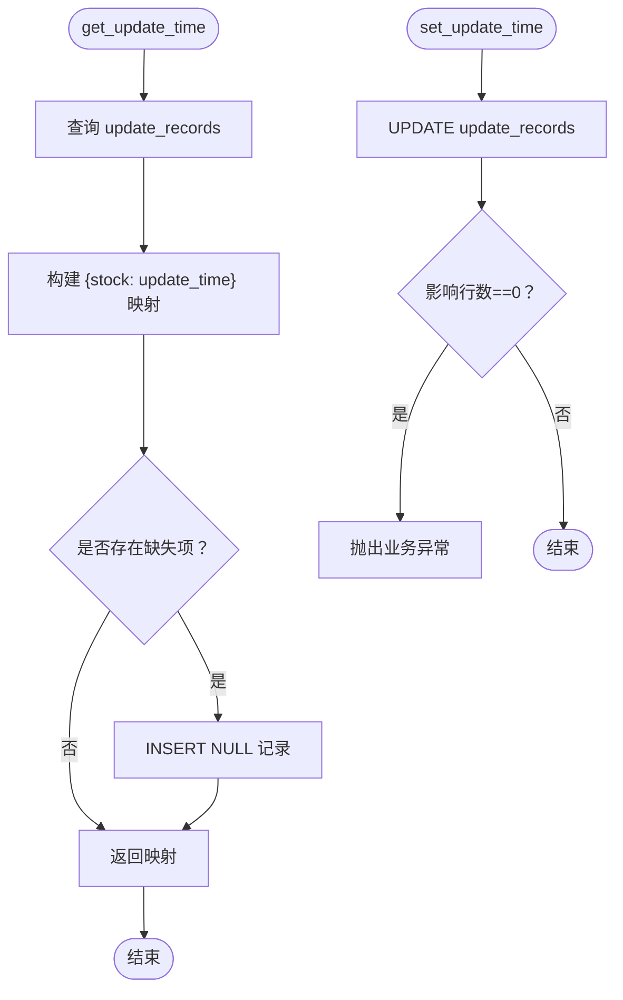
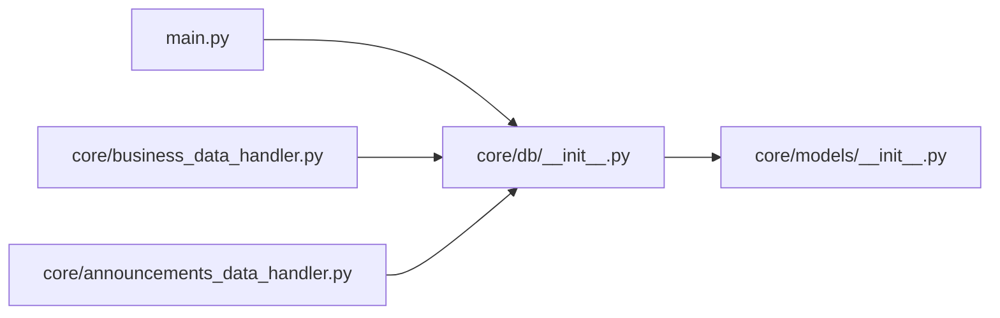

# 数据库错误

<cite>
**本文引用的文件**
- [core/db/__init__.py](file://core/db/__init__.py)
- [main.py](file://main.py)
- [core/models/__init__.py](file://core/models/__init__.py)
- [core/business_data_handler.py](file://core/business_data_handler.py)
- [core/announcements_data_handler.py](file://core/announcements_data_handler.py)
- [tests/test_db/__init__.py](file://tests/test_db/__init__.py)
</cite>

## 目录
1. [简介](#简介)
2. [项目结构](#项目结构)
3. [核心组件](#核心组件)
4. [架构总览](#架构总览)
5. [详细组件分析](#详细组件分析)
6. [依赖分析](#依赖分析)
7. [性能考量](#性能考量)
8. [故障排除指南](#故障排除指南)
9. [结论](#结论)
10. [附录](#附录)

## 简介
本指南聚焦于股票公告自动化系统中基于 SQLite 的数据库错误排查与修复。依据仓库现有实现，系统采用异步数据库连接与事务管理，核心数据库位于模块内嵌的 SQLite 文件中，负责两类关键功能：
- 去重与哈希校验：通过哈希表避免重复数据入库。
- 更新时间记录：维护“股票+键”的更新时间，支持增量抓取。

本指南覆盖以下主题：
- 连接失败、表结构不匹配、数据完整性约束错误的诊断与修复
- 数据库锁冲突、事务回滚与并发访问问题
- 初始化失败、建表错误、索引损坏的处理步骤
- 性能问题识别与优化（查询慢、内存占用高、磁盘空间不足）
- 备份恢复、数据迁移与版本升级操作指南
- 错误代码与 SQL 异常处理示例（以路径代替代码片段）

## 项目结构
数据库相关代码集中在核心模块的数据库层，入口脚本负责初始化数据库并驱动业务流程。

图表来源
- [main.py](file://main.py#L20-L36)
- [core/db/__init__.py](file://core/db/__init__.py#L62-L94)
- [core/business_data_handler.py](file://core/business_data_handler.py#L17-L67)
- [core/announcements_data_handler.py](file://core/announcements_data_handler.py#L21-L115)
- [core/models/__init__.py](file://core/models/__init__.py#L1-L8)

章节来源
- [main.py](file://main.py#L1-L40)
- [core/db/__init__.py](file://core/db/__init__.py#L1-L217)

## 核心组件
- 数据库连接与事务管理
  - 异步上下文管理器负责连接生命周期、自动提交与回滚，保证异常时一致性。
  - 单例连接缓存，减少频繁打开/关闭带来的开销。
- 数据库初始化
  - 创建两张表：update_records（主键为股票+键）、hash（主键为哈希值）。
- 哈希去重
  - 对输入数据计算哈希，查询已存在集合，过滤后返回未命中项。
- 增量更新时间管理
  - 查询某键下各股票的最后更新时间；对缺失记录先写入默认空值，再更新为实际时间。
  - 更新时若影响行数为 0，抛出业务异常，提示应先查询后更新。

章节来源
- [core/db/__init__.py](file://core/db/__init__.py#L28-L51)
- [core/db/__init__.py](file://core/db/__init__.py#L54-L59)
- [core/db/__init__.py](file://core/db/__init__.py#L62-L94)
- [core/db/__init__.py](file://core/db/__init__.py#L97-L128)
- [core/db/__init__.py](file://core/db/__init__.py#L131-L150)
- [core/db/__init__.py](file://core/db/__init__.py#L153-L185)
- [core/db/__init__.py](file://core/db/__init__.py#L188-L215)

## 架构总览
数据库层与业务层通过异步调用解耦，入口脚本统一初始化数据库并调度业务处理。

图表来源
- [main.py](file://main.py#L20-L36)
- [core/db/__init__.py](file://core/db/__init__.py#L62-L94)
- [core/business_data_handler.py](file://core/business_data_handler.py#L34-L67)
- [core/announcements_data_handler.py](file://core/announcements_data_handler.py#L27-L93)

## 详细组件分析

### 组件A：数据库连接与事务（get_conn）
- 设计要点
  - 异步上下文管理器封装连接获取、提交与回滚。
  - 发生异常时自动回滚，确保一致性。
  - 单例连接复用，避免频繁 IO。
- 关键路径
  - [get_conn](file://core/db/__init__.py#L28-L51)
  - [_get_db](file://core/db/__init__.py#L54-L59)

图表来源
- [core/db/__init__.py](file://core/db/__init__.py#L28-L51)

章节来源
- [core/db/__init__.py](file://core/db/__init__.py#L28-L51)
- [core/db/__init__.py](file://core/db/__init__.py#L54-L59)

### 组件B：数据库初始化（init_db）
- 设计要点
  - 两表创建：update_records（复合主键：stock+key）、hash（主键：hash）。
  - 使用“IF NOT EXISTS”幂等创建。
- 关键路径
  - [init_db](file://core/db/__init__.py#L62-L94)

图表来源
- [core/db/__init__.py](file://core/db/__init__.py#L62-L94)

章节来源
- [core/db/__init__.py](file://core/db/__init__.py#L62-L94)

### 组件C：哈希去重（check_hash/save_hash）
- 设计要点
  - 输入数据序列化后计算哈希，批量查询已存在集合，过滤未命中项。
  - 批量插入哈希与时间戳。
- 关键路径
  - [check_hash](file://core/db/__init__.py#L97-L128)
  - [save_hash](file://core/db/__init__.py#L131-L150)

图表来源
- [core/db/__init__.py](file://core/db/__init__.py#L97-L150)

章节来源
- [core/db/__init__.py](file://core/db/__init__.py#L97-L150)

### 组件D：更新时间管理（get_update_time/set_update_time）
- 设计要点
  - 查询某键下各股票的最后更新时间；缺失项先写入空值，再更新为实际时间。
  - 更新时若影响行数为 0，抛出业务异常，提示应先查询后更新。
- 关键路径
  - [get_update_time](file://core/db/__init__.py#L153-L185)
  - [set_update_time](file://core/db/__init__.py#L188-L215)

图表来源
- [core/db/__init__.py](file://core/db/__init__.py#L153-L215)

章节来源
- [core/db/__init__.py](file://core/db/__init__.py#L153-L215)

### 组件E：类型定义（NotionDate）
- 作用：为数据库中存储的日期字符串提供类型别名，便于静态检查与语义表达。
- 关键路径
  - [NotionDate](file://core/models/__init__.py#L1-L8)

章节来源
- [core/models/__init__.py](file://core/models/__init__.py#L1-L8)

### 组件F：入口与业务集成
- 入口脚本负责初始化数据库并调度业务处理。
- 关键路径
  - [main](file://main.py#L20-L36)
  - [process_business_data_for_stock_list](file://core/business_data_handler.py#L17-L67)
  - [process_announcements_data_for_stock_list](file://core/announcements_data_handler.py#L21-L115)

章节来源
- [main.py](file://main.py#L1-L40)
- [core/business_data_handler.py](file://core/business_data_handler.py#L17-L67)
- [core/announcements_data_handler.py](file://core/announcements_data_handler.py#L21-L115)

## 依赖分析
- 模块间关系
  - main.py 依赖 core/db 的初始化能力。
  - 业务处理器依赖 core/db 的查询与更新接口。
  - 数据库层依赖类型定义模块。
- 外部依赖
  - aiosqlite 提供异步 SQLite 支持。
  - xxhash 用于高效哈希计算。
- 关键依赖路径
  - [main](file://main.py#L12-L21)
  - [get_update_time](file://core/db/__init__.py#L153-L185)
  - [set_update_time](file://core/db/__init__.py#L188-L215)
  - [NotionDate](file://core/models/__init__.py#L1-L8)

图表来源
- [main.py](file://main.py#L12-L21)
- [core/db/__init__.py](file://core/db/__init__.py#L153-L215)
- [core/models/__init__.py](file://core/models/__init__.py#L1-L8)

章节来源
- [main.py](file://main.py#L1-L40)
- [core/db/__init__.py](file://core/db/__init__.py#L1-L217)
- [core/models/__init__.py](file://core/models/__init__.py#L1-L8)

## 性能考量
- 查询慢
  - 现状：哈希查询使用 IN 占位符，批量插入使用 executemany。
  - 建议：确认哈希表主键索引存在；对高频查询字段建立合适索引（如 update_records.key）；控制一次性查询/插入的数据量。
- 内存占用高
  - 现状：一次性构建哈希列表与查询结果集合。
  - 建议：分批处理大数据集；及时释放中间集合；避免在热路径上持有大对象。
- 磁盘空间不足
  - 现状：数据库文件随哈希与更新记录增长。
  - 建议：定期清理历史数据（如按时间窗口删除旧记录）；监控数据库文件大小；必要时离线压缩（Vacuum）。

[本节为通用指导，无需列出章节来源]

## 故障排除指南

### 一、SQLite 连接失败
- 症状
  - 应用启动时报连接错误或无法打开数据库文件。
- 诊断步骤
  - 确认数据库文件路径存在且可写：[db_path](file://core/db/__init__.py#L12-L13)
  - 检查进程权限与并发访问：同一时间仅允许一个进程打开数据库文件。
  - 验证入口初始化顺序：确保在业务调用前执行初始化：[main](file://main.py#L20-L21)
- 修复建议
  - 修正路径或权限问题；避免多进程同时写入；确保单例连接复用：[get_conn/_get_db](file://core/db/__init__.py#L28-L59)

章节来源
- [core/db/__init__.py](file://core/db/__init__.py#L12-L13)
- [core/db/__init__.py](file://core/db/__init__.py#L28-L59)
- [main.py](file://main.py#L20-L21)

### 二、表结构不匹配
- 症状
  - 查询或插入报错，提示列不存在或主键冲突。
- 诊断步骤
  - 核对初始化建表逻辑：[init_db](file://core/db/__init__.py#L62-L94)
  - 确认 update_records 主键为 (stock, key)，hash 主键为 hash。
- 修复建议
  - 重新执行初始化以幂等重建表：[init_db](file://core/db/__init__.py#L62-L94)
  - 如需迁移，先备份旧数据，再重建表并导入数据。

章节来源
- [core/db/__init__.py](file://core/db/__init__.py#L62-L94)

### 三、数据完整性约束错误
- 症状
  - 插入/更新时报主键冲突或外键约束错误。
- 诊断步骤
  - 检查主键冲突：update_records 的 (stock, key) 是否重复；hash 的 hash 是否重复。
  - 检查业务逻辑：set_update_time 要求记录必须存在，否则抛出异常：[set_update_time](file://core/db/__init__.py#L188-L215)
- 修复建议
  - 先 get_update_time 再 set_update_time，确保记录存在：[get_update_time](file://core/db/__init__.py#L153-L185)
  - 清理重复数据或调整键策略。

章节来源
- [core/db/__init__.py](file://core/db/__init__.py#L153-L215)

### 四、数据库锁冲突与并发访问
- 症状
  - 插入/更新阻塞或报锁等待。
- 诊断步骤
  - 检查是否多进程/多线程同时写入：[get_conn](file://core/db/__init__.py#L28-L51)
  - 确认事务粒度与提交时机：异常自动回滚，成功提交：[get_conn](file://core/db/__init__.py#L28-L51)
- 修复建议
  - 控制并发写入数量；使用队列或锁协调；缩短事务持续时间；避免长事务持有锁。

章节来源
- [core/db/__init__.py](file://core/db/__init__.py#L28-L51)

### 五、事务回滚与异常处理
- 症状
  - 业务异常导致数据不一致。
- 诊断步骤
  - 观察 get_conn 的异常分支：[get_conn](file://core/db/__init__.py#L28-L51)
  - 检查 set_update_time 的业务异常：[set_update_time](file://core/db/__init__.py#L188-L215)
- 修复建议
  - 在业务层捕获并记录异常，确保不影响其他任务；必要时重试策略。

章节来源
- [core/db/__init__.py](file://core/db/__init__.py#L28-L51)
- [core/db/__init__.py](file://core/db/__init__.py#L188-L215)

### 六、初始化失败与建表错误
- 症状
  - 启动时报建表失败或数据库不可用。
- 诊断步骤
  - 确认入口调用 init_db：[main](file://main.py#L20-L21)
  - 检查初始化 SQL 与权限：[init_db](file://core/db/__init__.py#L62-L94)
- 修复建议
  - 修正权限与路径；重新执行初始化；检查磁盘空间。

章节来源
- [main.py](file://main.py#L20-L21)
- [core/db/__init__.py](file://core/db/__init__.py#L62-L94)

### 七、索引损坏与查询性能问题
- 症状
  - 查询变慢或报索引相关错误。
- 诊断步骤
  - 检查哈希表主键索引与 update_records 的键索引。
- 修复建议
  - 重建索引；分批处理；优化查询条件；必要时离线维护数据库。

章节来源
- [core/db/__init__.py](file://core/db/__init__.py#L62-L94)
- [core/db/__init__.py](file://core/db/__init__.py#L97-L150)

### 八、备份、恢复、迁移与版本升级
- 备份
  - 停止写入后复制数据库文件：[db_path](file://core/db/__init__.py#L12-L13)
- 恢复
  - 将备份文件替换为原文件，重启服务。
- 迁移
  - 导出旧表数据 → 修改建表语句 → 重建表 → 导入数据 → 校验。
- 版本升级
  - 通过迁移脚本或新初始化流程，确保幂等性与兼容性。

章节来源
- [core/db/__init__.py](file://core/db/__init__.py#L12-L13)
- [core/db/__init__.py](file://core/db/__init__.py#L62-L94)

### 九、错误代码与 SQL 异常处理示例（以路径代替）
- 连接失败
  - [数据库连接获取](file://core/db/__init__.py#L54-L59)
- 表结构不匹配
  - [初始化建表](file://core/db/__init__.py#L62-L94)
- 数据完整性约束
  - [更新记录不存在抛错](file://core/db/__init__.py#L205-L215)
- 锁冲突与并发
  - [事务自动回滚](file://core/db/__init__.py#L28-L51)
- 哈希去重
  - [哈希查询与过滤](file://core/db/__init__.py#L97-L128)
  - [批量保存哈希](file://core/db/__init__.py#L131-L150)

章节来源
- [core/db/__init__.py](file://core/db/__init__.py#L28-L51)
- [core/db/__init__.py](file://core/db/__init__.py#L54-L59)
- [core/db/__init__.py](file://core/db/__init__.py#L62-L94)
- [core/db/__init__.py](file://core/db/__init__.py#L97-L150)
- [core/db/__init__.py](file://core/db/__init__.py#L188-L215)

## 结论
本指南基于仓库现有实现，总结了数据库连接、初始化、哈希去重与更新时间管理的关键流程，并提供了针对常见错误的诊断与修复步骤。建议在生产环境中：
- 严格控制并发写入与事务时长
- 定期备份与监控数据库文件状态
- 通过幂等初始化与迁移保障结构演进
- 对高频查询与大批量写入进行性能优化

[本节为总结性内容，无需列出章节来源]

## 附录
- 测试入口（测试目录占位）
  - [tests/test_db/__init__.py](file://tests/test_db/__init__.py#L1-L1)

章节来源
- [tests/test_db/__init__.py](file://tests/test_db/__init__.py#L1-L1)