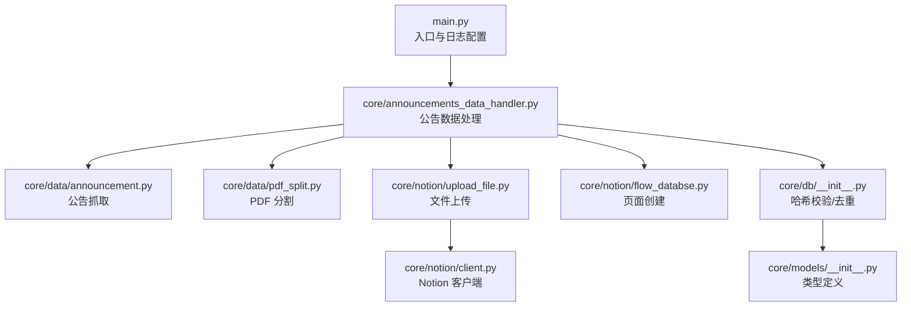
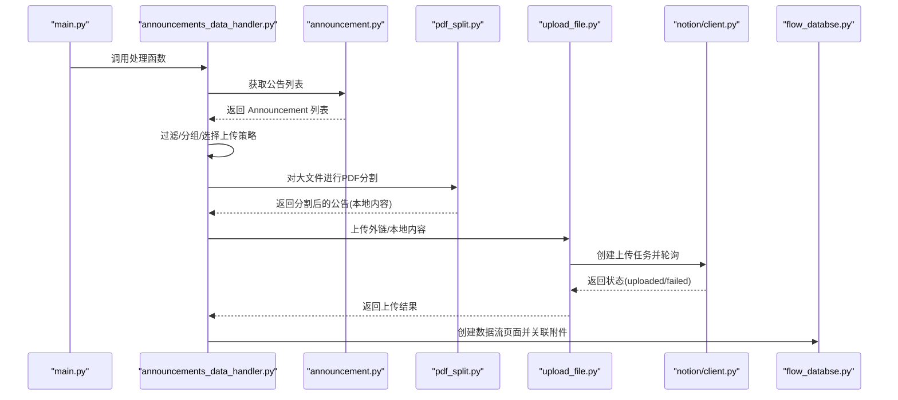
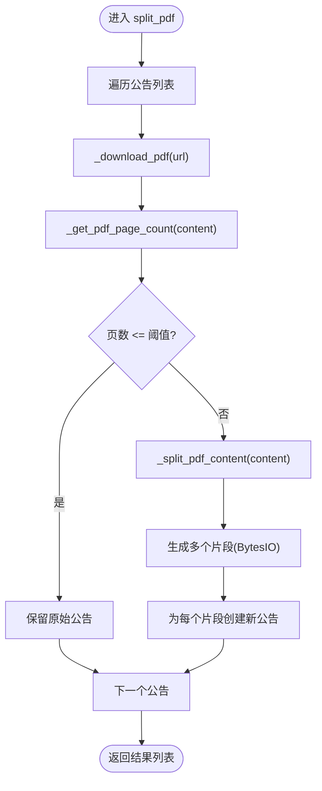
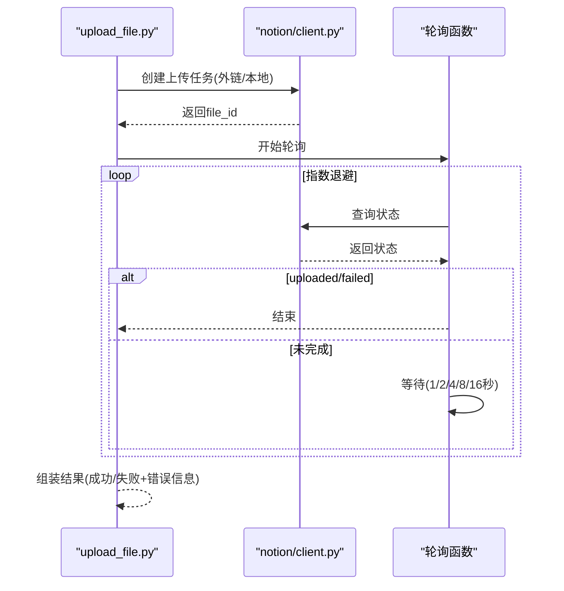
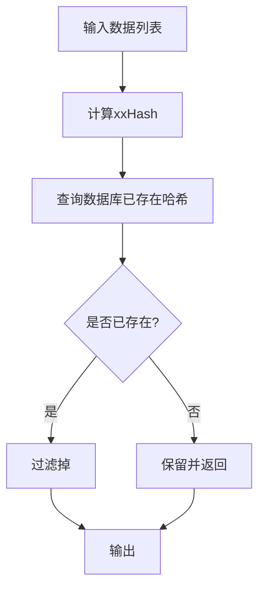
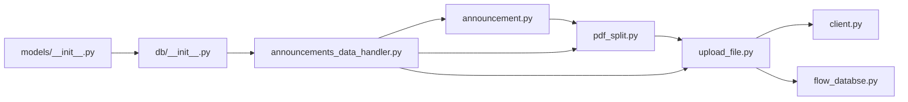

# 文件处理错误

<cite>
**本文引用的文件**
- [main.py](file://main.py)
- [core/data/pdf_split.py](file://core/data/pdf_split.py)
- [core/data/announcement.py](file://core/data/announcement.py)
- [core/notion/upload_file.py](file://core/notion/upload_file.py)
- [core/db/__init__.py](file://core/db/__init__.py)
- [core/models/__init__.py](file://core/models/__init__.py)
- [core/notion/client.py](file://core/notion/client.py)
- [core/notion/flow_databse.py](file://core/notion/flow_databse.py)
- [core/announcements_data_handler.py](file://core/announcements_data_handler.py)
</cite>

## 目录
1. [简介](#简介)
2. [项目结构](#项目结构)
3. [核心组件](#核心组件)
4. [架构总览](#架构总览)
5. [详细组件分析](#详细组件分析)
6. [依赖关系分析](#依赖关系分析)
7. [性能考量](#性能考量)
8. [故障排除指南](#故障排除指南)
9. [结论](#结论)
10. [附录](#附录)

## 简介
本指南聚焦于股票公告自动化系统在文件处理环节的常见错误与排障方法，覆盖以下主题：
- PDF 文件分割失败、文件格式不支持、文件损坏的诊断与修复
- 大文件处理超时、内存不足、磁盘空间耗尽的应对策略
- 文件上传失败、URL 失效、文件权限问题的处理步骤
- 文件编码转换错误、字符集不匹配、特殊字符处理
- 文件完整性验证、MD5/哈希校验与哈希比对的操作指南
- 具体错误日志分析与修复策略
- 文件处理最佳实践

## 项目结构
系统围绕“公告抓取 → PDF 分割 → Notion 上传 → 页面创建”的流程组织，关键模块如下：
- 数据层：公告抓取、PDF 分割
- Notion 层：文件上传、轮询状态、页面创建
- 数据库层：去重与哈希校验
- 主入口：异步调度与日志配置

图表来源
- [main.py](file://main.py#L1-L40)
- [core/announcements_data_handler.py](file://core/announcements_data_handler.py#L1-L116)
- [core/data/announcement.py](file://core/data/announcement.py#L1-L141)
- [core/data/pdf_split.py](file://core/data/pdf_split.py#L1-L128)
- [core/notion/upload_file.py](file://core/notion/upload_file.py#L1-L180)
- [core/notion/client.py](file://core/notion/client.py#L1-L6)
- [core/notion/flow_databse.py](file://core/notion/flow_databse.py#L1-L49)
- [core/db/__init__.py](file://core/db/__init__.py#L1-L218)
- [core/models/__init__.py](file://core/models/__init__.py#L1-L8)

章节来源
- [main.py](file://main.py#L1-L40)
- [core/announcements_data_handler.py](file://core/announcements_data_handler.py#L1-L116)

## 核心组件
- 公告抓取：从巨潮资讯网获取公告列表，过滤摘要/英文版/图文版等非正文版本，构造 Announcement 对象。
- PDF 分割：根据页数阈值决定是否分割；使用 PyMuPDF 读取/拆分 PDF，内存中保存为 BytesIO 列表。
- Notion 上传：支持本地内容上传与外链直传两种模式；上传后轮询状态，指数退避最长 16 秒/次，最多尝试若干次。
- 哈希校验：对数据内容计算 xxHash，存入 SQLite 去重，避免重复处理。

章节来源
- [core/data/announcement.py](file://core/data/announcement.py#L36-L141)
- [core/data/pdf_split.py](file://core/data/pdf_split.py#L15-L128)
- [core/notion/upload_file.py](file://core/notion/upload_file.py#L28-L180)
- [core/db/__init__.py](file://core/db/__init__.py#L97-L151)

## 架构总览
系统采用异步并发与模块化设计，关键流程如下：

图表来源
- [main.py](file://main.py#L20-L39)
- [core/announcements_data_handler.py](file://core/announcements_data_handler.py#L21-L116)
- [core/data/announcement.py](file://core/data/announcement.py#L36-L141)
- [core/data/pdf_split.py](file://core/data/pdf_split.py#L15-L128)
- [core/notion/upload_file.py](file://core/notion/upload_file.py#L28-L180)
- [core/notion/client.py](file://core/notion/client.py#L1-L6)
- [core/notion/flow_databse.py](file://core/notion/flow_databse.py#L25-L49)

## 详细组件分析

### 组件A：PDF 分割模块（pdf_split）
职责与行为
- 接收 Announcement 列表，逐条下载 PDF 内容
- 通过页数判断是否需要分割（阈值由 CHUNK_SIZE/REP_SIZE 控制）
- 使用 PyMuPDF 读取并拆分为多个子 PDF，保存在内存中
- 若分割过程出现异常，记录错误日志并保留原始公告

关键点
- 异常捕获：在分割主流程中捕获异常，保证单个公告失败不影响整体流程
- 页数统计：通过打开 PDF 流获取页数，避免误判
- 内存占用：拆分后将每个片段保存为 BytesIO，注意大文件内存峰值

图表来源
- [core/data/pdf_split.py](file://core/data/pdf_split.py#L15-L74)
- [core/data/pdf_split.py](file://core/data/pdf_split.py#L76-L128)

章节来源
- [core/data/pdf_split.py](file://core/data/pdf_split.py#L15-L128)

### 组件B：Notion 上传模块（upload_file）
职责与行为
- 支持两类上传：外链直传（external_url）与本地内容上传（content）
- 上传后轮询状态，指数退避等待，最多尝试若干次，最终超时返回失败
- 返回结构包含文件 ID、成功标志与错误信息，便于后续页面创建与问题定位

关键点
- 轮询策略：1, 2, 4, 8, 16 秒，上限 16 秒/次
- 外链直传：直接调用 Notion 文件上传接口，无需下载到本地
- 本地上传：将 BytesIO 作为内容上传，适合分割后的 PDF 片段

图表来源
- [core/notion/upload_file.py](file://core/notion/upload_file.py#L28-L180)
- [core/notion/client.py](file://core/notion/client.py#L1-L6)

章节来源
- [core/notion/upload_file.py](file://core/notion/upload_file.py#L28-L180)

### 组件C：公告抓取模块（announcement）
职责与行为
- 通过 POST 请求获取公告列表，支持分页拉取
- 过滤掉摘要/英文版/图文版等非正文版本
- 构造 Announcement 对象，包含标题、URL、大小、发布时间等

关键点
- URL 规范化：将相对路径拼接为完整静态地址
- 时间戳转换：将毫秒级时间戳转换为 Python datetime

章节来源
- [core/data/announcement.py](file://core/data/announcement.py#L36-L141)

### 组件D：数据库与哈希校验（db）
职责与行为
- 初始化 SQLite 表：update_records（更新记录）、hash（哈希表）
- 对数据内容计算 xxHash，查询是否存在，返回未存在的数据项
- 批量保存哈希，用于后续去重

图表来源
- [core/db/__init__.py](file://core/db/__init__.py#L97-L151)

章节来源
- [core/db/__init__.py](file://core/db/__init__.py#L1-L218)

## 依赖关系分析
- 模块耦合
  - 公告抓取与 PDF 分割：前者产出数据，后者消费并可能产生新的数据项
  - PDF 分割与 Notion 上传：分割后的内容直接用于本地上传
  - 数据库与上传：上传结果用于页面创建，形成闭环
- 外部依赖
  - httpx：HTTP 客户端，用于下载 PDF 与调用 Notion API
  - PyMuPDF：PDF 解析与拆分
  - aiosqlite：异步 SQLite 访问
  - xxhash：高性能哈希算法

图表来源
- [core/data/announcement.py](file://core/data/announcement.py#L1-L141)
- [core/data/pdf_split.py](file://core/data/pdf_split.py#L1-L128)
- [core/notion/upload_file.py](file://core/notion/upload_file.py#L1-L180)
- [core/notion/client.py](file://core/notion/client.py#L1-L6)
- [core/notion/flow_databse.py](file://core/notion/flow_databse.py#L1-L49)
- [core/announcements_data_handler.py](file://core/announcements_data_handler.py#L1-L116)
- [core/db/__init__.py](file://core/db/__init__.py#L1-L218)
- [core/models/__init__.py](file://core/models/__init__.py#L1-L8)

章节来源
- [core/announcements_data_handler.py](file://core/announcements_data_handler.py#L1-L116)

## 性能考量
- 并发与批处理
  - 公告抓取与上传均采用异步并发，减少等待时间
  - 上传阶段使用 gather 并发等待所有任务完成
- 内存与 IO
  - PDF 分割在内存中进行，大文件可能导致内存峰值升高
  - 建议控制单次分割片段数量与片段大小，必要时分批处理
- 轮询退避
  - 上传轮询采用指数退避，避免频繁请求，提升稳定性

章节来源
- [core/announcements_data_handler.py](file://core/announcements_data_handler.py#L21-L116)
- [core/notion/upload_file.py](file://core/notion/upload_file.py#L153-L177)

## 故障排除指南

### 一、PDF 文件分割失败
症状
- 抛出异常，日志记录“分割PDF失败”
- 原始公告被保留，未生成分割片段

排查步骤
- 检查网络与 URL 可达性：确认公告 URL 可正常访问
- 检查 PDF 内容有效性：确认返回内容为有效 PDF（可通过浏览器直接打开）
- 检查 PDF 页数：确认页数统计逻辑正常
- 检查内存与磁盘：大文件分割会产生大量 BytesIO，需关注内存峰值

修复建议
- 增加重试与降级：对异常公告单独重试，或跳过并记录
- 限制单次分割数量：控制 CHUNK_SIZE/REP_SIZE，避免内存压力过大
- 日志增强：在异常捕获处记录公告标题、URL、错误类型，便于定位

章节来源
- [core/data/pdf_split.py](file://core/data/pdf_split.py#L68-L72)
- [core/data/pdf_split.py](file://core/data/pdf_split.py#L76-L128)

### 二、文件格式不支持
症状
- PyMuPDF 打开 PDF 失败或报错
- 页面计数异常或为 0

排查步骤
- 验证 URL 指向的是否为 PDF 文件（可用浏览器下载对比）
- 检查响应头 Content-Type 是否为 application/pdf
- 尝试使用系统工具打开该 PDF，确认其有效性

修复建议
- 在下载后增加 MIME 校验与扩展名校验
- 对非 PDF 文件跳过或转为可处理格式（若可行）

章节来源
- [core/data/pdf_split.py](file://core/data/pdf_split.py#L84-L89)
- [core/data/pdf_split.py](file://core/data/pdf_split.py#L102-L127)

### 三、文件损坏
症状
- PyMuPDF 抛出“无法解析”或“损坏”类错误
- 页面计数为 0 或异常高

排查步骤
- 重新下载并校验文件大小一致性
- 使用第三方 PDF 工具检测文件健康度
- 检查网络传输过程中的中断或截断

修复建议
- 下载阶段增加校验（如校验响应长度与 Announcement.size）
- 对疑似损坏文件进行重试或替换为备用源

章节来源
- [core/data/pdf_split.py](file://core/data/pdf_split.py#L84-L89)
- [core/data/pdf_split.py](file://core/data/pdf_split.py#L102-L127)

### 四、大文件处理超时
症状
- 分割耗时过长，触发系统超时
- 上传阶段轮询超时，最终返回失败

排查步骤
- 检查 CHUNK_SIZE/REP_SIZE 设置是否合理
- 观察内存峰值与 CPU 占用
- 检查网络带宽与目标服务限速

修复建议
- 降低单次分割片段页数，提高并发但减小单片体积
- 优化轮询策略：适当延长最大等待时间，或分批上传
- 引入进度日志与超时监控

章节来源
- [core/data/pdf_split.py](file://core/data/pdf_split.py#L11-L12)
- [core/notion/upload_file.py](file://core/notion/upload_file.py#L153-L177)

### 五、内存不足
症状
- 分割阶段内存飙升导致 OOM
- 上传阶段因 BytesIO 过大而卡顿

排查步骤
- 监控进程内存曲线，定位峰值点
- 检查是否一次性加载过多 PDF 片段

修复建议
- 分批处理：每次只处理少量公告或片段
- 使用临时文件替代内存缓存（在磁盘空间允许的前提下）
- 降低单次分割页数，缩短 BytesIO 生命周期

章节来源
- [core/data/pdf_split.py](file://core/data/pdf_split.py#L102-L127)
- [core/notion/upload_file.py](file://core/notion/upload_file.py#L99-L121)

### 六、磁盘空间耗尽
症状
- 临时文件写入失败
- 系统报磁盘满

排查步骤
- 检查临时目录与工作目录的磁盘使用率
- 确认临时文件是否及时清理

修复建议
- 优先使用内存缓存（BytesIO）而非磁盘文件
- 在关键节点主动释放资源（关闭 PDF 文档、seek(0) 后读取再丢弃）
- 定期清理旧日志与临时文件

章节来源
- [core/data/pdf_split.py](file://core/data/pdf_split.py#L117-L121)
- [core/notion/upload_file.py](file://core/notion/upload_file.py#L117-L121)

### 七、文件上传失败
症状
- 轮询多次后仍为 failed
- 返回错误信息包含“轮询超时”或具体导入错误

排查步骤
- 检查 Notion Token 是否有效
- 检查文件名合法性（包含特殊字符时需转义）
- 检查外链 URL 是否可访问且未过期

修复建议
- 重试策略：对可恢复错误进行指数退避重试
- 外链上传失败时切换为本地上传（或反之）
- 记录 file_id 与错误详情，便于人工复核

章节来源
- [core/notion/upload_file.py](file://core/notion/upload_file.py#L153-L177)
- [core/notion/upload_file.py](file://core/notion/upload_file.py#L124-L150)
- [core/notion/client.py](file://core/notion/client.py#L1-L6)

### 八、URL 失效
症状
- 下载阶段返回 404/403
- 外链上传阶段返回导入失败

排查步骤
- 手动访问公告 URL，确认是否仍然有效
- 检查公告 URL 是否为静态资源地址

修复建议
- 对 404/403 场景进行降级处理（跳过或记录）
- 与公告来源接口联动，定期刷新 URL 或改用本地上传

章节来源
- [core/data/announcement.py](file://core/data/announcement.py#L107-L108)
- [core/notion/upload_file.py](file://core/notion/upload_file.py#L124-L150)

### 九、文件权限问题
症状
- 读取/写入临时文件失败
- 无法访问数据库文件

排查步骤
- 检查运行用户对工作目录的读写权限
- 检查数据库文件路径与权限

修复建议
- 以管理员权限运行或调整目录权限
- 将数据库与日志目录指向有权限的路径

章节来源
- [core/db/__init__.py](file://core/db/__init__.py#L12-L13)

### 十、文件编码转换错误、字符集不匹配、特殊字符处理
症状
- 文件名中包含特殊字符导致上传失败
- 日志或页面标题显示乱码

排查步骤
- 检查公告标题是否包含不可见字符或特殊符号
- 检查文件名与 Notion 标题的编码一致性

修复建议
- 对文件名与标题进行清洗：移除或替换非法字符
- 统一使用 UTF-8 编码，避免 GBK/GB2312 等窄编码
- 在上传前对标题进行安全化处理

章节来源
- [core/notion/upload_file.py](file://core/notion/upload_file.py#L99-L107)
- [core/notion/upload_file.py](file://core/notion/upload_file.py#L124-L150)

### 十一、文件完整性验证、MD5/哈希校验与哈希比对
现状
- 系统已实现基于内容的 xxHash 去重，可用于完整性比对
- 建议在下载后对 PDF 内容进行哈希校验，避免重复处理与错误传播

操作指南
- 计算 PDF 内容的哈希值（建议使用 xxHash 与 SHA256 双重校验）
- 将哈希存入数据库，查询是否存在
- 对重复内容直接跳过处理

章节来源
- [core/db/__init__.py](file://core/db/__init__.py#L97-L151)

### 十二、错误日志分析与修复策略
- 日志级别：系统默认 DEBUG，便于定位问题
- 关键日志点
  - PDF 分割异常：记录公告标题与错误信息
  - Notion 上传失败：记录 file_id、错误消息
  - 轮询超时：记录轮询次数与最后一次状态
- 修复策略
  - 对可恢复错误进行重试
  - 对永久性错误进行隔离与记录，避免阻塞其他任务

章节来源
- [core/data/pdf_split.py](file://core/data/pdf_split.py#L68-L72)
- [core/notion/upload_file.py](file://core/notion/upload_file.py#L82-L90)
- [core/notion/upload_file.py](file://core/notion/upload_file.py#L175-L177)
- [main.py](file://main.py#L15-L17)

## 结论
本指南从系统架构与关键模块出发，针对文件处理全流程中的常见错误提供了可操作的诊断与修复方法。建议在生产环境中结合日志监控、重试与降级策略，配合哈希去重与分批处理，以获得稳定高效的文件处理能力。

## 附录
- 最佳实践
  - 下载阶段增加校验与重试
  - 分割阶段控制单次体积，避免内存峰值过高
  - 上传阶段优先使用外链直传，失败时切换本地上传
  - 使用哈希去重，避免重复处理
  - 对异常进行分类与分级处理，保留原始数据以便复盘