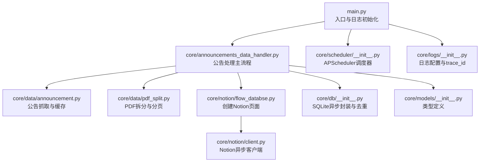
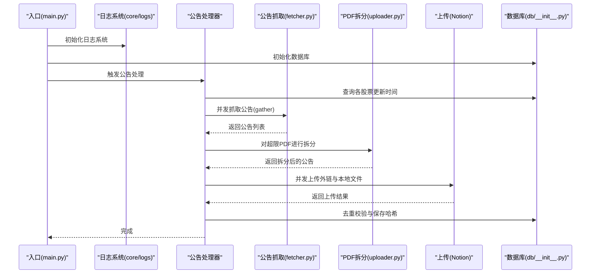
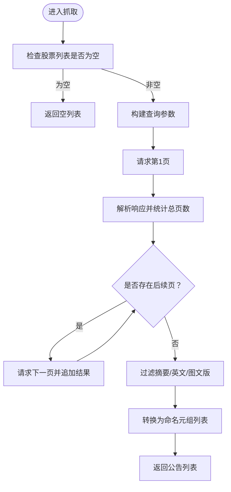
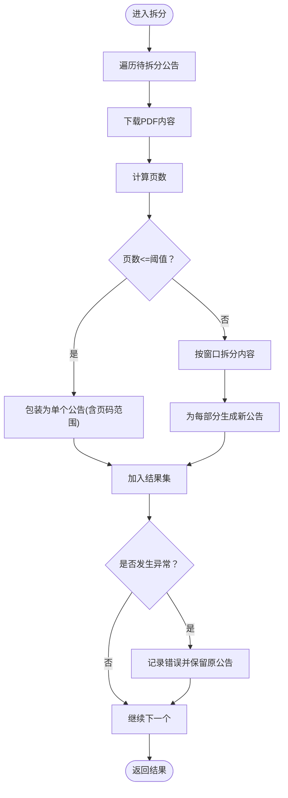
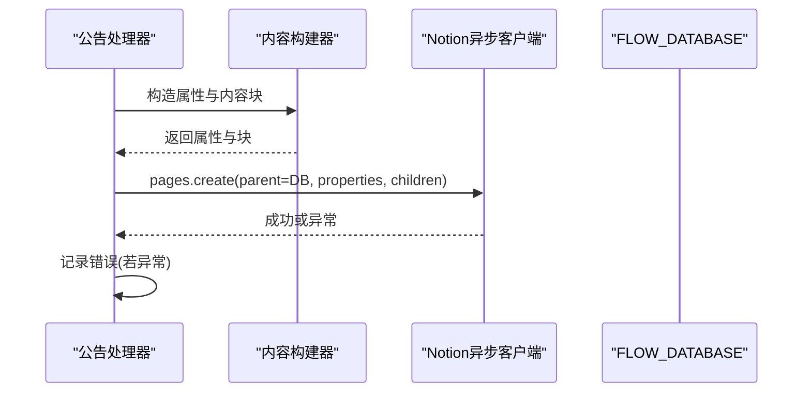
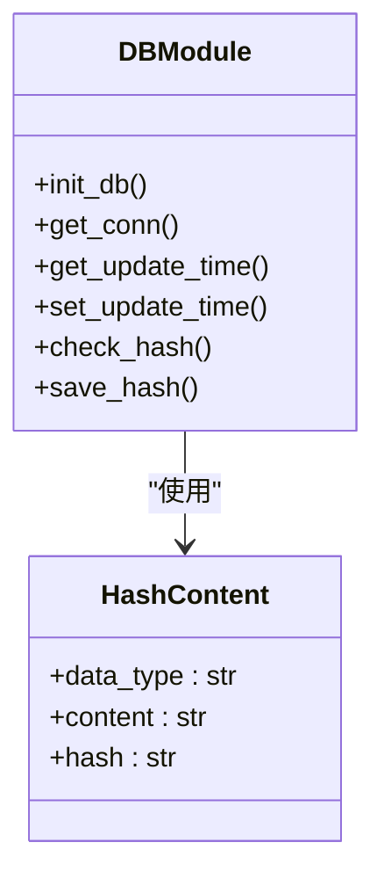
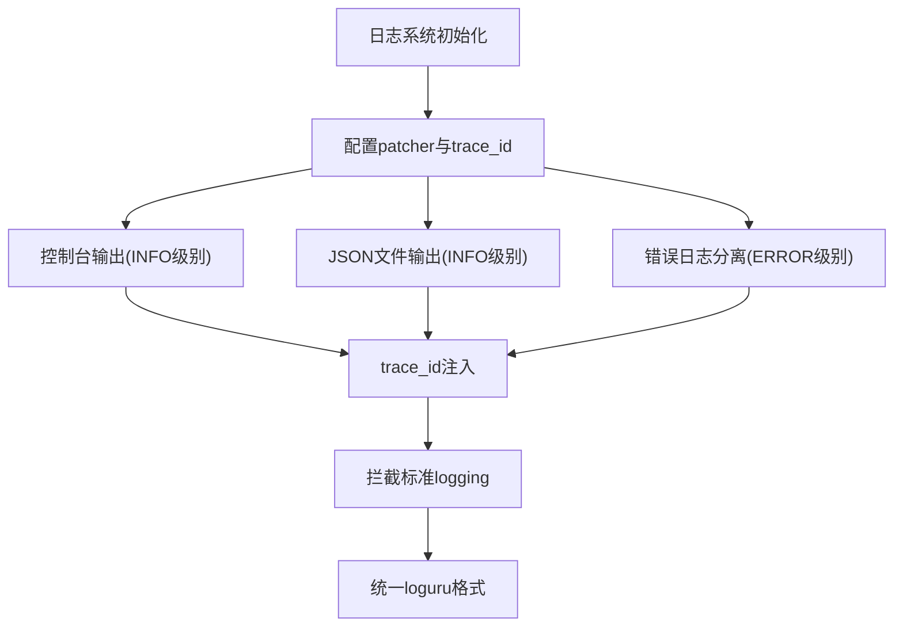
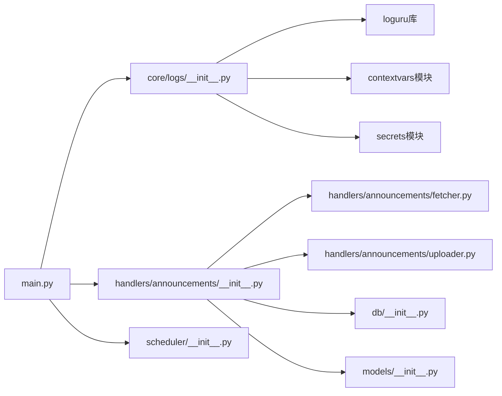

# 日志分析与调试

<cite>
**本文引用的文件**
- [main.py](file://main.py)
- [core/logs/__init__.py](file://core/logs/__init__.py)
- [core/handlers/announcements/__init__.py](file://core/handlers/announcements/__init__.py)
- [core/handlers/business.py](file://core/handlers/business.py)
- [core/handlers/announcements/fetcher.py](file://core/handlers/announcements/fetcher.py)
- [core/handlers/announcements/uploader.py](file://core/handlers/announcements/uploader.py)
- [core/utils/concurrency.py](file://core/utils/concurrency.py)
- [logs/app_2026-02-18.log](file://logs/app_2026-02-18.log)
- [logs/error_2026-02-18.log](file://logs/error_2026-02-18.log)
</cite>

## 更新摘要
**变更内容**
- 更新日志系统配置：从DEBUG级别升级为INFO级别生产就绪配置
- 新增trace_id支持用于跨任务关联和并发场景追踪
- 改进控制台格式化和JSON文件日志记录
- 更新日志格式示例和调试方法
- 增强错误日志分离和HTTP客户端日志级别控制

## 目录
1. [简介](#简介)
2. [项目结构](#项目结构)
3. [核心组件](#核心组件)
4. [架构总览](#架构总览)
5. [详细组件分析](#详细组件分析)
6. [依赖关系分析](#依赖关系分析)
7. [性能考量](#性能考量)
8. [故障排除指南](#故障排除指南)
9. [结论](#结论)
10. [附录](#附录)

## 简介
本指南面向"股票公告自动化系统"的日志分析与调试，聚焦以下目标：
- 明确日志级别与日志格式，建立统一的日志规范
- 识别关键错误模式与常见异常路径
- 提供异步任务调试技巧：任务状态跟踪、协程堆栈分析、事件循环监控
- 说明错误堆栈追踪、异常链分析与根因定位策略
- 给出调试工具使用建议：pdb、异步调试器、性能分析工具
- 提供日志聚合、过滤与可视化分析的实践方法
- 给出具体日志示例、调试命令与问题定位流程

## 项目结构
系统采用模块化组织，围绕"数据抓取—数据处理—上传—写入Notion—持久化"闭环展开。入口脚本负责初始化数据库与调度主流程；数据层负责从巨潮资讯网抓取公告并按需拆分PDF；上传层负责将附件上传至Notion并创建页面；数据库层负责去重与更新时间记录。

**图表来源**
- [main.py](file://main.py#L1-L45)
- [core/handlers/announcements/__init__.py](file://core/handlers/announcements/__init__.py#L1-L71)
- [core/handlers/announcements/fetcher.py](file://core/handlers/announcements/fetcher.py#L1-L80)
- [core/handlers/announcements/uploader.py](file://core/handlers/announcements/uploader.py#L1-L149)
- [core/logs/__init__.py](file://core/logs/__init__.py#L1-L114)

## 核心组件
- 入口与日志初始化：在入口处设置全局日志级别为INFO，启用trace_id追踪，便于全链路可观测性。
- 公告处理主流程：负责分组任务、并发抓取、PDF拆分、附件上传与页面创建。
- 数据抓取与缓存：异步HTTP请求抓取公告，内部缓存股票映射以减少重复请求。
- PDF拆分：根据页数阈值拆分大文件，保留原文件信息并生成带页码范围的新公告。
- Notion页面创建：构造属性与内容块，调用异步客户端创建页面并记录错误。
- 数据库封装：提供异步上下文管理器、去重与更新时间记录，保证幂等与一致性。
- 调度器：基于APScheduler的异步调度器，支持定时任务。
- 日志系统：使用loguru配置控制台彩色输出、JSON文件日志和错误日志，支持trace_id跨任务关联。

**章节来源**
- [main.py](file://main.py#L1-L45)
- [core/handlers/announcements/__init__.py](file://core/handlers/announcements/__init__.py#L1-L71)
- [core/handlers/announcements/fetcher.py](file://core/handlers/announcements/fetcher.py#L1-L80)
- [core/handlers/announcements/uploader.py](file://core/handlers/announcements/uploader.py#L1-L149)
- [core/logs/__init__.py](file://core/logs/__init__.py#L1-L114)

## 架构总览
系统采用"异步I/O + 事件循环 + 并发任务"的设计，通过gather并发执行多个子任务，提升吞吐量。日志贯穿各层，便于定位问题与审计流程。新的日志系统提供trace_id支持，可在并发场景中追踪跨任务关联。

**图表来源**
- [main.py](file://main.py#L1-L45)
- [core/logs/__init__.py](file://core/logs/__init__.py#L45-L90)
- [core/handlers/announcements/__init__.py](file://core/handlers/announcements/__init__.py#L19-L67)
- [core/handlers/announcements/fetcher.py](file://core/handlers/announcements/fetcher.py#L20-L79)
- [core/handlers/announcements/uploader.py](file://core/handlers/announcements/uploader.py#L37-L112)

## 详细组件分析

### 组件A：公告抓取与缓存
- 职责：从巨潮资讯网批量查询公告，支持分页拉取与标题过滤；内部缓存股票映射以降低重复请求。
- 关键日志点：开始抓取、分页迭代、结果转换与返回。
- 异常路径：网络请求失败、JSON解析异常、缓存命中与失效策略。
- 性能要点：批量查询、分页控制、缓存复用。

**章节来源**
- [core/handlers/announcements/fetcher.py](file://core/handlers/announcements/fetcher.py#L20-L79)

### 组件B：PDF拆分与分页
- 职责：下载PDF、计算页数、按阈值拆分为多个片段，生成带页码范围的新公告。
- 关键日志点：开始处理、页数统计、拆分过程、异常回退。
- 异常路径：下载失败、PDF解析失败、拆分异常。
- 性能要点：内存缓冲、页区间计算、资源清理。

**章节来源**
- [core/handlers/announcements/uploader.py](file://core/handlers/announcements/uploader.py#L37-L112)

### 组件C：Notion页面创建
- 职责：构造页面属性与内容块，调用异步客户端创建页面；记录创建失败的错误。
- 关键日志点：入参调试日志、创建调用、异常捕获。
- 异常路径：客户端调用异常、配置缺失（数据库ID）、权限问题。
- 性能要点：并发创建、批量属性构造。

**章节来源**
- [core/handlers/announcements/__init__.py](file://core/handlers/announcements/__init__.py#L48-L52)

### 组件D：数据库封装与去重
- 职责：异步连接管理、建表、去重校验、保存哈希、读取/更新时间。
- 关键日志点：连接获取、事务提交/回滚、查询与插入。
- 异常路径：连接失败、SQL异常、主键冲突、更新不存在记录。
- 性能要点：批量插入、哈希索引、连接池复用。

**章节来源**
- [core/handlers/announcements/__init__.py](file://core/handlers/announcements/__init__.py#L9-L16)

### 组件E：调度器
- 职责：提供异步调度器实例，支持定时任务。
- 关键日志点：启动与注册任务。
- 异常路径：时区配置、任务冲突、调度异常。

**章节来源**
- [core/handlers/business.py](file://core/handlers/business.py#L1-L135)

### 组件F：日志系统与trace_id追踪
- 职责：配置全局日志系统，支持trace_id跨任务关联，提供INFO级别生产就绪的日志输出。
- 关键日志点：控制台彩色输出、JSON文件记录、错误日志分离、trace_id注入。
- 异常路径：日志配置失败、trace_id生成异常、文件写入失败。
- 性能要点：异步文件写入、日志轮换、内存缓冲。

**章节来源**
- [core/logs/__init__.py](file://core/logs/__init__.py#L45-L113)

## 依赖关系分析
- 入口依赖：dotenv加载环境变量；初始化数据库；获取股票池；触发公告处理。
- 处理器依赖：数据抓取、PDF拆分、上传（URL与本地）、页面创建、数据库、模型类型。
- Notion客户端依赖：环境变量中的令牌与数据库ID。
- 日志系统依赖：loguru库、contextvars模块、secrets模块。
- 测试依赖：通过conftest将根目录加入sys.path，便于导入核心模块。

**图表来源**
- [main.py](file://main.py#L1-L45)
- [core/logs/__init__.py](file://core/logs/__init__.py#L1-L114)
- [core/handlers/announcements/__init__.py](file://core/handlers/announcements/__init__.py#L1-L71)
- [core/handlers/announcements/fetcher.py](file://core/handlers/announcements/fetcher.py#L1-L80)
- [core/handlers/announcements/uploader.py](file://core/handlers/announcements/uploader.py#L1-L149)

## 性能考量
- 并发策略：使用gather并发执行多个任务，显著缩短端到端耗时。
- I/O优化：异步HTTP客户端、异步SQLite连接，避免阻塞事件循环。
- 缓存策略：对股票映射使用LRU缓存，减少外部接口调用。
- 去重与幂等：通过哈希校验避免重复上传与创建页面。
- 资源管理：显式关闭PDF文档与数据库连接，防止资源泄漏。
- 日志性能：INFO级别日志减少DEBUG级别的开销，异步文件写入提高性能。

**章节来源**
- [core/handlers/announcements/fetcher.py](file://core/handlers/announcements/fetcher.py#L68-L79)
- [core/handlers/announcements/uploader.py](file://core/handlers/announcements/uploader.py#L104-L112)
- [core/utils/concurrency.py](file://core/utils/concurrency.py#L78-L109)

## 故障排除指南

### 一、日志级别设置与日志格式
- **更新** 日志系统已从DEBUG级别升级为INFO级别生产就绪配置
- 入口日志级别：入口脚本设置为INFO级别，启用trace_id追踪
- 模块日志：各模块通过logger获取自身命名空间的日志器，避免污染全局
- 建议格式：包含时间戳、级别、trace_id、函数名、消息体，便于快速定位
- 环境变量：可通过环境变量调整日志级别（例如设置LOG_LEVEL），并在入口处读取应用

**章节来源**
- [main.py](file://main.py#L1-L45)
- [core/logs/__init__.py](file://core/logs/__init__.py#L45-L90)

### 二、日志格式分析与关键错误模式识别
- **更新** 新增trace_id字段支持跨任务关联追踪
- 公告抓取
  - 关键日志：开始抓取、分页迭代、结果转换、返回数量
  - 常见错误：网络超时、HTTP状态异常、JSON解析失败、空列表返回
  - 排查要点：检查查询参数、接口限流、分页边界
- PDF拆分
  - 关键日志：开始处理、页数统计、拆分过程、异常回退
  - 常见错误：下载失败、PDF解析异常、内存不足、页区间越界
  - 排查要点：确认URL有效性、磁盘空间、页数阈值配置
- Notion页面创建
  - 关键日志：入参调试、创建调用、异常记录
  - 常见错误：数据库ID缺失、令牌无效、权限不足、请求体格式错误
  - 排查要点：核对环境变量、数据库ID、网络连通性
- 数据库
  - 关键日志：连接获取、事务提交/回滚、查询与插入
  - 常见错误：连接失败、SQL语法错误、主键冲突、更新不存在记录
  - 排查要点：检查数据库文件路径、权限、表结构一致性

**章节来源**
- [core/handlers/announcements/fetcher.py](file://core/handlers/announcements/fetcher.py#L35-L79)
- [core/handlers/announcements/uploader.py](file://core/handlers/announcements/uploader.py#L71-L112)
- [core/handlers/announcements/__init__.py](file://core/handlers/announcements/__init__.py#L29-L67)

### 三、异步任务调试技巧
- 任务状态跟踪
  - 使用gather并发收集结果，注意异常会被聚合；建议对每个任务单独try/except并记录上下文
  - 对于长时间运行的任务，可在关键节点打印当前进度与剩余任务数
  - **新增** 利用trace_id在并发场景中追踪跨任务关联
- 协程堆栈分析
  - 在事件循环中遇到卡顿时，使用异步调试器或在关键位置插入断点，查看当前协程栈
  - 对于异常，优先查看第一个异常而非最后一个，必要时启用异常链追踪
- 事件循环监控
  - 在入口处打印事件循环信息，确认是否为主线程或子线程事件循环
  - 对于调度器，确认时区与任务注册顺序，避免重复任务

**章节来源**
- [core/handlers/announcements/fetcher.py](file://core/handlers/announcements/fetcher.py#L68-L79)
- [core/handlers/announcements/uploader.py](file://core/handlers/announcements/uploader.py#L104-L112)
- [core/utils/concurrency.py](file://core/utils/concurrency.py#L78-L109)

### 四、错误堆栈追踪、异常链分析与根因定位
- 堆栈追踪
  - 在关键函数入口与出口打印上下文信息，结合异常的__traceback__定位调用链
  - 对于并发任务，记录任务参数与索引，便于回溯
  - **新增** 利用trace_id关联不同任务间的调用关系
- 异常链分析
  - 使用异常的__cause__与__context__，区分直接异常与间接异常
  - 对于数据库与网络异常，优先检查底层原因（连接、权限、超时）
- 根因定位
  - 从日志时间线入手，结合网络请求与数据库操作，逐步缩小范围
  - 对于间歇性问题，增加重试与熔断策略，并记录重试参数

**章节来源**
- [core/handlers/announcements/__init__.py](file://core/handlers/announcements/__init__.py#L58-L67)
- [core/handlers/announcements/uploader.py](file://core/handlers/announcements/uploader.py#L145-L148)

### 五、调试工具使用方法
- pdb调试器
  - 在入口或关键函数内插入断点，逐步执行，观察变量状态与调用栈
  - 适合同步代码与简单异步场景
- 异步调试器
  - 使用支持异步的调试器，在协程层面设置断点，查看事件循环状态
  - 适合复杂并发流程与协程嵌套场景
- 性能分析工具
  - 使用异步友好的性能分析器（如支持uvloop或trio的工具），关注I/O密集型瓶颈
  - 关注HTTP请求耗时、PDF解析耗时、数据库查询耗时

**章节来源**
- [main.py](file://main.py#L25-L45)
- [core/handlers/announcements/__init__.py](file://core/handlers/announcements/__init__.py#L19-L67)

### 六、日志聚合、过滤与可视化分析
- **更新** 新增trace_id支持跨任务关联
- 日志聚合
  - 将各模块日志输出到统一文件或标准输出，使用日志收集器集中存储
  - **新增** 利用trace_id字段进行跨任务关联分析
- 日志过滤
  - 按模块、级别、trace_id、关键词过滤（如"创建页面失败"、"分割PDF失败"）
  - **新增** 支持按trace_id过滤特定任务的完整调用链
- 可视化分析
  - 使用日志分析平台展示耗时分布、错误趋势、并发峰值
  - 结合时间序列图观察任务执行节奏与异常集中时段

**章节来源**
- [core/logs/__init__.py](file://core/logs/__init__.py#L45-L90)
- [core/handlers/announcements/__init__.py](file://core/handlers/announcements/__init__.py#L30-L31)

### 七、具体日志示例与调试命令
- **更新** 新增INFO级别日志格式示例和trace_id字段
- 日志示例
  - 公告抓取：包含"开始抓取"、"分页请求"、"结果转换"等阶段日志
  - PDF拆分：包含"开始处理PDF"、"页数统计"、"拆分完成/失败"等日志
  - 页面创建：包含"创建页面：入参"、"创建调用"、"创建失败"等日志
  - **新增** INFO级别控制台输出示例："12:10:04.465 | INFO     | 核心组件 | 函数名 | 加载环境变量"
  - **新增** JSON文件日志示例：包含trace_id、extra字段的完整记录
- 调试命令
  - 设置日志级别：在入口处读取环境变量并应用
  - 并发调试：在处理器中对每个任务单独try/except并记录参数
  - 数据库调试：在事务提交/回滚前后打印状态，检查SQL执行计划
  - **新增** trace_id调试：使用set_trace_id()设置任务级trace_id，用get_trace_id()获取当前上下文

**章节来源**
- [core/handlers/announcements/fetcher.py](file://core/handlers/announcements/fetcher.py#L35-L79)
- [core/handlers/announcements/uploader.py](file://core/handlers/announcements/uploader.py#L71-L112)
- [core/handlers/announcements/__init__.py](file://core/handlers/announcements/__init__.py#L29-L67)
- [core/logs/__init__.py](file://core/logs/__init__.py#L21-L37)

### 八、问题定位流程
- 快速定位
  - 查看最近错误日志，确认异常类型与发生模块
  - 检查网络与外部服务状态（接口可用性、令牌有效、数据库可达）
  - **新增** 使用trace_id关联跨任务调用链，快速定位问题传播路径
- 深入排查
  - 逐层回放调用链，核对参数与返回值
  - 对并发任务逐一验证，排除竞态条件与资源竞争
  - **新增** 分析trace_id相同的任务组，识别并发场景下的问题模式
- 复现与修复
  - 在测试环境中最小化复现步骤，补充单元测试覆盖
  - 修复后回归验证，持续监控日志与指标

**章节来源**
- [core/handlers/announcements/__init__.py](file://core/handlers/announcements/__init__.py#L58-L67)
- [core/handlers/announcements/uploader.py](file://core/handlers/announcements/uploader.py#L145-L148)

## 结论
通过统一的日志规范、清晰的异步任务结构与完善的异常处理，系统具备良好的可观测性与可维护性。新的日志系统提供了trace_id支持，能够在并发场景中实现跨任务关联追踪，大大提升了问题定位效率。建议在现有基础上进一步完善：
- 增强日志格式标准化与结构化输出
- 引入指标埋点与告警
- 丰富单元测试与集成测试覆盖
- 建立日志可视化仪表盘与趋势分析

## 附录
- 环境变量
  - NOTION_TOKEN：Notion访问令牌
  - FLOW_DATABASE：Notion资讯流数据库ID
- 类型定义
  - NotionDate：字符串形式的日期类型别名
- 调度器
  - AsyncIOScheduler：异步调度器实例，时区为亚洲/上海
- **新增** 日志系统特性
  - trace_id：跨异步任务追踪标识符
  - INFO级别生产就绪配置
  - JSON文件日志与错误日志分离
  - 标准logging拦截与统一格式化

**章节来源**
- [core/handlers/business.py](file://core/handlers/business.py#L1-L135)
- [core/handlers/announcements/__init__.py](file://core/handlers/announcements/__init__.py#L1-L71)
- [core/logs/__init__.py](file://core/logs/__init__.py#L1-L114)