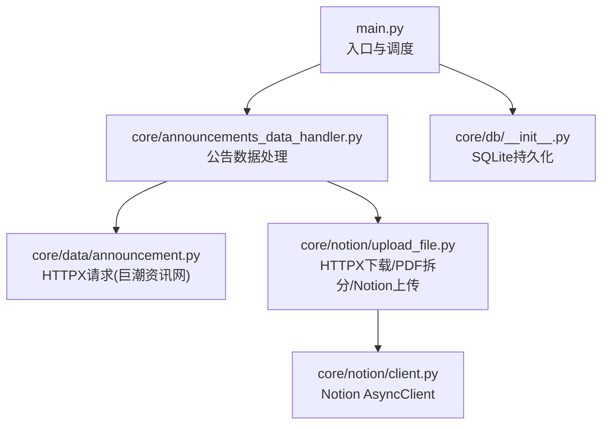
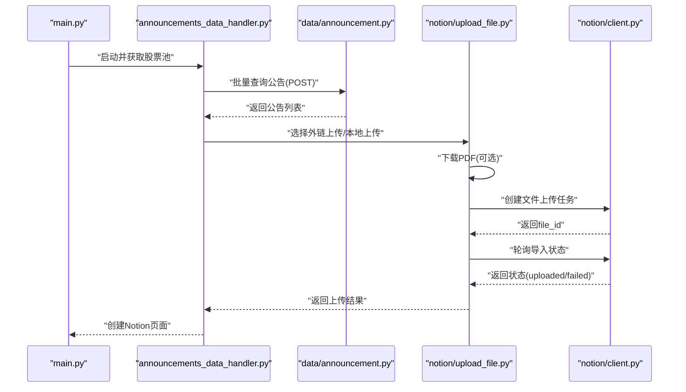
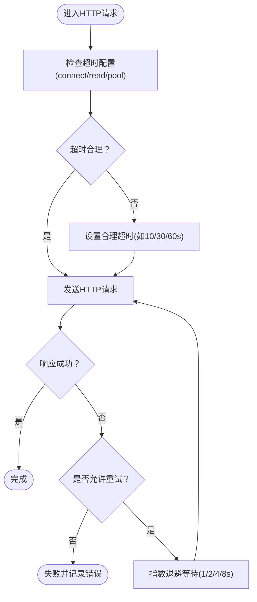
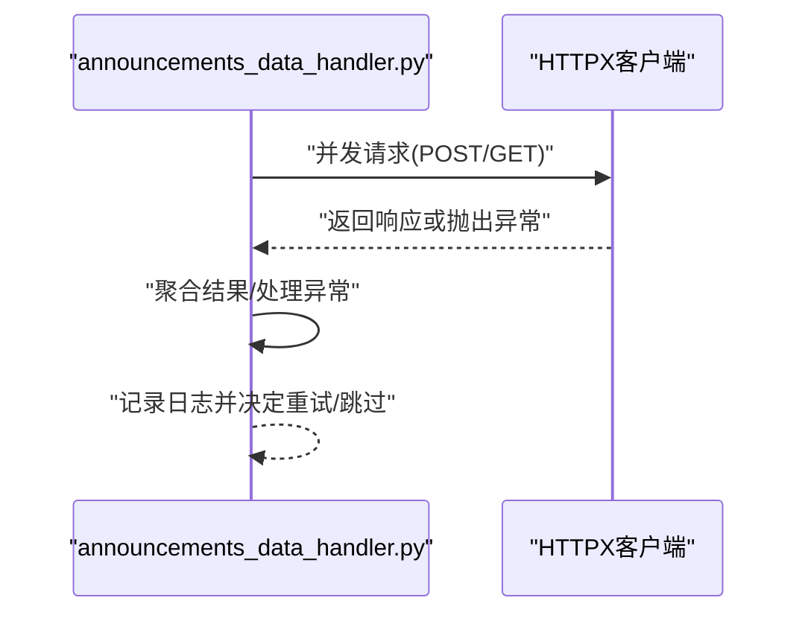
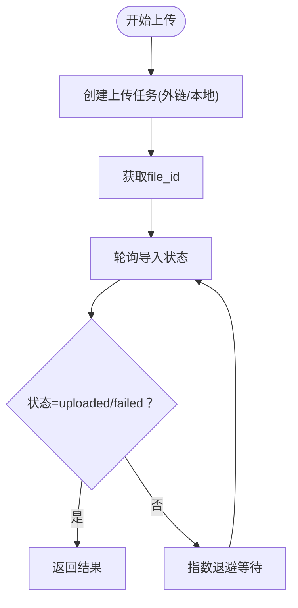
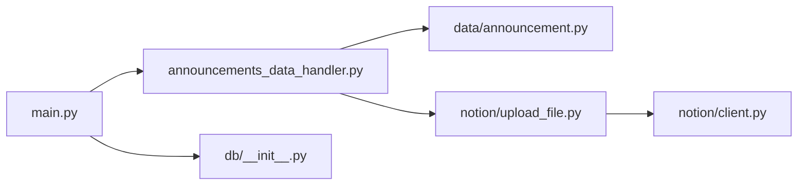

# 网络连接问题

<cite>
**本文引用的文件**
- [main.py](file://main.py)
- [announcements_data_handler.py](file://core/announcements_data_handler.py)
- [announcement.py](file://core/data/announcement.py)
- [upload_file.py](file://core/notion/upload_file.py)
- [stock_pool.py](file://core/notion/stock_pool.py)
- [client.py](file://core/notion/client.py)
- [db_init.py](file://core/db/__init__.py)
</cite>

## 目录
1. [简介](#简介)
2. [项目结构](#项目结构)
3. [核心组件](#核心组件)
4. [架构总览](#架构总览)
5. [详细组件分析](#详细组件分析)
6. [依赖关系分析](#依赖关系分析)
7. [性能考量](#性能考量)
8. [故障排除指南](#故障排除指南)
9. [结论](#结论)
10. [附录](#附录)

## 简介
本指南聚焦于股票公告自动化系统在访问巨潮资讯网API及进行异步网络请求时的常见网络连接问题，提供系统性的故障排除方法。内容涵盖网络超时、DNS解析错误、代理设置问题、防火墙阻断、HTTP请求失败诊断（状态码分析、重试机制、连接池管理）、异步网络请求的错误处理策略（连接重试、超时设置、异常捕获）、网络监控与健康检查技巧，以及具体的错误代码参考与修复步骤。

## 项目结构
系统采用模块化设计，围绕“获取股票池 -> 获取公告 -> 上传附件 -> 写入Notion”的主流程展开。网络相关的关键路径包括：
- 主入口负责初始化数据库与获取股票池
- 公告数据处理器负责分批并发拉取公告并触发附件上传
- 数据层通过HTTPX发起对巨潮资讯网的POST/GET请求
- Notion上传模块通过HTTPX下载PDF并调用Notion文件上传接口，配合轮询检测导入状态

图表来源
- [main.py](file://main.py#L20-L39)
- [announcements_data_handler.py](file://core/announcements_data_handler.py#L21-L116)
- [announcement.py](file://core/data/announcement.py#L36-L112)
- [upload_file.py](file://core/notion/upload_file.py#L28-L150)
- [client.py](file://core/notion/client.py#L1-L6)
- [db_init.py](file://core/db/__init__.py#L62-L94)

章节来源
- [main.py](file://main.py#L1-L40)
- [announcements_data_handler.py](file://core/announcements_data_handler.py#L1-L116)
- [announcement.py](file://core/data/announcement.py#L1-L141)
- [upload_file.py](file://core/notion/upload_file.py#L1-L180)
- [client.py](file://core/notion/client.py#L1-L6)
- [db_init.py](file://core/db/__init__.py#L1-L218)

## 核心组件
- HTTPX异步客户端：在多个模块中使用，用于发起HTTP请求（GET/POST），默认行为为同步阻塞式超时控制，需结合重试与超时策略。
- 巨潮资讯网API：通过POST查询历史公告，分页拉取；另有一个GET接口用于获取股票映射。
- Notion文件上传：支持本地内容上传与外链直传两种模式，均通过轮询检测导入状态，内置指数退避重试。
- 数据库层：维护更新时间与去重哈希，保障幂等与增量更新。
- 日志与异常：广泛使用logging输出调试信息，异常向上抛出以便上层统一处理。

章节来源
- [announcement.py](file://core/data/announcement.py#L36-L112)
- [upload_file.py](file://core/notion/upload_file.py#L28-L150)
- [db_init.py](file://core/db/__init__.py#L153-L215)

## 架构总览
系统整体数据流如下：

图表来源
- [main.py](file://main.py#L20-L39)
- [announcements_data_handler.py](file://core/announcements_data_handler.py#L21-L116)
- [announcement.py](file://core/data/announcement.py#L36-L112)
- [upload_file.py](file://core/notion/upload_file.py#L28-L150)
- [client.py](file://core/notion/client.py#L1-L6)

## 详细组件分析

### 组件A：HTTP请求与重试策略
- 请求发起：使用HTTPX异步客户端，分别在公告查询与股票映射接口中发起POST/GET请求。
- 默认行为：HTTPX在无显式配置时采用同步阻塞式超时，建议显式设置connect/read/pool超时参数。
- 重试机制：当前未实现自动重试，建议在关键接口引入指数退避重试（如1,2,4,8秒）。
- 连接池：HTTPX默认复用连接，但未设置连接池上限；建议根据并发量调整连接池参数。

图表来源
- [announcement.py](file://core/data/announcement.py#L79-L92)
- [announcement.py](file://core/data/announcement.py#L136-L138)

章节来源
- [announcement.py](file://core/data/announcement.py#L36-L112)

### 组件B：异步网络请求与错误处理
- 并发模型：使用asyncio.gather并发执行多个任务，提升吞吐。
- 错误传播：未捕获的异常会传播至上层，建议在外层统一try/except并记录上下文。
- 超时设置：建议为每个HTTPX客户端实例设置合理的timeout，避免长时间阻塞。
- 异常捕获：对外部服务调用建议捕获ConnectionError、ReadTimeout、HTTPStatusError等。

图表来源
- [announcements_data_handler.py](file://core/announcements_data_handler.py#L40-L62)
- [announcements_data_handler.py](file://core/announcements_data_handler.py#L89-L115)

章节来源
- [announcements_data_handler.py](file://core/announcements_data_handler.py#L1-L116)

### 组件C：Notion文件上传与轮询
- 上传模式：外链直传与本地内容上传两种路径，均通过轮询检测导入状态。
- 轮询策略：指数退避（1,2,4,8,16秒），最多尝试固定次数，超时返回失败。
- 结果处理：根据状态标记成功/失败，记录错误信息便于排障。

图表来源
- [upload_file.py](file://core/notion/upload_file.py#L124-L150)
- [upload_file.py](file://core/notion/upload_file.py#L153-L176)

章节来源
- [upload_file.py](file://core/notion/upload_file.py#L28-L150)

### 组件D：数据库与幂等性
- 更新时间记录：维护每只股票的数据更新时间，支持增量拉取。
- 哈希去重：计算内容哈希，避免重复写入。
- 事务管理：使用异步上下文管理器保证事务一致性。

章节来源
- [db_init.py](file://core/db/__init__.py#L153-L215)

## 依赖关系分析
- 模块耦合：公告数据处理器依赖数据层与Notion上传模块；数据层依赖HTTPX；Notion上传模块依赖Notion AsyncClient。
- 外部依赖：HTTPX、pymupdf、notion-client、aiosqlite。
- 潜在风险：HTTPX默认超时较短，若网络不稳定易触发超时；轮询间隔固定，可能在高并发下造成Notion侧压力。

图表来源
- [main.py](file://main.py#L20-L39)
- [announcements_data_handler.py](file://core/announcements_data_handler.py#L21-L116)
- [announcement.py](file://core/data/announcement.py#L36-L112)
- [upload_file.py](file://core/notion/upload_file.py#L28-L150)
- [client.py](file://core/notion/client.py#L1-L6)
- [db_init.py](file://core/db/__init__.py#L62-L94)

章节来源
- [main.py](file://main.py#L1-L40)
- [announcements_data_handler.py](file://core/announcements_data_handler.py#L1-L116)
- [announcement.py](file://core/data/announcement.py#L1-L141)
- [upload_file.py](file://core/notion/upload_file.py#L1-L180)
- [client.py](file://core/notion/client.py#L1-L6)
- [db_init.py](file://core/db/__init__.py#L1-L218)

## 性能考量
- 并发控制：合理设置并发数量，避免对目标服务器与本地资源造成过大压力。
- 连接池：为HTTPX设置连接池上限与复用策略，减少TCP握手开销。
- 超时参数：区分connect/read/pool超时，避免因读取超时导致任务堆积。
- 缓存与去重：利用LRU缓存与哈希去重减少重复请求与写入。

## 故障排除指南

### 一、巨潮资讯网API连接失败
- 症状表现
  - 网络超时：请求在设定时间内未完成，出现超时错误。
  - DNS解析错误：域名无法解析，报错显示主机名不可达。
  - 代理设置问题：通过代理访问受限或认证失败。
  - 防火墙阻断：端口被阻断，请求被拒绝。
- 诊断步骤
  - 使用命令行工具验证连通性与解析：nslookup/ dig/ curl。
  - 检查系统代理与系统/浏览器代理设置，确认与应用一致。
  - 在应用中显式配置HTTPX超时与代理，避免默认行为导致的不稳定。
  - 若为内网限制，联系网络管理员放行目标域名与端口。
- 解决方案
  - 显式设置HTTPX超时：connect=10s、read=30s、pool=60s。
  - 配置代理：在HTTPX客户端中设置proxy参数。
  - 重试策略：对非幂等请求谨慎重试，对幂等请求采用指数退避。
  - 连接池：限制最大并发连接数，避免资源耗尽。

章节来源
- [announcement.py](file://core/data/announcement.py#L79-L92)
- [announcement.py](file://core/data/announcement.py#L136-L138)

### 二、HTTP请求失败诊断
- 状态码分析
  - 2xx：成功，检查响应体结构是否符合预期。
  - 4xx：客户端错误（如400/401/403/404），核对参数与鉴权。
  - 5xx：服务器错误，建议延迟重试。
  - 超时/连接中断：检查网络与代理配置。
- 重试机制配置
  - 建议对GET/POST接口启用指数退避重试（1,2,4,8秒），最多3-5次。
  - 对幂等请求（GET/HEAD）优先重试，对非幂等请求谨慎重试。
- 连接池管理
  - 设置HTTPX连接池上限，避免过多并发导致连接耗尽。
  - 合理复用连接，减少TCP三次握手与TLS握手成本。

章节来源
- [announcement.py](file://core/data/announcement.py#L79-L92)

### 三、异步网络请求的错误处理策略
- 连接重试
  - 在外层捕获连接异常，按指数退避重试，记录重试次数与原因。
- 超时设置
  - 为每个HTTPX客户端设置明确的超时参数，避免长时间阻塞。
- 异常捕获
  - 捕获ConnectionError、ReadTimeout、HTTPStatusError等，记录请求URL与参数。
- 并发控制
  - 使用asyncio.gather并发执行，注意异常聚合与部分失败处理。

章节来源
- [announcements_data_handler.py](file://core/announcements_data_handler.py#L40-L62)
- [announcements_data_handler.py](file://core/announcements_data_handler.py#L89-L115)

### 四、网络监控与健康检查
- 健康检查
  - 定期访问目标API的轻量接口，检查可用性与响应时间。
  - 监控DNS解析成功率与代理连通性。
- 日志与指标
  - 记录请求耗时、失败率、重试次数、状态码分布。
  - 对异常进行分级记录，便于快速定位问题。
- 工具使用
  - 使用curl/wget/nmap等工具进行连通性与端口探测。
  - 使用抓包工具（如Wireshark）分析DNS与TCP握手过程。

### 五、错误代码参考与修复步骤
- 常见错误类型
  - DNS解析失败：检查DNS配置与网络连通性。
  - 连接超时：增大超时阈值，优化网络路径。
  - 代理认证失败：校验代理凭据与规则。
  - 防火墙拦截：放行目标域名与端口。
- 修复步骤
  - 步骤1：确认网络连通性与DNS解析。
  - 步骤2：检查代理与系统网络设置。
  - 步骤3：在应用中显式配置HTTPX超时与代理。
  - 步骤4：为关键接口增加重试与熔断策略。
  - 步骤5：持续监控并记录日志，形成闭环。

## 结论
针对股票公告自动化系统的网络连接问题，建议从超时与代理配置入手，完善重试与连接池策略，强化异步错误处理与监控体系。通过分层诊断与工具辅助，可有效降低巨潮资讯网API访问失败的概率，提升系统稳定性与可维护性。

## 附录
- 关键实现位置参考
  - 公告查询与分页：[get_announcements](file://core/data/announcement.py#L36-L112)
  - 股票映射获取：[get_stock_json](file://core/data/announcement.py#L115-L141)
  - 外链上传与轮询：[_upload_external_and_wait/_poll_upload_status](file://core/notion/upload_file.py#L124-L176)
  - 本地上传与下载：[_upload_internal_and_wait](file://core/notion/upload_file.py#L64-L96)
  - 并发调度与聚合：[process_announcements_data_for_stock_list](file://core/announcements_data_handler.py#L21-L116)
  - Notion客户端初始化：[AsyncClient](file://core/notion/client.py#L1-L6)
  - 数据库初始化与更新时间：[init_db/get_update_time/set_update_time](file://core/db/__init__.py#L62-L215)