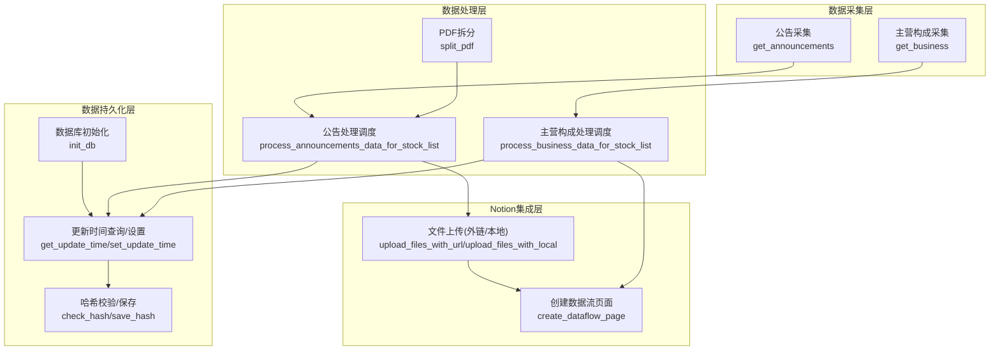
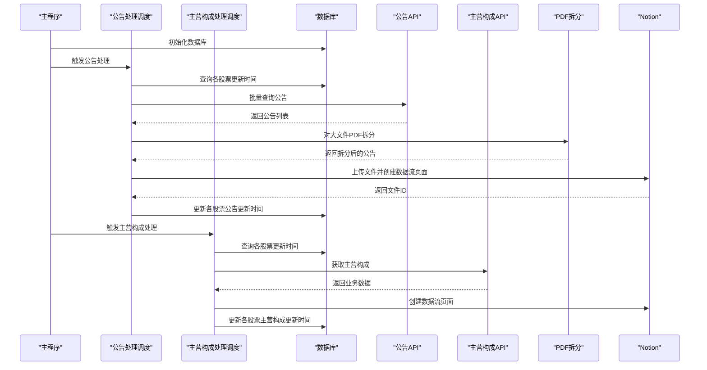
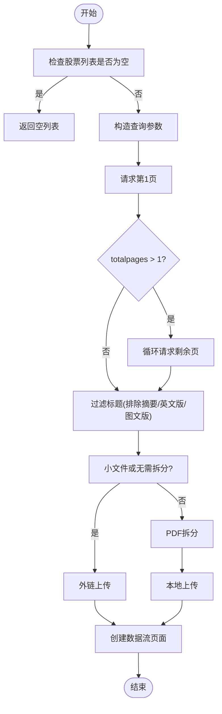
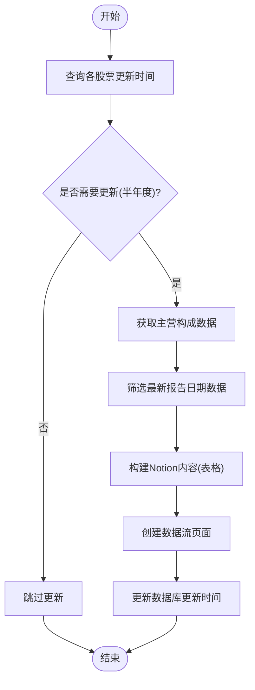
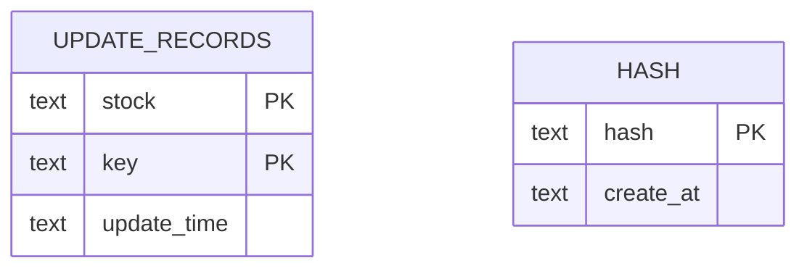
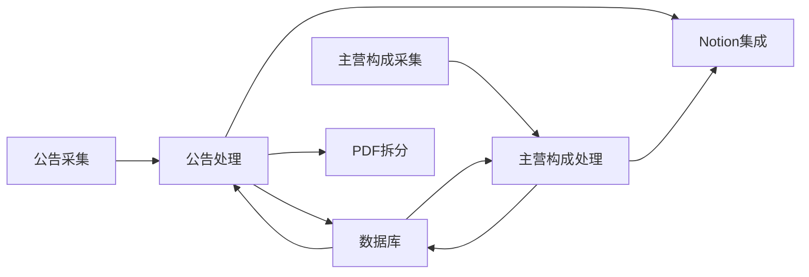

# 数据模型

<cite>
**本文引用的文件**   
- [core/data/announcement.py](file://core/data/announcement.py)
- [core/data/business.py](file://core/data/business.py)
- [core/data/pdf_split.py](file://core/data/pdf_split.py)
- [core/db/__init__.py](file://core/db/__init__.py)
- [core/models/__init__.py](file://core/models/__init__.py)
- [core/announcements_data_handler.py](file://core/announcements_data_handler.py)
- [core/business_data_handler.py](file://core/business_data_handler.py)
- [main.py](file://main.py)
- [tests/test_announcement.py](file://tests/test_announcement.py)
- [tests/test_business.py](file://tests/test_business.py)
- [tests/test_models.py](file://tests/test_models.py)
</cite>

## 目录
1. [简介](#简介)
2. [项目结构](#项目结构)
3. [核心组件](#核心组件)
4. [架构总览](#架构总览)
5. [详细组件分析](#详细组件分析)
6. [依赖分析](#依赖分析)
7. [性能考量](#性能考量)
8. [故障排查指南](#故障排查指南)
9. [结论](#结论)
10. [附录](#附录)

## 简介
本文件为“股票公告自动化系统”的数据模型文档，聚焦于实体关系、字段定义、数据类型、主键/外键、索引与约束、数据验证与业务规则、数据库模式图、示例数据、数据访问模式、缓存策略、性能考虑、数据生命周期与保留策略、归档规则、迁移路径与版本管理、以及数据安全与隐私要求。文档基于仓库中的实际代码与测试用例进行梳理与可视化呈现，帮助开发者与非技术读者快速理解系统数据层的设计与运行机制。

## 项目结构
系统采用分层与职责分离的组织方式：
- 数据采集层：负责从外部API抓取公告与主营构成数据，封装为命名元组。
- 数据处理层：对采集数据进行清洗、拆分PDF、构建Notion内容等。
- 数据持久化层：使用SQLite异步连接，维护更新时间与去重哈希。
- Notion集成层：将处理后的数据写入Notion数据流页面。
- 主入口：初始化数据库并调度各数据处理流程。

图表来源
- [core/data/announcement.py](file://core/data/announcement.py#L36-L112)
- [core/data/business.py](file://core/data/business.py#L33-L95)
- [core/data/pdf_split.py](file://core/data/pdf_split.py#L15-L73)
- [core/db/__init__.py](file://core/db/__init__.py#L62-L94)
- [core/db/__init__.py](file://core/db/__init__.py#L153-L214)
- [core/announcements_data_handler.py](file://core/announcements_data_handler.py#L21-L115)
- [core/business_data_handler.py](file://core/business_data_handler.py#L17-L67)

章节来源
- [main.py](file://main.py#L20-L35)
- [core/db/__init__.py](file://core/db/__init__.py#L62-L94)

## 核心组件
本节概述系统中的关键数据模型与数据库表结构，明确字段、类型、约束与业务含义。

- 公告模型（命名元组）
  - 字段
    - id: 字符串，公告唯一标识（来自外部API）
    - stock: 字符串，股票代码或名称
    - title: 字符串，公告标题
    - size: 整数，文件大小（KB）
    - url: 字符串，公告文件下载地址
    - published_date: 时间戳（datetime），公告发布时间
  - 用途：承载从巨潮资讯网抓取的公告信息，供后续处理与写入Notion使用

- 主营业务构成模型（命名元组）
  - 字段
    - report_date: 日期，报告日期（取自最新报告期）
    - industry_df: DataFrame，按行业维度的主营构成
    - product_df: DataFrame，按产品维度的主营构成
    - region_df: DataFrame，按地区维度的主营构成
  - 用途：承载主营构成数据，供Notion内容构建与页面创建

- Notion日期类型（NewType）
  - 类型：字符串别名，用于统一Notion日期格式
  - 语义：YYYY-MM-DD 或兼容字符串，便于跨模块传递

- 数据库表
  - update_records
    - 字段
      - stock: 文本，NOT NULL
      - key: 文本，NOT NULL
      - update_time: 文本（ISO格式字符串）
    - 主键：(stock, key)
    - 约束：联合主键保证每只股票在每个键下的唯一更新记录
    - 用途：记录各股票在“公告”和“主营构成”两类数据上的最后更新时间
  - hash
    - 字段
      - hash: 文本，PRIMARY KEY
      - create_at: 文本，NOT NULL（ISO格式字符串）
    - 约束：hash为主键，避免重复数据入库
    - 用途：基于内容计算哈希，去重存储

章节来源
- [core/data/announcement.py](file://core/data/announcement.py#L12-L33)
- [core/data/business.py](file://core/data/business.py#L16-L31)
- [core/models/__init__.py](file://core/models/__init__.py#L3-L7)
- [core/db/__init__.py](file://core/db/__init__.py#L77-L93)
- [core/db/__init__.py](file://core/db/__init__.py#L87-L92)

## 架构总览
系统数据流从外部API抓取公告与主营构成，经由数据处理层清洗与拆分，再写入Notion数据流页面；同时利用SQLite维护更新时间与去重哈希，确保幂等与一致性。

图表来源
- [main.py](file://main.py#L20-L35)
- [core/announcements_data_handler.py](file://core/announcements_data_handler.py#L21-L115)
- [core/business_data_handler.py](file://core/business_data_handler.py#L17-L67)
- [core/db/__init__.py](file://core/db/__init__.py#L153-L214)
- [core/data/announcement.py](file://core/data/announcement.py#L36-L112)
- [core/data/business.py](file://core/data/business.py#L33-L95)
- [core/data/pdf_split.py](file://core/data/pdf_split.py#L15-L73)

## 详细组件分析

### 公告数据模型与处理
- 数据模型
  - Announcement：承载单条公告的全部必要信息，便于后续处理与写入Notion。
- 处理流程
  - 批量查询：根据股票列表与日期区间调用外部API，支持多页聚合。
  - 过滤策略：排除摘要、英文版、图文版等非全文类型。
  - 文件处理：小文件直接外链上传；大文件PDF按页数拆分，生成带页码范围的新标题与ID。
  - 写入Notion：创建数据流页面并关联股票关系。
- 关键算法与流程

图表来源
- [core/data/announcement.py](file://core/data/announcement.py#L36-L112)
- [core/data/pdf_split.py](file://core/data/pdf_split.py#L15-L73)
- [core/announcements_data_handler.py](file://core/announcements_data_handler.py#L65-L93)

章节来源
- [core/data/announcement.py](file://core/data/announcement.py#L36-L112)
- [core/data/pdf_split.py](file://core/data/pdf_split.py#L15-L73)
- [core/announcements_data_handler.py](file://core/announcements_data_handler.py#L21-L115)
- [tests/test_announcement.py](file://tests/test_announcement.py#L112-L307)

### 主营业务构成数据模型与处理
- 数据模型
  - BusinessData：包含报告日期与三类维度（行业/产品/地区）的DataFrame，便于构建Notion表格。
- 处理流程
  - 数据筛选：取最新报告日期的数据，按分类类型拆分为三张表。
  - 内容构建：使用Notion内容构建器将DataFrame转为表格。
  - 页面创建：生成数据流页面并更新数据库中的更新时间。
- 更新策略
  - 半年度更新：仅在上个半年报季末之后才更新，避免频繁抓取。

图表来源
- [core/business_data_handler.py](file://core/business_data_handler.py#L17-L67)
- [core/data/business.py](file://core/data/business.py#L33-L95)
- [core/db/__init__.py](file://core/db/__init__.py#L153-L214)

章节来源
- [core/data/business.py](file://core/data/business.py#L16-L95)
- [core/business_data_handler.py](file://core/business_data_handler.py#L17-L108)
- [tests/test_business.py](file://tests/test_business.py#L54-L226)

### 数据库模式与约束
- 表结构
  - update_records
    - 主键：(stock, key)
    - 作用：记录各股票在“公告/主营构成”两类数据上的最后更新时间
  - hash
    - 主键：hash
    - 作用：基于内容计算哈希，避免重复入库
- 访问模式
  - get_update_time：按股票列表与键查询更新时间，缺失则插入默认记录
  - set_update_time：更新指定股票与键的更新时间，若无记录则抛错（保证业务一致性）
  - check_hash/save_hash：批量计算内容哈希并去重/入库
- 索引与约束
  - update_records：联合主键，保证唯一性
  - hash：主键，保证哈希唯一
  - 字段类型：文本（TEXT）存储日期与哈希，遵循SQLite字符串存储特性

图表来源
- [core/db/__init__.py](file://core/db/__init__.py#L77-L93)
- [core/db/__init__.py](file://core/db/__init__.py#L87-L92)

章节来源
- [core/db/__init__.py](file://core/db/__init__.py#L62-L94)
- [core/db/__init__.py](file://core/db/__init__.py#L97-L151)
- [core/db/__init__.py](file://core/db/__init__.py#L153-L214)

### 数据访问模式与缓存策略
- 缓存策略
  - 股票映射缓存：对“沪深京”股票映射进行缓存，减少重复网络请求
- 数据访问模式
  - 异步上下文管理：统一数据库连接生命周期，自动提交/回滚
  - 批量操作：哈希校验与保存采用批量插入，提升吞吐
  - 条件更新：根据更新时间决定查询范围，减少无效请求

章节来源
- [core/data/announcement.py](file://core/data/announcement.py#L115-L140)
- [core/db/__init__.py](file://core/db/__init__.py#L28-L52)
- [core/db/__init__.py](file://core/db/__init__.py#L131-L151)

### 示例数据
- 公告示例
  - id: "ann_001"
  - stock: "000001"
  - title: "平安银行(000001)-2023年年度报告"
  - size: 1500
  - url: "https://static.cninfo.com.cn/finalpage/2023-12-31/test1.PDF"
  - published_date: 2024-01-01 08:00:00（UTC转东八区）
- 主营业务构成示例
  - report_date: 2023-12-31
  - industry_df: 包含行业分类、主营收入、收入比例、主营成本、成本比例、主营利润、利润比例、毛利率
  - product_df: 包含产品分类、主营收入、收入比例、主营成本、成本比例、主营利润、利润比例、毛利率
  - region_df: 包含地区分类、主营收入、收入比例、主营成本、成本比例、主营利润、利润比例、毛利率

章节来源
- [tests/test_announcement.py](file://tests/test_announcement.py#L124-L189)
- [tests/test_business.py](file://tests/test_business.py#L58-L103)

## 依赖分析
- 组件耦合
  - 数据采集层与处理层通过命名元组解耦，便于单元测试与替换实现
  - 数据库层提供统一的更新时间与去重能力，被两类数据处理流程复用
  - Notion集成层依赖数据处理层输出的文件ID与页面内容
- 外部依赖
  - 公告：巨潮资讯网API
  - 主营构成：AkShare + pandas
  - PDF处理：PyMuPDF
  - 数据库：aiosqlite
  - 文件上传：Notion SDK（通过封装方法）

图表来源
- [core/data/announcement.py](file://core/data/announcement.py#L36-L112)
- [core/data/business.py](file://core/data/business.py#L33-L95)
- [core/data/pdf_split.py](file://core/data/pdf_split.py#L15-L73)
- [core/db/__init__.py](file://core/db/__init__.py#L153-L214)
- [core/announcements_data_handler.py](file://core/announcements_data_handler.py#L21-L115)
- [core/business_data_handler.py](file://core/business_data_handler.py#L17-L67)

章节来源
- [core/announcements_data_handler.py](file://core/announcements_data_handler.py#L21-L115)
- [core/business_data_handler.py](file://core/business_data_handler.py#L17-L67)
- [core/db/__init__.py](file://core/db/__init__.py#L62-L94)

## 性能考量
- 网络请求优化
  - 批量查询：同一时间段内对多只股票合并请求，减少API调用次数
  - 分页聚合：根据totalpages动态扩展请求页数
- 存储与去重
  - 哈希去重：基于内容计算xxh3_64哈希，避免重复入库
  - 批量插入：save_hash采用executemany，提升写入效率
- I/O与并发
  - 异步上下文管理：统一连接生命周期，避免连接泄漏
  - 并发任务：公告与文件上传采用gather并行，缩短端到端时延
- PDF处理
  - 大文件拆分：按固定块大小与重叠页数拆分，平衡单页过大与碎片过多
  - 内存缓冲：使用BytesIO减少磁盘I/O

章节来源
- [core/data/announcement.py](file://core/data/announcement.py#L57-L93)
- [core/data/pdf_split.py](file://core/data/pdf_split.py#L15-L73)
- [core/db/__init__.py](file://core/db/__init__.py#L131-L151)
- [core/announcements_data_handler.py](file://core/announcements_data_handler.py#L62-L93)

## 故障排查指南
- 常见问题与定位
  - 公告为空：确认股票列表非空且日期区间合理；检查过滤条件是否误删
  - 外链上传失败：检查URL有效性与文件大小限制；确认Notion外链可用性
  - PDF拆分异常：检查网络下载与页数解析；查看日志错误堆栈
  - 更新时间异常：set_update_time在无记录时抛错，需先查询再更新
- 日志与断言
  - 测试用例覆盖了多种异常路径，可参考断言与日志定位问题
- 建议排查步骤
  - 核对数据库表结构与数据
  - 检查网络请求参数与返回状态
  - 验证哈希计算与去重逻辑
  - 确认Notion页面创建与文件上传的返回值

章节来源
- [tests/test_announcement.py](file://tests/test_announcement.py#L116-L307)
- [tests/test_business.py](file://tests/test_business.py#L138-L181)
- [core/db/__init__.py](file://core/db/__init__.py#L205-L214)

## 结论
本数据模型围绕“公告与主营构成”两大核心数据域，采用命名元组承载数据、SQLite维护更新与去重、异步并发优化I/O与网络请求，形成清晰、可测试、可扩展的数据流水线。通过哈希去重与半年度更新策略，系统在保证数据新鲜度的同时，有效降低了重复与无效工作。建议在生产环境中进一步完善数据库索引、监控与告警，以及补充更多边界与异常场景的测试覆盖。

## 附录

### 数据生命周期、保留策略与归档规则
- 生命周期
  - 公告：按日/周增量抓取，保留最新发布期内的公告；对历史公告可按需归档
  - 主营构成：按半年度更新，保留最新报告期数据
- 保留策略
  - update_records：长期保留，作为增量抓取的依据
  - hash：长期保留，作为去重依据
- 归档规则
  - 建议：对超过一定周期的历史公告与业务数据，导出为CSV/Parquet并归档至对象存储，数据库仅保留索引与去重信息

### 数据迁移路径与版本管理
- 版本演进
  - 表结构变更：新增字段时需提供默认值或迁移脚本，保证向后兼容
  - 字段类型：当前以TEXT存储日期与哈希，如需强类型可引入序列化/反序列化
- 迁移建议
  - 使用迁移工具或脚本，逐批更新数据并校验完整性
  - 在灰度环境中验证新版本后再全量上线

### 数据安全与隐私
- 访问控制
  - 数据库文件位于本地，需限制文件系统权限
  - Notion集成需妥善保管API密钥与页面ID
- 数据最小化
  - 仅存储必要的字段与哈希，避免敏感信息进入数据库
- 合规性
  - 遵循外部API使用条款与数据使用范围
  - 对用户输入与外部数据进行严格校验与过滤