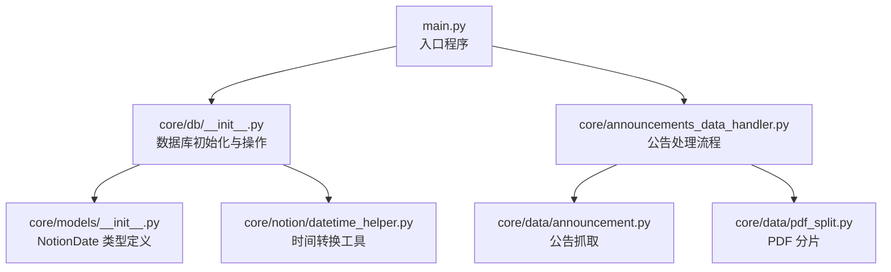
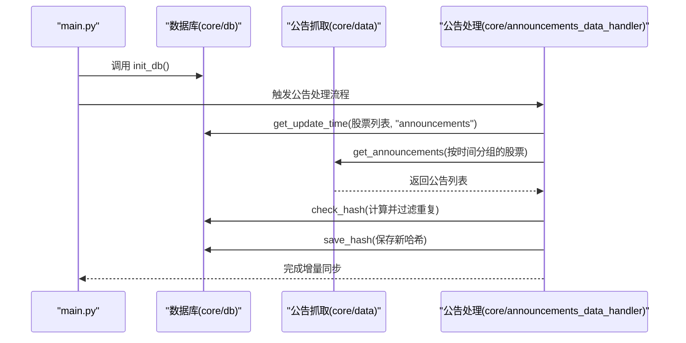
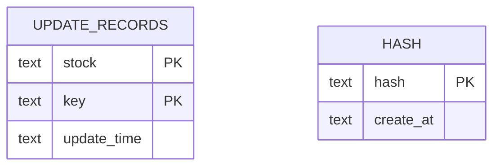
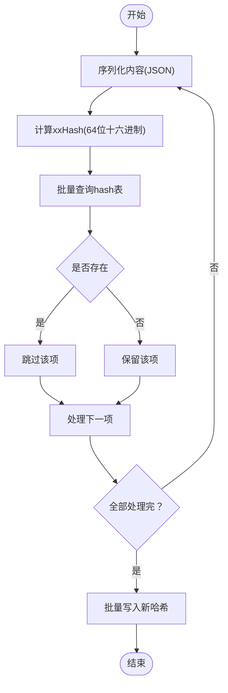
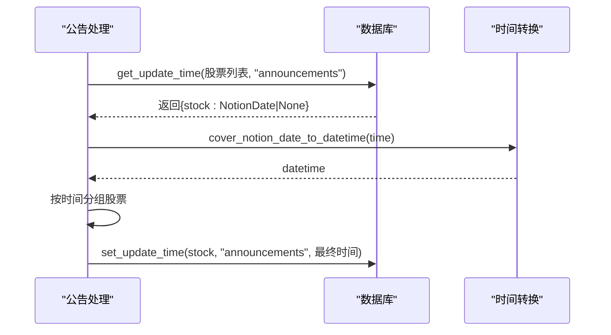
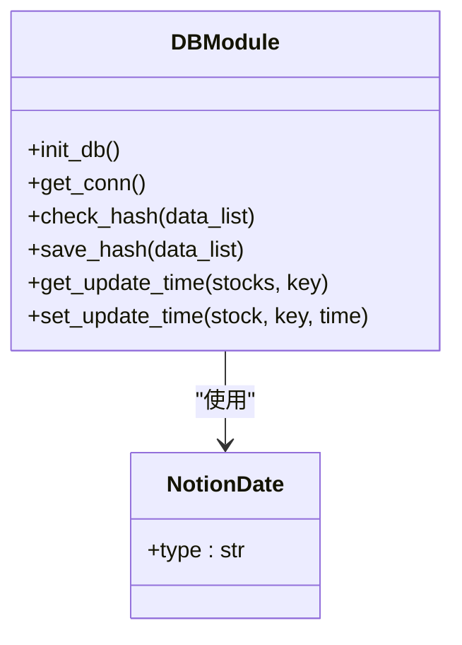
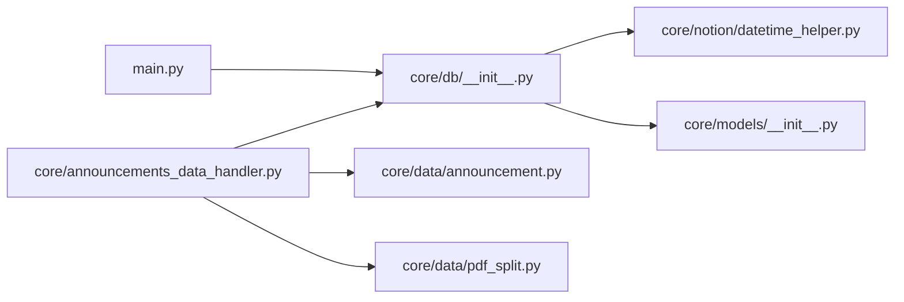

# 数据库架构

<cite>
**本文引用的文件**
- [core/db/__init__.py](file://core/db/__init__.py)
- [core/models/__init__.py](file://core/models/__init__.py)
- [core/notion/datetime_helper.py](file://core/notion/datetime_helper.py)
- [main.py](file://main.py)
- [core/announcements_data_handler.py](file://core/announcements_data_handler.py)
- [core/data/announcement.py](file://core/data/announcement.py)
- [core/data/pdf_split.py](file://core/data/pdf_split.py)
</cite>

## 目录
1. [简介](#简介)
2. [项目结构](#项目结构)
3. [核心组件](#核心组件)
4. [架构总览](#架构总览)
5. [详细组件分析](#详细组件分析)
6. [依赖关系分析](#依赖关系分析)
7. [性能考量](#性能考量)
8. [故障排查指南](#故障排查指南)
9. [结论](#结论)
10. [附录](#附录)

## 简介
本文件面向“股票公告自动化系统”的数据库架构，聚焦于基于 SQLite 的本地数据库设计与实现。文档覆盖以下主题：
- 数据库表结构与字段定义
- 实体关系图（ERD）
- 哈希去重机制与索引策略
- 更新时间管理与增量同步的数据模型
- 数据库初始化脚本与迁移策略
- 数据完整性约束与性能优化
- 数据库连接管理与事务处理机制

## 项目结构
数据库相关的核心实现集中在 core/db 模块，配合时间类型定义与时间转换工具，以及主流程入口对数据库初始化的调用。

图表来源
- [main.py](file://main.py#L20-L39)
- [core/db/__init__.py](file://core/db/__init__.py#L62-L94)
- [core/models/__init__.py](file://core/models/__init__.py#L1-L8)
- [core/notion/datetime_helper.py](file://core/notion/datetime_helper.py#L1-L39)
- [core/announcements_data_handler.py](file://core/announcements_data_handler.py#L1-L116)
- [core/data/announcement.py](file://core/data/announcement.py#L1-L141)
- [core/data/pdf_split.py](file://core/data/pdf_split.py#L1-L128)

章节来源
- [main.py](file://main.py#L20-L39)
- [core/db/__init__.py](file://core/db/__init__.py#L62-L94)

## 核心组件
- 数据库初始化与连接管理
  - 初始化函数负责创建两张核心表：update_records 与 hash。
  - 提供异步上下文管理器 get_conn，统一管理事务提交/回滚与连接关闭。
- 哈希去重模块
  - 通过 xxHash 计算内容哈希，结合数据库查询与批量写入实现高效去重。
- 更新时间管理模块
  - 以股票代码与键值为联合主键维护每类数据的最后更新时间，支撑增量同步。
- 时间类型与转换
  - NotionDate 作为字符串包装类型，统一存储格式；提供双向转换工具保证一致性。

章节来源
- [core/db/__init__.py](file://core/db/__init__.py#L28-L51)
- [core/db/__init__.py](file://core/db/__init__.py#L62-L94)
- [core/db/__init__.py](file://core/db/__init__.py#L97-L151)
- [core/db/__init__.py](file://core/db/__init__.py#L153-L215)
- [core/models/__init__.py](file://core/models/__init__.py#L1-L8)
- [core/notion/datetime_helper.py](file://core/notion/datetime_helper.py#L12-L38)

## 架构总览
系统采用“异步 SQLite + 哈希去重 + 增量时间戳”的轻量级数据架构。核心流程如下：
- 启动时初始化数据库表
- 抓取公告数据时，先计算内容哈希并查询去重
- 成功入库后保存哈希，避免重复
- 维护每支股票每类数据的最后更新时间，用于增量同步

图表来源
- [main.py](file://main.py#L20-L39)
- [core/db/__init__.py](file://core/db/__init__.py#L62-L94)
- [core/db/__init__.py](file://core/db/__init__.py#L97-L151)
- [core/db/__init__.py](file://core/db/__init__.py#L153-L215)
- [core/announcements_data_handler.py](file://core/announcements_data_handler.py#L21-L116)
- [core/data/announcement.py](file://core/data/announcement.py#L36-L112)

## 详细组件分析

### 数据库表结构与字段定义
- update_records 表
  - 字段
    - stock: 文本，非空，联合主键之一
    - key: 文本，非空，联合主键之二
    - update_time: 文本，存储为 NotionDate 字符串
  - 主键: (stock, key)
  - 用途: 记录每支股票每类数据的最后更新时间，支撑增量同步
- hash 表
  - 字段
    - hash: 文本，主键
    - create_at: 文本，非空，存储时间戳字符串
  - 用途: 存储已处理内容的哈希，实现去重

图表来源
- [core/db/__init__.py](file://core/db/__init__.py#L77-L93)

章节来源
- [core/db/__init__.py](file://core/db/__init__.py#L77-L93)

### 哈希去重机制与索引策略
- 去重流程
  - 输入: 列表项包含 data_type 与 content（可序列化字典）
  - 步骤
    1) 对每个项进行 JSON 序列化（排序键、禁 ASCII）
    2) 使用 xxHash 计算 64 位十六进制哈希
    3) 将哈希批量查询 hash 表，得到已存在集合
    4) 过滤出不存在的项作为去重结果
    5) 将新哈希与当前时间批量写入 hash 表
- 索引策略
  - hash 表的主键为 hash，具备唯一性与快速查找能力
  - 建议在高频查询场景下保持主键索引即可，无需额外索引
- 性能要点
  - 批量查询与批量写入减少往返次数
  - 哈希计算与 JSON 序列化在内存中完成，避免磁盘 IO

图表来源
- [core/db/__init__.py](file://core/db/__init__.py#L97-L151)

章节来源
- [core/db/__init__.py](file://core/db/__init__.py#L97-L151)

### 更新时间管理与增量同步
- 数据模型
  - 以 (stock, key) 为联合主键，update_time 存储为 NotionDate 字符串
  - 支持 key 取值为 "business" 或 "announcements"
- 增量策略
  - 首次: 对缺失记录插入 NULL 时间
  - 日后: 按最近一次更新时间作为起点，结束时间为当天+1天
  - 分组聚合: 将同一更新时间的股票合并为一次查询，降低接口调用次数
- 时间转换
  - NotionDate 为字符串包装类型，统一存储格式
  - 提供双向转换函数，确保入库与出库一致性

图表来源
- [core/db/__init__.py](file://core/db/__init__.py#L153-L215)
- [core/notion/datetime_helper.py](file://core/notion/datetime_helper.py#L28-L38)
- [core/announcements_data_handler.py](file://core/announcements_data_handler.py#L21-L116)

章节来源
- [core/db/__init__.py](file://core/db/__init__.py#L153-L215)
- [core/notion/datetime_helper.py](file://core/notion/datetime_helper.py#L12-L38)
- [core/announcements_data_handler.py](file://core/announcements_data_handler.py#L21-L116)

### 数据库初始化脚本与迁移策略
- 初始化脚本
  - 在首次运行时创建 update_records 与 hash 两张表
  - 使用异步连接执行建表语句并提交
- 迁移策略
  - 当前版本未实现显式迁移逻辑
  - 建议后续演进方向
    - 引入版本号字段与迁移函数
    - 通过比较目标版本与当前版本决定执行哪些迁移步骤
    - 保持向后兼容，避免破坏现有数据

章节来源
- [core/db/__init__.py](file://core/db/__init__.py#L62-L94)

### 数据完整性约束与性能优化
- 完整性约束
  - update_records: 联合主键 (stock, key)，保证每支股票每类数据唯一
  - hash: 主键 hash 唯一，防止重复记录
  - update_time 为文本，遵循 NotionDate 格式约定
- 性能优化
  - 批量操作: 查询与写入均采用批量执行，减少网络与磁盘往返
  - 哈希索引: 主键索引满足去重查询性能
  - 增量查询: 按时间分组合并请求，降低外部接口调用频率

章节来源
- [core/db/__init__.py](file://core/db/__init__.py#L77-L93)
- [core/db/__init__.py](file://core/db/__init__.py#L97-L151)
- [core/announcements_data_handler.py](file://core/announcements_data_handler.py#L40-L59)

### 数据库连接管理与事务处理机制
- 连接管理
  - 单例连接: 内部缓存 aiosqlite 连接实例，避免重复创建
  - 路径: 数据库存放在 core/db 目录下的 notion.db
- 事务处理
  - 异步上下文管理器 get_conn 自动提交或回滚
  - 发生异常时自动回滚，确保数据一致性
  - 使用完成后连接会被关闭

图表来源
- [core/db/__init__.py](file://core/db/__init__.py#L28-L51)
- [core/db/__init__.py](file://core/db/__init__.py#L62-L94)
- [core/db/__init__.py](file://core/db/__init__.py#L97-L215)
- [core/models/__init__.py](file://core/models/__init__.py#L1-L8)

章节来源
- [core/db/__init__.py](file://core/db/__init__.py#L12-L13)
- [core/db/__init__.py](file://core/db/__init__.py#L28-L51)
- [core/db/__init__.py](file://core/db/__init__.py#L54-L59)

## 依赖关系分析
- 模块耦合
  - main.py 仅负责初始化数据库与调度业务流程
  - 公告处理模块依赖数据库模块进行时间与去重控制
  - 时间转换模块为数据库层提供统一的时间格式
- 外部依赖
  - aiosqlite: 异步 SQLite 驱动
  - xxhash: 快速哈希算法
  - httpx/pymupdf: 用于公告抓取与 PDF 分片（与数据库层解耦）

图表来源
- [main.py](file://main.py#L20-L39)
- [core/db/__init__.py](file://core/db/__init__.py#L62-L94)
- [core/announcements_data_handler.py](file://core/announcements_data_handler.py#L1-L116)
- [core/data/announcement.py](file://core/data/announcement.py#L1-L141)
- [core/data/pdf_split.py](file://core/data/pdf_split.py#L1-L128)
- [core/notion/datetime_helper.py](file://core/notion/datetime_helper.py#L1-L39)
- [core/models/__init__.py](file://core/models/__init__.py#L1-L8)

章节来源
- [main.py](file://main.py#L20-L39)
- [core/announcements_data_handler.py](file://core/announcements_data_handler.py#L1-L116)

## 性能考量
- 哈希去重
  - 使用 xxHash 与批量 SQL 减少 IO 与网络开销
  - 建议在高并发场景下限制单批哈希数量，避免一次性构造过大占内存
- 增量同步
  - 按时间分组合并请求，显著降低外部接口调用次数
  - 对于空更新时间的股票，采用固定窗口（如一年）兜底，避免全量扫描
- 存储格式
  - 时间统一为 ISO 字符串，便于排序与比较
  - 建议未来可引入布尔字段标记“是否已处理”，辅助统计与审计

## 故障排查指南
- 初始化失败
  - 确认数据库路径存在且可写
  - 检查权限与磁盘空间
- 去重异常
  - 核对输入项的 data_type 与 content 是否可序列化
  - 检查 JSON 序列化参数（排序键、ASCII）是否一致
- 增量更新错误
  - set_update_time 在未找到记录时会抛出异常，需先 get_update_time 再更新
  - 检查 key 取值是否为 "business" 或 "announcements"
- 事务问题
  - get_conn 在异常时自动回滚，确认捕获并记录异常信息

章节来源
- [core/db/__init__.py](file://core/db/__init__.py#L62-L94)
- [core/db/__init__.py](file://core/db/__init__.py#L97-L151)
- [core/db/__init__.py](file://core/db/__init__.py#L153-L215)
- [core/db/__init__.py](file://core/db/__init__.py#L28-L51)

## 结论
本数据库架构以 SQLite 为核心，结合异步连接、哈希去重与增量时间戳，实现了轻量、可靠且易扩展的数据层。建议后续引入显式迁移机制与更细粒度的监控指标，进一步提升可维护性与可观测性。

## 附录
- 初始化入口
  - 在主程序启动时调用数据库初始化，确保表结构就绪
- 建议的后续改进
  - 引入版本号与迁移函数
  - 为高频查询字段建立索引（视实际查询模式而定）
  - 增加数据校验与审计字段（如状态、错误信息）

章节来源
- [main.py](file://main.py#L20-L39)
- [core/db/__init__.py](file://core/db/__init__.py#L62-L94)