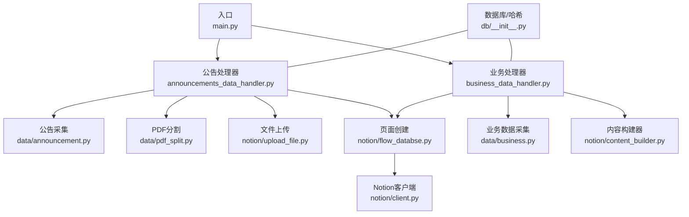
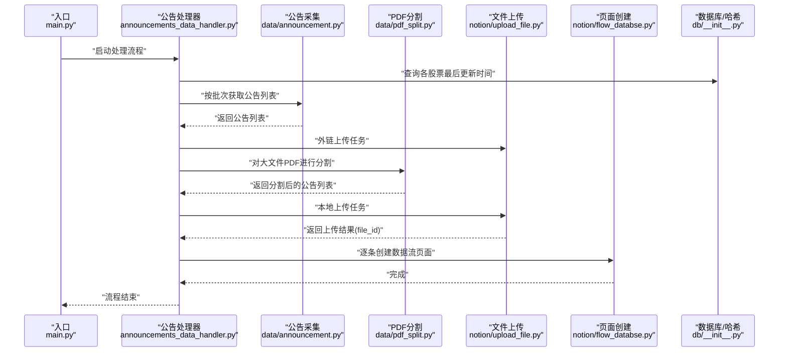
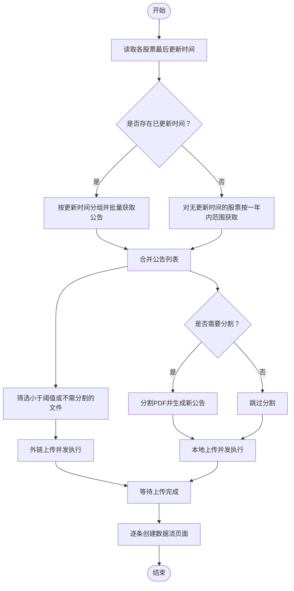
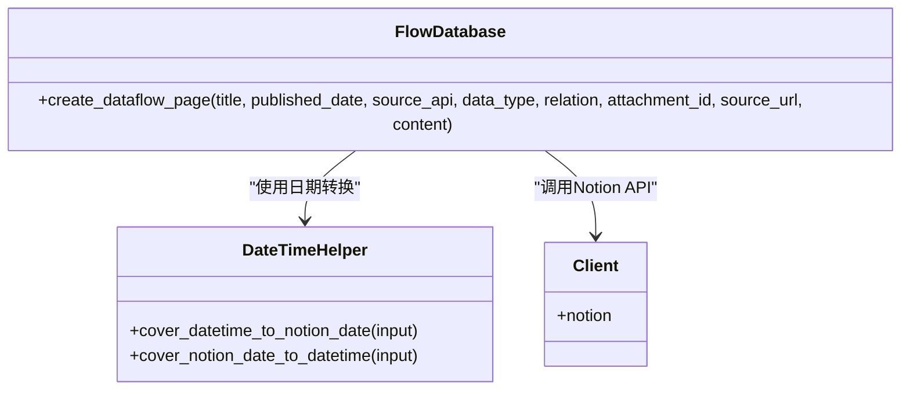
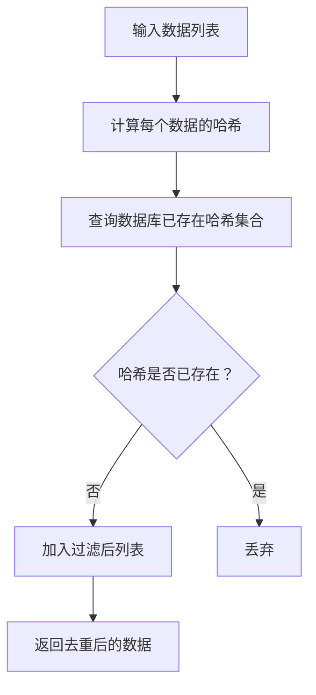
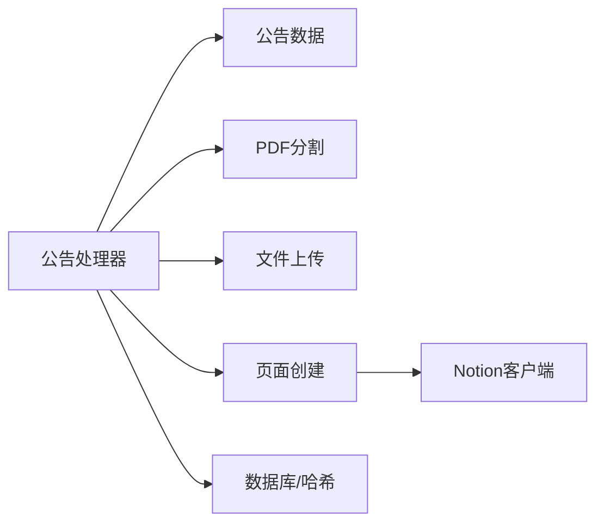

# 数据流架构

<cite>
**本文引用的文件**
- [main.py](file://main.py)
- [announcements_data_handler.py](file://core/announcements_data_handler.py)
- [announcement.py](file://core/data/announcement.py)
- [pdf_split.py](file://core/data/pdf_split.py)
- [upload_file.py](file://core/notion/upload_file.py)
- [flow_databse.py](file://core/notion/flow_databse.py)
- [client.py](file://core/notion/client.py)
- [datetime_helper.py](file://core/notion/datetime_helper.py)
- [__init__.py](file://core/db/__init__.py)
- [business_data_handler.py](file://core/business_data_handler.py)
- [business.py](file://core/data/business.py)
- [content_builder.py](file://core/notion/content_builder.py)
- [__init__.py](file://core/models/__init__.py)
</cite>

## 目录
1. [引言](#引言)
2. [项目结构](#项目结构)
3. [核心组件](#核心组件)
4. [架构总览](#架构总览)
5. [详细组件分析](#详细组件分析)
6. [依赖关系分析](#依赖关系分析)
7. [性能考量](#性能考量)
8. [故障排查指南](#故障排查指南)
9. [结论](#结论)
10. [附录](#附录)

## 引言
本文件面向“股票公告自动化系统”的数据流架构，聚焦从巨潮资讯网API抓取公告数据，经处理与转换，最终写入Notion数据库的完整流程。文档涵盖：
- 数据流向图与关键处理节点
- 异步数据处理机制与并发策略
- 数据去重、哈希校验与增量更新的实现方式
- 数据转换规则与验证机制
- 实际代码映射的可视化图示

## 项目结构
系统采用模块化分层设计：
- 入口与调度：main.py
- 数据采集与模型：core/data（公告、业务）
- Notion集成：core/notion（客户端、页面创建、文件上传、内容构建、日期工具）
- 数据库与哈希：core/db（SQLite异步、哈希去重、更新时间记录）
- 处理器：core/announcements_data_handler.py、core/business_data_handler.py

图表来源
- [main.py](file://main.py#L20-L39)
- [announcements_data_handler.py](file://core/announcements_data_handler.py#L21-L116)
- [business_data_handler.py](file://core/business_data_handler.py#L17-L68)
- [announcement.py](file://core/data/announcement.py#L36-L112)
- [pdf_split.py](file://core/data/pdf_split.py#L15-L73)
- [upload_file.py](file://core/notion/upload_file.py#L28-L61)
- [flow_databse.py](file://core/notion/flow_databse.py#L25-L67)
- [client.py](file://core/notion/client.py#L1-L6)
- [__init__.py](file://core/db/__init__.py#L62-L217)

章节来源
- [main.py](file://main.py#L1-L40)
- [announcements_data_handler.py](file://core/announcements_data_handler.py#L1-L116)
- [business_data_handler.py](file://core/business_data_handler.py#L1-L108)

## 核心组件
- 公告采集与模型
  - Announcement命名元组封装公告字段，get_announcements异步调用巨潮资讯网接口，支持分页拉取与标题过滤。
- PDF分割
  - split_pdf基于页数阈值对大文件进行切分，保留原URL与发布时间，仅调整标题与估算大小。
- 文件上传
  - upload_files_with_url：外链直传，upload_files_with_local：下载后上传；均支持并发与轮询状态。
- 页面创建
  - create_dataflow_page：根据类型映射、关联关系、附件与原文链接创建Notion页面。
- 数据库与哈希
  - init_db：初始化update_records与hash表；check_hash与save_hash实现去重；get_update_time/set_update_time实现增量更新。
- 内容构建
  - NotionContentBuilder：将DataFrame转为Notion表格块，支持标题、分隔线、Callout等。

章节来源
- [announcement.py](file://core/data/announcement.py#L12-L112)
- [pdf_split.py](file://core/data/pdf_split.py#L15-L128)
- [upload_file.py](file://core/notion/upload_file.py#L28-L180)
- [flow_databse.py](file://core/notion/flow_databse.py#L25-L67)
- [__init__.py](file://core/db/__init__.py#L62-L217)
- [content_builder.py](file://core/notion/content_builder.py#L1-L103)

## 架构总览
系统数据流自上而下分为四层：入口调度、采集与预处理、上传与转换、写入目标数据库（Notion）。异步并发贯穿采集、上传与页面创建阶段，提升吞吐量与稳定性。

图表来源
- [main.py](file://main.py#L20-L39)
- [announcements_data_handler.py](file://core/announcements_data_handler.py#L21-L116)
- [announcement.py](file://core/data/announcement.py#L36-L112)
- [pdf_split.py](file://core/data/pdf_split.py#L15-L73)
- [upload_file.py](file://core/notion/upload_file.py#L28-L61)
- [flow_databse.py](file://core/notion/flow_databse.py#L25-L67)
- [__init__.py](file://core/db/__init__.py#L153-L217)

## 详细组件分析

### 组件A：公告数据处理与异步并发
- 并发策略
  - 按最后更新时间分组，相同更新时间的股票合并为一批请求，减少接口调用次数。
  - 使用asyncio.gather并发执行多个get_announcements任务，随后统一展开为一维列表。
  - 文件上传阶段分别创建外链与本地上传任务，使用asyncio.gather并行等待完成。
  - 页面创建阶段逐条创建，但可扩展为批量创建以进一步提升吞吐。
- 增量更新
  - 通过get_update_time获取各股票上次更新时间，若为空则默认从一年前开始；对已有更新时间的股票按日期分组，实现“按天”增量拉取。
- PDF处理
  - 对超过阈值且标题命中关键词的PDF进行分割，生成带页码范围的新标题，保持原URL与发布时间不变。
- 去重与哈希
  - 当前公告流程未直接使用哈希去重；如需启用，可在create_dataflow_page前增加check_hash/save_hash调用。

图表来源
- [announcements_data_handler.py](file://core/announcements_data_handler.py#L21-L116)
- [announcement.py](file://core/data/announcement.py#L36-L112)
- [pdf_split.py](file://core/data/pdf_split.py#L15-L73)
- [upload_file.py](file://core/notion/upload_file.py#L28-L61)
- [flow_databse.py](file://core/notion/flow_databse.py#L25-L67)

章节来源
- [announcements_data_handler.py](file://core/announcements_data_handler.py#L21-L116)

### 组件B：Notion页面创建与数据类型映射
- 属性映射
  - 标题、发布时间、来源接口、数据类型、关联股票、原文链接、附件等属性通过create_dataflow_page统一创建。
- 数据类型映射
  - TYPE_MAPPING将字符串类型映射为Notion select id，保证类型一致性。
- 日期转换
  - cover_datetime_to_notion_date与cover_notion_date_to_datetime确保日期与时区一致，避免跨时区误差。

图表来源
- [flow_databse.py](file://core/notion/flow_databse.py#L25-L67)
- [datetime_helper.py](file://core/notion/datetime_helper.py#L12-L38)
- [client.py](file://core/notion/client.py#L1-L6)

章节来源
- [flow_databse.py](file://core/notion/flow_databse.py#L1-L67)
- [datetime_helper.py](file://core/notion/datetime_helper.py#L1-L39)
- [client.py](file://core/notion/client.py#L1-L6)

### 组件C：数据库与哈希去重
- 表结构
  - update_records：记录股票与键（如“announcements”、“business”）的最后更新时间。
  - hash：记录内容哈希与创建时间，用于去重。
- 哈希算法
  - 使用xxhash.xxh3_64_hexdigest计算内容哈希，序列化时固定排序键与编码。
- 去重流程
  - check_hash：计算待入库数据的哈希，查询数据库已存在集合，返回未存在的数据。
  - save_hash：批量写入新哈希，带时间戳。

图表来源
- [__init__.py](file://core/db/__init__.py#L97-L151)

章节来源
- [__init__.py](file://core/db/__init__.py#L1-L218)

### 组件D：业务数据处理（对比参考）
- 业务数据按半年维度判断是否需要更新，使用get_business获取最新报表日期，构造三类表格（行业、产品、地区），并通过NotionContentBuilder构建页面内容。
- 该流程展示了与公告流程类似的异步模式与增量更新策略，便于横向对比与扩展。

章节来源
- [business_data_handler.py](file://core/business_data_handler.py#L17-L108)
- [business.py](file://core/data/business.py#L33-L96)
- [content_builder.py](file://core/notion/content_builder.py#L1-L103)

## 依赖关系分析
- 组件耦合
  - 公告处理器依赖数据采集、PDF分割、文件上传与页面创建模块；数据库模块为增量与去重提供支撑。
- 外部依赖
  - 巨潮资讯网API（公告）、Notion Async Client（页面与文件上传）、AkShare（业务数据）、PyMuPDF（PDF处理）。
- 并发与错误处理
  - asyncio.gather用于并发等待；上传轮询采用指数退避策略；异常统一记录日志，便于追踪。

图表来源
- [announcements_data_handler.py](file://core/announcements_data_handler.py#L1-L116)
- [announcement.py](file://core/data/announcement.py#L1-L141)
- [pdf_split.py](file://core/data/pdf_split.py#L1-L128)
- [upload_file.py](file://core/notion/upload_file.py#L1-L180)
- [flow_databse.py](file://core/notion/flow_databse.py#L1-L67)
- [client.py](file://core/notion/client.py#L1-L6)
- [__init__.py](file://core/db/__init__.py#L1-L218)

## 性能考量
- 并发优化
  - 批量请求：按最后更新时间聚合股票，减少接口调用次数。
  - 并行上传：外链与本地上传分别并发，提高I/O吞吐。
  - 页面创建：当前逐条创建，可评估改为批量创建以降低API调用开销。
- I/O与网络
  - PDF下载与分割在本地进行，建议限制并发数量避免内存峰值过高。
  - Notion文件上传轮询采用指数退避，避免频繁请求。
- 存储与去重
  - 哈希去重可显著降低重复数据写入成本，建议在页面创建前启用。

## 故障排查指南
- 公告采集失败
  - 检查巨潮资讯网接口可用性与参数拼装（股票代码、日期范围）。
  - 日志中关注get_announcements的分页拉取与标题过滤逻辑。
- PDF分割异常
  - 检查PDF页数与分割阈值配置，确认pymupdf版本兼容性。
- 文件上传失败
  - 查看_notion.file_uploads.create与轮询状态，关注错误码与超时重试。
- 页面创建失败
  - 核对数据类型映射、关联关系与附件ID；检查Notion数据库权限与环境变量。
- 增量更新异常
  - 确认get_update_time/set_update_time的调用顺序与数据一致性。

章节来源
- [announcement.py](file://core/data/announcement.py#L36-L112)
- [pdf_split.py](file://core/data/pdf_split.py#L15-L128)
- [upload_file.py](file://core/notion/upload_file.py#L153-L177)
- [flow_databse.py](file://core/notion/flow_databse.py#L59-L67)
- [__init__.py](file://core/db/__init__.py#L153-L217)

## 结论
本系统通过异步并发与模块化设计，实现了从巨潮资讯网到Notion的高效数据流。公告流程具备明确的增量更新与并发上传能力，建议在页面创建前引入哈希去重以进一步提升稳定性与性能。业务数据流程提供了可复用的异步与增量模式，便于扩展到更多数据源。

## 附录
- 环境变量
  - NOTION_TOKEN：Notion集成密钥
  - FLOW_DATABASE：数据流数据库ID
- 数据类型映射
  - “公告披露”、“主营构成”等类型映射至Notion select id，确保页面属性一致性。