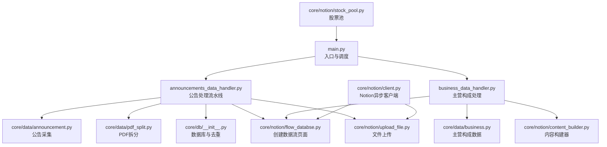
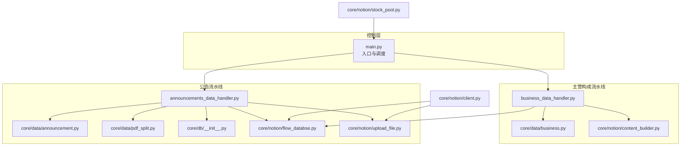
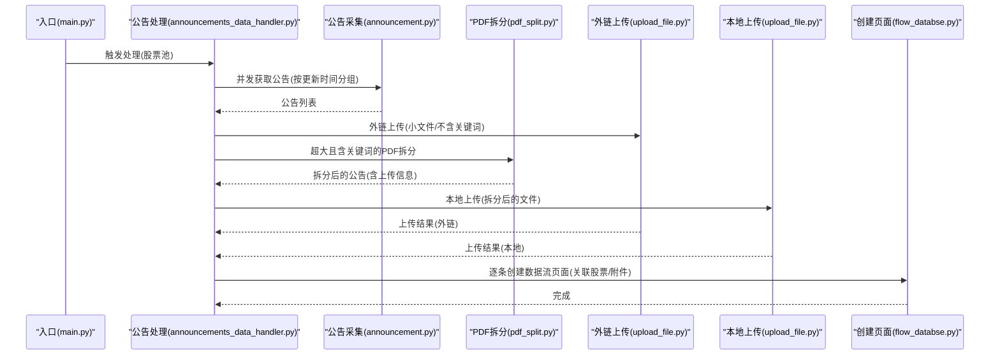
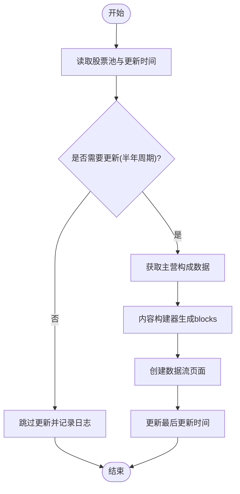
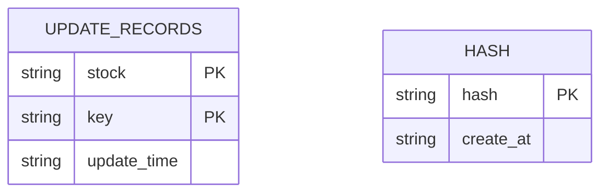
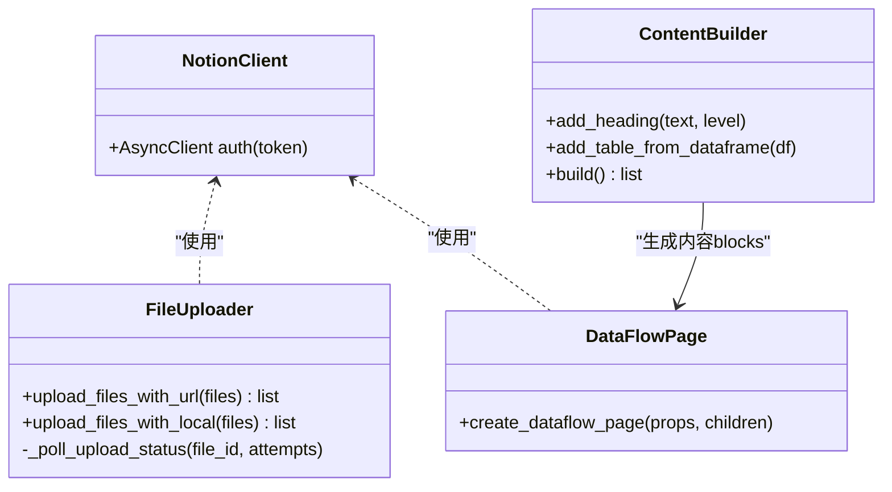
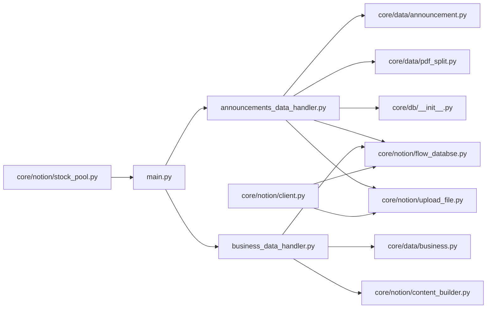

# 架构设计

<cite>
**本文引用的文件**
- [main.py](file://main.py)
- [announcements_data_handler.py](file://core/announcements_data_handler.py)
- [business_data_handler.py](file://core/business_data_handler.py)
- [announcement.py](file://core/data/announcement.py)
- [business.py](file://core/data/business.py)
- [pdf_split.py](file://core/data/pdf_split.py)
- [__init__.py（数据库）](file://core/db/__init__.py)
- [client.py（Notion客户端）](file://core/notion/client.py)
- [flow_databse.py（数据流页面）](file://core/notion/flow_databse.py)
- [upload_file.py（文件上传）](file://core/notion/upload_file.py)
- [stock_pool.py（股票池）](file://core/notion/stock_pool.py)
- [content_builder.py（内容构建器）](file://core/notion/content_builder.py)
- [__init__.py（模型）](file://core/models/__init__.py)
- [pyproject.toml](file://pyproject.toml)
- [test_announcements_data_handler.py](file://tests/test_announcements_data_handler.py)
- [test_business_data_handler.py](file://tests/test_business_data_handler.py)
- [run_tests.py](file://run_tests.py)
</cite>

## 目录
1. [引言](#引言)
2. [项目结构](#项目结构)
3. [核心组件](#核心组件)
4. [架构总览](#架构总览)
5. [详细组件分析](#详细组件分析)
6. [依赖关系分析](#依赖关系分析)
7. [性能考量](#性能考量)
8. [故障排查指南](#故障排查指南)
9. [结论](#结论)
10. [附录](#附录)

## 引言
本系统围绕“股票公告自动化”目标，将公开渠道的公告数据采集、PDF拆分与上传、内容构建与页面创建、以及更新时间与去重机制整合为统一的异步流水线。系统采用模块化设计，通过异步并发与缓存策略提升吞吐与稳定性；通过Notion API实现数据与知识页面的自动化落地。

## 项目结构
系统采用按功能域划分的模块化组织方式：
- 核心入口与调度：main.py
- 数据采集与处理：core/data（公告、主营构成、PDF拆分）
- 数据持久化：core/db（SQLite异步封装、哈希去重、更新时间）
- Notion集成：core/notion（客户端、股票池、内容构建器、数据流页面、文件上传）
- 业务编排：core/announcements_data_handler.py、core/business_data_handler.py
- 模型与类型：core/models/__init__.py
- 测试与配置：tests/*、pyproject.toml、run_tests.py

图表来源
- [main.py](file://main.py#L20-L39)
- [announcements_data_handler.py](file://core/announcements_data_handler.py#L21-L116)
- [business_data_handler.py](file://core/business_data_handler.py#L17-L68)
- [announcement.py](file://core/data/announcement.py#L36-L112)
- [pdf_split.py](file://core/data/pdf_split.py#L15-L73)
- [__init__.py（数据库）](file://core/db/__init__.py#L62-L217)
- [flow_databse.py（数据流页面）](file://core/notion/flow_databse.py#L25-L67)
- [upload_file.py（文件上传）](file://core/notion/upload_file.py#L28-L180)
- [stock_pool.py（股票池）](file://core/notion/stock_pool.py#L23-L52)
- [client.py（Notion客户端）](file://core/notion/client.py#L3-L5)
- [content_builder.py（内容构建器）](file://core/notion/content_builder.py#L1-L103)

章节来源
- [main.py](file://main.py#L1-L40)
- [pyproject.toml](file://pyproject.toml#L1-L21)

## 核心组件
- 异步入口与调度：加载环境变量、初始化数据库、拉取股票池、触发公告与主营构成处理。
- 公告处理流水线：按股票与更新时间分组并发抓取、按大小与关键词策略分流上传、拆分超大PDF、创建数据流页面。
- 主营构成处理：按半年周期判断更新、构建多维表格内容、创建数据流页面并更新时间。
- 数据采集层：公告接口聚合、PDF下载与拆分、AkShare主营构成数据。
- 数据持久化：异步SQLite连接、哈希去重、更新时间记录。
- Notion集成：异步客户端、股票池查询、内容构建器、文件上传（外链/本地）、数据流页面创建。
- 模型与类型：Notion日期类型别名。

章节来源
- [main.py](file://main.py#L20-L39)
- [announcements_data_handler.py](file://core/announcements_data_handler.py#L21-L116)
- [business_data_handler.py](file://core/business_data_handler.py#L17-L68)
- [announcement.py](file://core/data/announcement.py#L36-L112)
- [business.py](file://core/data/business.py#L33-L96)
- [pdf_split.py](file://core/data/pdf_split.py#L15-L73)
- [__init__.py（数据库）](file://core/db/__init__.py#L62-L217)
- [flow_databse.py（数据流页面）](file://core/notion/flow_databse.py#L25-L67)
- [upload_file.py（文件上传）](file://core/notion/upload_file.py#L28-L180)
- [stock_pool.py（股票池）](file://core/notion/stock_pool.py#L23-L52)
- [content_builder.py（内容构建器）](file://core/notion/content_builder.py#L1-L103)
- [__init__.py（模型）](file://core/models/__init__.py#L1-L8)

## 架构总览
系统采用“异步并发 + 模块解耦”的架构模式：
- 控制流：入口函数负责初始化与编排，分别触发公告与主营构成两条流水线。
- 数据流：采集层异步I/O，处理层并发任务，持久化层轻量事务管理，集成层通过Notion API完成页面落地。
- 缓存与去重：公告采集接口带缓存装饰器，数据库层提供哈希去重能力。
- 错误与可观测：各环节均包含日志记录与异常捕获，上传环节具备轮询与指数退避重试。

图表来源
- [main.py](file://main.py#L20-L39)
- [announcements_data_handler.py](file://core/announcements_data_handler.py#L21-L116)
- [business_data_handler.py](file://core/business_data_handler.py#L17-L68)
- [announcement.py](file://core/data/announcement.py#L36-L112)
- [pdf_split.py](file://core/data/pdf_split.py#L15-L73)
- [__init__.py（数据库）](file://core/db/__init__.py#L62-L217)
- [flow_databse.py（数据流页面）](file://core/notion/flow_databse.py#L25-L67)
- [upload_file.py（文件上传）](file://core/notion/upload_file.py#L28-L180)
- [stock_pool.py（股票池）](file://core/notion/stock_pool.py#L23-L52)
- [client.py（Notion客户端）](file://core/notion/client.py#L3-L5)
- [content_builder.py（内容构建器）](file://core/notion/content_builder.py#L1-L103)

## 详细组件分析

### 组件A：公告处理流水线（异步并发）
职责与流程：
- 按股票与最后更新时间分组，构造并发任务，减少接口调用次数。
- 对小于阈值或不含拆分关键词的公告走外链直传；对超大且含关键词的公告先拆分再本地上传。
- 并发等待两类上传任务完成，汇总上传结果，逐条创建数据流页面。

图表来源
- [announcements_data_handler.py](file://core/announcements_data_handler.py#L21-L116)
- [announcement.py](file://core/data/announcement.py#L36-L112)
- [pdf_split.py](file://core/data/pdf_split.py#L15-L73)
- [upload_file.py（文件上传）](file://core/notion/upload_file.py#L28-L180)
- [flow_databse.py（数据流页面）](file://core/notion/flow_databse.py#L25-L67)

章节来源
- [announcements_data_handler.py](file://core/announcements_data_handler.py#L21-L116)
- [test_announcements_data_handler.py](file://tests/test_announcements_data_handler.py#L14-L367)

### 组件B：主营构成处理（半载更新策略）
职责与流程：
- 查询每只股票的上次更新时间，按半年周期判断是否需要更新。
- 若需要更新，调用数据接口获取主营构成三张表，使用内容构建器生成页面blocks，创建数据流页面并更新时间。

图表来源
- [business_data_handler.py](file://core/business_data_handler.py#L17-L68)
- [business.py](file://core/data/business.py#L33-L96)
- [content_builder.py（内容构建器）](file://core/notion/content_builder.py#L1-L103)
- [flow_databse.py（数据流页面）](file://core/notion/flow_databse.py#L25-L67)
- [__init__.py（数据库）](file://core/db/__init__.py#L153-L217)

章节来源
- [business_data_handler.py](file://core/business_data_handler.py#L17-L68)
- [test_business_data_handler.py](file://tests/test_business_data_handler.py#L103-L324)

### 组件C：数据库与去重（异步SQLite）
职责与流程：
- 初始化两张表：update_records（记录各股票的更新时间）、hash（去重用哈希索引）。
- 提供获取/设置更新时间、批量哈希校验与保存等方法，配合业务层实现幂等与增量更新。

图表来源
- [__init__.py（数据库）](file://core/db/__init__.py#L62-L217)

章节来源
- [__init__.py（数据库）](file://core/db/__init__.py#L62-L217)

### 组件D：Notion集成（客户端、上传、页面创建）
职责与流程：
- 异步客户端封装：基于Notion SDK创建异步客户端实例。
- 文件上传：支持外链直传与本地上传，内置轮询与指数退避重试。
- 页面创建：根据数据类型映射选择列值，支持附件与正文blocks。

图表来源
- [client.py（Notion客户端）](file://core/notion/client.py#L3-L5)
- [upload_file.py（文件上传）](file://core/notion/upload_file.py#L28-L180)
- [content_builder.py（内容构建器）](file://core/notion/content_builder.py#L1-L103)
- [flow_databse.py（数据流页面）](file://core/notion/flow_databse.py#L25-L67)

章节来源
- [client.py（Notion客户端）](file://core/notion/client.py#L3-L5)
- [upload_file.py（文件上传）](file://core/notion/upload_file.py#L28-L180)
- [content_builder.py（内容构建器）](file://core/notion/content_builder.py#L1-L103)
- [flow_databse.py（数据流页面）](file://core/notion/flow_databse.py#L25-L67)

## 依赖关系分析
- 模块内聚与解耦：
  - 数据采集与处理分离：announcement.py、business.py独立于编排层，便于替换与测试。
  - Notion集成抽象：client.py、upload_file.py、flow_databse.py形成稳定的外部集成面。
  - 数据持久化：db层提供统一的异步连接与事务管理，避免上层关心细节。
- 外部依赖：
  - HTTP客户端：httpx（异步）用于公告与PDF下载。
  - 文档处理：pymupdf用于PDF拆分。
  - 数据库：aiosqlite（异步）+ xxhash（哈希）。
  - 第三方数据源：AkShare（主营构成）。
- 并发与缓存：
  - asyncio.gather并发执行任务。
  - @alru_cache缓存公告接口的静态映射。

图表来源
- [main.py](file://main.py#L20-L39)
- [announcements_data_handler.py](file://core/announcements_data_handler.py#L21-L116)
- [business_data_handler.py](file://core/business_data_handler.py#L17-L68)
- [announcement.py](file://core/data/announcement.py#L36-L112)
- [pdf_split.py](file://core/data/pdf_split.py#L15-L73)
- [__init__.py（数据库）](file://core/db/__init__.py#L62-L217)
- [flow_databse.py（数据流页面）](file://core/notion/flow_databse.py#L25-L67)
- [upload_file.py（文件上传）](file://core/notion/upload_file.py#L28-L180)
- [stock_pool.py（股票池）](file://core/notion/stock_pool.py#L23-L52)
- [client.py（Notion客户端）](file://core/notion/client.py#L3-L5)
- [content_builder.py（内容构建器）](file://core/notion/content_builder.py#L1-L103)

## 性能考量
- 并发策略
  - 公告抓取按更新时间分组，合并多股票查询，降低接口调用频次。
  - 并发上传两类文件，充分利用I/O带宽。
- 缓存与去重
  - 接口缓存减少重复请求；数据库哈希去重避免重复入库。
- I/O优化
  - PDF拆分采用内存缓冲，避免磁盘IO；上传轮询采用指数退避，平衡成功率与延迟。
- 可扩展性
  - 模块化设计便于横向扩展更多数据源与处理规则。
  - 异步与并发使系统在高负载下仍具弹性。

## 故障排查指南
- 常见问题与定位
  - Notion API错误：检查环境变量TOKEN与数据源ID，查看页面创建日志。
  - 文件上传失败：查看轮询状态与错误信息，确认URL可达与大小限制。
  - 公告抓取异常：检查接口参数与分页逻辑，确认时间范围与股票映射。
  - 主营构成数据异常：确认AkShare接口可用与数据清洗逻辑。
- 日志与监控
  - 各模块均包含日志记录，建议结合日志级别与测试用例定位问题。
  - 测试脚本提供覆盖率与标记筛选，便于快速回归验证。

章节来源
- [flow_databse.py（数据流页面）](file://core/notion/flow_databse.py#L59-L67)
- [upload_file.py（文件上传）](file://core/notion/upload_file.py#L153-L177)
- [test_announcements_data_handler.py](file://tests/test_announcements_data_handler.py#L347-L367)
- [test_business_data_handler.py](file://tests/test_business_data_handler.py#L310-L324)
- [run_tests.py](file://run_tests.py#L8-L106)

## 结论
本系统通过清晰的模块划分与异步并发设计，实现了从公告与主营构成数据采集到Notion页面自动化的完整闭环。数据库层提供去重与更新时间管理，集成层保证与外部系统的稳定对接。整体架构具备良好的可维护性、可扩展性与可观测性，适合在持续演进中引入更多数据源与处理规则。

## 附录
- 环境变量与配置
  - TOKEN：Notion集成密钥
  - FLOW_DATABASE：数据流数据库ID
  - STOCK_POOL：股票池数据源ID
- 测试与开发
  - 测试标记：unit、integration、asyncio
  - 覆盖率：pytest --cov=core
  - 运行脚本：run_tests.py

章节来源
- [flow_databse.py（数据流页面）](file://core/notion/flow_databse.py#L22-L22)
- [stock_pool.py（股票池）](file://core/notion/stock_pool.py#L33-L33)
- [pyproject.toml](file://pyproject.toml#L10-L16)
- [run_tests.py](file://run_tests.py#L46-L106)