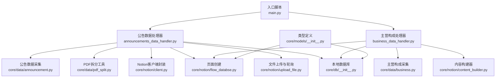
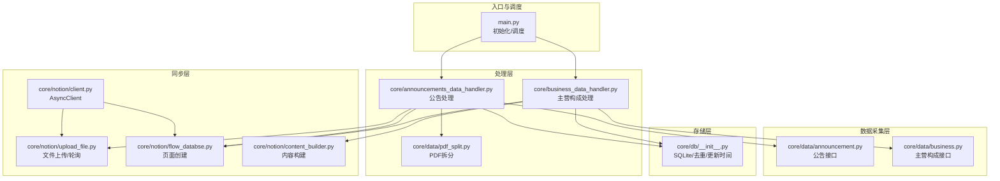
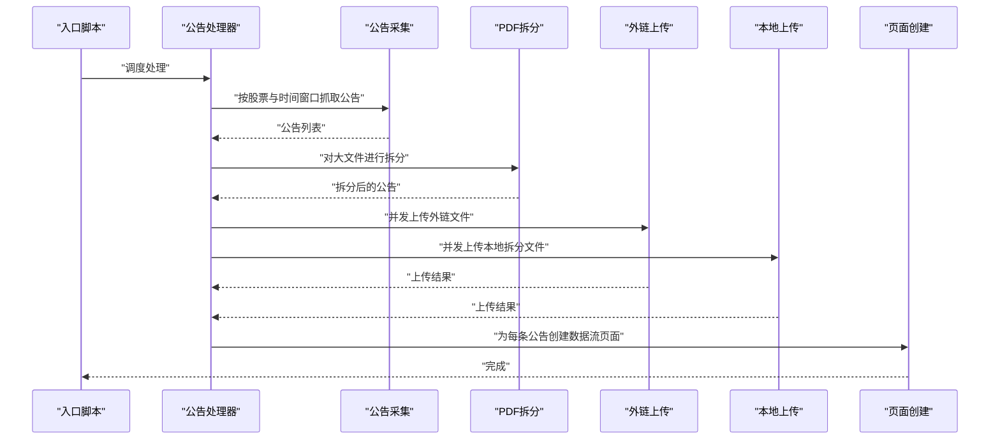
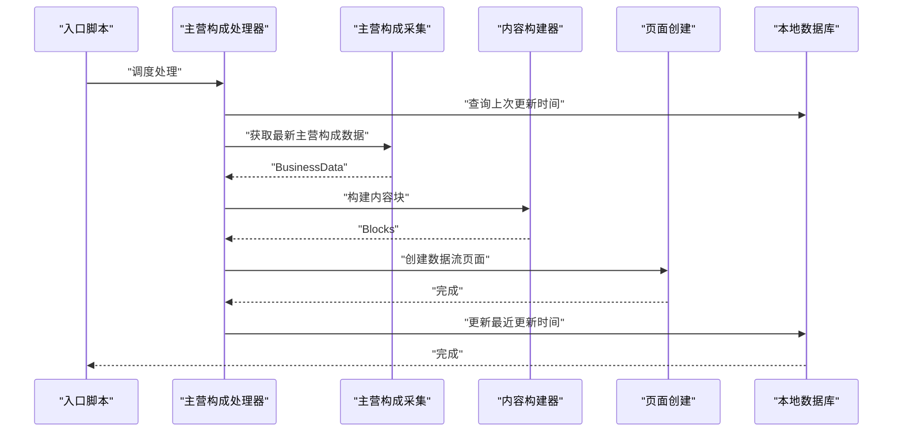
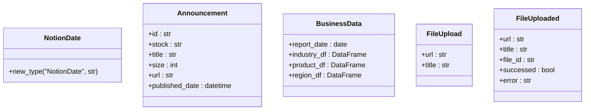
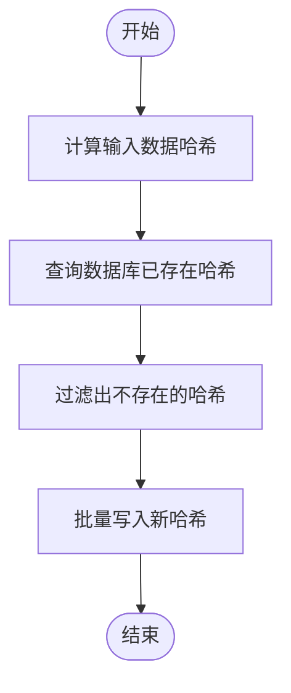
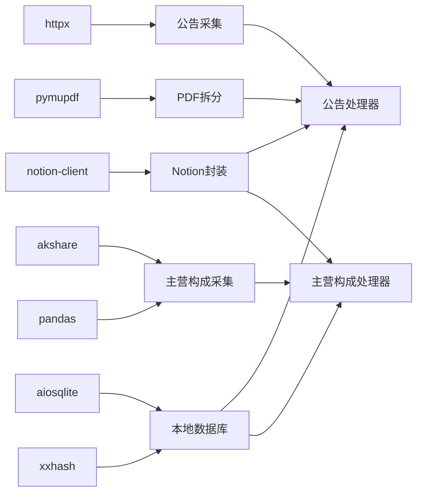

# 系统概览

<cite>
**本文引用的文件**
- [main.py](file://main.py)
- [announcements_data_handler.py](file://core/announcements_data_handler.py)
- [business_data_handler.py](file://core/business_data_handler.py)
- [announcement.py](file://core/data/announcement.py)
- [business.py](file://core/data/business.py)
- [pdf_split.py](file://core/data/pdf_split.py)
- [client.py](file://core/notion/client.py)
- [flow_databse.py](file://core/notion/flow_databse.py)
- [upload_file.py](file://core/notion/upload_file.py)
- [content_builder.py](file://core/notion/content_builder.py)
- [__init__.py](file://core/db/__init__.py)
- [__init__.py](file://core/models/__init__.py)
</cite>

## 目录
1. [简介](#简介)
2. [项目结构](#项目结构)
3. [核心组件](#核心组件)
4. [架构总览](#架构总览)
5. [详细组件分析](#详细组件分析)
6. [依赖关系分析](#依赖关系分析)
7. [性能考量](#性能考量)
8. [故障排除指南](#故障排除指南)
9. [结论](#结论)
10. [附录](#附录)

## 简介
本系统旨在自动化采集上市公司公告数据，并将公告内容与元数据同步至 Notion 数据流数据库。系统通过异步并发策略提升数据抓取与上传效率，支持对大体积 PDF 的智能拆分与分批上传，确保在 Notion 中以结构化页面形式呈现，便于后续检索与分析。

系统的主要业务价值包括：
- 自动化数据采集与入库，减少人工维护成本
- 统一的数据结构与标签体系，提升信息检索效率
- 支持历史增量更新与去重，保障数据一致性
- 提供可扩展的数据处理管线，便于接入更多数据源

## 项目结构
系统采用模块化分层组织，围绕“数据采集 → 数据处理 → Notion 同步”主线展开：
- core/data：数据采集与预处理（公告、主营构成、PDF 拆分）
- core/db：本地 SQLite 存储与去重校验
- core/models：类型定义（如 NotionDate）
- core/notion：Notion 客户端封装、页面创建、文件上传与轮询
- core/announcements_data_handler.py 与 core/business_data_handler.py：异步数据处理主流程
- tests：单元测试与集成测试

图表来源
- [main.py](file://main.py#L20-L39)
- [announcements_data_handler.py](file://core/announcements_data_handler.py#L21-L116)
- [business_data_handler.py](file://core/business_data_handler.py#L17-L68)
- [announcement.py](file://core/data/announcement.py#L36-L112)
- [business.py](file://core/data/business.py#L33-L95)
- [pdf_split.py](file://core/data/pdf_split.py#L15-L73)
- [client.py](file://core/notion/client.py#L1-L6)
- [flow_databse.py](file://core/notion/flow_databse.py#L25-L67)
- [upload_file.py](file://core/notion/upload_file.py#L28-L61)
- [content_builder.py](file://core/notion/content_builder.py#L1-L103)
- [__init__.py](file://core/db/__init__.py#L62-L94)
- [__init__.py](file://core/models/__init__.py#L1-L8)

章节来源
- [main.py](file://main.py#L1-L40)
- [__init__.py](file://core/db/__init__.py#L1-L218)
- [__init__.py](file://core/models/__init__.py#L1-L8)

## 核心组件
- 公告数据处理器：负责按股票池分组、计算更新窗口、并发抓取公告、拆分大文件并上传、最终创建 Notion 页面。
- 主营构成处理器：按半年周期判断是否需要更新，抓取主营构成数据，构建 Notion 内容块并创建页面。
- 数据采集模块：封装巨潮资讯网公告接口与 AkShare 主营构成接口。
- PDF 拆分模块：基于页数阈值进行拆分，避免单文件过大导致上传失败。
- Notion 客户端与页面创建：封装 Notion AsyncClient、文件上传与轮询、数据流页面属性映射。
- 本地数据库：维护各股票的更新时间与去重哈希，支持并发安全的事务管理。

章节来源
- [announcements_data_handler.py](file://core/announcements_data_handler.py#L21-L116)
- [business_data_handler.py](file://core/business_data_handler.py#L17-L68)
- [announcement.py](file://core/data/announcement.py#L36-L112)
- [business.py](file://core/data/business.py#L33-L95)
- [pdf_split.py](file://core/data/pdf_split.py#L15-L73)
- [client.py](file://core/notion/client.py#L1-L6)
- [flow_databse.py](file://core/notion/flow_databse.py#L25-L67)
- [upload_file.py](file://core/notion/upload_file.py#L28-L61)
- [__init__.py](file://core/db/__init__.py#L62-L94)

## 架构总览
系统采用“异步并发 + 分层职责”的架构设计：
- 入口脚本初始化数据库与股票池，调度两类数据处理流程
- 数据采集层通过异步 HTTP 客户端调用第三方 API
- 处理层进行数据清洗、拆分与内容构建
- 存储层使用 SQLite 记录更新时间与去重哈希
- 同步层通过 Notion AsyncClient 创建页面与上传附件

图表来源
- [main.py](file://main.py#L20-L39)
- [announcements_data_handler.py](file://core/announcements_data_handler.py#L21-L116)
- [business_data_handler.py](file://core/business_data_handler.py#L17-L68)
- [announcement.py](file://core/data/announcement.py#L36-L112)
- [business.py](file://core/data/business.py#L33-L95)
- [pdf_split.py](file://core/data/pdf_split.py#L15-L73)
- [client.py](file://core/notion/client.py#L1-L6)
- [upload_file.py](file://core/notion/upload_file.py#L28-L61)
- [flow_databse.py](file://core/notion/flow_databse.py#L25-L67)
- [content_builder.py](file://core/notion/content_builder.py#L1-L103)
- [__init__.py](file://core/db/__init__.py#L62-L94)

## 详细组件分析

### 公告数据处理流程
该流程负责从巨潮资讯网抓取公告、根据大小与关键词决定直链上传或本地下载后上传，并对大文件进行拆分，最后创建数据流页面。

图表来源
- [announcements_data_handler.py](file://core/announcements_data_handler.py#L21-L116)
- [announcement.py](file://core/data/announcement.py#L36-L112)
- [pdf_split.py](file://core/data/pdf_split.py#L15-L73)
- [upload_file.py](file://core/notion/upload_file.py#L28-L61)
- [flow_databse.py](file://core/notion/flow_databse.py#L25-L67)

章节来源
- [announcements_data_handler.py](file://core/announcements_data_handler.py#L21-L116)
- [announcement.py](file://core/data/announcement.py#L36-L112)
- [pdf_split.py](file://core/data/pdf_split.py#L15-L73)
- [upload_file.py](file://core/notion/upload_file.py#L28-L61)
- [flow_databse.py](file://core/notion/flow_databse.py#L25-L67)

### 主营构成处理流程
该流程按半年周期判断是否需要更新，抓取主营构成数据，构建内容块并创建数据流页面，同时更新数据库中的更新时间。

图表来源
- [business_data_handler.py](file://core/business_data_handler.py#L17-L68)
- [business.py](file://core/data/business.py#L33-L95)
- [content_builder.py](file://core/notion/content_builder.py#L1-L103)
- [flow_databse.py](file://core/notion/flow_databse.py#L25-L67)
- [__init__.py](file://core/db/__init__.py#L153-L185)

章节来源
- [business_data_handler.py](file://core/business_data_handler.py#L17-L68)
- [business.py](file://core/data/business.py#L33-L95)
- [content_builder.py](file://core/notion/content_builder.py#L1-L103)
- [flow_databse.py](file://core/notion/flow_databse.py#L25-L67)
- [__init__.py](file://core/db/__init__.py#L153-L185)

### 数据模型与类型
系统使用类型别名与命名元组来约束数据结构，确保跨模块传递的一致性与可读性。

图表来源
- [__init__.py](file://core/models/__init__.py#L1-L8)
- [announcement.py](file://core/data/announcement.py#L12-L34)
- [business.py](file://core/data/business.py#L16-L31)
- [upload_file.py](file://core/notion/upload_file.py#L17-L26)

章节来源
- [__init__.py](file://core/models/__init__.py#L1-L8)
- [announcement.py](file://core/data/announcement.py#L12-L34)
- [business.py](file://core/data/business.py#L16-L31)
- [upload_file.py](file://core/notion/upload_file.py#L17-L26)

### 数据库与去重策略
系统使用 SQLite 存储两类信息：
- update_records：记录各股票的上次更新时间，用于增量更新
- hash：记录已处理数据的哈希，用于去重

图表来源
- [__init__.py](file://core/db/__init__.py#L97-L128)
- [__init__.py](file://core/db/__init__.py#L131-L151)

章节来源
- [__init__.py](file://core/db/__init__.py#L97-L151)

## 依赖关系分析
- 外部依赖
  - httpx：异步 HTTP 客户端，用于调用巨潮资讯网与文件下载
  - pymupdf：PDF 解析与拆分
  - akshare：主营构成数据抓取
  - notion-client：Notion AsyncClient 封装
  - aiosqlite：异步 SQLite 访问
  - xxhash：高性能哈希算法
  - pandas：数据处理与表格渲染
- 内部模块耦合
  - 处理器依赖数据采集与 Notion 模块
  - 数据采集依赖第三方 API 与网络库
  - Notion 模块依赖 AsyncClient 与环境变量
  - 数据库模块提供统一的事务与去重能力

图表来源
- [announcement.py](file://core/data/announcement.py#L7-L8)
- [pdf_split.py](file://core/data/pdf_split.py#L4-L5)
- [business.py](file://core/data/business.py#L10-L11)
- [client.py](file://core/notion/client.py#L3)
- [__init__.py](file://core/db/__init__.py#L7)
- [upload_file.py](file://core/notion/upload_file.py#L6-L7)

章节来源
- [announcement.py](file://core/data/announcement.py#L7-L8)
- [pdf_split.py](file://core/data/pdf_split.py#L4-L5)
- [business.py](file://core/data/business.py#L10-L11)
- [client.py](file://core/notion/client.py#L3)
- [__init__.py](file://core/db/__init__.py#L7)
- [upload_file.py](file://core/notion/upload_file.py#L6-L7)

## 性能考量
- 异步并发：通过 asyncio.gather 并发抓取与上传，显著缩短整体耗时
- 分组更新：按最后更新时间分组，减少重复请求
- 大文件拆分：避免单文件过大导致上传失败，提高成功率
- 哈希去重：避免重复上传与创建页面，节省带宽与存储
- 轮询策略：指数退避式轮询，平衡成功率与等待时间

## 故障排除指南
- 环境变量缺失
  - NOTION_TOKEN：Notion 授权令牌
  - FLOW_DATABASE：数据流数据库 ID
  - 若缺失会导致初始化失败或页面创建失败
- 网络异常
  - 巨潮资讯网接口或 PDF 下载失败：检查代理与网络连通性
  - 文件上传轮询超时：调整轮询间隔或重试策略
- 数据库异常
  - 事务回滚：检查并发写入冲突与磁盘空间
  - 更新时间逻辑错误：确认查询后再更新的约束
- 日志定位
  - 使用 DEBUG 级别日志查看详细流程与错误堆栈

章节来源
- [client.py](file://core/notion/client.py#L1-L6)
- [flow_databse.py](file://core/notion/flow_databse.py#L22-L22)
- [upload_file.py](file://core/notion/upload_file.py#L153-L176)
- [__init__.py](file://core/db/__init__.py#L28-L52)

## 结论
本系统通过清晰的模块划分与异步并发策略，实现了从公告与主营构成数据采集到 Notion 数据流的自动化同步。其核心优势在于：
- 增量更新与去重机制保障数据新鲜度与一致性
- 智能 PDF 拆分与上传轮询提升大文件处理稳定性
- 统一的页面创建与内容构建模板，便于扩展其他数据类型

建议后续扩展方向：
- 增加更多数据源（如研报、财务报表）
- 引入队列与调度框架（如 Celery/APScheduler）
- 增强监控与告警（如 Sentry/Prometheus）

## 附录

### 快速开始
- 准备工作
  - 安装依赖：httpx、pymupdf、akshare、notion-client、aiosqlite、xxhash、pandas
  - 设置环境变量：NOTION_TOKEN、FLOW_DATABASE
- 运行步骤
  - 初始化数据库：首次运行会自动创建表结构
  - 执行入口脚本：触发公告与主营构成的处理流程
- 基本使用示例
  - 公告处理：按股票池与时间窗口抓取并创建页面
  - 主营构成：按半年周期抓取并创建带表格的内容页面

章节来源
- [main.py](file://main.py#L20-L39)
- [__init__.py](file://core/db/__init__.py#L62-L94)
- [client.py](file://core/notion/client.py#L1-L6)
- [flow_databse.py](file://core/notion/flow_databse.py#L22-L22)