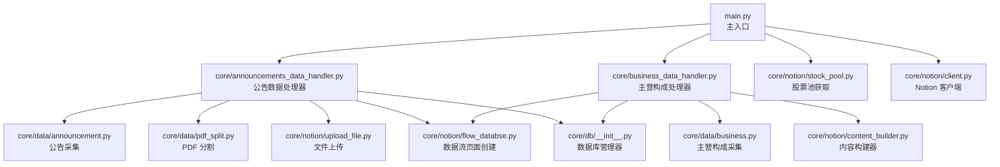
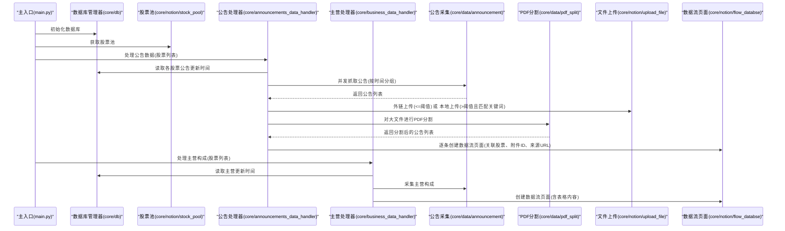
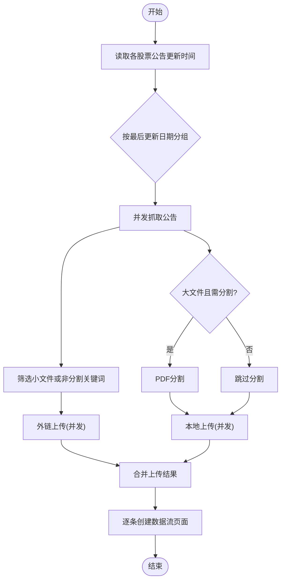
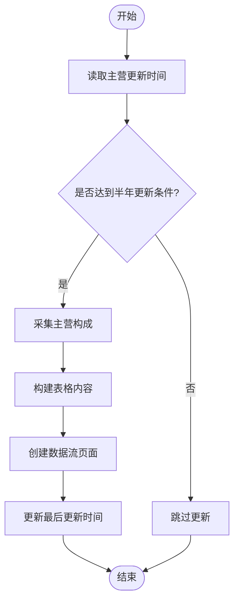
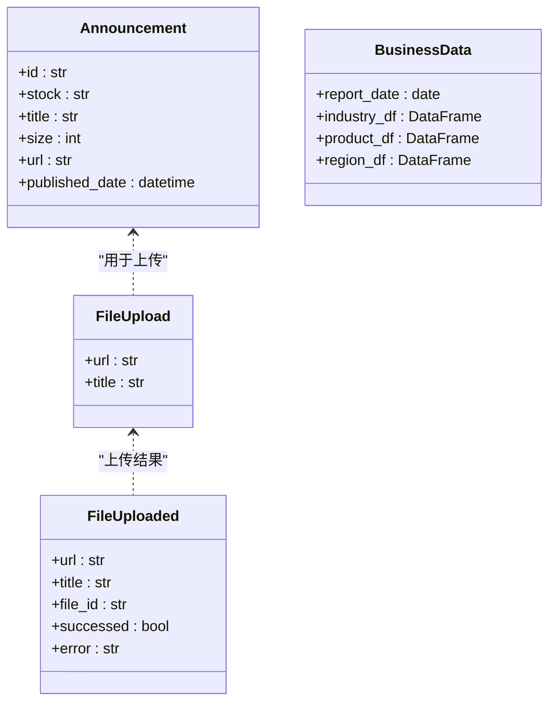
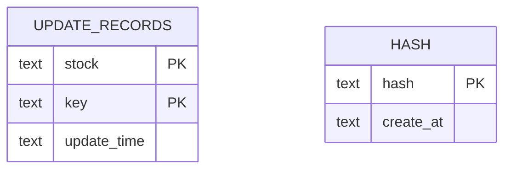
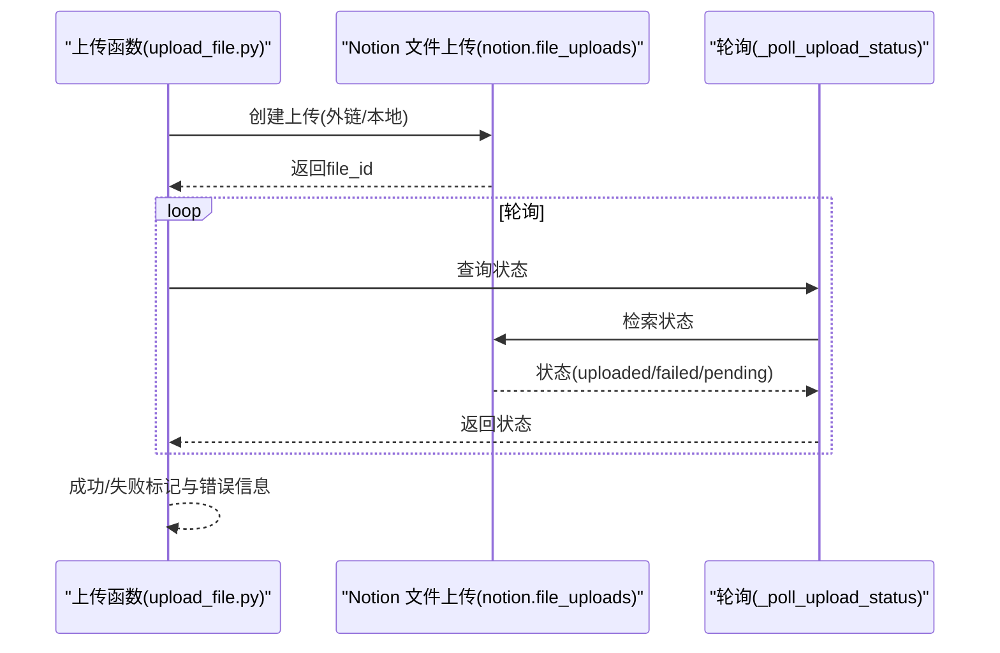
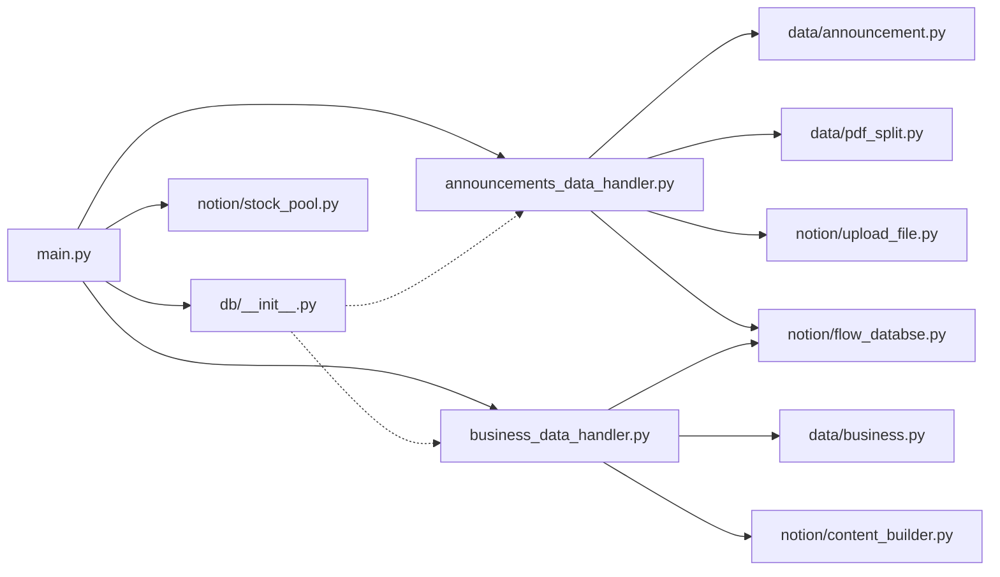

# 组件交互设计

<cite>
**本文引用的文件**
- [main.py](file://main.py)
- [announcements_data_handler.py](file://core/announcements_data_handler.py)
- [business_data_handler.py](file://core/business_data_handler.py)
- [announcement.py](file://core/data/announcement.py)
- [business.py](file://core/data/business.py)
- [pdf_split.py](file://core/data/pdf_split.py)
- [__init__.py](file://core/db/__init__.py)
- [client.py](file://core/notion/client.py)
- [content_builder.py](file://core/notion/content_builder.py)
- [flow_databse.py](file://core/notion/flow_databse.py)
- [stock_pool.py](file://core/notion/stock_pool.py)
- [upload_file.py](file://core/notion/upload_file.py)
- [__init__.py](file://core/models/__init__.py)
</cite>

## 目录
1. [简介](#简介)
2. [项目结构](#项目结构)
3. [核心组件](#核心组件)
4. [架构总览](#架构总览)
5. [详细组件分析](#详细组件分析)
6. [依赖分析](#依赖分析)
7. [性能考量](#性能考量)
8. [故障排查指南](#故障排查指南)
9. [结论](#结论)

## 简介
本设计文档面向“股票公告自动化系统”，聚焦于各模块间的交互关系与通信协议，明确主入口如何协调子系统工作，详述公告处理器、数据库管理器、Notion 客户端与 PDF 处理模块的协作机制，解释异步调用模式与错误传播路径，并给出组件接口规范与参数传递约定。

## 项目结构
系统采用按功能域划分的层次化组织：
- 核心入口位于根目录，负责初始化与调度
- 核心业务逻辑位于 core 子包，按领域拆分为 data、db、models、notion、scheduler
- data：数据采集与预处理（公告、主营构成、PDF 分割）
- db：本地 SQLite 异步访问与更新记录维护
- notion：Notion API 客户端、内容构建器、数据流页面创建、文件上传
- models：类型定义（如 NotionDate）

图表来源
- [main.py](file://main.py#L20-L39)
- [announcements_data_handler.py](file://core/announcements_data_handler.py#L21-L116)
- [business_data_handler.py](file://core/business_data_handler.py#L17-L108)
- [announcement.py](file://core/data/announcement.py#L36-L112)
- [pdf_split.py](file://core/data/pdf_split.py#L15-L73)
- [upload_file.py](file://core/notion/upload_file.py#L28-L61)
- [flow_databse.py](file://core/notion/flow_databse.py#L25-L67)
- [business.py](file://core/data/business.py#L33-L96)
- [content_builder.py](file://core/notion/content_builder.py#L1-L103)
- [__init__.py](file://core/db/__init__.py#L62-L217)
- [stock_pool.py](file://core/notion/stock_pool.py#L23-L52)
- [client.py](file://core/notion/client.py#L1-L6)

章节来源
- [main.py](file://main.py#L1-L40)

## 核心组件
- 主入口模块（main.py）
  - 职责：加载环境变量、初始化数据库、获取股票池、调度公告与主营构成处理流程
  - 关键调用：初始化数据库、获取股票池、调用公告处理器
- 公告数据处理器（announcements_data_handler.py）
  - 职责：按股票与时间窗口批量抓取公告、根据大小与关键词决定外链或本地上传、PDF 分割、创建数据流页面
  - 关键异步：并发抓取、并发上传、并发页面创建
- 主营构成处理器（business_data_handler.py）
  - 职责：按半年周期判断是否更新、采集主营构成、构建 Notion 内容、创建数据流页面、更新时间戳
- 数据采集层（data）
  - 公告采集：cninfo 接口批量查询，过滤摘要/英文/图文版
  - 主营构成：AkShare 异步线程池抓取，按报告日期聚合
  - PDF 分割：基于页数阈值进行切分，保留原 URL 与发布时间
- 数据库管理器（db）
  - 职责：初始化 update_records 与 hash 表、读写更新时间、去重校验
- Notion 客户端与服务（notion）
  - 客户端：AsyncClient 实例
  - 文件上传：外链直传与本地下载后上传两种模式，带轮询状态
  - 页面创建：依据数据类型映射 select id，填充标题、时间、来源、关联、附件、正文
  - 内容构建：基于 blocks 的富文本表格与标题
- 模型定义（models）
  - NotionDate 类型别名，约束数据库存储的日期字符串格式

章节来源
- [main.py](file://main.py#L20-L39)
- [announcements_data_handler.py](file://core/announcements_data_handler.py#L21-L116)
- [business_data_handler.py](file://core/business_data_handler.py#L17-L108)
- [announcement.py](file://core/data/announcement.py#L36-L112)
- [business.py](file://core/data/business.py#L33-L96)
- [pdf_split.py](file://core/data/pdf_split.py#L15-L73)
- [__init__.py](file://core/db/__init__.py#L62-L217)
- [client.py](file://core/notion/client.py#L1-L6)
- [upload_file.py](file://core/notion/upload_file.py#L28-L61)
- [flow_databse.py](file://core/notion/flow_databse.py#L25-L67)
- [content_builder.py](file://core/notion/content_builder.py#L1-L103)
- [__init__.py](file://core/models/__init__.py#L1-L8)

## 架构总览
系统采用“主入口调度 + 多领域处理器 + 异步 I/O + 本地持久化”的架构。主入口负责编排，公告与主营构成两条流水线并行推进；数据采集层统一对外部 API 的访问；数据库层提供去重与更新时间控制；Notion 层负责内容与页面的最终落地。

图表来源
- [main.py](file://main.py#L20-L39)
- [announcements_data_handler.py](file://core/announcements_data_handler.py#L21-L116)
- [business_data_handler.py](file://core/business_data_handler.py#L17-L108)
- [announcement.py](file://core/data/announcement.py#L36-L112)
- [pdf_split.py](file://core/data/pdf_split.py#L15-L73)
- [upload_file.py](file://core/notion/upload_file.py#L28-L61)
- [flow_databse.py](file://core/notion/flow_databse.py#L25-L67)
- [__init__.py](file://core/db/__init__.py#L153-L217)
- [stock_pool.py](file://core/notion/stock_pool.py#L23-L52)

## 详细组件分析

### 主入口模块（main.py）
- 初始化顺序
  - 加载环境变量
  - 初始化数据库
  - 获取股票池
  - 调用公告处理器
- 协调策略
  - 串行初始化，异步并发处理公告与主营构成
- 关键接口
  - main(): 异步入口
  - init_db(): 初始化数据库
  - get_stock_pool(): 获取股票池

章节来源
- [main.py](file://main.py#L20-L39)

### 公告数据处理器（announcements_data_handler.py）
- 输入输出
  - 输入：股票池列表（StockPool）
  - 输出：在 Notion 中创建数据流页面
- 时间窗口与分组
  - 未更新股票默认从一年前开始
  - 已更新股票按最后更新日期分组，减少接口调用
- 并发策略
  - 抓取：按组并发
  - 上传：外链与本地分别并发
  - 页面创建：逐条并发
- 附件策略
  - 小于等于阈值：外链直传
  - 大于阈值且标题包含关键词：PDF 分割后本地上传
- 关键函数
  - process_announcements_data_for_stock_list()

图表来源
- [announcements_data_handler.py](file://core/announcements_data_handler.py#L21-L116)
- [pdf_split.py](file://core/data/pdf_split.py#L15-L73)
- [upload_file.py](file://core/notion/upload_file.py#L28-L61)
- [flow_databse.py](file://core/notion/flow_databse.py#L25-L67)

章节来源
- [announcements_data_handler.py](file://core/announcements_data_handler.py#L21-L116)

### 主营构成处理器（business_data_handler.py）
- 更新策略
  - 仅在半年报季末满足条件时更新
  - 读取上次更新时间，计算下次可更新时间点
- 内容构建
  - 使用 NotionContentBuilder 构建三张表格（行业/产品/地区）
- 页面创建
  - 以报告日期作为发布时间，创建数据流页面
- 关键函数
  - process_business_data_for_stock_list()
  - _should_update_half_year()

图表来源
- [business_data_handler.py](file://core/business_data_handler.py#L17-L108)
- [business.py](file://core/data/business.py#L33-L96)
- [content_builder.py](file://core/notion/content_builder.py#L1-L103)
- [flow_databse.py](file://core/notion/flow_databse.py#L25-L67)
- [__init__.py](file://core/db/__init__.py#L153-L217)

章节来源
- [business_data_handler.py](file://core/business_data_handler.py#L17-L108)

### 数据采集层（data）
- 公告采集（announcement.py）
  - 接口：cninfo 历史公告查询
  - 过滤：排除摘要/英文/图文版
  - 结果：Announcement 列表
- 主营构成（business.py）
  - 数据源：AkShare 异步线程池
  - 结果：BusinessData（报告日期+三张表）
- PDF 分割（pdf_split.py）
  - 规则：页数阈值决定是否分割
  - 输出：Announcement 列表（含页码范围标题）

图表来源
- [announcement.py](file://core/data/announcement.py#L12-L34)
- [business.py](file://core/data/business.py#L16-L31)
- [upload_file.py](file://core/notion/upload_file.py#L17-L26)

章节来源
- [announcement.py](file://core/data/announcement.py#L36-L141)
- [business.py](file://core/data/business.py#L33-L96)
- [pdf_split.py](file://core/data/pdf_split.py#L15-L128)

### 数据库管理器（db）
- 表结构
  - update_records：stock, key, update_time
  - hash：hash, create_at
- 关键能力
  - get_update_time：批量读取更新时间，缺失则插入空记录
  - set_update_time：更新指定记录，不存在则抛错
  - check_hash/save_hash：基于 xxhash 去重
- 并发模型
  - 异步上下文管理器，自动提交/回滚

图表来源
- [__init__.py](file://core/db/__init__.py#L77-L94)
- [__init__.py](file://core/db/__init__.py#L153-L217)

章节来源
- [__init__.py](file://core/db/__init__.py#L28-L217)

### Notion 客户端与服务（notion）
- 客户端（client.py）
  - AsyncClient 实例，通过环境变量鉴权
- 文件上传（upload_file.py）
  - upload_files_with_url：外链直传，轮询状态
  - upload_files_with_local：下载后上传，轮询状态
  - 轮询策略：指数退避（1,2,4,8,16）
- 页面创建（flow_databse.py）
  - 根据数据类型映射 select id
  - 支持附件、原文链接、正文 blocks
- 内容构建（content_builder.py）
  - 标题、段落、表格、分隔线、Callout
- 股票池（stock_pool.py）
  - 从 Notion 数据源查询股票池，返回 StockPool 列表

图表来源
- [upload_file.py](file://core/notion/upload_file.py#L124-L177)
- [client.py](file://core/notion/client.py#L1-L6)

章节来源
- [client.py](file://core/notion/client.py#L1-L6)
- [upload_file.py](file://core/notion/upload_file.py#L28-L177)
- [flow_databse.py](file://core/notion/flow_databse.py#L25-L67)
- [content_builder.py](file://core/notion/content_builder.py#L1-L103)
- [stock_pool.py](file://core/notion/stock_pool.py#L23-L52)

## 依赖分析
- 模块耦合
  - 主入口仅依赖数据库初始化与股票池获取，其余处理器通过异步解耦
  - 公告处理器依赖数据采集、PDF 分割、文件上传与页面创建
  - 主营处理器依赖数据采集、内容构建与页面创建
  - 数据库管理器被两类处理器共享
- 外部依赖
  - httpx：HTTP 客户端
  - aiosqlite：异步 SQLite
  - notion_client：Notion API
  - AkShare：主营构成数据
  - PyMuPDF：PDF 分割
- 循环依赖
  - 未发现循环导入；各模块职责清晰，接口边界明确

图表来源
- [main.py](file://main.py#L20-L39)
- [announcements_data_handler.py](file://core/announcements_data_handler.py#L7-L16)
- [business_data_handler.py](file://core/business_data_handler.py#L4-L12)
- [__init__.py](file://core/db/__init__.py#L62-L217)

章节来源
- [main.py](file://main.py#L20-L39)
- [announcements_data_handler.py](file://core/announcements_data_handler.py#L7-L16)
- [business_data_handler.py](file://core/business_data_handler.py#L4-L12)
- [__init__.py](file://core/db/__init__.py#L62-L217)

## 性能考量
- 并发优化
  - 抓取：按最后更新日期分组，减少重复请求
  - 上传：外链与本地上传分别并发，提升吞吐
  - 页面：逐条并发创建，避免阻塞
- I/O 优化
  - PDF 分割在内存中进行，避免磁盘 IO
  - 轮询采用指数退避，平衡成功率与等待时间
- 数据一致性
  - 数据库事务自动提交/回滚，保证更新时间一致性
  - 哈希去重避免重复页面与附件

## 故障排查指南
- 常见问题与定位
  - Notion API 失败：检查环境变量 TOKEN 与数据源 ID；查看页面创建日志
  - 文件上传失败：查看轮询状态与错误信息；确认 URL 可达性
  - 公告抓取为空：检查股票代码映射与日期范围；确认接口可用
  - 更新时间异常：确认 update_records 表结构与数据；检查 set_update_time 的存在性校验
- 错误传播
  - 页面创建捕获异常并记录日志，不影响其他页面创建
  - 文件上传失败返回错误信息，便于上层统计与重试
  - 数据库更新失败抛出异常，提示业务逻辑错误

章节来源
- [flow_databse.py](file://core/notion/flow_databse.py#L65-L67)
- [upload_file.py](file://core/notion/upload_file.py#L153-L177)
- [__init__.py](file://core/db/__init__.py#L202-L215)

## 结论
本系统通过主入口统一调度、多处理器并行推进、异步 I/O 与本地持久化相结合，实现了从公告与主营构成数据采集到 Notion 页面落地的完整自动化流程。公告处理器在时间分组、文件上传与页面创建三个环节均采用并发策略，显著提升了吞吐；数据库层提供去重与更新时间控制，保障数据一致性；Notion 层通过内容构建器与页面创建接口，将结构化数据转化为可视化页面。建议后续引入重试与断点续跑机制，进一步增强稳定性与可观测性。