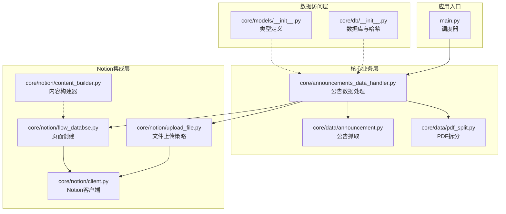
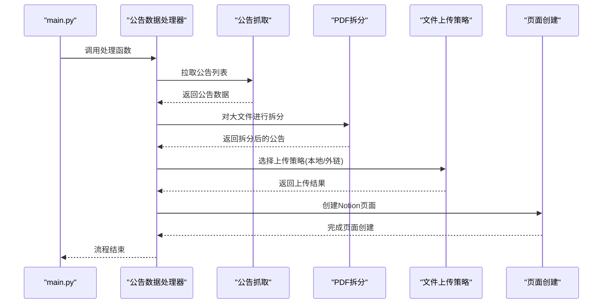
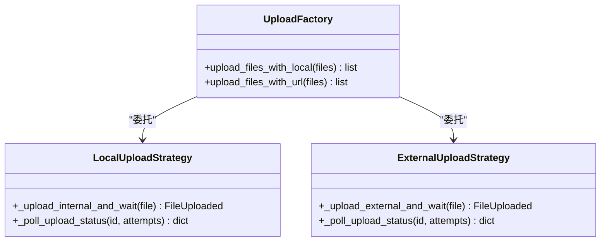
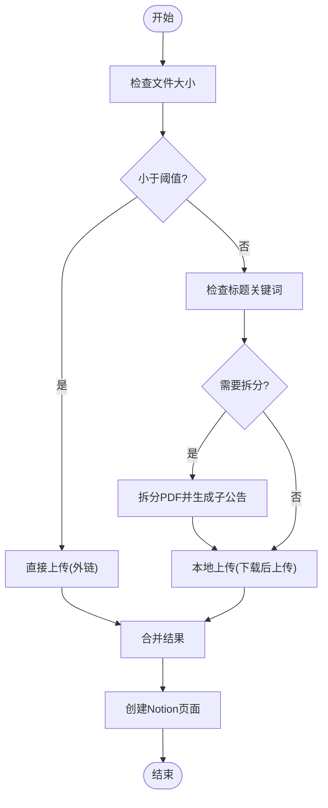
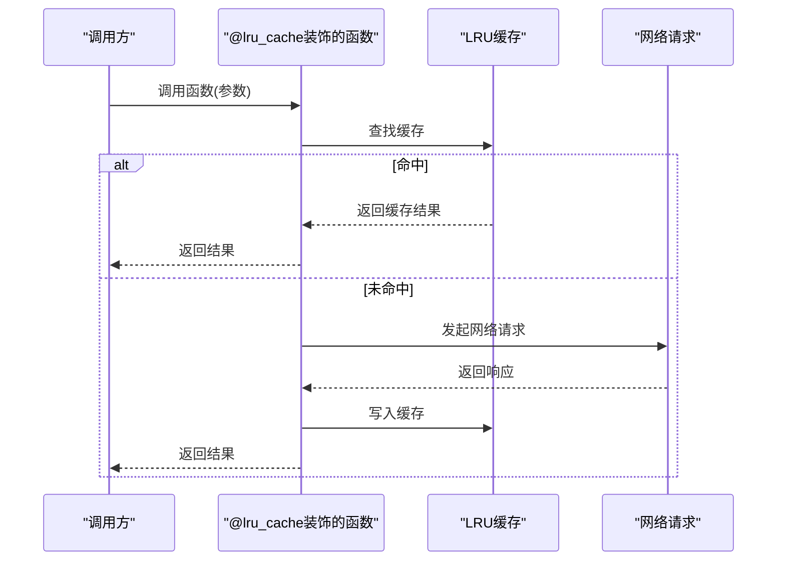
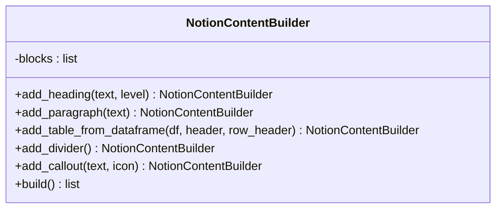
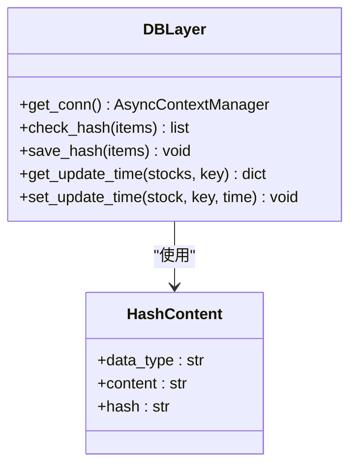
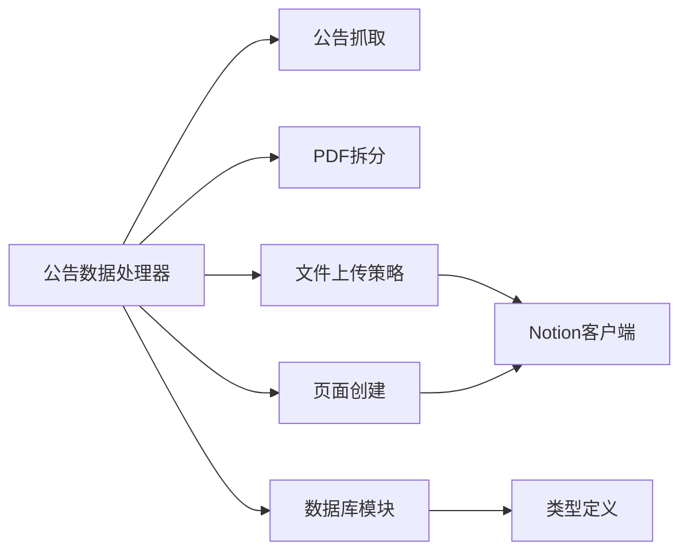

# 设计模式应用

<cite>
**本文引用的文件**
- [main.py](file://main.py)
- [core/announcements_data_handler.py](file://core/announcements_data_handler.py)
- [core/data/announcement.py](file://core/data/announcement.py)
- [core/data/pdf_split.py](file://core/data/pdf_split.py)
- [core/notion/upload_file.py](file://core/notion/upload_file.py)
- [core/notion/content_builder.py](file://core/notion/content_builder.py)
- [core/notion/flow_databse.py](file://core/notion/flow_databse.py)
- [core/db/__init__.py](file://core/db/__init__.py)
- [core/models/__init__.py](file://core/models/__init__.py)
- [core/notion/client.py](file://core/notion/client.py)
</cite>

## 目录
1. [引言](#引言)
2. [项目结构](#项目结构)
3. [核心组件](#核心组件)
4. [架构总览](#架构总览)
5. [详细组件分析](#详细组件分析)
6. [依赖关系分析](#依赖关系分析)
7. [性能考量](#性能考量)
8. [故障排查指南](#故障排查指南)
9. [结论](#结论)

## 引言
本文件聚焦于股票公告自动化系统中设计模式的应用，围绕以下主题展开：
- 工厂模式在文件上传策略中的应用：通过统一的入口函数选择本地上传或外链上传策略，实现“策略选择”的工厂化封装。
- 策略模式在不同文件处理中的实现：根据公告大小与关键词决定是否拆分PDF，以及采用何种上传策略，体现“算法族”可替换的特点。
- 装饰器模式在缓存机制中的使用：利用LRU缓存装饰器减少重复网络请求，提升数据获取效率。

通过对关键模块的深入分析，解释这些设计模式如何提升系统的可维护性与扩展性，并给出相应的流程图与类图辅助理解。

## 项目结构
项目采用按功能域划分的层次化组织方式：
- 核心业务层：公告数据抓取、PDF拆分、业务数据处理等。
- 数据访问层：SQLite异步连接、哈希去重、更新时间管理。
- Notion集成层：文件上传、页面创建、内容构建器。
- 应用入口：主程序调度各数据处理器。

图表来源
- [main.py](file://main.py#L20-L36)
- [core/announcements_data_handler.py](file://core/announcements_data_handler.py#L21-L116)
- [core/data/announcement.py](file://core/data/announcement.py#L36-L112)
- [core/data/pdf_split.py](file://core/data/pdf_split.py#L15-L73)
- [core/notion/upload_file.py](file://core/notion/upload_file.py#L28-L61)
- [core/notion/flow_databse.py](file://core/notion/flow_databse.py#L25-L67)
- [core/db/__init__.py](file://core/db/__init__.py#L62-L215)
- [core/models/__init__.py](file://core/models/__init__.py#L1-L8)
- [core/notion/client.py](file://core/notion/client.py#L1-L6)

章节来源
- [main.py](file://main.py#L20-L36)
- [core/announcements_data_handler.py](file://core/announcements_data_handler.py#L21-L116)

## 核心组件
- 公告数据处理器：负责拉取公告、按条件拆分PDF、选择上传策略、创建Notion页面。
- 公告抓取模块：封装HTTP请求与分页逻辑，返回标准化的数据模型。
- PDF拆分模块：根据页数阈值与重叠页策略，将大文件拆分为多个子文件。
- Notion文件上传模块：提供本地上传与外链上传两种策略，并内置轮询与重试。
- 数据库与哈希模块：提供异步连接、哈希去重、更新时间读写。
- 内容构建器：提供链式调用的页面内容构建能力。
- 页面创建模块：将属性与内容写入Notion数据库页面。

章节来源
- [core/announcements_data_handler.py](file://core/announcements_data_handler.py#L21-L116)
- [core/data/announcement.py](file://core/data/announcement.py#L36-L112)
- [core/data/pdf_split.py](file://core/data/pdf_split.py#L15-L73)
- [core/notion/upload_file.py](file://core/notion/upload_file.py#L28-L61)
- [core/db/__init__.py](file://core/db/__init__.py#L62-L215)
- [core/notion/content_builder.py](file://core/notion/content_builder.py#L1-L103)
- [core/notion/flow_databse.py](file://core/notion/flow_databse.py#L25-L67)

## 架构总览
系统采用“数据抓取—预处理—策略选择—上传—页面创建”的流水线式架构。公告数据处理器作为编排者，协调各子模块完成端到端流程。

图表来源
- [main.py](file://main.py#L20-L36)
- [core/announcements_data_handler.py](file://core/announcements_data_handler.py#L21-L116)
- [core/data/announcement.py](file://core/data/announcement.py#L36-L112)
- [core/data/pdf_split.py](file://core/data/pdf_split.py#L15-L73)
- [core/notion/upload_file.py](file://core/notion/upload_file.py#L28-L61)
- [core/notion/flow_databse.py](file://core/notion/flow_databse.py#L25-L67)

## 详细组件分析

### 工厂模式：文件上传策略工厂
- 角色定位
  - 工厂方法：对外暴露统一的上传入口，内部根据输入特征选择具体策略。
  - 策略实现：本地上传与外链上传两条路径，分别处理下载后上传与直接外链导入。
- 实现要点
  - 统一接口：对外提供两个入口函数，屏蔽内部差异。
  - 并发控制：使用异步并发收集任务结果，提升吞吐。
  - 状态轮询：内置指数退避轮询，增强可靠性。
- 优势
  - 易于扩展：新增上传策略只需遵循统一协议并注册入口。
  - 易于测试：策略解耦，便于针对不同策略编写独立测试。
  - 易于维护：调用方无需关心具体实现细节。

图表来源
- [core/notion/upload_file.py](file://core/notion/upload_file.py#L28-L61)
- [core/notion/upload_file.py](file://core/notion/upload_file.py#L64-L96)
- [core/notion/upload_file.py](file://core/notion/upload_file.py#L124-L150)
- [core/notion/upload_file.py](file://core/notion/upload_file.py#L153-L176)

章节来源
- [core/notion/upload_file.py](file://core/notion/upload_file.py#L28-L61)
- [core/notion/upload_file.py](file://core/notion/upload_file.py#L64-L96)
- [core/notion/upload_file.py](file://core/notion/upload_file.py#L124-L150)
- [core/notion/upload_file.py](file://core/notion/upload_file.py#L153-L176)

### 策略模式：文件处理与上传策略
- 角色定位
  - 上下文：公告数据处理器，依据条件选择策略。
  - 策略集合：小文件直传、大文件拆分后上传、外链直接上传。
- 实现要点
  - 条件判断：基于文件大小与标题关键词决定是否拆分。
  - 并行处理：不同类型的任务并行执行，缩短总耗时。
  - 结果合并：将两类上传结果合并，保证页面创建顺序一致。
- 优势
  - 可替换性：新增处理规则只需扩展条件分支与对应策略。
  - 可组合性：不同策略可按需组合，满足复杂场景。
  - 可观测性：通过日志与统计输出，清晰展示处理过程。

图表来源
- [core/announcements_data_handler.py](file://core/announcements_data_handler.py#L66-L93)
- [core/data/pdf_split.py](file://core/data/pdf_split.py#L15-L73)
- [core/notion/upload_file.py](file://core/notion/upload_file.py#L28-L61)

章节来源
- [core/announcements_data_handler.py](file://core/announcements_data_handler.py#L66-L93)
- [core/data/pdf_split.py](file://core/data/pdf_split.py#L15-L73)

### 装饰器模式：缓存机制（LRU）
- 角色定位
  - 装饰器：对网络请求函数进行缓存装饰，避免重复请求。
- 实现要点
  - 缓存键：函数参数经序列化后计算哈希，作为缓存键。
  - 缓存命中：命中则直接返回缓存结果；未命中则发起请求并写入缓存。
  - 生命周期：缓存具备容量限制，淘汰旧数据。
- 优势
  - 性能提升：显著降低重复请求的网络开销。
  - 透明性：对调用方透明，无需感知缓存细节。
  - 可维护性：集中管理缓存策略，便于调整缓存参数。

图表来源
- [core/data/announcement.py](file://core/data/announcement.py#L115-L141)

章节来源
- [core/data/announcement.py](file://core/data/announcement.py#L115-L141)

### 内容构建器：链式构建模式
- 角色定位
  - 构建器：提供链式API，逐步构建页面内容块。
- 实现要点
  - 方法返回自身：每个添加方法返回构建器实例，支持连续调用。
  - 统一结构：最终输出符合Notion API要求的blocks数组。
- 优势
  - 可读性强：链式调用直观表达构建过程。
  - 易扩展：新增内容类型只需增加相应方法。
  - 易复用：构建器可被多个页面创建流程复用。

图表来源
- [core/notion/content_builder.py](file://core/notion/content_builder.py#L1-L103)

章节来源
- [core/notion/content_builder.py](file://core/notion/content_builder.py#L1-L103)

### 数据库与哈希：职责分离与抽象
- 角色定位
  - 数据访问层：封装数据库连接、事务管理、哈希去重、更新时间管理。
- 实现要点
  - 异步上下文管理：确保连接生命周期与事务一致性。
  - 哈希去重：对数据序列化后计算哈希，避免重复入库。
  - 更新时间：按股票与键维护最后更新时间，支持增量处理。
- 优势
  - 解耦：业务层无需关心数据库细节。
  - 可靠：事务管理保障数据一致性。
  - 可扩展：新增表或字段只需修改Schema与访问方法。

图表来源
- [core/db/__init__.py](file://core/db/__init__.py#L28-L52)
- [core/db/__init__.py](file://core/db/__init__.py#L97-L128)
- [core/db/__init__.py](file://core/db/__init__.py#L131-L151)
- [core/db/__init__.py](file://core/db/__init__.py#L153-L215)

章节来源
- [core/db/__init__.py](file://core/db/__init__.py#L28-L52)
- [core/db/__init__.py](file://core/db/__init__.py#L97-L128)
- [core/db/__init__.py](file://core/db/__init__.py#L131-L151)
- [core/db/__init__.py](file://core/db/__init__.py#L153-L215)

## 依赖关系分析
- 模块内聚与耦合
  - 公告数据处理器与PDF拆分模块存在直接依赖，但通过统一的数据模型进行解耦。
  - Notion上传策略与页面创建模块依赖Notion客户端，形成稳定的集成边界。
  - 数据库模块提供通用的访问接口，被多个业务模块复用。
- 外部依赖
  - HTTP客户端、PDF处理库、Notion SDK等第三方库通过明确的适配层隔离。
- 循环依赖
  - 未发现循环导入；各模块职责清晰，接口边界明确。

图表来源
- [core/announcements_data_handler.py](file://core/announcements_data_handler.py#L21-L116)
- [core/data/announcement.py](file://core/data/announcement.py#L36-L112)
- [core/data/pdf_split.py](file://core/data/pdf_split.py#L15-L73)
- [core/notion/upload_file.py](file://core/notion/upload_file.py#L28-L61)
- [core/notion/flow_databse.py](file://core/notion/flow_databse.py#L25-L67)
- [core/db/__init__.py](file://core/db/__init__.py#L62-L215)
- [core/models/__init__.py](file://core/models/__init__.py#L1-L8)
- [core/notion/client.py](file://core/notion/client.py#L1-L6)

章节来源
- [core/announcements_data_handler.py](file://core/announcements_data_handler.py#L21-L116)
- [core/data/announcement.py](file://core/data/announcement.py#L36-L112)
- [core/data/pdf_split.py](file://core/data/pdf_split.py#L15-L73)
- [core/notion/upload_file.py](file://core/notion/upload_file.py#L28-L61)
- [core/notion/flow_databse.py](file://core/notion/flow_databse.py#L25-L67)
- [core/db/__init__.py](file://core/db/__init__.py#L62-L215)
- [core/models/__init__.py](file://core/models/__init__.py#L1-L8)
- [core/notion/client.py](file://core/notion/client.py#L1-L6)

## 性能考量
- 并发优化
  - 异步并发：上传与页面创建均采用并发收集，显著提升吞吐。
  - 并行抓取：对不同更新时间的股票分组并行抓取，减少总等待时间。
- I/O优化
  - LRU缓存：对重复请求进行缓存，降低网络与CPU开销。
  - PDF拆分：合理设置分片大小与重叠页，平衡上传数量与单文件大小。
- 可靠性
  - 指数退避轮询：上传状态轮询采用指数增长等待间隔，避免频繁请求。
  - 事务与回滚：数据库操作通过上下文管理器确保一致性。
- 可扩展性
  - 策略解耦：新增策略只需遵循统一接口，不影响现有流程。
  - 模块化：各层职责清晰，便于独立扩展与替换。

## 故障排查指南
- 上传失败
  - 现象：状态轮询超时或失败。
  - 排查：检查Notion令牌配置、网络连通性、目标数据库权限。
  - 参考路径：[轮询与状态处理](file://core/notion/upload_file.py#L153-L176)
- PDF拆分异常
  - 现象：拆分失败或页数统计异常。
  - 排查：确认PDF可读性、页数阈值与重叠页配置。
  - 参考路径：[拆分与页数统计](file://core/data/pdf_split.py#L84-L89)
- 数据库事务问题
  - 现象：更新时间未生效或重复记录。
  - 排查：检查连接池状态、事务提交与回滚逻辑。
  - 参考路径：[事务管理](file://core/db/__init__.py#L28-L52)
- 页面创建失败
  - 现象：属性映射或权限错误。
  - 排查：核对类型映射表、数据库ID与权限配置。
  - 参考路径：[页面创建](file://core/notion/flow_databse.py#L25-L67)

章节来源
- [core/notion/upload_file.py](file://core/notion/upload_file.py#L153-L176)
- [core/data/pdf_split.py](file://core/data/pdf_split.py#L84-L89)
- [core/db/__init__.py](file://core/db/__init__.py#L28-L52)
- [core/notion/flow_databse.py](file://core/notion/flow_databse.py#L25-L67)

## 结论
本系统通过工厂模式、策略模式与装饰器模式的有机结合，实现了公告自动化处理的高内聚、低耦合与强扩展性：
- 工厂模式将上传策略的选择逻辑集中化，便于新增与替换。
- 策略模式使文件处理与上传决策清晰可测，支持复杂条件组合。
- 装饰器模式以最小侵入提升性能与稳定性。
配合数据库与Notion集成层的职责分离，系统在可维护性与扩展性方面表现优异，适合持续演进与规模化部署。