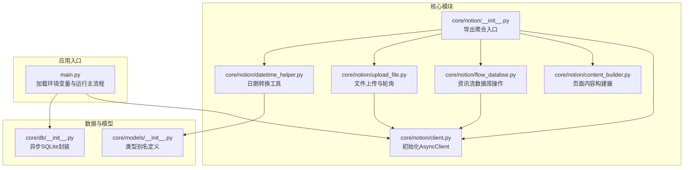
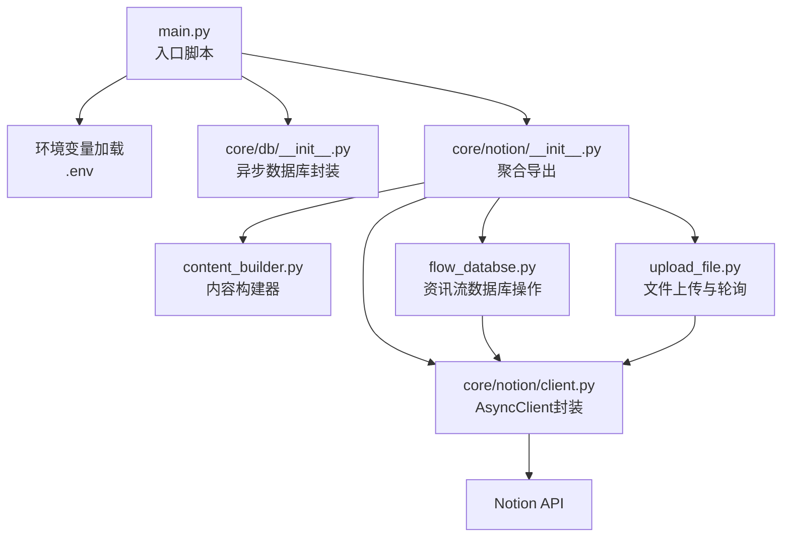
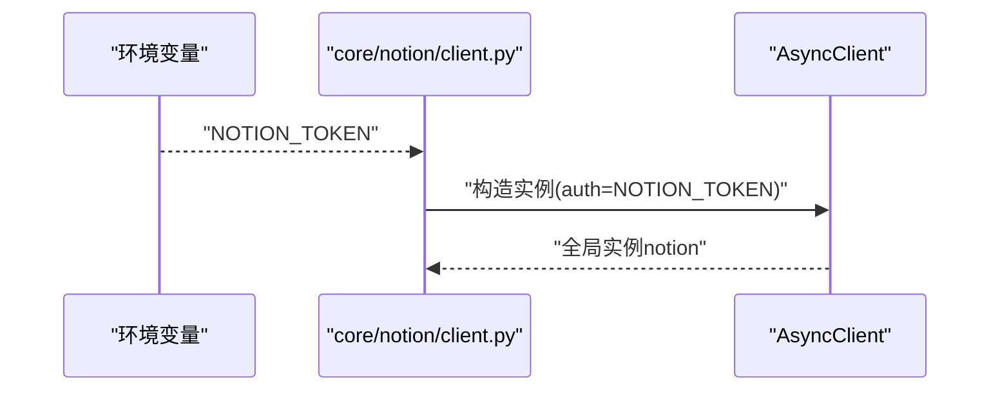
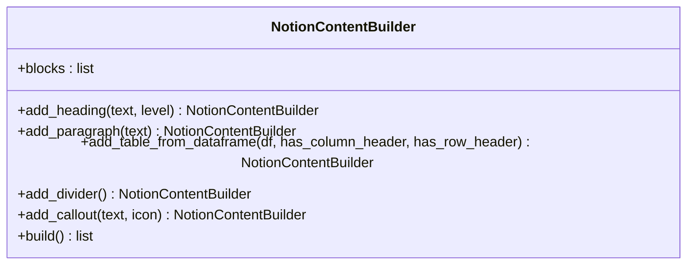
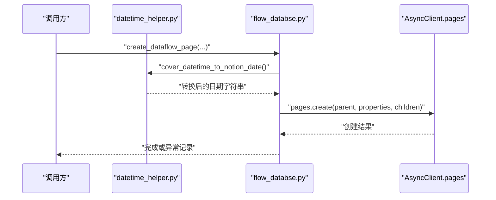
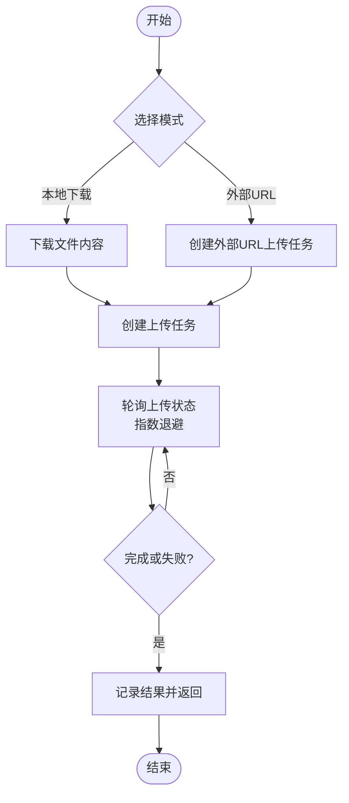
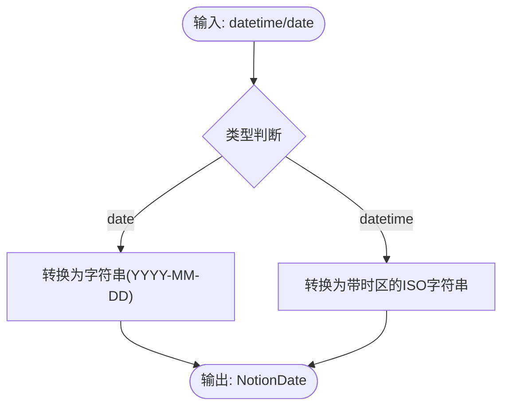
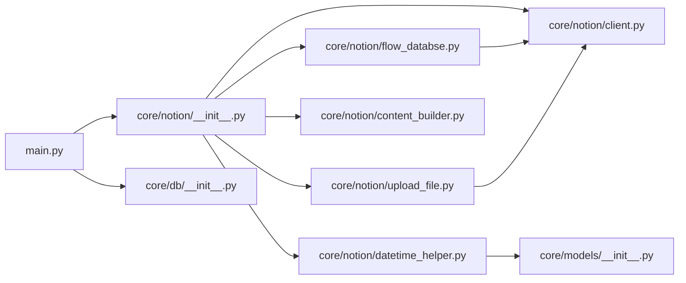

# Notion API客户端

<cite>
**本文引用的文件**
- [core/notion/client.py](file://core/notion/client.py)
- [core/notion/__init__.py](file://core/notion/__init__.py)
- [core/notion/content_builder.py](file://core/notion/content_builder.py)
- [core/notion/flow_databse.py](file://core/notion/flow_databse.py)
- [core/notion/upload_file.py](file://core/notion/upload_file.py)
- [core/notion/datetime_helper.py](file://core/notion/datetime_helper.py)
- [core/models/__init__.py](file://core/models/__init__.py)
- [core/db/__init__.py](file://core/db/__init__.py)
- [main.py](file://main.py)
- [tests/test_notion/test_content_builder.py](file://tests/test_notion/test_content_builder.py)
- [tests/test_notion/test_datetime_helper.py](file://tests/test_notion/test_datetime_helper.py)
</cite>

## 目录
1. [简介](#简介)
2. [项目结构](#项目结构)
3. [核心组件](#核心组件)
4. [架构总览](#架构总览)
5. [详细组件分析](#详细组件分析)
6. [依赖关系分析](#依赖关系分析)
7. [性能考量](#性能考量)
8. [故障排查指南](#故障排查指南)
9. [结论](#结论)
10. [附录](#附录)

## 简介
本文件面向Notion API客户端的使用者与维护者，系统性阐述AsyncClient的封装实现、环境变量配置与认证机制，以及如何初始化客户端实例、配置API密钥与处理连接参数。文档还对比了异步客户端与同步客户端的差异，覆盖常见配置问题、错误处理策略与最佳实践，帮助初学者快速上手，同时为有经验的开发者提供足够的技术细节。

## 项目结构
该项目采用按功能域划分的模块化组织方式，核心与业务逻辑分离，Notion相关能力集中在core/notion包内，数据库与模型定义位于core/db与core/models下，入口脚本位于根目录。

图表来源
- [core/notion/client.py](file://core/notion/client.py#L1-L6)
- [core/notion/__init__.py](file://core/notion/__init__.py#L1-L23)
- [core/notion/content_builder.py](file://core/notion/content_builder.py#L1-L103)
- [core/notion/flow_databse.py](file://core/notion/flow_databse.py#L1-L67)
- [core/notion/upload_file.py](file://core/notion/upload_file.py#L1-L180)
- [core/notion/datetime_helper.py](file://core/notion/datetime_helper.py#L1-L39)
- [core/db/__init__.py](file://core/db/__init__.py#L1-L218)
- [core/models/__init__.py](file://core/models/__init__.py#L1-L8)
- [main.py](file://main.py#L1-L40)

章节来源
- [core/notion/client.py](file://core/notion/client.py#L1-L6)
- [core/notion/__init__.py](file://core/notion/__init__.py#L1-L23)
- [main.py](file://main.py#L1-L40)

## 核心组件
- 异步客户端封装
  - 在core/notion/client.py中，通过AsyncClient(auth=os.getenv("NOTION_TOKEN"))创建全局异步客户端实例，供其他模块直接使用。
  - 该封装将认证令牌从环境变量注入，避免硬编码，便于CI/CD与多环境部署。
- 导出聚合入口
  - core/notion/__init__.py统一导出notion实例与其他工具函数，简化上层调用。
- 页面内容构建器
  - NotionContentBuilder提供链式API，支持标题、段落、表格、分隔线、Callout等块的构建，最终输出符合Notion页面children结构的列表。
- 资讯流数据库操作
  - create_dataflow_page基于传入属性与内容，在指定数据源ID的数据库中创建页面，内部使用notion.pages.create。
- 文件上传与轮询
  - upload_files_with_local与upload_files_with_url分别支持本地下载后上传与外部URL直传两种模式，均通过notion.file_uploads.create创建上传任务，并以指数退避策略轮询状态直至完成或失败。
- 日期转换工具
  - cover_datetime_to_notion_date与cover_notion_date_to_datetime负责Python日期/时间与Notion日期字符串之间的互转，确保时区与精度一致。
- 数据库与模型
  - core/db/__init__.py提供异步SQLite封装，包括连接管理、哈希去重、更新时间记录等；core/models/__init__.py定义NotionDate类型别名，提升类型安全性。

章节来源
- [core/notion/client.py](file://core/notion/client.py#L1-L6)
- [core/notion/__init__.py](file://core/notion/__init__.py#L1-L23)
- [core/notion/content_builder.py](file://core/notion/content_builder.py#L1-L103)
- [core/notion/flow_databse.py](file://core/notion/flow_databse.py#L1-L67)
- [core/notion/upload_file.py](file://core/notion/upload_file.py#L1-L180)
- [core/notion/datetime_helper.py](file://core/notion/datetime_helper.py#L1-L39)
- [core/db/__init__.py](file://core/db/__init__.py#L1-L218)
- [core/models/__init__.py](file://core/models/__init__.py#L1-L8)

## 架构总览
下图展示了Notion客户端在系统中的位置与交互关系：入口脚本加载环境变量后，初始化数据库并调用业务流程；业务流程通过core.notion导出的聚合入口访问notion实例与工具函数；notion实例来自AsyncClient封装，负责与Notion API通信。

图表来源
- [main.py](file://main.py#L1-L40)
- [core/notion/__init__.py](file://core/notion/__init__.py#L1-L23)
- [core/notion/client.py](file://core/notion/client.py#L1-L6)
- [core/notion/flow_databse.py](file://core/notion/flow_databse.py#L1-L67)
- [core/notion/upload_file.py](file://core/notion/upload_file.py#L1-L180)
- [core/db/__init__.py](file://core/db/__init__.py#L1-L218)

## 详细组件分析

### 异步客户端封装与认证
- 初始化流程
  - 在core/notion/client.py中，通过os.getenv("NOTION_TOKEN")读取环境变量作为认证令牌，构造AsyncClient实例。
  - 该实例命名为notion，作为全局共享的客户端，供其他模块直接导入使用。
- 认证机制
  - 使用Bearer Token认证，令牌来源于环境变量NOTION_TOKEN。
  - 建议在开发与生产环境中分别配置不同令牌，避免泄露。
- 连接参数
  - 当前封装未显式传入额外连接参数（如超时、代理等）。若需自定义，可在封装处扩展AsyncClient构造参数。

图表来源
- [core/notion/client.py](file://core/notion/client.py#L1-L6)

章节来源
- [core/notion/client.py](file://core/notion/client.py#L1-L6)

### 页面内容构建器（NotionContentBuilder）
- 设计要点
  - 提供链式API，支持添加标题、段落、表格、分隔线、Callout等块。
  - build()返回符合children结构的块列表，便于直接传入pages.create的children参数。
- 典型使用路径
  - 通过core.notion.__init__.py导出，上层业务模块可直接导入使用。
- 测试验证
  - tests/test_notion/test_content_builder.py覆盖了各块类型的断言与链式调用行为。

图表来源
- [core/notion/content_builder.py](file://core/notion/content_builder.py#L1-L103)

章节来源
- [core/notion/content_builder.py](file://core/notion/content_builder.py#L1-L103)
- [core/notion/__init__.py](file://core/notion/__init__.py#L1-L23)
- [tests/test_notion/test_content_builder.py](file://tests/test_notion/test_content_builder.py#L1-L165)

### 资讯流数据库操作（create_dataflow_page）
- 功能概述
  - 在指定数据源ID的资讯流数据库中创建页面，支持设置标题、发布时间、来源接口、数据类型、关联股票、原文链接与附件等属性。
  - 内部使用notion.pages.create完成页面创建。
- 关键点
  - 数据类型映射通过TYPE_MAPPING实现，确保select字段的id正确。
  - 时间属性通过datetime_helper进行转换，保证格式与时区一致。
  - 日志记录创建过程与异常信息，便于排障。

图表来源
- [core/notion/flow_databse.py](file://core/notion/flow_databse.py#L1-L67)
- [core/notion/datetime_helper.py](file://core/notion/datetime_helper.py#L1-L39)

章节来源
- [core/notion/flow_databse.py](file://core/notion/flow_databse.py#L1-L67)
- [core/notion/datetime_helper.py](file://core/notion/datetime_helper.py#L1-L39)

### 文件上传与轮询（upload_files_with_local / upload_files_with_url）
- 功能概述
  - 支持本地下载后上传与外部URL直传两种模式，均通过notion.file_uploads.create创建上传任务。
  - 采用指数退避策略轮询上传状态，直至完成或失败。
- 并发与批处理
  - 使用asyncio.gather并发处理多个文件上传任务，提升吞吐量。
  - PDF文件按固定批次大小切片上传，减少单次任务体积。
- 错误处理
  - 记录上传成功/失败统计与错误信息，便于后续重试或告警。

图表来源
- [core/notion/upload_file.py](file://core/notion/upload_file.py#L1-L180)

章节来源
- [core/notion/upload_file.py](file://core/notion/upload_file.py#L1-L180)

### 日期转换工具（cover_datetime_to_notion_date / cover_notion_date_to_datetime）
- 功能概述
  - cover_datetime_to_notion_date将Python的date/datetime转换为NotionDate字符串，确保日期与带时区的ISO格式一致性。
  - cover_notion_date_to_datetime将NotionDate字符串还原为datetime对象，支持时区解析。
- 关键点
  - 使用TZ（UTC+8）作为默认时区，保证与业务期望一致。
  - 测试覆盖了date、naive datetime、带UTC与时区信息datetime、微秒精度与往返一致性等场景。

图表来源
- [core/notion/datetime_helper.py](file://core/notion/datetime_helper.py#L1-L39)
- [core/models/__init__.py](file://core/models/__init__.py#L1-L8)

章节来源
- [core/notion/datetime_helper.py](file://core/notion/datetime_helper.py#L1-L39)
- [core/models/__init__.py](file://core/models/__init__.py#L1-L8)
- [tests/test_notion/test_datetime_helper.py](file://tests/test_notion/test_datetime_helper.py#L1-L89)

### 异步客户端与同步客户端的差异
- 异步优势
  - 并发友好：在大量I/O操作（如文件上传、数据库查询）场景下，异步可显著提升吞吐量与响应速度。
  - 资源占用更少：事件循环驱动的并发模型在高并发时内存与CPU开销更低。
- 同步局限
  - 阻塞式I/O：在大量网络请求或文件处理时，同步模型会阻塞主线程，影响整体性能。
- 适用建议
  - I/O密集型任务优先选择异步；计算密集型任务可考虑同步或并行计算框架。

## 依赖关系分析
- 模块耦合
  - core/notion/flow_databse.py与core/notion/upload_file.py均依赖core/notion/client.py导出的notion实例，形成清晰的单点依赖。
  - core/notion/__init__.py作为聚合入口，集中导出notion与工具函数，降低上层模块的导入复杂度。
- 外部依赖
  - AsyncClient来自notion_client库，负责与Notion API交互。
  - httpx用于HTTP请求（文件下载与外部URL上传）。
  - aiosqlite用于异步SQLite访问。
  - pymupdf用于PDF切片处理。
- 可能的循环依赖
  - 当前结构未发现循环导入；若未来扩展，应避免在__init__.py中引入相互依赖的导入。

图表来源
- [main.py](file://main.py#L1-L40)
- [core/notion/__init__.py](file://core/notion/__init__.py#L1-L23)
- [core/notion/client.py](file://core/notion/client.py#L1-L6)
- [core/notion/flow_databse.py](file://core/notion/flow_databse.py#L1-L67)
- [core/notion/upload_file.py](file://core/notion/upload_file.py#L1-L180)
- [core/notion/content_builder.py](file://core/notion/content_builder.py#L1-L103)
- [core/notion/datetime_helper.py](file://core/notion/datetime_helper.py#L1-L39)
- [core/models/__init__.py](file://core/models/__init__.py#L1-L8)
- [core/db/__init__.py](file://core/db/__init__.py#L1-L218)

章节来源
- [core/notion/__init__.py](file://core/notion/__init__.py#L1-L23)
- [core/notion/client.py](file://core/notion/client.py#L1-L6)
- [core/notion/flow_databse.py](file://core/notion/flow_databse.py#L1-L67)
- [core/notion/upload_file.py](file://core/notion/upload_file.py#L1-L180)
- [core/notion/content_builder.py](file://core/notion/content_builder.py#L1-L103)
- [core/notion/datetime_helper.py](file://core/notion/datetime_helper.py#L1-L39)
- [core/models/__init__.py](file://core/models/__init__.py#L1-L8)
- [core/db/__init__.py](file://core/db/__init__.py#L1-L218)
- [main.py](file://main.py#L1-L40)

## 性能考量
- 并发上传
  - 使用asyncio.gather并发处理文件上传任务，减少总耗时；可根据网络与Notion API限流策略调整并发度。
- 指数退避
  - 轮询策略采用1、2、4、8、16秒递增，避免频繁请求导致限流或资源浪费。
- PDF切片
  - 将大PDF按批次切片上传，降低单次任务体积，提高成功率与稳定性。
- 数据库异步
  - 使用aiosqlite与异步上下文管理器，减少锁竞争与事务开销。

## 故障排查指南
- 环境变量未配置
  - 现象：NOTION_TOKEN为空，导致认证失败。
  - 排查：确认.env文件存在且包含NOTION_TOKEN；入口脚本已加载dotenv，确保运行前已执行。
- 数据库初始化失败
  - 现象：首次运行时报错或表未创建。
  - 排查：确认init_db()已执行；检查数据库路径与权限。
- 文件上传失败
  - 现象：部分文件上传状态为failed或轮询超时。
  - 排查：查看日志中的错误信息；检查外部URL可达性；确认PDF切片大小与Notion限制。
- 页面创建异常
  - 现象：create_dataflow_page抛出异常或日志记录错误。
  - 排查：核对数据类型映射、属性字段与数据源ID；检查日期转换是否正确。

章节来源
- [core/notion/flow_databse.py](file://core/notion/flow_databse.py#L55-L67)
- [core/notion/upload_file.py](file://core/notion/upload_file.py#L153-L177)
- [main.py](file://main.py#L1-L40)

## 结论
本项目通过简洁的AsyncClient封装与模块化设计，提供了可复用的Notion集成能力。借助异步并发、完善的错误处理与类型安全的日期转换，系统在I/O密集场景下具备良好性能与可维护性。建议在生产环境中结合限流策略与监控告警，持续优化并发度与稳定性。

## 附录

### 如何初始化Notion客户端实例
- 步骤
  - 在项目根目录准备.env文件，设置NOTION_TOKEN。
  - 运行入口脚本，确保dotenv已加载。
  - 通过core.notion导入notion实例，即可进行页面与文件操作。
- 示例参考
  - 环境变量加载与入口运行：[main.py](file://main.py#L1-L40)
  - 客户端封装与导出：[core/notion/client.py](file://core/notion/client.py#L1-L6)，[core/notion/__init__.py](file://core/notion/__init__.py#L1-L23)

章节来源
- [main.py](file://main.py#L1-L40)
- [core/notion/client.py](file://core/notion/client.py#L1-L6)
- [core/notion/__init__.py](file://core/notion/__init__.py#L1-L23)

### 配置API密钥与连接参数
- API密钥
  - 通过环境变量NOTION_TOKEN注入，避免硬编码。
- 连接参数
  - 当前封装未显式传入超时、代理等参数；如需扩展，可在AsyncClient构造处增加相应参数。
- 参考
  - [core/notion/client.py](file://core/notion/client.py#L1-L6)

章节来源
- [core/notion/client.py](file://core/notion/client.py#L1-L6)

### 常见配置问题与最佳实践
- 常见问题
  - 环境变量未生效：确认.env文件路径与加载顺序。
  - 并发过高导致限流：适当降低并发度或增加退避间隔。
  - PDF过大上传失败：启用切片上传并控制单次页数。
- 最佳实践
  - 统一通过core.notion导出入口使用notion实例，避免分散导入。
  - 使用NotionDate类型别名与datetime_helper进行日期转换，确保时区一致。
  - 对上传与页面创建操作添加日志与重试策略。

章节来源
- [core/notion/upload_file.py](file://core/notion/upload_file.py#L1-L180)
- [core/notion/datetime_helper.py](file://core/notion/datetime_helper.py#L1-L39)
- [core/models/__init__.py](file://core/models/__init__.py#L1-L8)