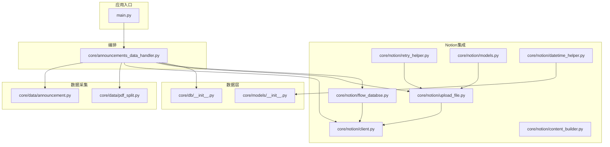
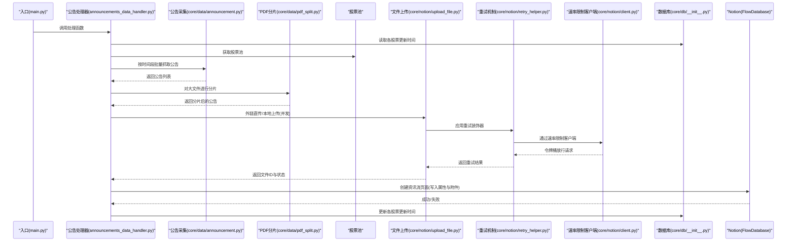
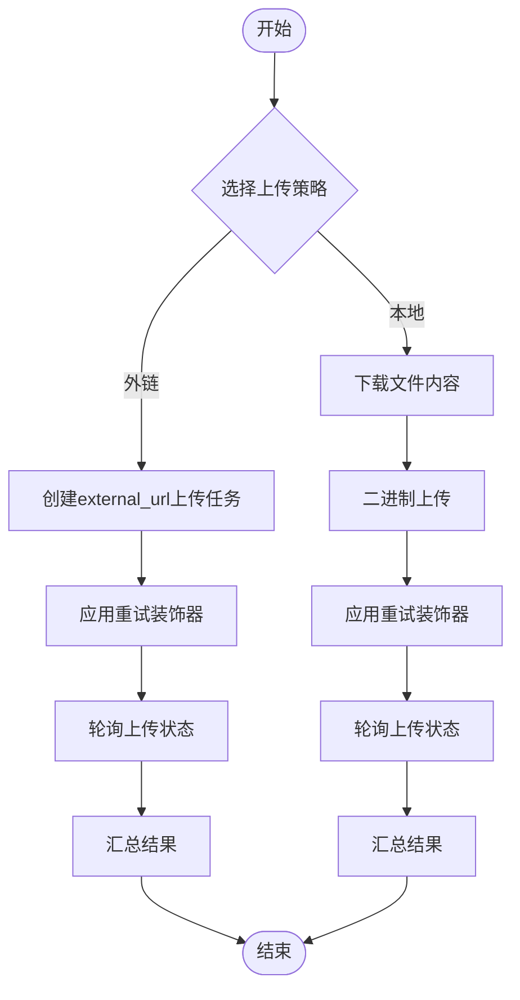
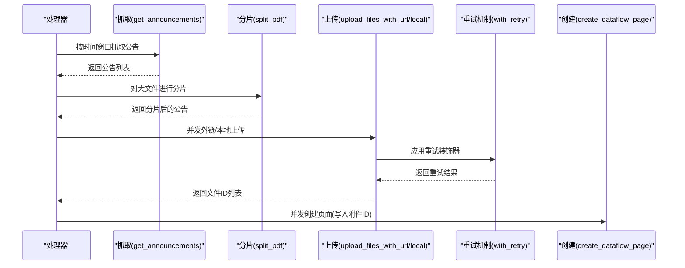
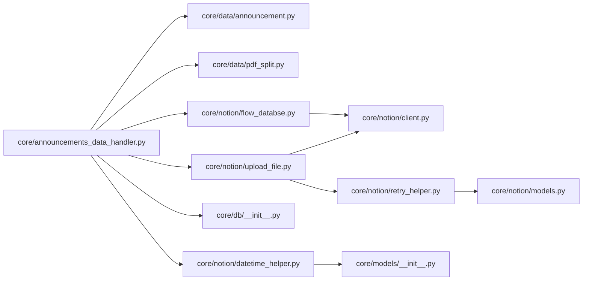

# Notion集成模块

<cite>
**本文引用的文件**
- [main.py](file://main.py)
- [core/db/__init__.py](file://core/db/__init__.py)
- [core/models/__init__.py](file://core/models/__init__.py)
- [core/data/announcement.py](file://core/data/announcement.py)
- [core/data/pdf_split.py](file://core/data/pdf_split.py)
- [core/notion/client.py](file://core/notion/client.py)
- [core/notion/upload_file.py](file://core/notion/upload_file.py)
- [core/notion/datetime_helper.py](file://core/notion/datetime_helper.py)
- [core/notion/content_builder.py](file://core/notion/content_builder.py)
- [core/notion/flow_databse.py](file://core/notion/flow_databse.py)
- [core/notion/retry_helper.py](file://core/notion/retry_helper.py)
- [core/notion/models.py](file://core/notion/models.py)
- [core/announcements_data_handler.py](file://core/announcements_data_handler.py)
</cite>

## 目录
1. [简介](#简介)
2. [项目结构](#项目结构)
3. [核心组件](#核心组件)
4. [架构总览](#架构总览)
5. [详细组件分析](#详细组件分析)
6. [依赖关系分析](#依赖关系分析)
7. [性能考量](#性能考量)
8. [故障排查指南](#故障排查指南)
9. [结论](#结论)
10. [附录](#附录)

## 简介
本文件面向Notion集成模块的技术文档，聚焦以下目标：
- Notion API客户端封装与调用路径
- 数据库操作接口与本地状态管理
- 文件上传策略（外链直传与本地上传）及分片机制
- 时间格式转换与统一时区处理
- 与公告数据处理模块的集成与数据同步流程
- **新增**：速率限制机制与指数退避重试机制
- **新增**：增强的客户端配置与错误处理
- 面向初学者的易读性说明与面向资深开发者的深度细节

## 项目结构
模块采用"功能域+层次化"组织方式，核心目录如下：
- core/db：SQLite异步封装、去重与更新时间记录
- core/models：类型别名（如NotionDate）
- core/data：公告抓取、PDF分片
- core/notebook：Notion客户端、文件上传、时间工具、页面构建、资讯流数据库操作
- core/announcements_data_handler.py：公告数据处理主流程
- main.py：入口程序，调度各模块

**图表来源**
- [main.py](file://main.py#L20-L39)
- [core/announcements_data_handler.py](file://core/announcements_data_handler.py#L21-L115)
- [core/data/announcement.py](file://core/data/announcement.py#L36-L112)
- [core/data/pdf_split.py](file://core/data/pdf_split.py#L15-L73)
- [core/notion/client.py](file://core/notion/client.py#L1-L60)
- [core/notion/upload_file.py](file://core/notion/upload_file.py#L1-L313)
- [core/notion/retry_helper.py](file://core/notion/retry_helper.py#L1-L91)
- [core/notion/models.py](file://core/notion/models.py#L1-L871)
- [core/notion/flow_databse.py](file://core/notion/flow_databse.py#L1-L113)
- [core/db/__init__.py](file://core/db/__init__.py#L62-L217)
- [core/models/__init__.py](file://core/models/__init__.py#L1-L8)

**章节来源**
- [main.py](file://main.py#L1-L40)
- [core/announcements_data_handler.py](file://core/announcements_data_handler.py#L1-L116)

## 核心组件
- **速率限制的Notion API客户端封装**：基于AsyncClient封装全局实例，内置AsyncRateLimitedTransport实现令牌桶算法，控制请求速率为每秒3个请求
- **增强的文件上传策略**：外链直传与本地上传两条路径，支持并发与轮询状态，新增重试机制和指数退避算法
- **PDF分片**：针对大文件按页数切分，避免单文件过大导致上传失败
- **时间处理**：统一时区与时序转换，保证与Notion日期字段一致
- **页面构建**：内容块构建器，支持标题、段落、表格、分隔线、Callout
- **资讯流数据库**：创建页面、写入属性与附件
- **数据库接口**：SQLite异步封装、去重与更新时间记录
- **通用重试机制**：with_retry装饰器实现指数退避重试，支持可配置的最大重试次数和异常类型

**章节来源**
- [core/notion/client.py](file://core/notion/client.py#L1-L60)
- [core/notion/upload_file.py](file://core/notion/upload_file.py#L1-L313)
- [core/notion/retry_helper.py](file://core/notion/retry_helper.py#L1-L91)
- [core/data/pdf_split.py](file://core/data/pdf_split.py#L15-L127)
- [core/notion/datetime_helper.py](file://core/notion/datetime_helper.py#L12-L38)
- [core/notion/content_builder.py](file://core/notion/content_builder.py#L1-L103)
- [core/notion/flow_databse.py](file://core/notion/flow_databse.py#L1-L113)
- [core/db/__init__.py](file://core/db/__init__.py#L62-L217)

## 架构总览
下图展示了从入口到数据落地的完整流程：获取股票池 → 抓取公告 → 分片/直传 → 创建资讯流页面。

**图表来源**
- [main.py](file://main.py#L20-L39)
- [core/announcements_data_handler.py](file://core/announcements_data_handler.py#L21-L115)
- [core/data/announcement.py](file://core/data/announcement.py#L36-L112)
- [core/data/pdf_split.py](file://core/data/pdf_split.py#L15-L73)
- [core/notion/upload_file.py](file://core/notion/upload_file.py#L1-L313)
- [core/notion/retry_helper.py](file://core/notion/retry_helper.py#L1-L91)
- [core/notion/client.py](file://core/notion/client.py#L1-L60)
- [core/db/__init__.py](file://core/db/__init__.py#L153-L217)
- [core/notion/flow_databse.py](file://core/notion/flow_databse.py#L1-L113)

## 详细组件分析

### 速率限制的Notion API客户端封装
- **作用**：提供全局异步客户端实例，内置速率限制功能，防止触发Notion API限制
- **关键特性**：
  - AsyncRateLimitedTransport实现令牌桶算法，控制请求速率为每秒3个请求
  - 基于AsyncLimiter实现，支持自定义最大速率和时间周期
  - 集成httpx.AsyncClient，配置超时时间为30秒，连接超时为10秒
  - 自动处理重定向和跟随重定向
- **使用位置**：文件上传、页面创建、数据源查询

**更新** 新增速率限制机制，确保符合Notion API的请求频率限制

**章节来源**
- [core/notion/client.py](file://core/notion/client.py#L1-L60)

### 增强的文件上传策略与服务端上传机制
- **两条上传路径**：
  - 外链直传：通过Notion文件上传接口的external_url模式，由Notion侧拉取文件
  - 本地上传：先下载文件内容，再调用Notion文件上传接口进行二进制上传
- **并发与聚合**：对外提供upload_files_with_url与upload_files_with_local，内部使用asyncio.gather并发执行
- **轮询状态**：上传后通过轮询查询上传状态，指数退避等待，最多16秒
- **重试机制**：使用with_retry装饰器实现指数退避重试，支持可配置的最大重试次数
- **结果结构**：返回包含文件ID、成功标志与错误信息的结构化结果

**更新** 新增重试机制和指数退避算法，提升上传可靠性

**图表来源**
- [core/notion/upload_file.py](file://core/notion/upload_file.py#L1-L313)
- [core/notion/retry_helper.py](file://core/notion/retry_helper.py#L1-L91)

**章节来源**
- [core/notion/upload_file.py](file://core/notion/upload_file.py#L1-L313)

### PDF分片与文件ID管理
- **分片策略**：当公告文件大小超过阈值且标题命中关键词时，进行分片；否则直接使用原文件
- **分片算法**：按固定块大小与重叠页数切分，生成带页码范围的新标题
- **文件ID管理**：上传完成后返回包含file_id的结果，后续用于页面属性中的附件字段

**章节来源**
- [core/data/pdf_split.py](file://core/data/pdf_split.py#L15-L127)
- [core/announcements_data_handler.py](file://core/announcements_data_handler.py#L66-L93)

### 时间处理工具与统一时区
- **统一时区**：默认东八区，确保与Notion日期字段一致
- **转换函数**：
  - Python datetime/date → NotionDate（带毫秒精度的ISO字符串）
  - NotionDate → Python datetime
- **应用**：资讯流页面创建时，发布时间统一转换为NotionDate

**章节来源**
- [core/notion/datetime_helper.py](file://core/notion/datetime_helper.py#L12-L38)
- [core/models/__init__.py](file://core/models/__init__.py#L1-L8)
- [core/notion/flow_databse.py](file://core/notion/flow_databse.py#L48-L54)

### 页面内容构建器
- **支持**：标题、段落、表格、分隔线、Callout
- **用途**：将结构化数据渲染为Notion页面的blocks数组
- **注意**：表格构建依赖pandas，需在环境中安装

**章节来源**
- [core/notion/content_builder.py](file://core/notion/content_builder.py#L1-L103)

### 资讯流数据库操作
- **功能**：在指定数据源（数据库）中创建页面，写入标题、发布时间、来源接口、数据类型、关联股票、附件与正文内容
- **关键点**：数据类型映射、附件字段使用file_upload.id、日期字段使用转换后的NotionDate

**章节来源**
- [core/notion/flow_databse.py](file://core/notion/flow_databse.py#L1-L113)

### 数据库接口与更新时间记录
- **初始化**：创建update_records与hash两张表
- **去重**：计算内容哈希，查询并过滤重复数据
- **更新时间**：按股票与键读取/更新最近更新时间，用于增量抓取

**章节来源**
- [core/db/__init__.py](file://core/db/__init__.py#L62-L217)

### 公告数据处理主流程
- **增量策略**：根据各股票上次更新时间分组抓取，减少请求次数
- **上传策略选择**：
  - 小文件或非分片关键词：外链直传
  - 大文件且命中分片关键词：本地分片上传
- **页面创建**：并发创建资讯流页面，写入附件ID与来源信息

**图表来源**
- [core/announcements_data_handler.py](file://core/announcements_data_handler.py#L21-L115)
- [core/data/announcement.py](file://core/data/announcement.py#L36-L112)
- [core/data/pdf_split.py](file://core/data/pdf_split.py#L15-L73)
- [core/notion/upload_file.py](file://core/notion/upload_file.py#L1-L313)
- [core/notion/retry_helper.py](file://core/notion/retry_helper.py#L1-L91)
- [core/notion/flow_databse.py](file://core/notion/flow_databse.py#L1-L113)

**章节来源**
- [core/announcements_data_handler.py](file://core/announcements_data_handler.py#L21-L115)

### 通用重试机制
- **装饰器功能**：为异步函数添加指数退避重试逻辑
- **配置参数**：
  - max_retries：最大重试次数，默认3次
  - retryable_exceptions：可重试的异常类型，默认包含常见的httpx网络异常
- **重试策略**：指数退避算法，延迟分别为1s、2s、4s、8s...
- **适用场景**：Notion API调用、网络请求、文件上传等临时性故障

**新增** 重试机制显著提升了系统的稳定性和可靠性

**章节来源**
- [core/notion/retry_helper.py](file://core/notion/retry_helper.py#L1-L91)

### Notion API模型定义
- **覆盖端点**：pages.create、data_sources.query、file_uploads.create、file_uploads.send、file_uploads.retrieve
- **类型安全**：使用Pydantic模型确保与Notion API的类型兼容性
- **响应建模**：精确建模各种API响应，包括文件上传状态、页面属性等

**新增** 完善的API模型定义为系统提供了更强的类型安全保障

**章节来源**
- [core/notion/models.py](file://core/notion/models.py#L1-L871)

## 依赖关系分析
- **模块内聚与耦合**：
  - 公告处理器依赖数据采集、PDF分片、股票池、文件上传、数据库与Notion操作
  - 文件上传与资讯流页面均依赖Notion客户端和重试机制
  - 时间工具与模型类型被多处共享
- **外部依赖**：
  - 异步HTTP：httpx（新增速率限制支持）
  - PDF处理：PyMuPDF
  - 异步SQLite：aiosqlite
  - 哈希：xxhash
  - Notion SDK：notion-client
  - 速率限制：aiolimiter

**图表来源**
- [core/announcements_data_handler.py](file://core/announcements_data_handler.py#L1-L116)
- [core/data/announcement.py](file://core/data/announcement.py#L1-L180)
- [core/data/pdf_split.py](file://core/data/pdf_split.py#L1-L164)
- [core/notion/upload_file.py](file://core/notion/upload_file.py#L1-L313)
- [core/notion/flow_databse.py](file://core/notion/flow_databse.py#L1-L113)
- [core/notion/client.py](file://core/notion/client.py#L1-L60)
- [core/notion/retry_helper.py](file://core/notion/retry_helper.py#L1-L91)
- [core/notion/models.py](file://core/notion/models.py#L1-L871)
- [core/db/__init__.py](file://core/db/__init__.py#L1-L218)
- [core/notion/datetime_helper.py](file://core/notion/datetime_helper.py#L1-L39)
- [core/models/__init__.py](file://core/models/__init__.py#L1-L8)

## 性能考量
- **并发优化**：
  - 抓取阶段：对同一时间段内的多股票并行请求
  - 上传阶段：外链与本地上传分别并发执行
  - 页面创建：并发创建资讯流页面
- **I/O优化**：
  - PDF分片在内存中进行，避免磁盘IO
  - 上传轮询采用指数退避，降低无效请求
  - 速率限制确保稳定的请求频率
- **存储优化**：
  - 哈希去重减少重复上传
  - 增量更新时间记录，缩小抓取窗口
- **重试优化**：指数退避算法避免雪崩效应，合理分配重试负载

**更新** 新增速率限制和重试机制显著提升了系统的稳定性和性能

## 故障排查指南
- **环境变量缺失**：
  - NOTION_TOKEN：导致Notion客户端无法初始化
  - STOCK_POOL/数据库环境变量：影响股票池与数据库路径
- **网络与权限**：
  - 公告接口限流或返回异常：检查CNINFO接口可用性
  - PDF下载失败：确认URL可达与防盗链策略
  - **新增**：速率限制触发：检查请求频率是否超过每秒3个请求
- **上传失败**：
  - 外链直传失败：检查URL有效性与跨域
  - 本地上传失败：查看轮询超时与错误信息
  - **新增**：重试失败：检查网络连接和Notion API状态
- **数据库问题**：
  - 初始化失败：确认数据库目录可写
  - 哈希冲突：确认内容序列化一致性
- **重试机制问题**：
  - **新增**：重试装饰器配置：检查max_retries和retryable_exceptions设置

**更新** 新增速率限制和重试机制相关的故障排查指导

**章节来源**
- [core/notion/client.py](file://core/notion/client.py#L1-L60)
- [core/notion/upload_file.py](file://core/notion/upload_file.py#L153-L176)
- [core/notion/retry_helper.py](file://core/notion/retry_helper.py#L1-L91)
- [core/db/__init__.py](file://core/db/__init__.py#L62-L94)

## 结论
本模块通过清晰的职责划分与并发设计，实现了从公告抓取、PDF分片、文件上传到资讯流页面创建的完整闭环。**新增的速率限制机制**确保了与Notion API的稳定交互，**增强的重试机制**显著提升了系统的可靠性。统一的时间处理与去重机制提升了稳定性与效率。建议在生产环境中结合监控与告警，进一步完善重试与熔断策略。

## 附录

### API限制与重试机制
- **速率限制**：AsyncRateLimitedTransport实现令牌桶算法，控制请求速率为每秒3个请求
- **上传轮询**：最多尝试5次，指数退避等待（1, 2, 4, 8, 16秒），超时返回失败
- **并发控制**：合理设置并发度，避免触发Notion速率限制
- **错误分类**：区分网络错误、Notion返回错误与解析错误，分别处理
- **重试装饰器**：with_retry装饰器实现指数退避重试，支持可配置参数

**更新** 新增速率限制和增强的重试机制

**章节来源**
- [core/notion/client.py](file://core/notion/client.py#L17-L60)
- [core/notion/upload_file.py](file://core/notion/upload_file.py#L257-L313)
- [core/notion/retry_helper.py](file://core/notion/retry_helper.py#L32-L91)

### 上传策略选择逻辑
- **小于阈值或不命中分片关键词**：外链直传
- **大于阈值且命中分片关键词**：本地分片上传
- **分片规则**：固定块大小与重叠页数，生成带页码范围的标题

**章节来源**
- [core/announcements_data_handler.py](file://core/announcements_data_handler.py#L66-L93)
- [core/data/pdf_split.py](file://core/data/pdf_split.py#L15-L73)

### 数据同步流程要点
- **增量抓取**：按股票维度记录更新时间，仅抓取新增公告
- **去重**：对内容计算哈希，避免重复上传与页面创建
- **并发落地**：上传与页面创建并行，提升吞吐
- **重试策略**：失败的上传任务自动重试，确保数据完整性

**更新** 新增重试策略提升数据同步的可靠性

**章节来源**
- [core/db/__init__.py](file://core/db/__init__.py#L97-L151)
- [core/announcements_data_handler.py](file://core/announcements_data_handler.py#L27-L63)

### 速率限制实现详解
- **令牌桶算法**：AsyncLimiter实现，每秒最多3个请求
- **配置参数**：max_rate=3，time_period=1.0
- **日志记录**：详细的请求放行和阻塞日志
- **关闭处理**：正确关闭底层传输层连接

**新增** 速率限制机制的详细实现说明

**章节来源**
- [core/notion/client.py](file://core/notion/client.py#L17-L60)