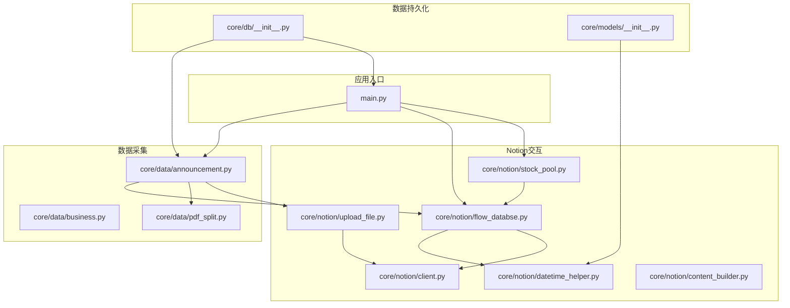
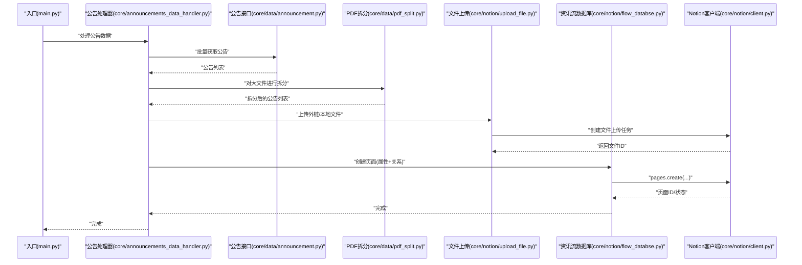
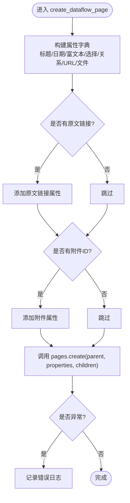
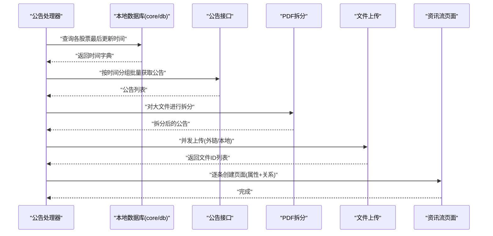
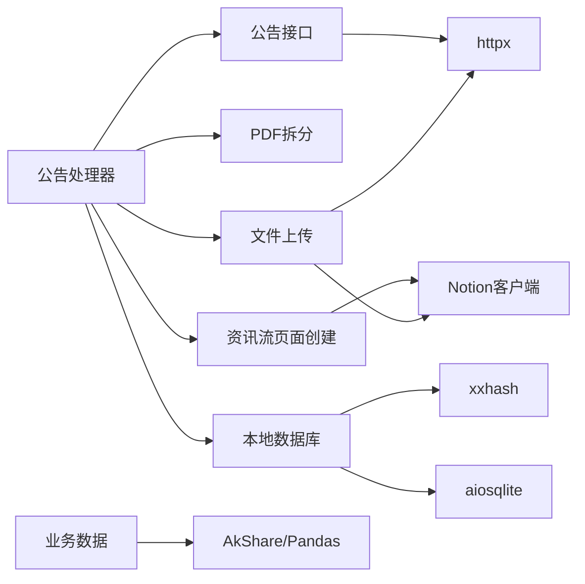

# 数据库操作

<cite>
**本文引用的文件**
- [main.py](file://main.py)
- [core/db/__init__.py](file://core/db/__init__.py)
- [core/models/__init__.py](file://core/models/__init__.py)
- [core/notion/client.py](file://core/notion/client.py)
- [core/notion/datetime_helper.py](file://core/notion/datetime_helper.py)
- [core/notion/content_builder.py](file://core/notion/content_builder.py)
- [core/notion/upload_file.py](file://core/notion/upload_file.py)
- [core/notion/stock_pool.py](file://core/notion/stock_pool.py)
- [core/notion/flow_databse.py](file://core/notion/flow_databse.py)
- [core/announcements_data_handler.py](file://core/announcements_data_handler.py)
- [core/data/announcement.py](file://core/data/announcement.py)
- [core/data/business.py](file://core/data/business.py)
- [core/data/pdf_split.py](file://core/data/pdf_split.py)
</cite>

## 目录
1. [简介](#简介)
2. [项目结构](#项目结构)
3. [核心组件](#核心组件)
4. [架构总览](#架构总览)
5. [详细组件分析](#详细组件分析)
6. [依赖分析](#依赖分析)
7. [性能考量](#性能考量)
8. [故障排查指南](#故障排查指南)
9. [结论](#结论)
10. [附录](#附录)

## 简介
本文件面向Notion数据库操作，聚焦“资讯流数据库”的页面创建、查询与更新机制，系统性阐述数据库结构设计、属性配置与数据类型映射，给出从数据采集、文件上传、页面创建到关系字段建立的完整流程。文档同时覆盖ID管理、页面链接建立、权限与访问控制建议、性能优化策略，以及与公告数据处理模块的集成与数据同步流程。内容兼顾初学者易懂与资深开发者所需的技术深度。

## 项目结构
该项目采用按功能域划分的模块化组织方式，核心围绕以下子系统展开：
- 数据采集层：从外部接口抓取公告与业务数据
- Notion交互层：封装Notion客户端、文件上传、页面内容构建、时间转换与股票池查询
- 数据持久化层：本地SQLite用于去重与增量更新时间记录
- 应用入口：统一调度各模块完成数据同步

图表来源
- [main.py](file://main.py#L20-L36)
- [core/data/announcement.py](file://core/data/announcement.py#L36-L112)
- [core/data/pdf_split.py](file://core/data/pdf_split.py#L15-L73)
- [core/notion/flow_databse.py](file://core/notion/flow_databse.py#L25-L67)
- [core/notion/upload_file.py](file://core/notion/upload_file.py#L28-L61)
- [core/notion/stock_pool.py](file://core/notion/stock_pool.py#L23-L51)
- [core/db/__init__.py](file://core/db/__init__.py#L62-L94)
- [core/models/__init__.py](file://core/models/__init__.py#L1-L8)

章节来源
- [main.py](file://main.py#L1-L40)
- [core/db/__init__.py](file://core/db/__init__.py#L1-L218)
- [core/models/__init__.py](file://core/models/__init__.py#L1-L8)
- [core/notion/client.py](file://core/notion/client.py#L1-L6)
- [core/notion/datetime_helper.py](file://core/notion/datetime_helper.py#L1-L39)
- [core/notion/content_builder.py](file://core/notion/content_builder.py#L1-L103)
- [core/notion/upload_file.py](file://core/notion/upload_file.py#L1-L180)
- [core/notion/stock_pool.py](file://core/notion/stock_pool.py#L1-L52)
- [core/notion/flow_databse.py](file://core/notion/flow_databse.py#L1-L67)
- [core/announcements_data_handler.py](file://core/announcements_data_handler.py#L1-L116)
- [core/data/announcement.py](file://core/data/announcement.py#L1-L141)
- [core/data/business.py](file://core/data/business.py#L1-L96)
- [core/data/pdf_split.py](file://core/data/pdf_split.py#L1-L128)

## 核心组件
- Notion客户端与环境配置：通过异步客户端封装，读取环境变量获取访问令牌
- 时间转换工具：统一将Python日期/时间转换为Notion期望的字符串格式
- 页面内容构建器：将结构化数据转为Notion页面块（标题、段落、表格、分隔线、标注）
- 文件上传模块：支持外链直传与本地分片上传，具备轮询与重试机制
- 股池查询：从Notion数据源查询股票池，获取股票ID与代码
- 资讯流数据库操作：创建页面、写入属性、建立关系字段
- 数据持久化：SQLite维护更新时间与哈希去重
- 公告数据处理器：聚合公告、分页拆分、上传、创建页面

章节来源
- [core/notion/client.py](file://core/notion/client.py#L1-L6)
- [core/notion/datetime_helper.py](file://core/notion/datetime_helper.py#L12-L38)
- [core/notion/content_builder.py](file://core/notion/content_builder.py#L1-L103)
- [core/notion/upload_file.py](file://core/notion/upload_file.py#L1-L180)
- [core/notion/stock_pool.py](file://core/notion/stock_pool.py#L23-L51)
- [core/notion/flow_databse.py](file://core/notion/flow_databse.py#L25-L67)
- [core/db/__init__.py](file://core/db/__init__.py#L62-L217)
- [core/announcements_data_handler.py](file://core/announcements_data_handler.py#L21-L116)

## 架构总览
下图展示了从入口到数据库页面创建的端到端流程，包括数据采集、文件处理、上传与页面创建的关键步骤。

图表来源
- [main.py](file://main.py#L20-L36)
- [core/announcements_data_handler.py](file://core/announcements_data_handler.py#L21-L116)
- [core/data/announcement.py](file://core/data/announcement.py#L36-L112)
- [core/data/pdf_split.py](file://core/data/pdf_split.py#L15-L73)
- [core/notion/upload_file.py](file://core/notion/upload_file.py#L28-L61)
- [core/notion/flow_databse.py](file://core/notion/flow_databse.py#L25-L67)
- [core/notion/client.py](file://core/notion/client.py#L1-L6)

## 详细组件分析

### 资讯流数据库页面创建
- 目标：在“资讯流数据库”中创建页面，写入标题、发布时间、来源接口、数据类型、关联股票、原文链接、附件等属性，并可选地附加页面内容块
- 关键点：
  - 属性映射：标题、日期、富文本、选择、关系、URL、文件
  - 关系字段：通过股票页面ID建立“关联股票”关系
  - 内容块：可通过内容构建器生成，或直接传入空内容
  - 错误处理：捕获异常并记录日志

图表来源
- [core/notion/flow_databse.py](file://core/notion/flow_databse.py#L25-L67)

章节来源
- [core/notion/flow_databse.py](file://core/notion/flow_databse.py#L25-L67)

### 公告数据处理与同步
- 流程概览：根据股票池与上次更新时间，分批拉取公告，区分小文件与需拆分的大文件，分别走外链直传或本地上传，最终批量创建资讯流页面
- 关键点：
  - 分组策略：按最后更新时间聚合，减少重复请求
  - 文件拆分：超过阈值的PDF按固定页数切分，避免单文件过大
  - 并发上传：外链与本地上传分别并发执行，提升吞吐
  - 页面创建：逐条创建页面，传递关系字段与附件ID

图表来源
- [core/announcements_data_handler.py](file://core/announcements_data_handler.py#L21-L116)
- [core/db/__init__.py](file://core/db/__init__.py#L153-L185)
- [core/data/announcement.py](file://core/data/announcement.py#L36-L112)
- [core/data/pdf_split.py](file://core/data/pdf_split.py#L15-L73)
- [core/notion/upload_file.py](file://core/notion/upload_file.py#L28-L61)
- [core/notion/flow_databse.py](file://core/notion/flow_databse.py#L25-L67)

章节来源
- [core/announcements_data_handler.py](file://core/announcements_data_handler.py#L21-L116)
- [core/data/announcement.py](file://core/data/announcement.py#L36-L112)
- [core/data/pdf_split.py](file://core/data/pdf_split.py#L15-L73)
- [core/notion/upload_file.py](file://core/notion/upload_file.py#L28-L61)
- [core/notion/flow_databse.py](file://core/notion/flow_databse.py#L25-L67)

### Notion客户端与环境配置
- 通过异步客户端封装，读取环境变量中的访问令牌，供页面创建、文件上传等操作使用
- 建议：将令牌与数据库ID等敏感信息置于环境变量，避免硬编码

章节来源
- [core/notion/client.py](file://core/notion/client.py#L1-L6)

### 时间转换与数据类型映射
- 时间转换：将Python的date/datetime统一转换为Notion期望的字符串格式（带时区毫秒级精度）
- 数据类型映射：页面属性与Notion字段类型一一对应（标题、日期、富文本、选择、关系、URL、文件）

章节来源
- [core/notion/datetime_helper.py](file://core/notion/datetime_helper.py#L12-L38)
- [core/notion/flow_databse.py](file://core/notion/flow_databse.py#L48-L58)

### 页面内容构建器
- 支持添加标题、段落、表格、分隔线、标注等块类型
- 表格构建：从DataFrame生成表格块，自动处理列头与缺失值

章节来源
- [core/notion/content_builder.py](file://core/notion/content_builder.py#L1-L103)

### 文件上传与轮询
- 支持外链直传与本地上传两种模式
- 轮询策略：指数退避等待上传完成，超时或失败时记录错误
- 分片上传：对大文件进行分片，生成带页码范围的新标题

章节来源
- [core/notion/upload_file.py](file://core/notion/upload_file.py#L28-L61)
- [core/notion/upload_file.py](file://core/notion/upload_file.py#L153-L176)

### 股票池查询与关系字段
- 从Notion数据源查询股票池，提取股票ID与代码，用于建立“关联股票”关系字段
- 关系字段：通过页面ID建立双向关联，便于后续查询与筛选

章节来源
- [core/notion/stock_pool.py](file://core/notion/stock_pool.py#L23-L51)
- [core/notion/flow_databse.py](file://core/notion/flow_databse.py#L53-L53)

### 数据库结构设计与ID管理
- 本地SQLite表结构：
  - update_records：记录股票代码、键值与更新时间，主键为(股票, 键)
  - hash：记录哈希值与创建时间，主键为hash
- ID管理：
  - 股票ID：来源于Notion数据源
  - 页面ID：由Notion创建后返回
  - 文件ID：由Notion文件上传接口返回
- 增量更新：通过查询update_records决定起止时间，减少重复抓取

章节来源
- [core/db/__init__.py](file://core/db/__init__.py#L77-L93)
- [core/db/__init__.py](file://core/db/__init__.py#L153-L185)
- [core/db/__init__.py](file://core/db/__init__.py#L205-L214)

### 权限设置与访问控制
- 访问令牌：通过环境变量注入，确保最小权限原则
- 数据库ID：通过环境变量注入，避免泄露
- 建议：
  - 限制令牌权限范围（仅允许pages、databases、files相关操作）
  - 使用只读/只写分离的令牌策略
  - 对数据库与页面设置合适的共享权限

章节来源
- [core/notion/client.py](file://core/notion/client.py#L1-L6)
- [core/notion/flow_databse.py](file://core/notion/flow_databse.py#L22-L22)

## 依赖分析
- 组件耦合：
  - 公告处理器依赖数据接口、PDF拆分、文件上传与资讯流页面创建
  - 资讯流页面创建依赖Notion客户端与时间转换工具
  - 文件上传依赖Notion文件上传接口与轮询机制
  - 数据持久化为增量更新与去重提供支撑
- 外部依赖：
  - Notion SDK（异步客户端）
  - httpx（HTTP客户端）
  - aiosqlite（异步SQLite）
  - xxhash（哈希计算）
  - AkShare/Pandas（业务数据获取与处理）

图表来源
- [core/announcements_data_handler.py](file://core/announcements_data_handler.py#L21-L116)
- [core/data/announcement.py](file://core/data/announcement.py#L36-L112)
- [core/data/pdf_split.py](file://core/data/pdf_split.py#L15-L73)
- [core/notion/upload_file.py](file://core/notion/upload_file.py#L28-L61)
- [core/notion/flow_databse.py](file://core/notion/flow_databse.py#L25-L67)
- [core/db/__init__.py](file://core/db/__init__.py#L1-L218)

章节来源
- [core/announcements_data_handler.py](file://core/announcements_data_handler.py#L1-L116)
- [core/data/announcement.py](file://core/data/announcement.py#L1-L141)
- [core/data/pdf_split.py](file://core/data/pdf_split.py#L1-L128)
- [core/notion/upload_file.py](file://core/notion/upload_file.py#L1-L180)
- [core/notion/flow_databse.py](file://core/notion/flow_databse.py#L1-L67)
- [core/db/__init__.py](file://core/db/__init__.py#L1-L218)

## 性能考量
- 并发与批处理：
  - 公告接口按时间分组批量请求，减少重复调用
  - 文件上传外链与本地上传并发执行
  - 页面创建使用并发gather，提升吞吐
- 去重与增量：
  - 通过哈希去重避免重复上传与创建
  - 依据update_records记录增量更新时间
- I/O优化：
  - PDF拆分采用内存缓冲，避免磁盘IO
  - 轮询采用指数退避，平衡成功率与等待时间
- 存储与索引：
  - update_records与hash表为主键查询，适合高频读取
  - 建议在高并发场景下启用连接池与事务批处理

章节来源
- [core/announcements_data_handler.py](file://core/announcements_data_handler.py#L40-L62)
- [core/notion/upload_file.py](file://core/notion/upload_file.py#L153-L176)
- [core/db/__init__.py](file://core/db/__init__.py#L97-L128)
- [core/db/__init__.py](file://core/db/__init__.py#L153-L185)

## 故障排查指南
- 页面创建失败：
  - 检查数据库ID与令牌是否正确配置
  - 查看日志输出，确认属性映射与关系字段是否有效
- 文件上传失败：
  - 观察轮询日志，确认上传状态与错误信息
  - 检查外链有效性与本地文件可达性
- 增量更新异常：
  - 核对update_records表记录是否存在
  - 确认时间转换是否符合预期格式
- 性能问题：
  - 提升并发度与批处理规模
  - 优化网络与I/O路径，减少阻塞

章节来源
- [core/notion/flow_databse.py](file://core/notion/flow_databse.py#L65-L67)
- [core/notion/upload_file.py](file://core/notion/upload_file.py#L153-L176)
- [core/db/__init__.py](file://core/db/__init__.py#L205-L214)

## 结论
本方案以模块化方式实现了从数据采集、文件处理、上传到页面创建的全链路自动化，结合本地SQLite实现高效增量与去重。通过明确的属性映射、关系字段与权限控制策略，既满足初学者快速上手，也为复杂场景下的性能优化与扩展提供了坚实基础。

## 附录
- 环境变量建议：
  - NOTION_TOKEN：Notion访问令牌
  - FLOW_DATABASE：资讯流数据库ID
  - STOCK_POOL：股票池数据源ID
- 数据模型参考：
  - 股票池：包含股票ID与代码
  - 公告：包含ID、股票、标题、大小、链接、发布时间
  - 文件上传：包含URL与标题，返回文件ID与状态

章节来源
- [core/notion/client.py](file://core/notion/client.py#L1-L6)
- [core/notion/flow_databse.py](file://core/notion/flow_databse.py#L22-L22)
- [core/notion/stock_pool.py](file://core/notion/stock_pool.py#L23-L51)
- [core/data/announcement.py](file://core/data/announcement.py#L12-L33)
- [core/notion/upload_file.py](file://core/notion/upload_file.py#L17-L26)