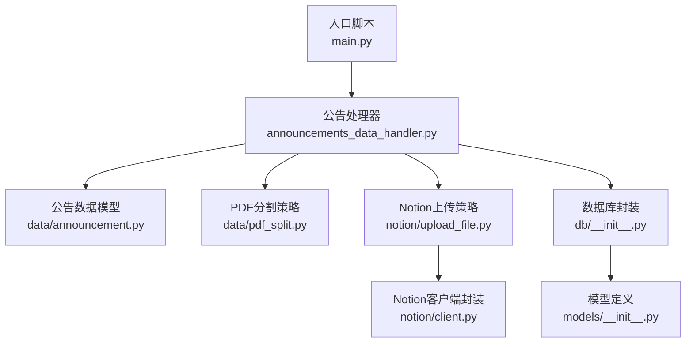
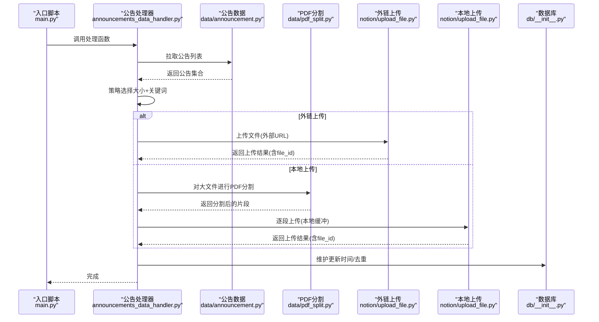
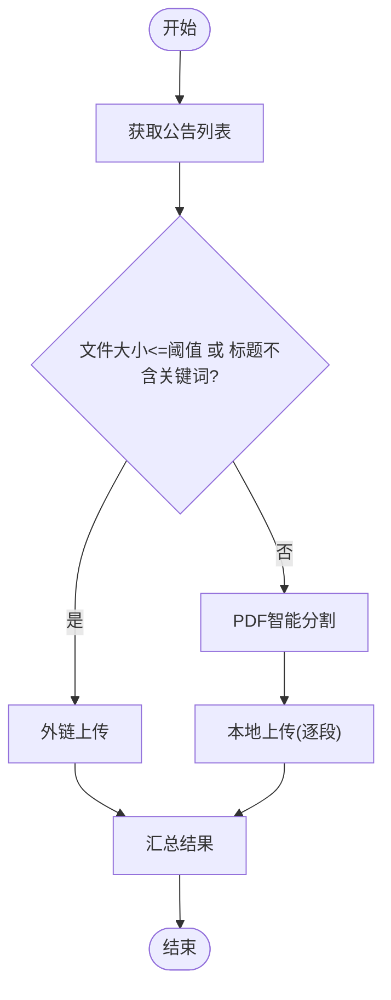
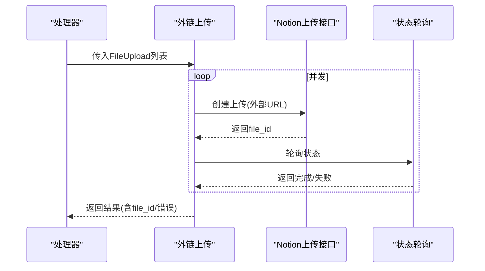
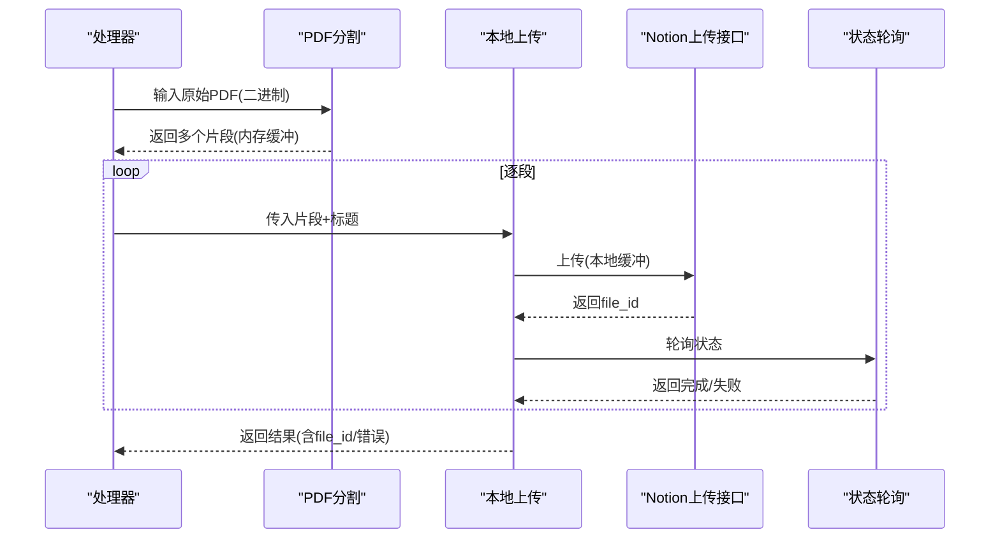
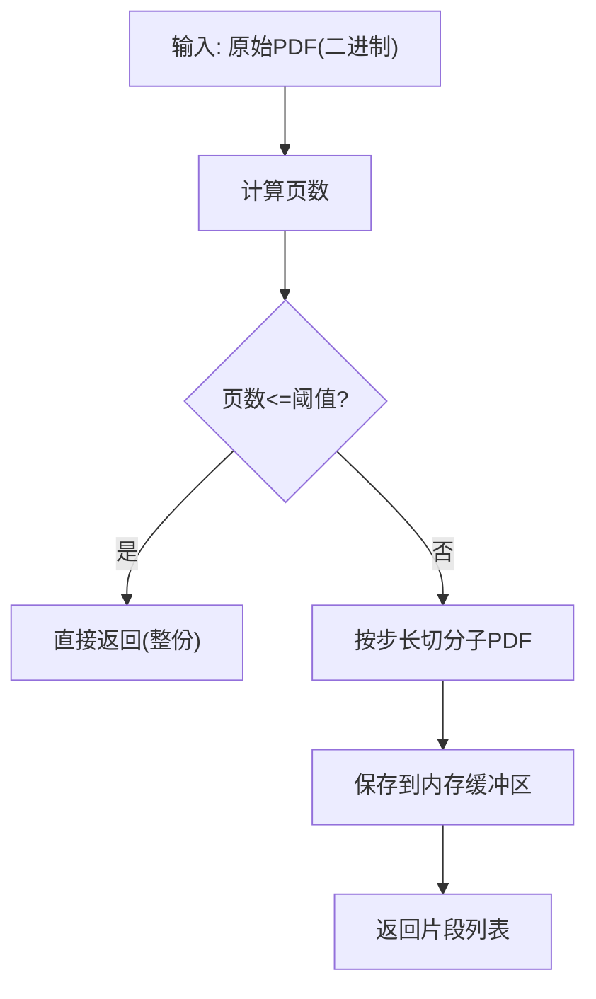
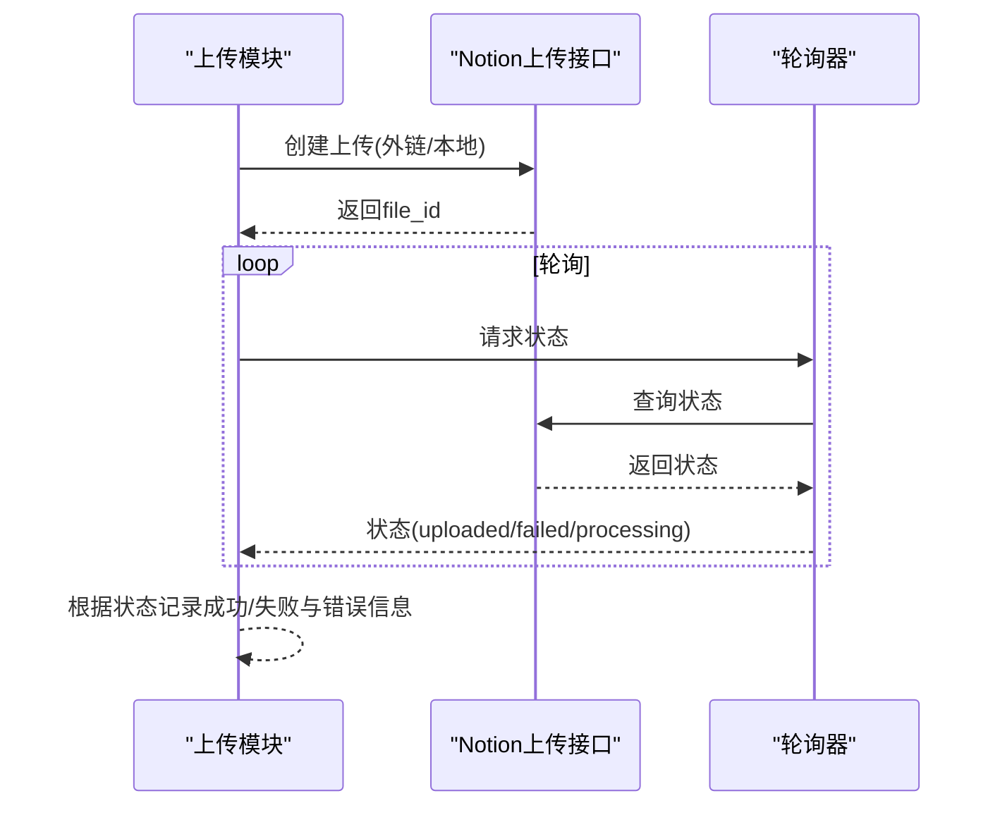
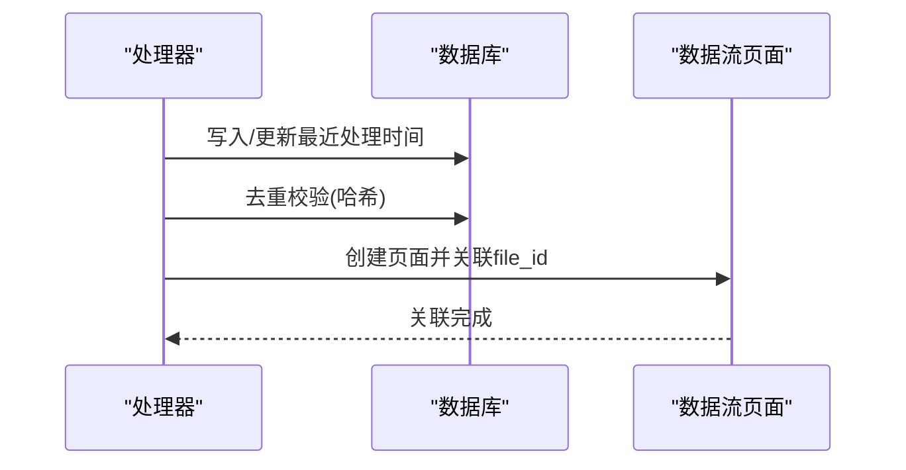
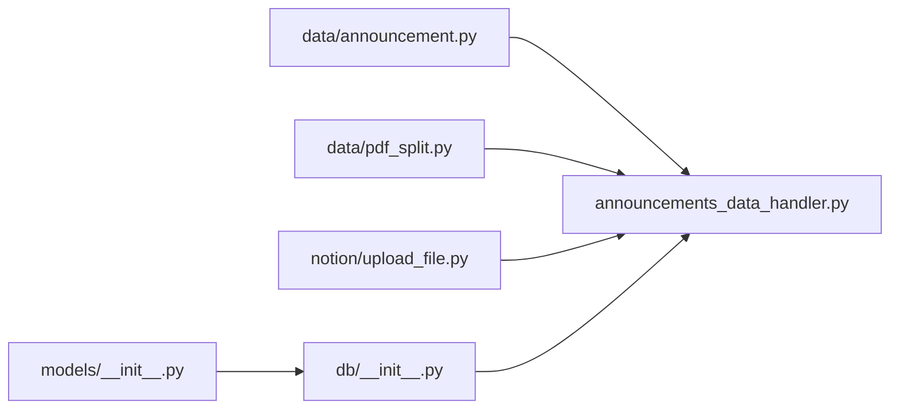

# 文件上传策略

<cite>
**本文引用的文件**
- [main.py](file://main.py)
- [core/announcements_data_handler.py](file://core/announcements_data_handler.py)
- [core/data/announcement.py](file://core/data/announcement.py)
- [core/data/pdf_split.py](file://core/data/pdf_split.py)
- [core/notion/upload_file.py](file://core/notion/upload_file.py)
- [core/db/__init__.py](file://core/db/__init__.py)
- [core/models/__init__.py](file://core/models/__init__.py)
</cite>

## 目录
1. [简介](#简介)
2. [项目结构](#项目结构)
3. [核心组件](#核心组件)
4. [架构总览](#架构总览)
5. [组件详解](#组件详解)
6. [依赖关系分析](#依赖关系分析)
7. [性能考量](#性能考量)
8. [故障排查指南](#故障排查指南)
9. [结论](#结论)
10. [附录](#附录)

## 简介
本文件上传策略面向“公告”类PDF文件的采集与入库流程，围绕两大上传策略展开：
- 外链上传（External URL Upload）：直接让目标系统（Notion）从源URL抓取并导入PDF，适合小体积或非敏感文件。
- 本地上传（Local Buffer Upload）：先下载到内存，再上传到目标系统，适合大体积或需预处理的文件。

系统还包含PDF智能分割策略，依据页数与关键词决定是否拆分；并提供上传状态轮询、错误处理与重试机制；最终将文件与数据库记录及Notion页面建立关联，形成完整的数据流闭环。

## 项目结构
- 入口脚本负责初始化数据库与股票池，调度公告数据处理流程。
- 数据层负责从第三方接口拉取公告列表，并对PDF进行智能分割。
- Notion层负责两类上传策略与状态轮询。
- 数据库层负责去重与更新时间记录，支撑增量处理。

图表来源
- [main.py](file://main.py#L20-L39)
- [core/announcements_data_handler.py](file://core/announcements_data_handler.py#L21-L115)
- [core/data/announcement.py](file://core/data/announcement.py#L36-L112)
- [core/data/pdf_split.py](file://core/data/pdf_split.py#L15-L73)
- [core/notion/upload_file.py](file://core/notion/upload_file.py#L28-L61)
- [core/db/__init__.py](file://core/db/__init__.py#L62-L94)
- [core/models/__init__.py](file://core/models/__init__.py#L1-L8)

章节来源
- [main.py](file://main.py#L20-L39)
- [core/announcements_data_handler.py](file://core/announcements_data_handler.py#L21-L115)

## 核心组件
- 外链上传：通过创建“外部URL模式”的上传任务，随后轮询状态直至完成或失败。
- 本地上传：下载文件到内存，构造子PDF片段并逐段上传，轮询状态。
- PDF智能分割：基于页数阈值与关键词集合，将大文件拆分为若干片段，避免单次上传过大。
- 策略选择逻辑：根据文件大小与标题关键词决定走外链还是本地上传路径。
- 状态轮询与重试：指数退避等待，超时统一归因失败。
- 数据库集成：维护更新时间与去重哈希，支撑增量与幂等。

章节来源
- [core/notion/upload_file.py](file://core/notion/upload_file.py#L28-L61)
- [core/data/pdf_split.py](file://core/data/pdf_split.py#L15-L73)
- [core/announcements_data_handler.py](file://core/announcements_data_handler.py#L66-L93)
- [core/db/__init__.py](file://core/db/__init__.py#L62-L94)

## 架构总览
下图展示了从入口到数据入库的关键调用链路与职责划分：

图表来源
- [main.py](file://main.py#L31-L35)
- [core/announcements_data_handler.py](file://core/announcements_data_handler.py#L66-L93)
- [core/data/announcement.py](file://core/data/announcement.py#L36-L112)
- [core/data/pdf_split.py](file://core/data/pdf_split.py#L15-L73)
- [core/notion/upload_file.py](file://core/notion/upload_file.py#L28-L61)
- [core/db/__init__.py](file://core/db/__init__.py#L153-L215)

## 组件详解

### 策略选择与控制流
- 选择规则：
  - 若文件大小小于等于阈值，或标题不包含特定关键词，则采用外链上传。
  - 若文件大小超过阈值且标题包含关键词，则先进行PDF分割，再走本地上传。
- 并发执行：外链与本地两条路径并发执行，最后汇总结果并创建数据流页面。

图表来源
- [core/announcements_data_handler.py](file://core/announcements_data_handler.py#L66-L93)

章节来源
- [core/announcements_data_handler.py](file://core/announcements_data_handler.py#L66-L93)

### 外链上传（External URL）
- 流程要点：
  - 创建上传任务时指定“外部URL模式”，由目标系统直接抓取。
  - 上传后轮询状态，直到完成或失败。
  - 成功时记录file_id，失败时记录错误信息。
- 并发性：对一批文件并行创建任务，统一等待完成。

图表来源
- [core/notion/upload_file.py](file://core/notion/upload_file.py#L40-L61)
- [core/notion/upload_file.py](file://core/notion/upload_file.py#L124-L150)
- [core/notion/upload_file.py](file://core/notion/upload_file.py#L153-L176)

章节来源
- [core/notion/upload_file.py](file://core/notion/upload_file.py#L40-L61)
- [core/notion/upload_file.py](file://core/notion/upload_file.py#L124-L150)
- [core/notion/upload_file.py](file://core/notion/upload_file.py#L153-L176)

### 本地上传（Local Buffer）
- 流程要点：
  - 先下载文件到内存，再进行PDF智能分割。
  - 逐段构造子PDF并上传，命名包含页码范围，便于溯源。
  - 逐段轮询状态，汇总结果。
- 适用场景：大文件或需要预处理的文件。

图表来源
- [core/data/pdf_split.py](file://core/data/pdf_split.py#L15-L73)
- [core/notion/upload_file.py](file://core/notion/upload_file.py#L99-L107)
- [core/notion/upload_file.py](file://core/notion/upload_file.py#L64-L96)
- [core/notion/upload_file.py](file://core/notion/upload_file.py#L153-L176)

章节来源
- [core/data/pdf_split.py](file://core/data/pdf_split.py#L15-L73)
- [core/notion/upload_file.py](file://core/notion/upload_file.py#L99-L107)
- [core/notion/upload_file.py](file://core/notion/upload_file.py#L64-L96)
- [core/notion/upload_file.py](file://core/notion/upload_file.py#L153-L176)

### PDF智能分割策略
- 分割参数：
  - 单段最大页数：阈值决定是否拆分。
  - 重叠页数：相邻片段间保留一定页数重叠，避免跨页内容被切开。
- 分割算法：
  - 读取原始PDF页数，按步长遍历生成子PDF。
  - 每个子PDF保存到内存缓冲区，供后续上传。
- 标题命名：在原标题基础上追加页码范围，便于识别与检索。

图表来源
- [core/data/pdf_split.py](file://core/data/pdf_split.py#L15-L73)
- [core/data/pdf_split.py](file://core/data/pdf_split.py#L92-L127)

章节来源
- [core/data/pdf_split.py](file://core/data/pdf_split.py#L15-L73)
- [core/data/pdf_split.py](file://core/data/pdf_split.py#L92-L127)

### 文件ID管理、URL生成与状态跟踪
- 文件ID管理：
  - 上传成功后，从响应中提取file_id，作为后续关联与查询的主键。
- URL生成：
  - 外链上传时，使用原始公告URL作为external_url。
  - 本地上传时，使用内存缓冲区内容上传，无需额外URL。
- 状态跟踪：
  - 通过轮询上传接口的状态字段判断完成或失败。
  - 支持指数退避等待，避免频繁轮询造成压力。
  - 超时统一标记为失败并记录原因。

图表来源
- [core/notion/upload_file.py](file://core/notion/upload_file.py#L124-L150)
- [core/notion/upload_file.py](file://core/notion/upload_file.py#L64-L96)
- [core/notion/upload_file.py](file://core/notion/upload_file.py#L153-L176)

章节来源
- [core/notion/upload_file.py](file://core/notion/upload_file.py#L124-L150)
- [core/notion/upload_file.py](file://core/notion/upload_file.py#L64-L96)
- [core/notion/upload_file.py](file://core/notion/upload_file.py#L153-L176)

### 服务端上传机制、临时文件与进度监控
- 服务端上传机制：
  - 外链模式：由目标系统自行抓取，无需本地中转。
  - 本地模式：将内存中的PDF片段上传，减少网络抖动影响。
- 临时文件处理：
  - 所有中间产物均使用内存缓冲区（BytesIO），避免磁盘I/O，提高吞吐。
- 上传进度监控：
  - 采用状态轮询与日志输出相结合的方式，便于观测与排障。

章节来源
- [core/notion/upload_file.py](file://core/notion/upload_file.py#L64-L96)
- [core/notion/upload_file.py](file://core/notion/upload_file.py#L124-L150)

### 文件格式支持、大小限制、错误处理与重试
- 文件格式支持：
  - 以PDF为主，通过PDF解析库进行页数统计与切分。
- 大小限制：
  - 通过阈值区分外链与本地路径，避免单次上传过大导致失败。
- 错误处理：
  - 上传失败时记录错误信息；轮询超时统一标记失败。
- 重试机制：
  - 状态轮询采用指数退避策略，提升稳定性。

章节来源
- [core/data/pdf_split.py](file://core/data/pdf_split.py#L15-L73)
- [core/notion/upload_file.py](file://core/notion/upload_file.py#L153-L176)

### 与数据库的集成与文件链接建立
- 数据库集成：
  - 初始化表结构，维护更新时间与去重哈希。
  - 通过哈希校验过滤重复数据，保障幂等。
- 文件链接建立：
  - 将上传返回的file_id写入数据流页面，完成与Notion页面的关联。

图表来源
- [core/db/__init__.py](file://core/db/__init__.py#L62-L94)
- [core/db/__init__.py](file://core/db/__init__.py#L153-L215)
- [core/announcements_data_handler.py](file://core/announcements_data_handler.py#L99-L113)

章节来源
- [core/db/__init__.py](file://core/db/__init__.py#L62-L94)
- [core/db/__init__.py](file://core/db/__init__.py#L153-L215)
- [core/announcements_data_handler.py](file://core/announcements_data_handler.py#L99-L113)

## 依赖关系分析
- 组件耦合：
  - 公告处理器依赖公告数据模型、PDF分割与Notion上传模块。
  - Notion上传模块依赖Notion客户端封装与状态轮询。
  - 数据库模块提供去重与更新时间维护能力。
- 外部依赖：
  - HTTP客户端用于下载与API调用。
  - PDF解析库用于页数统计与切分。
  - Notion异步SDK用于上传与状态查询。

图表来源
- [core/data/announcement.py](file://core/data/announcement.py#L36-L112)
- [core/announcements_data_handler.py](file://core/announcements_data_handler.py#L66-L93)
- [core/data/pdf_split.py](file://core/data/pdf_split.py#L15-L73)
- [core/notion/upload_file.py](file://core/notion/upload_file.py#L28-L61)
- [core/db/__init__.py](file://core/db/__init__.py#L62-L94)
- [core/models/__init__.py](file://core/models/__init__.py#L1-L8)

章节来源
- [core/announcements_data_handler.py](file://core/announcements_data_handler.py#L66-L93)
- [core/notion/upload_file.py](file://core/notion/upload_file.py#L28-L61)
- [core/data/pdf_split.py](file://core/data/pdf_split.py#L15-L73)
- [core/data/announcement.py](file://core/data/announcement.py#L36-L112)
- [core/db/__init__.py](file://core/db/__init__.py#L62-L94)
- [core/models/__init__.py](file://core/models/__init__.py#L1-L8)

## 性能考量
- 并发上传：外链与本地两条路径分别并发执行，缩短整体耗时。
- 内存优先：所有中间产物使用内存缓冲，避免磁盘I/O瓶颈。
- 指数退避：轮询等待采用指数增长间隔，平衡及时性与系统压力。
- 增量处理：通过更新时间与去重哈希，减少重复工作量。

## 故障排查指南
- 常见问题与定位建议：
  - 外链上传失败：检查源URL有效性与可达性，确认目标系统对该URL的抓取策略。
  - 本地上传失败：检查PDF解析与切分逻辑，确认内存缓冲是否完整。
  - 轮询超时：适当增大轮询上限或调整指数退避间隔。
  - 页面关联失败：核对file_id是否正确返回，确认数据流页面创建接口可用。
- 日志与可观测性：
  - 上传开始/成功/失败均有日志输出，便于快速定位阶段与原因。

章节来源
- [core/notion/upload_file.py](file://core/notion/upload_file.py#L153-L176)
- [core/announcements_data_handler.py](file://core/announcements_data_handler.py#L99-L113)

## 结论
本方案通过“外链上传+本地上传”的双轨策略，结合PDF智能分割与状态轮询，实现了对不同规模与类型的公告PDF的高效、稳定处理。配合数据库的去重与更新时间维护，形成从数据采集到页面关联的完整闭环，既满足初学者的易用性，也为有经验的开发者提供了清晰的扩展点与优化空间。

## 附录
- 关键配置与阈值：
  - 文件大小阈值：用于区分外链与本地路径。
  - PDF切分参数：单段页数与重叠页数，决定切分粒度与跨页完整性。
- 参考路径：
  - 外链上传入口：[upload_files_with_url](file://core/notion/upload_file.py#L40-L61)
  - 本地上传入口：[upload_files_with_local](file://core/notion/upload_file.py#L28-L37)
  - PDF分割函数：[split_pdf](file://core/data/pdf_split.py#L15-L73)
  - 策略选择与并发执行：[process_announcements_data_for_stock_list](file://core/announcements_data_handler.py#L66-L93)
  - 数据库初始化与去重：[init_db/check_hash/save_hash](file://core/db/__init__.py#L62-L151)