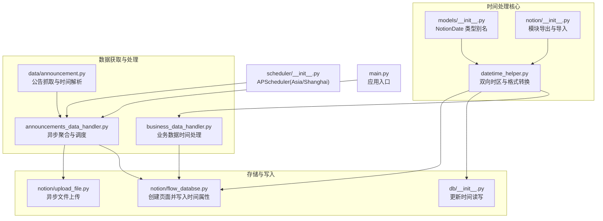
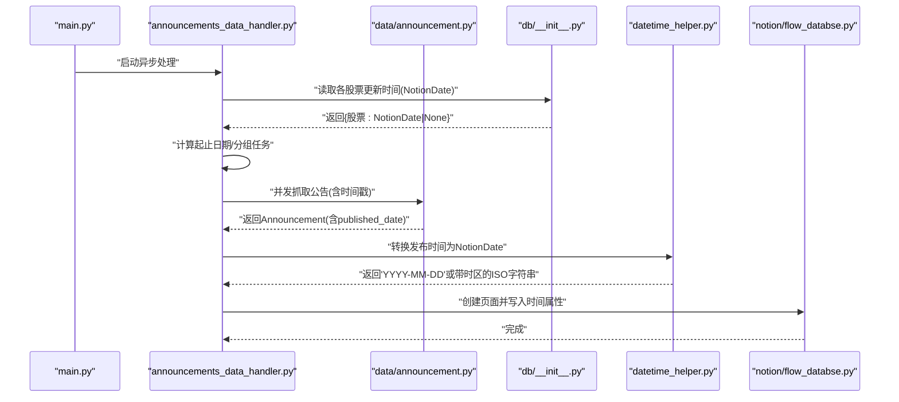
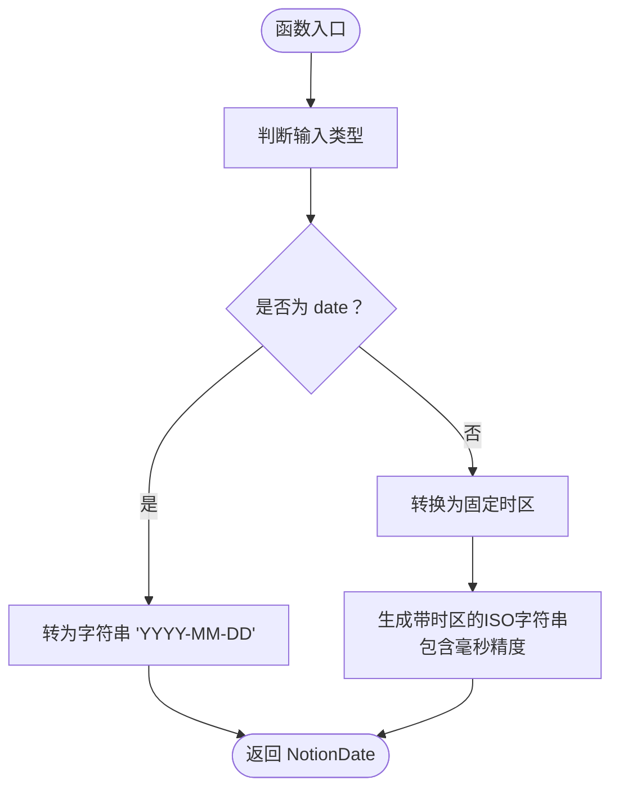
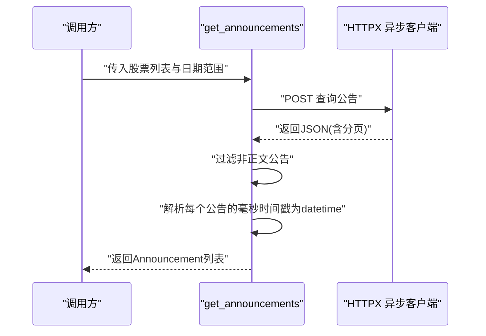
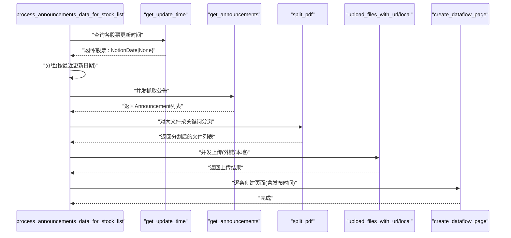
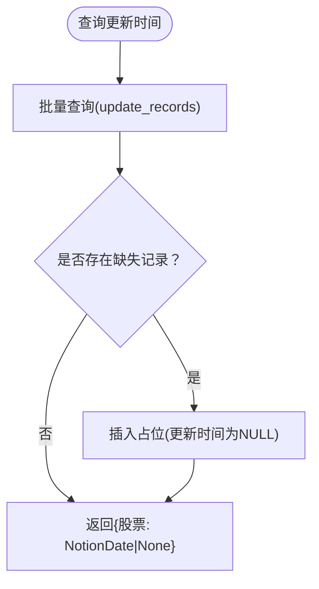
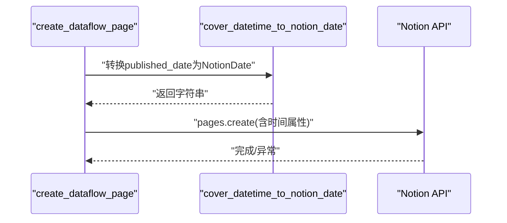
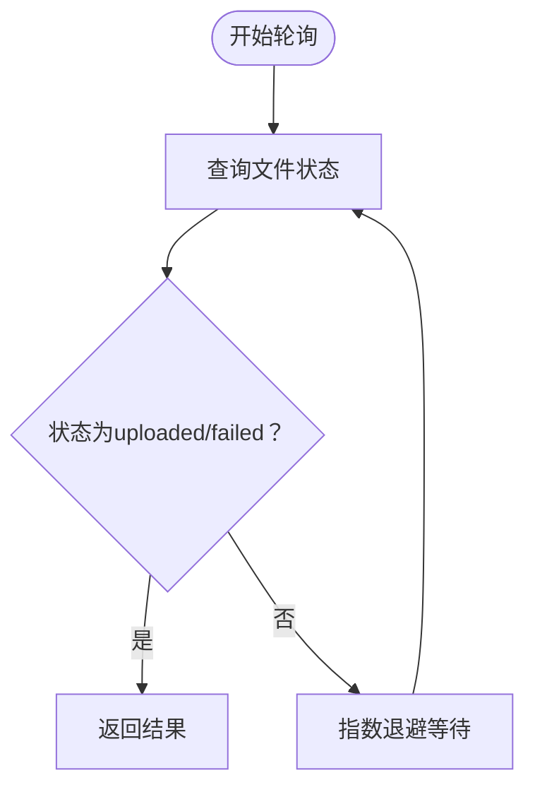
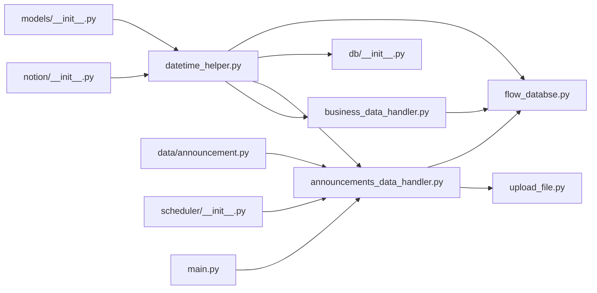

# 时间处理工具

<cite>
**本文引用的文件**
- [core/notion/datetime_helper.py](file://core/notion/datetime_helper.py)
- [core/models/__init__.py](file://core/models/__init__.py)
- [core/data/announcement.py](file://core/data/announcement.py)
- [core/announcements_data_handler.py](file://core/announcements_data_handler.py)
- [core/db/__init__.py](file://core/db/__init__.py)
- [core/notion/flow_databse.py](file://core/notion/flow_databse.py)
- [core/notion/upload_file.py](file://core/notion/upload_file.py)
- [core/scheduler/__init__.py](file://core/scheduler/__init__.py)
- [core/notion/__init__.py](file://core/notion/__init__.py)
- [core/business_data_handler.py](file://core/business_data_handler.py)
- [main.py](file://main.py)
- [tests/test_notion/test_datetime_helper.py](file://tests/test_notion/test_datetime_helper.py)
</cite>

## 更新摘要
**变更内容**
- 新增双向时间转换工具：`cover_datetime_to_notion_date` 和 `cover_notion_date_to_datetime`
- 增强时区处理能力，支持固定时区转换和ISO格式标准化
- 扩展到更多模块的集成使用，包括业务数据处理
- 完善单元测试覆盖双向转换的往返一致性验证

## 目录
1. [简介](#简介)
2. [项目结构](#项目结构)
3. [核心组件](#核心组件)
4. [架构总览](#架构总览)
5. [详细组件分析](#详细组件分析)
6. [依赖关系分析](#依赖关系分析)
7. [性能考量](#性能考量)
8. [故障排查指南](#故障排查指南)
9. [结论](#结论)
10. [附录](#附录)

## 简介
本文件面向"时间处理工具"的技术文档，聚焦以下主题：
- **双向时间格式转换**：新增的`cover_datetime_to_notion_date`和`cover_notion_date_to_datetime`双向转换工具
- **时区处理与标准化**：统一的固定时区转换和ISO格式标准化机制
- **时间戳管理与Notion兼容格式映射**：支持毫秒级精度和UTC时区转换
- **夏令时与跨时区一致性保障**：通过固定时区避免夏令时切换影响
- **公告发布时间处理与数据一致性保证**：全链路时间处理的统一规范
- **异步环境下的时间处理最佳实践**：并发场景下的时间处理策略
- **常见边界情况处理与错误恢复策略**：完善的异常处理和测试验证

本工具围绕统一的时区与格式约定，确保从数据源解析、内存对象、持久化存储到Notion页面属性写入的全链路一致性。

## 项目结构
该项目采用按功能域划分的模块化组织方式，时间处理相关的关键路径如下：
- **双向转换核心**：core/notion/datetime_helper.py（新增双向转换函数）
- **Notion类型别名**：core/models/__init__.py
- **公告数据抓取与时间解析**：core/data/announcement.py
- **公告数据处理与异步调度**：core/announcements_data_handler.py
- **数据库更新时间读写**：core/db/__init__.py
- **Notion页面创建与时间属性写入**：core/notion/flow_databse.py
- **文件上传与轮询（异步）**：core/notion/upload_file.py
- **调度器（时区固定为亚洲/上海）**：core/scheduler/__init__.py
- **模块导出**：core/notion/__init__.py（新增双向转换函数导出）
- **业务数据处理**：core/business_data_handler.py（新增业务数据时间处理）
- **应用入口与异步运行**：main.py
- **时间转换单元测试**：tests/test_notion/test_datetime_helper.py

**图表来源**
- [core/notion/datetime_helper.py](file://core/notion/datetime_helper.py#L1-L39)
- [core/models/__init__.py](file://core/models/__init__.py#L1-L8)
- [core/notion/__init__.py](file://core/notion/__init__.py#L1-L23)
- [core/data/announcement.py](file://core/data/announcement.py#L1-L141)
- [core/announcements_data_handler.py](file://core/announcements_data_handler.py#L1-L157)
- [core/business_data_handler.py](file://core/business_data_handler.py#L1-L123)
- [core/db/__init__.py](file://core/db/__init__.py#L1-L218)
- [core/notion/flow_databse.py](file://core/notion/flow_databse.py#L1-L67)
- [core/notion/upload_file.py](file://core/notion/upload_file.py#L1-L180)
- [core/scheduler/__init__.py](file://core/scheduler/__init__.py#L1-L7)
- [main.py](file://main.py#L1-L40)

**章节来源**
- [core/notion/datetime_helper.py](file://core/notion/datetime_helper.py#L1-L39)
- [core/models/__init__.py](file://core/models/__init__.py#L1-L8)
- [core/notion/__init__.py](file://core/notion/__init__.py#L1-L23)
- [core/data/announcement.py](file://core/data/announcement.py#L1-L141)
- [core/announcements_data_handler.py](file://core/announcements_data_handler.py#L1-L157)
- [core/business_data_handler.py](file://core/business_data_handler.py#L1-L123)
- [core/db/__init__.py](file://core/db/__init__.py#L1-L218)
- [core/notion/flow_databse.py](file://core/notion/flow_databse.py#L1-L67)
- [core/notion/upload_file.py](file://core/notion/upload_file.py#L1-L180)
- [core/scheduler/__init__.py](file://core/scheduler/__init__.py#L1-L7)
- [main.py](file://main.py#L1-L40)

## 核心组件
- **NotionDate 类型别名**：通过 NewType(str) 约束字符串语义，确保时间字段在类型层面具备可识别性。
- **双向时间转换工具**：
  - `cover_datetime_to_notion_date`：将Python的datetime或date对象转换为NotionDate对象
  - `cover_notion_date_to_datetime`：将NotionDate类型的日期转换为datetime对象
- **时区与格式转换**：
  - 固定时区常量：将所有 datetime 统一转换为指定时区的 ISO 字符串
  - 日期与日期时间分支处理：date 直接转字符串；datetime 转换为带时区的 ISO 字符串（毫秒精度）
- **公告发布时间解析**：从第三方接口返回的毫秒级时间戳转换为 Python datetime
- **数据库更新时间**：以 NotionDate 字符串形式存储，读取时转换为 datetime 用于逻辑判断
- **页面创建**：将发布时间写入 Notion 页面属性，使用统一的转换函数保证格式一致

**章节来源**
- [core/models/__init__.py](file://core/models/__init__.py#L1-L8)
- [core/notion/datetime_helper.py](file://core/notion/datetime_helper.py#L1-L39)
- [core/data/announcement.py](file://core/data/announcement.py#L100-L112)
- [core/db/__init__.py](file://core/db/__init__.py#L153-L204)
- [core/notion/flow_databse.py](file://core/notion/flow_databse.py#L25-L67)

## 架构总览
下图展示了从公告抓取到页面创建的端到端流程，重点标注了时间处理的关键节点与转换函数。

**图表来源**
- [main.py](file://main.py#L20-L36)
- [core/announcements_data_handler.py](file://core/announcements_data_handler.py#L21-L157)
- [core/data/announcement.py](file://core/data/announcement.py#L36-L112)
- [core/db/__init__.py](file://core/db/__init__.py#L153-L204)
- [core/notion/datetime_helper.py](file://core/notion/datetime_helper.py#L12-L38)
- [core/notion/flow_databse.py](file://core/notion/flow_databse.py#L25-L67)

## 详细组件分析

### 组件A：双向时间格式与时区转换（datetime_helper）
**更新** 新增双向转换工具，提供完整的往返转换能力

- **设计要点**
  - 使用固定时区常量，确保所有 datetime 输出为同一时区的 ISO 字符串
  - 提供双向转换函数，便于往返一致性校验与调试
  - 对 date 与 datetime 做显式分支：date 直接转字符串；datetime 转换为带时区的 ISO 字符串（毫秒精度）
  - 支持毫秒级精度的ISO格式字符串，满足Notion的显示与比较需求
- **关键行为**
  - `cover_datetime_to_notion_date`：输入为 date 或 datetime，输出为 NotionDate
  - `cover_notion_date_to_datetime`：输入为 NotionDate，输出为 datetime 对象
  - 输入为 date：输出为 'YYYY-MM-DD' 字符串
  - 输入为 datetime：输出为带时区的 ISO 字符串，且包含毫秒精度
  - 反向转换：使用标准库解析 ISO 字符串为 datetime 对象
- **边界与注意事项**
  - isinstance(date) 与 datetime 的继承关系：需先判定 date 再判定 datetime，避免误判
  - 微秒与毫秒精度：字符串中保留微秒，但对外统一为毫秒精度字符串
  - 时区一致性：统一转换到固定时区，避免夏令时切换带来的歧义

**图表来源**
- [core/notion/datetime_helper.py](file://core/notion/datetime_helper.py#L12-L38)

**章节来源**
- [core/notion/datetime_helper.py](file://core/notion/datetime_helper.py#L1-L39)
- [tests/test_notion/test_datetime_helper.py](file://tests/test_notion/test_datetime_helper.py#L1-L89)

### 组件B：公告发布时间解析（data/announcement.py）
- **设计要点**
  - 从接口返回的毫秒级时间戳转换为 Python datetime 对象
  - 过滤掉摘要、英文版、图文版等非全文公告，保留正文公告
  - 通过异步客户端并发拉取多页结果，提升吞吐
- **关键行为**
  - 将 announcementTime（毫秒）除以 1000 转为秒级时间戳，再构造 datetime
  - 构造 Announcement 命名元组，其中 published_date 为 datetime 类型
- **边界与注意事项**
  - 接口返回的日期范围字符串格式为 'YYYY-MM-DD~YYYY-MM-DD'，用于查询参数
  - 若 stock_list 为空，直接返回空列表，避免无效请求
  - 缓存股票映射 JSON，减少重复网络请求

**图表来源**
- [core/data/announcement.py](file://core/data/announcement.py#L36-L112)

**章节来源**
- [core/data/announcement.py](file://core/data/announcement.py#L1-L141)

### 组件C：异步数据处理与调度（announcements_data_handler）
**更新** 新增对双向转换函数的集成使用

- **设计要点**
  - 读取各股票的最后更新时间（NotionDate 字符串），若为空则默认从一年前开始
  - 将需要更新的股票按最近更新日期分组，批量查询以降低接口调用次数
  - 并发抓取公告、上传附件（外链与本地分割后上传）、创建 Notion 页面
  - **新增** 使用 `cover_notion_date_to_datetime` 将数据库存储的 NotionDate 转换为 datetime 对象
  - **新增** 使用 `cover_datetime_to_notion_date` 将当前日期转换为 NotionDate 格式
- **关键行为**
  - 使用相对月份差计算起止日期，覆盖未来一天以确保最新数据
  - 对于大于阈值的 PDF，按关键词匹配进行分页切割后再上传
  - 将 Announcement 中的 published_date 传入页面创建流程
  - **新增** 在数据库更新时使用双向转换函数确保格式一致性
- **边界与注意事项**
  - 对 None 的更新时间做特殊处理，避免逻辑错误
  - 分组依据为转换后的 datetime 日期，确保同一天的数据合并处理

**图表来源**
- [core/announcements_data_handler.py](file://core/announcements_data_handler.py#L21-L157)

**章节来源**
- [core/announcements_data_handler.py](file://core/announcements_data_handler.py#L1-L157)

### 组件D：数据库更新时间读写（db/__init__.py）
- **设计要点**
  - update_records 表存储各股票的更新时间（NotionDate 字符串）
  - get_update_time 支持批量查询，缺失记录自动插入占位
  - set_update_time 更新指定记录，若未找到则抛出异常，防止逻辑错误
- **关键行为**
  - 读取时返回字典，键为股票代码，值为 NotionDate 或 None
  - 写入时接收 NotionDate（字符串），可为 None
- **边界与注意事项**
  - 插入缺失记录时设置 update_time 为 NULL，便于后续逻辑识别
  - 更新前必须先查询，否则抛出异常，保证业务一致性

**图表来源**
- [core/db/__init__.py](file://core/db/__init__.py#L153-L204)

**章节来源**
- [core/db/__init__.py](file://core/db/__init__.py#L1-L218)

### 组件E：Notion 页面创建与时间属性写入（notion/flow_databse.py）
**更新** 新增对双向转换函数的集成使用

- **设计要点**
  - 将发布时间写入页面属性的 date 类型字段，使用统一的转换函数
  - 支持标题、来源接口、数据类型、关联股票、附件与原文链接等字段
  - **新增** 使用 `cover_datetime_to_notion_date` 将 published_date 转换为 NotionDate
- **关键行为**
  - published_date 传入时可为 date 或 datetime，内部统一转换为 NotionDate
  - 创建页面时将属性写入 Notion 数据库
- **边界与注意事项**
  - 数据类型映射为 Notion select 字段的 id，需与数据库配置保持一致
  - 异常捕获并记录日志，便于排查

**图表来源**
- [core/notion/flow_databse.py](file://core/notion/flow_databse.py#L25-L67)
- [core/notion/datetime_helper.py](file://core/notion/datetime_helper.py#L12-L38)

**章节来源**
- [core/notion/flow_databse.py](file://core/notion/flow_databse.py#L1-L67)

### 组件F：异步文件上传与轮询（notion/upload_file.py）
- **设计要点**
  - 并发上传多个文件，支持外链与本地内容两种模式
  - 上传后轮询状态，采用指数退避策略，最多等待固定次数
- **关键行为**
  - _poll_upload_status 指数退避间隔为 1, 2, 4, 8, 16 秒
  - 成功/失败均返回结构化结果，便于上层统计与重试
- **边界与注意事项**
  - 超时返回失败，错误信息包含"轮询超时"
  - 日志记录上传进度与结果，便于运维监控

**图表来源**
- [core/notion/upload_file.py](file://core/notion/upload_file.py#L153-L177)

**章节来源**
- [core/notion/upload_file.py](file://core/notion/upload_file.py#L1-L180)

### 组件G：调度器与时区（scheduler/__init__.py）
- **设计要点**
  - 使用 APScheduler 的 AsyncIOScheduler，并固定时区为 Asia/Shanghai
  - 适合在异步环境中安排周期性任务，确保时间基准一致
- **关键行为**
  - 启动后可在异步任务中注册定时作业
- **边界与注意事项**
  - 与时间处理工具配合时，建议统一使用 Asia/Shanghai 时区，避免跨时区差异

**章节来源**
- [core/scheduler/__init__.py](file://core/scheduler/__init__.py#L1-L7)

### 组件H：业务数据处理（business_data_handler）
**更新** 新增业务数据时间处理功能

- **设计要点**
  - **新增** 集成双向时间转换函数，处理业务数据的报告日期
  - 使用 `cover_datetime_to_notion_date` 将业务数据的 report_date 转换为 NotionDate
  - 支持季度数据的更新判断和时间处理
- **关键行为**
  - 处理股票主营构成数据的异步获取和创建
  - 使用双向转换函数确保业务数据时间格式的一致性
  - 实现季度数据的更新逻辑判断
- **边界与注意事项**
  - 仅处理季度末数据，其他时间点跳过更新
  - 通过哈希检查避免重复创建相同业务数据

**章节来源**
- [core/business_data_handler.py](file://core/business_data_handler.py#L1-L123)

## 依赖关系分析
**更新** 新增双向转换函数的广泛依赖关系

- **类型约束**
  - NotionDate 为 NewType(str)，在转换函数与数据库读写处广泛使用，确保字符串语义清晰
- **模块耦合**
  - datetime_helper 为时间处理的核心，被 flow_databse、announcements_data_handler、business_data_handler 间接依赖
  - **新增** notion/__init__.py 导出双向转换函数，便于全局使用
  - db/__init__.py 与 datetime_helper 协作，保证存储与读取的格式一致性
  - data/announcement.py 与 notion/flow_databse.py 通过 Announcement/published_date 形成数据传递
  - **新增** business_data_handler 集成双向转换函数处理业务数据时间
- **外部依赖**
  - 异步 HTTP 客户端 httpx 与 Notion 异步 SDK 用于网络请求与文件上传
  - 调度器 APScheduler 用于周期性任务编排

**图表来源**
- [core/notion/datetime_helper.py](file://core/notion/datetime_helper.py#L1-L39)
- [core/models/__init__.py](file://core/models/__init__.py#L1-L8)
- [core/notion/__init__.py](file://core/notion/__init__.py#L1-L23)
- [core/data/announcement.py](file://core/data/announcement.py#L1-L141)
- [core/announcements_data_handler.py](file://core/announcements_data_handler.py#L1-L157)
- [core/business_data_handler.py](file://core/business_data_handler.py#L1-L123)
- [core/db/__init__.py](file://core/db/__init__.py#L1-L218)
- [core/notion/flow_databse.py](file://core/notion/flow_databse.py#L1-L67)
- [core/notion/upload_file.py](file://core/notion/upload_file.py#L1-L180)
- [core/scheduler/__init__.py](file://core/scheduler/__init__.py#L1-L7)
- [main.py](file://main.py#L1-L40)

**章节来源**
- [core/notion/datetime_helper.py](file://core/notion/datetime_helper.py#L1-L39)
- [core/models/__init__.py](file://core/models/__init__.py#L1-L8)
- [core/notion/__init__.py](file://core/notion/__init__.py#L1-L23)
- [core/data/announcement.py](file://core/data/announcement.py#L1-L141)
- [core/announcements_data_handler.py](file://core/announcements_data_handler.py#L1-L157)
- [core/business_data_handler.py](file://core/business_data_handler.py#L1-L123)
- [core/db/__init__.py](file://core/db/__init__.py#L1-L218)
- [core/notion/flow_databse.py](file://core/notion/flow_databse.py#L1-L67)
- [core/notion/upload_file.py](file://core/notion/upload_file.py#L1-L180)
- [core/scheduler/__init__.py](file://core/scheduler/__init__.py#L1-L7)
- [main.py](file://main.py#L1-L40)

## 性能考量
**更新** 新增双向转换的性能优化

- **并发抓取与上传**
  - 使用 asyncio.gather 并发抓取公告与上传文件，显著降低整体延迟
  - 文件上传采用指数退避轮询，避免频繁请求导致限流
- **批量查询与分组**
  - 按最近更新日期分组，合并多股票查询，减少接口调用次数
- **存储与去重**
  - 数据库中以 NotionDate 字符串存储更新时间，查询与更新均为 O(1) 级别
- **时间精度与格式**
  - 统一为毫秒精度的 ISO 字符串，兼顾显示与比较需求，避免多余转换开销
  - **新增** 双向转换函数提供高效的往返转换，减少重复格式化操作
- **内存优化**
  - 双向转换函数避免不必要的中间对象创建，提高内存使用效率

## 故障排查指南
**更新** 新增双向转换相关的故障排查

- **常见问题**
  - 时间显示异常：确认输入是否为 datetime（带时区）或 date（无时间部分），并检查转换函数分支
  - 夏令时影响：由于统一转换到固定时区，不会受夏令时切换影响
  - 数据库更新时间不生效：检查 set_update_time 是否在 get_update_time 之后调用，避免抛出"未找到记录"异常
  - Notion 页面时间不一致：核对 published_date 传入类型与转换函数输出格式
  - 文件上传失败：查看轮询超时与错误信息，必要时增加重试策略
  - **新增** 双向转换往返不一致：检查输入格式是否符合预期，验证毫秒精度处理
  - **新增** 业务数据时间处理异常：确认业务数据的 report_date 格式和时区设置
- **测试验证**
  - 使用单元测试覆盖 date/datetime/带时区 datetime 的往返转换，确保精度与格式正确
  - 验证 None 与空字符串的边界处理，确保逻辑分支正确
  - **新增** 测试双向转换的往返一致性，确保数据完整性

**章节来源**
- [tests/test_notion/test_datetime_helper.py](file://tests/test_notion/test_datetime_helper.py#L1-L89)
- [core/db/__init__.py](file://core/db/__init__.py#L202-L215)
- [core/notion/upload_file.py](file://core/notion/upload_file.py#L153-L177)

## 结论
**更新** 时间处理工具通过增强的双向转换功能，实现了更加完善的时间处理体系

本时间处理工具通过统一的时区与格式约定，实现了从数据源解析、内存对象、持久化存储到 Notion 页面属性写入的全链路一致性。**新增的双向转换工具**进一步增强了系统的灵活性和可靠性，支持精确的往返转换和格式标准化。借助异步并发与指数退避策略，系统在性能与可靠性之间取得良好平衡。

**主要改进**：
- 新增 `cover_datetime_to_notion_date` 和 `cover_notion_date_to_datetime` 双向转换函数
- 扩展到业务数据处理模块的集成使用
- 完善的单元测试覆盖双向转换的往返一致性验证
- 更加灵活的时间处理能力和更好的错误恢复策略

建议在扩展新功能时继续遵循现有模式：统一使用 NotionDate 类型别名、固定时区转换、严格的边界与错误处理，以及完善的测试覆盖。

## 附录
- **异步环境最佳实践**
  - 使用 asyncio.gather 并发执行 I/O 密集任务
  - 对外部服务调用采用指数退避与超时控制
  - 在调度器中统一时区，避免跨时区差异
  - **新增** 在异步任务中合理使用双向转换函数，避免重复转换
- **时间精度与格式**
  - 毫秒精度字符串满足大多数显示与比较需求
  - 对 date 与 datetime 明确区分，避免误判分支
  - **新增** 双向转换函数提供精确的往返转换，确保数据完整性
- **数据一致性保证**
  - 数据库更新时间以 NotionDate 字符串存储，读写严格约束
  - 页面创建前统一转换为 Notion 兼容格式，确保属性写入成功
  - **新增** 业务数据处理集成双向转换，确保季度数据的准确处理
- **双向转换使用指南**
  - 使用 `cover_datetime_to_notion_date` 将 Python 对象转换为 NotionDate
  - 使用 `cover_notion_date_to_datetime` 将 NotionDate 转换回 Python 对象
  - 注意毫秒精度的 ISO 格式字符串处理
  - 确保时区转换的一致性和准确性