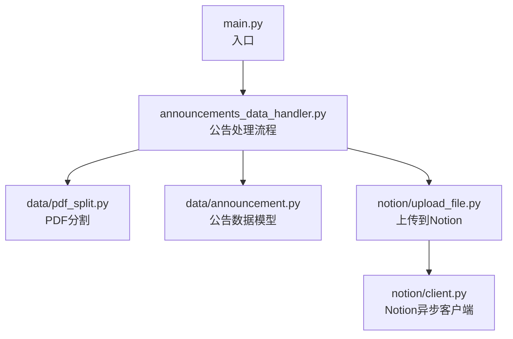
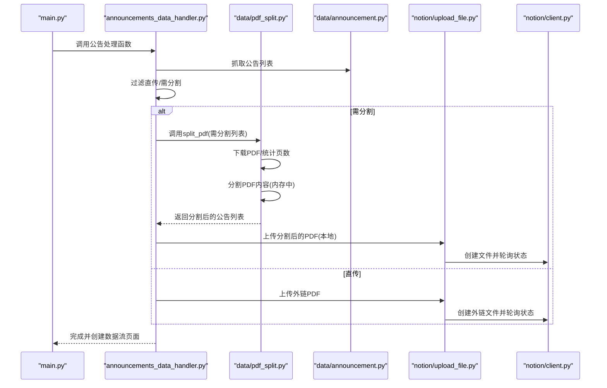
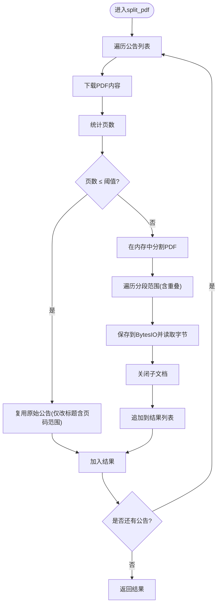
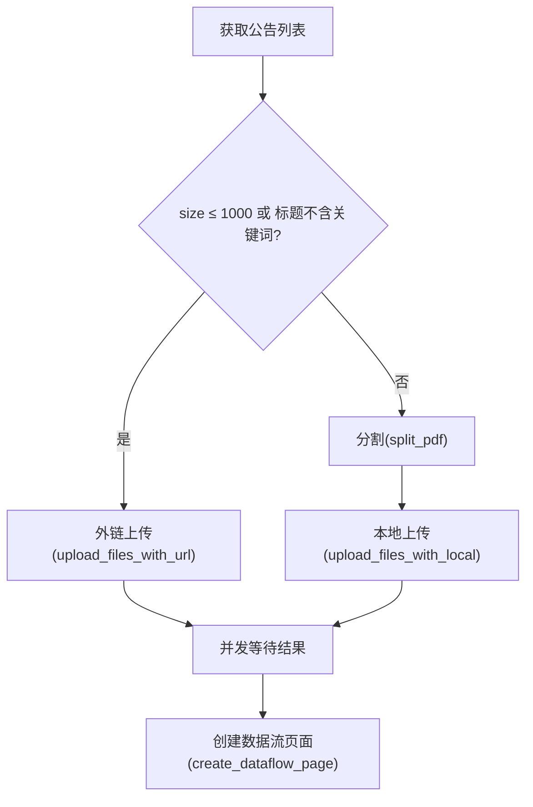
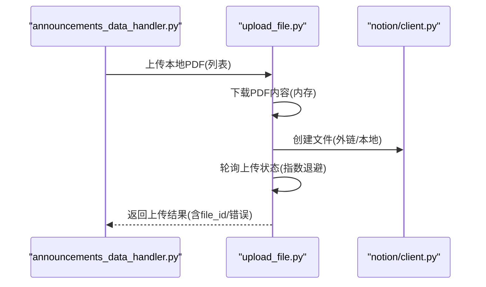
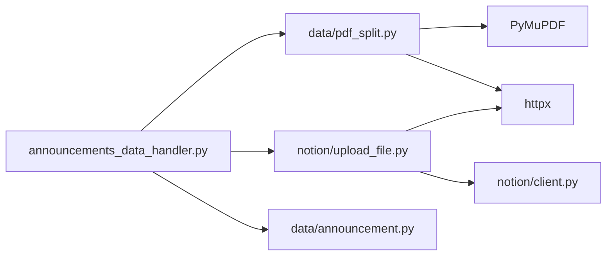

# PDF文件处理模块

<cite>
**本文引用的文件**
- [core/data/pdf_split.py](file://core/data/pdf_split.py)
- [core/announcements_data_handler.py](file://core/announcements_data_handler.py)
- [core/data/announcement.py](file://core/data/announcement.py)
- [core/notion/upload_file.py](file://core/notion/upload_file.py)
- [core/notion/client.py](file://core/notion/client.py)
- [main.py](file://main.py)
- [core/data/__init__.py](file://core/data/__init__.py)
</cite>

## 目录
1. [简介](#简介)
2. [项目结构](#项目结构)
3. [核心组件](#核心组件)
4. [架构总览](#架构总览)
5. [详细组件分析](#详细组件分析)
6. [依赖关系分析](#依赖关系分析)
7. [性能考量](#性能考量)
8. [故障排查指南](#故障排查指南)
9. [结论](#结论)
10. [附录](#附录)

## 简介
本技术文档聚焦于PDF文件处理模块，系统性阐述以下主题：
- 文件分割算法：基于页数阈值的分块策略、重叠页处理与内存中转存
- 智能文件分类：按文件大小与关键词进行分流（直传 vs 分割上传）
- 内存管理策略：使用内存缓冲区与及时关闭资源，避免大文件内存峰值
- PyMuPDF 的使用方法：打开、插入、保存PDF，以及页数统计
- 与公告数据处理模块的集成：从公告抓取到上传的完整流程
- 性能优化、错误处理与文件完整性验证要点

本文件既面向初学者提供清晰的概念与流程图解，也为有经验的开发者提供代码级细节与最佳实践建议。

## 项目结构
PDF处理模块位于 core/data/pdf_split.py，围绕 Announcement 数据模型工作；与公告抓取、上传到 Notion 的流程通过 core/announcements_data_handler.py 协同完成；上传实现位于 core/notion/upload_file.py。

图表来源
- [main.py](file://main.py#L20-L36)
- [core/announcements_data_handler.py](file://core/announcements_data_handler.py#L1-L116)
- [core/data/pdf_split.py](file://core/data/pdf_split.py#L1-L128)
- [core/data/announcement.py](file://core/data/announcement.py#L1-L141)
- [core/notion/upload_file.py](file://core/notion/upload_file.py#L1-L180)
- [core/notion/client.py](file://core/notion/client.py#L1-L6)

章节来源
- [main.py](file://main.py#L1-L40)
- [core/data/__init__.py](file://core/data/__init__.py#L1-L6)

## 核心组件
- PDF分割器：根据页数阈值将大PDF拆分为多个小PDF，支持重叠页避免内容断层
- 公告数据模型：统一承载公告ID、股票、标题、大小、URL、发布时间
- 公告处理器：按大小与关键词筛选，决定直传或分割上传
- Notion上传器：本地内容上传与外链上传，带轮询与错误处理

章节来源
- [core/data/pdf_split.py](file://core/data/pdf_split.py#L15-L74)
- [core/data/announcement.py](file://core/data/announcement.py#L12-L34)
- [core/announcements_data_handler.py](file://core/announcements_data_handler.py#L18-L87)
- [core/notion/upload_file.py](file://core/notion/upload_file.py#L28-L61)

## 架构总览
下图展示了从公告抓取到PDF分割与上传的整体流程，以及各模块间的调用关系。

图表来源
- [main.py](file://main.py#L20-L36)
- [core/announcements_data_handler.py](file://core/announcements_data_handler.py#L66-L93)
- [core/data/pdf_split.py](file://core/data/pdf_split.py#L15-L74)
- [core/notion/upload_file.py](file://core/notion/upload_file.py#L28-L61)

## 详细组件分析

### 组件一：PDF分割器（split_pdf）
- 功能概述
  - 接收公告列表，逐条处理PDF
  - 若页数不超过阈值，直接复用原公告
  - 若超过阈值，使用PyMuPDF在内存中分割PDF，生成多个片段
- 关键参数与策略
  - 分割阈值：CHUNK_SIZE（每段最大页数）
  - 重叠页：REP_SIZE（相邻段之间重叠页数，避免内容断层）
  - 分段起止页计算：起始页 = (段序号-1)*(CHUNK_SIZE - REP_SIZE)+1；结束页 = min(起始+CHUNK_SIZE-1, 总页数)
- 内存管理
  - 使用BytesIO在内存中保存子PDF
  - 每次生成子PDF后立即seek(0)，随后读取全部字节并追加到结果列表
  - 及时关闭pymupdf文档句柄，防止内存泄漏
- 错误处理
  - 捕获异常并记录日志
  - 失败时保留原始公告，保证流程可继续

图表来源
- [core/data/pdf_split.py](file://core/data/pdf_split.py#L15-L74)
- [core/data/pdf_split.py](file://core/data/pdf_split.py#L92-L127)

章节来源
- [core/data/pdf_split.py](file://core/data/pdf_split.py#L11-L12)
- [core/data/pdf_split.py](file://core/data/pdf_split.py#L15-L74)
- [core/data/pdf_split.py](file://core/data/pdf_split.py#L92-L127)

### 组件二：公告数据模型（Announcement）
- 字段定义
  - id：公告唯一标识
  - stock：股票代码/名称
  - title：公告标题
  - size：文件大小（KB）
  - url：下载链接
  - published_date：发布时间
- 用途
  - 作为PDF分割与上传的载体，贯穿整个流程
  - 分割后的新公告会携带新的id与标题页码范围

章节来源
- [core/data/announcement.py](file://core/data/announcement.py#L12-L34)

### 组件三：公告处理器（process_announcements_data_for_stock_list）
- 功能概述
  - 获取公告列表，区分直传与需分割两类
  - 直传条件：文件大小≤1000KB 或 标题不含“年度报告/年报/中期”等关键词
  - 分割条件：文件大小>1000KB 且 标题含上述关键词
- 流程要点
  - 先处理直传（外链上传），再处理需分割（本地上传）
  - 并发执行两类上传任务，提升吞吐
  - 上传完成后创建数据流页面

图表来源
- [core/announcements_data_handler.py](file://core/announcements_data_handler.py#L66-L93)

章节来源
- [core/announcements_data_handler.py](file://core/announcements_data_handler.py#L18-L87)

### 组件四：Notion上传器（upload_files_with_local / upload_files_with_url）
- 本地上传（upload_files_with_local）
  - 从URL下载PDF内容，转换为BytesIO
  - 调用Notion文件上传接口，创建文件并轮询状态
  - 支持指数退避轮询，最多等待约1分钟
- 外链上传（upload_files_with_url）
  - 直接创建外链文件，无需下载
  - 同样进行状态轮询
- 错误处理
  - 记录上传成功/失败与错误信息
  - 超时返回失败状态

图表来源
- [core/notion/upload_file.py](file://core/notion/upload_file.py#L28-L61)
- [core/notion/upload_file.py](file://core/notion/upload_file.py#L153-L176)
- [core/notion/client.py](file://core/notion/client.py#L1-L6)

章节来源
- [core/notion/upload_file.py](file://core/notion/upload_file.py#L28-L61)
- [core/notion/upload_file.py](file://core/notion/upload_file.py#L153-L176)

## 依赖关系分析
- 模块耦合
  - announcements_data_handler 依赖 data/pdf_split 与 notion/upload_file
  - pdf_split 依赖 PyMuPDF 与 httpx，输出 Announcement 列表
  - upload_file 依赖 notion/client 与 httpx，负责上传与轮询
- 关键常量与阈值
  - 分割阈值：CHUNK_SIZE（来自 pdf_split）、BATCH_SIZE（来自 upload_file）
  - 重叠页：REP_SIZE（来自 pdf_split）、COVER_SIZE（来自 upload_file）
  - 直传阈值：1000KB（来自 announcements_data_handler）

图表来源
- [core/announcements_data_handler.py](file://core/announcements_data_handler.py#L7-L16)
- [core/data/pdf_split.py](file://core/data/pdf_split.py#L4-L5)
- [core/notion/upload_file.py](file://core/notion/upload_file.py#L6-L7)
- [core/notion/client.py](file://core/notion/client.py#L3-L5)

章节来源
- [core/announcements_data_handler.py](file://core/announcements_data_handler.py#L7-L16)
- [core/data/pdf_split.py](file://core/data/pdf_split.py#L4-L5)
- [core/notion/upload_file.py](file://core/notion/upload_file.py#L6-L7)

## 性能考量
- 分割阈值与重叠页
  - CHUNK_SIZE 控制每段最大页数，REP_SIZE 提供重叠页避免内容断裂
  - 在 upload_file 中对应 BATCH_SIZE 与 COVER_SIZE，保持一致的分段策略
- 内存管理
  - 使用 BytesIO 在内存中保存子PDF，避免磁盘I/O
  - 每次生成子PDF后立即关闭，减少内存占用
- 并发上传
  - 外链与本地上传均采用并发任务，显著提升吞吐
- 轮询策略
  - 指数退避（1, 2, 4, 8, 16 秒）平衡响应速度与服务器压力
- I/O 优化
  - 大文件优先走分割上传，避免单次请求过大导致超时或内存溢出

[本节为通用性能建议，不直接分析具体文件，故无章节来源]

## 故障排查指南
- 常见问题与定位
  - PDF下载失败：检查URL有效性与网络连通性
  - PyMuPDF报错：确认PDF内容有效且非加密
  - 上传超时：查看轮询日志，确认Notion服务状态
  - 分割后页码不连续：检查REP_SIZE与CHUNK_SIZE设置
- 日志与错误处理
  - 分割失败时保留原始公告，便于后续重试
  - 上传失败记录错误信息，便于定位具体文件
- 建议的验证步骤
  - 校验公告列表中的size与title是否符合预期
  - 对分割后的公告逐一核对页码范围与数量
  - 检查上传结果中的file_id与successed字段

章节来源
- [core/data/pdf_split.py](file://core/data/pdf_split.py#L68-L72)
- [core/notion/upload_file.py](file://core/notion/upload_file.py#L153-L176)

## 结论
PDF文件处理模块通过“阈值分流 + 内存分段 + 并发上传”的组合策略，实现了对大文件PDF的高效处理与上传。其设计兼顾了易用性与可维护性：清晰的阈值参数、稳健的错误处理、严格的资源释放与并发控制。结合公告数据处理模块，形成从抓取到入库的完整闭环。

[本节为总结性内容，不直接分析具体文件，故无章节来源]

## 附录

### 关键参数与阈值对照
- 分割阈值
  - pdf_split.CHUNK_SIZE：每段最大页数
  - REP_SIZE：相邻段重叠页数
  - upload_file.BATCH_SIZE：本地上传分段大小
  - COVER_SIZE：本地上传重叠页数
- 直传阈值
  - 1000KB：文件大小阈值
  - 关键词：年度报告、年报、中期

章节来源
- [core/data/pdf_split.py](file://core/data/pdf_split.py#L11-L12)
- [core/notion/upload_file.py](file://core/notion/upload_file.py#L13-L14)
- [core/announcements_data_handler.py](file://core/announcements_data_handler.py#L18-L82)

### 与公告数据处理模块的集成要点
- 分类逻辑
  - 小文件或不含关键词：外链上传
  - 大文件且含关键词：先分割再本地上传
- 并发策略
  - 外链与本地上传任务并发执行，提升整体吞吐
- 页面创建
  - 上传完成后统一创建数据流页面，关联附件ID

章节来源
- [core/announcements_data_handler.py](file://core/announcements_data_handler.py#L66-L93)