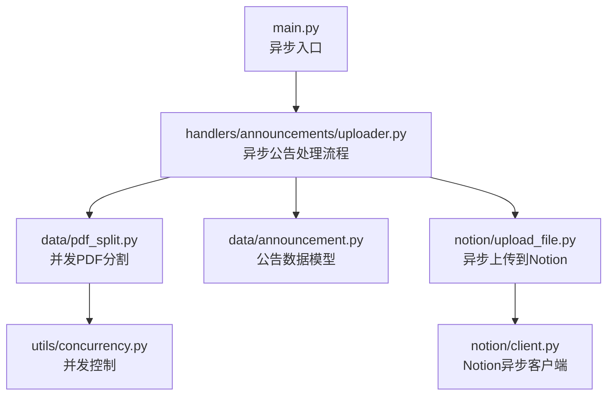
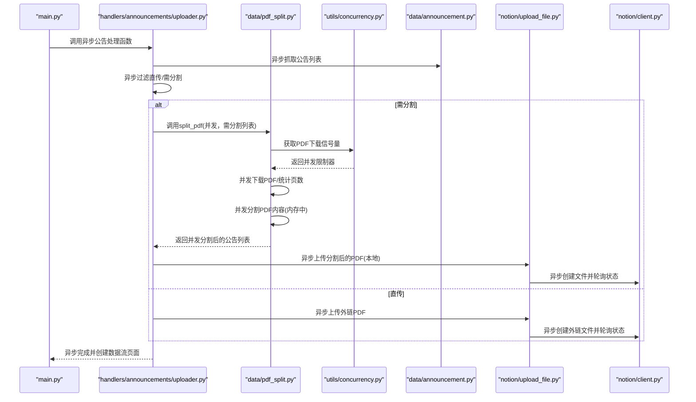
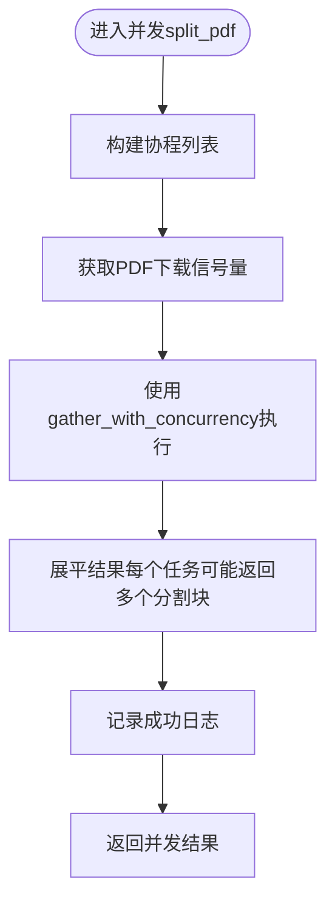
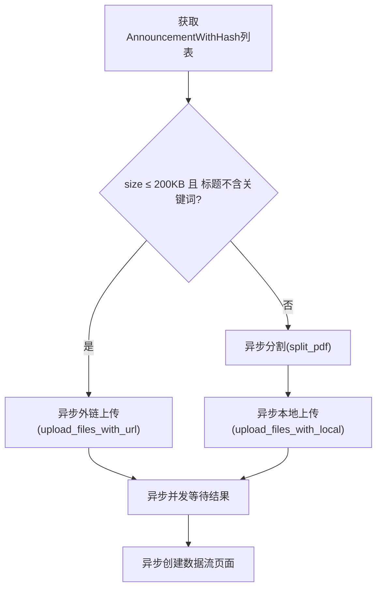
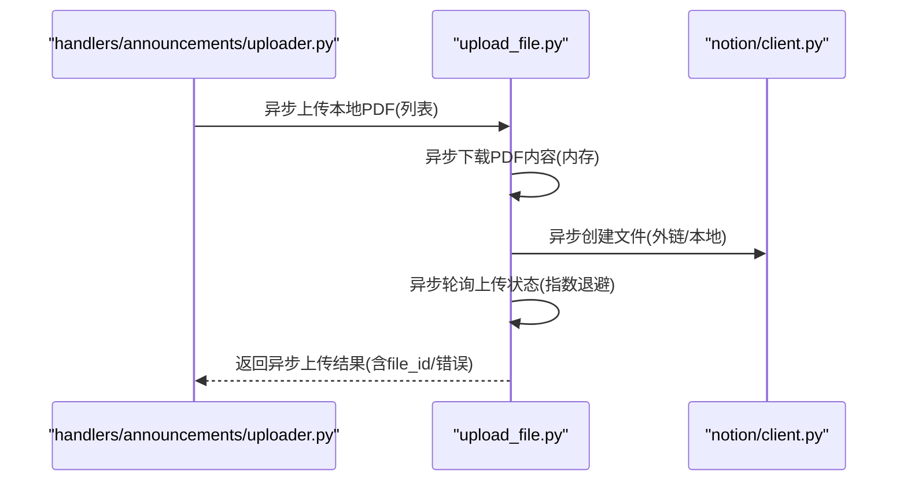
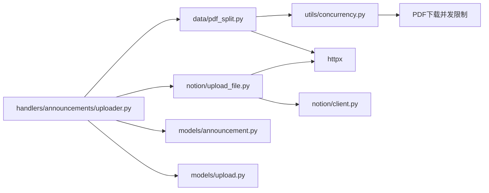

# PDF文件处理模块

<cite>
**本文引用的文件**
- [core/data/pdf_split.py](file://core/data/pdf_split.py)
- [core/utils/concurrency.py](file://core/utils/concurrency.py)
- [core/handlers/announcements/uploader.py](file://core/handlers/announcements/uploader.py)
- [core/data/announcement.py](file://core/data/announcement.py)
- [core/notion/upload_file.py](file://core/notion/upload_file.py)
- [core/notion/client.py](file://core/notion/client.py)
- [main.py](file://main.py)
- [core/models/announcement.py](file://core/models/announcement.py)
- [core/models/upload.py](file://core/models/upload.py)
</cite>

## 更新摘要
**变更内容**
- 并发处理架构重构：使用新的`gather_with_concurrency`函数实现PDF分割的并发控制
- 新的并发限制器：引入`get_pdf_download_semaphore()`控制PDF下载并发数量
- 改进的错误处理和回退机制：分割失败时保留原始公告，确保流程稳定性
- 描述性文件标题生成：为分割后的PDF生成包含页码范围的详细标题
- 全面的日志记录系统：增加任务绑定和详细的处理进度日志
- 增强的内存管理：优化PDF分割过程中的资源使用和清理

## 目录
1. [简介](#简介)
2. [项目结构](#项目结构)
3. [核心组件](#核心组件)
4. [架构总览](#架构总览)
5. [详细组件分析](#详细组件分析)
6. [依赖关系分析](#依赖关系分析)
7. [性能考量](#性能考量)
8. [故障排查指南](#故障排查指南)
9. [结论](#结论)
10. [附录](#附录)

## 简介
本技术文档聚焦于PDF文件处理模块，系统性阐述以下主题：
- **并发PDF分割算法**：基于`gather_with_concurrency`的并发控制，使用`get_pdf_download_semaphore()`限制同时下载的PDF数量
- **智能文件分类**：按文件大小与关键词进行分流（直传 vs 分割上传）
- **类型安全设计**：使用 `AnnouncementWithHash` 和 `AnnouncementWithContent` 数据类
- **增强的错误处理**：完善的异常捕获和回退机制，确保流程稳定性
- **描述性标题生成**：为分割后的PDF生成包含页码范围的详细标题
- **全面的日志记录**：任务绑定和详细的处理进度跟踪
- **内存管理策略**：使用内存缓冲区与及时关闭资源，避免大文件内存峰值
- **PyMuPDF 的异步使用方法**：打开、插入、保存PDF，以及页数统计
- **与公告数据处理模块的异步集成**：从公告抓取到上传的完整异步流程
- **性能优化、错误处理与文件完整性验证要点**

本文件既面向初学者提供清晰的概念与流程图解，也为有经验的开发者提供代码级细节与最佳实践建议。

## 项目结构
PDF处理模块位于 core/data/pdf_split.py，围绕 `AnnouncementWithHash` 数据模型工作；与公告抓取、上传到 Notion 的流程通过 core/handlers/announcements/uploader.py 协同完成；上传实现位于 core/notion/upload_file.py。并发控制功能由 core/utils/concurrency.py 提供。

**图表来源**
- [main.py](file://main.py#L24-L39)
- [core/handlers/announcements/uploader.py](file://core/handlers/announcements/uploader.py#L33-L111)
- [core/data/pdf_split.py](file://core/data/pdf_split.py#L25-L99)
- [core/utils/concurrency.py](file://core/utils/concurrency.py#L78-L92)
- [core/data/announcement.py](file://core/data/announcement.py#L16-L46)
- [core/notion/upload_file.py](file://core/notion/upload_file.py#L17-L72)
- [core/notion/client.py](file://core/notion/client.py#L1-L60)

**章节来源**
- [main.py](file://main.py#L1-L44)
- [core/models/announcement.py](file://core/models/announcement.py#L8-L19)

## 核心组件
- **并发PDF分割器**：使用`gather_with_concurrency`和`get_pdf_download_semaphore()`实现PDF的并发分割，支持智能重叠页避免内容断层
- **类型安全公告模型**：`AnnouncementWithHash` 和 `AnnouncementWithContent` 数据类
- **并发控制模块**：`get_pdf_download_semaphore()`提供PDF下载的并发限制
- **异步公告处理器**：按大小与关键词筛选，决定直传或分割上传
- **异步Notion上传器**：本地内容上传与外链上传，带轮询与错误处理
- **增强的错误处理**：完善的异常捕获和回退机制

**章节来源**
- [core/data/pdf_split.py](file://core/data/pdf_split.py#L25-L27)
- [core/utils/concurrency.py](file://core/utils/concurrency.py#L43-L55)
- [core/models/announcement.py](file://core/models/announcement.py#L8-L19)
- [core/handlers/announcements/uploader.py](file://core/handlers/announcements/uploader.py#L33-L37)
- [core/notion/upload_file.py](file://core/notion/upload_file.py#L17-L20)

## 架构总览
下图展示了从公告抓取到PDF分割与上传的完整异步流程，以及各模块间的调用关系，特别突出了并发控制机制。

**图表来源**
- [main.py](file://main.py#L24-L39)
- [core/handlers/announcements/uploader.py](file://core/handlers/announcements/uploader.py#L33-L111)
- [core/data/pdf_split.py](file://core/data/pdf_split.py#L25-L99)
- [core/utils/concurrency.py](file://core/utils/concurrency.py#L78-L92)
- [core/notion/upload_file.py](file://core/notion/upload_file.py#L17-L72)

## 详细组件分析

### 组件一：并发PDF分割器（split_pdf）
**更新** 全面重构为并发处理实现，使用新的并发控制机制

- **功能概述**
  - 接收 `AnnouncementWithHash` 列表，使用`gather_with_concurrency`进行并发处理
  - 通过`get_pdf_download_semaphore()`限制同时下载的PDF数量（最大3个）
  - 若页数不超过阈值，直接复用原公告（标题不包含页码范围）
  - 若超过阈值，使用PyMuPDF在内存中并发分割PDF，生成多个片段
- **关键参数与策略**
  - 分割阈值：CHUNK_SIZE=20（每段最大页数）
  - 重叠页：REP_SIZE=2（相邻段之间重叠页数，避免内容断层）
  - 并发限制：PDF_DOWNLOAD_CONCURRENCY=3（同时最多3个PDF下载）
  - 分段起止页计算：起始页 = (段序号-1)*(CHUNK_SIZE - REP_SIZE)+1；结束页 = min(起始+CHUNK_SIZE-1, 总页数)
- **并发特性**
  - 使用 `gather_with_concurrency` 函数实现并发控制
  - 通过`get_pdf_download_semaphore()`确保资源使用合理
  - 异步下载PDF内容，避免阻塞
  - 异步日志记录，提供详细的处理进度
- **内存管理**
  - 使用BytesIO在内存中保存子PDF
  - 每次生成子PDF后立即seek(0)，随后读取全部字节并追加到结果列表
  - 及时关闭pymupdf文档句柄，防止内存泄漏
- **增强的错误处理**
  - 完善的异常捕获和日志记录
  - 分割失败时保留原始公告（空内容），仍关联原始哈希
  - 生成描述性文件标题，包含页码范围信息

**图表来源**
- [core/data/pdf_split.py](file://core/data/pdf_split.py#L25-L60)
- [core/utils/concurrency.py](file://core/utils/concurrency.py#L78-L92)

**章节来源**
- [core/data/pdf_split.py](file://core/data/pdf_split.py#L25-L27)
- [core/data/pdf_split.py](file://core/data/pdf_split.py#L28-L39)
- [core/data/pdf_split.py](file://core/data/pdf_split.py#L43-L60)
- [core/data/pdf_split.py](file://core/data/pdf_split.py#L119-L132)
- [core/data/pdf_split.py](file://core/data/pdf_split.py#L139-L171)

### 组件二：并发控制模块（get_pdf_download_semaphore）
**更新** 新增专门的PDF下载并发控制机制

- **功能概述**
  - 提供PDF下载的并发限制器，确保资源使用合理
  - 采用惰性初始化，确保在事件循环中首次调用时创建
  - 支持PDF下载的并发数量控制（最大3个）
- **关键特性**
  - 惰性初始化：只有在首次调用时才创建Semaphore实例
  - 日志记录：记录并发限制器的初始化和使用情况
  - 独立的并发限制：与其他API的并发控制分离
- **使用场景**
  - PDF下载并发控制
  - 防止大量PDF同时下载导致的资源耗尽
  - 平衡下载速度与系统资源使用

**章节来源**
- [core/utils/concurrency.py](file://core/utils/concurrency.py#L43-L55)
- [core/utils/concurrency.py](file://core/utils/concurrency.py#L112-L121)

### 组件三：类型安全公告模型（AnnouncementWithHash / AnnouncementWithContent）
**更新** 新增类型安全的数据模型

- `AnnouncementWithHash` 模型
  - 字段定义：`announcement`（原始公告数据）、`hash_value`（去重哈希值）
  - 用途：作为PDF分割与上传的载体，贯穿整个流程
  - 类型安全：使用 `@dataclass(frozen=True)` 确保不可变性
- `AnnouncementWithContent` 模型
  - 继承自 `Announcement`，新增 `content` 字段
  - 字段定义：`content: bytes = b""`（PDF文件的二进制内容）
  - 用途：存储分割后的PDF内容，便于直接上传
- **增强的标题生成**
  - 分割后的PDF标题包含页码范围信息
  - 格式：`{原始标题}(P{起始页}-P{结束页})`
  - 提供更详细的文件信息
- **用途**
  - 作为PDF分割与上传的载体，贯穿整个流程
  - 分割后的新公告会携带新的id与标题页码范围

**章节来源**
- [core/models/announcement.py](file://core/models/announcement.py#L8-L19)
- [core/data/announcement.py](file://core/data/announcement.py#L37-L46)
- [core/data/pdf_split.py](file://core/data/pdf_split.py#L107-L117)

### 组件四：异步公告处理器（upload_announcement_files）
**更新** 全面异步化和可配置参数

- **功能概述**
  - 获取 `AnnouncementWithHash` 列表，区分直传与需分割两类
  - 直传条件：文件大小≤200KB 且 标题不含"年度报告/年报/中期"等关键词
  - 分割条件：文件大小>200KB 或 标题含上述关键词
- **可配置参数**
  - `split_keywords`: 触发 PDF 分割的关键词列表，默认使用模块常量
  - `size_threshold`: 文件大小阈值（KB），默认200KB
- **异步特性**
  - 全面使用 `async/await` 语法
  - 并发执行两类上传任务，提升吞吐
  - 异步日志记录，提供详细的处理进度
- **流程要点**
  - 先处理直传（外链上传），再处理需分割（本地上传）
  - 并发执行两类上传任务，提升吞吐
  - 上传完成后创建数据流页面

**图表来源**
- [core/handlers/announcements/uploader.py](file://core/handlers/announcements/uploader.py#L33-L111)

**章节来源**
- [core/handlers/announcements/uploader.py](file://core/handlers/announcements/uploader.py#L33-L37)
- [core/handlers/announcements/uploader.py](file://core/handlers/announcements/uploader.py#L53-L72)
- [core/handlers/announcements/uploader.py](file://core/handlers/announcements/uploader.py#L87-L111)

### 组件五：异步Notion上传器（upload_files_with_local / upload_files_with_url）
**更新** 全面异步化和增强错误处理

- **本地上传（upload_files_with_local）**
  - 从URL下载PDF内容，转换为BytesIO
  - 调用Notion文件上传接口，创建文件并轮询状态
  - 支持指数退避轮询，最多等待约1分钟
  - 异步并发处理多个文件
- **外链上传（upload_files_with_url）**
  - 直接创建外链文件，无需下载
  - 同样进行状态轮询
  - 异步并发处理多个文件
- **异步特性**
  - 全面使用 `async/await` 语法
  - 并发执行多个上传任务
  - 异步日志记录，提供详细的处理进度
- **错误处理**
  - 记录上传成功/失败与错误信息
  - 超时返回失败状态
  - 支持自动重试机制

**图表来源**
- [core/notion/upload_file.py](file://core/notion/upload_file.py#L17-L72)
- [core/notion/upload_file.py](file://core/notion/upload_file.py#L75-L131)
- [core/notion/client.py](file://core/notion/client.py#L1-L60)

**章节来源**
- [core/notion/upload_file.py](file://core/notion/upload_file.py#L17-L20)
- [core/notion/upload_file.py](file://core/notion/upload_file.py#L75-L131)
- [core/notion/upload_file.py](file://core/notion/upload_file.py#L133-L191)

## 依赖关系分析
- **模块耦合**
  - handlers/announcements/uploader 依赖 data/pdf_split 与 notion/upload_file
  - pdf_split 依赖 utils/concurrency 与 httpx，输出 AnnouncementWithContent 列表
  - upload_file 依赖 notion/client 与 httpx，负责上传与轮询
- **关键常量与阈值**
  - 分割阈值：CHUNK_SIZE=20（来自 pdf_split）
  - 重叠页：REP_SIZE=2（来自 pdf_split）
  - 直传阈值：200KB（来自 handlers/announcements/uploader）
  - PDF并发限制：PDF_DOWNLOAD_CONCURRENCY=3（来自 utils/concurrency）
  - 分割关键词：["年度报告", "年报", "中期"]
- **并发控制机制**
  - get_pdf_download_semaphore()提供PDF下载的并发限制
  - gather_with_concurrency()实现协程的并发控制
  - 与其他API的并发控制分离

**图表来源**
- [core/handlers/announcements/uploader.py](file://core/handlers/announcements/uploader.py#L11-L14)
- [core/data/pdf_split.py](file://core/data/pdf_split.py#L14-L15)
- [core/utils/concurrency.py](file://core/utils/concurrency.py#L19-L21)
- [core/notion/upload_file.py](file://core/notion/upload_file.py#L10-L12)
- [core/notion/client.py](file://core/notion/client.py#L58-L59)

**章节来源**
- [core/handlers/announcements/uploader.py](file://core/handlers/announcements/uploader.py#L11-L14)
- [core/data/pdf_split.py](file://core/data/pdf_split.py#L14-L15)
- [core/utils/concurrency.py](file://core/utils/concurrency.py#L19-L21)
- [core/notion/upload_file.py](file://core/notion/upload_file.py#L10-L12)

## 性能考量
- **并发处理优化**
  - 使用`gather_with_concurrency`和`get_pdf_download_semaphore()`实现PDF的并发分割
  - PDF下载并发限制为3个，平衡吞吐量与资源使用
  - 并发执行外链和本地上传任务，显著提升整体吞吐
  - 异步下载和分割操作，避免阻塞主线程
- **分割阈值与重叠页**
  - CHUNK_SIZE=20 控制每段最大页数，REP_SIZE=2 提供重叠页避免内容断裂
  - 智能重叠处理算法，确保内容完整性
- **内存管理**
  - 使用 BytesIO 在内存中保存子PDF，避免磁盘I/O
  - 每次生成子PDF后立即关闭，减少内存占用
- **轮询策略**
  - 指数退避（1, 2, 4, 8, 16 秒）平衡响应速度与服务器压力
- **I/O 优化**
  - 大文件优先走分割上传，避免单次请求过大导致超时或内存溢出
  - 异步日志记录，提供详细的性能监控
- **错误处理优化**
  - 分割失败时保留原始公告，便于后续重试
  - 完善的异常捕获和回退机制
  - 详细的日志记录，便于性能分析和问题定位

## 故障排查指南
- **常见问题与定位**
  - PDF下载失败：检查URL有效性与网络连通性
  - PyMuPDF报错：确认PDF内容有效且非加密
  - 上传超时：查看异步轮询日志，确认Notion服务状态
  - 分割后页码不连续：检查REP_SIZE与CHUNK_SIZE设置
  - 并发限制问题：检查PDF下载并发数是否达到上限
- **并发相关问题**
  - 并发任务阻塞：检查事件循环和并发限制器状态
  - 资源耗尽：调整PDF_DOWNLOAD_CONCURRENCY参数
  - 信号量未正确释放：确认异步上下文的正确使用
- **异步错误处理**
  - 分割失败时保留原始公告，便于后续重试
  - 上传失败记录错误信息，便于定位具体文件
  - 异步日志提供详细的错误堆栈信息
- **建议的验证步骤**
  - 校验 `AnnouncementWithHash` 列表中的size与title是否符合预期
  - 对分割后的公告逐一核对页码范围与数量
  - 检查上传结果中的file_id与succeeded字段
  - 验证异步任务的并发执行情况
  - 监控并发限制器的使用状态

**章节来源**
- [core/data/pdf_split.py](file://core/data/pdf_split.py#L85-L98)
- [core/utils/concurrency.py](file://core/utils/concurrency.py#L78-L92)
- [core/notion/upload_file.py](file://core/notion/upload_file.py#L257-L309)

## 结论
PDF文件处理模块通过"并发分流 + 智能分段 + 并发上传"的组合策略，实现了对大文件PDF的高效处理与上传。其设计兼顾了易用性与可维护性：清晰的阈值参数、稳健的错误处理、严格的资源释放与并发控制。新的并发处理架构进一步提升了系统的吞吐能力和稳定性，结合类型安全的数据模型和异步架构，形成从抓取到入库的完整闭环。

## 附录

### 关键参数与阈值对照
- **分割阈值**
  - pdf_split.CHUNK_SIZE=20：每段最大页数
  - REP_SIZE=2：相邻段重叠页数
- **并发限制**
  - PDF_DOWNLOAD_CONCURRENCY=3：PDF下载最大并发数
  - CNINFO_CONCURRENCY=5：巨潮资讯网API最大并发数
- **直传阈值**
  - 200KB：文件大小阈值
  - 关键词：年度报告、年报、中期
- **可配置参数**
  - split_keywords：分割关键词列表
  - size_threshold：大小阈值（KB）

**章节来源**
- [core/data/pdf_split.py](file://core/data/pdf_split.py#L18-L23)
- [core/utils/concurrency.py](file://core/utils/concurrency.py#L15-L21)
- [core/handlers/announcements/uploader.py](file://core/handlers/announcements/uploader.py#L16-L17)
- [core/handlers/announcements/uploader.py](file://core/handlers/announcements/uploader.py#L36)

### 与公告数据处理模块的异步集成要点
- **异步分类逻辑**
  - 小文件且不含关键词：异步外链上传
  - 大文件或含关键词：先异步分割再异步本地上传
- **并发控制策略**
  - PDF分割使用`get_pdf_download_semaphore()`进行并发限制
  - 外链与本地上传任务异步并发执行，提升整体吞吐
  - 异步日志记录，提供详细的处理进度
- **异步页面创建**
  - 上传完成后异步创建数据流页面，关联附件ID

**章节来源**
- [core/handlers/announcements/uploader.py](file://core/handlers/announcements/uploader.py#L53-L72)
- [core/handlers/announcements/uploader.py](file://core/handlers/announcements/uploader.py#L87-L111)

### 类型安全设计要点
- `AnnouncementWithHash`：公告与其去重哈希值的关联对象
- `AnnouncementWithContent`：带有文件二进制内容的公告
- `FileUploadRequest`：外链文件上传请求
- `FileUploadWithContent`：带有二进制内容的本地文件上传请求
- `FileUploadResult`：文件上传结果

**章节来源**
- [core/models/announcement.py](file://core/models/announcement.py#L8-L19)
- [core/data/announcement.py](file://core/data/announcement.py#L37-L46)
- [core/models/upload.py](file://core/models/upload.py#L7-L70)

### 并发控制机制详解
- **gather_with_concurrency函数**
  - 在并发限制下批量执行协程
  - 使用`with_concurrency_limit`包装每个任务
  - 返回所有协程的返回值列表
- **get_pdf_download_semaphore函数**
  - 获取PDF下载的并发限制器
  - 采用惰性初始化，确保在事件循环中首次调用时创建
  - 默认最大并发数为3
- **with_concurrency_limit函数**
  - 在并发限制下执行协程
  - 使用async with语义确保信号量正确释放
  - 返回协程的执行结果

**章节来源**
- [core/utils/concurrency.py](file://core/utils/concurrency.py#L78-L92)
- [core/utils/concurrency.py](file://core/utils/concurrency.py#L43-L55)
- [core/utils/concurrency.py](file://core/utils/concurrency.py#L61-L76)