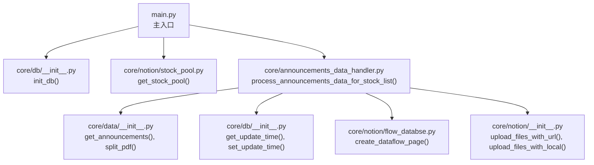
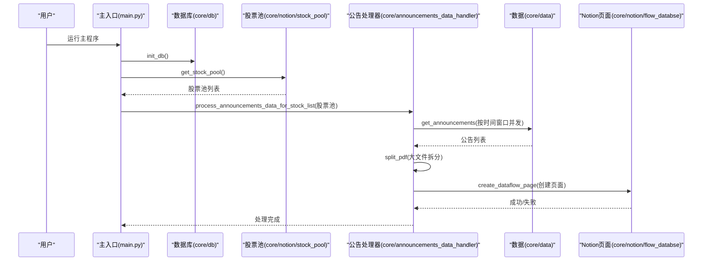
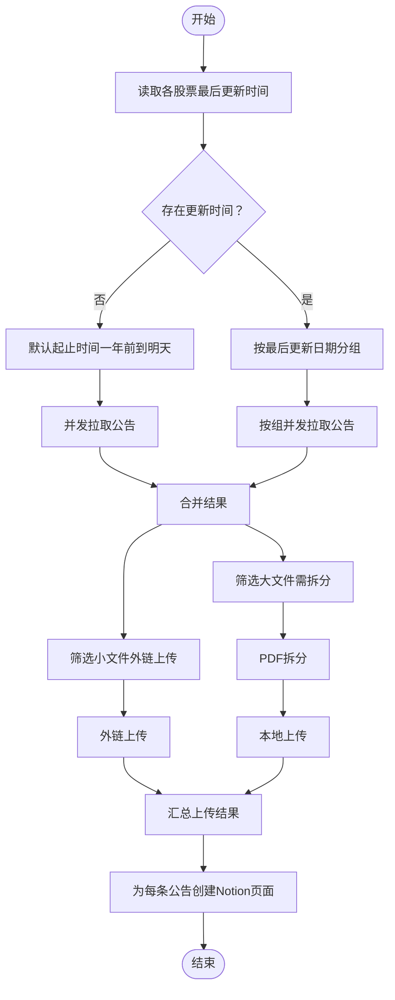
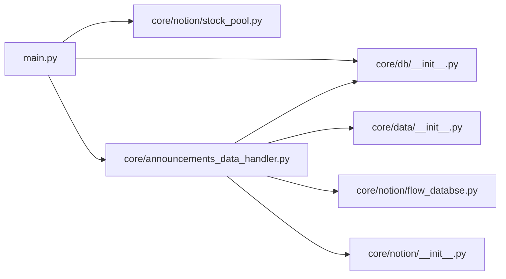

# 主入口模块

<cite>
**本文引用的文件**
- [main.py](file://main.py)
- [announcements_data_handler.py](file://core/announcements_data_handler.py)
- [business_data_handler.py](file://core/business_data_handler.py)
- [__init__.py（调度器）](file://core/scheduler/__init__.py)
- [__init__.py（数据库）](file://core/db/__init__.py)
- [__init__.py（Notion模块聚合）](file://core/notion/__init__.py)
- [__init__.py（数据模块聚合）](file://core/data/__init__.py)
- [__init__.py（模型）](file://core/models/__init__.py)
- [stock_pool.py](file://core/notion/stock_pool.py)
- [flow_databse.py](file://core/notion/flow_databse.py)
</cite>

## 目录
1. [简介](#简介)
2. [项目结构](#项目结构)
3. [核心组件](#核心组件)
4. [架构总览](#架构总览)
5. [详细组件分析](#详细组件分析)
6. [依赖分析](#依赖分析)
7. [性能考量](#性能考量)
8. [故障排除指南](#故障排除指南)
9. [结论](#结论)
10. [附录](#附录)

## 简介
本文件面向“股票公告自动化系统”的主入口模块，系统性阐述启动流程、环境配置、异步调度机制与整体协调逻辑。文档以实际代码为依据，重点说明以下方面：
- 如何加载环境变量并初始化数据库
- 如何从 Notion 获取股票池
- 如何异步调度公告数据处理流程
- 配置参数、环境变量与启动参数的作用范围
- 与其他核心模块的调用关系与数据流向
- 常见启动问题及解决建议

## 项目结构
主入口位于仓库根目录的主程序文件，负责串联数据库初始化、股票池获取与公告数据处理三大步骤。核心模块分布如下：
- 核心业务：公告数据处理、主营构成数据处理
- 数据访问：数据库层（SQLite）、外部数据源（Notion）
- 工具与调度：异步调度器（APScheduler）

图表来源
- [main.py](file://main.py#L20-L39)
- [__init__.py（数据库）](file://core/db/__init__.py#L62-L94)
- [stock_pool.py](file://core/notion/stock_pool.py#L23-L51)
- [announcements_data_handler.py](file://core/announcements_data_handler.py#L21-L115)
- [__init__.py（数据模块聚合）](file://core/data/__init__.py#L1-L5)
- [flow_databse.py](file://core/notion/flow_databse.py#L25-L66)
- [__init__.py（Notion模块聚合）](file://core/notion/__init__.py#L1-L22)

章节来源
- [main.py](file://main.py#L1-L40)

## 核心组件
- 主入口函数：负责顺序执行数据库初始化、股票池获取与公告数据处理，并以异步方式运行。
- 数据库模块：提供数据库初始化、连接管理、去重哈希校验、更新时间读写等能力。
- Notion模块：提供股票池查询、页面创建、文件上传等能力。
- 数据模块：封装对外部数据源（如公告、主营构成）的访问与PDF拆分。
- 调度器：提供基于 AP Scheduler 的异步调度器实例。

章节来源
- [main.py](file://main.py#L20-L39)
- [__init__.py（数据库）](file://core/db/__init__.py#L62-L216)
- [__init__.py（Notion模块聚合）](file://core/notion/__init__.py#L1-L22)
- [__init__.py（数据模块聚合）](file://core/data/__init__.py#L1-L5)
- [__init__.py（调度器）](file://core/scheduler/__init__.py#L1-L8)

## 架构总览
主入口采用“顺序启动 + 异步并发”的模式：
- 启动阶段：加载环境变量、初始化日志、初始化数据库、获取股票池
- 处理阶段：并发拉取公告、按大小与关键词策略拆分与上传、创建 Notion 页面

图表来源
- [main.py](file://main.py#L20-L39)
- [stock_pool.py](file://core/notion/stock_pool.py#L23-L51)
- [announcements_data_handler.py](file://core/announcements_data_handler.py#L21-L115)
- [flow_databse.py](file://core/notion/flow_databse.py#L25-L66)

## 详细组件分析

### 主入口模块（main.py）
- 环境变量加载：通过加载 .env 文件注入环境变量，供后续模块读取。
- 日志初始化：设置日志级别为调试级别，便于问题追踪。
- 启动流程：
  - 初始化数据库（创建必要表结构）
  - 获取股票池（从 Notion 数据源读取）
  - 调用公告数据处理器（异步并发处理）
- 启动参数：通过命令行运行时进入主入口，内部使用 asyncio.run 执行异步主函数。

章节来源
- [main.py](file://main.py#L1-L40)

### 数据库模块（core/db/__init__.py）
- 初始化数据库：创建 update_records 与 hash 两张表，用于记录各股票的更新时间与去重哈希。
- 连接管理：提供异步上下文管理器，确保事务提交/回滚与连接释放。
- 哈希校验：计算内容哈希，查询数据库是否存在，过滤重复数据。
- 更新时间管理：按股票与键（业务类型）读取/更新最后更新时间。

章节来源
- [__init__.py（数据库）](file://core/db/__init__.py#L62-L216)

### 股票池模块（core/notion/stock_pool.py）
- 股票池获取：从环境变量指定的 Notion 数据源 ID 中查询股票记录，解析为 StockPool 对象列表。
- 环境变量依赖：STOCK_POOL 必须指向有效的 Notion 数据源 ID。
- 错误处理：捕获异常并记录错误日志，便于定位配置或网络问题。

章节来源
- [stock_pool.py](file://core/notion/stock_pool.py#L23-L51)

### 公告数据处理器（core/announcements_data_handler.py）
- 时间窗口策略：
  - 未设置更新时间的股票：默认从一年前到明天
  - 已有更新时间的股票：按最后更新日期分组，批量查询
- 并发拉取：使用 asyncio.gather 并发执行多个查询任务，减少总耗时。
- 附件处理：
  - 小于阈值的文件：外链直传
  - 大于阈值且命中拆分关键词的文件：PDF 拆分后本地上传
- 页面创建：为每条公告创建 Notion 页面，建立与股票的关系与附件。

图表来源
- [announcements_data_handler.py](file://core/announcements_data_handler.py#L21-L115)

章节来源
- [announcements_data_handler.py](file://core/announcements_data_handler.py#L21-L115)

### Notion 页面创建（core/notion/flow_databse.py）
- 页面属性映射：标题、发布时间、来源接口、数据类型、关联股票、附件、原文链接等。
- 类型映射：将字符串类型映射为 Notion 内部 select id。
- 环境变量依赖：FLOW_DATABASE 指向资讯流数据库 ID。
- 错误处理：捕获异常并记录错误日志，避免单条失败影响整体流程。

章节来源
- [flow_databse.py](file://core/notion/flow_databse.py#L25-L66)

### 调度器（core/scheduler/__init__.py）
- 提供全局异步调度器实例，时区设定为 Asia/Shanghai。
- 用途：为未来扩展定时任务提供统一入口（当前主入口未直接使用）。

章节来源
- [__init__.py（调度器）](file://core/scheduler/__init__.py#L1-L8)

## 依赖分析
- 主入口对数据库与 Notion 的依赖是启动期必需；公告处理器对数据模块、数据库与 Notion 页面创建模块存在运行期依赖。
- 模块内聚高、耦合点清晰：通过聚合导出文件集中暴露接口，便于主入口统一导入。

图表来源
- [main.py](file://main.py#L12-L13)
- [announcements_data_handler.py](file://core/announcements_data_handler.py#L7-L16)
- [__init__.py（数据模块聚合）](file://core/data/__init__.py#L1-L5)
- [__init__.py（Notion模块聚合）](file://core/notion/__init__.py#L1-L22)

章节来源
- [main.py](file://main.py#L12-L13)
- [announcements_data_handler.py](file://core/announcements_data_handler.py#L7-L16)

## 性能考量
- 并发优化：公告抓取与文件上传均采用 asyncio.gather 并发执行，显著降低总耗时。
- 分批策略：按最后更新时间分组，减少接口调用次数，提升吞吐。
- 去重与缓存：数据库哈希表避免重复处理相同内容，减少无效工作量。
- I/O 密集：整体流程以 I/O 为主，适合异步并发；CPU 密集部分（如 PDF 拆分）建议评估是否引入多进程或外部服务。

## 故障排除指南
- 环境变量缺失
  - 症状：股票池获取失败或页面创建失败
  - 排查：确认 STOCK_POOL 与 FLOW_DATABASE 是否正确设置
  - 参考
    - [stock_pool.py](file://core/notion/stock_pool.py#L33-L33)
    - [flow_databse.py](file://core/notion/flow_databse.py#L22-L22)
- 数据库初始化失败
  - 症状：无法创建表或连接异常
  - 排查：检查数据库路径权限、磁盘空间、并发事务冲突
  - 参考
    - [__init__.py（数据库）](file://core/db/__init__.py#L62-L94)
- 公告处理超时或失败
  - 症状：并发任务报错或部分页面未创建
  - 排查：检查网络连通性、Notion API 限流、PDF 拆分工具可用性
  - 参考
    - [announcements_data_handler.py](file://core/announcements_data_handler.py#L60-L92)
    - [flow_databse.py](file://core/notion/flow_databse.py#L59-L66)
- 日志定位
  - 启动阶段：主入口日志级别为 DEBUG，便于观察初始化过程
  - 参考
    - [main.py](file://main.py#L15-L17)

章节来源
- [stock_pool.py](file://core/notion/stock_pool.py#L33-L51)
- [flow_databse.py](file://core/notion/flow_databse.py#L22-L66)
- [__init__.py（数据库）](file://core/db/__init__.py#L62-L94)
- [announcements_data_handler.py](file://core/announcements_data_handler.py#L60-L92)
- [main.py](file://main.py#L15-L17)

## 结论
主入口模块以简洁清晰的启动流程串联了数据库初始化、股票池获取与公告数据处理三大核心环节。通过异步并发与分批策略，系统在 I/O 密集场景下具备良好的吞吐与稳定性。建议在生产环境中完善环境变量校验、增加重试与熔断机制，并结合调度器实现定时化运行。

## 附录

### 配置参数与环境变量
- STOCK_POOL：Notion 股票池数据源 ID
- FLOW_DATABASE：Notion 资讯流数据库 ID
- 日志级别：DEBUG（便于开发与排障）

章节来源
- [stock_pool.py](file://core/notion/stock_pool.py#L33-L33)
- [flow_databse.py](file://core/notion/flow_databse.py#L22-L22)
- [main.py](file://main.py#L15-L17)