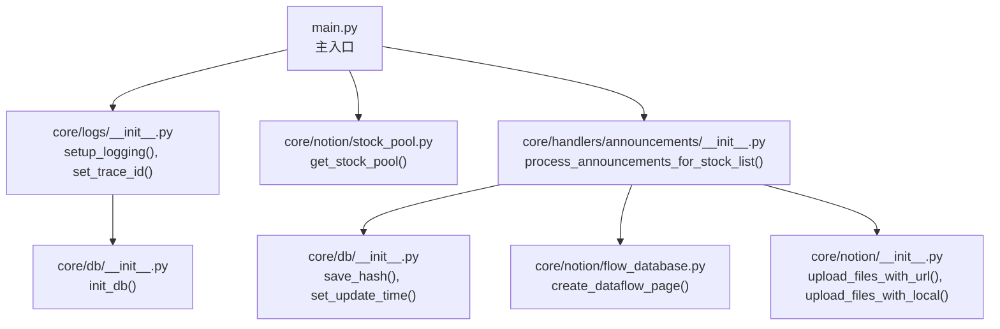
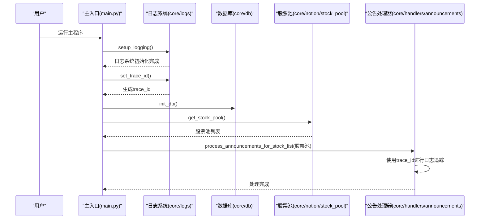
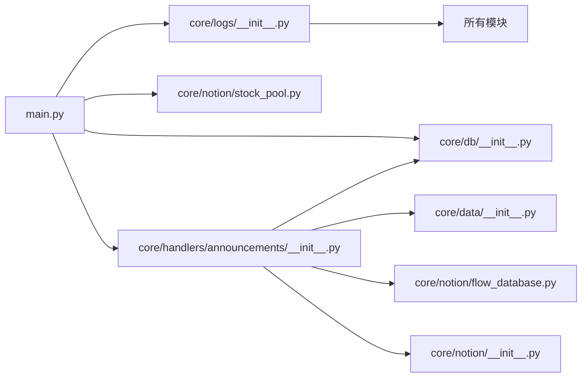

# 主入口模块

<cite>
**本文引用的文件**
- [main.py](file://main.py)
- [logs/__init__.py](file://core/logs/__init__.py)
- [handlers/announcements/__init__.py](file://core/handlers/announcements/__init__.py)
- [handlers/business.py](file://core/handlers/business.py)
- [notion/stock_pool.py](file://core/notion/stock_pool.py)
- [db/__init__.py](file://core/db/__init__.py)
</cite>

## 更新摘要
**所做更改**
- 新增日志系统初始化章节，详细说明新的日志配置和trace_id支持
- 更新主入口模块架构图，反映新的日志系统集成
- 增强故障排除指南，包含trace_id相关的问题诊断
- 更新配置参数章节，添加trace_id相关说明

## 目录
1. [简介](#简介)
2. [项目结构](#项目结构)
3. [核心组件](#核心组件)
4. [架构总览](#架构总览)
5. [详细组件分析](#详细组件分析)
6. [依赖分析](#依赖分析)
7. [性能考量](#性能考量)
8. [故障排除指南](#故障排除指南)
9. [结论](#结论)
10. [附录](#附录)

## 简介
本文件面向"股票公告自动化系统"的主入口模块，系统性阐述启动流程、环境配置、异步调度机制与整体协调逻辑。文档以实际代码为依据，重点说明以下方面：
- 如何加载环境变量并初始化新的日志系统（支持trace_id）
- 如何初始化数据库
- 如何从 Notion 获取股票池
- 如何异步调度公告数据处理流程
- 配置参数、环境变量与启动参数的作用范围
- 与其他核心模块的调用关系与数据流向
- 常见启动问题及解决建议

**更新** 新的日志系统提供了trace_id支持，确保所有应用程序操作从启动开始就具备正确的关联性，便于并发场景下的问题追踪。

## 项目结构
主入口位于仓库根目录的主程序文件，负责串联日志系统初始化、数据库初始化、股票池获取与公告数据处理四大步骤。核心模块分布如下：
- 核心业务：公告数据处理、主营构成数据处理
- 数据访问：数据库层（SQLite）、外部数据源（Notion）
- 日志系统：基于Loguru的新日志配置，支持trace_id追踪
- 工具与调度：异步调度器（APScheduler）

**图表来源**
- [main.py](file://main.py#L1-L45)
- [logs/__init__.py](file://core/logs/__init__.py#L45-L90)
- [db/__init__.py](file://core/db/__init__.py#L62-L216)
- [stock_pool.py](file://core/notion/stock_pool.py#L23-L51)
- [handlers/announcements/__init__.py](file://core/handlers/announcements/__init__.py#L19-L67)

**章节来源**
- [main.py](file://main.py#L1-L45)

## 核心组件
- 主入口函数：负责顺序执行日志系统初始化、数据库初始化、股票池获取与公告数据处理，并以异步方式运行。
- 新日志系统：基于Loguru的全局日志配置，支持trace_id追踪、控制台彩色输出、JSON文件日志和错误日志分离。
- 数据库模块：提供数据库初始化、连接管理、去重哈希校验、更新时间读写等能力。
- Notion模块：提供股票池查询、页面创建、文件上传等能力。
- 公告数据处理器：协调数据获取、去重、上传和页面创建的完整流程。
- 调度器：提供基于 AP Scheduler 的异步调度器实例。

**更新** 新的日志系统通过contextvars实现跨异步任务的trace_id传递，确保每个操作都有唯一的关联标识符。

**章节来源**
- [main.py](file://main.py#L25-L41)
- [logs/__init__.py](file://core/logs/__init__.py#L21-L43)
- [db/__init__.py](file://core/db/__init__.py#L62-L216)
- [handlers/announcements/__init__.py](file://core/handlers/announcements/__init__.py#L19-L67)

## 架构总览
主入口采用"顺序启动 + 异步并发"的模式，新增日志系统初始化：
- 启动阶段：加载环境变量、初始化新日志系统（设置trace_id）、初始化数据库、获取股票池
- 处理阶段：并发拉取公告、按大小与关键词策略拆分与上传、创建 Notion 页面

**图表来源**
- [main.py](file://main.py#L25-L41)
- [logs/__init__.py](file://core/logs/__init__.py#L45-L90)
- [stock_pool.py](file://core/notion/stock_pool.py#L23-L51)
- [handlers/announcements/__init__.py](file://core/handlers/announcements/__init__.py#L19-L67)

## 详细组件分析

### 主入口模块（main.py）
- 环境变量加载：通过加载 .env 文件注入环境变量，供后续模块读取。
- 新日志系统初始化：导入core.logs模块，调用setup_logging()和set_trace_id()进行全局日志配置。
- 启动流程：
  - 初始化数据库（创建必要表结构）
  - 获取股票池（从 Notion 数据源读取）
  - 调用公告数据处理器（异步并发处理）
- 启动参数：通过命令行运行时进入主入口，内部使用 asyncio.run 执行异步主函数。
- 日志追踪：所有操作都带有trace_id，便于问题定位和关联分析。

**更新** 主入口现在在导入其他模块之前先初始化日志系统，确保所有应用程序操作从启动开始就具备trace_id关联性。

**章节来源**
- [main.py](file://main.py#L1-L45)

### 新日志系统（core/logs/__init__.py）
- 全局日志配置：使用Loguru配置控制台彩色输出、JSON文件日志和错误日志分离。
- trace_id支持：通过contextvars实现跨异步任务的trace_id传递，支持自动生成和手动设置。
- 多格式输出：控制台输出包含trace_id、函数名等信息，文件输出为JSON格式便于机器解析。
- 标准库兼容：拦截标准logging库输出，统一转换为Loguru格式。
- 配置选项：支持INFO级别控制台输出、JSON文件轮换（每日）、错误日志单独记录。

**新增** 这是本次更新的核心改进，提供了完整的日志追踪能力。

**章节来源**
- [logs/__init__.py](file://core/logs/__init__.py#L21-L90)

### 数据库模块（core/db/__init__.py）
- 初始化数据库：创建 update_records 与 hash 两张表，用于记录各股票的更新时间与去重哈希。
- 连接管理：提供异步上下文管理器，确保事务提交/回滚与连接释放。
- 哈希校验：计算内容哈希，查询数据库是否存在，过滤重复数据。
- 更新时间管理：按股票与键（业务类型）读取/更新最后更新时间。

**章节来源**
- [db/__init__.py](file://core/db/__init__.py#L62-L216)

### 股票池模块（core/notion/stock_pool.py）
- 股票池获取：从环境变量指定的 Notion 数据源 ID 中查询股票记录，解析为 StockPool 对象列表。
- 环境变量依赖：STOCK_POOL 必须指向有效的 Notion 数据源 ID。
- 错误处理：捕获异常并记录错误日志，便于定位配置或网络问题。

**章节来源**
- [stock_pool.py](file://core/notion/stock_pool.py#L23-L51)

### 公告数据处理器（core/handlers/announcements/__init__.py）
- 完整流程编排：获取公告 -> 哈希去重 -> 文件上传 -> 创建 Notion 页面 -> 记录哈希和更新时间。
- 并发处理：使用异步编程模式，支持多股票并行处理。
- 日志绑定：使用logger.bind()为每个处理任务绑定股票代码，便于追踪特定股票的数据处理情况。
- 错误处理：捕获异常并记录详细信息，避免单个股票问题影响整体流程。

**更新** 处理器现在可以利用全局日志系统提供的trace_id功能，所有日志记录都带有统一的关联标识符。

**章节来源**
- [handlers/announcements/__init__.py](file://core/handlers/announcements/__init__.py#L19-L67)

### 主营构成数据处理器（core/handlers/business.py）
- 数据获取：从外部数据源获取上市公司主营构成数据。
- 数据处理：清洗、验证和标准化处理。
- 存储管理：将处理后的数据存储到数据库中。
- 错误处理：完善的异常处理和日志记录机制。

**章节来源**
- [handlers/business.py](file://core/handlers/business.py)

## 依赖分析
- 主入口对日志系统、数据库与 Notion 的依赖是启动期必需；公告处理器对数据模块、数据库与 Notion 页面创建模块存在运行期依赖。
- 新的日志系统作为全局依赖，为所有模块提供统一的日志追踪能力。
- 模块内聚高、耦合点清晰：通过聚合导出文件集中暴露接口，便于主入口统一导入。

**图表来源**
- [main.py](file://main.py#L1-L45)
- [logs/__init__.py](file://core/logs/__init__.py#L1-L114)
- [handlers/announcements/__init__.py](file://core/handlers/announcements/__init__.py#L1-L71)

**章节来源**
- [main.py](file://main.py#L1-L45)
- [logs/__init__.py](file://core/logs/__init__.py#L1-L114)

## 性能考量
- 并发优化：公告抓取与文件上传均采用 asyncio.gather 并发执行，显著降低总耗时。
- 分批策略：按最后更新时间分组，减少接口调用次数，提升吞吐。
- 去重与缓存：数据库哈希表避免重复处理相同内容，减少无效工作量。
- I/O 密集：整体流程以 I/O 为主，适合异步并发；CPU 密集部分（如 PDF 拆分）建议评估是否引入多进程或外部服务。
- 日志开销：新的日志系统采用异步队列和文件轮换，对性能影响最小化。

**更新** 新的日志系统经过优化，使用enqueue=True确保异步日志写入，不会阻塞主要业务逻辑。

## 故障排除指南
- 环境变量缺失
  - 症状：股票池获取失败或页面创建失败
  - 排查：确认 STOCK_POOL 与 FLOW_DATABASE 是否正确设置
  - 参考
    - [stock_pool.py](file://core/notion/stock_pool.py#L33-L33)
- 日志系统初始化失败
  - 症状：程序启动后没有日志输出或trace_id为空
  - 排查：检查core/logs/__init__.py中的setup_logging()和set_trace_id()调用
  - 解决：确保在导入其他模块之前调用日志初始化函数
  - 参考
    - [logs/__init__.py](file://core/logs/__init__.py#L45-L90)
    - [main.py](file://main.py#L3-L7)
- 数据库初始化失败
  - 症状：无法创建表或连接异常
  - 排查：检查数据库路径权限、磁盘空间、并发事务冲突
  - 参考
    - [db/__init__.py](file://core/db/__init__.py#L62-L94)
- 公告处理超时或失败
  - 症状：并发任务报错或部分页面未创建
  - 排查：检查网络连通性、Notion API 限流、PDF 拆分工具可用性
  - 参考
    - [handlers/announcements/__init__.py](file://core/handlers/announcements/__init__.py#L34-L67)
- 日志追踪问题
  - 症状：日志中缺少trace_id或trace_id不一致
  - 排查：确认set_trace_id()是否在主入口正确调用，检查异步任务中的trace_id传递
  - 解决：确保在每个异步任务开始时调用set_trace_id()或使用现有的trace_id
  - 参考
    - [logs/__init__.py](file://core/logs/__init__.py#L26-L43)
    - [main.py](file://main.py#L6-L7)

**更新** 新增了trace_id相关的故障排除指导，帮助诊断日志追踪问题。

**章节来源**
- [stock_pool.py](file://core/notion/stock_pool.py#L33-L51)
- [logs/__init__.py](file://core/logs/__init__.py#L26-L90)
- [db/__init__.py](file://core/db/__init__.py#L62-L94)
- [handlers/announcements/__init__.py](file://core/handlers/announcements/__init__.py#L34-L67)
- [main.py](file://main.py#L3-L7)

## 结论
主入口模块以简洁清晰的启动流程串联了日志系统初始化、数据库初始化、股票池获取与公告数据处理四大核心环节。新的日志系统提供了强大的trace_id追踪能力，确保所有应用程序操作都具备正确的关联性。通过异步并发与分批策略，系统在 I/O 密集场景下具备良好的吞吐与稳定性。建议在生产环境中完善环境变量校验、增加重试与熔断机制，并结合调度器实现定时化运行。

**更新** 新的日志系统显著提升了系统的可观测性和问题诊断能力，是本次更新的重要成果。

## 附录

### 配置参数与环境变量
- STOCK_POOL：Notion 股票池数据源 ID
- FLOW_DATABASE：Notion 资讯流数据库 ID
- 日志级别：INFO（生产环境推荐）
- trace_id：自动生成的8位十六进制字符串，用于跨异步任务追踪

**更新** 新增了trace_id配置说明，这是新日志系统的核心特性。

**章节来源**
- [stock_pool.py](file://core/notion/stock_pool.py#L33-L33)
- [logs/__init__.py](file://core/logs/__init__.py#L26-L43)

### 日志系统配置详解
- 控制台输出：彩色显示，包含时间、级别、trace_id、函数名和消息
- 文件输出：JSON格式，每日轮换，保留30天，支持异步写入
- 错误日志：单独记录，保留90天
- 标准库拦截：统一处理第三方库的日志输出

**新增** 详细的日志系统配置说明，帮助理解新系统的功能特性。

**章节来源**
- [logs/__init__.py](file://core/logs/__init__.py#L45-L114)