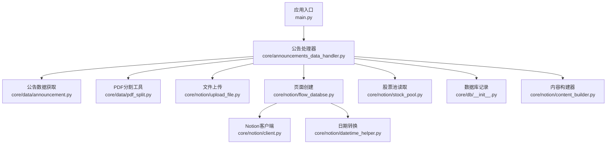
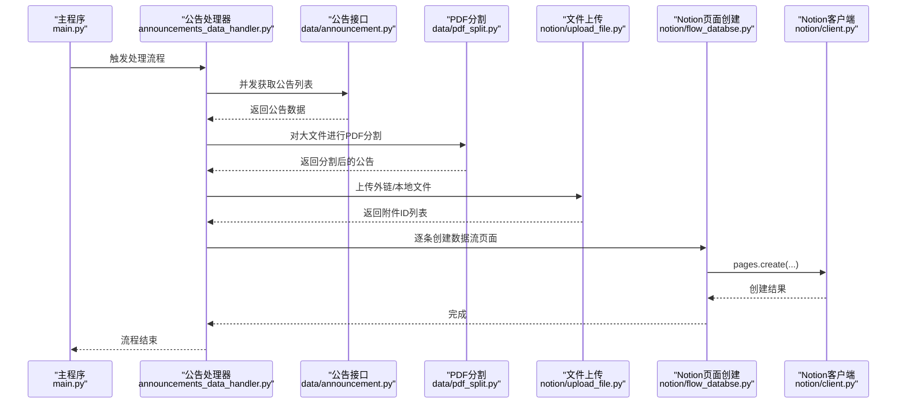
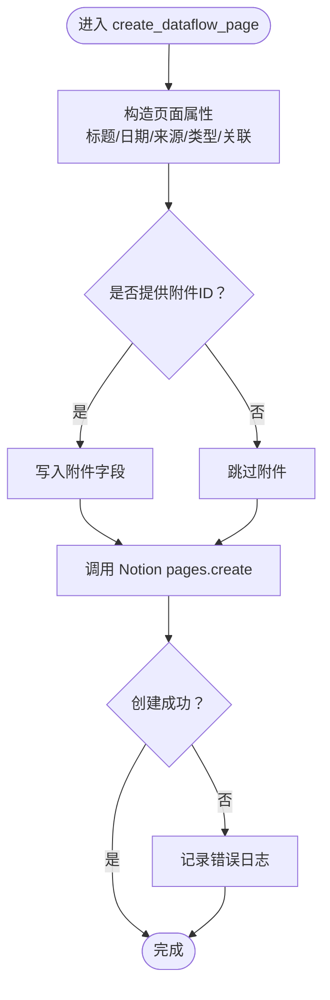
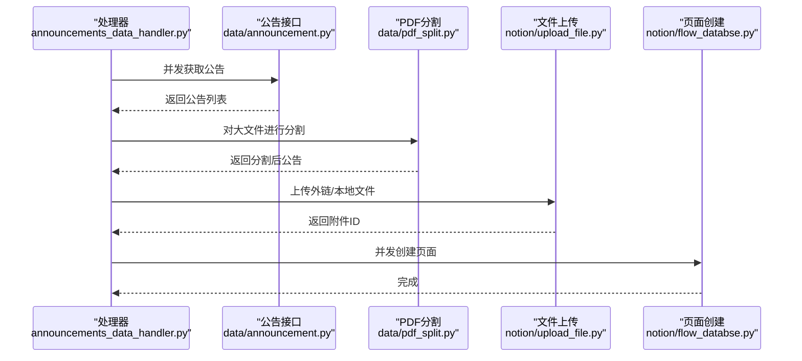
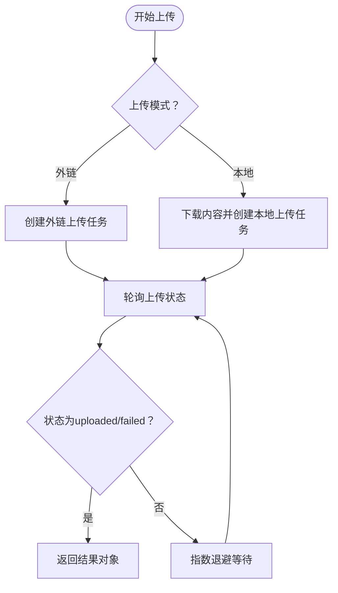
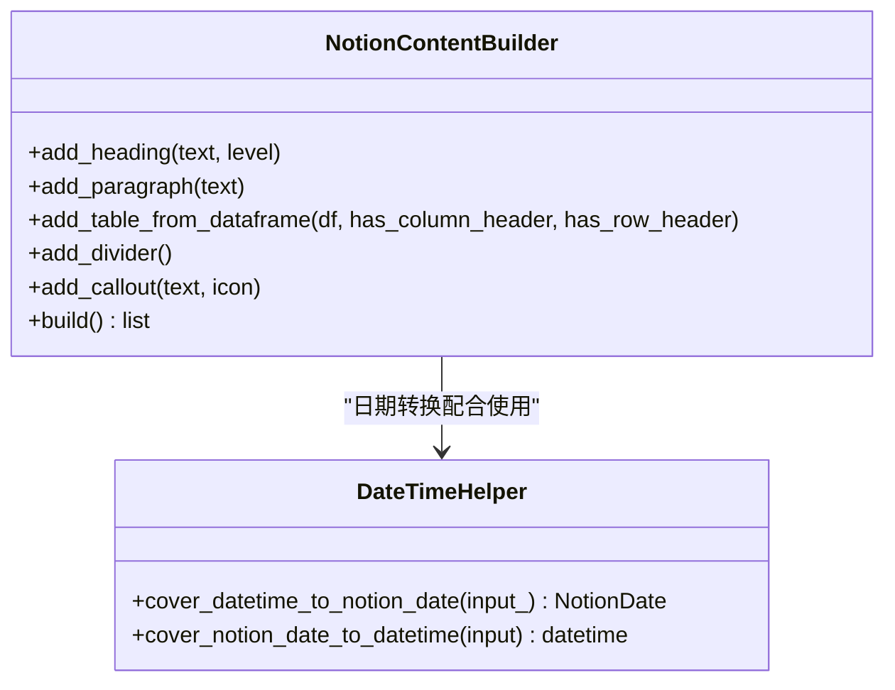
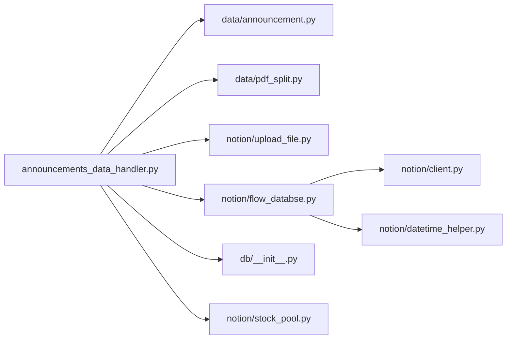

# Notion集成流程

<cite>
**本文引用的文件**
- [main.py](file://main.py)
- [announcements_data_handler.py](file://core/announcements_data_handler.py)
- [flow_databse.py](file://core/notion/flow_databse.py)
- [upload_file.py](file://core/notion/upload_file.py)
- [client.py](file://core/notion/client.py)
- [content_builder.py](file://core/notion/content_builder.py)
- [announcement.py](file://core/data/announcement.py)
- [pdf_split.py](file://core/data/pdf_split.py)
- [stock_pool.py](file://core/notion/stock_pool.py)
- [datetime_helper.py](file://core/notion/datetime_helper.py)
- [__init__.py（数据库）](file://core/db/__init__.py)
- [__init__.py（模型）](file://core/models/__init__.py)
</cite>

## 目录
1. [简介](#简介)
2. [项目结构](#项目结构)
3. [核心组件](#核心组件)
4. [架构总览](#架构总览)
5. [详细组件分析](#详细组件分析)
6. [依赖关系分析](#依赖关系分析)
7. [性能考量](#性能考量)
8. [故障排查指南](#故障排查指南)
9. [结论](#结论)
10. [附录](#附录)

## 简介
本技术文档围绕“Notion集成流程”展开，重点解释以下内容：
- create_dataflow_page 函数的调用过程、页面创建逻辑与数据流集成。
- 如何将处理后的公告数据转换为 Notion 页面，包括字段映射、关系建立与附件关联。
- create_tasks 的创建与并发管理，以及如何确保页面创建的原子性与一致性。
- 与 Notion 数据库的交互模式与最佳实践。
- 提供基于仓库实际代码的流程图、时序图与类图，帮助读者快速理解与落地。

## 项目结构
该项目采用按功能域划分的模块化组织方式，核心路径如下：
- 核心业务层：core/data、core/db、core/models
- Notion 集成层：core/notion
- 应用入口：main.py

图表来源
- [main.py](file://main.py#L20-L39)
- [announcements_data_handler.py](file://core/announcements_data_handler.py#L21-L115)
- [announcement.py](file://core/data/announcement.py#L36-L112)
- [pdf_split.py](file://core/data/pdf_split.py#L15-L73)
- [upload_file.py](file://core/notion/upload_file.py#L28-L61)
- [flow_databse.py](file://core/notion/flow_databse.py#L25-L66)
- [client.py](file://core/notion/client.py#L1-L6)
- [datetime_helper.py](file://core/notion/datetime_helper.py#L12-L38)
- [stock_pool.py](file://core/notion/stock_pool.py#L23-L51)
- [__init__.py（数据库）](file://core/db/__init__.py#L62-L94)
- [content_builder.py](file://core/notion/content_builder.py#L1-L103)

章节来源
- [main.py](file://main.py#L1-L40)
- [announcements_data_handler.py](file://core/announcements_data_handler.py#L1-L116)

## 核心组件
- 应用入口与调度：main.py 中的异步主程序负责初始化数据库、拉取股票池、并触发公告数据处理流程。
- 公告数据处理：announcements_data_handler.py 负责分组请求、并发抓取、PDF分割、文件上传与页面创建。
- Notion 页面创建：flow_databse.py 的 create_dataflow_page 负责构造属性与内容块，调用 Notion API 创建页面。
- 文件上传：upload_file.py 支持本地与外链两种上传模式，内置轮询与分片策略。
- 数据源与模型：stock_pool.py 提供股票池读取；models/__init__.py 定义 NotionDate 类型别名；datetime_helper.py 统一日期转换。
- 数据持久化：db/__init__.py 提供 SQLite 异步连接、更新时间记录与去重哈希存储。

章节来源
- [main.py](file://main.py#L20-L39)
- [announcements_data_handler.py](file://core/announcements_data_handler.py#L21-L115)
- [flow_databse.py](file://core/notion/flow_databse.py#L25-L66)
- [upload_file.py](file://core/notion/upload_file.py#L28-L179)
- [stock_pool.py](file://core/notion/stock_pool.py#L23-L51)
- [datetime_helper.py](file://core/notion/datetime_helper.py#L12-L38)
- [__init__.py（数据库）](file://core/db/__init__.py#L62-L217)
- [__init__.py（模型）](file://core/models/__init__.py#L1-L8)

## 架构总览
下图展示了从入口到页面创建的端到端流程，涵盖并发抓取、PDF分割、文件上传与页面创建的关键节点。

图表来源
- [main.py](file://main.py#L20-L39)
- [announcements_data_handler.py](file://core/announcements_data_handler.py#L21-L115)
- [announcement.py](file://core/data/announcement.py#L36-L112)
- [pdf_split.py](file://core/data/pdf_split.py#L15-L73)
- [upload_file.py](file://core/notion/upload_file.py#L28-L179)
- [flow_databse.py](file://core/notion/flow_databse.py#L25-L66)
- [client.py](file://core/notion/client.py#L1-L6)

## 详细组件分析

### create_dataflow_page 页面创建流程
- 输入参数与职责
  - 标题、发布时间、来源接口、数据类型、关联股票、附件ID、原文链接、正文内容块。
- 字段映射与关系建立
  - 标题、发布时间、来源接口、数据类型、关联股票分别映射到 Notion 页面属性。
  - 数据类型通过 TYPE_MAPPING 映射到 Notion 的 select id。
  - 关联股票通过 relation 字段建立与股票页面的关系。
- 附件关联
  - 若提供附件 ID，则写入 files 字段，形成附件关联。
- 错误处理
  - 页面创建过程中捕获异常并记录错误日志，避免中断后续任务。

图表来源
- [flow_databse.py](file://core/notion/flow_databse.py#L25-L66)
- [datetime_helper.py](file://core/notion/datetime_helper.py#L12-L25)

章节来源
- [flow_databse.py](file://core/notion/flow_databse.py#L25-L66)
- [datetime_helper.py](file://core/notion/datetime_helper.py#L12-L38)

### 公告数据处理与并发控制
- 分组与批量化
  - 根据已有更新时间对股票分组，减少接口调用次数。
  - 对于无更新时间的股票，统一从一年前开始拉取。
- 并发抓取
  - 使用 asyncio.gather 并发执行多个 get_announcements 请求。
- PDF 分割与上传
  - 小于阈值的文件直接外链上传；大于阈值且命中关键词的文件进行 PDF 分割后再上传。
  - 上传支持本地内容与外链 URL 两种模式，均具备轮询等待与错误记录。
- 页面创建
  - 为每条公告创建独立任务，最终通过 asyncio.gather 并发等待全部完成。

图表来源
- [announcements_data_handler.py](file://core/announcements_data_handler.py#L21-L115)
- [announcement.py](file://core/data/announcement.py#L36-L112)
- [pdf_split.py](file://core/data/pdf_split.py#L15-L73)
- [upload_file.py](file://core/notion/upload_file.py#L28-L179)
- [flow_databse.py](file://core/notion/flow_databse.py#L25-L66)

章节来源
- [announcements_data_handler.py](file://core/announcements_data_handler.py#L21-L115)
- [upload_file.py](file://core/notion/upload_file.py#L28-L179)
- [pdf_split.py](file://core/data/pdf_split.py#L15-L73)

### 文件上传与轮询机制
- 上传模式
  - 外链上传：通过 external_url 模式创建上传任务并轮询状态。
  - 本地上传：下载内容到内存后以二进制流上传，同样轮询状态。
- 分片与重试
  - 采用指数退避策略进行轮询，最多等待固定时长。
  - 成功/失败均记录日志，便于问题定位。
- 结果结构
  - 返回包含文件 ID、成功标志与错误信息的对象列表，便于后续页面创建使用。

图表来源
- [upload_file.py](file://core/notion/upload_file.py#L28-L179)

章节来源
- [upload_file.py](file://core/notion/upload_file.py#L28-L179)

### 数据转换与页面内容构建
- 日期转换
  - 使用 cover_datetime_to_notion_date 将 Python 的 datetime/date 统一转换为 NotionDate 字符串。
- 内容构建器
  - 提供标题、段落、表格、分隔线、Callout 等常用块的构建方法，支持从 DataFrame 快速生成表格。
- 页面内容
  - create_dataflow_page 接收 content 参数，直接作为 children 传入 pages.create，实现富文本内容的嵌入。

图表来源
- [content_builder.py](file://core/notion/content_builder.py#L1-L103)
- [datetime_helper.py](file://core/notion/datetime_helper.py#L12-L38)

章节来源
- [content_builder.py](file://core/notion/content_builder.py#L1-L103)
- [datetime_helper.py](file://core/notion/datetime_helper.py#L12-L38)

### 与 Notion 数据库的交互模式与最佳实践
- 数据库配置
  - 通过环境变量指定目标数据库 ID 与股票池 ID，确保运行时可配置。
- 页面属性设计
  - 使用 select 映射数据类型，relation 建立与股票页面的关系，files 关联附件。
- 并发与幂等
  - 使用 asyncio.gather 并发创建页面，提升吞吐量。
  - 通过数据库记录更新时间与哈希去重，避免重复创建。
- 错误处理
  - 页面创建与文件上传均捕获异常并记录日志，保证流程稳健。

章节来源
- [flow_databse.py](file://core/notion/flow_databse.py#L22-L66)
- [stock_pool.py](file://core/notion/stock_pool.py#L33-L51)
- [__init__.py（数据库）](file://core/db/__init__.py#L153-L217)

## 依赖关系分析
- 模块耦合
  - announcements_data_handler.py 是核心编排模块，向上依赖 data 层与 notion 层，向下依赖 db 层。
  - flow_databse.py 与 upload_file.py 依赖 notion/client.py 提供的异步客户端。
- 外部依赖
  - Notion SDK（AsyncClient）、HTTP 客户端、PDF 处理库、SQLite 异步驱动。
- 循环依赖
  - 未发现循环导入；各模块职责清晰，接口边界明确。

图表来源
- [announcements_data_handler.py](file://core/announcements_data_handler.py#L1-L16)
- [announcement.py](file://core/data/announcement.py#L1-L141)
- [pdf_split.py](file://core/data/pdf_split.py#L1-L128)
- [upload_file.py](file://core/notion/upload_file.py#L1-L180)
- [flow_databse.py](file://core/notion/flow_databse.py#L1-L67)
- [client.py](file://core/notion/client.py#L1-L6)
- [datetime_helper.py](file://core/notion/datetime_helper.py#L1-L39)
- [__init__.py（数据库）](file://core/db/__init__.py#L1-L218)
- [stock_pool.py](file://core/notion/stock_pool.py#L1-L52)

章节来源
- [announcements_data_handler.py](file://core/announcements_data_handler.py#L1-L16)
- [flow_databse.py](file://core/notion/flow_databse.py#L1-L67)
- [upload_file.py](file://core/notion/upload_file.py#L1-L180)
- [client.py](file://core/notion/client.py#L1-L6)
- [__init__.py（数据库）](file://core/db/__init__.py#L1-L218)

## 性能考量
- 并发抓取与上传
  - 使用 asyncio.gather 并发执行多个任务，显著降低总耗时。
- 批量分组
  - 对有更新时间的股票按日期分组，减少接口调用次数。
- PDF 分片
  - 大文件按固定页数切分，避免单次上传过大导致失败或超时。
- 轮询退避
  - 指数退避策略平衡了响应速度与服务端压力。
- 数据库去重
  - 通过哈希校验避免重复创建页面，减少无效调用。

[本节为通用性能建议，无需列出章节来源]

## 故障排查指南
- 页面创建失败
  - 检查 create_dataflow_page 的异常捕获日志，确认属性映射与数据库 ID 是否正确。
  - 确认数据类型映射表与关联股票 ID 是否有效。
- 文件上传失败
  - 查看 upload_file 的轮询日志，确认状态是否为 failed；关注错误信息中的导入结果。
  - 对于外链上传，检查 URL 可达性；对于本地上传，检查网络与内存限制。
- 并发任务卡住
  - 确认 asyncio.gather 的任务列表是否完整；检查是否有异常未被捕获。
- 数据库记录异常
  - 检查 update_records 与 hash 表是否存在；确认初始化脚本是否执行。

章节来源
- [flow_databse.py](file://core/notion/flow_databse.py#L59-L66)
- [upload_file.py](file://core/notion/upload_file.py#L153-L176)
- [__init__.py（数据库）](file://core/db/__init__.py#L62-L94)

## 结论
本集成流程通过“并发抓取 + PDF 分割 + 附件上传 + 页面创建”的闭环，实现了从公告数据到 Notion 页面的自动化集成。通过统一的日期转换、属性映射与错误处理机制，保障了流程的稳定性与可维护性。建议在生产环境中结合数据库去重与合理的并发度配置，持续优化吞吐与可靠性。

[本节为总结性内容，无需列出章节来源]

## 附录
- 关键实现参考路径
  - 页面创建：[create_dataflow_page](file://core/notion/flow_databse.py#L25-L66)
  - 并发处理：[process_announcements_data_for_stock_list](file://core/announcements_data_handler.py#L21-L115)
  - 文件上传：[upload_files_with_url](file://core/notion/upload_file.py#L40-L61)、[upload_files_with_local](file://core/notion/upload_file.py#L28-L37)
  - PDF 分割：[split_pdf](file://core/data/pdf_split.py#L15-L73)
  - 日期转换：[cover_datetime_to_notion_date](file://core/notion/datetime_helper.py#L12-L25)
  - 股票池读取：[get_stock_pool](file://core/notion/stock_pool.py#L23-L51)
  - 数据库初始化与记录：[init_db](file://core/db/__init__.py#L62-L94)、[get_update_time](file://core/db/__init__.py#L153-L185)、[set_update_time](file://core/db/__init__.py#L188-L215)

[本节为补充说明，无需列出章节来源]