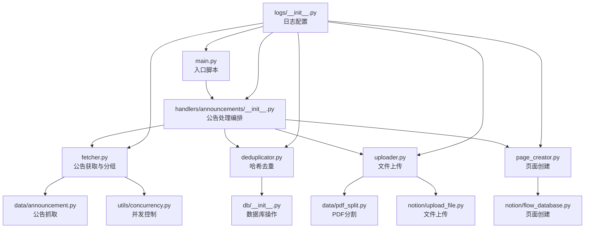
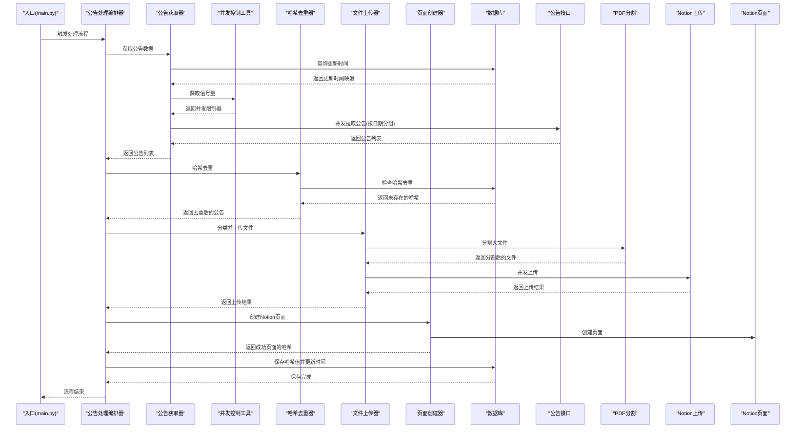
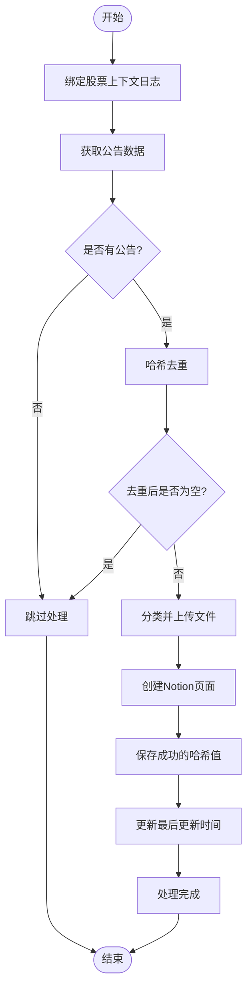
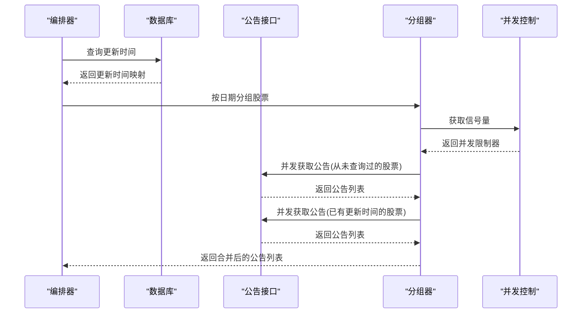
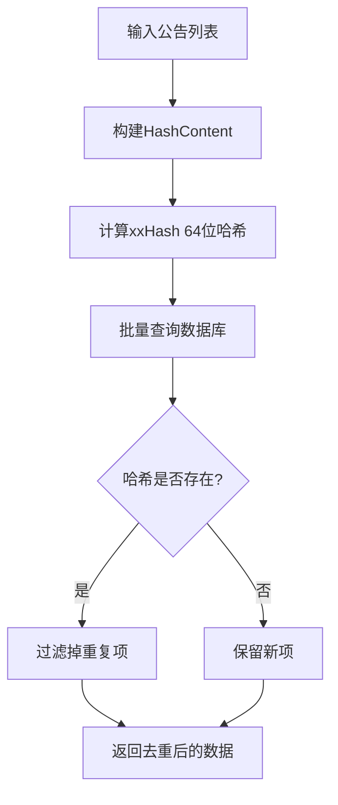
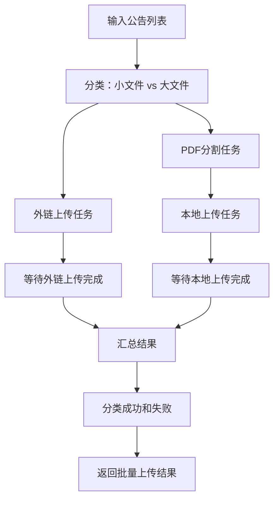
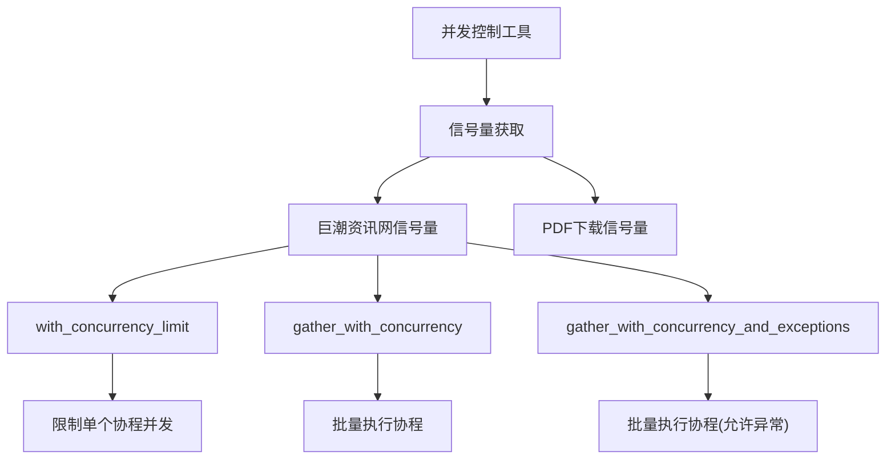
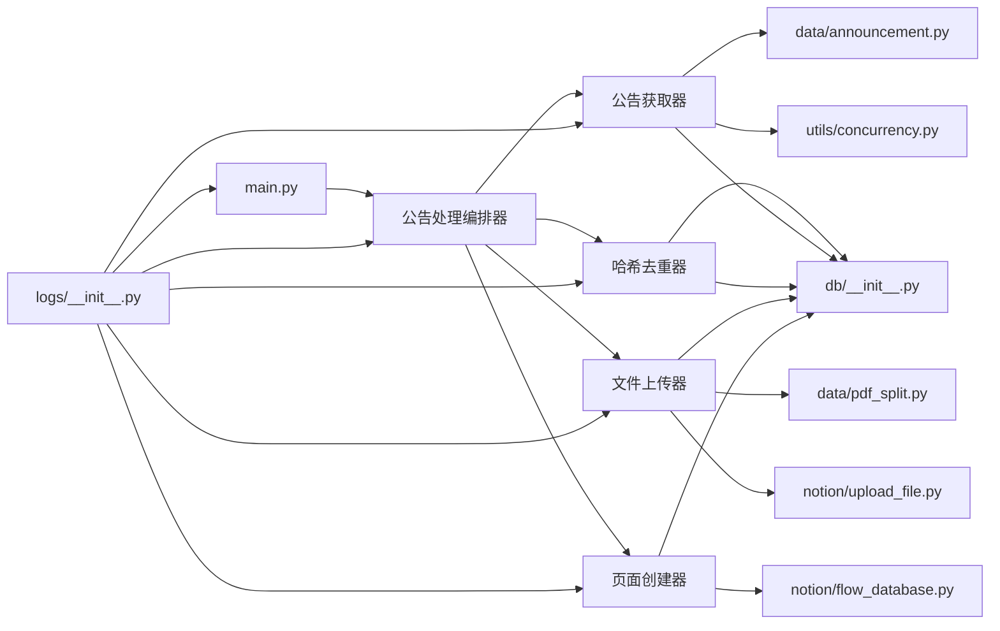

# 公告数据处理模块

<cite>
**本文档引用的文件**
- [core/handlers/announcements/__init__.py](file://core/handlers/announcements/__init__.py)
- [core/handlers/announcements/fetcher.py](file://core/handlers/announcements/fetcher.py)
- [core/handlers/announcements/deduplicator.py](file://core/handlers/announcements/deduplicator.py)
- [core/handlers/announcements/uploader.py](file://core/handlers/announcements/uploader.py)
- [core/handlers/announcements/page_creator.py](file://core/handlers/announcements/page_creator.py)
- [core/data/announcement.py](file://core/data/announcement.py)
- [core/data/pdf_split.py](file://core/data/pdf_split.py)
- [core/db/__init__.py](file://core/db/__init__.py)
- [core/models/announcement.py](file://core/models/announcement.py)
- [core/models/upload.py](file://core/models/upload.py)
- [core/notion/upload_file.py](file://core/notion/upload_file.py)
- [core/notion/flow_database.py](file://core/notion/flow_database.py)
- [core/notion/datetime_helper.py](file://core/notion/datetime_helper.py)
- [core/notion/stock_pool.py](file://core/notion/stock_pool.py)
- [core/utils/concurrency.py](file://core/utils/concurrency.py)
- [core/logs/__init__.py](file://core/logs/__init__.py)
- [main.py](file://main.py)
</cite>

## 更新摘要
**变更内容**
- 引入新的并发控制机制，使用信号量限制巨潮资讯网API并发请求
- 改进错误处理和日志记录，支持异常返回而非抛出
- 增加超时配置，优化HTTP客户端性能
- 改进消息格式，提供更清晰的错误信息
- 新增统一的并发控制工具模块

## 目录
1. [简介](#简介)
2. [项目结构](#项目结构)
3. [核心组件](#核心组件)
4. [架构总览](#架构总览)
5. [详细组件分析](#详细组件分析)
6. [依赖关系分析](#依赖关系分析)
7. [性能考量](#性能考量)
8. [故障排查指南](#故障排查指南)
9. [结论](#结论)
10. [附录](#附录)

## 简介
本模块负责从巨潮资讯网抓取上市公司公告，进行增量更新、并发拉取、PDF分割与上传，并最终在Notion数据流数据库中创建页面。新架构采用模块化设计，将公告处理流程分解为专门的处理器，提供更好的可维护性和扩展性。其关键特性包括：
- 模块化架构：采用专门的处理器模块，职责清晰，便于独立开发和测试
- 增量更新策略：基于数据库记录的"最后更新时间"，仅拉取自上次以来新增的公告，避免重复抓取
- 并发处理机制：使用异步并发拉取公告、上传文件与创建页面，显著提升吞吐量
- 智能分组算法：按"最后更新时间"对股票进行分组，合并同一天更新的股票请求，减少接口调用次数
- 哈希去重功能：基于内容的重复数据检测和过滤，通过计算公告的哈希值来识别重复内容，显著提升数据处理效率和准确性
- 智能PDF分割：针对大体积PDF按页数进行分块，避免单文件过大导致Notion导入失败
- 与数据库、PDF处理、Notion集成模块的协同工作：统一维护更新时间、处理文件上传与页面创建
- **精确的日志记录机制**：确保错误日志仅在实际失败时才生成，避免误报和噪音，提高系统错误报告的准确性
- **统一的并发控制**：通过信号量机制限制外部API请求并发数，防止资源耗尽和网络拥塞

## 项目结构
新架构采用模块化分层组织，核心目录结构如下：
- core/handlers/announcements：公告处理编排模块，包含专门的处理器
- core/data：公告抓取与PDF分割逻辑
- core/db：SQLite异步数据库封装与更新时间管理，包含哈希去重功能
- core/notion：Notion客户端、文件上传、页面创建与时间转换
- core/utils：统一并发控制工具，提供信号量和并发限制功能
- core/models：类型定义（如AnnouncementWithHash、FileUploadResult）
- core/logs：日志配置与追踪机制
- main.py：入口脚本，初始化数据库并触发公告处理流程

**图表来源**
- [main.py](file://main.py#L24-L37)
- [core/handlers/announcements/__init__.py](file://core/handlers/announcements/__init__.py#L19-L66)
- [core/handlers/announcements/fetcher.py](file://core/handlers/announcements/fetcher.py#L20-L82)
- [core/handlers/announcements/deduplicator.py](file://core/handlers/announcements/deduplicator.py#L13-L60)
- [core/handlers/announcements/uploader.py](file://core/handlers/announcements/uploader.py#L37-L114)
- [core/handlers/announcements/page_creator.py](file://core/handlers/announcements/page_creator.py#L15-L64)
- [core/utils/concurrency.py](file://core/utils/concurrency.py#L28-L55)
- [core/logs/__init__.py](file://core/logs/__init__.py#L45-L90)

**章节来源**
- [main.py](file://main.py#L24-L37)
- [core/handlers/announcements/__init__.py](file://core/handlers/announcements/__init__.py#L1-L70)

## 核心组件
- **公告处理编排器**：负责协调数据获取、去重、上传和页面创建的完整流程
- **公告获取器**：对接巨潮资讯网接口，支持分页拉取与标题过滤，按更新时间分组并发获取
- **哈希去重器**：基于xxHash算法的内容去重，通过计算公告的唯一标识来检测重复数据
- **文件上传器**：根据文件大小和标题关键词进行智能分类，支持外链上传和本地分割上传
- **页面创建器**：为上传成功的公告文件创建Notion数据流页面
- **公告抓取**：对接巨潮资讯网接口，支持分页拉取与标题过滤
- **PDF分割**：根据页数阈值进行分块，避免单文件过大
- **数据库**：维护各股票的"最后更新时间"和哈希值，用于增量更新和去重
- **Notion集成**：文件上传（外链与本地）、页面创建、时间转换
- **并发控制工具**：提供统一的信号量管理和并发限制功能
- **日志系统**：使用Loguru框架提供结构化日志输出，支持控制台彩色显示和文件持久化
- **时间辅助**：统一日期/时间与Notion日期格式的转换
- **统一的并发控制**：通过信号量机制限制外部API请求并发数，防止资源耗尽

**章节来源**
- [core/handlers/announcements/__init__.py](file://core/handlers/announcements/__init__.py#L19-L66)
- [core/handlers/announcements/fetcher.py](file://core/handlers/announcements/fetcher.py#L20-L82)
- [core/handlers/announcements/deduplicator.py](file://core/handlers/announcements/deduplicator.py#L13-L60)
- [core/handlers/announcements/uploader.py](file://core/handlers/announcements/uploader.py#L37-L114)
- [core/handlers/announcements/page_creator.py](file://core/handlers/announcements/page_creator.py#L15-L64)
- [core/utils/concurrency.py](file://core/utils/concurrency.py#L28-L55)

## 架构总览
下图展示了新的模块化架构中各子系统的调用关系与数据流向：

**图表来源**
- [main.py](file://main.py#L24-L37)
- [core/handlers/announcements/__init__.py](file://core/handlers/announcements/__init__.py#L19-L66)
- [core/handlers/announcements/fetcher.py](file://core/handlers/announcements/fetcher.py#L20-L82)
- [core/utils/concurrency.py](file://core/utils/concurrency.py#L28-L55)
- [core/handlers/announcements/deduplicator.py](file://core/handlers/announcements/deduplicator.py#L13-L60)
- [core/handlers/announcements/uploader.py](file://core/handlers/announcements/uploader.py#L37-L114)
- [core/handlers/announcements/page_creator.py](file://core/handlers/announcements/page_creator.py#L15-L64)

## 详细组件分析

### 公告处理编排器
新的公告处理编排器是整个流程的核心协调者，负责：
- **完整的处理流程编排**：获取公告 -> 哈希去重 -> 文件上传 -> 创建Notion页面 -> 保存哈希和更新时间
- **任务上下文绑定**：使用logger.bind()为每个任务绑定股票代码上下文，便于追踪
- **错误处理与日志记录**：仅在实际失败时才记录错误日志，避免误报
- **更新时间管理**：处理完成后更新每只股票的最后更新时间

**图表来源**
- [core/handlers/announcements/__init__.py](file://core/handlers/announcements/__init__.py#L19-L66)

**章节来源**
- [core/handlers/announcements/__init__.py](file://core/handlers/announcements/__init__.py#L19-L66)

### 公告获取器
负责从数据库获取更新时间、按日期分组股票、并发获取公告数据：
- **更新时间查询**：获取各股票的最后更新时间，支持缺失记录的初始化
- **智能分组策略**：从未查询过的股票从一年前开始，已有更新时间的股票按日期分组合并查询
- **并发处理**：使用`gather_with_concurrency_and_exceptions()`并发执行多个获取任务，支持异常处理
- **数据过滤**：过滤掉摘要、英文版、图文版等非正文类型
- **统一的并发控制**：通过`get_cninfo_semaphore()`获取信号量，限制巨潮资讯网API并发请求

**更新** 新增了统一的并发控制机制，使用信号量限制API请求并发数，防止资源耗尽

**图表来源**
- [core/handlers/announcements/fetcher.py](file://core/handlers/announcements/fetcher.py#L20-L82)
- [core/utils/concurrency.py](file://core/utils/concurrency.py#L28-L55)

**章节来源**
- [core/handlers/announcements/fetcher.py](file://core/handlers/announcements/fetcher.py#L20-L82)

### 哈希去重器
基于xxHash算法对公告进行去重，返回数据库中尚不存在的公告列表：
- **哈希内容构建**：使用"股票代码-公告ID-标题"的组合字符串作为哈希内容
- **批量去重检查**：计算所有待检查数据的哈希值并在数据库中查询已存在的哈希值
- **数据过滤**：仅保留数据库中尚不存在的公告，保持数据一致性
- **性能优化**：使用xxHash算法提供高性能的哈希计算

**图表来源**
- [core/handlers/announcements/deduplicator.py](file://core/handlers/announcements/deduplicator.py#L13-L60)

**章节来源**
- [core/handlers/announcements/deduplicator.py](file://core/handlers/announcements/deduplicator.py#L13-L60)

### 文件上传器
负责将公告按大小/关键词分类，分别通过外链和本地上传两种方式上传到Notion：
- **智能分类策略**：小文件且不含关键词 -> 外链上传；大文件或含关键词 -> PDF分割后本地上传
- **并发上传**：外链上传和本地上传分别并发执行，提高整体效率
- **结果分类**：将上传结果分为成功和失败两组，支持本地上传的分块完整性检查
- **配置参数**：支持自定义分割关键词列表和文件大小阈值

**图表来源**
- [core/handlers/announcements/uploader.py](file://core/handlers/announcements/uploader.py#L37-L114)

**章节来源**
- [core/handlers/announcements/uploader.py](file://core/handlers/announcements/uploader.py#L37-L114)

### 页面创建器
为上传成功的公告文件创建Notion数据流页面：
- **批量页面创建**：为每个上传成功的文件创建对应的Notion页面
- **属性映射**：统一设置标题、发布时间、来源接口、数据类型、关联股票与附件等属性
- **成功收集**：收集成功创建页面对应的唯一hash_content，支持PDF分割的去重
- **结果统计**：统计成功和失败的数量，提供详细的日志信息

**章节来源**
- [core/handlers/announcements/page_creator.py](file://core/handlers/announcements/page_creator.py#L15-L64)

### 公告抓取组件
- **接口地址与参数构造**：支持多股票合并查询、日期范围筛选、分页拉取
- **数据清洗**：过滤掉摘要、英文版、图文版等非正文类型
- **结果映射**：将接口返回映射为Announcement数据类，包含公告ID、股票代码、标题、大小、URL与发布时间
- **超时配置**：使用30秒超时设置，避免长时间阻塞
- **改进的错误处理**：捕获HTTP状态错误并返回空列表，避免中断后续流程

**更新** 新增了超时配置和改进的错误处理机制

**章节来源**
- [core/data/announcement.py](file://core/data/announcement.py#L64-L161)

### PDF分割组件
- **分割策略**：若页数不超过阈值，直接作为整体处理并保留原大小；若超过阈值，按固定块大小进行分块，重叠一定页数以避免跨页截断
- **错误处理**：分割失败时保留原始公告，避免中断后续流程
- **输出**：返回包含原始公告与分割后公告的新列表，便于后续上传与页面创建

**章节来源**
- [core/data/pdf_split.py](file://core/data/pdf_split.py#L25-L99)

### 数据库组件
- **更新时间管理**：提供查询与更新"最后更新时间"的能力，支持缺失记录的初始化
- **哈希去重功能**：提供check_hash方法：计算数据列表的哈希值并检查数据库中是否存在；提供save_hash方法：批量保存哈希值到数据库
- **数据库模型**：新增HashContent和HashContentWithHash数据类，支持更清晰的数据结构

**章节来源**
- [core/db/__init__.py](file://core/db/__init__.py#L110-L150)
- [core/db/__init__.py](file://core/db/__init__.py#L152-L218)

### Notion集成组件
- **文件上传**：支持外链与本地两种模式，均采用并发上传与轮询等待完成；轮询采用指数退避策略
- **页面创建**：统一属性映射，包括标题、发布时间、来源接口、数据类型、关联股票与附件等
- **时间转换**：将Python的datetime/date转换为Notion日期格式，确保时区一致

**章节来源**
- [core/notion/upload_file.py](file://core/notion/upload_file.py#L17-L72)
- [core/notion/flow_database.py](file://core/notion/flow_database.py#L53-L116)

### 并发控制工具
**新增** 统一的并发控制模块，提供信号量管理和并发限制功能：
- **信号量管理**：提供巨潮资讯网API和PDF下载的信号量实例
- **并发限制**：通过`with_concurrency_limit()`函数限制协程执行
- **批量并发**：通过`gather_with_concurrency()`和`gather_with_concurrency_and_exceptions()`批量执行协程
- **配置参数**：巨潮资讯网API最大并发数为5，PDF下载最大并发数为3
- **异常处理**：`gather_with_concurrency_and_exceptions()`允许异常返回，避免中断整个批次

**更新** 新增了统一的并发控制机制，解决了并发请求过多的问题

**图表来源**
- [core/utils/concurrency.py](file://core/utils/concurrency.py#L28-L55)
- [core/utils/concurrency.py](file://core/utils/concurrency.py#L78-L110)

**章节来源**
- [core/utils/concurrency.py](file://core/utils/concurrency.py#L28-L55)

### 日志系统
- **结构化日志配置**：使用Loguru框架提供彩色控制台输出和JSON文件持久化
- **任务上下文绑定**：使用logger.bind()为每个任务绑定股票代码等上下文信息
- **错误日志优化**：仅在实际失败时才生成错误日志，避免误报；通过条件判断确保错误日志的准确性和及时性
- **追踪机制**：支持trace_id追踪，便于并发场景下的问题排查

**更新** 改进了日志记录机制，提供更清晰的消息格式和追踪能力

**章节来源**
- [core/handlers/announcements/__init__.py](file://core/handlers/announcements/__init__.py#L29-L30)
- [core/handlers/announcements/uploader.py](file://core/handlers/announcements/uploader.py#L147-L148)
- [core/logs/__init__.py](file://core/logs/__init__.py#L45-L90)

### 时间辅助组件
- **日期/时间与Notion日期格式的双向转换**：确保跨模块时间一致性
- **固定时区处理**：避免跨时区差异带来的排序与显示问题

**章节来源**
- [core/notion/datetime_helper.py](file://core/notion/datetime_helper.py#L13-L37)

## 依赖关系分析
新架构的模块间依赖关系更加清晰，职责分离明确：
- **编排器依赖**：公告处理编排器依赖所有专门的处理器模块
- **处理器内聚**：每个处理器模块内部职责单一，相互之间依赖较少
- **数据传递**：通过标准化的数据类（如AnnouncementWithHash、FileUploadResult）在模块间传递数据
- **外部依赖**：HTTP客户端、PDF处理库、Notion SDK、xxHash库、Loguru等
- **并发控制**：fetcher模块依赖并发控制工具模块，提供统一的并发限制

**图表来源**
- [main.py](file://main.py#L24-L37)
- [core/handlers/announcements/__init__.py](file://core/handlers/announcements/__init__.py#L13-L16)
- [core/handlers/announcements/fetcher.py](file://core/handlers/announcements/fetcher.py#L12-L17)
- [core/utils/concurrency.py](file://core/utils/concurrency.py#L28-L55)
- [core/logs/__init__.py](file://core/logs/__init__.py#L45-L90)

**章节来源**
- [main.py](file://main.py#L24-L37)
- [core/handlers/announcements/__init__.py](file://core/handlers/announcements/__init__.py#L13-L16)

## 性能考量
新架构在性能方面有显著提升：
- **模块化并发**：每个处理器模块都可以独立优化并发策略
- **智能分组**：按"最后更新时间"分组，合并同一天的股票请求，减少接口调用次数
- **哈希去重优化**：批量计算哈希值，减少数据库查询次数；使用xxHash算法提供高性能的哈希计算
- **PDF分割优化**：合理的块大小与重叠页数配置，平衡分割粒度与上传效率
- **数据库访问优化**：使用异步上下文管理器与连接复用，避免频繁打开/关闭连接
- **轮询策略优化**：指数退避可有效缓解Notion导入压力，但需注意最大等待时间与失败重试上限
- **日志性能优化**：使用结构化日志减少格式化开销；通过条件判断避免不必要的日志输出
- **统一并发控制**：通过信号量限制API请求并发数，防止资源耗尽和网络拥塞
- **超时配置优化**：合理的超时设置避免长时间阻塞，提高系统响应性

**更新** 新增了统一的并发控制和超时配置，进一步提升了系统性能和稳定性

## 故障排查指南
针对新架构的故障排查：
- **公告抓取失败**：检查接口返回与分页逻辑，确认日期范围与股票列表格式；关注过滤规则是否误删正文类型；检查超时配置是否合理
- **哈希去重异常**：检查哈希计算是否正常，确认内容序列化的一致性；验证数据库中hash表的结构和索引是否正确
- **PDF分割失败**：查看日志输出，确认网络与磁盘权限；必要时降级为不分割直接上传
- **文件上传失败**：检查外链有效性与本地下载权限；查看轮询返回的错误信息；确认重试机制是否正常工作
- **页面创建失败**：核对必需属性（标题、发布时间、数据类型、关联股票、附件ID）是否完整
- **更新时间异常**：确认数据库表结构与初始化流程；检查Notion日期格式转换是否正确
- **模块通信问题**：检查数据类的序列化和反序列化是否正确；验证模块间的依赖关系
- **并发控制问题**：检查信号量配置是否合理；确认并发限制是否生效
- **日志追踪问题**：检查trace_id是否正确设置；确认日志级别配置是否正确

**更新** 新增了并发控制和日志追踪相关的故障排查指导

**章节来源**
- [core/handlers/announcements/fetcher.py](file://core/handlers/announcements/fetcher.py#L77-L78)
- [core/handlers/announcements/uploader.py](file://core/handlers/announcements/uploader.py#L147-L148)
- [core/handlers/announcements/page_creator.py](file://core/handlers/announcements/page_creator.py#L60-L62)
- [core/utils/concurrency.py](file://core/utils/concurrency.py#L28-L55)
- [core/logs/__init__.py](file://core/logs/__init__.py#L21-L37)

## 结论
新架构通过模块化设计实现了公告数据处理流程的重构，提供了更好的可维护性、扩展性和性能表现。模块化的处理器设计使得每个组件职责清晰，便于独立开发和测试。新增的哈希去重功能、智能分组策略和并发处理机制显著提升了数据处理效率和准确性。改进的日志记录与错误处理机制确保了系统的稳定性和可观测性。**新增的统一并发控制机制**有效防止了外部API请求过多导致的资源耗尽问题，**超时配置**提高了系统的响应性和稳定性。**更清晰的消息格式**和**追踪机制**为故障排查提供了更好的支持。这种设计为未来的功能扩展和性能优化奠定了良好的基础。

## 附录

### 关键配置与参数说明
- **SPLIT_KEYWORDS**：用于识别需要分割的大文件的标题关键词集合，默认包含"年度报告"、"年报"、"中期"
- **CHUNK_SIZE**：PDF分块大小阈值，默认20页，影响分割粒度与上传效率
- **REP_SIZE**：分块重叠页数，默认2页，避免跨页截断
- **SIZE_THRESHOLD**：文件大小阈值（KB），超过则触发分割上传，默认200KB
- **轮询间隔**：指数退避策略，逐步延长等待时间直至完成或超时
- **哈希去重配置**：通过xxHash算法提供高性能的内容去重，支持批量哈希计算和查询
- **日志配置**：支持INFO级别的应用日志和ERROR级别的错误日志分离输出
- **并发控制配置**：巨潮资讯网API最大并发数为5，PDF下载最大并发数为3
- **超时配置**：HTTP客户端超时设置为30秒，连接超时为10秒

**更新** 新增了并发控制和超时配置参数说明

**章节来源**
- [core/handlers/announcements/uploader.py](file://core/handlers/announcements/uploader.py#L20-L21)
- [core/data/pdf_split.py](file://core/data/pdf_split.py#L18-L22)
- [core/notion/upload_file.py](file://core/notion/upload_file.py#L28-L72)
- [core/utils/concurrency.py](file://core/utils/concurrency.py#L15-L21)
- [core/data/announcement.py](file://core/data/announcement.py#L115-L116)

### 模块化架构优势
- **职责分离**：每个处理器模块专注于特定功能，代码更清晰易维护
- **独立测试**：可以独立测试每个处理器模块，提高测试覆盖率
- **扩展性强**：新增功能时只需添加新的处理器模块，不影响现有代码
- **性能优化**：可以针对特定模块进行性能优化，而不影响其他模块
- **错误隔离**：单个模块的故障不会影响整个处理流程
- **并发控制统一**：通过统一的并发控制工具管理所有外部API请求
- **日志追踪完善**：支持trace_id追踪，便于并发场景下的问题排查

**更新** 新增了并发控制和日志追踪方面的架构优势

**章节来源**
- [core/handlers/announcements/__init__.py](file://core/handlers/announcements/__init__.py#L19-L66)
- [core/handlers/announcements/fetcher.py](file://core/handlers/announcements/fetcher.py#L20-L82)
- [core/handlers/announcements/deduplicator.py](file://core/handlers/announcements/deduplicator.py#L13-L60)
- [core/handlers/announcements/uploader.py](file://core/handlers/announcements/uploader.py#L37-L114)
- [core/handlers/announcements/page_creator.py](file://core/handlers/announcements/page_creator.py#L15-L64)
- [core/utils/concurrency.py](file://core/utils/concurrency.py#L28-L55)
- [core/logs/__init__.py](file://core/logs/__init__.py#L21-L37)