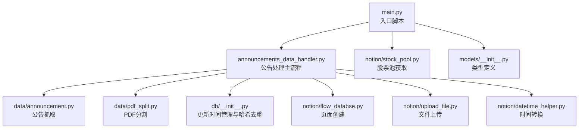
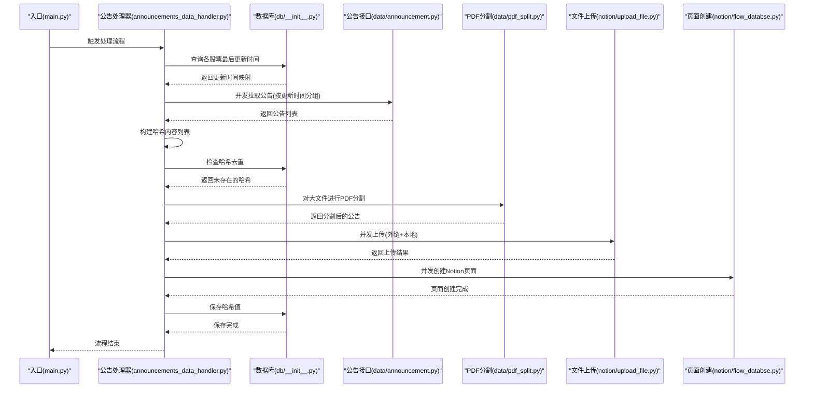
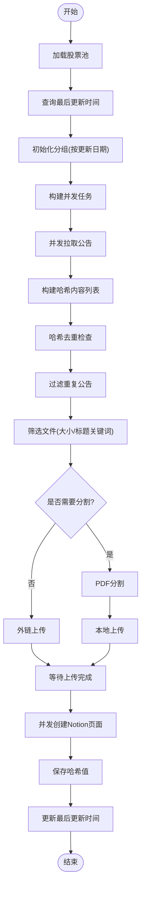
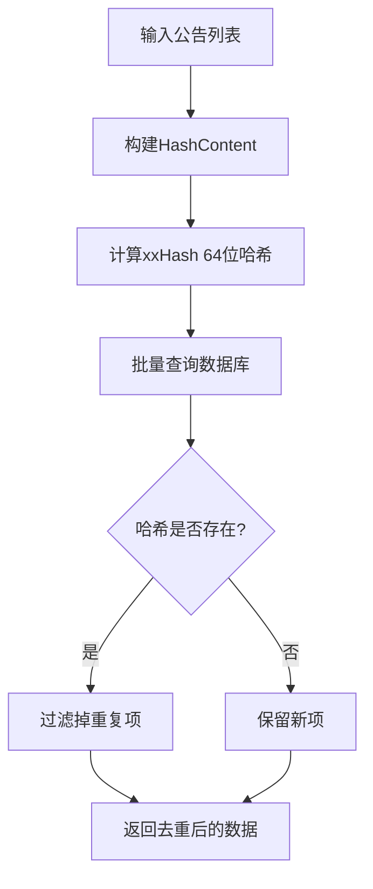
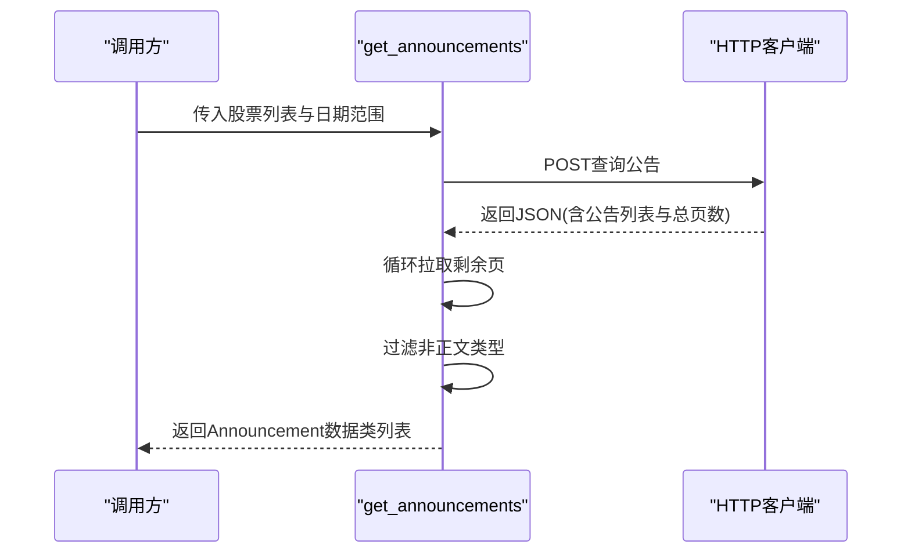
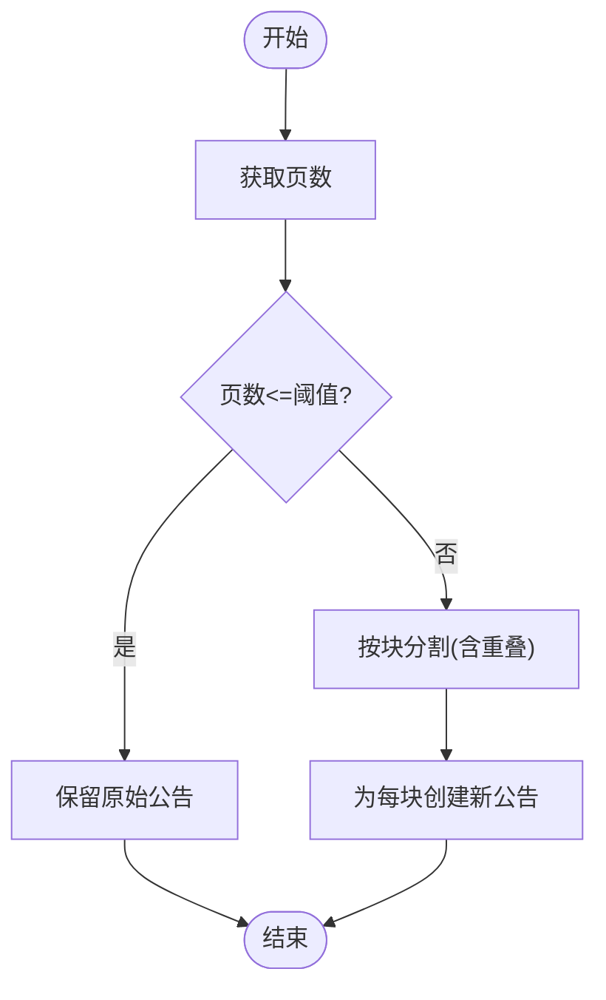
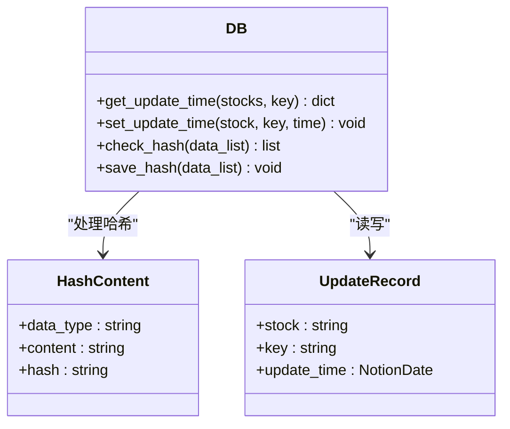
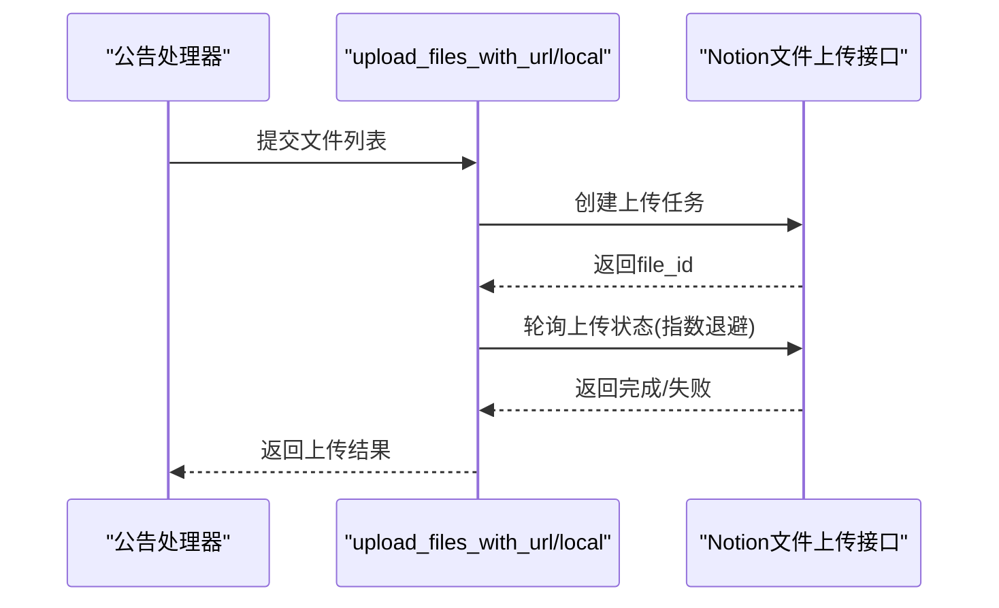
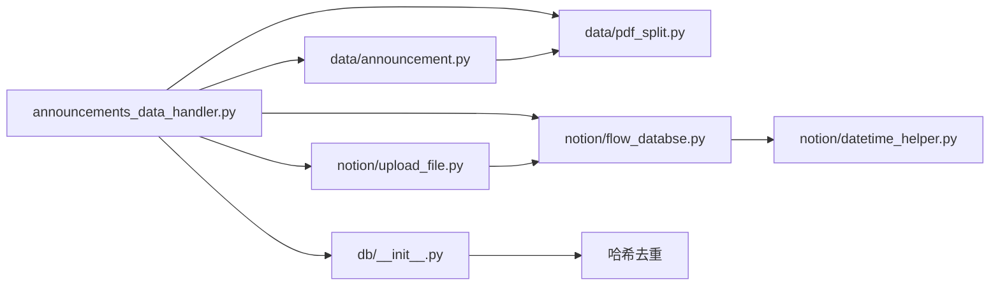

# 公告数据处理模块

<cite>
**本文档引用的文件**
- [core/announcements_data_handler.py](file://core/announcements_data_handler.py)
- [core/data/announcement.py](file://core/data/announcement.py)
- [core/data/pdf_split.py](file://core/data/pdf_split.py)
- [core/db/__init__.py](file://core/db/__init__.py)
- [core/db/models.py](file://core/db/models.py)
- [core/notion/flow_databse.py](file://core/notion/flow_databse.py)
- [core/notion/upload_file.py](file://core/notion/upload_file.py)
- [core/notion/datetime_helper.py](file://core/notion/datetime_helper.py)
- [core/notion/stock_pool.py](file://core/notion/stock_pool.py)
- [core/models/__init__.py](file://core/models/__init__.py)
- [main.py](file://main.py)
</cite>

## 更新摘要
**变更内容**
- 从NamedTuple迁移到dataclass，提升类型安全性与可读性
- 增强错误处理和日志记录机制
- 改进并发处理与任务调度
- 优化哈希去重与数据库交互

## 目录
1. [简介](#简介)
2. [项目结构](#项目结构)
3. [核心组件](#核心组件)
4. [架构总览](#架构总览)
5. [详细组件分析](#详细组件分析)
6. [依赖关系分析](#依赖关系分析)
7. [性能考量](#性能考量)
8. [故障排查指南](#故障排查指南)
9. [结论](#结论)
10. [附录](#附录)

## 简介
本模块负责从巨潮资讯网抓取上市公司公告，进行增量更新、并发拉取、PDF分割与上传，并最终在Notion数据流数据库中创建页面。其关键特性包括：
- 增量更新策略：基于数据库记录的"最后更新时间"，仅拉取自上次以来新增的公告，避免重复抓取。
- 并发处理机制：使用异步并发拉取公告、上传文件与创建页面，显著提升吞吐量。
- 智能分组算法：按"最后更新时间"对股票进行分组，合并同一天更新的股票请求，减少接口调用次数。
- 哈希去重功能：基于内容的重复数据检测和过滤，通过计算公告的哈希值来识别重复内容，显著提升数据处理效率和准确性。
- 智能PDF分割：针对大体积PDF按页数进行分块，避免单文件过大导致Notion导入失败。
- 与数据库、PDF处理、Notion集成模块的协同工作：统一维护更新时间、处理文件上传与页面创建。

## 项目结构
模块采用按功能分层组织，核心目录如下：
- core/data：公告抓取与PDF分割逻辑
- core/db：SQLite异步数据库封装与更新时间管理，包含哈希去重功能
- core/notion：Notion客户端、文件上传、页面创建与时间转换
- core/models：类型定义（如NotionDate）
- main.py：入口脚本，初始化数据库并触发公告处理流程

**图表来源**
- [main.py](file://main.py#L20-L36)
- [core/announcements_data_handler.py](file://core/announcements_data_handler.py#L21-L157)
- [core/data/announcement.py](file://core/data/announcement.py#L36-L141)
- [core/data/pdf_split.py](file://core/data/pdf_split.py#L15-L128)
- [core/db/__init__.py](file://core/db/__init__.py#L62-L218)
- [core/notion/flow_databse.py](file://core/notion/flow_databse.py#L25-L67)
- [core/notion/upload_file.py](file://core/notion/upload_file.py#L28-L180)
- [core/notion/datetime_helper.py](file://core/notion/datetime_helper.py#L12-L38)
- [core/notion/stock_pool.py](file://core/notion/stock_pool.py#L23-L51)
- [core/models/__init__.py](file://core/models/__init__.py#L1-L8)

**章节来源**
- [main.py](file://main.py#L20-L36)
- [core/announcements_data_handler.py](file://core/announcements_data_handler.py#L21-L157)

## 核心组件
- 公告处理主流程：负责获取股票池、计算更新时间、分组并发拉取、哈希去重、PDF分割与上传、创建Notion页面。
- 公告抓取：对接巨潮资讯网接口，支持分页拉取与标题过滤。
- 哈希去重系统：基于xxHash算法的内容去重，通过计算公告的唯一标识来检测重复数据。
- PDF分割：根据页数阈值进行分块，避免单文件过大。
- 数据库：维护各股票的"最后更新时间"和哈希值，用于增量更新和去重。
- Notion集成：文件上传（外链与本地）、页面创建、时间转换。
- 时间辅助：统一日期/时间与Notion日期格式的转换。

**章节来源**
- [core/announcements_data_handler.py](file://core/announcements_data_handler.py#L18-L157)
- [core/data/announcement.py](file://core/data/announcement.py#L36-L141)
- [core/data/pdf_split.py](file://core/data/pdf_split.py#L15-L128)
- [core/db/__init__.py](file://core/db/__init__.py#L97-L151)
- [core/notion/flow_databse.py](file://core/notion/flow_databse.py#L25-L67)
- [core/notion/upload_file.py](file://core/notion/upload_file.py#L28-L180)
- [core/notion/datetime_helper.py](file://core/notion/datetime_helper.py#L12-L38)
- [core/models/__init__.py](file://core/models/__init__.py#L1-L8)

## 架构总览
下图展示了从入口到各子系统的调用关系与数据流向，包括新增的哈希去重流程：

**图表来源**
- [main.py](file://main.py#L20-L36)
- [core/announcements_data_handler.py](file://core/announcements_data_handler.py#L21-L157)
- [core/db/__init__.py](file://core/db/__init__.py#L97-L151)
- [core/data/announcement.py](file://core/data/announcement.py#L36-L141)
- [core/data/pdf_split.py](file://core/data/pdf_split.py#L15-L128)
- [core/notion/upload_file.py](file://core/notion/upload_file.py#L28-L180)
- [core/notion/flow_databse.py](file://core/notion/flow_databse.py#L25-L67)

## 详细组件分析

### 公告处理主流程
- 增量更新策略
  - 读取各股票的"最后更新时间"，若为空则默认从一年前开始。
  - 对已有更新时间的股票按日期分组，合并同一日期的股票请求，减少接口调用。
- 哈希去重流程（新增）
  - 构建哈希内容列表：使用股票代码、公告ID和标题组合生成唯一内容标识。
  - 计算xxHash 64位十六进制哈希值。
  - 查询数据库中已存在的哈希值，过滤掉重复内容。
  - 保持公告列表和哈希列表的对应关系，确保数据一致性。
- 并发处理
  - 使用异步任务并发拉取公告、上传文件与创建页面。
  - 通过gather聚合等待所有任务完成，保证顺序一致性。
- 智能分组与时间计算
  - 使用相对时间差计算起止日期，确保覆盖未来一天，避免边界遗漏。
- PDF处理
  - 小于阈值的文件直接上传；大于阈值且命中关键词的文件进行分割后再上传。
- Notion集成
  - 上传完成后，按公告数量并发创建页面，写入标题、发布时间、来源接口、数据类型、关联股票与附件ID等属性。

**图表来源**
- [core/announcements_data_handler.py](file://core/announcements_data_handler.py#L22-L157)

**章节来源**
- [core/announcements_data_handler.py](file://core/announcements_data_handler.py#L22-L157)

### 哈希去重系统
- 哈希内容构建
  - 使用"股票代码-公告ID-标题"的组合字符串作为哈希内容。
  - 通过JSON序列化和xxHash算法生成64位十六进制哈希值。
- 去重检查流程
  - 批量计算所有待检查数据的哈希值。
  - 在数据库中查询已存在的哈希值集合。
  - 过滤掉数据库中已存在的哈希值，仅保留新的数据项。
- 数据库集成
  - 使用专门的hash表存储哈希值和创建时间。
  - 支持批量查询和批量插入操作。
  - 通过异步连接管理器确保事务一致性。

**图表来源**
- [core/announcements_data_handler.py](file://core/announcements_data_handler.py#L66-L90)
- [core/db/__init__.py](file://core/db/__init__.py#L97-L128)

**章节来源**
- [core/announcements_data_handler.py](file://core/announcements_data_handler.py#L66-L90)
- [core/db/__init__.py](file://core/db/__init__.py#L97-L151)

### 公告抓取组件
- 接口地址与参数构造：支持多股票合并查询、日期范围筛选、分页拉取。
- 数据清洗：过滤掉摘要、英文版、图文版等非正文类型。
- 结果映射：将接口返回映射为dataclass，包含公告ID、股票代码、标题、大小、URL与发布时间。

**更新** 从NamedTuple迁移到dataclass，提供更好的类型安全性和可读性

**图表来源**
- [core/data/announcement.py](file://core/data/announcement.py#L36-L141)

**章节来源**
- [core/data/announcement.py](file://core/data/announcement.py#L36-L141)

### PDF分割组件
- 分割策略
  - 若页数不超过阈值，直接作为整体处理并保留原大小。
  - 若超过阈值，按固定块大小进行分块，重叠一定页数以避免跨页截断。
- 错误处理
  - 分割失败时保留原始公告，避免中断后续流程。
- 输出
  - 返回包含原始公告与分割后公告的新列表，便于后续上传与页面创建。

**图表来源**
- [core/data/pdf_split.py](file://core/data/pdf_split.py#L15-L128)

**章节来源**
- [core/data/pdf_split.py](file://core/data/pdf_split.py#L15-L128)

### 数据库组件
- 更新时间管理
  - 提供查询与更新"最后更新时间"的能力，支持缺失记录的初始化。
  - 使用异步上下文管理器确保事务一致性与连接复用。
- 哈希去重功能（新增）
  - 提供check_hash方法：计算数据列表的哈希值并检查数据库中是否存在。
  - 提供save_hash方法：批量保存哈希值到数据库。
  - 使用xxHash算法生成高性能的64位哈希值。
  - 支持批量查询和批量插入操作，提升去重效率。

**图表来源**
- [core/db/__init__.py](file://core/db/__init__.py#L97-L151)
- [core/db/__init__.py](file://core/db/__init__.py#L153-L218)

**章节来源**
- [core/db/__init__.py](file://core/db/__init__.py#L62-L218)

### Notion集成组件
- 文件上传
  - 支持外链与本地两种模式，均采用并发上传与轮询等待完成。
  - 轮询采用指数退避策略，避免频繁请求。
- 页面创建
  - 统一属性映射，包括标题、发布时间、来源接口、数据类型、关联股票与附件等。
- 时间转换
  - 将Python的datetime/date转换为Notion日期格式，确保时区一致。

**图表来源**
- [core/notion/upload_file.py](file://core/notion/upload_file.py#L28-L180)

**章节来源**
- [core/notion/upload_file.py](file://core/notion/upload_file.py#L28-L180)
- [core/notion/flow_databse.py](file://core/notion/flow_databse.py#L25-L67)
- [core/notion/datetime_helper.py](file://core/notion/datetime_helper.py#L12-L38)

### 时间辅助组件
- 日期/时间与Notion日期格式的双向转换，确保跨模块时间一致性。
- 固定时区处理，避免跨时区差异带来的排序与显示问题。

**章节来源**
- [core/notion/datetime_helper.py](file://core/notion/datetime_helper.py#L12-L38)
- [core/models/__init__.py](file://core/models/__init__.py#L1-L8)

## 依赖关系分析
- 模块耦合
  - 公告处理主流程依赖数据库、公告抓取、PDF分割、文件上传与页面创建模块。
  - 哈希去重功能与数据库模块紧密集成，提供额外的数据质量保障。
  - 各子模块职责清晰，耦合度低，便于独立演进与测试。
- 外部依赖
  - HTTP客户端：用于调用巨潮资讯网与Notion接口。
  - PDF处理库：用于PDF页数统计与分块。
  - Notion SDK：用于文件上传与页面创建。
  - xxHash库：用于高性能哈希计算。
- 可能的循环依赖
  - 未发现直接循环依赖；各模块遵循自顶向下依赖。

**图表来源**
- [core/announcements_data_handler.py](file://core/announcements_data_handler.py#L1-L16)
- [core/data/announcement.py](file://core/data/announcement.py#L1-L10)
- [core/data/pdf_split.py](file://core/data/pdf_split.py#L1-L9)
- [core/db/__init__.py](file://core/db/__init__.py#L1-L10)
- [core/notion/flow_databse.py](file://core/notion/flow_databse.py#L1-L12)
- [core/notion/upload_file.py](file://core/notion/upload_file.py#L1-L11)
- [core/notion/datetime_helper.py](file://core/notion/datetime_helper.py#L1-L9)

**章节来源**
- [core/announcements_data_handler.py](file://core/announcements_data_handler.py#L1-L16)
- [core/data/announcement.py](file://core/data/announcement.py#L1-L10)
- [core/data/pdf_split.py](file://core/data/pdf_split.py#L1-L9)
- [core/db/__init__.py](file://core/db/__init__.py#L1-L10)
- [core/notion/flow_databse.py](file://core/notion/flow_databse.py#L1-L12)
- [core/notion/upload_file.py](file://core/notion/upload_file.py#L1-L11)
- [core/notion/datetime_helper.py](file://core/notion/datetime_helper.py#L1-L9)

## 性能考量
- 并发拉取与上传
  - 使用异步并发显著提升I/O密集型任务吞吐，建议根据网络与服务端限流策略调整并发度。
- 分组策略
  - 按"最后更新时间"分组，合并同一天的股票请求，减少接口调用次数。
- 哈希去重优化（新增）
  - 批量计算哈希值，减少数据库查询次数。
  - 使用xxHash算法提供高性能的哈希计算，相比MD5等算法更快。
  - 通过数据库索引加速哈希值查询，提升去重效率。
- PDF分割
  - 合理设置块大小与重叠页数，平衡分割粒度与上传次数。
- 数据库访问
  - 使用异步上下文管理器与连接复用，避免频繁打开/关闭连接。
- 轮询策略
  - 指数退避可有效缓解Notion导入压力，但需注意最大等待时间与失败重试上限。

## 故障排查指南
- 公告抓取失败
  - 检查接口返回与分页逻辑，确认日期范围与股票列表格式。
  - 关注过滤规则是否误删正文类型。
- 哈希去重异常（新增）
  - 检查哈希计算是否正常，确认内容序列化的一致性。
  - 验证数据库中hash表的结构和索引是否正确。
  - 确认xxHash库的版本兼容性。
- PDF分割失败
  - 查看日志输出，确认网络与磁盘权限；必要时降级为不分割直接上传。
- 文件上传失败
  - 检查外链有效性与本地下载权限；查看轮询返回的错误信息。
- 页面创建失败
  - 核对必需属性（标题、发布时间、数据类型、关联股票、附件ID）是否完整。
- 更新时间异常
  - 确认数据库表结构与初始化流程；检查Notion日期格式转换是否正确。

**章节来源**
- [core/data/announcement.py](file://core/data/announcement.py#L94-L141)
- [core/data/pdf_split.py](file://core/data/pdf_split.py#L68-L128)
- [core/db/__init__.py](file://core/db/__init__.py#L97-L151)
- [core/notion/upload_file.py](file://core/notion/upload_file.py#L153-L180)
- [core/notion/flow_databse.py](file://core/notion/flow_databse.py#L59-L67)
- [core/db/__init__.py](file://core/db/__init__.py#L153-L218)
- [core/notion/datetime_helper.py](file://core/notion/datetime_helper.py#L23-L38)

## 结论
本模块通过"增量更新 + 哈希去重 + 并发处理 + 智能分组 + PDF分割 + Notion集成"的组合，实现了高效、稳定、准确的公告数据处理流水线。新增的哈希去重功能显著提升了数据处理效率和准确性，通过基于内容的重复检测避免了重复数据的处理和存储。其设计具备良好的扩展性与可维护性，适合在生产环境中持续迭代与优化。

## 附录

### 关键配置与参数说明
- SPLIT_KEYWORDS：用于识别需要分割的大文件的标题关键词集合，决定是否对PDF进行分块处理。
- CHUNK_SIZE / BATCH_SIZE：PDF分块大小阈值，影响分割粒度与上传效率。
- COVER_SIZE / REP_SIZE：分块重叠页数，避免跨页截断。
- 轮询间隔：指数退避策略，逐步延长等待时间直至完成或超时。
- 哈希去重配置：通过xxHash算法提供高性能的内容去重，支持批量哈希计算和查询。

**章节来源**
- [core/announcements_data_handler.py](file://core/announcements_data_handler.py#L18-L19)
- [core/data/pdf_split.py](file://core/data/pdf_split.py#L11-L12)
- [core/notion/upload_file.py](file://core/notion/upload_file.py#L13-L14)
- [core/db/__init__.py](file://core/db/__init__.py#L97-L151)

### 现代化改进详情

**更新** 从NamedTuple迁移到dataclass的现代化改进

#### Announcement数据类现代化
- **类型安全性提升**：从NamedTuple迁移到dataclass，提供更好的类型检查和IDE支持
- **可读性增强**：使用dataclass装饰器，代码更加直观易懂
- **向后兼容**：保持原有接口不变，确保现有代码无需修改
- **性能优化**：dataclass在某些场景下提供更好的性能表现

#### 错误处理与日志记录增强
- **结构化日志**：使用loguru框架提供更丰富的日志信息
- **上下文绑定**：通过logger.bind()绑定股票代码等上下文信息
- **异常处理**：改进的HTTP请求异常处理机制
- **调试友好**：详细的错误信息和堆栈跟踪

#### 并发处理优化
- **任务管理**：改进的异步任务创建和管理
- **错误隔离**：单个任务失败不影响整体流程
- **资源清理**：更好的资源管理和清理机制

**章节来源**
- [core/data/announcement.py](file://core/data/announcement.py#L11-L41)
- [core/announcements_data_handler.py](file://core/announcements_data_handler.py#L32-L33)
- [core/data/announcement.py](file://core/data/announcement.py#L110-L114)
- [core/data/pdf_split.py](file://core/data/pdf_split.py#L83-L84)