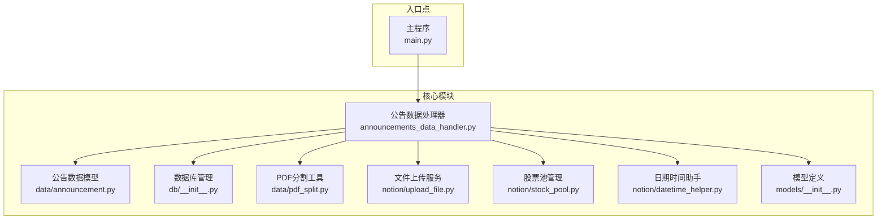
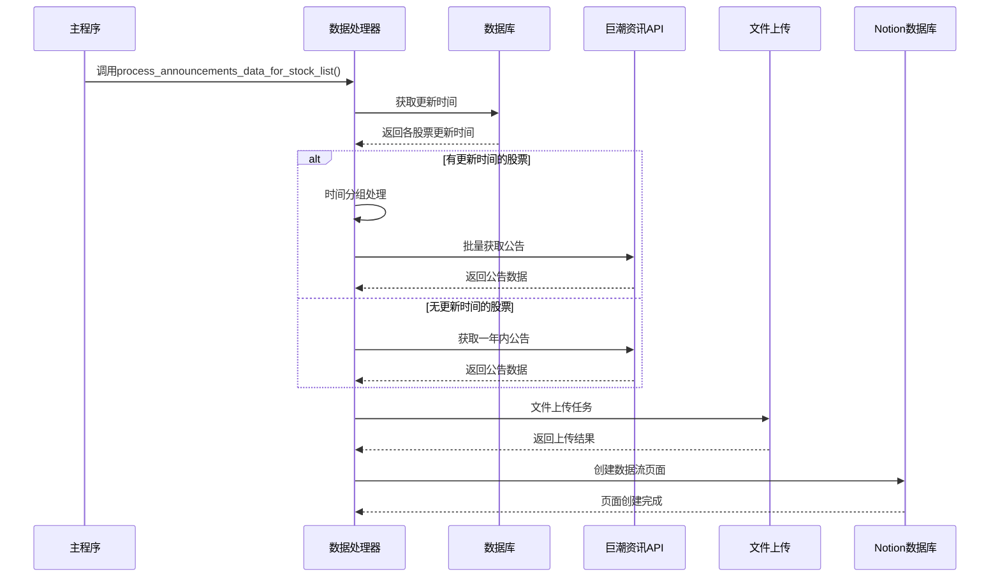
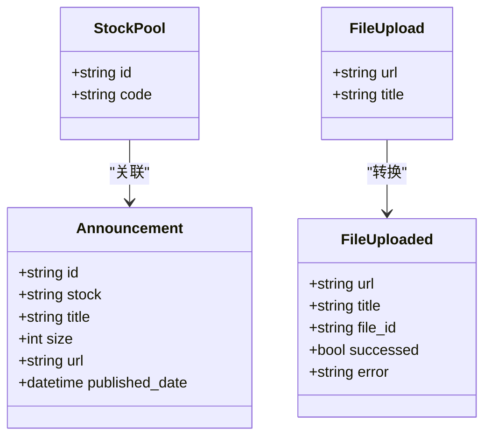
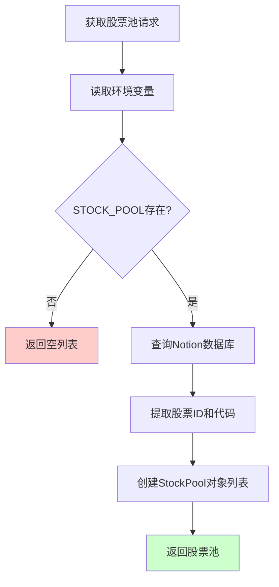
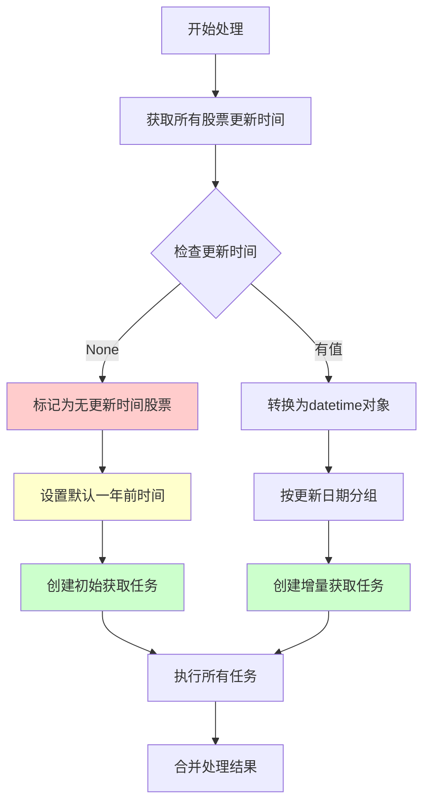
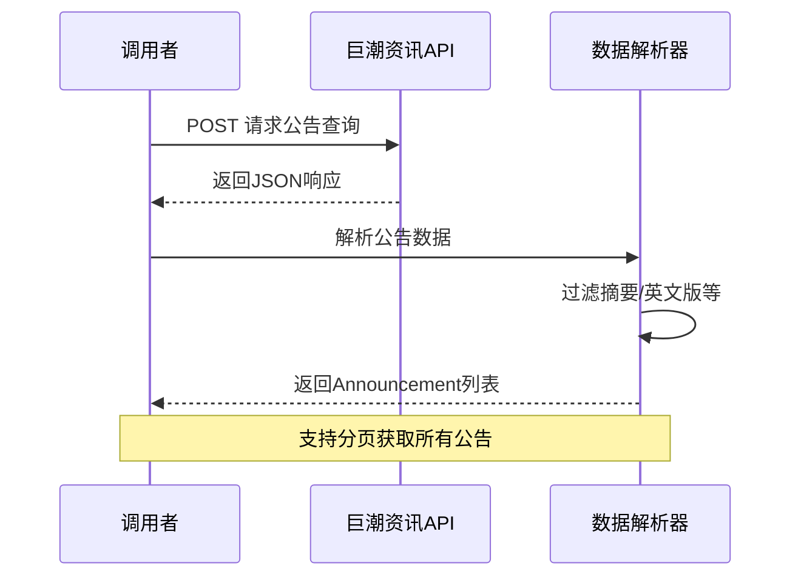
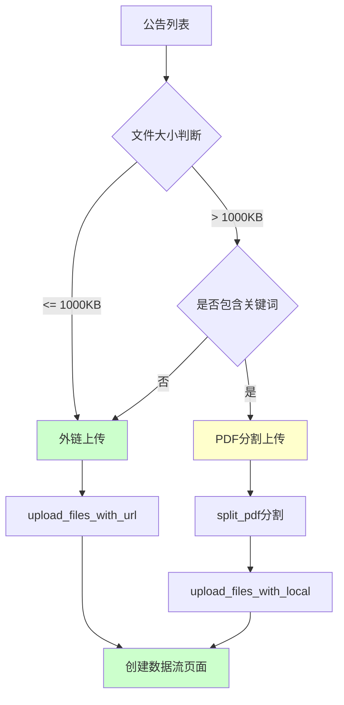
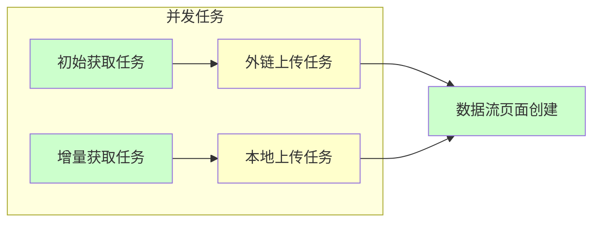
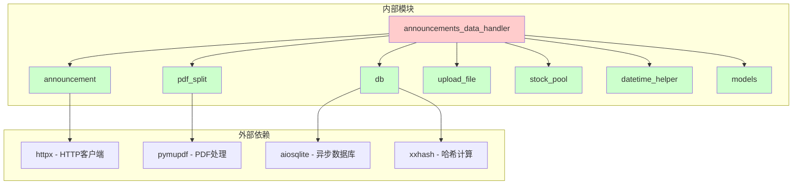

# 公告数据获取逻辑

<cite>
**本文档引用的文件**
- [core/announcements_data_handler.py](file://core/announcements_data_handler.py)
- [core/data/announcement.py](file://core/data/announcement.py)
- [core/db/__init__.py](file://core/db/__init__.py)
- [core/data/pdf_split.py](file://core/data/pdf_split.py)
- [core/notion/upload_file.py](file://core/notion/upload_file.py)
- [core/notion/stock_pool.py](file://core/notion/stock_pool.py)
- [core/notion/datetime_helper.py](file://core/notion/datetime_helper.py)
- [core/models/__init__.py](file://core/models/__init__.py)
- [main.py](file://main.py)
</cite>

## 目录
1. [简介](#简介)
2. [项目结构](#项目结构)
3. [核心组件](#核心组件)
4. [架构概览](#架构概览)
5. [详细组件分析](#详细组件分析)
6. [依赖关系分析](#依赖关系分析)
7. [性能考虑](#性能考虑)
8. [故障排除指南](#故障排除指南)
9. [结论](#结论)

## 简介

本文档深入分析了公告数据获取逻辑，重点解释 `process_announcements_data_for_stock_list` 函数的核心实现。该函数负责从巨潮资讯网获取上市公司公告数据，实现了智能的股票池处理、更新时间管理、时间分组策略等功能。文档涵盖了空更新时间和历史更新时间的不同处理策略，详细说明了 `init_update_stocks` 和 `exist_update_stocks` 的处理逻辑，以及 `get_announcements` 函数的调用方式和参数传递机制。

## 项目结构

该项目采用模块化设计，主要分为以下几个核心模块：

**图表来源**
- [core/announcements_data_handler.py](file://core/announcements_data_handler.py#L1-L116)
- [core/data/announcement.py](file://core/data/announcement.py#L1-L141)
- [core/db/__init__.py](file://core/db/__init__.py#L1-L218)

**章节来源**
- [main.py](file://main.py#L1-L40)
- [core/announcements_data_handler.py](file://core/announcements_data_handler.py#L1-L116)

## 核心组件

### 主要函数分析

#### process_announcements_data_for_stock_list 函数

这是公告数据获取的核心函数，实现了以下关键功能：

1. **股票池映射构建**：将股票代码映射到Notion页面ID
2. **更新时间获取**：从数据库获取各股票的最后更新时间
3. **智能时间分组**：根据更新时间对股票进行分组处理
4. **并发任务调度**：使用异步任务提高处理效率
5. **文件上传管理**：处理不同类型文件的上传策略

**章节来源**
- [core/announcements_data_handler.py](file://core/announcements_data_handler.py#L21-L116)

### 数据模型定义

#### Announcement 命名元组

公告信息的数据结构定义：

| 字段名 | 类型 | 描述 |
|--------|------|------|
| id | str | 巨潮资讯网公告唯一标识符 |
| stock | str | 公告所属股票代码 |
| title | str | 公告标题 |
| size | int | 文件大小（KB） |
| url | str | 下载链接 |
| published_date | datetime | 发布日期时间 |

#### StockPool 命名元组

股票池数据结构：

| 字段名 | 类型 | 描述 |
|--------|------|------|
| id | str | 股票在Notion中的唯一标识符 |
| code | str | 股票代码 |

**章节来源**
- [core/data/announcement.py](file://core/data/announcement.py#L12-L34)
- [core/notion/stock_pool.py](file://core/notion/stock_pool.py#L10-L21)

## 架构概览

公告数据获取系统的整体架构采用分层设计，实现了清晰的关注点分离：

**图表来源**
- [core/announcements_data_handler.py](file://core/announcements_data_handler.py#L21-L116)
- [core/db/__init__.py](file://core/db/__init__.py#L153-L185)

## 详细组件分析

### 股票池处理机制

#### 股票池数据结构

股票池采用命名元组结构，提供了类型安全的数据存储：

**图表来源**
- [core/notion/stock_pool.py](file://core/notion/stock_pool.py#L10-L21)
- [core/data/announcement.py](file://core/data/announcement.py#L12-L34)
- [core/notion/upload_file.py](file://core/notion/upload_file.py#L17-L26)

#### 股票池获取流程

**图表来源**
- [core/notion/stock_pool.py](file://core/notion/stock_pool.py#L23-L52)

**章节来源**
- [core/notion/stock_pool.py](file://core/notion/stock_pool.py#L1-L52)

### 更新时间管理系统

#### 更新时间获取策略

系统采用智能的更新时间管理机制，针对不同情况采用不同的处理策略：

**图表来源**
- [core/announcements_data_handler.py](file://core/announcements_data_handler.py#L27-L62)
- [core/db/__init__.py](file://core/db/__init__.py#L153-L185)

#### 更新时间分组逻辑

系统将有更新时间的股票按照最后更新日期进行分组，实现高效的批量处理：

| 分组策略 | 处理逻辑 | 优势 |
|----------|----------|------|
| 空更新时间 | 默认从一年前开始获取 | 确保新股票的数据完整性 |
| 历史更新时间 | 按日期分组批量获取 | 减少API调用次数，提高效率 |
| 同日更新 | 合并为同一任务 | 避免重复请求 |

**章节来源**
- [core/announcements_data_handler.py](file://core/announcements_data_handler.py#L34-L62)

### 数据获取与处理流程

#### get_announcements 函数实现

该函数负责与巨潮资讯网API交互，获取指定股票列表在给定日期范围内的公告信息：

**图表来源**
- [core/data/announcement.py](file://core/data/announcement.py#L36-L112)

#### 公告数据过滤机制

系统实现了智能的数据过滤，排除不相关的公告类型：

| 公告类型 | 过滤规则 | 说明 |
|----------|----------|------|
| 摘要 | announcementTitle == "摘要" | 排除简要摘要 |
| 英文版 | announcementTitle == "英文版" | 排除外文版本 |
| 图文版 | announcementTitle == "图文版" | 排除图文混排版本 |

**章节来源**
- [core/data/announcement.py](file://core/data/announcement.py#L94-L112)

### 文件上传与管理

#### 文件上传策略

系统针对不同大小和类型的文件采用不同的上传策略：

**图表来源**
- [core/announcements_data_handler.py](file://core/announcements_data_handler.py#L65-L93)
- [core/data/pdf_split.py](file://core/data/pdf_split.py#L15-L73)

#### PDF分割算法

对于大文件采用智能分割策略：

| 参数 | 值 | 说明 |
|------|----|------|
| CHUNK_SIZE | 95 | 每块最大页数 |
| REP_SIZE | 5 | 重叠页数，避免内容截断 |
| 分割公式 | `(CHUNK_SIZE - REP_SIZE)` | 实际有效页数 |

**章节来源**
- [core/data/pdf_split.py](file://core/data/pdf_split.py#L11-L73)

### 并发处理与性能优化

#### 异步任务调度

系统采用异步编程模式，通过任务并发提高处理效率：

**图表来源**
- [core/announcements_data_handler.py](file://core/announcements_data_handler.py#L40-L115)

#### 性能优化策略

1. **批量API调用**：将同一天更新的股票合并为一次API请求
2. **异步并发处理**：文件上传和页面创建并行执行
3. **智能缓存**：使用LRU缓存减少重复的股票类型查询
4. **分页处理**：支持大数据量的分页获取

**章节来源**
- [core/announcements_data_handler.py](file://core/announcements_data_handler.py#L40-L62)
- [core/data/announcement.py](file://core/data/announcement.py#L115-L141)

## 依赖关系分析

### 核心依赖图

**图表来源**
- [core/announcements_data_handler.py](file://core/announcements_data_handler.py#L1-L16)
- [core/data/announcement.py](file://core/data/announcement.py#L1-L8)
- [core/db/__init__.py](file://core/db/__init__.py#L1-L10)

### 关键接口契约

系统通过明确的接口契约确保模块间的松耦合：

| 接口名称 | 输入参数 | 返回值 | 用途 |
|----------|----------|--------|------|
| get_announcements | stock_list: list[str], start_date: date, end_date: date | list[Announcement] | 获取公告数据 |
| get_update_time | stocks: list[str], key: KEYS | dict[str, NotionDate | None] | 获取更新时间 |
| upload_files_with_url | file_list: list[FileUpload] | list[FileUploaded] | 外链文件上传 |
| upload_files_with_local | file_list: list[FileUpload] | list[FileUploaded] | 本地文件上传 |
| split_pdf | announcement_list: list[Announcement] | list[Announcement] | PDF文件分割 |

**章节来源**
- [core/data/announcement.py](file://core/data/announcement.py#L36-L112)
- [core/db/__init__.py](file://core/db/__init__.py#L153-L215)
- [core/notion/upload_file.py](file://core/notion/upload_file.py#L28-L61)

## 性能考虑

### 时间复杂度分析

1. **更新时间获取**：O(n)，n为股票数量
2. **公告数据获取**：O(m)，m为公告总数
3. **文件上传**：O(p)，p为文件数量
4. **整体复杂度**：O(n + m + p)

### 内存使用优化

1. **流式处理**：PDF文件采用流式下载和处理
2. **分页获取**：避免一次性加载大量数据
3. **异步I/O**：充分利用异步特性减少阻塞

### 并发控制策略

1. **任务数量限制**：合理控制并发任务数量
2. **资源池管理**：复用HTTP连接和数据库连接
3. **错误恢复**：实现任务级别的错误处理和重试

## 故障排除指南

### 常见问题及解决方案

#### 数据库连接问题

**症状**：无法获取更新时间或保存处理结果
**原因**：SQLite数据库连接异常
**解决方案**：
1. 检查数据库文件权限
2. 确认数据库初始化完成
3. 验证数据库连接池配置

#### API调用失败

**症状**：公告数据获取失败
**原因**：网络问题或API限制
**解决方案**：
1. 检查网络连接状态
2. 实现重试机制
3. 添加请求频率限制

#### 文件上传失败

**症状**：PDF文件无法上传到Notion
**原因**：文件过大或格式不支持
**解决方案**：
1. 检查文件大小限制
2. 验证PDF格式有效性
3. 实现分片上传机制

**章节来源**
- [core/db/__init__.py](file://core/db/__init__.py#L28-L52)
- [core/notion/upload_file.py](file://core/notion/upload_file.py#L153-L177)

### 调试建议

1. **启用详细日志**：设置日志级别为DEBUG
2. **监控API响应**：记录请求和响应详情
3. **性能指标收集**：监控关键操作的执行时间
4. **错误追踪**：实现完整的异常堆栈跟踪

## 结论

公告数据获取系统通过精心设计的架构和优化策略，实现了高效、可靠的公告数据处理能力。系统的主要优势包括：

1. **智能时间管理**：根据更新时间差异采用不同的处理策略
2. **并发优化**：通过异步任务和批量处理提高效率
3. **容错机制**：完善的错误处理和恢复机制
4. **扩展性设计**：模块化架构便于功能扩展和维护

该系统为后续的功能扩展和性能优化奠定了良好的基础，能够满足大规模公告数据处理的需求。