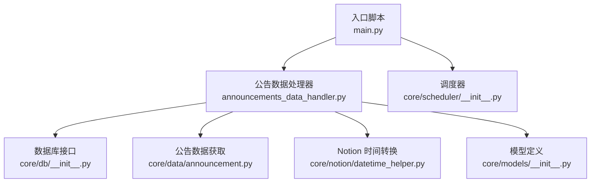
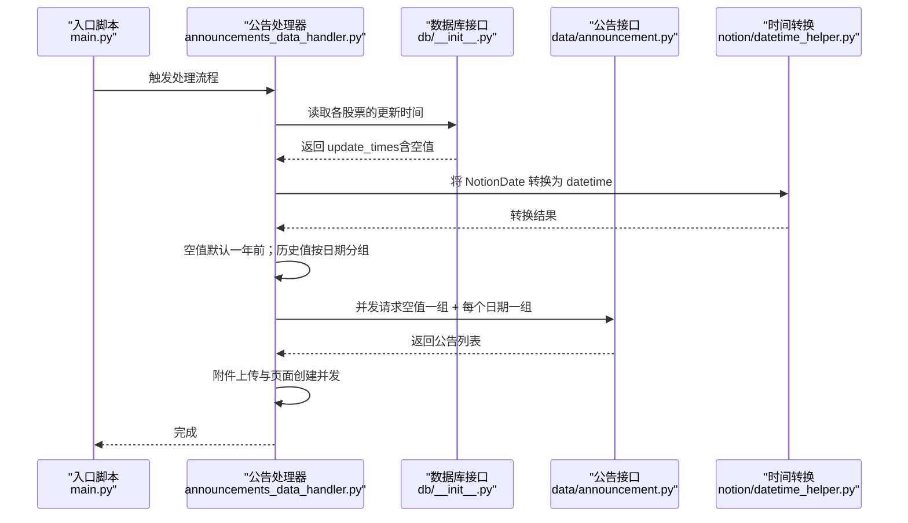
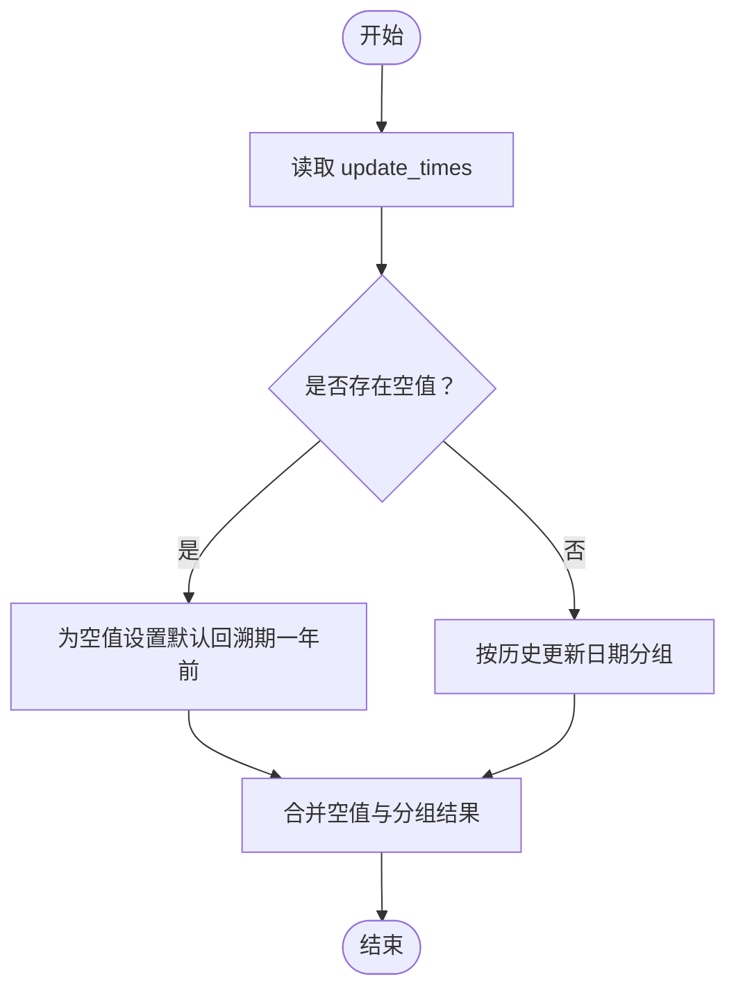
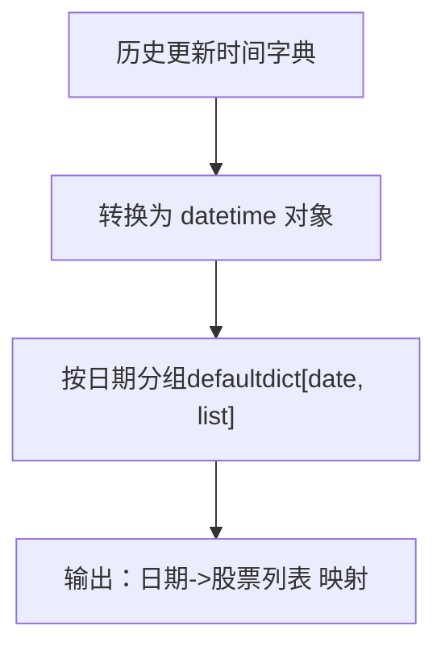
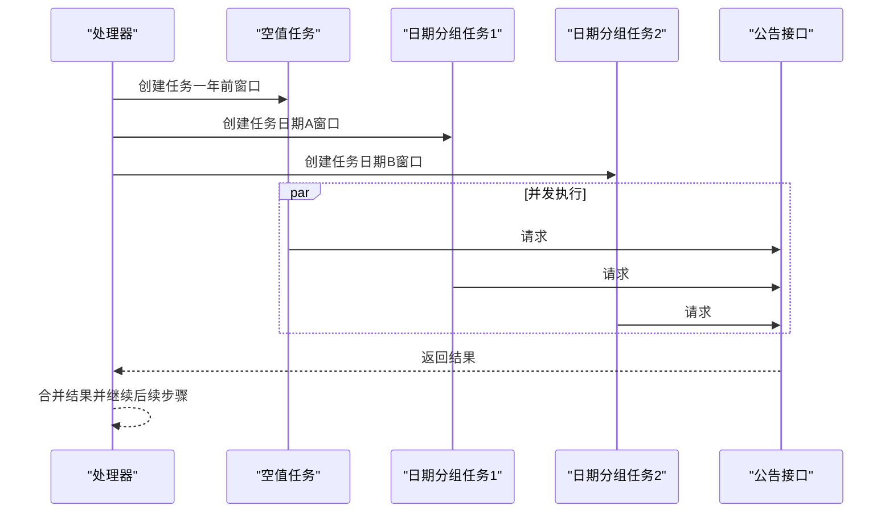
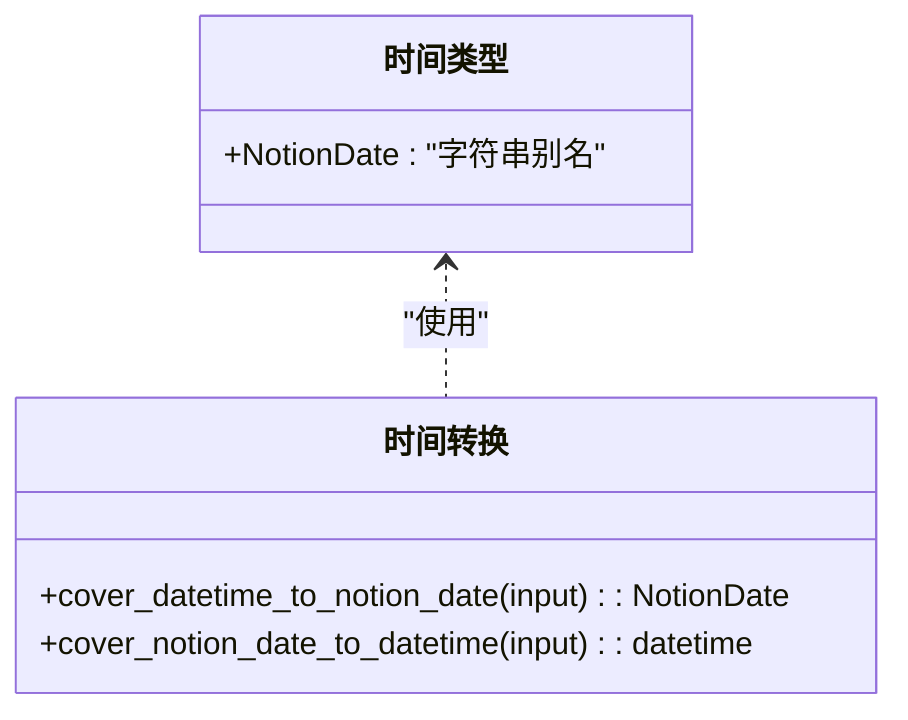
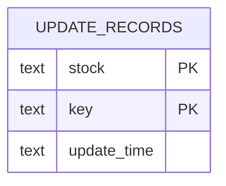
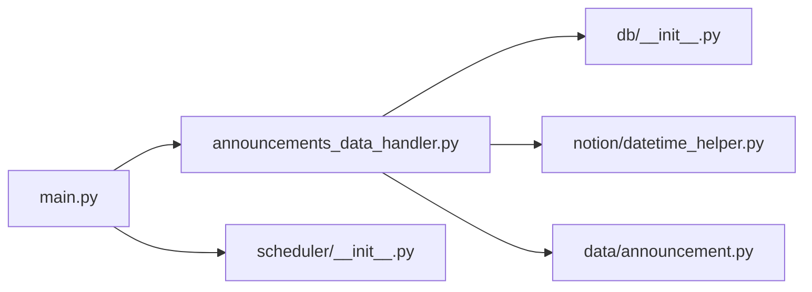

# 增量更新策略

<cite>
**本文引用的文件**
- [main.py](file://main.py)
- [announcements_data_handler.py](file://core/announcements_data_handler.py)
- [db/__init__.py](file://core/db/__init__.py)
- [data/announcement.py](file://core/data/announcement.py)
- [notion/datetime_helper.py](file://core/notion/datetime_helper.py)
- [models/__init__.py](file://core/models/__init__.py)
- [scheduler/__init__.py](file://core/scheduler/__init__.py)
</cite>

## 目录
1. [引言](#引言)
2. [项目结构](#项目结构)
3. [核心组件](#核心组件)
4. [架构总览](#架构总览)
5. [详细组件分析](#详细组件分析)
6. [依赖关系分析](#依赖关系分析)
7. [性能考量](#性能考量)
8. [故障排查指南](#故障排查指南)
9. [结论](#结论)
10. [附录](#附录)

## 引言
本技术文档围绕“增量更新策略”展开，聚焦于基于时间戳的智能更新机制，涵盖以下关键点：
- update_times 的获取与空值处理（默认一年前）
- 基于历史更新时间的时间分组算法
- 并发任务调度与批量请求合并，以降低外部 API 调用次数
- 时间计算与转换工具
- 性能优化策略与最佳实践

该策略的核心思想是：对尚未有更新记录的股票（或数据类型）采用统一的回溯窗口（默认一年），对已有更新记录的股票按其最后更新日期进行分组，尽可能合并相同更新日期的请求，从而减少对外部接口的调用频次。

## 项目结构
该项目采用模块化组织，围绕“数据获取—数据库—Notion 集成—调度”的路径构建。与增量更新策略直接相关的模块如下：
- 数据层：从巨潮资讯网获取公告数据
- 数据库层：维护各股票的数据更新时间记录
- Notion 层：时间格式转换、数据写入与页面创建
- 调度层：异步调度器（可用于定时触发增量更新）

图表来源
- [main.py](file://main.py#L20-L39)
- [announcements_data_handler.py](file://core/announcements_data_handler.py#L21-L116)
- [db/__init__.py](file://core/db/__init__.py#L153-L217)
- [data/announcement.py](file://core/data/announcement.py#L36-L112)
- [notion/datetime_helper.py](file://core/notion/datetime_helper.py#L12-L38)
- [models/__init__.py](file://core/models/__init__.py#L3-L7)
- [scheduler/__init__.py](file://core/scheduler/__init__.py#L1-L7)

章节来源
- [main.py](file://main.py#L1-L40)
- [announcements_data_handler.py](file://core/announcements_data_handler.py#L1-L116)
- [db/__init__.py](file://core/db/__init__.py#L1-L217)
- [data/announcement.py](file://core/data/announcement.py#L1-L141)
- [notion/datetime_helper.py](file://core/notion/datetime_helper.py#L1-L39)
- [models/__init__.py](file://core/models/__init__.py#L1-L8)
- [scheduler/__init__.py](file://core/scheduler/__init__.py#L1-L8)

## 核心组件
- 增量更新主流程：在处理器中获取 update_times，区分空值与历史值，按日期分组并并发发起请求，再进行附件上传与页面创建。
- 数据库更新时间记录：提供读取与写入接口，保证每次更新后记录最新的 update_time。
- 时间转换工具：统一 NotionDate 与 Python datetime 的转换，确保跨模块时间格式一致。
- 数据获取接口：封装外部 API 请求，支持分页拉取与过滤。

章节来源
- [announcements_data_handler.py](file://core/announcements_data_handler.py#L21-L116)
- [db/__init__.py](file://core/db/__init__.py#L153-L217)
- [notion/datetime_helper.py](file://core/notion/datetime_helper.py#L12-L38)
- [data/announcement.py](file://core/data/announcement.py#L36-L112)

## 架构总览
下图展示了“增量更新策略”的端到端流程：从入口脚本触发，到处理器读取数据库更新时间，再到并发请求外部接口、处理附件与创建 Notion 页面。

图表来源
- [main.py](file://main.py#L20-L39)
- [announcements_data_handler.py](file://core/announcements_data_handler.py#L21-L116)
- [db/__init__.py](file://core/db/__init__.py#L153-L217)
- [data/announcement.py](file://core/data/announcement.py#L36-L112)
- [notion/datetime_helper.py](file://core/notion/datetime_helper.py#L28-L38)

## 详细组件分析

### 组件一：更新时间获取与空值处理
- 获取逻辑：通过数据库接口一次性查询多个股票的更新时间，返回字典映射。
- 空值处理：对缺失记录或空值的股票，视为从未更新过，采用默认回溯窗口（一年前）。
- 写入策略：更新完成后，将本次处理的最新时间写回数据库，供下次增量使用。

图表来源
- [announcements_data_handler.py](file://core/announcements_data_handler.py#L27-L60)
- [db/__init__.py](file://core/db/__init__.py#L153-L185)

章节来源
- [announcements_data_handler.py](file://core/announcements_data_handler.py#L27-L60)
- [db/__init__.py](file://core/db/__init__.py#L153-L185)

### 组件二：时间分组算法
- 分组依据：以“历史更新日期”为键，将同一日期的股票归为一组，便于合并请求。
- 分组实现：使用字典按日期聚合股票代码列表。
- 分组收益：减少 API 调用次数，提升整体吞吐。

图表来源
- [announcements_data_handler.py](file://core/announcements_data_handler.py#L45-L59)
- [notion/datetime_helper.py](file://core/notion/datetime_helper.py#L28-L38)

章节来源
- [announcements_data_handler.py](file://core/announcements_data_handler.py#L45-L59)
- [notion/datetime_helper.py](file://core/notion/datetime_helper.py#L28-L38)

### 组件三：并发任务调度与批量请求
- 任务拆分：空值股票单独一组；历史值按日期各自一组。
- 并发执行：使用 asyncio.gather 并行等待所有任务完成。
- 请求合并：同一日期的股票合并为一次请求，降低外部接口压力。

图表来源
- [announcements_data_handler.py](file://core/announcements_data_handler.py#L40-L62)
- [data/announcement.py](file://core/data/announcement.py#L36-L112)

章节来源
- [announcements_data_handler.py](file://core/announcements_data_handler.py#L40-L62)
- [data/announcement.py](file://core/data/announcement.py#L36-L112)

### 组件四：时间计算与转换
- 时间类型：NotionDate 为字符串别名，统一跨模块时间表示。
- 转换函数：
  - 将 Python 的 datetime/date 转换为 NotionDate（带毫秒时区格式或日期字符串）
  - 将 NotionDate 转换回 Python datetime
- 用途：确保数据库存储、处理器逻辑与外部接口之间的时间格式一致。

图表来源
- [models/__init__.py](file://core/models/__init__.py#L3-L7)
- [notion/datetime_helper.py](file://core/notion/datetime_helper.py#L12-L38)

章节来源
- [models/__init__.py](file://core/models/__init__.py#L1-L8)
- [notion/datetime_helper.py](file://core/notion/datetime_helper.py#L12-L38)

### 组件五：数据库更新时间记录
- 表结构：update_records（stock, key, update_time），主键为 (stock, key)
- 接口职责：
  - 读取：根据股票列表与键值获取对应 update_time，缺失则插入空记录
  - 写入：更新某股票某键的 update_time，若无记录则报错（保证先查询后更新）
- 作用：为增量更新提供“最后更新时间”的锚点，决定回溯窗口与分组策略。

图表来源
- [db/__init__.py](file://core/db/__init__.py#L77-L94)
- [db/__init__.py](file://core/db/__init__.py#L153-L217)

章节来源
- [db/__init__.py](file://core/db/__init__.py#L77-L94)
- [db/__init__.py](file://core/db/__init__.py#L153-L217)

### 组件六：调度器与定时触发
- 调度器：AsyncIOScheduler，时区为 Asia/Shanghai
- 用途：可将增量更新流程注册为定时任务，按日/周/月周期自动运行

章节来源
- [scheduler/__init__.py](file://core/scheduler/__init__.py#L1-L7)

## 依赖关系分析
- 处理器依赖数据库接口以获取 update_times，并依赖时间转换工具进行格式统一
- 数据获取接口依赖外部 API，返回标准化的公告数据结构
- 调度器为可选集成点，用于自动化触发增量更新

图表来源
- [announcements_data_handler.py](file://core/announcements_data_handler.py#L1-L17)
- [db/__init__.py](file://core/db/__init__.py#L1-L217)
- [notion/datetime_helper.py](file://core/notion/datetime_helper.py#L1-L39)
- [data/announcement.py](file://core/data/announcement.py#L1-L141)
- [main.py](file://main.py#L1-L40)
- [scheduler/__init__.py](file://core/scheduler/__init__.py#L1-L7)

章节来源
- [announcements_data_handler.py](file://core/announcements_data_handler.py#L1-L17)
- [db/__init__.py](file://core/db/__init__.py#L1-L217)
- [notion/datetime_helper.py](file://core/notion/datetime_helper.py#L1-L39)
- [data/announcement.py](file://core/data/announcement.py#L1-L141)
- [main.py](file://main.py#L1-L40)
- [scheduler/__init__.py](file://core/scheduler/__init__.py#L1-L7)

## 性能考量
- 减少 API 调用次数
  - 将空值股票与历史值按日期分组，合并相同日期的请求
  - 使用 asyncio.gather 并发执行，缩短总耗时
- I/O 优化
  - 数据库批量插入缺失记录，避免逐条写入
  - 使用 LRU 缓存缓存静态资源（如股票映射）
- 时间转换一致性
  - 统一使用 NotionDate 与转换函数，避免重复解析与格式差异
- 可扩展性
  - 通过调度器实现定时任务，支持日/周/月等不同粒度的增量更新

章节来源
- [announcements_data_handler.py](file://core/announcements_data_handler.py#L40-L62)
- [db/__init__.py](file://core/db/__init__.py#L177-L184)
- [data/announcement.py](file://core/data/announcement.py#L115-L141)
- [notion/datetime_helper.py](file://core/notion/datetime_helper.py#L12-L38)

## 故障排查指南
- 问题：未找到记录导致更新失败
  - 现象：更新接口抛出异常，提示“应先查询后更新”
  - 处理：确保在更新前先调用读取接口，保证记录存在
  - 参考位置：[db/__init__.py](file://core/db/__init__.py#L205-L214)
- 问题：空值或历史值未按预期分组
  - 现象：空值未回溯一年，或历史值未按日期分组
  - 处理：确认数据库中 update_time 是否为 None 或有效 NotionDate；检查分组逻辑
  - 参考位置：[announcements_data_handler.py](file://core/announcements_data_handler.py#L34-L59)
- 问题：时间格式不一致导致转换异常
  - 现象：NotionDate 与 datetime 互转失败
  - 处理：统一使用转换函数，确保输入为 date/datetime 或 ISO 字符串
  - 参考位置：[notion/datetime_helper.py](file://core/notion/datetime_helper.py#L12-L38)
- 问题：外部接口超时或分页异常
  - 现象：请求返回空列表或分页数异常
  - 处理：检查分页参数与过滤条件，确认接口可用性
  - 参考位置：[data/announcement.py](file://core/data/announcement.py#L36-L112)

章节来源
- [db/__init__.py](file://core/db/__init__.py#L205-L214)
- [announcements_data_handler.py](file://core/announcements_data_handler.py#L34-L59)
- [notion/datetime_helper.py](file://core/notion/datetime_helper.py#L12-L38)
- [data/announcement.py](file://core/data/announcement.py#L36-L112)

## 结论
本增量更新策略通过“update_times 获取 + 空值默认回溯 + 历史值按日期分组 + 并发请求合并”的组合拳，显著降低了对外部接口的调用次数，提升了整体效率。配合数据库的更新时间记录与统一的时间转换工具，实现了稳定、可扩展且易于维护的增量更新流程。建议结合调度器实现自动化，按业务需求设定合适的更新频率与回溯窗口。

## 附录
- 关键实现位置参考
  - 增量更新主流程：[announcements_data_handler.py](file://core/announcements_data_handler.py#L21-L116)
  - 更新时间读取与写入：[db/__init__.py](file://core/db/__init__.py#L153-L217)
  - 时间转换工具：[notion/datetime_helper.py](file://core/notion/datetime_helper.py#L12-L38)
  - 外部接口封装：[data/announcement.py](file://core/data/announcement.py#L36-L112)
  - 调度器集成：[scheduler/__init__.py](file://core/scheduler/__init__.py#L1-L7)