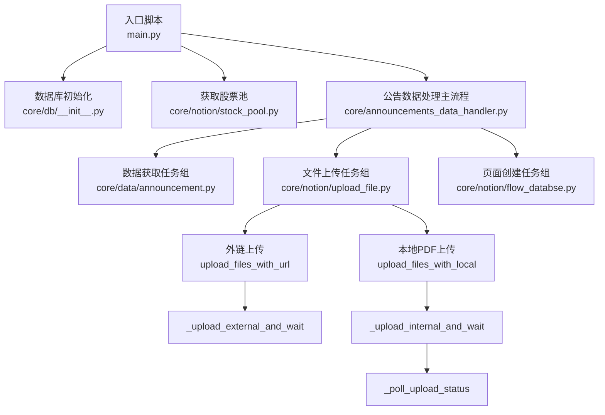
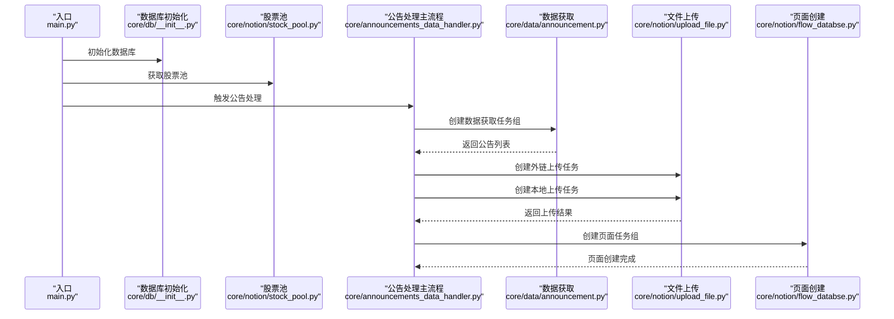
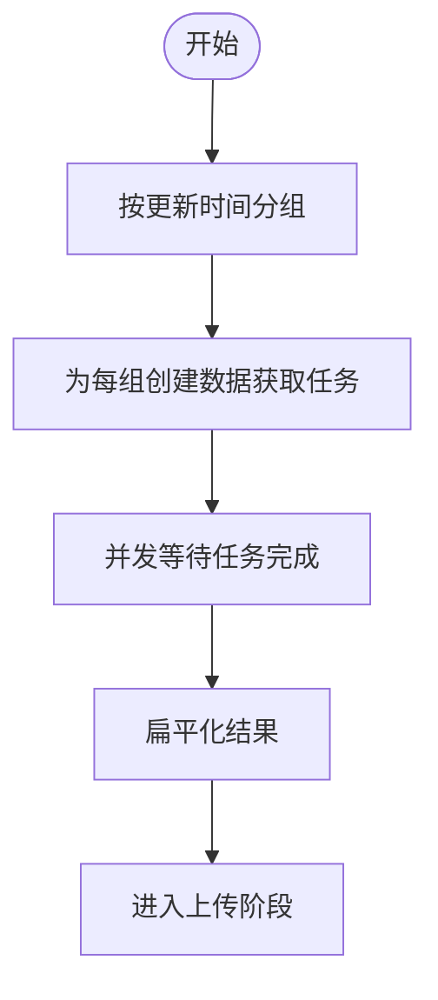
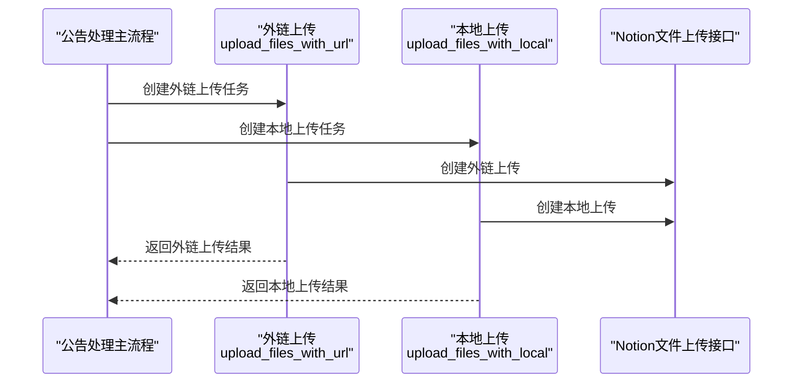
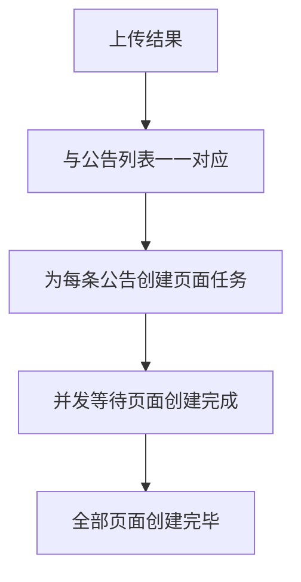
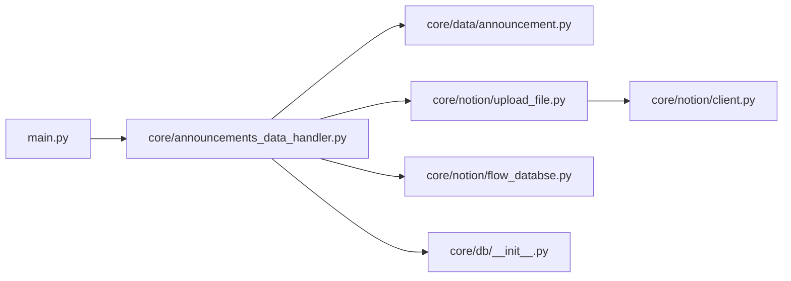

# 并发任务调度

<cite>
**本文引用的文件**
- [main.py](file://main.py)
- [core/db/__init__.py](file://core/db/__init__.py)
- [core/scheduler/__init__.py](file://core/scheduler/__init__.py)
- [core/notion/client.py](file://core/notion/client.py)
- [core/notion/upload_file.py](file://core/notion/upload_file.py)
- [core/notion/flow_databse.py](file://core/notion/flow_databse.py)
- [core/data/announcement.py](file://core/data/announcement.py)
- [core/data/pdf_split.py](file://core/data/pdf_split.py)
- [core/announcements_data_handler.py](file://core/announcements_data_handler.py)
- [core/data/business.py](file://core/data/business.py)
- [core/notion/stock_pool.py](file://core/notion/stock_pool.py)
</cite>

## 目录
1. [简介](#简介)
2. [项目结构](#项目结构)
3. [核心组件](#核心组件)
4. [架构总览](#架构总览)
5. [详细组件分析](#详细组件分析)
6. [依赖关系分析](#依赖关系分析)
7. [性能考量](#性能考量)
8. [故障排查指南](#故障排查指南)
9. [结论](#结论)

## 简介
本文件围绕“并发任务调度”主题，系统梳理并解释以下关键能力：
- 使用 asyncio.gather 并发收集多个任务的结果
- 使用 asyncio.create_task 创建和管理任务
- 组织三类典型并发任务：数据获取、文件上传、页面创建
- 明确任务间的依赖关系与执行顺序
- 提供错误处理与异常传播机制说明
- 结合仓库现有实现，给出可操作的实践建议与优化技巧

## 项目结构
该项目采用按功能域划分的模块化组织方式，核心并发流程集中在公告数据处理模块中，贯穿数据获取、文件上传与页面创建三个阶段。

图表来源
- [main.py](file://main.py#L20-L39)
- [core/db/__init__.py](file://core/db/__init__.py#L62-L95)
- [core/notion/stock_pool.py](file://core/notion/stock_pool.py#L23-L51)
- [core/announcements_data_handler.py](file://core/announcements_data_handler.py#L21-L116)
- [core/data/announcement.py](file://core/data/announcement.py#L36-L112)
- [core/notion/upload_file.py](file://core/notion/upload_file.py#L28-L61)
- [core/notion/flow_databse.py](file://core/notion/flow_databse.py#L25-L67)

章节来源
- [main.py](file://main.py#L20-L39)
- [core/announcements_data_handler.py](file://core/announcements_data_handler.py#L21-L116)

## 核心组件
- 任务创建与管理
  - 使用 asyncio.create_task 将协程包装为可调度的任务，便于并发执行与结果收集
  - 使用 asyncio.gather 并发等待多个任务完成，并统一收集结果
- 数据获取任务
  - 从巨潮资讯网批量获取公告列表，按更新时间分组以减少请求次数
- 文件上传任务
  - 支持两类上传：外链直传与本地PDF分片上传；均通过轮询检测上传状态
- 页面创建任务
  - 将上传得到的附件与公告元数据写入 Notion 数据流数据库

章节来源
- [core/announcements_data_handler.py](file://core/announcements_data_handler.py#L40-L92)
- [core/notion/upload_file.py](file://core/notion/upload_file.py#L28-L61)
- [core/notion/flow_databse.py](file://core/notion/flow_databse.py#L25-L67)

## 架构总览
下图展示了从入口到最终页面创建的完整并发流程，突出任务创建、并发等待与结果聚合的关键节点。

图表来源
- [main.py](file://main.py#L20-L39)
- [core/db/__init__.py](file://core/db/__init__.py#L62-L95)
- [core/notion/stock_pool.py](file://core/notion/stock_pool.py#L23-L51)
- [core/announcements_data_handler.py](file://core/announcements_data_handler.py#L21-L116)
- [core/data/announcement.py](file://core/data/announcement.py#L36-L112)
- [core/notion/upload_file.py](file://core/notion/upload_file.py#L28-L61)
- [core/notion/flow_databse.py](file://core/notion/flow_databse.py#L25-L67)

## 详细组件分析

### 数据获取任务（并发与分组）
- 任务创建
  - 对于无更新时间的股票，统一构造一次数据获取任务
  - 对于有更新时间的股票，按更新日期分组，合并同一日期的查询请求，减少接口调用次数
- 并发执行
  - 使用 asyncio.create_task 包装每个分组的数据获取任务
  - 使用 asyncio.gather 并发等待所有任务完成，并将嵌套结果扁平化
- 依赖关系
  - 数据获取是后续上传与页面创建的前提
  - 上传任务依赖数据获取结果中的附件信息
  - 页面创建任务依赖上传任务返回的附件 ID

图表来源
- [core/announcements_data_handler.py](file://core/announcements_data_handler.py#L40-L63)

章节来源
- [core/announcements_data_handler.py](file://core/announcements_data_handler.py#L21-L63)
- [core/data/announcement.py](file://core/data/announcement.py#L36-L112)

### 文件上传任务（本地与外链）
- 任务创建
  - 外链上传：针对小附件直接创建上传任务
  - 本地上传：对大附件进行PDF分片，为每一片创建上传任务
- 并发执行
  - 使用 asyncio.create_task 创建上传任务
  - 使用 asyncio.gather 并发等待两类上传任务完成
- 上传流程
  - 外链上传：直接调用 Notion 文件上传接口，随后轮询状态直至完成
  - 本地上传：先下载PDF内容，再分片上传，每片上传后轮询状态
- 轮询策略
  - 指数退避等待，避免频繁轮询造成压力
- 结果聚合
  - 将两类上传结果合并，与公告一一对应，供页面创建使用

图表来源
- [core/announcements_data_handler.py](file://core/announcements_data_handler.py#L74-L92)
- [core/notion/upload_file.py](file://core/notion/upload_file.py#L40-L61)
- [core/notion/upload_file.py](file://core/notion/upload_file.py#L124-L150)

章节来源
- [core/announcements_data_handler.py](file://core/announcements_data_handler.py#L65-L93)
- [core/notion/upload_file.py](file://core/notion/upload_file.py#L28-L61)
- [core/notion/upload_file.py](file://core/notion/upload_file.py#L124-L176)

### 页面创建任务（数据流页面）
- 任务创建
  - 为每条公告创建一个页面创建任务，传入标题、发布时间、来源接口、数据类型、关联股票、附件 ID、原文链接与正文内容
- 并发执行
  - 使用 asyncio.create_task 创建页面创建任务
  - 使用 asyncio.gather 并发等待所有页面创建完成
- 依赖关系
  - 必须在上传任务完成后才能获得附件 ID
  - 页面创建依赖上传结果与公告元数据

图表来源
- [core/announcements_data_handler.py](file://core/announcements_data_handler.py#L95-L116)
- [core/notion/flow_databse.py](file://core/notion/flow_databse.py#L25-L67)

章节来源
- [core/announcements_data_handler.py](file://core/announcements_data_handler.py#L95-L116)
- [core/notion/flow_databse.py](file://core/notion/flow_databse.py#L25-L67)

### 任务创建与管理策略
- 使用 asyncio.create_task 的场景
  - 需要并发执行但不立即 await 的任务
  - 需要在稍后统一收集结果时使用 asyncio.gather
- 使用 asyncio.gather 的场景
  - 需要等待一组任务全部完成并收集结果
  - 需要异常早发现：默认情况下任一任务抛出异常会传播到 gather
- 性能优化建议
  - 合理分组：如数据获取阶段按更新时间分组，减少接口调用
  - 控制并发度：根据网络与服务端限流情况调整任务数量
  - 轮询退避：上传轮询采用指数退避，避免过度轮询
  - 任务粒度：上传阶段将大文件分片，提升吞吐与稳定性

章节来源
- [core/announcements_data_handler.py](file://core/announcements_data_handler.py#L40-L92)
- [core/notion/upload_file.py](file://core/notion/upload_file.py#L153-L176)

### 错误处理与异常传播
- 上传阶段
  - 外链与本地上传均在内部捕获异常并记录日志，返回带错误信息的结果对象，保证 gather 可以正常收集
  - 轮询超时或失败时返回失败状态与错误信息
- 页面创建阶段
  - 页面创建过程捕获异常并记录错误日志，避免中断整个流程
- 数据获取阶段
  - 接口请求与解析异常会被上层处理，确保流程稳定

章节来源
- [core/notion/upload_file.py](file://core/notion/upload_file.py#L82-L96)
- [core/notion/upload_file.py](file://core/notion/upload_file.py#L138-L150)
- [core/notion/flow_databse.py](file://core/notion/flow_databse.py#L65-L67)

## 依赖关系分析
- 模块耦合
  - 入口脚本仅负责初始化与触发主流程
  - 主流程模块负责任务编排与结果聚合
  - 数据获取、上传与页面创建模块职责清晰，耦合度低
- 外部依赖
  - Notion 异步客户端
  - HTTP 客户端用于接口与文件下载
  - 数据库模块提供持久化与去重能力
- 并发调度
  - 通过 asyncio.create_task 与 asyncio.gather 实现任务级并发与结果聚合

图表来源
- [main.py](file://main.py#L20-L39)
- [core/announcements_data_handler.py](file://core/announcements_data_handler.py#L1-L16)
- [core/data/announcement.py](file://core/data/announcement.py#L1-L10)
- [core/notion/upload_file.py](file://core/notion/upload_file.py#L1-L10)
- [core/notion/flow_databse.py](file://core/notion/flow_databse.py#L1-L12)
- [core/db/__init__.py](file://core/db/__init__.py#L1-L12)
- [core/notion/client.py](file://core/notion/client.py#L1-L6)

章节来源
- [main.py](file://main.py#L20-L39)
- [core/announcements_data_handler.py](file://core/announcements_data_handler.py#L1-L16)

## 性能考量
- 并发度控制
  - 数据获取阶段按日期分组，减少接口调用频率
  - 上传阶段对大文件分片，提升吞吐与稳定性
- 轮询退避
  - 上传轮询采用指数退避策略，避免频繁轮询
- I/O 密集优化
  - 使用异步 HTTP 客户端与异步数据库连接，充分利用 I/O 并发
- 结果聚合
  - 使用 asyncio.gather 统一收集结果，避免串行等待

章节来源
- [core/data/announcement.py](file://core/data/announcement.py#L36-L112)
- [core/notion/upload_file.py](file://core/notion/upload_file.py#L110-L121)
- [core/notion/upload_file.py](file://core/notion/upload_file.py#L153-L176)
- [core/db/__init__.py](file://core/db/__init__.py#L28-L52)

## 故障排查指南
- 上传失败
  - 检查轮询状态与错误信息，确认附件 ID 是否有效
  - 关注网络与 Notion 服务端限制
- 页面创建失败
  - 检查附件 ID、关联股票 ID、数据类型映射是否正确
  - 查看日志中的异常堆栈
- 数据获取异常
  - 检查接口返回与分页逻辑，确认请求参数与权限
- 并发问题
  - 若出现超时或资源争用，适当降低并发度或增加退避间隔

章节来源
- [core/notion/upload_file.py](file://core/notion/upload_file.py#L138-L150)
- [core/notion/flow_databse.py](file://core/notion/flow_databse.py#L65-L67)
- [core/data/announcement.py](file://core/data/announcement.py#L79-L112)

## 结论
本项目通过明确的任务分层与合理的并发策略，实现了从数据获取、文件上传到页面创建的完整流水线。其关键实践包括：
- 使用 asyncio.create_task 与 asyncio.gather 组织与聚合任务
- 在数据获取阶段进行分组以降低请求开销
- 在上传阶段采用分片与轮询退避提升稳定性
- 在页面创建阶段确保依赖满足后再并发执行

这些做法为构建高吞吐、可维护的异步任务调度提供了良好范式。