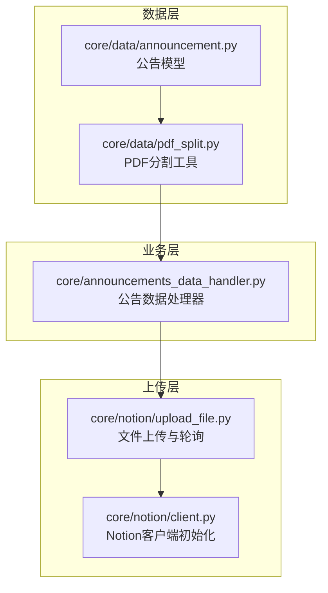
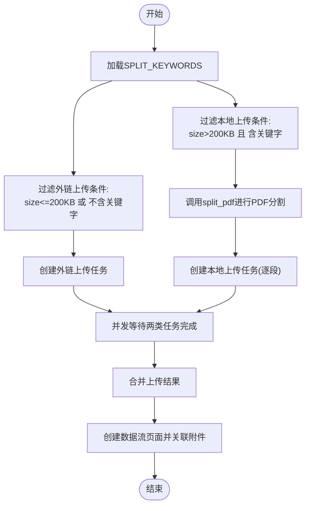
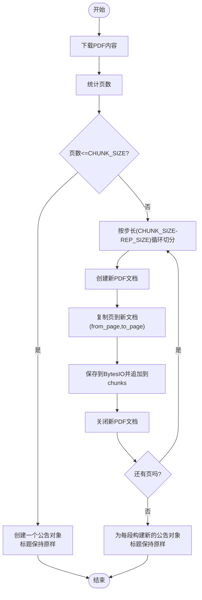
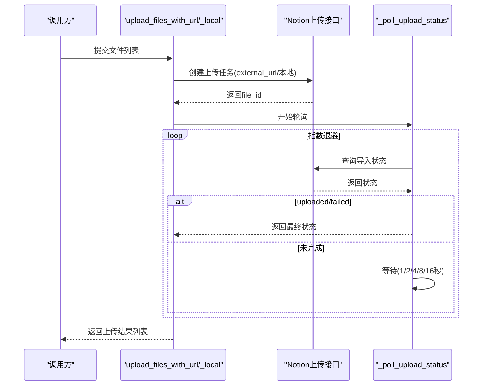
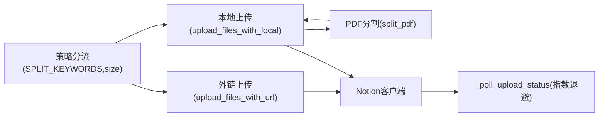

# 文件处理策略

<cite>
**本文引用的文件**
- [core/announcements_data_handler.py](file://core/announcements_data_handler.py)
- [core/data/pdf_split.py](file://core/data/pdf_split.py)
- [core/notion/upload_file.py](file://core/notion/upload_file.py)
- [core/data/announcement.py](file://core/data/announcement.py)
- [core/notion/client.py](file://core/notion/client.py)
</cite>

## 更新摘要
**变更内容**
- 文件上传阈值从1000KB调整为200KB，提高小文件处理效率
- PDF分割参数优化：CHUNK_SIZE从95调整为30，REP_SIZE从5调整为3，提升分割精度
- 移除自动页码编号功能，简化标题处理逻辑
- 更新上传策略分流逻辑和PDF分割算法实现

## 目录
1. [简介](#简介)
2. [项目结构](#项目结构)
3. [核心组件](#核心组件)
4. [架构总览](#架构总览)
5. [详细组件分析](#详细组件分析)
6. [依赖关系分析](#依赖关系分析)
7. [性能考量与内存管理](#性能考量与内存管理)
8. [故障排查指南](#故障排查指南)
9. [结论](#结论)
10. [附录](#附录)

## 简介
本文件面向"文件处理策略"的技术文档目标，系统性阐述以下要点：
- SPLIT_KEYWORDS 配置的作用与影响范围
- 文件大小判断与上传策略选择逻辑（小于等于200KB或不含特定关键词走外链上传；大于200KB且含特定关键词走本地上传并分割）
- PDF 分割算法与实现细节（基于页码分块与重叠窗口策略）
- split_pdf 函数的实现原理与调用路径
- 上传流程与并发控制、轮询机制
- 性能与内存管理策略

## 项目结构
围绕"文件处理策略"，本次分析聚焦以下模块：
- 数据层：公告模型与PDF分割工具
- 业务层：公告数据处理器，负责策略分流与任务编排
- 上传层：Notion 文件上传与轮询状态检查
- Notion 客户端：异步 Notion SDK 初始化



**图表来源**
- [core/data/announcement.py](file://core/data/announcement.py#L12-L34)
- [core/data/pdf_split.py](file://core/data/pdf_split.py#L15-L73)
- [core/announcements_data_handler.py](file://core/announcements_data_handler.py#L18-L92)
- [core/notion/upload_file.py](file://core/notion/upload_file.py#L28-L61)
- [core/notion/client.py](file://core/notion/client.py#L1-L6)

**章节来源**
- [core/announcements_data_handler.py](file://core/announcements_data_handler.py#L1-L253)
- [core/data/pdf_split.py](file://core/data/pdf_split.py#L1-L164)
- [core/notion/upload_file.py](file://core/notion/upload_file.py#L1-L313)
- [core/data/announcement.py](file://core/data/announcement.py#L1-L180)
- [core/notion/client.py](file://core/notion/client.py#L1-L60)

## 核心组件
- SPLIT_KEYWORDS：定义需要进行PDF分割的关键字集合，用于识别大体量报告类文档。
- 文件大小阈值：200KB，作为是否采用外链直传的分界线。
- 上传策略分流：
  - 外链上传（upload_files_with_url）：当文件大小 ≤ 200KB 或标题不包含任一 SPLIT_KEYWORDS 时，直接通过 Notion 的 external_url 模式上传。
  - 本地上传（upload_files_with_local）：当文件大小 > 200KB 且标题包含任一 SPLIT_KEYWORDS 时，先对 PDF 进行分割，再逐段上传。
- PDF 分割算法：按固定块大小与可选重叠窗口进行切分，保证每段页码连续且不超过设定上限。
- 轮询机制：上传后对 Notion 文件导入状态进行指数退避轮询，直至完成或失败。

**章节来源**
- [core/announcements_data_handler.py](file://core/announcements_data_handler.py#L26)
- [core/announcements_data_handler.py](file://core/announcements_data_handler.py#L129-L152)
- [core/notion/upload_file.py](file://core/notion/upload_file.py#L32-L91)
- [core/data/pdf_split.py](file://core/data/pdf_split.py#L13-L101)

## 架构总览
下图展示了从公告抓取到最终在 Notion 中创建页面的整体流程，重点体现"文件处理策略"的分流与执行顺序。

```mermaid
sequenceDiagram
participant 获取 as "公告抓取"
participant 处理器 as "公告数据处理器"
participant 外链 as "外链上传(upload_files_with_url)"
participant 分割 as "PDF分割(split_pdf)"
participant 本地 as "本地上传(upload_files_with_local)"
participant Notion as "Notion客户端"
获取->>处理器 : 获取公告列表
处理器->>处理器 : 策略分流(<=200KB或不含关键字)
处理器->>外链 : 提交外链上传任务
处理器->>分割 : 对>200KB且含关键字的公告进行PDF分割
分割-->>处理器 : 返回分割后的公告列表
处理器->>本地 : 提交本地上传任务(逐段)
并发执行外链与本地上传
外链->>Notion : external_url 模式上传
本地->>Notion : 本地内容上传(逐段)
Notion-->>外链 : 导入状态(uploaded/failed)
Notion-->>本地 : 导入状态(uploaded/failed)
处理器->>处理器 : 合并上传结果
处理器->>Notion : 创建数据流页面(绑定附件)
```

**图表来源**
- [core/announcements_data_handler.py](file://core/announcements_data_handler.py#L129-L173)
- [core/notion/upload_file.py](file://core/notion/upload_file.py#L146-L208)
- [core/data/pdf_split.py](file://core/data/pdf_split.py#L13-L101)

## 详细组件分析

### 组件A：公告数据处理器（策略分流与任务编排）
职责与流程：
- 读取 SPLIT_KEYWORDS，作为"是否需要分割"的关键字集合。
- 对公告列表进行两路分流：
  - 外链上传：size ≤ 200KB 或 标题不包含任一关键字
  - 本地上传：size > 200KB 且 标题包含任一关键字
- 对本地上传路径，先调用 split_pdf 对目标公告进行 PDF 分割，得到多段公告对象，再提交 upload_files_with_local 并发上传。
- 并发等待两类任务完成，合并结果后创建数据流页面并将附件 ID 关联。



**图表来源**
- [core/announcements_data_handler.py](file://core/announcements_data_handler.py#L129-L173)

**章节来源**
- [core/announcements_data_handler.py](file://core/announcements_data_handler.py#L129-L173)

### 组件B：PDF 分割工具（split_pdf）
实现要点：
- 输入：公告对象列表（包含URL、标题、大小、发布时间等）
- 输出：分割后的公告对象列表（每段对应一个新公告对象，标题不包含页码范围）
- 分割策略：
  - 若总页数 ≤ CHUNK_SIZE，则整份作为一段，标题保持原样
  - 若总页数 > CHUNK_SIZE，则按 CHUNK_SIZE - REP_SIZE 的步长进行切分，形成若干段
- 内存与资源管理：
  - 使用 BytesIO 保存每段 PDF 内容
  - 显式关闭临时 PDF 文档与源文档，避免内存泄漏

**更新** 移除了自动页码编号功能，标题不再包含页码范围信息



**图表来源**
- [core/data/pdf_split.py](file://core/data/pdf_split.py#L13-L101)
- [core/data/pdf_split.py](file://core/data/pdf_split.py#L127-L163)

**章节来源**
- [core/data/pdf_split.py](file://core/data/pdf_split.py#L9-L10)
- [core/data/pdf_split.py](file://core/data/pdf_split.py#L13-L101)
- [core/data/pdf_split.py](file://core/data/pdf_split.py#L127-L163)

### 组件C：文件上传与轮询（upload_files_with_url / upload_files_with_local）
- 外链上传（upload_files_with_url）：
  - 通过 Notion 的 external_url 模式提交上传请求
  - 并发等待所有任务完成，记录成功/失败数量
- 本地上传（upload_files_with_local）：
  - 先下载文件内容，再调用 Notion 的本地上传接口
  - 并发等待所有任务完成
- 轮询机制（_poll_upload_status）：
  - 指数退避等待：1, 2, 4, 8, 16 秒，最多尝试若干次
  - 若状态为 uploaded 或 failed 则返回，否则继续等待
  - 超时返回失败并附带错误信息



**图表来源**
- [core/notion/upload_file.py](file://core/notion/upload_file.py#L146-L208)
- [core/notion/upload_file.py](file://core/notion/upload_file.py#L257-L309)

**章节来源**
- [core/notion/upload_file.py](file://core/notion/upload_file.py#L32-L91)
- [core/notion/upload_file.py](file://core/notion/upload_file.py#L146-L208)
- [core/notion/upload_file.py](file://core/notion/upload_file.py#L257-L309)

### 组件D：公告模型（Announcement）
- 用于承载公告的基本信息：id、stock、title、size、url、published_date
- 在 PDF 分割与上传策略中被广泛使用，确保标题、大小、URL 等信息贯穿整个流程

**章节来源**
- [core/data/announcement.py](file://core/data/announcement.py#L11-L34)

## 依赖关系分析
- 策略分流依赖 SPLIT_KEYWORDS 与公告 size 字段
- PDF 分割依赖 pymupdf 进行页数统计与内容切分
- 上传层依赖 notion_client 的异步客户端进行文件上传与状态查询
- 并发控制通过 asyncio.gather 实现，提升吞吐量



**图表来源**
- [core/announcements_data_handler.py](file://core/announcements_data_handler.py#L26)
- [core/announcements_data_handler.py](file://core/announcements_data_handler.py#L129-L152)
- [core/data/pdf_split.py](file://core/data/pdf_split.py#L9-L10)
- [core/notion/upload_file.py](file://core/notion/upload_file.py#L32-L91)
- [core/notion/client.py](file://core/notion/client.py#L49-L59)

**章节来源**
- [core/announcements_data_handler.py](file://core/announcements_data_handler.py#L26)
- [core/announcements_data_handler.py](file://core/announcements_data_handler.py#L129-L152)
- [core/data/pdf_split.py](file://core/data/pdf_split.py#L9-L10)
- [core/notion/upload_file.py](file://core/notion/upload_file.py#L32-L91)
- [core/notion/client.py](file://core/notion/client.py#L49-L59)

## 性能考量与内存管理
- 并发上传：
  - 外链与本地上传分别并发执行，减少整体等待时间
  - 本地上传内部也对每个文件创建独立任务，充分利用 I/O 并发
- 指数退避轮询：
  - 控制轮询频率，避免频繁请求导致 Notion 限流或自身 CPU 占用过高
- 内存与资源管理：
  - PDF 分割阶段使用 BytesIO 缓冲，避免落盘
  - 显式关闭临时 PDF 文档与源文档，防止句柄泄露
  - split_pdf 对每个子文档在保存后及时 close，确保资源回收
- 页面切分策略：
  - 采用固定块大小与步长切分，避免一次性加载过大内存
  - 通过标题页码范围标注，便于后续检索与审计

**章节来源**
- [core/notion/upload_file.py](file://core/notion/upload_file.py#L32-L91)
- [core/notion/upload_file.py](file://core/notion/upload_file.py#L257-L309)
- [core/data/pdf_split.py](file://core/data/pdf_split.py#L127-L163)

## 故障排查指南
- 外链上传失败：
  - 检查 URL 可访问性与 Notion external_url 限制
  - 查看轮询返回的错误信息，定位具体失败原因
- 本地上传失败：
  - 检查下载响应状态与内容长度
  - 观察轮询超时或 Notion 导入失败的具体错误
- PDF 分割异常：
  - 捕获异常并保留原始公告，避免中断整体流程
  - 检查 pymupdf 版本与权限，确认页数统计与切分逻辑
- 并发任务堆积：
  - 确认 asyncio.gather 的任务数量与系统资源
  - 必要时调整并发度或增加重试与熔断策略

**章节来源**
- [core/notion/upload_file.py](file://core/notion/upload_file.py#L146-L208)
- [core/notion/upload_file.py](file://core/notion/upload_file.py#L257-L309)
- [core/data/pdf_split.py](file://core/data/pdf_split.py#L83-L101)

## 结论
本策略通过明确的规则（SPLIT_KEYWORDS + 文件大小阈值）与稳健的实现（PDF 分割、并发上传、指数退避轮询），在保证上传成功率的同时，兼顾了性能与资源占用。最新的优化包括：
- 将上传阈值从1000KB降至200KB，提高小文件处理效率
- PDF分割参数优化：CHUNK_SIZE=30，REP_SIZE=3，提升分割精度
- 移除自动页码编号功能，简化标题处理逻辑
建议在生产环境中：
- 动态维护 SPLIT_KEYWORDS，覆盖更多报告类型
- 监控 Notion 导入状态与轮询耗时，适时调整退避策略
- 对大文件分段上传时关注网络稳定性与超时设置

## 附录
- 关键配置与常量
  - SPLIT_KEYWORDS：用于识别需分割的公告标题关键字集合
  - CHUNK_SIZE：PDF 分割的块大小（页数），当前为30
  - REP_SIZE：重叠窗口大小（页数），当前为3
  - FILE_SIZE_THRESHOLD：文件大小阈值，当前为200KB

**章节来源**
- [core/announcements_data_handler.py](file://core/announcements_data_handler.py#L26)
- [core/data/pdf_split.py](file://core/data/pdf_split.py#L9-L10)
- [core/announcements_data_handler.py](file://core/announcements_data_handler.py#L129-L152)