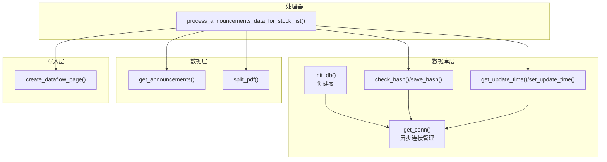
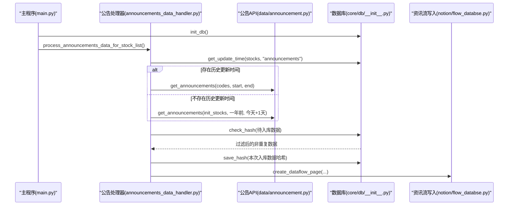
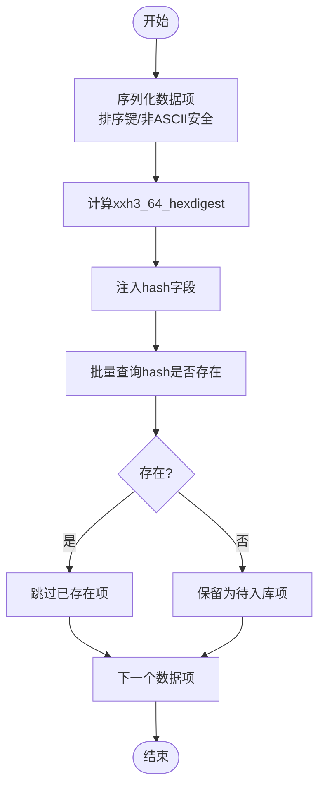
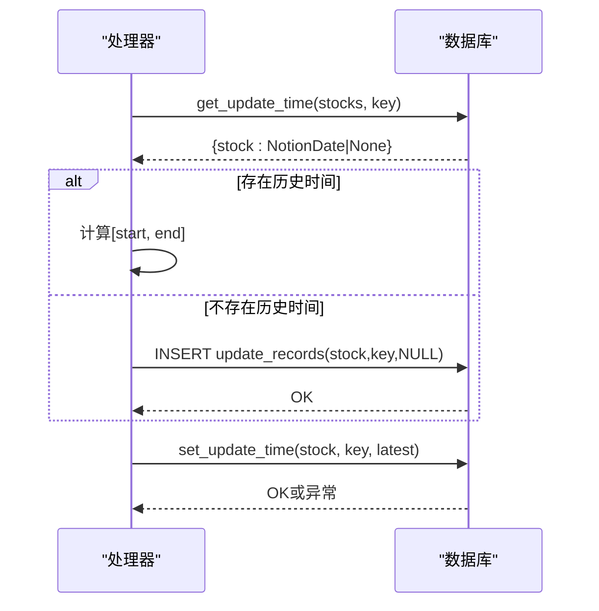
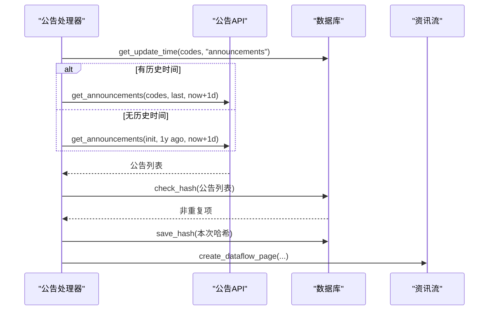
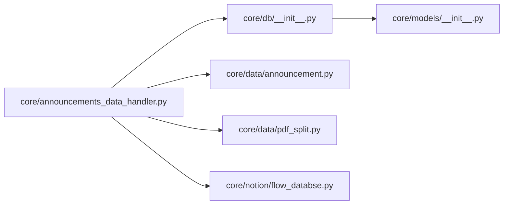
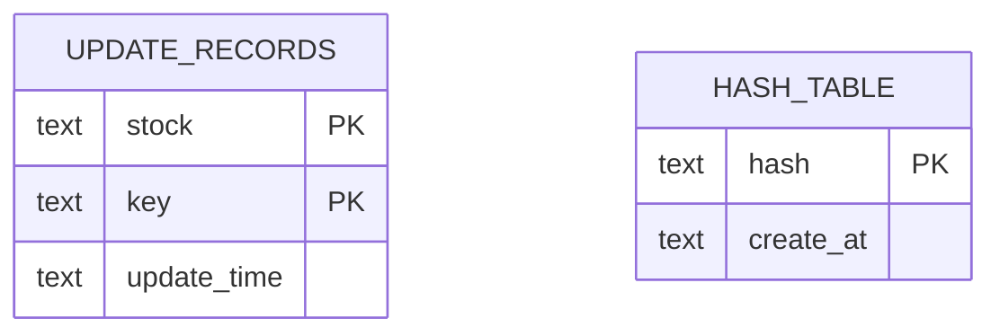
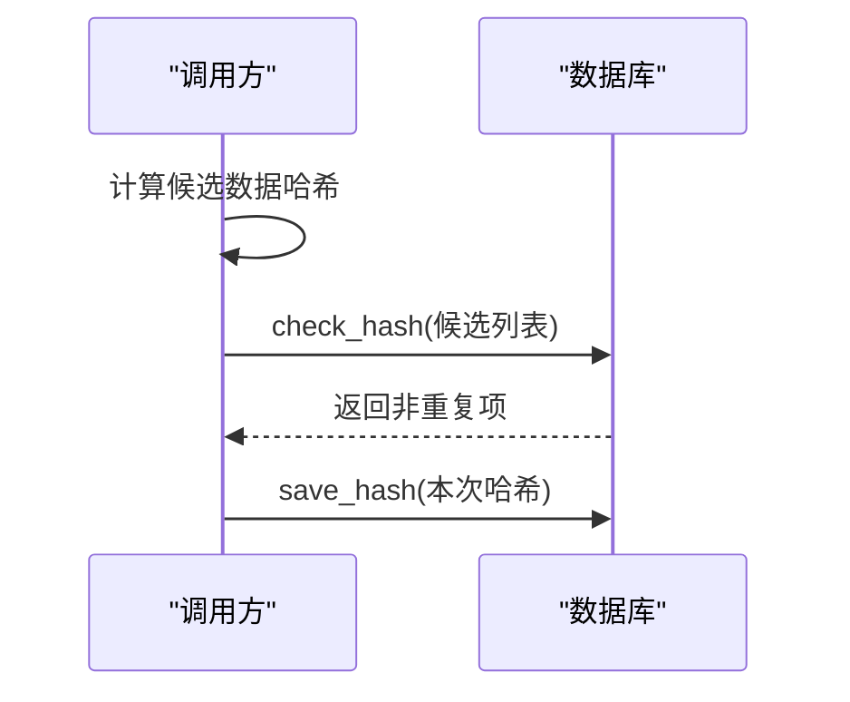

# 数据库管理模块

<cite>
**本文引用的文件**
- [core/db/__init__.py](file://core/db/__init__.py)
- [core/models/__init__.py](file://core/models/__init__.py)
- [core/data/announcement.py](file://core/data/announcement.py)
- [core/announcements_data_handler.py](file://core/announcements_data_handler.py)
- [core/data/pdf_split.py](file://core/data/pdf_split.py)
- [core/notion/flow_databse.py](file://core/notion/flow_databse.py)
- [main.py](file://main.py)
</cite>

## 目录
1. [简介](#简介)
2. [项目结构](#项目结构)
3. [核心组件](#核心组件)
4. [架构总览](#架构总览)
5. [详细组件分析](#详细组件分析)
6. [依赖关系分析](#依赖关系分析)
7. [性能考量](#性能考量)
8. [故障排查指南](#故障排查指南)
9. [结论](#结论)
10. [附录](#附录)

## 简介
本文件面向数据库管理模块，系统性阐述以下主题：
- SQLite 数据库初始化与表结构设计
- 哈希去重机制与 xxhash 算法应用
- 更新时间管理策略与事务控制
- 公告处理流程中的数据库角色与数据流转
- 错误处理与备份策略建议
- 事务管理、并发与性能优化要点

目标是帮助初学者快速上手，同时为有经验的开发者提供深入的技术细节与最佳实践。

## 项目结构
数据库管理模块位于 core/db，围绕两个核心表与若干辅助方法构建：
- update_records：按股票+键维护更新时间
- hash：按哈希值去重，记录创建时间

模块还与数据层、处理器、Notion 写入层协同工作，形成"抓取→去重→写入"的闭环。

**图表来源**
- [core/db/__init__.py](file://core/db/__init__.py#L62-L94)
- [core/db/__init__.py](file://core/db/__init__.py#L97-L150)
- [core/db/__init__.py](file://core/db/__init__.py#L153-L215)
- [core/data/announcement.py](file://core/data/announcement.py#L36-L112)
- [core/announcements_data_handler.py](file://core/announcements_data_handler.py#L21-L116)
- [core/data/pdf_split.py](file://core/data/pdf_split.py#L15-L73)
- [core/notion/flow_databse.py](file://core/notion/flow_databse.py#L25-L67)

**章节来源**
- [core/db/__init__.py](file://core/db/__init__.py#L62-L94)
- [core/announcements_data_handler.py](file://core/announcements_data_handler.py#L21-L116)

## 核心组件
- 异步连接管理器：提供带自动提交/回滚的上下文管理器，保证事务安全与连接释放。
- 初始化函数：创建 update_records 与 hash 两张表。
- 哈希去重：计算内容哈希，查询已存在集合，过滤重复项；批量保存哈希。
- 更新时间管理：按股票+键读取/更新时间，缺失时预插入空值占位。
- 类型定义：NotionDate 为字符串别名，统一时间字段类型。
- HashContent TypedDict：定义哈希内容的数据结构，包含 data_type、content 和可选的 hash 字段。

**章节来源**
- [core/db/__init__.py](file://core/db/__init__.py#L28-L51)
- [core/db/__init__.py](file://core/db/__init__.py#L62-L94)
- [core/db/__init__.py](file://core/db/__init__.py#L97-L150)
- [core/db/__init__.py](file://core/db/__init__.py#L153-L215)
- [core/models/__init__.py](file://core/models/__init__.py#L1-L8)

## 架构总览
数据库管理模块在公告处理流程中的位置如下：

**图表来源**
- [main.py](file://main.py#L20-L35)
- [core/announcements_data_handler.py](file://core/announcements_data_handler.py#L21-L116)
- [core/data/announcement.py](file://core/data/announcement.py#L36-L112)
- [core/db/__init__.py](file://core/db/__init__.py#L97-L150)
- [core/notion/flow_databse.py](file://core/notion/flow_databse.py#L25-L67)

## 详细组件分析

### 数据库初始化与表结构
- 初始化流程
  - 通过单例连接创建 update_records 与 hash 两张表。
  - update_records 主键为 (stock, key)，用于区分不同数据源的更新边界。
  - hash 表以 hash 为主键，避免重复写入相同内容。
- 表结构要点
  - update_records：stock、key、update_time（文本）
  - hash：hash（文本主键）、create_at（文本）

**章节来源**
- [core/db/__init__.py](file://core/db/__init__.py#L62-L94)

### 异步连接管理与事务控制
- 连接管理
  - 单例连接缓存，首次使用时建立连接。
  - 上下文管理器在退出时自动 commit 或 rollback，异常时回滚并重新抛出。
- 事务特性
  - 每个 get_conn() 使用块内执行多条 SQL，异常即回滚，保证原子性。
  - 批量写入使用 executemany，减少往返开销。

**章节来源**
- [core/db/__init__.py](file://core/db/__init__.py#L28-L51)
- [core/db/__init__.py](file://core/db/__init__.py#L54-L59)

### 哈希去重机制与 xxhash 应用
- 哈希计算
  - 对每个数据项进行 JSON 序列化（排序键、非 ASCII 安全），再计算 xxh3_64_hexdigest。
  - 将 hash 字段注入数据项，便于后续查询与入库。
- 去重流程
  - 计算候选集哈希 → 查询数据库已存在集合 → 过滤出不存在项。
- 批量保存
  - 统一记录当前时间（ISO 字符串），便于审计与清理。

**图表来源**
- [core/db/__init__.py](file://core/db/__init__.py#L97-L128)
- [core/db/__init__.py](file://core/db/__init__.py#L131-L150)

**章节来源**
- [core/db/__init__.py](file://core/db/__init__.py#L97-L150)

### 更新时间管理策略
- 读取策略
  - 批量查询指定股票与键的更新时间；若缺失，预插入 NULL 占位，保证后续更新可用。
- 更新策略
  - 严格校验更新影响行数，若为 0 则抛出异常，防止错误的"先更新后查询"逻辑。
- 时间类型
  - 使用 NotionDate 字符串类型，统一跨模块的时间表达。

**图表来源**
- [core/db/__init__.py](file://core/db/__init__.py#L153-L185)
- [core/db/__init__.py](file://core/db/__init__.py#L188-L215)
- [core/models/__init__.py](file://core/models/__init__.py#L1-L8)

**章节来源**
- [core/db/__init__.py](file://core/db/__init__.py#L153-L215)
- [core/models/__init__.py](file://core/models/__init__.py#L1-L8)

### 公告处理流程中的数据库角色
- 数据抓取
  - 处理器根据各股票的上次更新时间分组请求，减少接口调用次数。
- 去重与入库
  - 对抓取结果进行哈希去重，仅入库新增内容，并批量保存哈希。
- 写入资讯流
  - 将去重后的公告写入 Notion 资讯流数据库，形成最终落点。

**图表来源**
- [core/announcements_data_handler.py](file://core/announcements_data_handler.py#L21-L116)
- [core/data/announcement.py](file://core/data/announcement.py#L36-L112)
- [core/db/__init__.py](file://core/db/__init__.py#L97-L150)
- [core/notion/flow_databse.py](file://core/notion/flow_databse.py#L25-L67)

**章节来源**
- [core/announcements_data_handler.py](file://core/announcements_data_handler.py#L21-L116)
- [core/data/announcement.py](file://core/data/announcement.py#L36-L112)
- [core/db/__init__.py](file://core/db/__init__.py#L97-L150)
- [core/notion/flow_databse.py](file://core/notion/flow_databse.py#L25-L67)

### PDF 分割与附件处理（与数据库协作）
- 大文件 PDF 分割
  - 对超过阈值且命中关键词的公告进行分页切割，生成多个子公告。
- 附件上传
  - 小于阈值或不需拆分的公告走外链直传；大文件走本地分页后上传。
- 数据库协作
  - 分割前后均参与哈希去重与写入流程，确保重复内容不入库。

**章节来源**
- [core/data/pdf_split.py](file://core/data/pdf_split.py#L15-L73)
- [core/announcements_data_handler.py](file://core/announcements_data_handler.py#L66-L93)

## 依赖关系分析
- 模块耦合
  - 数据库模块被处理器与写入层间接依赖，耦合度低，职责清晰。
  - 哈希去重与更新时间管理相互独立，分别服务于"去重"和"增量"两类需求。
- 外部依赖
  - aiosqlite 提供异步 SQLite 访问。
  - xxhash 提供高性能、低碰撞的 64 位哈希。
  - httpx/pymupdf 用于网络与 PDF 处理，间接影响数据库写入压力。

**图表来源**
- [core/db/__init__.py](file://core/db/__init__.py#L1-L23)
- [core/models/__init__.py](file://core/models/__init__.py#L1-L8)
- [core/announcements_data_handler.py](file://core/announcements_data_handler.py#L1-L17)
- [core/data/announcement.py](file://core/data/announcement.py#L1-L10)
- [core/data/pdf_split.py](file://core/data/pdf_split.py#L1-L12)
- [core/notion/flow_databse.py](file://core/notion/flow_databse.py#L1-L12)

**章节来源**
- [core/db/__init__.py](file://core/db/__init__.py#L1-L23)
- [core/models/__init__.py](file://core/models/__init__.py#L1-L8)
- [core/announcements_data_handler.py](file://core/announcements_data_handler.py#L1-L17)
- [core/data/announcement.py](file://core/data/announcement.py#L1-L10)
- [core/data/pdf_split.py](file://core/data/pdf_split.py#L1-L12)
- [core/notion/flow_databse.py](file://core/notion/flow_databse.py#L1-L12)

## 性能考量
- 哈希去重
  - 使用 xxh3_64_hexdigest 快速计算哈希，避免重复入库。
  - 批量查询与批量插入，减少网络往返与锁竞争。
- 查询优化
  - IN(...) 查询已存在哈希，结合集合去重，时间复杂度近似 O(n)。
- 事务与并发
  - 每个 get_conn() 为原子块，适合高并发下的短事务。
  - 建议在高频写入场景下合并任务批次，降低写放大。
- I/O 优化
  - PDF 分割与网络下载在数据库之外完成，数据库仅承担轻量级索引与去重。

**章节来源**
- [core/db/__init__.py](file://core/db/__init__.py#L97-L150)
- [core/data/pdf_split.py](file://core/data/pdf_split.py#L15-L73)

## 故障排查指南
- 事务回滚
  - 若在 get_conn() 块内抛出异常，事务自动回滚；检查上游调用是否捕获并记录异常。
- 更新时间异常
  - set_update_time 未匹配到记录会抛出异常，确认是否先调用 get_update_time 并预插入占位。
- 哈希冲突
  - xxhash 为 64 位哈希，碰撞概率极低；如遇冲突，可考虑引入盐值或升级算法。
- 外部依赖问题
  - httpx/pymupdf 失败会导致数据抓取/分割中断，需检查网络与磁盘空间。
- 日志与可观测性
  - 在关键路径增加日志，定位慢查询与异常点。

**章节来源**
- [core/db/__init__.py](file://core/db/__init__.py#L28-L51)
- [core/db/__init__.py](file://core/db/__init__.py#L188-L215)
- [core/data/pdf_split.py](file://core/data/pdf_split.py#L68-L73)

## 结论
数据库管理模块通过两张表与简洁的 API，实现了高效的增量更新与内容去重。配合公告处理流程，形成"抓取→去重→写入"的稳定闭环。建议在生产环境中：
- 明确备份策略（定期复制数据库文件）
- 为高频写入场景设计批处理与队列
- 对外部依赖失败进行降级与重试
- 持续监控哈希去重效果与数据库增长趋势

## 附录

### 数据模型图

**图表来源**
- [core/db/__init__.py](file://core/db/__init__.py#L77-L93)

### 关键流程时序图（哈希去重）

**图表来源**
- [core/db/__init__.py](file://core/db/__init__.py#L97-L150)

### HashContent 类型定义
数据库模块新增了完整的哈希内容类型定义，用于规范哈希去重的数据结构：

- **data_type**: 字符串，标识数据类型
- **content**: 字符串，包含用于哈希计算的内容
- **hash**: 可选字符串，存储计算得到的哈希值

这个类型定义确保了哈希去重操作的一致性和类型安全。

**章节来源**
- [core/db/__init__.py](file://core/db/__init__.py#L19-L23)

### 公共API导出
数据库模块现在明确导出了所有公共API，便于模块间的导入和使用：

- `get_conn`: 异步连接管理器
- `get_update_time`: 获取更新时间
- `set_update_time`: 设置更新时间  
- `check_hash`: 检查哈希去重
- `save_hash`: 保存哈希记录

这些API构成了数据库管理模块的核心接口，为上层组件提供了完整的数据库操作能力。

**章节来源**
- [core/db/__init__.py](file://core/db/__init__.py#L217)