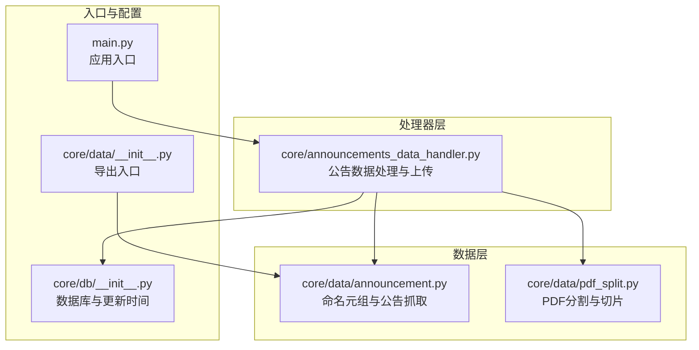
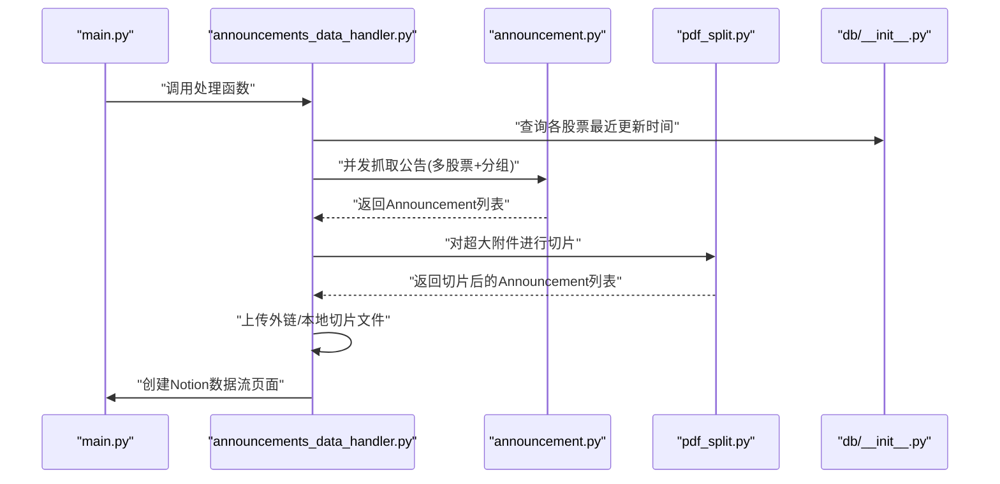
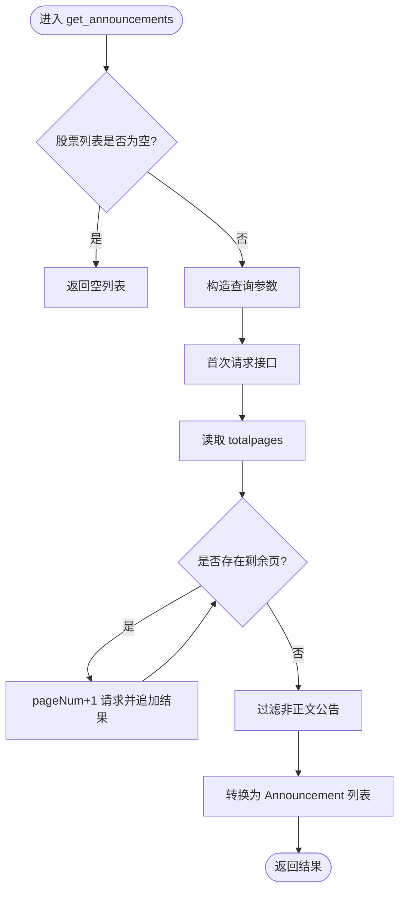
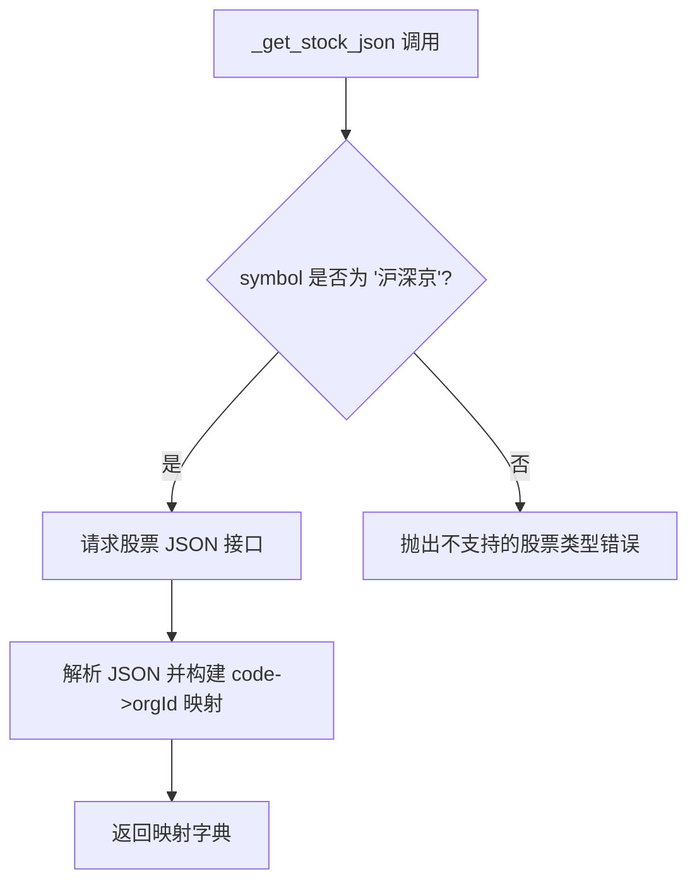
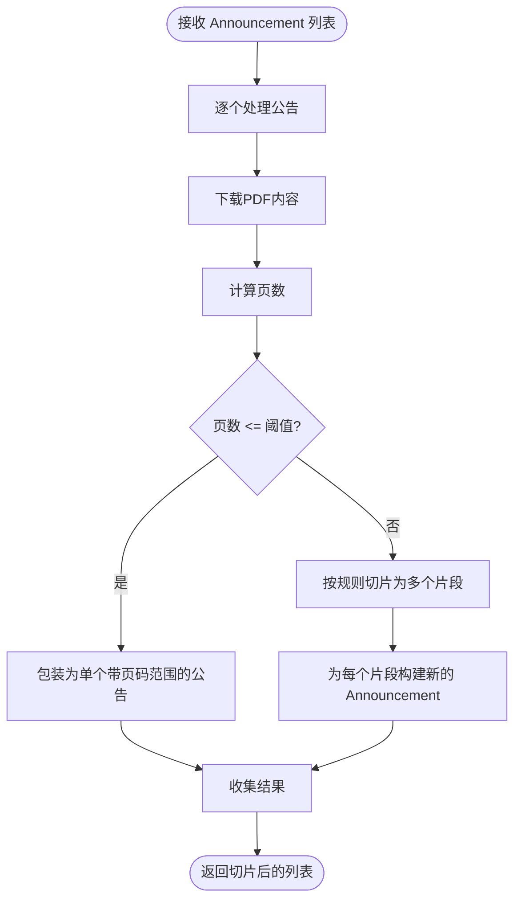
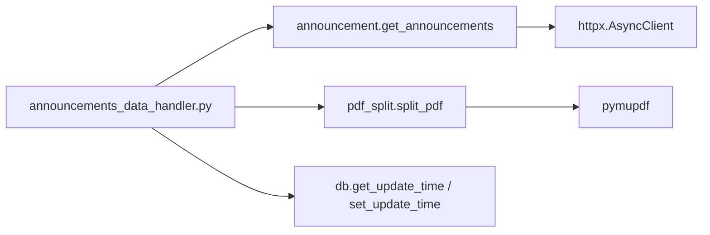

# 公告数据模型

<cite>
**本文引用的文件**
- [core/data/announcement.py](file://core/data/announcement.py)
- [core/data/pdf_split.py](file://core/data/pdf_split.py)
- [core/announcements_data_handler.py](file://core/announcements_data_handler.py)
- [core/data/__init__.py](file://core/data/__init__.py)
- [core/db/__init__.py](file://core/db/__init__.py)
- [main.py](file://main.py)
</cite>

## 目录
1. [引言](#引言)
2. [项目结构](#项目结构)
3. [核心组件](#核心组件)
4. [架构总览](#架构总览)
5. [详细组件分析](#详细组件分析)
6. [依赖关系分析](#依赖关系分析)
7. [性能考量](#性能考量)
8. [故障排查指南](#故障排查指南)
9. [结论](#结论)
10. [附录](#附录)

## 引言
本文件围绕公告数据模型与相关数据处理流程，系统性地阐述以下内容：
- Announcement 命名元组类的设计理念与字段语义
- get_announcements 函数的实现逻辑：与巨潮资讯网 API 的交互、分页处理、数据过滤与转换
- _get_stock_json 缓存装饰器在异步场景下的行为与注意事项
- 如何创建、使用与处理 Announcement 对象
- 异常处理策略、性能优化建议与最佳实践
- 与 Notion 数据流集成的整体流程

本文件兼顾初学者可读性与工程师深度需求，配合图示帮助理解。

## 项目结构
本项目采用按功能域划分的模块化组织方式，公告相关的核心代码集中在 core/data 子包，并由上层处理器协调执行与集成。

图表来源
- [core/data/announcement.py](file://core/data/announcement.py#L1-L141)
- [core/data/pdf_split.py](file://core/data/pdf_split.py#L1-L128)
- [core/announcements_data_handler.py](file://core/announcements_data_handler.py#L1-L116)
- [core/data/__init__.py](file://core/data/__init__.py#L1-L6)
- [core/db/__init__.py](file://core/db/__init__.py#L153-L196)
- [main.py](file://main.py#L1-L40)

章节来源
- [core/data/announcement.py](file://core/data/announcement.py#L1-L141)
- [core/data/pdf_split.py](file://core/data/pdf_split.py#L1-L128)
- [core/announcements_data_handler.py](file://core/announcements_data_handler.py#L1-L116)
- [core/data/__init__.py](file://core/data/__init__.py#L1-L6)
- [core/db/__init__.py](file://core/db/__init__.py#L153-L196)
- [main.py](file://main.py#L1-L40)

## 核心组件
- Announcement 命名元组类：封装公告的最小不可变数据单元，字段包括 id、stock、title、size、url、published_date，分别对应公告唯一标识、股票代码、标题、文件大小（KB）、下载链接、发布时间。
- get_announcements 异步函数：面向巨潮资讯网历史公告接口，负责构造查询参数、分页拉取、过滤非正文公告、转换为 Announcement 列表。
- _get_stock_json 缓存函数：提供股票代码到机构 ID 的映射，使用 LRU 缓存减少重复网络请求。
- PDF 分割工具：针对超大附件进行切片，便于后续上传与阅读。
- 上游处理器：按股票池与更新时间分组并发抓取公告，统一上传至 Notion 并创建数据流页面。

章节来源
- [core/data/announcement.py](file://core/data/announcement.py#L12-L33)
- [core/data/announcement.py](file://core/data/announcement.py#L36-L112)
- [core/data/announcement.py](file://core/data/announcement.py#L115-L140)
- [core/data/pdf_split.py](file://core/data/pdf_split.py#L15-L73)
- [core/announcements_data_handler.py](file://core/announcements_data_handler.py#L21-L116)

## 架构总览
下图展示了从入口到数据落库与 Notion 集成的端到端流程。

图表来源
- [main.py](file://main.py#L20-L39)
- [core/announcements_data_handler.py](file://core/announcements_data_handler.py#L21-L116)
- [core/data/announcement.py](file://core/data/announcement.py#L36-L112)
- [core/data/pdf_split.py](file://core/data/pdf_split.py#L15-L73)
- [core/db/__init__.py](file://core/db/__init__.py#L153-L196)

## 详细组件分析

### Announcement 命名元组类
- 设计理念
  - 不可变性：使用 NamedTuple 确保字段一旦创建不可修改，便于跨模块安全传递与比较。
  - 明确语义：每个字段都有清晰的业务含义，便于后续处理与展示。
- 字段定义与类型
  - id: str，巨潮资讯网公告唯一标识符
  - stock: str，股票代码或名称
  - title: str，公告标题
  - size: int，文件大小（KB）
  - url: str，公告文件下载链接
  - published_date: datetime，公告发布时间
- 使用建议
  - 作为只读数据载体，避免在下游修改字段
  - 在序列化/持久化前进行类型校验与清洗

章节来源
- [core/data/announcement.py](file://core/data/announcement.py#L12-L33)

### get_announcements 实现逻辑
- 输入参数
  - stock_list: 股票代码列表
  - start_date: 查询起始日期
  - end_date: 查询结束日期
- 关键步骤
  - 参数构造：将股票代码与机构 ID 组合为接口要求的格式；设置分页参数与时间区间
  - 首次请求与分页：根据 totalpages 进行循环请求，拼接所有公告
  - 数据过滤：剔除“摘要”“英文版”“图文版”等非正文公告
  - 数据转换：映射字段为 Announcement 字段，修正 URL 与时间戳
- 错误处理
  - 若 stock_list 为空，直接返回空列表
  - 接口异常由上层调用方捕获（如在处理器中统一处理）

图表来源
- [core/data/announcement.py](file://core/data/announcement.py#L36-L112)

章节来源
- [core/data/announcement.py](file://core/data/announcement.py#L36-L112)

### _get_stock_json 与缓存装饰器
- 功能概述
  - 提供“沪深京”股票类型到机构 ID 的映射，用于构造查询参数
  - 使用 LRU 缓存装饰器缓存结果，避免重复网络请求
- 异步与缓存的注意事项
  - 当前实现使用 @lru_cache 装饰异步函数，这在 Python 中通常不会按预期工作（LRU 缓存基于同步函数的签名）
  - 建议改为显式缓存容器或在调用侧缓存结果，以确保缓存命中
- 支持扩展
  - 可增加“港股”等类型分支，但需确认接口可用性

图表来源
- [core/data/announcement.py](file://core/data/announcement.py#L115-L140)

章节来源
- [core/data/announcement.py](file://core/data/announcement.py#L115-L140)

### PDF 分割与切片
- 目标
  - 将超大 PDF 附件按固定页数切片，便于上传与阅读
- 关键点
  - 页数阈值与重叠页控制，保证切片连续且不丢失关键信息
  - 切片后仍保留原始 URL 与大小估算，便于后续上传与索引
- 异常处理
  - 分割失败时记录错误并回退为原始公告，保证流程健壮性

图表来源
- [core/data/pdf_split.py](file://core/data/pdf_split.py#L15-L73)

章节来源
- [core/data/pdf_split.py](file://core/data/pdf_split.py#L15-L73)

### 与 Notion 的集成与数据流创建
- 流程概览
  - 按股票池与更新时间分组并发抓取公告
  - 对超大附件进行切片，其余走外链直传
  - 统一上传后创建数据流页面，建立与股票的关系
- 关键实现
  - 并发任务管理与结果聚合
  - 上传任务与页面创建的并行执行
  - 使用 source_api 标记数据来源，便于溯源

章节来源
- [core/announcements_data_handler.py](file://core/announcements_data_handler.py#L21-L116)

## 依赖关系分析
- 内部依赖
  - announcements_data_handler 依赖 announcement.get_announcements 与 pdf_split.split_pdf
  - 数据导出入口由 core/data/__init__.py 暴露
  - 数据库接口提供更新时间查询与写入
- 外部依赖
  - httpx：异步 HTTP 客户端
  - pymupdf：PDF 解析与切片
  - notion_client：Notion API（在其他模块中使用）

图表来源
- [core/announcements_data_handler.py](file://core/announcements_data_handler.py#L1-L17)
- [core/data/announcement.py](file://core/data/announcement.py#L1-L9)
- [core/data/pdf_split.py](file://core/data/pdf_split.py#L1-L7)

章节来源
- [core/announcements_data_handler.py](file://core/announcements_data_handler.py#L1-L17)
- [core/data/announcement.py](file://core/data/announcement.py#L1-L9)
- [core/data/pdf_split.py](file://core/data/pdf_split.py#L1-L7)

## 性能考量
- 并发与批量化
  - 按更新时间分组，合并多股票查询，减少接口调用次数
  - 使用 asyncio.gather 并行处理多个抓取任务
- 缓存策略
  - _get_stock_json 的缓存装饰器在异步场景下不生效，建议改为显式缓存
- I/O 优化
  - PDF 切片采用内存缓冲，避免磁盘 IO；合理设置切片页数与重叠页
- 网络与限流
  - 控制并发度，避免触发目标接口限流
  - 对网络异常进行重试与降级处理（可在上层处理器中补充）

## 故障排查指南
- 常见问题
  - 接口返回为空：检查日期范围与股票列表是否有效
  - PDF 切片失败：确认网络可达与 PDF 可读性，查看日志错误
  - Notion 上传失败：核对令牌与权限，检查文件大小与类型限制
- 日志与调试
  - 使用日志级别 DEBUG 观察抓取与切片过程
  - 在处理器中对异常进行捕获并记录上下文信息
- 数据一致性
  - 使用数据库记录各股票的更新时间，避免重复抓取
  - 对已存在哈希的数据进行去重（如适用）

章节来源
- [core/data/pdf_split.py](file://core/data/pdf_split.py#L68-L71)
- [core/db/__init__.py](file://core/db/__init__.py#L153-L196)
- [main.py](file://main.py#L15-L17)

## 结论
本文档系统梳理了公告数据模型与处理流程，重点解释了 Announcement 的设计、get_announcements 的实现细节、_get_stock_json 的缓存机制与改进建议，并给出了与 Notion 集成的端到端流程。建议在生产环境中强化缓存与异常处理策略，结合并发与批量化手段提升整体吞吐与稳定性。

## 附录

### 示例：创建与使用 Announcement
- 创建
  - 使用字段顺序或关键字参数实例化 Announcement
  - 注意字段类型与含义，尤其是时间戳与 URL 的规范化
- 使用
  - 在处理器中遍历列表，提取字段用于上传与页面创建
  - 对超大附件进行切片后再上传

章节来源
- [core/data/announcement.py](file://core/data/announcement.py#L12-L33)
- [core/announcements_data_handler.py](file://core/announcements_data_handler.py#L66-L113)