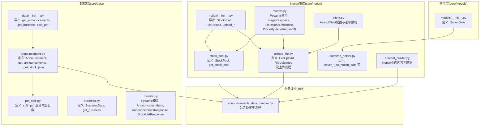
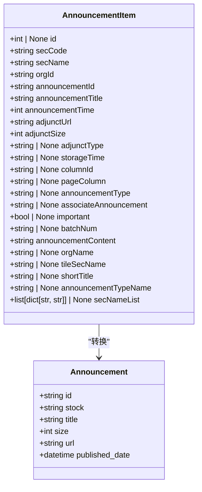
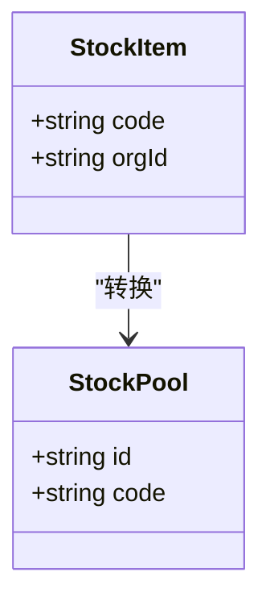
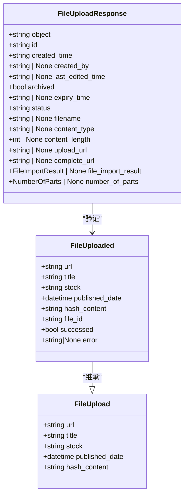
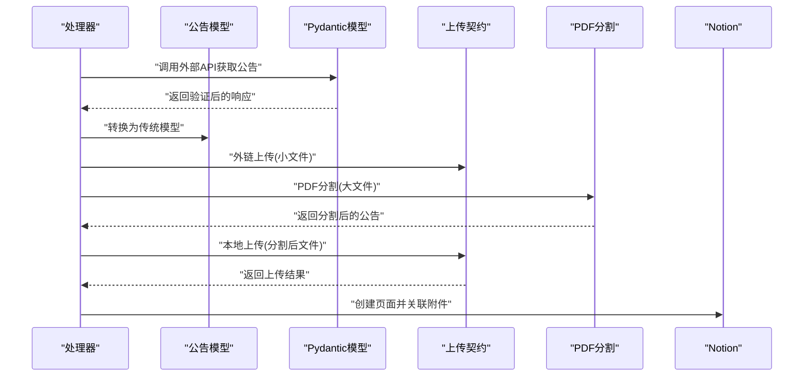
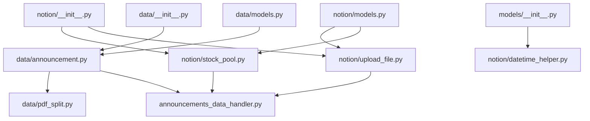

# 数据模型定义

<cite>
**本文引用的文件**
- [core/data/models.py](file://core/data/models.py)
- [core/notion/models.py](file://core/notion/models.py)
- [core/data/announcement.py](file://core/data/announcement.py)
- [core/data/pdf_split.py](file://core/data/pdf_split.py)
- [core/data/business.py](file://core/data/business.py)
- [core/data/__init__.py](file://core/data/__init__.py)
- [core/models/__init__.py](file://core/models/__init__.py)
- [core/notion/stock_pool.py](file://core/notion/stock_pool.py)
- [core/notion/upload_file.py](file://core/notion/upload_file.py)
- [core/notion/__init__.py](file://core/notion/__init__.py)
- [core/announcements_data_handler.py](file://core/announcements_data_handler.py)
- [core/notion/datetime_helper.py](file://core/notion/datetime_helper.py)
- [core/notion/client.py](file://core/notion/client.py)
- [core/notion/content_builder.py](file://core/notion/content_builder.py)
</cite>

## 更新摘要
**所做更改**
- 新增Pydantic数据模型系统的完整引入和使用说明
- 更新Announcement模型以使用新的Pydantic模型进行API验证
- 新增Notion API数据模型的详细说明和使用示例
- 更新文件上传流程以使用新的Pydantic模型进行数据验证
- 新增数据模型验证和序列化最佳实践指导

## 目录
1. [简介](#简介)
2. [项目结构](#项目结构)
3. [核心组件](#核心组件)
4. [架构总览](#架构总览)
5. [详细组件分析](#详细组件分析)
6. [依赖关系分析](#依赖关系分析)
7. [性能考量](#性能考量)
8. [故障排查指南](#故障排查指南)
9. [结论](#结论)
10. [附录](#附录)

## 简介
本文件聚焦于数据模型定义模块，系统性阐述以下核心数据结构与流程：
- Announcement：公告信息的数据模型，用于承载公告的标识、股票关联、标题、文件大小、下载地址与发布时间等关键字段。
- StockPool：股票池的数据模型，用于描述股票在数据源中的唯一标识与其代码。
- FileUpload/FileUploaded：文件上传的数据契约，用于描述待上传文件与上传结果的结构化信息。

**更新** 本版本重点介绍了Pydantic数据模型系统的引入，包括外部API响应模型和Notion API数据模型的完整定义，提供类型安全的API验证和数据结构定义。

文档将结合实际代码路径，说明字段设计、类型注解、序列化/反序列化思路、模型间关系与依赖、在公告处理、股票池管理与文件上传中的具体应用，并给出最佳实践与排障建议。

## 项目结构
数据模型相关代码主要分布在以下位置：
- core/data：公告、业务、PDF分割等数据层模型与工具
- core/models：类型别名与通用类型定义
- core/notion：Notion集成（股票池、文件上传、内容构建等）
- core/announcements_data_handler：公告数据处理主流程，串联数据模型与Notion集成



**图表来源**
- [core/data/announcement.py](file://core/data/announcement.py#L1-L180)
- [core/data/pdf_split.py](file://core/data/pdf_split.py#L1-L164)
- [core/data/business.py](file://core/data/business.py#L1-L94)
- [core/data/__init__.py](file://core/data/__init__.py#L1-L6)
- [core/models/__init__.py](file://core/models/__init__.py#L1-L8)
- [core/notion/stock_pool.py](file://core/notion/stock_pool.py#L1-L69)
- [core/notion/upload_file.py](file://core/notion/upload_file.py#L1-L313)
- [core/notion/__init__.py](file://core/notion/__init__.py#L1-L23)
- [core/announcements_data_handler.py](file://core/announcements_data_handler.py)
- [core/notion/datetime_helper.py](file://core/notion/datetime_helper.py)
- [core/notion/models.py](file://core/notion/models.py#L1-L871)
- [core/data/models.py](file://core/data/models.py#L1-L109)
- [core/notion/client.py](file://core/notion/client.py#L1-L60)
- [core/notion/content_builder.py](file://core/notion/content_builder.py#L1-L116)

**章节来源**
- [core/data/__init__.py](file://core/data/__init__.py#L1-L6)
- [core/notion/__init__.py](file://core/notion/__init__.py#L1-L23)

## 核心组件
本节对三个核心数据模型进行深入解析，包括字段定义、类型注解、验证规则、序列化/反序列化思路与使用场景。

**更新** 新增Pydantic数据模型系统的介绍，包括外部API响应模型和Notion API数据模型的完整定义。

### 外部API响应模型（Pydantic）

#### AnnouncementItem（公告项模型）
- 字段与类型
  - id: int | None（公告ID）
  - secCode: str（股票代码）
  - secName: str（股票简称）
  - orgId: str（机构ID）
  - announcementId: str（公告唯一标识）
  - announcementTitle: str（公告标题）
  - announcementTime: int（公告时间毫秒时间戳）
  - adjunctUrl: str（附件相对路径）
  - adjunctSize: int（附件大小KB）
  - adjunctType: str | None（附件类型）
  - storageTime: str | None（存储时间）
  - columnId: str | None（栏目ID）
  - pageColumn: str | None（页面栏目）
  - announcementType: str | None（公告类型）
  - associateAnnouncement: str | None（关联公告）
  - important: bool | None（重要性标记）
  - batchNum: str | None（批次号）
  - announcementContent: str（公告内容，默认空字符串）
  - orgName: str | None（机构名称）
  - tileSecName: str | None（标题股票名称）
  - shortTitle: str | None（短标题）
  - announcementTypeName: str | None（公告类型名称）
  - secNameList: list[dict[str, str]] | None（股票名称列表）
- 设计理念
  - 使用Pydantic BaseModel提供类型安全和自动验证
  - 通过extra="ignore"忽略未定义字段，提高兼容性
  - 支持可选字段和默认值，适应API响应的不确定性
- 验证规则
  - 自动类型检查和转换
  - 字段存在性验证
  - 时间戳转换为datetime对象
- 序列化/反序列化
  - 使用model_validate进行数据验证和转换
  - 自动生成JSON序列化支持

#### AnnouncementsResponse（公告响应模型）
- 字段与类型
  - classifiedAnnouncements: object | None（分类公告）
  - totalSecurities: int（总证券数，默认0）
  - totalAnnouncement: int（公告总数，默认0）
  - totalRecordNum: int（总记录数，默认0）
  - announcements: list[AnnouncementItem] | None（公告列表）
  - categoryList: list[object] | None（分类列表）
  - hasMore: bool（是否有更多，默认False）
  - totalpages: int（总页数，默认0）
- 设计理念
  - 完整封装API响应结构
  - 支持分页查询和数据聚合
  - 提供统一的响应处理接口

#### StockItem（股票项模型）
- 字段与类型
  - code: str（股票代码）
  - orgId: str（机构ID）
- 设计理念
  - 精简的股票信息模型
  - 仅包含必需字段
  - 支持额外字段忽略

#### StockListResponse（股票列表响应模型）
- 字段与类型
  - stockList: list[StockItem]（股票列表）
- 设计理念
  - 简化的响应结构
  - 明确的列表容器

### Notion API数据模型（Pydantic）

#### PageResponse（页面响应模型）
- 字段与类型
  - object: Literal["page"]（对象类型，默认"page"）
  - id: str（页面ID）
  - created_time: str（创建时间）
  - last_edited_time: str（最后编辑时间）
  - created_by: PartialUser（创建者）
  - last_edited_by: PartialUser（最后编辑者）
  - archived: bool（是否归档，默认False）
  - in_trash: bool（是否在回收站，默认False）
  - url: str（页面URL）
  - public_url: str | None（公开URL）
  - parent: ParentResponse（父级对象）
  - properties: dict[str, PropertyValueResponse]（属性字典）
  - icon: IconResponse | None（图标）
  - cover: CoverResponse | None（封面）
- 设计理念
  - 完整的Notion页面对象建模
  - 支持丰富的属性类型
  - 提供统一的页面操作接口

#### FileUploadResponse（文件上传响应模型）
- 字段与类型
  - object: Literal["file_upload"]（对象类型，默认"file_upload"）
  - id: str（上传ID）
  - created_time: str（创建时间）
  - created_by: PartialUser | None（创建者）
  - last_edited_time: str | None（最后编辑时间）
  - archived: bool（是否归档，默认False）
  - expiry_time: str | None（过期时间）
  - status: Literal["pending", "uploading", "uploaded", "expired", "failed"]（状态）
  - filename: str | None（文件名）
  - content_type: str | None（内容类型）
  - content_length: int | None（内容长度）
  - upload_url: str | None（上传URL）
  - complete_url: str | None（完成URL）
  - file_import_result: FileImportResult | None（文件导入结果）
  - number_of_parts: NumberOfParts | None（分片数量）
- 设计理念
  - 完整的文件上传生命周期建模
  - 支持单次和分片上传
  - 提供详细的上传状态跟踪

#### PropertyValueRequest（属性请求模型）
- 字段与类型
  - 支持多种属性类型：TitlePropertyRequest、RichTextPropertyRequest、DatePropertyRequest、SelectPropertyRequest、RelationPropertyRequest、UrlPropertyRequest、FilesPropertyRequest
- 设计理念
  - 使用联合类型支持多种属性类型
  - 提供统一的属性设置接口
  - 支持复杂的属性组合

### 传统数据模型

#### Announcement（公告模型）
- 字段与类型
  - id: str（公告唯一标识）
  - stock: str（股票代码或名称）
  - title: str（公告标题）
  - size: int（文件大小，单位KB）
  - url: str（下载链接）
  - published_date: datetime（发布时间）
- 设计理念
  - 使用命名元组确保不可变性与轻量结构，便于跨模块传递与缓存。
  - 字段覆盖公告处理所需的关键信息，便于后续在Notion中建立关系与索引。
- 验证规则
  - 通过调用方约束：如在获取公告时会过滤特定标题类型；在上传前按size阈值分流。
- 序列化/反序列化
  - 作为数据传输载体，通常通过构造函数直接实例化；在需要持久化时可转为字典或JSON（由上层逻辑决定）。
- 使用示例（路径）
  - 构造与使用：[Announcement构造与字段赋值](file://core/data/announcement.py#L11-L34)
  - 过滤与清洗：[标题过滤与URL拼接](file://core/data/announcement.py#L140-L152)

#### StockPool（股票池模型）
- 字段与类型
  - id: str（股票在数据源中的唯一标识）
  - code: str（股票代码）
- 设计理念
  - 精简结构，便于从数据源查询后快速映射为对象列表。
- 验证规则
  - 通过环境变量读取数据源ID，若为空则返回空列表；异常统一记录日志并向上抛出。
- 序列化/反序列化
  - 通过属性访问与zip组合生成列表，适合在流程中直接消费。
- 使用示例（路径）
  - 从数据源查询并构造：[get_stock_pool与StockPool构造](file://core/notion/stock_pool.py#L23-L65)

#### FileUpload / FileUploaded（文件上传契约）
- 字段与类型
  - FileUpload：url: str, title: str, stock: str, published_date: datetime, hash_content: str
  - FileUploaded：在FileUpload基础上扩展 file_id: str, successed: bool, error: str | None
- 设计理念
  - TypedDict定义契约，明确上传前后字段差异；继承扩展体现"上传完成"后的结果态。
  - 新增hash_content字段用于内容校验和去重。
- 验证规则
  - 上传流程中通过轮询状态判断成功/失败；失败时记录错误信息。
- 序列化/反序列化
  - 通过字典解包（**file_info）与字段合并，形成最终结果对象。
- 使用示例（路径）
  - 本地文件上传与轮询：[_upload_internal_and_wait与轮询](file://core/notion/upload_file.py#L95-L144)
  - 外链上传与轮询：[_upload_external_and_wait与轮询](file://core/notion/upload_file.py#L212-L255)
  - 结果聚合与统计：[upload_files_with_local与upload_files_with_url](file://core/notion/upload_file.py#L32-L208)

**章节来源**
- [core/data/models.py](file://core/data/models.py#L1-L109)
- [core/notion/models.py](file://core/notion/models.py#L1-L871)
- [core/data/announcement.py](file://core/data/announcement.py#L11-L180)
- [core/notion/stock_pool.py](file://core/notion/stock_pool.py#L10-L69)
- [core/notion/upload_file.py](file://core/notion/upload_file.py#L14-L313)

## 架构总览
下图展示了数据模型在公告处理流程中的角色与交互：

```mermaid
sequenceDiagram
participant Handler as "公告处理器<br/>announcements_data_handler.py"
participant Ann as "公告模型<br/>Announcement"
participant PydanticAnn as "Pydantic模型<br/>AnnouncementItem/Response"
participant Pool as "股票池模型<br/>StockPool"
participan Up as "文件上传契约<br/>FileUpload/FileUploaded"
participant Split as "PDF分割<br/>pdf_split.py"
participant Notion as "Notion集成"
Handler->>Pool : "获取股票池列表"
Handler->>PydanticAnn : "调用外部API获取公告"
PydanticAnn-->>Handler : "返回AnnouncementsResponse"
Handler->>Ann : "转换为传统Announcement模型"
Handler->>Up : "根据size与关键词筛选外链上传"
Handler->>Split : "对大文件进行PDF分割"
Split-->>Handler : "返回分割后的Announcement列表"
Handler->>Up : "本地上传(分割后文件)"
Up-->>Handler : "返回FileUploaded列表"
Handler->>Notion : "创建数据流页面并关联附件"
```

**图表来源**
- [core/announcements_data_handler.py](file://core/announcements_data_handler.py)
- [core/data/announcement.py](file://core/data/announcement.py#L59-L180)
- [core/data/models.py](file://core/data/models.py#L53-L109)
- [core/data/pdf_split.py](file://core/data/pdf_split.py#L13-L164)
- [core/notion/stock_pool.py](file://core/notion/stock_pool.py#L23-L69)
- [core/notion/upload_file.py](file://core/notion/upload_file.py#L32-L313)
- [core/notion/models.py](file://core/notion/models.py#L611-L641)

## 详细组件分析

### Announcement 组件分析
- 数据结构与字段
  - 不可变命名元组，字段覆盖公告全生命周期关键信息。
- 关键流程
  - 获取公告：按股票列表与日期区间查询，组装Announcement列表。
  - 股票映射：通过缓存的股票JSON映射股票代码与机构ID。
  - 过滤与清洗：剔除摘要/英文版/图文版等非正文类型。
  - **更新** 使用Pydantic模型进行API响应验证和转换。
- 复杂度与性能
  - 查询阶段为O(n)遍历与拼装；分页查询按totalpages迭代，总体受网络与接口限制。
- 错误处理
  - 对不支持的股票类型抛出异常；网络请求异常由上层捕获并记录日志。
- 使用示例（路径）
  - 查询与构造：[get_announcements与Announcement构造](file://core/data/announcement.py#L59-L152)
  - 股票映射缓存：[_get_stock_json与LRU缓存](file://core/data/announcement.py#L155-L180)
  - **更新** Pydantic验证：[model_validate使用](file://core/data/announcement.py#L115-L116)



**图表来源**
- [core/data/announcement.py](file://core/data/announcement.py#L11-L34)
- [core/data/models.py](file://core/data/models.py#L53-L93)

**章节来源**
- [core/data/announcement.py](file://core/data/announcement.py#L59-L180)
- [core/data/models.py](file://core/data/models.py#L53-L109)

### StockPool 组件分析
- 数据结构与字段
  - 不可变命名元组，仅包含id与code两个字段。
- 关键流程
  - 从环境变量读取数据源ID，查询数据源并解析为StockPool列表。
  - 异常统一记录日志并向上抛出，便于上层处理。
  - **更新** 使用Pydantic模型进行查询响应验证。
- 使用示例（路径)
  - 查询与构造：[get_stock_pool与StockPool构造](file://core/notion/stock_pool.py#L23-L65)



**图表来源**
- [core/notion/stock_pool.py](file://core/notion/stock_pool.py#L10-L21)
- [core/data/models.py](file://core/data/models.py#L26-L44)

**章节来源**
- [core/notion/stock_pool.py](file://core/notion/stock_pool.py#L23-L69)
- [core/data/models.py](file://core/data/models.py#L26-L44)

### FileUpload / FileUploaded 组件分析
- 数据结构与字段
  - FileUpload：url, title, stock, published_date, hash_content
  - FileUploaded：在FileUpload基础上扩展file_id, successed, error
- 关键流程
  - 本地上传：下载文件内容，直接上传至数据源，轮询状态直至完成。
  - 外链上传：提交外链，轮询状态直至完成。
  - 轮询策略：指数退避，最多等待固定时长。
  - **更新** 使用Pydantic模型进行文件上传响应验证。
- 使用示例（路径)
  - 本地上传与轮询：[_upload_internal_and_wait与轮询](file://core/notion/upload_file.py#L95-L144)
  - 外链上传与轮询：[_upload_external_and_wait与轮询](file://core/notion/upload_file.py#L212-L255)
  - 结果聚合与统计：[upload_files_with_local与upload_files_with_url](file://core/notion/upload_file.py#L32-L208)



**图表来源**
- [core/notion/upload_file.py](file://core/notion/upload_file.py#L14-L31)
- [core/notion/models.py](file://core/notion/models.py#L849-L871)

**章节来源**
- [core/notion/upload_file.py](file://core/notion/upload_file.py#L32-L313)
- [core/notion/models.py](file://core/notion/models.py#L849-L871)

### PDF分割与数据模型关系
- 功能概述
  - 对超过页数阈值的PDF进行分块，生成多个带页码范围的新公告对象，便于后续上传与索引。
- 关键流程
  - 下载PDF → 计算页数 → 分块 → 为每块生成新的Announcement对象。
- 与模型的关系
  - 输入输出均为Announcement列表，保持与公告处理流程的无缝衔接。
- 使用示例（路径)
  - 分割与生成新公告：[split_pdf与Announcement构造](file://core/data/pdf_split.py#L13-L101)


**图表来源**
- [core/data/pdf_split.py](file://core/data/pdf_split.py#L13-L101)

**章节来源**
- [core/data/pdf_split.py](file://core/data/pdf_split.py#L13-L164)

### 公告处理主流程（编排）
- 流程概述
  - 按股票池分组获取公告 → 外链与本地上传分流 → PDF分割（针对大文件） → 创建数据流页面并关联附件。
- 关键点
  - 时间分组：基于上次更新时间聚合请求，减少接口调用。
  - 条件上传：按size与关键词决定外链或本地上传。
  - 结果合并：将上传结果与原始公告一一对应，创建页面。
  - **更新** 使用Pydantic模型进行API响应验证，提高数据可靠性。
- 使用示例（路径)
  - 主流程与任务编排：[process_announcements_data_for_stock_list](file://core/announcements_data_handler.py)



**图表来源**
- [core/announcements_data_handler.py](file://core/announcements_data_handler.py)
- [core/data/announcement.py](file://core/data/announcement.py#L59-L152)
- [core/notion/upload_file.py](file://core/notion/upload_file.py#L32-L208)

**章节来源**
- [core/announcements_data_handler.py](file://core/announcements_data_handler.py)

## 依赖关系分析
- 模块内聚与耦合
  - Announcement与PDF分割存在直接依赖：split_pdf接收Announcement列表并返回新的Announcement列表。
  - 公告处理主流程同时依赖Announcement、StockPool、FileUpload/FileUploaded与Notion集成。
  - **更新** 新增Pydantic模型依赖，提供类型安全的API验证。
- 外部依赖
  - httpx用于HTTP请求；pymupdf用于PDF处理；pandas/akshare用于业务数据抓取。
  - **更新** Pydantic用于数据模型验证和序列化。
- 导出与可见性
  - data/__init__.py导出get_announcements、get_business、split_pdf；notion/__init__.py导出StockPool、FileUpload及相关上传函数。



**图表来源**
- [core/data/announcement.py](file://core/data/announcement.py#L1-L180)
- [core/data/pdf_split.py](file://core/data/pdf_split.py#L1-L164)
- [core/announcements_data_handler.py](file://core/announcements_data_handler.py)
- [core/notion/stock_pool.py](file://core/notion/stock_pool.py#L1-L69)
- [core/notion/upload_file.py](file://core/notion/upload_file.py#L1-L313)
- [core/models/__init__.py](file://core/models/__init__.py#L1-L8)
- [core/notion/datetime_helper.py](file://core/notion/datetime_helper.py)
- [core/notion/__init__.py](file://core/notion/__init__.py#L1-L23)
- [core/data/__init__.py](file://core/data/__init__.py#L1-L6)
- [core/data/models.py](file://core/data/models.py#L1-L109)
- [core/notion/models.py](file://core/notion/models.py#L1-L871)

**章节来源**
- [core/data/__init__.py](file://core/data/__init__.py#L1-L6)
- [core/notion/__init__.py](file://core/notion/__init__.py#L1-L23)

## 性能考量
- 网络与I/O
  - 公告查询与文件下载为瓶颈，建议合理设置并发与重试策略；PDF分割与上传采用异步与并发聚合。
  - **更新** Pydantic模型验证增加了一定的CPU开销，但提供了更好的数据质量保证。
- 缓存与复用
  - 股票映射使用LRU缓存，避免重复拉取；Notion轮询采用指数退避，平衡成功率与等待时间。
- 内存与CPU
  - PDF分割在内存中操作，注意控制单次分割块大小与页数，避免内存峰值过高。
  - **更新** Pydantic模型在处理大量数据时可能增加内存占用，需要合理配置模型参数。
- 建议
  - 在高并发场景下，对HTTP客户端连接池与PDF处理进行限流与资源回收。
  - 对上传失败的文件进行重试队列与失败归档，便于后续补传。
  - **更新** 考虑使用Pydantic的配置选项优化性能，如禁用严格模式或启用字段验证缓存。

## 故障排查指南
- 常见问题与定位
  - 股票类型不支持：检查股票类型参数与映射接口返回。
  - 数据源ID缺失：确认环境变量是否正确设置。
  - 上传失败：查看轮询返回的错误信息，区分网络/格式/权限等问题。
  - PDF分割异常：检查PDF页数与分块策略，必要时回退为整文件处理。
  - **更新** Pydantic验证失败：检查API响应格式是否符合模型定义。
- 日志与监控
  - 关键路径均记录INFO/ERROR日志，便于定位问题。
  - 上传完成后统计成功/失败数量，辅助评估整体健康度。
- 排障步骤（路径)
  - 股票池查询异常：[get_stock_pool异常处理](file://core/notion/stock_pool.py#L66-L69)
  - 上传失败日志与错误提取：[_upload_internal_and_wait/_upload_external_and_wait](file://core/notion/upload_file.py#L121-L144)
  - 轮询超时与错误：[_poll_upload_status](file://core/notion/upload_file.py#L257-L310)
  - **更新** Pydantic验证错误：[model_validate异常处理](file://core/data/announcement.py#L115-L116)

**章节来源**
- [core/notion/stock_pool.py](file://core/notion/stock_pool.py#L66-L69)
- [core/notion/upload_file.py](file://core/notion/upload_file.py#L121-L144)
- [core/notion/upload_file.py](file://core/notion/upload_file.py#L257-L310)
- [core/data/announcement.py](file://core/data/announcement.py#L115-L116)

## 结论
本文围绕Announcement、StockPool、FileUpload/FileUploaded三大数据模型，结合实际代码路径，系统阐述了字段设计、类型注解、验证与序列化思路、模型间关系与依赖，以及在公告处理、股票池管理与文件上传中的具体应用。

**更新** 本版本重点介绍了Pydantic数据模型系统的引入，包括外部API响应模型和Notion API数据模型的完整定义，提供了类型安全的API验证和数据结构定义。通过合理的数据模型与流程编排，实现了从数据采集、清洗、分割到页面创建的完整闭环。建议在生产环境中配合缓存、并发与重试机制，持续优化性能与稳定性。

## 附录
- 类型别名
  - NotionDate：字符串类型的NewType，用于统一Notion日期存储格式。
- 日期转换
  - cover_datetime_to_notion_date：将datetime/date转换为NotionDate字符串。
  - cover_notion_date_to_datetime：将NotionDate字符串还原为datetime对象。
- 导出清单
  - data/__init__.py导出：get_announcements、get_business、split_pdf
  - notion/__init__.py导出：StockPool、FileUpload、upload_files_with_local、upload_files_with_url
- **更新** Pydantic模型清单
  - 外部API模型：AnnouncementItem、AnnouncementsResponse、StockItem、StockListResponse
  - Notion API模型：PageResponse、FileUploadResponse、PropertyValueRequest、PropertyValueResponse等
  - 上传模型：CreateFileUploadLocalRequest、CreateFileUploadMultiPartRequest、CreateFileUploadExternalRequest

**章节来源**
- [core/models/__init__.py](file://core/models/__init__.py#L1-L8)
- [core/notion/datetime_helper.py](file://core/notion/datetime_helper.py)
- [core/data/__init__.py](file://core/data/__init__.py#L1-L6)
- [core/notion/__init__.py](file://core/notion/__init__.py#L1-L23)
- [core/data/models.py](file://core/data/models.py#L1-L109)
- [core/notion/models.py](file://core/notion/models.py#L1-L871)